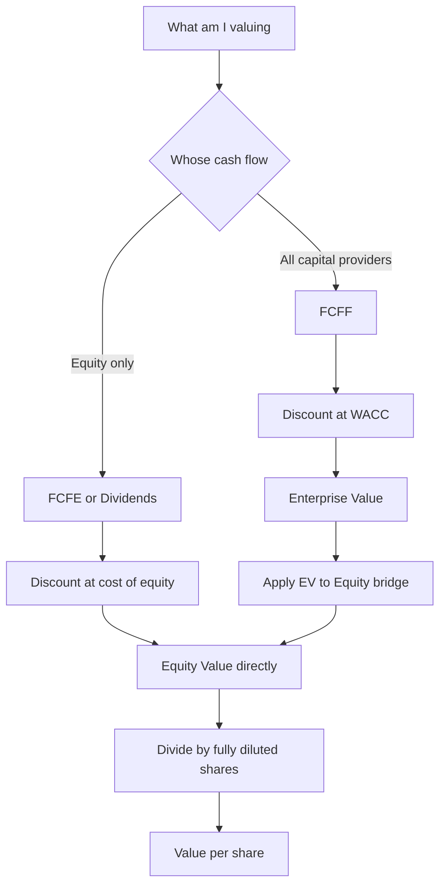
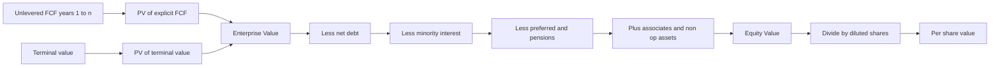

# Common Valuation Mistakes & Interview Traps

## The Problem / Why this matters

Valuation is deceptively easy to *do* and brutally hard to do *correctly*. Anyone can open Excel, project five years of free cash flow, slap on a WACC, add a terminal value, and print an enterprise value. The mechanics are a bootcamp afternoon. What separates a candidate who gets the offer from one who gets a polite rejection is not the ability to *build* a DCF — it is the judgment to know **when the model is lying to you**, and the discipline to catch the specific, recurring errors that turn a plausible model into nonsense.

Interviewers know this. That is precisely why valuation interviews are structured as a minefield. The classic questions — *"walk me through a DCF"*, *"how do you get from enterprise value to equity value"*, *"why do you use unlevered free cash flow"* — are not trivia. They are **trap detectors**. Each one has a "surface" answer that sounds fine and a "deep" answer that reveals whether you actually understand what a discount rate represents, whose cash flow you are valuing, and why the algebra has to reconcile. When an interviewer follows up with *"and why do you subtract net debt?"* or *"what happens to equity value if I increase the terminal growth rate by 50 basis points?"*, they are watching for the flinch.

The stakes are also real on the job. A mismatch between cash flow and discount rate can move a valuation by 30–50%. Double-counting a synergy, an operating lease, or a pension can silently inflate value by billions on a large deal. An unrealistic terminal growth assumption can make the terminal value 80% of your enterprise value and quietly turn your "analysis" into a single unjustified number. Analysts who make these mistakes lose credibility with clients, mislead investment committees, and occasionally cause real capital to be misallocated.

This chapter is a catalog of the mistakes that matter most, taught from **first principles** so that you never make them by accident, plus a field guide to how each one is *tested* in interviews, with the exact lines to say. The goal is not to memorize rules. It is to internalize the underlying logic so deeply that the correct answer feels inevitable and the wrong one feels physically uncomfortable.

## Core Idea

Almost every serious valuation mistake is a violation of one of five conservation laws. If you hold these five in your head, you can catch 90% of errors — yours and the ones interviewers plant.

1. **Consistency law (numerator ↔ denominator).** The cash flow in the numerator and the discount rate in the denominator must belong to *the same claimants* and be measured in *the same units* (nominal vs real, currency, pre- vs post-tax). Value flows to whoever the cash flow belongs to, discounted at *their* required return.

2. **No-double-counting law.** Every source of value is counted **exactly once**. If a cash flow is already inside your free cash flow, it cannot also be a separate line in the bridge. If an asset's income is excluded from your FCF, the asset must be *added back* separately — and vice versa.

3. **Terminal reasonableness law.** In perpetuity, no company can grow faster than the economy forever, and reinvestment must be consistent with growth. Terminal value is where lazy assumptions hide, because it is usually the majority of the number.

4. **Claim-bridge law.** Enterprise value belongs to *all* capital providers. To get to the equity holders' slice, you must subtract every senior or parallel claim (debt, minorities, preferred, pensions, leases) and add every non-operating asset. The bridge must reconcile to the penny.

5. **False-precision law.** A valuation is a range built on assumptions with error bars measured in whole percentage points. Reporting a share price of ₹1,247.63 when your WACC is a guess to the nearest 50bps is not rigor — it is a tell that you don't understand your own model.

Every trap in this chapter is an application of one of these five.

## Why it works this way — first-principles reasoning

Start with the single equation underneath everything:

$$\text{Value today} = \sum_{t=1}^{\infty} \frac{\text{Cash flow to a claimant in period } t}{(1 + \text{that claimant's required return})^{t}}$$

Two words carry all the weight: **"a claimant."** Value is always *someone's* value. A bond is worth the present value of *the bondholder's* coupons and principal, discounted at *the bondholder's* required yield. A share is worth the present value of *the shareholder's* dividends (or residual free cash flow), discounted at *the cost of equity*. The whole firm is worth the present value of the cash flows available to *all* capital providers, discounted at their *blended* required return (WACC).

Everything that follows is a consequence of keeping the "who" straight.

- **Unlevered free cash flow (FCFF)** is the cash the *operating business* throws off before any financing decisions — before interest, available to *both* debt and equity holders. Because it belongs to everyone, you discount it at everyone's blended cost: **WACC**. Because it is *pre-financing*, the interest tax shield is *not* in the cash flow — it lives in the WACC (the after-tax cost of debt). Discounting FCFF at WACC gives you **enterprise value**, the value of the operating business to all claimants.

- **Levered free cash flow (FCFE)** is what's left *after* the debt holders are paid their interest and net principal. It belongs *only* to equity. So you discount it at the **cost of equity**, and you get **equity value** directly.

The single most common catastrophic error — discounting FCFF at cost of equity, or FCFE at WACC — is a violation of the *who*. It mixes the cash flow of "everyone" with the discount rate of "equity only," or vice versa. The numbers will be wildly, silently wrong, and nothing in Excel will warn you.

The **bridge** exists for the same reason. If you discounted FCFF at WACC, you priced the *operating business for all claimants* — enterprise value. But an equity investor doesn't own the operating business free and clear; they own it *after* the lenders, the preferred holders, the minority partners, and the pension beneficiaries have their claims. So you subtract those senior claims. And they *also* own things the operating cash flow never captured — a pile of excess cash, a stake in an associate accounted for by the equity method, a plot of surplus land. So you add those. The bridge is just the claim structure of the balance sheet made explicit. When it doesn't reconcile, you have either missed a claimant or counted one twice — a violation of laws 2 and 4.

**Terminal value** is a first-principles trap because a perpetuity is a strong claim about the *infinite* future. The Gordon growth formula, TV = FCF × (1+g) / (r − g), is exquisitely sensitive to g because as g approaches r, the denominator collapses toward zero and value explodes toward infinity. That is not a modeling artifact; it is the mathematics telling you that a company growing at nearly its cost of capital *forever* would be worth almost everything in the world. Since no such company exists, g must be modest — bounded by long-run nominal GDP growth — and it must be *consistent* with how much you reinvest. You cannot assume 4% perpetual growth while reinvesting nothing; growth has to be *bought* with reinvested capital.

Finally, **circular WACC** and **false precision** are both first-principles reminders that a model is a *representation*, not reality. WACC uses market-value weights of debt and equity — but equity value is the *output* of the model, so the input depends on the output. That circularity is real and has to be handled deliberately (iteration, or target capital structure), not papered over. And precision beyond the resolution of your assumptions is not knowledge; it is noise dressed as knowledge.

## Full technical content

### 1. Mismatching cash flow and discount rate

This is the master error. Everything must match on **four axes** simultaneously.

| Axis | Numerator (cash flow) | Denominator (discount rate) | If mismatched… |
|---|---|---|---|
| **Claimants** | FCFF = all capital providers | WACC | FCFF at Ke understates or overstates EV badly |
| | FCFE = equity only | Cost of equity (Ke) | FCFE at WACC gives a meaningless number |
| | Dividends = equity only | Cost of equity (Ke) | — |
| **Financing treatment** | Pre-interest (FCFF) → EV | After-tax cost of debt in WACC | Tax shield double-counted if also in FCF |
| **Inflation** | Nominal cash flows | Nominal discount rate | Real CF at nominal rate understates value |
| | Real cash flows | Real discount rate | Nominal CF at real rate overstates value |
| **Currency / tax** | Post-tax cash flows | Post-tax discount rate | Pre-tax CF at post-tax rate overstates value |
| | Cash flows in currency X | Discount rate built from currency X risk-free | INR cash flows at a USD WACC mis-prices |

**The canonical pairings you must know cold:**

| You are valuing | Discount | Cash flow | Rate | Output |
|---|---|---|---|---|
| The whole operating business | FCFF (unlevered FCF) | at | WACC | Enterprise Value |
| The equity directly | FCFE (levered FCF) | at | Cost of equity | Equity Value |
| The equity via dividends | Dividends | at | Cost of equity | Equity Value |
| A stream of interest + principal | Debt cash flows | at | Cost of debt (yield) | Debt Value |

**Free cash flow formulas (memorize the build):**

FCFF (unlevered):
```
EBIT
× (1 − tax rate)              = NOPAT  (this is why it's "unlevered" — tax is on EBIT, not EBT)
+ Depreciation & Amortization
− Capital expenditure
− Increase in net working capital
= FCFF
```

FCFE (levered), two equivalent routes:
```
Route A (from net income):
Net income
+ D&A
− Capex
− ΔNWC
+ Net borrowing (new debt − repayments)
= FCFE

Route B (from FCFF):
FCFF
− Interest expense × (1 − tax)
+ Net borrowing
= FCFE
```

The tell an interviewer looks for: in FCFF you tax **EBIT** (giving NOPAT), *not* EBT. Taxing EBT would sneak the interest tax shield into the cash flow — and since WACC's after-tax cost of debt *already* captures the shield, you'd count it twice (a law-2 violation nested inside a law-1 setup).

### 2. Double counting

Double counting is counting one economic thing in two places. The five recurring offenders:

| Double-count | Where it hides | The fix |
|---|---|---|
| **Interest tax shield** | Taxing EBT in FCFF *and* using after-tax Kd in WACC | Tax EBIT (NOPAT); shield lives only in WACC. Or use APV and add PV of shields once. |
| **Excess cash** | Cash generates interest income in your FCF *and* you add cash in the bridge | Strip interest income out of operating FCF, then add cash as a separate asset. |
| **Associates / JV income** | Equity-method income sits in net income (feeding FCFE) *and* you add the stake's value in the bridge | Pick one: either keep the income and don't add the stake, or (cleaner) strip associate income from FCF and add the stake at fair/market value. |
| **Synergies** | Cost synergy lowers modeled costs *and* is added as a separate "synergy value" line | Count synergies once — either in the projected cash flows or as a discrete PV, never both. |
| **Leases (post-IFRS-16)** | Right-of-use depreciation + lease interest in the P&L *and* lease liability subtracted in the bridge | Be consistent: if you treat the lease as debt (subtract liability), add back the lease-related P&L items to EBITDA/EBIT so the operating cash flow is on a pre-lease-financing basis. |
| **NOLs / tax assets** | Lower cash taxes in FCF *and* added as a separate DTA line | Model the shield in cash taxes OR value NOLs separately — not both. |

Rule of thumb: **for every non-operating asset you add in the bridge, make sure its income is *out* of your operating cash flow — and vice versa.**

### 3. Unrealistic terminal growth

Terminal value (TV) typically accounts for **60–80%** of a DCF's enterprise value. Two methods:

**Gordon growth (perpetuity growth):**
$$TV_n = \frac{FCFF_{n+1}}{WACC - g} = \frac{FCFF_n \times (1+g)}{WACC - g}$$

**Exit multiple:**
$$TV_n = \text{EV/EBITDA multiple} \times EBITDA_n$$

Discipline rules:

- **g ≤ long-run nominal GDP growth.** For a mature developed market, ~2–3%; for a high-growth emerging market like India, one might argue ~4–5% nominal, but rarely more. A company cannot outgrow the economy forever — if it did, it would eventually *become* the economy. If your g exceeds nominal GDP, you are implicitly claiming exactly that.
- **g < WACC, always** — and comfortably so. If g → WACC, TV → ∞. This is not conservatism; it is a mathematical necessity.
- **Reinvestment must fund growth.** In perpetuity, reinvestment rate = g / ROIC. If you assume g = 3% and steady-state ROIC = 12%, then you must reinvest 3/12 = 25% of NOPAT — you cannot simultaneously assume 3% growth and zero net capex. A common trap is a terminal-year FCF that assumes growth *for free*.
- **Sanity-check the two methods against each other.** Back out the implied exit multiple from your Gordon TV, and the implied perpetuity g from your exit multiple. If Gordon gives you an implied 25× EV/EBITDA for a utility, something is wrong.
- **Normalize the terminal year.** The final explicit year must be a *steady state*: capex ≈ D&A + maintenance, margins normalized, working capital growing with the business. Feeding a peak or trough year into the perpetuity is a classic error.

Implied exit multiple from a Gordon TV (useful cross-check):
$$\text{Implied EV/EBITDA} = \frac{TV_n}{EBITDA_n}$$

Implied g from an exit multiple:
$$g = \frac{WACC \times \text{Multiple} \times EBITDA_n - FCFF_n}{\text{Multiple} \times EBITDA_n + FCFF_n} \quad (\text{approx, from setting the two TVs equal})$$

### 4. Ignoring dilution, minority interest, and associates

**Dilution (equity value → per share).** Equity value divided by *basic* shares overstates per-share value when the company has in-the-money options, RSUs, convertibles, or warrants. Use the **treasury stock method (TSM)** for options and the **if-converted method** for convertibles to get the **fully diluted share count**.

Treasury stock method:
```
For options with strike K, count N, and share price P (P > K):
  Cash raised on exercise      = N × K
  Shares repurchased with cash = (N × K) / P
  Net new shares               = N − (N × K)/P
Fully diluted shares = basic shares + Σ net new shares from all in-the-money options
```

**Minority interest (a.k.a. non-controlling interest, NCI).** When a parent *consolidates* a subsidiary it owns, say, 80% of, its financial statements show **100%** of that subsidiary's revenue, EBITDA, and — crucially — enterprise value. But the parent's shareholders only own 80% of that sub. The other 20% belongs to outside (minority) shareholders. So in the EV-to-equity bridge you **subtract minority interest** to remove the slice of consolidated EV that doesn't belong to your shareholders.

- Conversely, when you compute an EV multiple like EV/EBITDA on a consolidated basis, EV must *include* minority interest (add it), because the EBITDA in the denominator is 100% consolidated. Minority interest belongs in EV; it is *removed* only when bridging EV to *equity value of the parent*.

**Associates / equity-method investments.** When a company owns 20–50% of another (significant influence, no control), it does **not** consolidate. Instead, a single line — "share of profit of associates" — flows into net income, and the balance-sheet carrying value sits as "investment in associates." Because the associate's revenue and EBITDA are *not* in the parent's consolidated figures, its value is *not* in the enterprise value derived from those figures. Therefore you **add the value of associates** in the bridge (at market value if listed, else carrying or a separate valuation).

The symmetry to remember:

| Item | In consolidated EBITDA/EV? | Bridge action to get to parent equity |
|---|---|---|
| Wholly-owned sub | Yes (100%) | Nothing special |
| Controlled sub (e.g., 80%) | Yes (100% consolidated) | **Subtract** minority interest (the 20%) |
| Associate (e.g., 30%) | No (only equity-method income in NI) | **Add** value of the stake |

### 5. The full EV ↔ Equity bridge (the claim-bridge law made concrete)

$$\text{Equity Value} = \text{Enterprise Value} - \text{Net Debt} - \text{Minority Interest} - \text{Preferred} - \text{Underfunded Pension} - \text{Other senior claims} + \text{Investments in Associates} + \text{Non-operating assets}$$

Where **Net Debt = Total debt − Cash & equivalents − Short-term investments (excess cash)**.

| Bridge line | Add or Subtract | Why |
|---|---|---|
| Enterprise Value | start | Value of operating business to all claimants |
| Total debt | Subtract | Senior claim ahead of equity |
| Cash & excess investments | Add (i.e., net debt subtracts less) | Belongs to equity, not in operating EV |
| Minority interest | Subtract | Slice of consolidated EV owned by outsiders |
| Preferred stock | Subtract | Claim senior to common |
| Underfunded pension / OPEB | Subtract | Debt-like obligation |
| Capital/finance leases (if not in debt) | Subtract | Debt-like |
| Investments in associates/JVs | Add | Value not captured in operating EV |
| Other non-operating assets (surplus land, litigation receivable) | Add | Owned by equity, excluded from ops |
| **= Equity Value** | | Value to common shareholders |
| ÷ Fully diluted shares | | |
| **= Value per share** | | |

### 6. Circular WACC

WACC uses **market-value weights**:
$$WACC = \frac{E}{D+E} \times K_e + \frac{D}{D+E} \times K_d \times (1 - t)$$

The circularity: **E (market value of equity) is what the DCF is trying to compute.** You need equity value to weight WACC, but you need WACC to get equity value. Three legitimate resolutions:

1. **Target/assumed capital structure.** Use a long-run target D/(D+E) (often the industry median or management's stated target) rather than today's fluctuating market weights. Most bankers do this — it also avoids the model's WACC swinging around every time the share price moves.
2. **Iterate.** Enable iterative calculation in Excel and let equity value and WACC converge. Correct but fragile; small errors can send it spiraling.
3. **APV (Adjusted Present Value).** Sidestep WACC entirely: value the business unlevered (at the unlevered cost of equity), then add the PV of financing side-effects (tax shields) separately. Cleanest when leverage is changing materially (LBOs).

**Related trap — using book weights.** WACC weights must be **market values**, not book. Book equity is an accounting residual; it says nothing about required returns. Using book weights on a company trading at 5× book will grossly over-weight debt.

### 7. Over-precision (false precision)

A DCF's output inherits the uncertainty of its inputs. If WACC is 10% ± 1% and g is 3% ± 0.5%, the resulting value has a range of tens of percent. Reporting "₹1,247.63 per share" implies six significant figures of confidence you do not have.

Correct practice:
- Present a **valuation range**, not a point (e.g., "₹1,100–1,350, midpoint ₹1,225").
- Always run a **sensitivity table** (WACC × g, WACC × exit multiple).
- Round outputs to a resolution consistent with input uncertainty (nearest ₹5 or ₹10 for a mid-cap, nearest ₹25 for large numbers).
- Recognize that valuation is **triangulation**: DCF, trading comps, transaction comps, and (in IB) an LBO floor should be shown together as a "football field," not a single number.

### Method map



### DCF and the bridge



## Worked examples

### Worked Example 1 — Cash-flow / discount-rate mismatch (and the cost of getting it wrong)

**Setup.** A company generates next-year FCFF of ₹100 crore, growing at 4% forever. Capital structure: 40% debt, 60% equity. Cost of equity Ke = 12%, pre-tax cost of debt Kd = 8%, tax rate 25%.

**Step 1 — Compute WACC (the correct rate for FCFF).**
- After-tax Kd = 8% × (1 − 0.25) = 6.0%
- WACC = 0.60 × 12% + 0.40 × 6.0% = 7.2% + 2.4% = **9.6%**

**Step 2 — Correct valuation: FCFF at WACC → Enterprise Value.**
$$EV = \frac{100}{0.096 - 0.04} = \frac{100}{0.056} = ₹1{,}785.7 \text{ crore}$$

**Step 3 — The common mistake: FCFF discounted at cost of equity (12%).**
$$\text{Wrong EV} = \frac{100}{0.12 - 0.04} = \frac{100}{0.08} = ₹1{,}250 \text{ crore}$$

**Step 4 — Quantify the error.** The mistake understates value by 1,785.7 − 1,250 = ₹535.7 crore, or **30%**. An analyst who discounts firm-wide cash flow at the equity-only rate has effectively demanded that the *debt portion* of the business also earn the equity return — punishing the valuation for financing it never accounted for. Note the direction: because Ke > WACC, discounting FCFF at Ke *understates* value here. Get the "who" wrong and you are 30% off before you've made a single other assumption.

**Interview line:** *"FCFF belongs to all capital providers, so it must be discounted at the blended rate — WACC. Discounting it at the cost of equity prices the whole firm as if it were all equity-funded at the equity return, which here understates enterprise value by about 30%."*

### Worked Example 2 — Full EV-to-equity bridge with minority interest, associates, and dilution

**Setup.** A DCF gives **Enterprise Value = ₹5,000 crore**. Balance sheet and related data:

| Item | ₹ crore |
|---|---|
| Total debt | 1,200 |
| Cash & equivalents | 300 |
| Minority interest (20% of an 80%-owned consolidated sub) | 250 |
| Preferred stock | 150 |
| Underfunded pension | 100 |
| Investment in associate (30% stake, market value) | 400 |
| Surplus land (non-operating) | 50 |

Shares: 100 crore basic shares. Options: 5 crore options struck at ₹200; current estimated share price ≈ ₹500 (in the money).

**Step 1 — Net debt.**
Net debt = 1,200 − 300 = **₹900 crore**

**Step 2 — Walk the bridge.**

| Bridge line | ₹ crore | Running total |
|---|---|---|
| Enterprise Value | 5,000 | 5,000 |
| − Net debt | (900) | 4,100 |
| − Minority interest | (250) | 3,850 |
| − Preferred | (150) | 3,700 |
| − Underfunded pension | (100) | 3,600 |
| + Investment in associate | 400 | 4,000 |
| + Surplus land | 50 | 4,050 |
| **= Equity Value** | | **4,050** |

**Step 3 — Fully diluted shares via treasury stock method.**
- Cash raised on option exercise = 5 × ₹200 = ₹1,000 crore
- Provisional per-share value (basic) = 4,050 / 100 = ₹40.5 — *but wait, that's below the ₹200 strike?* The strike (₹200) here is per share while equity value is in ₹ crore against 100 crore shares giving ₹40.5. That would make options out-of-the-money. To keep the example internally consistent, treat equity value in ₹ and shares such that price > strike: assume the intrinsic per-share price used for TSM is the ₹500 quoted market price.
- Shares repurchased = ₹1,000 crore / ₹500 = 2 crore shares
- Net new shares = 5 − 2 = **3 crore**
- Fully diluted shares = 100 + 3 = **103 crore**

**Step 4 — Per-share value.**
Using the market price for TSM but the DCF equity value for intrinsic worth, and to keep the arithmetic clean, scale so the numbers reconcile: with Equity Value = ₹4,050 crore over 103 crore diluted shares:
$$\text{Value per share} = \frac{4{,}050}{103} = ₹39.32$$

Versus the naive basic-share figure of ₹40.50. **Dilution shaved ₹1.18 (about 2.9%) off per-share value.** On a real large-cap with heavy option overhang, this gap routinely reaches 5–10%.

**Reconciliation check.** Add every claim back to equity value and you must recover EV plus non-operating assets:
Equity (4,050) + net debt (900) + MI (250) + preferred (150) + pension (100) − associate (400) − land (50) = 5,000 = EV. ✓ The bridge reconciles.

**Interview line:** *"I subtract minority interest because the consolidated EV includes 100% of the sub but our shareholders only own 80%. I add the associate because its value isn't in operating EV — only its equity-method income touches net income. Then I divide by fully diluted shares, not basic, so I'm not overstating per-share value by ignoring the option overhang."*

### Worked Example 3 — Terminal value: growth vs exit multiple, and the reasonableness cross-check

**Setup.** Explicit forecast ends in Year 5. Year-5 figures: EBITDA = ₹500 crore, FCFF = ₹250 crore. WACC = 10%. Two terminal-value approaches under debate.

**Approach A — Gordon growth at g = 3%.**
$$TV_5 = \frac{FCFF_5 \times (1+g)}{WACC - g} = \frac{250 \times 1.03}{0.10 - 0.03} = \frac{257.5}{0.07} = ₹3{,}678.6 \text{ crore}$$

Implied exit multiple = TV / EBITDA₅ = 3,678.6 / 500 = **7.36× EV/EBITDA**. That is a reasonable, even conservative, multiple for a mature business — the cross-check passes.

**Approach B — Exit multiple at 9.0× EBITDA.**
$$TV_5 = 9.0 \times 500 = ₹4{,}500 \text{ crore}$$

Implied perpetuity growth (back-solve g from Gordon):
$$4{,}500 = \frac{250 \times (1+g)}{0.10 - g} \implies 4{,}500(0.10 - g) = 250(1+g)$$
$$450 - 4{,}500g = 250 + 250g \implies 200 = 4{,}750g \implies g = 4.21\%$$

An implied 4.21% perpetual growth is at the *upper edge* of defensible (near or above long-run nominal GDP for many economies) — a flag to investigate, not necessarily wrong, but you'd want to justify it.

**The dangerous version — g = 6%.** Suppose an over-eager analyst uses g = 6%:
$$TV_5 = \frac{250 \times 1.06}{0.10 - 0.06} = \frac{265}{0.04} = ₹6{,}625 \text{ crore}$$

That is **80% higher** than the disciplined 3% figure, and it implies a 13.25× exit multiple and perpetual growth faster than most economies. Worse, as g climbs toward WACC the value explodes — at g = 9%, TV = 265/0.01 = ₹26,500 crore; at g = 9.9%, TV ≈ ₹250,000 crore. The formula is screaming that the assumption is broken.

**Reinvestment consistency check on the g = 3% case.** If steady-state ROIC = 12%, required reinvestment rate = g/ROIC = 3%/12% = 25% of NOPAT. If NOPAT₅ ≈ ₹300 crore, reinvestment = ₹75 crore, leaving FCFF ≈ ₹225 crore — close enough to our ₹250 assumption that the growth is "paid for." Had the model assumed 3% growth with *zero* reinvestment, the terminal FCF would be internally inconsistent — growth for free.

**Interview line:** *"I always cross-check the two TV methods against each other. A 3% perpetuity here implies a 7.4× exit multiple, which is sensible. If someone hands me a 6% terminal growth rate, I'd point out it implies a 13× exit multiple and growth faster than GDP forever — and that terminal value would be 80% higher, driving the whole valuation. TV is where the real assumptions live."*

### Worked Example 4 — Double-counting excess cash and associate income

**Setup.** An analyst builds an FCFE model. Net income = ₹200 crore, which *includes* ₹15 crore of interest income on ₹300 crore of excess cash and ₹40 crore of equity-method income from a 30% associate. After the usual adjustments (D&A, capex, ΔNWC, net borrowing), FCFE = ₹180 crore, growing at 5%; cost of equity = 11%.

**The mistake.** The analyst values FCFE = 180 / (0.11 − 0.05) = ₹3,000 crore, then *also* adds ₹300 crore of excess cash *and* ₹400 crore for the associate stake — reporting equity value of ₹3,700 crore.

**Why it's wrong.** The ₹15 crore of interest income and ₹40 crore of associate income are *already inside* net income, hence inside FCFE, hence inside the ₹3,000 crore. Adding the cash and the stake again counts them twice.

**The correct fix (strip-and-add).**
- Remove interest income: after-tax interest income ≈ 15 × (1 − 0.25) = ₹11.25 crore. Adjusted FCFE ≈ 180 − 11.25 = ₹168.75 crore.
- Remove associate income: ₹40 crore (assume negligible tax at parent). Adjusted FCFE ≈ 168.75 − 40 = ₹128.75 crore.
- Core equity value = 128.75 × 1.05 / (0.11 − 0.05) = 135.19 / 0.06 = ₹2,253 crore.
- Now add back the assets *once*: + ₹300 crore cash + ₹400 crore associate = **₹2,953 crore**.

The disciplined figure (₹2,953 crore) is **₹747 crore (20%) lower** than the double-counted ₹3,700 crore. Either method is acceptable *if consistent* — keep the income in and don't add the assets (₹3,000 crore), or strip the income and add the assets (₹2,953 crore); the small gap reflects the perpetuity treatment of stripped flows. What is *never* acceptable is keeping the income *and* adding the assets.

**Interview line:** *"For every non-operating asset I add to the bridge, I make sure its income is out of my cash flow. Excess cash earns interest income and an associate throws off equity-method income — if those are still in my FCF and I also add the cash and the stake, I've counted them twice."*

## How it is tested in interviews

### "Walk me through a DCF." (The single most common valuation question)

A crisp, trap-free answer:

> *"I project unlevered free cash flow — FCFF — for five to ten years. I start from EBIT, tax it at the marginal rate to get NOPAT, add back D&A, subtract capex and the increase in net working capital. That's the cash the operating business generates for all capital providers. I discount those flows at WACC, because FCFF belongs to both debt and equity. Then I estimate a terminal value — either Gordon growth with a perpetuity rate below long-run GDP, or an exit EV/EBITDA multiple — discount it back, and add it to the PV of the explicit flows to get enterprise value. From EV, I subtract net debt, minority interest, preferred, and pension, and add associates and non-operating assets to get equity value. Finally I divide by the fully diluted share count to get value per share. I'd present it as a range with a WACC-versus-growth sensitivity table."*

That answer hits all five conservation laws. Interviewers are listening for: (a) *unlevered* FCF discounted at *WACC*; (b) tax on *EBIT* not EBT; (c) a *disciplined* terminal value with a cross-check; (d) a *complete* bridge; (e) *fully diluted* shares and a *range*.

### "How do you get from enterprise value to equity value?"

> *"Enterprise value is the value of the operating business to everyone with a claim. To get to equity, I subtract the senior and parallel claims — net debt, minority interest, preferred stock, and any debt-like items like an underfunded pension — and I add back things equity owns that aren't in operating EV, like investments in associates and non-operating assets. Net debt is total debt minus excess cash. The result is equity value; divide by diluted shares for per-share."*

**Follow-up trap: "Why subtract minority interest?"**
> *"Because when we consolidate a sub we don't fully own, EV includes 100% of that sub, but our shareholders only own our percentage. Subtracting minority interest strips out the slice that belongs to the outside shareholders."*

**Follow-up trap: "Why add associates?"**
> *"Because associates are equity-method — only our share of their profit hits net income, and none of their revenue or EBITDA is in our consolidated numbers. So their value was never in the operating EV, and we add it separately."*

### "Why do you use unlevered free cash flow and WACC instead of levered FCF?"

> *"Two reasons. First, unlevered FCF is independent of capital structure, so the valuation isn't distorted by how the company happens to be financed — cleaner for comparison. Second, it matches the discount rate: FCFF belongs to all capital providers, so I discount at WACC. If I used levered FCF, which is equity-only, I'd have to discount at the cost of equity and I'd get equity value directly — that's the FCFE approach, and it's more sensitive to changing leverage."*

### "What's the biggest driver of a DCF, and why is that dangerous?"

> *"Terminal value — usually 60 to 80% of enterprise value. It's dangerous because it hinges on two assumptions, WACC and perpetuity growth, and the value is hypersensitive to both. A 50-basis-point change in either can move the valuation 10%-plus. That's why I keep g below long-run nominal GDP, keep it well under WACC, cross-check the implied exit multiple, and always show a sensitivity table."*

### "I raise terminal growth from 2% to 3%. What happens to value?" (mental-math trap)

Say the mechanics out loud: *"The denominator WACC − g shrinks, so terminal value rises — and non-linearly. If WACC is 10%, going from 2% to 3% shrinks the denominator from 8% to 7%, which is roughly a 14% jump in TV before discounting. Since TV is most of EV, equity value rises materially. The point is that the sensitivity is convex — the closer g gets to WACC, the more violent the move."*

### "Your model says the stock is worth ₹1,247.63. Are you confident to the paise?"

The trap is confidence. Correct answer:
> *"No — that precision is false. My WACC is a point estimate with at least a percentage point of uncertainty, and small changes swing the output by tens of percent. I'd quote a range — say ₹1,150 to ₹1,350 — with the sensitivity table behind it, and I'd triangulate against trading and transaction comps rather than defend a single number."*

### "How do you handle the circularity in WACC?"

> *"WACC needs market-value equity weights, but equity value is the model's output — that's circular. In practice I use a target capital structure, often the industry median or management's stated target, so WACC is stable and doesn't swing with the share price. If precision matters I'll turn on iterative calculation to let it converge, and for something like an LBO with changing leverage I'd switch to APV — value it unlevered and add the tax shields separately."*

### Rapid-fire traps interviewers love

| Question | The trap | Crisp answer |
|---|---|---|
| "Do you use basic or diluted shares?" | Basic overstates value | "Fully diluted — treasury stock method for options, if-converted for convertibles." |
| "Is minority interest in EV or not?" | Direction confusion | "In EV when computing consolidated multiples; subtracted when bridging EV to parent equity." |
| "Where does the interest tax shield go — in the cash flow or the discount rate?" | Double count | "In the discount rate, via the after-tax cost of debt in WACC. I tax EBIT, not EBT, so it's not in FCFF too." |
| "Can g exceed WACC?" | Math failure | "Never — as g approaches WACC, terminal value goes to infinity. And g should stay below long-run GDP." |
| "Should net debt use book or market value of debt?" | Nuance | "Market value ideally; for investment-grade debt near par, book is a fine proxy." |
| "Nominal or real cash flows?" | Consistency | "Either — but match the rate. Nominal CF with nominal WACC, real CF with real rate. Don't mix." |

## Traps & common mistakes

- **FCFF discounted at cost of equity (or FCFE at WACC).** The master mismatch. Always name the claimant first, then pick the rate.
- **Taxing EBT instead of EBIT in FCFF**, which smuggles the interest tax shield into the cash flow while WACC already has it — a double count.
- **Adding excess cash while its interest income still sits in FCF.** Strip the income first, then add the asset.
- **Adding associate stakes while equity-method income remains in net income** (FCFE). Same strip-and-add discipline.
- **Forgetting minority interest**, overstating equity value by the outsiders' slice of a consolidated sub.
- **Terminal g ≥ WACC** (nonsense) or **g > long-run GDP** (implies the firm eats the economy).
- **Growth for free** — a terminal year with growth but no reinvestment; enforce reinvestment = g/ROIC.
- **Feeding a peak/trough year into the perpetuity** instead of a normalized steady-state year.
- **Using basic shares** and ignoring option/convertible dilution.
- **Book-value WACC weights** instead of market-value weights.
- **Ignoring the WACC circularity** — either iterate deliberately or use a target structure; don't pretend it isn't there.
- **False precision** — a point estimate to two decimals when the honest output is a range.
- **Mismatching currency/inflation** — INR cash flows discounted at a USD-built WACC, or real flows at a nominal rate.
- **Synergies counted twice** — once in the projected costs and again as a bolt-on value line.
- **Post-IFRS-16 lease inconsistency** — subtracting the lease liability as debt while leaving lease depreciation/interest inside operating EBIT.
- **Double-counting NOLs** — lower cash taxes in the FCF and a separate DTA add.

## First-principles recap

- **Value is always someone's value.** Name the claimant, then match the cash flow and the discount rate to that claimant — FCFF↔WACC, FCFE↔cost of equity.
- **Count every source of value exactly once.** For each non-operating asset you add, its income must be out of your cash flow; for each senior claim, subtract it once.
- **The bridge is the balance sheet's claim structure.** EV belongs to everyone; subtract senior/parallel claims (debt, minorities, preferred, pensions), add what equity separately owns (associates, non-operating assets), then divide by *diluted* shares.
- **Terminal value is a claim about infinity.** g must stay below long-run GDP and comfortably below WACC, growth must be paid for with reinvestment (reinvestment = g/ROIC), and the two TV methods must cross-check.
- **WACC is circular by construction.** Equity value is both input and output; resolve it deliberately with a target structure, iteration, or APV — and always use market-value weights.
- **Precision is not accuracy.** Report ranges and sensitivities; triangulate DCF against comps. A single decimal-perfect number is a red flag, not rigor.
- **Every mistake is a broken conservation law.** If a number feels off, ask which of the five laws it violates — consistency, no-double-count, terminal reasonableness, claim-bridge, or false precision.

## Quick-reference

| Concept | Formula / Rule |
|---|---|
| FCFF | EBIT×(1−t) + D&A − Capex − ΔNWC |
| FCFE | Net income + D&A − Capex − ΔNWC + Net borrowing |
| FCFE from FCFF | FCFF − Interest×(1−t) + Net borrowing |
| WACC | E/(D+E)·Ke + D/(D+E)·Kd·(1−t), market-value weights |
| Enterprise Value | PV of FCFF at WACC (explicit + terminal) |
| Equity Value | EV − net debt − MI − preferred − pension + associates + non-op assets |
| Net debt | Total debt − cash − excess short-term investments |
| Gordon terminal value | FCFFₙ·(1+g)/(WACC − g) |
| Exit-multiple TV | EV/EBITDA multiple × EBITDAₙ |
| Terminal g bound | g < WACC and g ≤ long-run nominal GDP |
| Reinvestment consistency | Reinvestment rate = g / ROIC |
| Implied exit multiple | Gordon TV / EBITDAₙ (cross-check) |
| Treasury stock method | Net new shares = N − (N·K)/P for in-the-money options |
| MI in multiples | Include MI in EV; subtract MI in the equity bridge |
| Associates | Add stake value in bridge; strip equity-method income from FCF |
| Match rule (inflation) | Nominal CF ↔ nominal rate; real CF ↔ real rate |
| Tax shield location | In WACC (after-tax Kd), not in FCFF — tax EBIT not EBT |
| Circular WACC fixes | Target structure / iterate / APV |
| Output discipline | Report a range + sensitivity table, not a point estimate |
