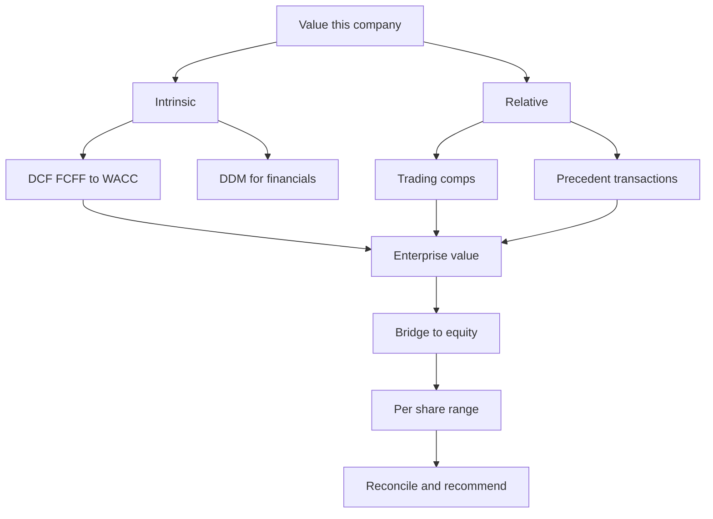
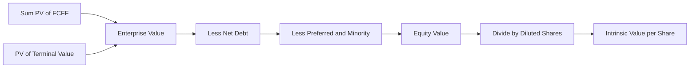

# The Valuation Playbook: Walk Me Through a DCF / Value This Company

## The Problem / Why This Matters

There is a moment in almost every finance interview — equity research, investment banking, private equity, credit, corporate development — when the interviewer leans back and says one of two things:

> "Walk me through a DCF."

or

> "Here's a company. How would you value it?"

These are not really questions about a formula. They are the industry's universal **stress test**. In sixty to ninety seconds, and then through fifteen minutes of follow-ups, the interviewer learns almost everything they need to know: whether you understand *why* a business has value, whether you can hold a multi-step chain in your head without dropping a link, whether your numbers **reconcile**, whether you know the difference between what is worth memorising and what is worth *reasoning*, and — most importantly — whether you can produce **one defensible view** rather than three disconnected outputs.

Here is the uncomfortable reality. Most candidates can *describe* a DCF. Very few can deliver a **complete, reconciling walk-through under pressure** and then defend it against the follow-up gauntlet: "Why that growth rate?" "What if WACC is a point higher?" "Your DCF says ₹1,200 and comps say ₹900 — which do you believe?" "Would you buy the stock?" The candidate who has only memorised an output freezes at the first "why". The candidate who has internalised the *machine* answers every one calmly, because each answer falls out of first principles.

This chapter is the **capstone** of the valuation book. Everything you have learned — enterprise vs equity value, discounting, FCFF/FCFE, WACC, terminal value, the full DCF build, sensitivity and football fields, comparable companies, precedent transactions, multiples, the DDM — comes together here into a **single deliverable structure** you can walk into any interview and execute. We will build the playbook for the two canonical prompts, teach you how to value a company end to end when the clock is running, arm you with a battery of **sanity checks** that catch the errors that silently disqualify people, and then show you how to **triangulate** DCF, comps and precedents into one number you can stand behind and one recommendation you can defend.

By the end, "walk me through a DCF" will feel less like an exam and more like a script you own.

## Core Idea

Every valuation prompt, however it is phrased, is asking you to answer three nested questions in order:

1. **What is this business worth as an operating enterprise?** (Enterprise value.)
2. **What belongs to the shareholders after the other claimants are paid?** (Equity value, via the bridge.)
3. **What is that worth per share, and is it more or less than the market price?** (Intrinsic value per share → recommendation.)

There are only a handful of tools to answer question 1, and they fall into two families:

- **Intrinsic** — value the business by the cash it will produce, discounted to today. The DCF (unlevered FCFF → WACC → enterprise value) and its cousin the DDM.
- **Relative** — value the business by what the market pays for *comparable* businesses. Comparable companies (trading multiples) and precedent transactions (deal multiples).

The **playbook** is the disciplined sequence for deploying these tools:

> **Frame → Build the DCF → Cross-check with comps and precedents → Reconcile into a range → Sanity-check → Land a recommendation.**

The single most important idea in this chapter — the one that separates a *valuation* from a *pile of numbers* — is **triangulation**. No single method is "right". The DCF is theoretically pure but hostage to your assumptions (garbage in, garbage out). Comps are market-anchored but drag along whatever mispricing infects the sector. Precedents embed control premiums and deal-specific froth. A professional does not pick one; they lay all three side by side on a **football field**, ask *why* they disagree, and land on a defensible range with a point estimate inside it. The output is not "the value is ₹1,000." The output is "the business is worth roughly ₹950–₹1,100 per share; here is the number I'd anchor on and here is why."

## Why It Works This Way — First Principles

**Why start with the business, not the share price?** Because price is what you pay and value is what you get. The whole exercise exists to form an *independent* estimate of value that you can compare against the market's price. If you anchor on the price, you have learned nothing. So you build value from the ground up — from the cash the operations will generate — and only at the very end do you turn to the screen and ask, "Is the market offering me this business for more or less than it's worth?"

**Why enterprise value before equity value?** Because the *business* — the factories, the brand, the customers, the cash-generating engine — is financing-agnostic. A bakery that makes ₹10 of cash a year makes ₹10 whether it is funded by debt, equity, or a lottery win. The operating value of that engine is **enterprise value**. Only *after* you have valued the engine do you ask "who has claims on it?" — lenders first (net debt), then preferred, minorities, and finally the residual claimants, the common shareholders. Building EV first and bridging to equity second mirrors the actual economic and legal priority of claims. Reversing the order (starting from equity) forces you to bake in the specific capital structure, which contaminates the operating picture and breaks comparability.

**Why triangulate instead of trusting one method?** Because every method has a **structural blind spot**, and the blind spots are *different*, so the errors are partly independent. A DCF's blind spot is the terminal value and the discount rate — small changes swing the answer enormously, and those inputs are the least observable. Comps' blind spot is that the market may be collectively wrong about the whole sector (2000 dot-coms, 2021 SaaS). Precedents' blind spot is that deals happen at strategic prices with control premiums and are often stale. When three methods with *different* blind spots converge on a similar range, your confidence should rise — the agreement is unlikely to be a coincidence. When they diverge, the *divergence itself is information*: it tells you exactly which assumption to interrogate. This is the same logic as taking three independent measurements of the same quantity — the intersection is more reliable than any single reading.

**Why does "one defensible view" matter more than precision?** Because valuation is not physics; it is an argument. Nobody can prove a stock is worth ₹1,000.00. What you *can* do is build a chain of reasoning where every link is defensible, the numbers reconcile, and the conclusion follows. Interviewers — and, later, portfolio managers and investment committees — are buying the *argument*, not the decimal. A tight, honest range with a clear anchor and an explicit list of what would change your mind beats a false-precision point estimate every time.

**Why is time pressure part of the test?** Because on a live deal you will never have perfect information or infinite time. Managing directors want to know: given a name, a rough sense of its financials, and ten minutes, can you produce a *directionally correct* value and know which assumptions matter most? The playbook is engineered for exactly this — it front-loads the assumptions that move the answer (growth, margin, WACC, terminal value) and defers the ones that don't. Learning the playbook is learning to allocate scarce analytical time to the inputs that actually swing the output.

## Full Technical Content

### The Deliverable Structure — What "A Valuation" Actually Contains

When you are asked to value a company, the finished mental artefact has six parts. Memorise this skeleton; it is the spine of every answer in this chapter.

| # | Stage | What you do | Output |
|---|-------|-------------|--------|
| 1 | **Frame** | Clarify the business, the purpose, the date, and what "value" means here | A one-line thesis of what drives value |
| 2 | **Intrinsic (DCF)** | Project FCFF, pick WACC, add terminal value, discount, bridge to equity, divide by shares | An intrinsic value per share |
| 3 | **Relative (comps)** | Apply peer trading multiples to the company's metrics | A market-anchored EV and equity value |
| 4 | **Relative (precedents)** | Apply deal multiples to the company's metrics | A control/takeout value |
| 5 | **Reconcile** | Lay all three on a football field, explain divergence, pick a range and anchor | A defensible value range + point estimate |
| 6 | **Recommend** | Compare to market price; state buy/hold/sell (ER) or price range (IB) with catalysts and risks | A decision |

### Stage 1 — Framing: The Thirty Seconds That Set Up Everything

Before a single number, you frame. Framing is not filler; it demonstrates judgement and buys you thinking time. Four questions:

1. **What is the business?** One sentence on how it makes money. "It's a branded consumer-staples company selling packaged foods, high recurring revenue, stable margins, low capex."
2. **What is the purpose of the valuation?** Public-market fair value (ER), a sale/acquisition (IB M&A), a financing (ECM), a credit decision (lending)? The purpose dictates which method leads. For a takeover, precedents and control premiums lead. For a stock pitch, DCF and trading comps lead.
3. **As of when, and what's the perimeter?** Valuation date, currency, and whether you are valuing the whole enterprise or just the equity, on a standalone or synergy-inclusive basis.
4. **What actually drives the value?** Growth, margins, reinvestment, or the multiple the market assigns? Naming the one or two swing variables up front signals you know where to spend your effort.

### Stage 2 — The DCF, As a Reconciling Machine

You have built the full DCF in Chapter 7; here it is compressed into the seven-step engine you must be able to run from memory. The genius of it is the **internal consistency**: unlevered cash → blended rate → enterprise value → bridge → equity → per share.

| Step | Action | Formula / logic |
|------|--------|-----------------|
| 1 | Project **FCFF** | `FCFF = EBIT × (1 − t) + D&A − Capex − ΔNWC` |
| 2 | Pick **WACC** | `WACC = (E/V)·Ke + (D/V)·Kd·(1 − t)`, with `Ke = Rf + β·ERP` |
| 3 | **Terminal value** | Gordon: `TV = FCFF₍n₎·(1+g) / (WACC − g)`  or Exit multiple: `TV = EBITDA₍n₎ × multiple` |
| 4 | **Discount** | `PV = CFₜ / (1 + WACC)ᵗ`; discount TV at the *terminal year* factor |
| 5 | Sum → **Enterprise Value** | `EV = Σ PV(FCFF) + PV(TV)` |
| 6 | **Bridge** to equity | `Equity = EV − Net Debt − Preferred − Minority Interest + Investments/Assoc.` |
| 7 | Per share | `Intrinsic price = Equity Value / Diluted shares` |

**The net-debt bridge, fully specified** (this is where reconciliation lives and die):

```
Enterprise Value
  − Total debt (short + long term, incl. capital leases)
  + Cash and equivalents (and marketable securities)     = subtract Net Debt
  − Preferred equity
  − Non-controlling (minority) interest
  − Unfunded pension / other debt-like items
  + Non-operating assets (investments, associates at FV)
  = Equity Value
  ÷ Diluted shares (treasury method on options/RSUs)
  = Intrinsic value per share
```

**Diluted share count — the treasury stock method (TSM):** in-the-money options add shares, but the strike proceeds are assumed used to buy back stock at the current price.

```
Net new shares from options = Options × (Price − Strike) / Price      [only if Price > Strike]
Diluted shares = Basic shares + Net new shares (options) + RSUs + convert-as-if shares
```

**Mid-year convention (optional but often expected):** cash arrives throughout the year, not on Dec 31. Discount each FCFF using exponent `t − 0.5`. The terminal value, if built off a mid-year model, is typically discounted at `n − 0.5` as well when using the Gordon growth method (conventions vary — state your choice).

### Stage 3 — Comparable Companies (Trading Comps)

Value the company by what the market pays *right now* for similar public businesses. The mechanics:

| Step | Action |
|------|--------|
| 1 | Select a peer set — same industry, size, growth, margin, geography |
| 2 | For each peer, compute multiples: `EV/EBITDA`, `EV/EBIT`, `EV/Sales`, `P/E`, `P/B`, sector-specific |
| 3 | Take the median (and 25th/75th percentiles) — median resists outliers |
| 4 | Apply the chosen multiple to the target's metric to get **implied EV** (or equity value for P/E) |
| 5 | Bridge implied EV to equity and per share exactly as in the DCF |

**Critical convention:** EV-based multiples (EV/EBITDA, EV/Sales) give you **enterprise value** — you must bridge to equity. Equity-based multiples (P/E, P/B) give you **equity value directly** — do *not* subtract net debt again. Mixing these is one of the most common disqualifying errors.

### Stage 4 — Precedent Transactions

Value the company by what acquirers have *actually paid* for similar businesses in M&A deals. Same mechanics as comps, but the multiples come from completed transactions and therefore embed a **control premium** (typically 20–40% over the undisturbed trading price) and often synergy expectations. Precedent multiples are usually the **highest** of the three methods for this reason, and they answer a different question: not "what is the business worth in the public market?" but "what would someone pay to *own and control* it?"

### The Method Map



### Stage 5 — Reconciliation: The Football Field

You now have three (or more) value ranges. Lay them on a horizontal bar chart — the **football field** — one bar per method, showing the low-to-high range each produces. Then you reason about the *pattern*:

- **Precedents highest** — expected, they include control premiums.
- **DCF in the middle or wide** — its range depends on your WACC/growth sensitivity.
- **Trading comps anchored to today's market** — if the whole sector is frothy or depressed, comps inherit that.

Where the bars **overlap** is your zone of highest confidence. You choose a **point estimate** inside the overlap and justify it: usually a DCF-centred number cross-validated by comps, with precedents informing the *takeout* ceiling. State it as a range with an anchor: "I'd value this at ₹950–₹1,100, anchoring around ₹1,020 — the DCF base case, which sits comfortably inside where trading comps and my sensitivity overlap."

### The Sanity-Check Battery

Before you say a number out loud, run it through these filters. This is the single highest-ROI habit in valuation — it catches the errors that get people cut.

| Check | Question | Red flag |
|-------|----------|----------|
| **Terminal value share** | What % of EV is the terminal value? | > 80–85% means the explicit period barely matters — extend it or revisit |
| **Implied exit multiple** | What EV/EBITDA does my Gordon TV imply? | Wildly off the sector's trading range (e.g. 25x for a 9x industry) |
| **Implied perpetuity growth** | If I used an exit multiple, what `g` does it imply? | `g` > long-run GDP/inflation (~2–4%) is a warning; `g > WACC` is impossible |
| **WACC vs growth** | Is WACC comfortably above `g`? | `WACC − g < ~1.5%` makes TV explode and hyper-sensitive |
| **Implied multiple cross-check** | What EV/EBITDA and P/E does my *total* DCF value imply? | Compare to comps — a DCF implying 30x when peers trade at 12x needs a story |
| **Margin trajectory** | Are my forecast margins realistic vs history and peers? | Margins expanding forever with no mechanism |
| **Reinvestment consistency** | Does growth match reinvestment? | High growth with near-zero capex/NWC violates economic logic |
| **Bridge reconciliation** | Does EV − net debt − other claims = equity, and ÷ shares tie out? | Sign errors, double-counting cash, basic vs diluted shares |
| **The "does the answer make sense?" gut check** | Is the implied market cap sane vs the actual company? | A ₹500 cr company "worth" ₹50,000 cr with no thesis |

### The DCF Bridge, Visualised



### Stage 6 — Landing a Recommendation

The valuation is not finished until it says *do something*. The form depends on the seat:

- **Equity research:** a **rating** (Buy / Hold / Sell), a **target price** (usually your intrinsic anchor, or a forward-multiple-based target), the **upside/downside** vs the current price, and the **catalysts** that close the gap plus the **risks** that widen it.
- **Investment banking (M&A):** a **value range** for the board or client, framed around the football field, with the negotiation posture (what a buyer could justify paying, where synergies push the ceiling).
- **Credit:** less about equity value, more about **enterprise value cushion** over debt, cash-flow coverage, and downside/liquidation value.

The recommendation must connect the number to the price: "Trading at ₹850, the stock offers ~20% upside to my ₹1,020 intrinsic value; I rate it Buy, with the H2 margin recovery and the deleveraging as catalysts, and input-cost inflation as the key risk."

## Worked Examples

### Worked Example 1 — The End-to-End DCF, Fully Reconciled

**Company:** "Bharat Foods Ltd," a stable packaged-foods business. Valuation date: today. All figures in ₹ crore unless per-share.

**Given:**
- Year-0 (last actual) EBIT = ₹500; tax rate `t` = 25%
- Revenue growth: 8% for years 1–5; EBIT margin held at year-0 level (EBIT grows with revenue at 8%)
- D&A = 6% of revenue; Capex = 8% of revenue; ΔNWC = 10% of the *increase* in revenue
- Year-0 revenue = ₹2,500 (so EBIT margin = 20%)
- WACC = 10%; terminal growth `g` = 4%
- Net debt = ₹800; preferred = ₹0; minority interest = ₹50; non-operating investments = ₹100
- Diluted shares = 100 crore
- Use end-of-year discounting (no mid-year), for clarity

**Step 1 — Project revenue, EBIT, and FCFF.**

Revenue grows 8%/yr from ₹2,500. EBIT = 20% of revenue. NOPAT = EBIT × 0.75. D&A = 6% × rev; Capex = 8% × rev; ΔNWC = 10% × (revₜ − revₜ₋₁).

| Year | Revenue | EBIT | NOPAT | D&A (6%) | Capex (8%) | ΔRev | ΔNWC (10%) | FCFF |
|------|---------|------|-------|----------|------------|------|-----------|------|
| 1 | 2,700.0 | 540.0 | 405.0 | 162.0 | 216.0 | 200.0 | 20.0 | 331.0 |
| 2 | 2,916.0 | 583.2 | 437.4 | 175.0 | 233.3 | 216.0 | 21.6 | 357.5 |
| 3 | 3,149.3 | 629.9 | 472.4 | 189.0 | 251.9 | 233.3 | 23.3 | 386.1 |
| 4 | 3,401.2 | 680.2 | 510.2 | 204.1 | 272.1 | 251.9 | 25.2 | 417.0 |
| 5 | 3,673.3 | 734.7 | 551.0 | 220.4 | 293.9 | 272.1 | 27.2 | 450.3 |

*FCFF = NOPAT + D&A − Capex − ΔNWC.* Check Year 1: 405.0 + 162.0 − 216.0 − 20.0 = **331.0.** ✓
Check Year 5: 551.0 + 220.4 − 293.9 − 27.2 = **450.3.** ✓

**Step 2 — WACC** is given as 10%.

**Step 3 — Terminal value (Gordon), at end of Year 5.**

`TV₅ = FCFF₅ × (1+g) / (WACC − g) = 450.3 × 1.04 / (0.10 − 0.04) = 468.3 / 0.06 = 7,805.2`

**Step 4 — Discount everything at 10%.**

| Year | FCFF | Factor 1/1.1ᵗ | PV |
|------|------|---------------|-----|
| 1 | 331.0 | 0.9091 | 300.9 |
| 2 | 357.5 | 0.8264 | 295.5 |
| 3 | 386.1 | 0.7513 | 290.1 |
| 4 | 417.0 | 0.6830 | 284.8 |
| 5 | 450.3 | 0.6209 | 279.6 |
| TV | 7,805.2 | 0.6209 | 4,847.2 |

Sum of PV of explicit FCFF = 300.9 + 295.5 + 290.1 + 284.8 + 279.6 = **1,450.9.**
PV of TV = 7,805.2 × 0.6209 = **4,847.2.**

**Step 5 — Enterprise Value** = 1,450.9 + 4,847.2 = **₹6,298.1 crore.**

**Step 6 — Bridge to equity.**
`Equity = EV − Net debt − Minority + Non-operating investments`
`= 6,298.1 − 800 − 50 + 100 = ₹5,548.1 crore.`

**Step 7 — Per share** = 5,548.1 / 100 = **₹55.48.**

**Sanity checks:**
- TV as % of EV = 4,847.2 / 6,298.1 = **77%** — high but acceptable for a stable, low-growth staples business. ✓
- Implied exit EV/EBITDA: Year-5 EBITDA = EBIT + D&A = 734.7 + 220.4 = 955.1. TV / EBITDA₅ = 7,805.2 / 955.1 = **8.2x** — sane for a defensive food company. ✓
- WACC − g = 6% — comfortable, not knife-edge. ✓

**Answer: intrinsic value ≈ ₹55.5/share.**

### Worked Example 2 — Triangulating DCF, Comps, and Precedents

Same Bharat Foods. We now cross-check the ₹55.5 DCF value against relative methods and reconcile.

**Trading comps.** Peer set of listed packaged-foods companies trades at a **median EV/EBITDA of 9.0x** (range 8.0x–10.5x) on this year's EBITDA. Bharat Foods' Year-1 forward EBITDA = EBIT + D&A = 540.0 + 162.0 = **702.0.**

- Implied EV at 9.0x = 702.0 × 9.0 = **6,318.**
- Range: 8.0x → 5,616; 10.5x → 7,371.
- Bridge to equity (− 800 net debt − 50 minority + 100 investments = − 750): equity = 6,318 − 750 = **5,568.**
- Per share = 5,568 / 100 = **₹55.68.**
- Range per share: (5,616 − 750)/100 = ₹48.66 to (7,371 − 750)/100 = ₹66.21.

**Precedent transactions.** Recent acquisitions of similar branded-foods businesses closed at a **median EV/EBITDA of 11.0x** (range 10.0x–12.5x), reflecting control premiums.

- Implied EV at 11.0x = 702.0 × 11.0 = **7,722.**
- Equity = 7,722 − 750 = **6,972**; per share = **₹69.72.**
- Range: 10.0x → (7,020 − 750)/100 = ₹62.70; 12.5x → (8,775 − 750)/100 = ₹80.25.

**Reconciliation (football field), per share:**

| Method | Low | Point | High |
|--------|-----|-------|------|
| DCF | 50.0* | 55.5 | 61.0* |
| Trading comps | 48.7 | 55.7 | 66.2 |
| Precedent transactions | 62.7 | 69.7 | 80.3 |

*DCF low/high shown from a ±1% WACC sensitivity band around the base (illustrative).

**Reading the field:** DCF (₹55.5) and trading comps (₹55.7) **agree almost exactly** — strong confirmation of a public-market fair value in the mid-₹50s. Precedents sit ₹14+ higher, exactly as theory predicts (control premium). 

**Landing it:** "On a standalone, public-market basis I value Bharat Foods at **₹50–₹66, anchoring ₹55–₹56**, where the DCF and trading comps tightly converge. In a **takeover**, a strategic buyer could justify **₹63–₹80** given ~11x precedent multiples and synergies — that's the M&A ceiling, not the trading value." Note the two numbers answer two different questions, and the candidate says so explicitly. That is the mark of someone who understands *why* the methods diverge.

### Worked Example 3 — Time-Pressured Back-of-Envelope Valuation

**Prompt:** "A software company does ₹1,000 cr revenue, growing 20%, 25% EBITDA margin, ₹200 cr net cash, 50 cr shares. Value it in two minutes."

This is the "value this company under pressure" test. You will not build a spreadsheet; you will reason to a defensible number and name your swing assumptions.

**Fast comps route (the right first move under pressure):**
- EBITDA = 25% × 1,000 = **250.**
- High-growth software peers trade at, say, **6x EV/Sales** or **20x EV/EBITDA**. Use both and triangulate.
- EV/Sales: 6 × 1,000 = EV **6,000**; EV/EBITDA: 20 × 250 = EV **5,000**. Take the overlap → EV ≈ **5,000–6,000**, call it **5,500.**
- Bridge: net *cash* of 200 means equity = EV + 200 = **5,700.**
- Per share = 5,700 / 50 = **₹114.**

**Quick DCF gut-check:** a 20%-grower with 25% margins and modest reinvestment might convert ~15% of revenue to FCFF (~₹150 now), growing fast then fading. A rough intrinsic on those cash flows at ~11% WACC lands in a similar EV neighbourhood if you believe the growth. State the swing variable: "The whole answer hinges on how durable the 20% growth is — at 20x EBITDA the market is paying for years of it. If growth is really 10%, the multiple compresses toward 12x and the value roughly halves."

**How to say it:** "Quick pass: ~₹5.5k cr enterprise value on ~6x sales / 20x EBITDA, plus ₹200 cr net cash, so ~₹5.7k cr equity, about **₹114 a share**. The number is almost entirely a bet on growth durability — that's the assumption I'd pressure-test first, and I'd want to see net revenue retention and the path to margin expansion before committing."

**Note the reconciliation discipline even at speed:** two multiples cross-checked, an intrinsic gut-check, an explicit swing variable, net *cash* correctly *added* (not subtracted), and diluted shares. That is a two-minute answer that ties out.

## How It Is Tested in Interviews

### "Walk me through a DCF." (The ninety-second script)

> "A DCF values a company as the present value of the cash it generates for all its capital providers. **First**, I project unlevered free cash flow — EBIT, tax it to NOPAT, add back D&A, subtract capex and the change in working capital — usually for five to ten years. **Second**, I discount those cash flows at WACC, the blended after-tax cost of debt and equity. **Third**, because the business lives beyond the forecast, I add a terminal value — either Gordon growth, FCFF times one plus g over WACC minus g, or an exit EBITDA multiple — and I discount that back at the terminal-year factor. **Fourth**, I sum the discounted cash flows and terminal value to get enterprise value. **Fifth**, I bridge to equity: subtract net debt, preferred, and minority interest, add non-operating assets. **Finally**, I divide equity value by diluted shares for intrinsic value per share, which I compare to the market price. Throughout, I'd sanity-check that the terminal value isn't more than ~80% of EV and that my implied exit multiple is consistent with where comps trade."

That last sentence — the unprompted sanity check — is what makes it a *senior* answer.

### "How do you get from enterprise value to equity value?"

> "Enterprise value is the value of the operating business, available to all capital providers. To isolate what belongs to shareholders, I subtract the other claims: net debt — that's total debt minus cash — then preferred equity, minority interest, and any debt-like items such as unfunded pensions. Then I add back non-operating assets the EV doesn't capture, like investments in associates or excess real estate. The result is equity value; divide by diluted shares — using the treasury method on in-the-money options — for value per share."

### "Your DCF says ₹1,000, comps say ₹850, precedents say ₹1,200. Which do you believe, and what do you tell the client?"

> "I don't pick one — I read the pattern. Precedents being highest is expected; they embed control premiums, so ₹1,200 is really the takeover ceiling, not the trading value. The DCF and comps bracket the standalone public value, and I'd anchor around the ₹850–₹1,000 overlap, probably the mid-₹900s. If the DCF sits *above* comps, I'd ask whether my growth or margin assumptions are more optimistic than what the market is pricing into peers — and be ready to defend the difference with a specific thesis, or trim my assumptions. The deliverable to the client is a range — roughly ₹850 to ₹1,200 — with a clear statement of what each end represents: comps at the floor, standalone DCF in the middle, a strategic takeout at the top."

### "What's the single biggest driver of your DCF value?"

> "Almost always the terminal value, and within it the spread between WACC and terminal growth. In a typical model, 70–80% of the value sits in the TV, so a half-point change in WACC or g moves the answer more than my entire year-by-year forecast. That's exactly why I sanity-check the implied exit multiple — it keeps the terminal value honest against what the market actually pays."

### "How would you value a company with no earnings / negative cash flow?" (e.g. early-stage or pre-profit tech)

> "A near-term DCF is unreliable because the value is all in the terminal state, so I'd lean on relative and forward-looking metrics: EV/Sales or EV/Gross Profit against high-growth peers, and a longer-dated DCF that explicitly models the path to profitability — when margins turn, what steady-state margin looks like — with heavy scenario weighting. I'd also triangulate with what acquirers pay per user or per unit of revenue in precedents. The honest answer is the value is a probability-weighted bet on reaching a profitable steady state, so I'd present scenarios rather than a false-precision point estimate."

### "Walk me through valuing a bank." (Method-selection test)

> "For a financial, I switch tools. FCFF/WACC breaks down because debt is raw material, not just financing, and interest is operating. So I use equity-side methods: a **dividend discount model** or a **residual income / excess-returns model**, discounted at cost of *equity*, and I value on **P/B versus ROE** rather than EV/EBITDA. The core insight is that for a bank, leverage *is* the business, so you value the equity directly."

### "You have ten minutes and a company name. What do you do?"

> "I'd anchor fast on comps — get revenue, a margin, and a peer multiple to bracket enterprise value — then do a rough intrinsic gut-check and, critically, name the one or two assumptions the whole value hinges on. I'd rather give you a defensible range and tell you exactly what would move it than a precise number I can't defend. The playbook is: frame the business in a sentence, comps for a fast anchor, a quick DCF sanity-check, then state the swing variable."

### Crisp one-liners to have ready

- "Value is what you get; price is what you pay — the DCF is my estimate of the former, independent of the latter."
- "Unlevered cash → blended rate → enterprise value → bridge to equity. The consistency *is* the method."
- "Precedents highest, comps market-anchored, DCF as good as its assumptions — I triangulate, I don't pick."
- "70–80% of a DCF is the terminal value, so I discipline it with the implied exit multiple."
- "I never trust one number; I trust the overlap of three methods with different blind spots."

## Traps & Common Mistakes

1. **Discounting FCFE at WACC (or FCFF at cost of equity).** The rate must match the cash flow's claimants. Unlevered cash (FCFF) → WACC → enterprise value. Levered cash (FCFE) → cost of equity → equity value directly. Mixing them is a fundamental, instantly-spotted error.

2. **Double-counting the net-debt bridge with an equity multiple.** If you value with P/E (an equity multiple), you already have equity value — do *not* subtract net debt again. Only EV multiples (EV/EBITDA, EV/Sales) require the bridge.

3. **Subtracting cash when the company is net cash.** Net debt = debt − cash. If cash exceeds debt, net debt is negative, so equity value is *higher* than EV. Watch the sign; a net-cash tech company's equity is worth more than its enterprise, not less.

4. **Using basic shares.** In-the-money options and RSUs dilute. Use the treasury stock method. Forgetting dilution overstates per-share value — fatal when the company has a big option overhang.

5. **Terminal growth ≥ WACC.** Mathematically the Gordon formula explodes (or goes negative) and economically it says the company grows faster than the discount rate forever — impossible. Keep `g` below WACC and, realistically, below long-run GDP.

6. **Terminal growth above long-run GDP.** No company can outgrow the economy forever; if it did, it would eventually *become* the economy. Cap `g` around inflation-to-GDP (~2–4%).

7. **Terminal value as 90%+ of EV with a shrug.** If nearly all value is in the perpetuity, your explicit forecast is doing no work. Extend the forecast horizon or reconsider — and always report the implied exit multiple.

8. **Growth without reinvestment.** Projecting 15% revenue growth with flat capex and no working-capital build violates economics — growth costs money. Tie reinvestment to growth (a sensible ROIC/reinvestment-rate relationship).

9. **Margins expanding forever with no mechanism.** "Margins go from 15% to 30% over five years" needs a *reason* — operating leverage, mix shift, scale. Interviewers pounce on unjustified hockey-stick margins.

10. **Mismatched multiple and metric.** EV/EBITDA on next-year EBITDA vs this-year — be consistent, and match forward multiples to forward metrics. Applying a trailing multiple to a forward number (or vice versa) quietly biases the answer.

11. **Stale or apples-to-oranges comps/precedents.** A three-year-old deal at peak-cycle multiples, or a peer with a wildly different growth/margin profile, poisons the relative value. Curate the set; explain why each name belongs.

12. **Forgetting the mid-year convention consistency.** If you apply mid-year to the explicit FCFF, be deliberate about how you treat the terminal value. Inconsistency silently mis-values by a few percent.

13. **Presenting a point estimate with false precision.** "₹1,013.47" signals naïveté. Value is a range; present a range with an anchor and name your swing assumptions.

14. **No recommendation.** A valuation that stops at a number hasn't answered the real question. Always connect value to price and say what you'd *do* — buy/hold/sell, or the deal range.

15. **Ignoring the divergence between methods.** When DCF and comps disagree by 30%, that gap is the most interesting thing in the analysis — interrogate it, don't average it away silently.

## First-Principles Recap

- **Value is the present value of future cash to capital providers.** Everything — DCF, comps, precedents — is a different lens on that one truth. Cash, not earnings, because you can only distribute cash.
- **Build enterprise value first, then bridge to equity, then divide by diluted shares.** The order mirrors the legal and economic priority of claims, and it keeps operating performance separate from financing.
- **Match the cash flow to the discount rate.** Unlevered → WACC → enterprise value; levered → cost of equity → equity value. This consistency *is* the DCF; break it and the answer is meaningless.
- **The terminal value dominates, so discipline it.** 70–80% of a DCF lives in the perpetuity; sanity-check its implied exit multiple and implied growth or the whole model is a guess dressed as arithmetic.
- **Triangulate, never trust one method.** DCF, comps and precedents have *different* blind spots; the overlap of the three is more reliable than any single reading, and their divergence tells you which assumption to interrogate.
- **The output is one defensible view, not a decimal.** A tight range with a clear anchor, honest swing variables, and a stated recommendation beats false precision every time.
- **Every valuation must end in a decision.** Compare value to price and say what to do — a number without a recommendation hasn't finished the job.

## Quick Reference

| Concept | Formula / Rule |
|---------|----------------|
| FCFF | `EBIT·(1−t) + D&A − Capex − ΔNWC` |
| WACC | `(E/V)·Ke + (D/V)·Kd·(1−t)` |
| Cost of equity (CAPM) | `Ke = Rf + β·ERP` |
| Terminal value (Gordon) | `TV = FCFFₙ·(1+g) / (WACC − g)` |
| Terminal value (exit) | `TV = EBITDAₙ × exit multiple` |
| Discount factor | `1 / (1 + WACC)ᵗ` (mid-year: `t − 0.5`) |
| Enterprise value | `Σ PV(FCFF) + PV(TV)` |
| EV → Equity bridge | `Equity = EV − Net debt − Preferred − Minority + Non-op assets` |
| Net debt | `Total debt − Cash & equivalents` (negative if net cash) |
| Diluted shares (TSM) | `Basic + Options·(P−Strike)/P + RSUs + converts` |
| Intrinsic price | `Equity value / Diluted shares` |
| Implied exit multiple | `TV / EBITDAₙ` (sanity-check vs comps) |
| Implied perpetuity g | back-solve `g` from `TV = FCFFₙ(1+g)/(WACC−g)` |
| TV share of EV | `PV(TV) / EV` — flag if > 80–85% |
| Equity multiple caution | P/E, P/B give equity value directly — **no** net-debt bridge |
| EV multiple | EV/EBITDA, EV/Sales give EV — **must** bridge to equity |
| Control premium | Precedents ≈ trading value + 20–40% |
| Recommendation | `Upside = (Intrinsic − Price) / Price` → Buy/Hold/Sell |
| Triangulation rule | Present a range; anchor in the overlap; name swing variables |
