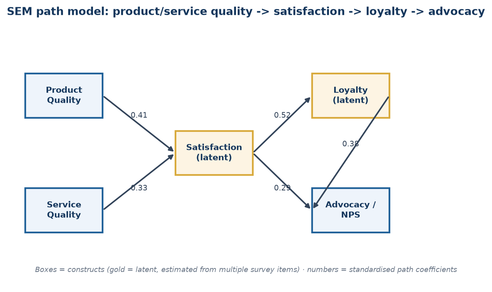
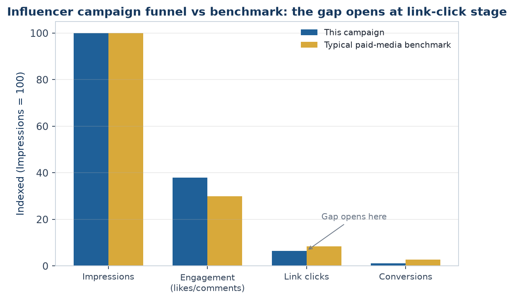

# The Market Research Analyst Handbook
### A complete, in-depth reference — every topic, explained from the ground up
*Prepared for Saikumar Kaleru. Read top to bottom; each part builds on the last. Bold terms are the vocabulary interviewers listen for. Indian-market context (CMIE, RBI, SEBI, NSS, industry bodies) is used throughout, matching the rest of this study library.*

---

# PART 1 — WHAT MARKET RESEARCH ACTUALLY IS

## 1.1 The core idea
**Market research** is the systematic collection, analysis, and interpretation of data about a market — its customers, competitors, and environment — to reduce uncertainty before a business decision. Where **equity research** answers "is this stock worth buying," market research answers "will this product sell, to whom, at what price, and against whom."

Every market research project ultimately answers one of four questions:
1. **Who** is the customer, and what do they need? (segmentation, needs)
2. **How big** is the opportunity? (market sizing)
3. **Who else** is competing for it? (competitive intelligence)
4. **What should we do** about price, product, or positioning? (decision support)

## 1.2 Market Research vs adjacent disciplines
- **Equity/Investment Research** studies a *company* to price its stock — outward-facing to public markets, ends in a buy/sell call.
- **Market Research** studies a *market or customer base* to guide product/business decisions — ends in a recommendation to a brand, product, or strategy team, not a trade.
- **Competitive Intelligence (CI)** is a specialised slice of market research focused specifically on competitors' moves, capabilities, and likely responses.
- **Business/Data Analytics** answers "what happened" from a company's own internal data; market research goes *outside* the company to answer "what's happening in the market."
- In practice these overlap heavily — a strong market research analyst reads company filings and does light equity-research-style work, and a strong equity analyst does light market-sizing work. The skill sets are transferable, which is the bridge worth using if coming from a finance/markets background.

## 1.3 Where market researchers sit
- **Agency side**: research/insights consultancies (Nielsen, Kantar, IMRB/Kantar IMRB, Ipsos, GfK, YouGov, Mintel) — client-facing, run studies for many brands.
- **Client/in-house side**: a consumer or B2B company's own insights/strategy team (FMCG, banking, telecom, e-commerce) — owns a category and runs research for internal stakeholders.
- **Consulting**: strategy/management consultancies run market-sizing and competitive-landscape workstreams as part of larger engagements.
- **Financial services angle** (the natural bridge from an equity/derivatives background): buy-side and consulting shops increasingly employ "market intelligence" analysts who combine public-market data with primary research to validate investment theses — this is the most direct crossover role.

## 1.4 The research process, end to end
1. **Define the business problem** — not the research question yet. ("Should we launch in Tier-2 cities?" is a business problem; "what is unaided brand awareness in Tier-2 cities?" is a research question.)
2. **Translate into research objectives** — specific, answerable questions.
3. **Choose a design** — exploratory, descriptive, or causal (Part 2).
4. **Choose methods** — secondary first (cheap, fast), then primary if gaps remain (Parts 3-4).
5. **Collect data** — fieldwork, surveys, interviews, desk research.
6. **Analyse** — statistical and qualitative analysis (Part 5).
7. **Report and recommend** — translate findings into a decision-ready recommendation (Part 8).

**Trap:** a research design that answers the *literal* question but not the *business* problem is a common interview failure point — always restate the business decision the research will inform before designing the study.

## 1.5 The research brief — the document that starts every project
A professional engagement begins with a **research brief**, written by the client/stakeholder (or, often in practice, drafted by the researcher *for* the stakeholder to sign off, since stakeholders rarely write a good brief unaided). A complete brief covers:
- **Background** — why this project, why now (a competitor launch, a declining metric, a new market entry decision).
- **Business objective** — the decision this research will inform, stated as a decision, not a topic ("decide whether to reformulate the product" not "understand consumer taste preferences").
- **Research objectives** — the specific, answerable questions that, once answered, let the business objective be decided.
- **Target audience/population** — who the research needs to represent.
- **Deliverables and timeline** — report format, presentation date, any interim readouts.
- **Budget and constraints** — this shapes method choice more than researchers like to admit; a ₹5 lakh budget cannot fund a 2,000-person national survey with 20 city-tier cells.
- **Stakeholder map** — who signs off, who consumes the findings, who might resist the conclusion (a market research analyst who ignores internal politics produces technically correct research that changes nothing).

**Common failure mode**: skipping straight to "let's run a survey" without a brief. A senior analyst's first move on any incoming request is to write or extract a one-page brief and get explicit sign-off on the business objective — this alone prevents the single most expensive mistake in the field: a technically well-executed study that answers a question nobody needed answered.

## 1.6 Research objectives vs research questions vs survey questions — the translation chain
Interviewers probe this distinction because junior analysts conflate the three:
- **Research objective** (business-facing): "Understand whether price or convenience is the bigger barrier to online grocery adoption among non-users."
- **Research question** (analysis-facing): "What proportion of non-users cite price vs convenience as the primary barrier, and does this differ by income band?"
- **Survey question(s)** (respondent-facing): "Which of the following best describes why you don't currently order groceries online? [price too high / delivery too slow / prefer to see product before buying / no reliable internet / other]" plus a follow-up ranking or Likert battery on each barrier.
A good analyst can walk backward from any survey question to the research question it serves to the business objective it ultimately informs — if a question can't be traced back, cut it.

---

# PART 2 — RESEARCH DESIGN

## 2.1 The three designs
- **Exploratory research** — used when the problem is vague. Goal: generate hypotheses, not test them. Methods: literature review, expert interviews, focus groups, case analysis. Small samples, qualitative, flexible.
- **Descriptive research** — used to describe a market "as it is": size, share, demographics, usage patterns, satisfaction levels. Methods: surveys, observational studies, secondary-data analysis. Larger samples, mostly quantitative, structured.
- **Causal research** — used to test whether X causes Y (e.g., does a price cut increase volume enough to grow revenue). Methods: experiments, A/B tests, controlled field trials. Requires a control group and random assignment to claim causality — correlation from a plain survey is *not* proof of causation, a point interviewers probe directly.

## 2.2 Choosing a design — the decision rule
If you don't know what you don't know → **exploratory**.
If you need to size or describe something known → **descriptive**.
If you need to prove a specific action will change an outcome → **causal**.
Most real projects are a funnel: exploratory (a few interviews) → descriptive (a large survey) → occasionally causal (a pilot/A-B test) before a big launch decision.

## 2.3 Primary vs secondary research
- **Secondary research** uses data that already exists (someone else collected it for another purpose). Cheaper, faster, but not tailored to your exact question and may be stale.
- **Primary research** is data collected specifically for this project (surveys, interviews, experiments). Expensive and slow, but exactly fits the question and is proprietary.
- **Rule of thumb**: always exhaust secondary sources first — most "we need a survey" requests are 60-80% answerable from existing reports, company filings, and government data. This is the single biggest cost-saving move a junior researcher can make, and interviewers listen for it.

## 2.4 Qualitative vs quantitative
- **Qualitative** — depth over breadth. Answers *why* and *how*. Small samples (6-30), non-statistical, rich narrative data (interview transcripts, discussion notes).
- **Quantitative** — breadth over depth. Answers *how many, how much, what %*. Large samples (100s-1000s), statistical, numeric data (survey responses, scanner data).
- **Mixed-methods** is standard practice: qualitative first to discover the right questions and language, quantitative second to measure how widespread the finding is across the population.

## 2.5 Research design worked through six Indian industries
Interviewers frequently present a one-line business problem and ask "how would you design this?" — the fastest way to build fluency is to have already worked through several. Each example below follows the same skeleton: business problem → design choice → method mix → key risk to flag.

**1. FMCG — should a snack brand reformulate to reduce sugar content?**
Business problem: will a reformulated (lower-sugar) SKU protect volume, or will core users reject the taste change?
Design: causal, via a **blind taste test** (respondents don't know which sample is reformulated) with a monadic or paired-comparison design, plus a quantitative purchase-intent survey on the winning formulation.
Method mix: central-location taste test (n≈200-300, quota-controlled by current-user vs non-user), followed by a home-use test (2-week in-home trial, n≈100) to capture repeat-usage reality beyond a single sip.
Key risk: a central-location "sip test" often overstates acceptance versus real repeated in-home consumption — always pair with a home-use test before a full reformulation, a classic FMCG research-design trap.

**2. Banking — will customers adopt a new UPI-based micro-lending feature?**
Business problem: build or don't build; if build, what credit limit and pricing.
Design: exploratory (IDIs with existing personal-loan customers and with non-borrowers) → descriptive quantitative (intent, preferred limit, acceptable interest rate via a **Gabor-Granger** or **Van Westendorp** pricing module) → light conjoint on feature bundle (limit size, interest rate, repayment tenure, processing speed).
Method mix: online survey on app users (n≈800, stratified by existing credit-bureau band if available internally), 15-20 qualitative interviews for language/objections.
Key risk: stated willingness-to-pay for credit products is notoriously unreliable (nobody wants to admit they'd pay high interest) — validate with a soft-launch/waitlist pilot measuring actual uptake at a real posted rate before committing to full-scale pricing.

**3. E-commerce — why is cart abandonment high on the checkout page specifically?**
Business problem: diagnose and fix a conversion leak.
Design: descriptive, mixed-methods — this is a case where **behavioural/analytics data should be pulled first** (internal secondary data: session recordings, funnel drop-off by step, device/payment-method cuts) before commissioning any primary research.
Method mix: quant funnel analysis (internal data, free) → usability testing (5-8 moderated sessions, think-aloud, on the actual checkout flow) → optionally an intercept exit-survey ("what stopped you from completing your order today?") triggered on abandonment.
Key risk: qualitative usability testing with 5-8 users finds ~80% of major usability issues (Nielsen's well-known finding) — resist the urge to commission an expensive large-n survey before this cheap, fast diagnostic step.

**4. Telecom — sizing demand for a new prepaid data-only plan for students**
Business problem: is the segment large enough and price-sensitive enough to justify a dedicated plan and marketing spend.
Design: descriptive, primarily secondary + light primary validation.
Method mix: top-down sizing from telecom-industry reports (TRAI data on subscriber base, student population from education-ministry data) cross-checked bottom-up via campus-intercept surveys at a sample of colleges (stratified by tier-1/tier-2 city) on current spend and switching intent.
Key risk: campus intercepts oversample students physically present and willing to stop — supplement with an online panel arm to correct for this convenience-sample bias before finalising the size estimate.

**5. Healthcare/pharma — understanding doctor prescribing behaviour for a new drug category**
Business problem: which messaging and which specialist segment to prioritise in field-force targeting.
Design: qualitative-led, given a small, hard-to-access, expert population.
Method mix: 25-30 IDIs with prescribing physicians (recruited via a medical panel/fieldwork agency, incentivised appropriately per medical-research ethics norms), segmented by specialty and prescribing volume tier; a short quantitative confirmatory survey (n≈150-200 physicians) on message resonance and stated prescribing intent.
Key risk: physicians are a scarce, expensive-to-recruit population — a poorly piloted discussion guide that wastes even 5 of 30 interviews on bad questions is a real, expensive mistake; pilot rigorously with 1-2 physicians before full fielding.

**6. Auto/EV — will consumers switch from ICE two-wheelers to electric in a specific state?**
Business problem: market-entry and product-spec decision (range, price, charging assumptions) for a new EV two-wheeler.
Design: descriptive + causal element (conjoint) — this is a multi-attribute trade-off decision (price vs range vs charging time vs brand), the textbook conjoint-analysis use case.
Method mix: quantitative survey (n≈600-1000, stratified by current vehicle type and state given large state-level policy/subsidy differences in India) with an embedded conjoint module on price/range/charging-time/brand; secondary desk research on state EV-subsidy policy and existing charging-infrastructure density.
Key risk: EV purchase intent is heavily distorted by subsidy policy that can change before launch — always model the sizing/pricing conclusion under at least two subsidy scenarios (current policy, and a "subsidy reduced/removed" downside case) rather than a single point estimate.

---

# PART 3 — SECONDARY RESEARCH (DESK RESEARCH)

## 3.1 Where to look, in order of cost
1. **Company's own data** — internal sales, CRM, support tickets, prior research archives (free, but easy to miss if not asked for).
2. **Government and regulatory sources** (India) — MOSPI/NSS surveys (consumer expenditure, employment), RBI (household finance, banking data), SEBI (mutual fund/market data), Census, Economic Survey, ministry reports (e.g. DPIIT for startups) — free and authoritative, but slow-moving and broad.
3. **Industry bodies and trade associations** — CII, FICCI, NASSCOM (IT), ASSOCHAM, and sector bodies (e.g. AMFI for mutual funds, IBA for banking) — free/cheap, sector-specific, often annual.
4. **Syndicated research firms** — Nielsen (retail audit, FMCG), Kantar, CMIE (Centre for Monitoring Indian Economy — the single most-used paid macro/company database in India), Euromonitor, Statista, Gartner/Forrester (tech), IDC. Paid, but standardised, comparable across companies, and update regularly.
5. **Public company filings** — annual reports, investor presentations, credit-rating rationale (CRISIL/ICRA/CARE), stock-exchange disclosures. Free, primary-sourced by the company itself, most useful for competitive benchmarking of listed players.
6. **News, trade press, and analyst notes** — free, current, but requires triangulation since a single source may be biased or wrong.

## 3.2 Desk research technique
- **Triangulate**: never trust one source for a market-size or growth number — cross-check at least two independent sources and reconcile the gap explicitly in the report (don't hide the disagreement).
- **Check the definition, not just the number**: two "market size" figures can differ 5x because one includes adjacent categories (e.g. "EV market" including two-wheelers vs only cars) — always confirm scope before comparing.
- **Track vintage**: a 2019 number quoted in 2026 without an update flag is a common analyst error and an easy interviewer trap ("how current is this number, and how do you know?").
- **Build a source log** as you go — every number in the final deck should be traceable to a named, dated source; this is what separates a credible market research deliverable from a guess.

---

# PART 4 — PRIMARY RESEARCH: QUALITATIVE METHODS

## 4.1 In-depth interviews (IDIs)
One-on-one, semi-structured conversations (45-60 min), used to explore a topic in depth without group dynamics influencing the answer. Best for sensitive topics (income, health, B2B purchasing decisions) or expert/stakeholder input (e.g. interviewing distributors, doctors, CFOs).

## 4.2 Focus group discussions (FGDs)
6-10 participants, a trained moderator, 60-90 minutes, used to observe group dynamics, generate ideas through discussion, and test reactions to concepts/ads/packaging live. **Risk**: groupthink and dominant-participant bias — a skilled moderator actively manages this (round-robin questions, private written responses before group discussion).

## 4.3 Ethnography / observational research
Researchers observe behaviour in its natural setting (a kirana store, a bank branch, a household) rather than asking about it — used because **stated preference and revealed behaviour often diverge** (people say they'd pay for organic food, then buy the cheaper option at the shelf). Slower and more expensive, but the gold standard for behavioural truth.

## 4.4 Other qualitative tools
- **Projective techniques** — indirect prompts (word association, sentence completion, "if this brand were a person...") used to surface associations people won't state directly.
- **Diary studies** — participants log behaviour/thoughts over days/weeks, useful for infrequent or habitual behaviours a single interview can't capture.
- **Usability/concept testing** — a moderator watches a participant use a product/prototype and think aloud, common in fintech/app research.

## 4.5 Qualitative analysis
- **Coding**: tagging transcript segments with recurring themes/categories (manually or in NVivo/Atlas.ti).
- **Thematic analysis**: grouping codes into higher-level themes and reporting prevalence ("6 of 12 respondents mentioned trust as the top barrier") — note this is *illustrative*, not statistically representative, and should never be reported as a percentage of "all customers."

---

# PART 5 — PRIMARY RESEARCH: QUANTITATIVE METHODS & SURVEY DESIGN

## 5.1 The survey design process
1. Define exactly what each question will be used to decide (no "nice to know" questions — every question earns its place).
2. Choose question types: **closed-ended** (multiple choice, Likert scale, ranking) for easy quantitative analysis; **open-ended** sparingly, for colour and to catch what closed options missed.
3. Order questions: general → specific, easy → sensitive, behavioural → attitudinal → demographic (demographics last, so people are already invested in finishing).
4. **Pilot test** on 10-20 people before full fielding — catches confusing wording, skip-logic errors, and length problems.

## 5.2 Common bias traps in question wording
- **Leading questions** — "Don't you agree our app is easy to use?" pushes agreement; ask neutrally: "How easy or difficult is our app to use?"
- **Double-barrelled questions** — "Is the app fast and reliable?" conflates two things; split into two questions.
- **Social desirability bias** — people over-report virtuous behaviour (saving, exercising) and under-report the opposite; mitigate with anonymity and neutral framing.
- **Order/anchoring effects** — the first option in a list gets chosen more often; randomise option order where the survey tool allows it.

## 5.3 Measurement scales
- **Nominal** — categories with no order (city, gender, brand used).
- **Ordinal** — ordered categories, unequal spacing (income brackets, satisfaction: poor/fair/good/excellent).
- **Interval** — ordered, equal spacing, no true zero (a 1-5 Likert scale is technically interval by convention).
- **Ratio** — ordered, equal spacing, true zero (age, spend in ₹, number of purchases) — allows the widest range of statistics (means, ratios).
- **Likert scale**: the standard 5- or 7-point agreement/satisfaction scale. Interviewers may ask why 5 vs 7 points — 7-point scales give slightly more discrimination but higher respondent fatigue; 5-point is the pragmatic default for most consumer surveys.
- **Net Promoter Score (NPS)**: "How likely are you to recommend X, 0-10?" — % Promoters (9-10) minus % Detractors (0-6), ignoring Passives (7-8). Widely used, widely criticised (a single number hides *why*), always pair with an open-ended follow-up ("what's the main reason for your score?").

## 5.4 Sampling
- **Population** — everyone the finding should generalise to (e.g. "urban Indian smartphone owners aged 18-35").
- **Sampling frame** — the actual list you can draw from (a customer database, a panel) — rarely a perfect match to the population, and the gap is a source of bias worth naming in any report.
- **Probability sampling** (every unit has a known chance of selection — allows statistically valid generalisation):
  - **Simple random sampling** — pure lottery from the full frame.
  - **Stratified sampling** — split the population into strata (e.g. by city tier), sample each proportionally — improves precision when subgroups matter.
  - **Cluster sampling** — randomly pick clusters (e.g. a few cities), then sample fully within them — cheaper for geographically spread populations, common in India given field-cost constraints.
  - **Systematic sampling** — pick every k-th unit from an ordered list.
- **Non-probability sampling** (convenience, quota, snowball, judgment) — faster/cheaper but cannot be generalised with a formal margin of error; acceptable for exploratory work, a red flag if used for a headline market-size claim.

## 5.5 Sample size — the formula interviewers actually ask for
For a proportion, at 95% confidence:

**n = (Z² × p × (1-p)) / e²**

Where Z = 1.96 (for 95% confidence), p = expected proportion (use 0.5 if unknown — it maximises required sample, the conservative choice), e = desired margin of error (e.g. 0.05 for ±5%).

**Worked example (India context):** A bank wants to estimate the % of urban customers who'd adopt a new UPI feature, ±5% margin of error, 95% confidence, p unknown (use 0.5):
n = (1.96² × 0.5 × 0.5) / 0.05² = (3.8416 × 0.25) / 0.0025 = 0.9604 / 0.0025 ≈ **384 respondents.**
This is the famous "~384" number that recurs across market research regardless of population size (above a few thousand) — population size barely matters once it's large, which surprises people new to the field and is a good interview talking point.

For a **finite population correction** (when the population itself is small, e.g. surveying a company's 2,000 enterprise clients): n_adj = n / (1 + (n-1)/N), where N is the population size.

## 5.6 Data collection modes
- **CAPI/CATI** (computer-assisted personal/telephonic interviewing) — interviewer-led, good response rates, higher cost, still common for rural/older India respondents.
- **Online panels (CAWI)** — cheapest and fastest, but skews toward internet-literate, younger, urban respondents — a real limitation to disclose, not hide, in any Indian consumer study.
- **Intercept surveys** — stopping people in a physical location (mall, branch, store) — good for in-the-moment behaviour, biased toward that location's footfall profile.

## 5.7 A full worked questionnaire (UPI micro-lending feature, from the Part 2.5 example)
Reproducing a complete, well-formed questionnaire is one of the most useful things to have memorised for a portfolio/interview exercise — note the ordering (screening → behavioural → attitudinal → conjoint-style trade-off → demographics last), the neutral wording, and the routing logic.

**Screener**
S1. Do you currently use a UPI app for payments? [Yes → continue / No → terminate]
S2. Have you ever taken a personal loan or used a "buy now pay later" product? [Yes/No — used for quota, not a terminate]

**Behavioural**
Q1. In the last 3 months, has there been an occasion where you needed short-term credit (₹2,000-₹50,000) but did not borrow? [Yes/No]
Q2. If yes, what did you do instead? [Borrowed from friends/family / Used a credit card / Delayed the purchase/expense / Used a different lending app / Other — specify]

**Attitudinal / intent**
Q3. How interested would you be in a feature that lets you borrow instantly through your UPI app, with the amount auto-debited from your next salary credit? [5-point: Not at all interested → Extremely interested]
Q4. What would concern you most about using such a feature? [Open-ended, single response]
Q5. Rate your agreement: "I trust my UPI app provider to offer fair interest rates." [5-point Likert: Strongly disagree → Strongly agree]

**Pricing (Van Westendorp Price Sensitivity Meter — four questions, same feature, asked in this order)**
Q6a. At what interest rate (% per annum) would you consider this credit line too *expensive* to use? [numeric entry]
Q6b. At what rate would you consider it *starting to get expensive*, but you'd still consider it? [numeric entry]
Q6c. At what rate would you consider it a *bargain* — great value? [numeric entry]
Q6d. At what rate would you consider it *so cheap* that you'd question the lender's legitimacy/safety? [numeric entry]

**Conjoint module** (choice-based, 6 tasks shown, each a choice among 3 hypothetical plans + "none")
Example task: "Which of these would you choose?"
- Plan A: ₹25,000 limit · 18% p.a. · 3-month repayment · instant approval
- Plan B: ₹50,000 limit · 24% p.a. · 6-month repayment · approval in 1 hour
- Plan C: ₹15,000 limit · 15% p.a. · 1-month repayment · instant approval
- None of these

**Demographics** (always last)
D1. Age band · D2. Gender · D3. City tier · D4. Monthly income band · D5. Occupation

**Notes an analyst should be able to explain about this instrument**: why the screener terminates non-UPI-users (population definition), why Van Westendorp uses four specific price points rather than one willingness-to-pay question (it triangulates an acceptable *range*, not a single number, and cross-checks internal consistency — a respondent whose "too cheap" answer exceeds their "too expensive" answer flags a bad/inattentive response), and why demographics sit last (reduces early-abandon risk on a survey that opens with sensitive financial behaviour).

## 5.8 Panel quality and data-cleaning for online surveys
Online panels (Section 5.6) introduce a data-quality problem beyond sampling bias: **inattentive or fraudulent respondents** rushing through for a panel incentive. Standard quality checks, expected knowledge for any quantitative role:
- **Speeding**: flag/remove respondents completing in under roughly a third of the median completion time.
- **Straight-lining**: selecting the same response option down an entire grid/matrix question regardless of content — a strong signal of non-engagement.
- **Attention-check items**: an instruction embedded mid-survey ("select 'Somewhat agree' for this item to show you are reading carefully") — failure is grounds for exclusion.
- **Open-end gibberish**: nonsensical or copy-pasted text in open-ended fields.
- **Logical consistency traps**: e.g. claiming to be a heavy user of a product category while also selecting "never heard of this brand" for a brand used earlier in the survey.
Reporting the **effective sample size after cleaning** (not just the raw completes) alongside the cleaning criteria applied is standard practice in a credible methodology appendix.

---

# PART 6 — DATA ANALYSIS FOR MARKET RESEARCH

## 6.1 Descriptive statistics (the first pass on any dataset)
Mean, median, mode, standard deviation, frequency distributions. Always report **median alongside mean** for skewed data (income, spend) — a few high spenders can make the mean misleading.

## 6.2 Cross-tabulation ("cross-tabs")
Breaking one variable by another (e.g. NPS score by age band) — the single most common output in a market research deck. Always check **base size** (n) in each cell; a finding on a base of 12 respondents is not reportable as a trend, only a footnote.

## 6.3 Segmentation
Grouping the market into distinct customer types who share needs/behaviour, so different strategies can be aimed at each.
- **A-priori segmentation** — segments defined in advance by known variables (age, income, geography) — simple, easy to action, sometimes not the variable that actually drives behaviour.
- **Post-hoc (cluster-based) segmentation** — statistical clustering (k-means, hierarchical clustering) on attitudinal/behavioural survey data to *discover* natural groupings — richer, but harder to explain to stakeholders and harder to identify a real customer against ("which cluster is this person?" requires a classifier built on top).
- A good segmentation is: **substantial** (big enough to matter), **distinct** (segments actually differ), **stable** (doesn't shift month to month), **actionable** (marketing/product can actually reach and target it).

## 6.4 Statistical significance testing
- **t-test** — compares means between two groups (e.g. does Segment A spend more than Segment B?).
- **Chi-square test** — tests whether two categorical variables are associated (e.g. is brand preference associated with city tier?).
- **ANOVA** — compares means across 3+ groups at once.
- **p-value**: the probability of seeing a difference this large (or larger) if there were truly no difference in the population. p < 0.05 is the conventional "statistically significant" threshold — but always pair with **effect size** (how big is the difference, practically) since a huge sample can make a trivial difference "significant."

## 6.5 Regression and conjoint analysis
- **Linear/logistic regression** — quantifies how much a set of variables (price, awareness, income) predicts an outcome (purchase, satisfaction) — used for driver analysis ("what actually moves NPS").
- **Conjoint analysis** — shows respondents product profiles that vary systematically on attributes (price, brand, features) and asks them to choose/rank; from choices, the model estimates how much each attribute (and each level, e.g. ₹999 vs ₹1499) contributes to preference. The standard technique for **pricing research** and feature prioritisation — a common interview topic for anyone claiming pricing-research experience.
- **MaxDiff (best-worst scaling)** — respondents repeatedly pick the "most" and "least" important item from small sets — a cleaner alternative to asking people to rate 20 things on a 1-5 scale (where everything ends up rated 4-5).

## 6.6 Tools of the trade
- **SPSS** — the long-standing standard for cross-tabs, significance testing, and basic multivariate stats in market research; still widely required in job postings.
- **Qualtrics / SurveyMonkey** — survey design, fielding, and light built-in analysis.
- **Excel** — pivot tables remain the day-to-day workhorse for cross-tabs and quick analysis.
- **Power BI / Tableau** — dashboarding for tracking studies (brand trackers, NPS trackers) that update on a cadence.
- **Python (pandas, statsmodels, scikit-learn)** — increasingly expected for segmentation, regression, and automating repetitive survey-data cleaning — a genuine differentiator for a candidate coming from a Python/SQL background, since most classically-trained market researchers don't code.
- **R** — still common in academic-leaning or advanced analytics teams for the same statistical work as Python.

## 6.7 Regression driver analysis — full worked example
A bank wants to know what drives NPS for its mobile app. Survey data on n=500 users includes NPS (0-10), and five predictor variables measured 1-5: app speed, ease of navigation, feature completeness, customer-support responsiveness, and trust in security.

A linear regression of NPS on the five predictors yields standardised coefficients (betas — comparable to each other since all variables are on the same 1-5 scale):
| Driver | Standardised beta | p-value |
|---|---|---|
| Trust in security | 0.34 | <0.001 |
| Ease of navigation | 0.28 | <0.001 |
| App speed | 0.19 | 0.002 |
| Customer-support responsiveness | 0.11 | 0.04 |
| Feature completeness | 0.04 | 0.31 |


**Reading this table (the part interviewers actually probe)**: trust in security is the single largest driver of NPS — larger than app speed or even feature completeness, which is *not* statistically significant (p=0.31, meaning we cannot conclude it drives NPS at all in this sample). The actionable insight is not "improve everything" but "prioritise security-trust communication and navigation simplicity over adding new features" — directly answering a resource-allocation question a findings-only report would not answer. Always check **R² (variance explained)** too — a driver model with R²=0.15 means the five variables jointly explain only 15% of NPS variation, a caveat that belongs in the same slide as the driver chart, not omitted.

## 6.8 Conjoint analysis — from raw choices to attribute importance
Continuing the Part 5.7 UPI lending conjoint: after n=600 respondents each complete 6 choice tasks (3,600 total choice observations), a multinomial logit model estimates a **part-worth utility** for each attribute level. Illustrative output:

| Attribute | Level | Part-worth utility |
|---|---|---|
| Interest rate | 15% p.a. | +0.82 |
| Interest rate | 18% p.a. | +0.21 |
| Interest rate | 24% p.a. | −1.03 |
| Credit limit | ₹15,000 | −0.44 |
| Credit limit | ₹25,000 | +0.08 |
| Credit limit | ₹50,000 | +0.36 |
| Approval speed | Instant | +0.61 |
| Approval speed | 1 hour | −0.61 |

**Attribute importance** is calculated from each attribute's *range* of utilities (max minus min), normalised to sum to 100% across attributes: interest rate's range (0.82 to −1.03 = 1.85) is the largest, making it the most important attribute (≈45% relative importance in this illustrative case), ahead of approval speed (range 1.22, ≈30%) and credit limit (range 0.80, ≈20% — with feature/brand making up the remainder). This is exactly how a pricing-research deliverable justifies a statement like "interest rate matters roughly 1.5x more to adoption than approval speed" to a pricing committee, and it is the calculation most likely to be asked to explain, step by step, in a technical interview for a role advertising conjoint/pricing-research experience.


**Market simulation**: once part-worths are estimated, they can simulate **share of preference** for any hypothetical product lineup (e.g. "if we launch Plan B against two named competitor plans, what share would we capture") by summing utilities per profile and converting to choice probabilities — this simulator output, not the raw utility table, is what gets presented to a business stakeholder.

## 6.10 A full worked segmentation case study, with cluster output
*A digital lending app runs a survey (n=800) with an attitudinal/behavioural battery, then applies k-means clustering (k=4, chosen via the elbow method on within-cluster variance) on standardised variables: price sensitivity (1-5), digital comfort (1-5), loan-purpose (categorical, recoded), and monthly income (₹).*

**Illustrative cluster output:**
| Segment | Size (%) | Price sensitivity | Digital comfort | Avg income | Primary loan purpose |
|---|---|---|---|---|---|
| A: "Convenience seekers" | 28% | 2.1 (low) | 4.6 (high) | ₹95,000 | Discretionary/lifestyle |
| B: "Value-driven strivers" | 34% | 4.4 (high) | 3.2 (mid) | ₹42,000 | Emergency/essential |
| C: "Cautious traditionalists" | 22% | 3.6 (mid-high) | 1.8 (low) | ₹58,000 | Rare, only when unavoidable |
| D: "Affluent optimisers" | 16% | 1.5 (low) | 4.8 (high) | ₹1,80,000 | Investment/opportunity |


**Reading the output (the part that gets tested in interviews)**: the four clusters are checked against the segmentation-quality criteria from Part 6.3 — **substantial** (all four segments are large enough to target, none is a tiny statistical artifact), **distinct** (the profiles genuinely differ across all four variables, not just one), **actionable** (Segment B, the largest at 34% and clearly price-sensitive with essential loan needs, is an obvious first product-and-messaging target; Segment D, though small, has high income and low price sensitivity — a candidate for a premium, fast-approval product tier rather than a discount play). The critical next step, per Part 6.3's caution about post-hoc clustering, is validating that these clusters actually predict a business-relevant outcome (e.g. repayment behaviour, cross-sell uptake) — a statistically clean cluster solution that doesn't differentiate on outcomes the business cares about is elegant but not useful.

**A common interview follow-up**: "how did you choose k=4 and not k=3 or k=5?" — the honest answer combines a quantitative heuristic (the elbow method: plotting within-cluster variance against k and picking the point where additional clusters stop meaningfully reducing variance) with a business-judgment check (does the resulting number of segments produce genuinely actionable, differentiable strategies, or does splitting further just fragment the target list without a corresponding difference in what the business would actually do for each group) — k-selection is not a purely mechanical decision.

## 6.9 Common statistical pitfalls specific to market research (interview favourites)
- **Confusing correlation in survey data with causation** — a survey showing heavy app users have higher NPS does not prove app usage *causes* satisfaction; satisfied customers may simply use the app more (reverse causality) — only a designed experiment (Part 2.1, causal research) can claim causation.
- **Small-base reporting** — presenting a sub-group finding (e.g. "Gen Z respondents in Tier-3 cities") without checking the cell has a sane base size (n≥30 as a rough floor for any percentage to be quoted, n≥100 to report with real confidence) is one of the most common junior-analyst errors flagged by senior reviewers.
- **Multiple comparisons** — running significance tests on dozens of cross-tab cells and only reporting the "significant" ones inflates the false-positive rate (with a 5% threshold, testing 20 unrelated things yields roughly one false "significant" result by chance alone) — pre-register the handful of hypotheses that matter rather than data-mining a whole cross-tab table for anything that clears p<0.05.
- **Treating a 5-point Likert mean as precise** — reporting "3.42 vs 3.38" as a meaningful difference on ordinal-by-convention data without a significance test attached is a common but unjustified precision claim.

---

# PART 7 — MARKET SIZING & COMPETITIVE INTELLIGENCE

## 7.1 TAM, SAM, SOM
- **TAM (Total Addressable Market)** — total revenue opportunity if you captured 100% of the relevant market, globally or in the defined geography.
- **SAM (Serviceable Addressable Market)** — the slice of TAM you could realistically serve given your business model/geography/channel constraints.
- **SOM (Serviceable Obtainable Market)** — the slice of SAM you can realistically capture given competition and go-to-market limits, usually over a defined time horizon (e.g. 3 years).


## 7.2 Two ways to size a market
- **Top-down**: start from a broad, authoritative number (e.g. total Indian retail spend from MOSPI/Census) and apply a chain of narrowing percentages (% online, % in category, % in target city tier) down to the target market. Fast, defensible on data sources, but errors compound multiplicatively across each percentage applied.
- **Bottom-up**: build from unit economics (number of potential customers × price × purchase frequency, or number of outlets × average sales per outlet) — more defensible and specific, but requires more granular data and assumptions to justify.
- **Best practice**: do both and **triangulate** — if top-down and bottom-up land within roughly 20-30% of each other, confidence is high; if they diverge sharply, the discrepancy itself is the most important finding to investigate before presenting either number.

**Worked example (India, illustrative):** Sizing the market for a premium D2C protein-supplement brand targeting urban gym-goers.
- *Top-down*: India population ~1.4bn → urban ~35% (~490m) → adults 18-40 ~30% of urban (~147m) → gym-goers/fitness-conscious ~8% (~11.8m) → willing to pay premium price ~15% (~1.8m potential customers) × assumed ₹6,000/year average spend ≈ **₹1,060 crore SAM**.
- *Bottom-up*: ~35,000 organised gyms in India × average 150 active members × 20% buy protein supplements × ₹6,000/year ≈ **₹630 crore.**
- The gap (₹1,060cr vs ₹630cr) would be flagged and investigated — likely the top-down "fitness-conscious %" assumption is too generous relative to the bottom-up gym-membership-based count, a classic and defensible finding to walk an interviewer through.

## 7.3 Competitive intelligence (CI)
- **Competitor mapping**: identify direct competitors (same product, same customer), indirect competitors (different product, same need), and potential entrants.
- **Porter's Five Forces** (also core to equity/strategy work — the crossover point with fundamental research): threat of new entrants, bargaining power of buyers, bargaining power of suppliers, threat of substitutes, competitive rivalry — used to assess how attractive/defensible a market structure is.
- **Win-loss analysis**: systematically interviewing recently won and lost deals/customers to understand *why* — one of the highest-value, most underused CI techniques in B2B contexts.
- **Benchmarking**: comparing pricing, features, service levels, and public financials (for listed competitors) side by side — this is where equity-research-style spreadsheet skills transfer directly into a market research/CI role.
- **Sources for CI in India**: competitor annual reports and investor decks, MCA filings (Ministry of Corporate Affairs — company financials for private Indian companies), app-store reviews and ratings, job postings (signal hiring direction/expansion plans), patent filings, News/PR, LinkedIn headcount trends by function.

## 7.4 Industry/sector analysis frameworks
- **PESTEL** — Political, Economic, Social, Technological, Environmental, Legal factors shaping an industry's outlook, used for the macro layer of an industry report.
- **Value chain analysis** — mapping who captures value at each stage (raw material → manufacturing → distribution → retail → customer) to identify where a new entrant or investment could capture margin.
- **Life-cycle stage** — is the industry in introduction, growth, maturity, or decline? Growth-stage industries reward market-share-gain strategies; mature industries reward cost/efficiency strategies — this framing should show up explicitly in any industry-analyst-style report or interview answer.

## 7.5 Four more worked market-sizing examples across sectors
**Health insurance — sizing the addressable market for a new digital-first health insurer, urban India, age 25-45.**
Top-down: urban population ~490m → age 25-45 ~28% (~137m) → currently uninsured or under-insured ~55% (~75m) → digitally reachable/comfortable buying insurance online ~40% (~30m) → realistic 5-year penetration for a new entrant ~2% (~600,000 policies) × average premium ₹8,000/year ≈ **₹480 crore five-year SOM run-rate.**
Bottom-up cross-check: existing digital insurance aggregators report roughly 2-2.5 crore health-insurance policy searches/year online in this age band; a realistic conversion-and-capture rate for a new entrant against established players (~3-5% share of searches converting to that insurer) gives a comparable order-of-magnitude figure — used here to sanity-check the top-down chain rather than as the primary method, since aggregator search volume is a proxy for intent, not guaranteed purchases.

**Quick-service restaurant (QSR) — sizing demand for a new regional (South Indian) QSR chain entering North India.**
Bottom-up (the more defensible method for a physical-location business): target 150 outlets in 5 years across 8 cities × average footfall 300 customers/day/outlet × average ticket size ₹250 × 350 operating days/year ≈ **₹394 crore annual revenue at full 150-outlet run-rate.** Each input (footfall, ticket size) benchmarked against disclosed same-store-sales metrics of listed QSR comparables (from their annual reports/investor decks) rather than invented — this is the direct equity-research-skill crossover point: reading a competitor's public disclosures to calibrate a private/hypothetical sizing model.

**B2B SaaS — sizing the Indian market for an HR-tech payroll-compliance product targeting mid-size companies (200-2,000 employees).**
Bottom-up: number of Indian companies in the 200-2,000 employee band (from MCA/industry-database counts) ≈ 45,000 → addressable (excludes those already on adequate in-house/competitor systems, estimated via a short win-loss/market-scan exercise) ~60% (~27,000) → realistic 3-year penetration for a challenger product ~8% (~2,160 customers) × average contract value ₹4.5 lakh/year ≈ **₹97 crore three-year ARR potential.** B2B sizing leans more heavily on a firmographic company count than a population-based top-down chain, since the buying unit is a company, not a consumer — an important distinction to state explicitly when asked to size any B2B market.

**Two-wheeler EV (extending the Part 2.5 conjoint example into full TAM/SAM/SOM) — a specific state, 3-year horizon.**
TAM: total two-wheeler unit sales in the state per year (from SIAM/industry-body data) × average price ≈ total two-wheeler market value.
SAM: the EV-eligible slice — filtered by realistic charging-infrastructure coverage (only cities/towns with adequate density) and by income bands that can afford the EV price premium even after subsidy.
SOM: SAM × assumed market share for a new entrant given 2-3 established EV players already present, informed by the conjoint-derived share-of-preference simulation (Part 6.8) rather than a flat guessed percentage — this is the cleanest example of primary research output (conjoint utilities) feeding directly into a market-sizing model rather than the two being separate exercises, a connection worth making explicitly in any portfolio writeup.

## 7.6 Competitive intelligence — a fuller worked example (win-loss analysis)
A B2B SaaS company is losing more competitive deals than expected against one named competitor. A win-loss research program:
1. **Sample**: the last 20-30 closed-lost deals against that competitor specifically, plus 10-15 closed-won for contrast, interviewed within 30-60 days of the decision (memory degrades fast beyond this window).
2. **Who to interview**: the actual economic buyer/decision-maker, not just the day-to-day product champion — different stakeholders weight different factors (a CFO cares about total cost of ownership, an IT admin cares about integration effort).
3. **Independent interviewer**: ideally not the salesperson who lost the deal, since prospects are more candid with a neutral researcher, and the salesperson's own account of "why we lost" is a biased secondary source, not primary evidence.
4. **Structured but open discussion guide**: what triggered the evaluation, who else was considered, what ultimately tipped the decision, what would have changed the outcome, unprompted then prompted on standard factors (price, features, support, brand trust, implementation timeline).
5. **Synthesis**: code responses into a small number of loss reasons and report **prevalence with the actual base** ("11 of 24 interviewed closed-lost deals cited implementation timeline as the primary factor" — not "44% of customers"), cross-tabbed against deal size and industry to check whether the loss pattern is universal or segment-specific.
6. **Output**: a ranked, evidence-backed list of the true competitive gaps (as opposed to the sales team's anecdotal, recency-biased narrative) — routinely the single most-cited-as-valuable market research deliverable in B2B software, because it replaces internal opinion with external evidence on exactly the question (why do we lose) that internal teams are least objective about.

---

# PART 8 — CONSUMER INSIGHTS & REPORTING

## 8.1 From data to insight
A **finding** is a fact from the data ("62% of respondents cited price as the top purchase barrier"). An **insight** explains *why it matters* and *what to do* ("price sensitivity is highest among first-time buyers, not repeat buyers — a starter SKU at a lower price point could convert this segment without discounting the core range"). Interviewers and hiring managers explicitly screen for candidates who default to insight, not just findings — this is the single most-repeated piece of feedback in market research interview prep material.

## 8.2 Customer journey mapping
Documenting the stages a customer goes through (awareness → consideration → purchase → onboarding → usage → advocacy/churn), the touchpoints at each stage, and the pain points/emotions at each — used to pinpoint exactly where research or product intervention should focus.

## 8.3 Personas
Composite, research-based archetypes representing a segment ("Priya, 28, first-jobber, price-sensitive, discovers brands via Instagram") — used to make segmentation memorable and actionable for product/marketing teams. Must be grounded in actual data (segmentation output, real quotes), not invented from assumption — a common quality failure point.

## 8.4 Reporting and storytelling
- **Structure**: Executive summary (the "so what" in one page) → methodology → key findings (3-5 headline insights, not 40 slides of data) → detailed appendix.
- **One slide, one message** — a chart should support a single stated takeaway in the slide title, not force the reader to interpret it themselves.
- **Show the uncertainty**: sample sizes, margins of error, and data vintage belong on every relevant slide, not buried in an appendix — this is what separates rigorous market research from marketing collateral dressed up as research.

---

# PART 9 — CAREERS, ROLE EXPECTATIONS & INTERVIEW PREP

## 9.1 Typical role ladder
Research Executive/Analyst (0-2 yrs, fieldwork + basic analysis) → Senior Research Analyst/Associate (2-5 yrs, owns a study end-to-end, client/stakeholder-facing) → Research Manager (5-8 yrs, owns a category/client relationship, manages analysts) → Insights Director/Head of Insights (8+ yrs, sits on the leadership team, sets the research agenda).

**"Senior Market Research Analyst" bar (typically 3-5 yrs)**: can independently scope a study, choose the right method without guidance, run analysis in SPSS/Excel/Python, and present findings directly to a business stakeholder with a clear recommendation — not just execute a brief handed down from a manager.

## 9.2 What interviewers actually probe for
1. **Methodology judgment** — given a vague business problem, can you design the right study (this handbook's Parts 2-5)?
2. **Numerical fluency** — sample size, significance, basic segmentation logic, market sizing math (Parts 5-7), often via a live case/whiteboard exercise.
3. **"So what" thinking** — can you turn a data table into a decision-ready recommendation (Part 8)?
4. **Domain/business acumen** — do you understand the category (FMCG, banking, fintech, retail) well enough for the insight to be credible, not generic?

## 9.3 Sample case-style interview question (worked)
*"A bank wants to know whether to launch a co-branded credit card with an e-commerce platform. How would you research this?"*
- Restate the business decision: launch or not, and if yes, target segment and card benefits.
- Design: exploratory (a few interviews with existing co-brand-card holders at competitor banks, desk research on comparable co-brand card economics) → descriptive quantitative survey (interest/intent, preferred benefits, willingness to pay annual fee) on a representative sample of the platform's existing customers, stratified by spend tier.
- Sizing: bottom-up from the platform's active user base × estimated card-eligible % (income/credit-score proxy) × estimated adoption rate from comparable launches.
- Competitive: benchmark 2-3 existing co-brand cards in market (cashback %, fee, partner) via desk research and MITC (Most Important Terms & Conditions) disclosures.
- Recommendation: a go/no-go with the target segment, expected uptake, and the single biggest risk flagged explicitly (e.g. cannibalisation of the bank's existing card base).
This structure — decision, design, sizing, competitive check, risk-flagged recommendation — is the reusable skeleton for almost any market-research case interview.

## 9.4 Bridging a finance/derivatives background into market research
The honest gap (see `senior_research_skills.md` in the job_apply_agent repo) is direct consumer/survey experience. The honest strength is quantitative rigour most classically-trained market researchers lack: comfort with statistics, sample-size logic, regression, and — critically — **Python for automating survey-data cleaning and analysis**, which is still a differentiator in most agency and in-house insights teams. Frame the F&O/derivatives background as: "trained to read what a large, noisy dataset is actually saying, under time pressure, and to be explicit about uncertainty" — which is the exact same instinct market research analysis requires, applied to a different kind of data.

---

# PART 10 — BRAND & ADVERTISING RESEARCH

## 10.1 Brand equity — what it is and how it's measured
**Brand equity** is the commercial value a brand name adds beyond the functional product itself (why people pay more for a branded product than an identical unbranded one). Two widely referenced frameworks:
- **Aaker's Brand Equity model** — five pillars: brand loyalty, brand awareness, perceived quality, brand associations, and other proprietary assets (patents, trademarks, channel relationships).
- **Keller's Customer-Based Brand Equity (CBBE) pyramid** — builds bottom-up: salience (awareness) → performance & imagery (what it does, how it makes you feel) → judgments & feelings (rational and emotional response) → resonance (deep loyalty/identification at the top) — used heavily in brand-tracking questionnaire design, since each pyramid layer maps to a specific survey battery.

## 10.2 Awareness metrics — the standard funnel
- **Unaided (spontaneous) awareness**: "What brands of [category] can you name?" — no list shown; the strongest, most defensible awareness metric since it isn't prompted.
- **Aided awareness**: "Have you heard of [Brand X]?" with the name shown — always higher than unaided, and easy to inflate by suggestion; report both, never aided alone.
- **Top-of-mind (TOM)**: the *first* brand named in an unaided-awareness question — the single strongest predictor of default/habitual purchase in low-involvement categories (FMCG especially).
- **Consideration**: "Which brands would you consider buying?" — the funnel stage between awareness and purchase; a brand can have high awareness but low consideration (a well-known but distrusted or "not for me" brand), an important diagnostic distinction.


An illustrative funnel across all the stages this Part covers: note aided awareness (61%) sits well above unaided (22%), exactly as Section 10.2 describes — always report both, never aided alone. The steep consideration-to-trial drop (38% to 24%) is a common, diagnostic pattern: it usually signals a distribution, price, or trust barrier rather than an awareness problem, since these people already know and would consider the brand but haven't yet bought it — precisely the kind of funnel-stage diagnosis that turns a topline number into an actionable insight (Part 8.1).

## 10.3 Ad/copy testing
- **Pre-testing** (before a campaign airs): concept boards or animatics shown to a sample, measured on message takeaway (did they understand the intended message, unprompted), likeability, brand linkage (do they correctly attribute the ad to the right brand, without prompting — a real and common failure, especially in cluttered categories), and purchase-intent shift pre/post exposure.
- **Post-testing / tracking**: measuring actual campaign recall and brand-metric movement after a campaign has run in-market, via periodic (monthly/quarterly) brand-tracker waves.
- **Key diagnostic**: **brand linkage failure** — an ad that tests well on likeability but where a meaningful share of viewers cannot correctly name the advertised brand is, commercially, closer to a wasted spend than a "successful" ad; this single point is one of the most repeated pieces of ad-testing feedback given to junior researchers.

## 10.4 Brand tracking studies
A **tracker** is a recurring (usually monthly or quarterly), methodologically-fixed survey run continuously to monitor a standard battery of brand-health metrics (awareness, consideration, usage, NPS, key brand-association ratings) over time, so that movement is comparable wave-on-wave. Design discipline required: sample size, quotas, and exact question wording must stay fixed across waves — even a small wording change breaks comparability and is a common, costly research-governance mistake when handing a tracker between agencies or research managers.

## 10.5 Positioning and perceptual mapping
A **perceptual map** plots brands (including one's own) on two commercially meaningful axes derived from consumer ratings (e.g. "premium ↔ value" and "traditional ↔ modern"), usually built via **factor analysis** or **multi-dimensional scaling (MDS)** on a larger battery of brand-attribute ratings, collapsed to the two dimensions that explain the most variance in how consumers actually differentiate brands (not the two dimensions a marketing team assumes matter). Used to identify **white space** — an attractive, currently unoccupied position on the map — as a basis for repositioning or new-product strategy.

---

# PART 11 — B2B MARKET RESEARCH

## 11.1 How B2B research differs from consumer (B2C) research
- **Buying unit**: B2B involves a **buying committee** (economic buyer, technical evaluator, end user, sometimes procurement/legal), not a single consumer decision-maker — research needs to sample and weight multiple stakeholder types per account, not just "the customer."
- **Sample size and access**: B2B populations are far smaller and harder to reach (a market may have only a few hundred relevant companies globally) — research leans qualitative-heavy (Part 4) far more than B2C, and quantitative samples of n=100-150 are often considered large and adequately powered in a B2B context, versus n=384+ as a consumer default (Part 5.5).
- **Sales cycle length**: B2B decisions can take months to years, meaning win-loss research (Part 7.6) and longitudinal account-based tracking matter more than single-point-in-time studies.
- **Firmographics replace demographics**: company size (employees/revenue), industry (NAICS/NIC code), and tech stack/existing vendor relationships are the segmentation variables, in place of age/income/city tier.

## 11.2 Firmographic and technographic segmentation
- **Firmographic**: company size, industry, geography, growth stage (startup/scale-up/enterprise), ownership structure (private/listed/PE-backed) — directly analogous to demographic segmentation but for companies.
- **Technographic**: what software/tools/vendors a company already uses — a strong predictor of both need and switching cost, increasingly available via third-party technographic data providers (e.g. BuiltWith-style tools for web stack) as a secondary-research input before primary fielding.

## 11.3 B2B research methods in practice
- **Expert/stakeholder IDIs** dominate over surveys for market-sizing and competitive-landscape work, given small populations.
- **Account-based research (ABR)**: deep-dive research on a small number of named target/strategic accounts rather than a representative sample — common for enterprise sales enablement.
- **Advisory panels / customer advisory boards**: an ongoing structured group of key customers consulted periodically — a hybrid between qualitative research and relationship management.
- **Trade-show and conference intercepts**: a practical, if biased-toward-attendees, way to reach a hard-to-access B2B population efficiently in one place.

## 11.4 B2B and the equity-research crossover
B2B market research overlaps most directly with the **industry/channel-check** work equity and credit analysts already do (calling suppliers, distributors, and customers of a company under coverage to validate a thesis) — a candidate coming from a markets background should lead with this parallel explicitly in interviews, since it is a genuinely transferable, not just adjacent, skill.

---

# PART 12 — RESEARCH OPERATIONS, VENDOR MANAGEMENT & ETHICS

## 12.1 Working with fieldwork agencies and vendors
Most in-house/client-side researchers don't run fieldwork themselves — they commission and manage agencies (for panels, moderators, translators, field interviewers). Core vendor-management skills:
- **Writing a clear RFP/scope**: sample size, quotas, incidence rate (what % of the general population qualifies — a low incidence rate, e.g. finding luxury-car owners, sharply raises fieldwork cost and time), timeline, and deliverable format.
- **Cost benchmarks to sanity-check quotes**: online quantitative surveys are priced roughly per completed interview (varies hugely by length, incidence, and country); qualitative IDIs are priced per interview including incentive and moderator/analyst time; always request a **per-unit cost breakdown**, not just a lump sum, to compare vendors fairly.
- **Quality control of vendor delivery**: spot-checking raw data against the Part 5.8 quality-check criteria before accepting a vendor's "completes," not just trusting the topline numbers handed over.

## 12.2 Fieldwork timelines — realistic planning benchmarks
- Quick online quant survey (n≈300-500, general population, standard incidence): **1-2 weeks** fielding.
- Complex/low-incidence quant (e.g. B2B decision-makers, niche category users): **3-6 weeks.**
- Qualitative IDIs/FGDs (recruitment + fieldwork + analysis): **3-5 weeks** for a standard 15-20 interview study.
- A full mixed-methods project (qual exploratory → quant descriptive → reporting): **8-12 weeks** end to end is a realistic default planning assumption, and stakeholders who ask for this in two weeks need to be told explicitly what has to be cut (sample size, geographic spread, or the qualitative phase) to hit that timeline — a senior analyst's job includes managing this expectation up front, not silently cutting corners.

## 12.3 Research ethics and data privacy (India-specific)
- **Informed consent**: respondents must be told the purpose of the research, how data will be used, and that participation is voluntary — standard practice codified by bodies like ESOMAR internationally.
- **Anonymity/confidentiality**: individual responses should not be traceable back to a named respondent in any client-facing deliverable; only aggregated/anonymised data is reported.
- **India's Digital Personal Data Protection (DPDP) Act, 2023** — the relevant compliance framework for any Indian market research operation collecting personal data (name, phone, email, and combined with other fields, even things like precise location or purchase history): requires a clear, specific purpose for data collection, real consent (not a buried checkbox), data-minimisation (collect only what's needed for the stated research purpose), and defined data-retention limits. A market research analyst does not need to be a lawyer, but should be able to state, for any project, what personal data is collected, why, how long it's retained, and how a respondent could request deletion — increasingly a standard interview question as data-privacy regulation tightens.
- **Research vs marketing/sugging**: **"sugging"** (selling under the guise of research) and **"frugging"** (fundraising under the guise of research) are explicitly unethical and, per most industry codes, grounds for professional sanction — a legitimate research contact must never pivot into a sales pitch.
- **Vulnerable populations**: additional care (parental consent, simplified language, extra anonymity protection) is required when researching minors, patients, or other vulnerable groups — relevant in healthcare/pharma and education-sector research specifically.

## 12.4 Building a research repository / insights management
Mature insights functions maintain a **searchable repository** of past studies (tagged by topic, category, date, and key findings) so that a new project starts with "what have we already learned" (Part 3's secondary-research-first principle applied to a company's *own* research history, not just external sources) rather than re-commissioning research that already exists somewhere in the organisation — a real, common inefficiency in large companies with fragmented insights functions, and a differentiator for a candidate who proactively asks "does a repository exist?" on joining a new team.

---

# PART 13 — DIGITAL & SOCIAL RESEARCH METHODS

## 13.1 Social listening
**Social listening** is the systematic monitoring and analysis of public social-media conversation (X/Twitter, Instagram, YouTube comments, Reddit, review sites, forums) about a brand, category, or competitor, using tools (Brandwatch, Sprinklr, Talkwalker, or lighter-weight tools for smaller budgets) that aggregate and code mentions at scale.
- **Sentiment analysis**: classifying mentions as positive/negative/neutral, usually via NLP models — useful for trend-spotting but notoriously imperfect on sarcasm, regional slang, and code-switching (mixing English and a regional language mid-sentence, common in Indian social media) — always spot-check a sample of the automated classification against human coding before trusting the topline sentiment number in a client deliverable.
- **Share of voice (SoV)**: a brand's mention volume as a % of total category mentions — a rough proxy for relative market visibility/buzz, not a direct measure of sales impact.
- **Strength over survey research**: captures *unprompted*, naturally-occurring reactions (nobody is being asked a leading question), and is fast/cheap relative to fielding a survey — a genuine complement to, not full replacement for, structured survey research (Part 5), since social-media populations skew younger, more urban, and more vocal/extreme than the general population.
- **Use case**: real-time crisis monitoring (a product-safety issue or PR crisis unfolding), competitive campaign tracking, and early signal detection for emerging trends before they show up in slower quarterly tracker waves (Part 10.4).

## 13.2 Web and app analytics as a research input
Behavioural digital-analytics data (page views, funnel drop-off, session recordings, heatmaps, app-event logs) is technically **secondary data** in the Part 3 sense (already being collected for operational purposes) but is one of the highest-value, most underused inputs to market research when a company has direct digital touchpoints.
- **Combining with primary research**: the equity-research-style "channel checks" analogy applies directly here — analytics tells you *what* happened (a specific checkout step has high drop-off), while a follow-up qualitative usability study or exit survey tells you *why* (the Part 5.6/2.5 e-commerce cart-abandonment example is the canonical case).
- **A/B testing (online experiments)**: the digital-native version of Part 2.1's causal research design — randomly assigning users to a control (existing) experience and a treatment (new) experience and measuring the difference in a defined metric (conversion rate, time-on-page, revenue-per-visitor). Requires a large enough sample and traffic volume to reach statistical power (the same significance-testing logic as Part 6.4, applied to a live product change rather than a survey question), and requires genuinely random assignment to support a causal claim — informal "before/after" comparisons without a concurrent control group are vulnerable to confounding from any other simultaneous change (seasonality, a marketing campaign, a competitor's move).
- **Common pitfall**: stopping an A/B test as soon as it *looks* significant ("peeking") inflates the false-positive rate exactly like the multiple-comparisons problem in Part 6.9 — a pre-registered sample size/duration, decided before launching the test, is the correct discipline.

## 13.3 Online research communities (MROCs)
A **Market Research Online Community (MROC)** is a private, recruited panel of engaged customers/prospects who participate in ongoing discussions, polls, diary exercises, and concept reactions over weeks or months, rather than a single one-off survey or focus group.
- **Advantage over a single FGD/survey**: builds longitudinal depth (the same people, tracked over time, reveal how attitudes evolve, e.g. across a product's actual usage lifecycle) and lets a research team pose follow-up questions iteratively as new findings emerge, closer to an ongoing conversation than a single snapshot.
- **Trade-off**: more expensive and operationally heavier to run than a one-off study, and the same self-selection concern as any recruited panel (Part 5.6's online-panel bias) applies — an MROC skews toward more engaged, opinionated customers, useful for depth but not for representative incidence estimates.

## 13.4 Mobile ethnography and passive metering
- **Mobile ethnography**: participants use a smartphone app to capture photos, videos, and short reflections of real moments (a grocery-store visit, a specific usage occasion) as they happen, closing the gap between the Part 4.3 ethnography ideal (observing real behaviour) and the practical cost/access constraints of sending a researcher to physically observe every participant.
- **Passive metering**: with consent, software passively logs actual behaviour (apps used, time spent, purchase receipts scanned) rather than relying on self-report — directly addresses the stated-vs-revealed-preference gap (Part 4.3) with less participant burden than a full diary study (Part 4.4), though it raises correspondingly higher data-privacy obligations (Part 12.3/DPDP Act) given the depth of personal behavioural data collected.

---

# PART 14 — RETAIL & SHOPPER RESEARCH

## 14.1 Shopper research vs consumer research — a distinction worth stating explicitly
**Consumer research** studies why people choose a *brand/product* (need states, brand perception, usage). **Shopper research** studies behaviour specifically *at the point of purchase* — the in-store or on-page decision moment, which can diverge meaningfully from stated brand preference (a shopper who says they prefer Brand A in a survey may still buy Brand B in-store due to shelf placement, a promotion, or simple habit/convenience). A complete go-to-market research plan typically needs both.

## 14.2 Path-to-purchase and the decision journey in a physical/digital store
Mapping the sequence from store/site entry to purchase: awareness of the category need → navigation to the relevant aisle/category page → comparison among visible/available options → selection → checkout. Each step is a potential drop-off point, and — mirroring the digital funnel-analysis logic in Part 13.2 — in-store traffic patterns (via footfall sensors or, more simply, structured in-store observation) can be analysed the same way as an online conversion funnel.

## 14.3 Share of shelf and planogram research
- **Share of shelf (SOS)**: a brand's proportion of shelf space (facings, linear feet, or eye-level positioning) within a category, benchmarked against the brand's actual market share — a brand that is meaningfully under-shelved relative to its market share has a quantifiable, addressable negotiating point for trade/retail relationship teams.
- **Planogram testing**: testing different shelf-layout configurations (by brand block vs by sub-category vs by price tier) via either a physical store test (a small set of "test" stores running the new planogram vs matched "control" stores on the old layout) or, increasingly, virtual-reality/3D-simulated store environments that let many layout variants be tested faster and cheaper than physical resets — a direct extension of the causal-research control-group logic from Part 2.1, applied to store layout rather than a survey question.

## 14.4 In-store audits and mystery shopping
- **Retail audits**: systematic, repeated store visits (by field staff or a syndicated provider like Nielsen's retail audit service) recording stock availability (out-of-stock rate — a chronically under-measured but high-revenue-impact metric, since a stocked-out product simply can't be bought regardless of brand preference), pricing, and promotional compliance (is the agreed promotional price/display actually live in-store).
- **Mystery shopping**: trained researchers pose as ordinary customers to evaluate service quality, staff product knowledge, and process adherence against a structured scorecard — used heavily in banking branch research, retail, and hospitality, and distinct from a standard customer-satisfaction survey because it captures *observed* service delivery rather than a customer's *recalled* impression of it.

## 14.5 E-commerce-specific shopper research
Digital-shelf equivalents of the above: **share of search** (a brand's visibility in on-platform search results for relevant category terms, the e-commerce analogue of physical share of shelf), **content/listing audits** (image quality, review count/rating, A+ content presence — all measurable drivers of on-platform conversion), and **competitive price-tracking** (automated monitoring of competitor pricing across marketplaces, feeding directly into the pricing-research toolkit from Part 5.7's Van Westendorp/Gabor-Granger methods).

---

# PART 15 — INTERNATIONAL & CROSS-CULTURAL RESEARCH

## 15.1 Why multi-country research isn't just "run the same survey in more places"
A survey instrument validated in one market cannot be assumed to work identically elsewhere — question wording, response-scale interpretation, and even the underlying construct being measured (what "quality" or "value" *means* to a respondent) can differ meaningfully across cultures. Treating a multi-country study as a simple translation exercise is one of the most common and costly mistakes in international research.

## 15.2 Translation and back-translation
The standard rigour check: a questionnaire is translated from the source language into the target language by one translator, then **independently translated back** into the source language by a second translator who has not seen the original — discrepancies between the original and the back-translated version flag wording that likely doesn't carry the same meaning, before the survey is ever fielded. Simple, literal translation without this check risks subtly changing what's actually being measured (e.g. an idiom or brand-attribute term that has no direct equivalent).

## 15.3 Cultural response-style bias
Documented, systematic differences in how different cultural groups use rating scales, independent of their actual underlying opinion:
- **Acquiescence bias**: a tendency to agree with statements regardless of content, more pronounced in some cultural contexts than others.
- **Extreme response style**: a tendency to favour the endpoints of a scale (strongly agree/strongly disagree) over the middle options, again with documented cross-cultural variation.
- **Practical implication**: comparing raw mean Likert scores (Part 5.3) across countries without adjusting for these response-style differences can produce misleading conclusions (e.g. "Country A loves this product more than Country B" when the gap is partly or wholly a scale-usage artifact, not a genuine preference difference) — techniques like within-respondent standardisation or focusing on rank-order/relative comparisons within each country, rather than raw cross-country score comparisons, help correct for this.

## 15.4 Sampling and fieldwork logistics across markets
Incidence rates, panel quality, and appropriate data-collection modes (Part 5.6) can vary hugely by country — a mode that works well in one market (online panels in a highly digitally-penetrated market) may badly under-represent the population in another (where CAPI/CATI or intercept methods remain necessary for a representative sample) — a multi-country study's methodology section should specify and justify the mode used *per market*, not assume one mode fits all.

## 15.5 Where this matters directly for an India-based analyst
Multinational companies operating in India (or Indian companies expanding into other emerging markets) routinely need India-specific adaptations even within a "global" study framework: language (a single "Hindi" version is often insufficient given India's genuine linguistic diversity — a truly national sample may need several regional-language instrument versions), rural/urban mode differences (CAPI still dominant in many rural fieldwork contexts, per Part 5.6), and category-specific cultural translation (e.g. "value for money" carries different weight and meaning across Indian income segments than in a Western market context) — an analyst who can speak specifically to these adaptation points, rather than treating India as a single homogeneous market, demonstrates real category depth in an interview.

---

# PART 16 — ADVANCED PRICING RESEARCH & REVENUE MANAGEMENT

## 16.1 Beyond Van Westendorp and Gabor-Granger: choice-based pricing research
Part 5.7 and Part 6.8 covered the Van Westendorp Price Sensitivity Meter and choice-based conjoint applied to pricing. A fuller pricing-research toolkit an analyst should know:
- **Gabor-Granger** (introduced briefly in Part 5's cross-references): respondents are shown a single price and asked a simple purchase-intent question ("would you buy at ₹X?"); if yes, the price is raised and asked again; if no, it's lowered — iterating to trace out a full demand curve at the individual level. Simpler to field than conjoint, but more vulnerable to anchoring on the *first* price shown, and doesn't capture trade-offs against competing products the way a full choice-based conjoint does.
- **Brand-Price Trade-Off (BPTO)**: respondents repeatedly choose among branded products at varying prices across several rounds, revealing brand-price substitution patterns (at what price does a respondent switch from their preferred brand to a cheaper alternative) — useful specifically for understanding brand equity's cash value in price terms, a natural bridge to the brand-equity frameworks in Part 10.

## 16.2 Price elasticity of demand — the concept every pricing researcher must connect findings to
**Price elasticity of demand (PED)** = % change in quantity demanded ÷ % change in price. A category/product with PED > 1 (in absolute value) is **elastic** — demand is highly sensitive to price, and a price cut can increase total revenue if the volume gain outweighs the per-unit price loss. PED < 1 is **inelastic** — demand barely moves with price, and a price increase generally raises revenue since volume loss is proportionally smaller than the price gain. **Worked example**: a 10% price increase leads to a 4% volume decline → PED = -4%/10% = -0.4 (inelastic, in absolute terms 0.4 < 1) → revenue impact ≈ (1.10 × 0.96 − 1) ≈ **+5.6%**, meaning the price increase is revenue-accretive despite losing some volume. Every pricing-research deliverable should ultimately translate a "willingness to pay" finding into this kind of revenue-impact framing, since that is what a pricing committee actually decides on.


## 16.3 Revenue management and dynamic pricing research
In categories with perishable inventory or capacity constraints (airlines, hotels, ride-hailing, event ticketing), pricing research extends into **revenue management** — understanding how willingness to pay varies by purchase timing, remaining inventory, and customer segment (business vs leisure traveller, for instance), so price can be dynamically adjusted to maximise total revenue rather than set once and left static. Market research supports this with segment-specific willingness-to-pay studies (e.g. a business traveller's WTP curve is typically far less price-elastic than a leisure traveller's for the same route) that feed the pricing algorithms revenue-management teams build — a genuine crossover point between market research and quantitative/pricing-analytics roles.

## 16.4 Common pricing-research pitfalls
- **Hypothetical bias**: stated willingness to pay in a survey setting is a well-documented overestimate of what respondents will actually pay with real money on the line — always discount stated-preference pricing findings, and validate with a real-money pilot (a limited-time actual price test) wherever feasible before a full pricing decision.
- **Ignoring competitive response**: a pricing study that estimates a company's own optimal price in isolation, without modelling how competitors might react (a price cut inviting a competitive price war, for instance), can recommend a price that looks optimal in the research but destroys value once competitive dynamics play out — game-theoretic thinking, not just a single-firm demand curve, belongs in any pricing recommendation for a competitive category.
- **Underweighting non-price value drivers**: a pricing study run in isolation from the broader value proposition (service quality, brand trust, convenience) risks over-indexing on price as the lone lever, when in reality willingness to pay is itself a function of these other factors — pricing research is most useful when integrated with the broader brand/product research (Part 10) rather than run as a standalone exercise.

---

# PART 17 — SYNDICATED DATA & PANEL-BASED RESEARCH

## 17.1 What syndicated research actually provides, beyond "a report you can buy"
Syndicated research firms (Nielsen, Kantar, IQVIA for pharma, GfK) run large, continuously-operating panels and retail-audit infrastructure and sell standardised access to the resulting data across many subscribing clients — the key economic idea being that the fixed cost of running a national retail audit or a household purchase panel is shared across many subscribers, making data available at a fraction of what any single company would pay to build the same infrastructure alone.

## 17.2 Retail audit panels vs household/consumer panels — a distinction worth stating precisely
- **Retail audit panels** (e.g. Nielsen's retail measurement service) track what moves *out of stores* — sales, distribution (% of stores stocking a product), pricing, and promotional activity, measured by regularly auditing a representative sample of stores' stock and sales records. This answers "how much of X sold, at what price, in what stores" — a supply-side, store-level view.
- **Household/consumer panels** (e.g. Kantar's Worldpanel) recruit a representative panel of households who scan or report every purchase they make, over time — this answers "who is buying X, how often, are they new or repeat buyers, what else do they buy" — a demand-side, individual/household-level view that retail audit data alone cannot provide (retail audit can't tell you if the same 100 units sold were bought by 100 different first-time buyers or 10 loyal repeat buyers making 10 purchases each).
- **Why an analyst needs both**: a brand can show flat retail-audit sales while its household panel data reveals it's actually losing repeat buyers but gaining an offsetting number of new triers — a materially different, more actionable diagnosis than the flat topline sales number alone would suggest, and exactly the kind of insight that separates syndicated-data fluency from just reading a topline sales report.

## 17.3 Key syndicated metrics an analyst should be able to define on the spot
- **Distribution (numeric and weighted)**: numeric distribution = % of stores stocking a product; weighted distribution = % of *category sales* happening in stores that stock it (weights by store importance, not just store count) — a product could have low numeric distribution (in few stores) but high weighted distribution if it's specifically in the highest-volume stores, a much healthier position than the reverse.
- **Penetration**: % of households that bought the brand/category at least once in a period — the household-panel-derived growth lever distinct from frequency (Part 17.2).
- **Buying rate / frequency**: among buying households, how often and how much they buy — penetration and frequency together decompose total volume growth into "more people buying" vs "existing buyers buying more," a standard first-cut diagnostic for any FMCG brand-health review.
- **Source of growth / source of business**: for a new product launch, syndicated panel data can decompose incremental category sales into cannibalisation of the company's own existing products vs genuine incremental category growth vs share taken from competitors — a critical, board-level question ("is this new product actually growing the pie, or just eating our own other products' sales") that syndicated panel data is uniquely positioned to answer.

## 17.4 Limitations to disclose when using syndicated data
Panel-based estimates carry sampling error like any survey (Part 5.5's logic applies), category/channel coverage can have gaps (e.g. historically weaker coverage of small kirana-store channels relative to organised retail in some syndicated services, though this has improved), and there's often a reporting lag (syndicated data for a period is typically available some weeks after that period closes, not in real time) — an analyst presenting syndicated-data-based findings should be able to state these limitations proactively rather than presenting the numbers as a perfectly precise, real-time picture of the market.

---

# PART 18 — NEW PRODUCT DEVELOPMENT & CONCEPT TESTING

## 18.1 Where research fits in the NPD funnel
New product development typically funnels from many raw ideas down to the few that actually launch: **idea generation** → **concept screening** (quick, cheap filtering of many concepts) → **concept testing** (deeper quantitative validation of a shortlist) → **product testing** (does the actual formulation/prototype deliver) → **market testing/simulated test market** (a small-scale or simulated launch before full rollout) → **launch**. Market research has a distinct, purpose-built method at nearly every stage — using the wrong stage's method too early (e.g. running a full concept test on 50 raw, unfiltered ideas) wastes budget that a cheaper screening method would have handled.

## 18.2 Concept screening vs concept testing
- **Concept screening**: fast, low-cost, often qualitative or a simple quantitative gate (e.g. a short online survey across many concepts, n=50-100 per concept, measuring basic appeal/uniqueness/purchase-intent) — designed to cheaply eliminate weak ideas before investing in deeper research on the stronger ones.
- **Concept testing**: a fuller quantitative study (larger n, richer diagnostic battery) on the shortlisted concepts that survive screening, measuring not just overall appeal but *why* — specific attribute ratings, competitive comparison, and often price sensitivity (linking directly to Part 16's pricing-research toolkit) — used to make the actual go/no-go and refinement decisions before committing to product development investment.

## 18.3 The standard concept-test measurement battery
- **Purchase intent**: typically a 5-point scale ("definitely would buy" to "definitely would not buy") — industry norms usually apply a discount to the top-box score (Part 18.5 covers why) rather than taking it at face value.
- **Uniqueness/differentiation**: does the concept offer something meaningfully different from what's already available — a concept that scores high on appeal but low on uniqueness may simply be appealing because it resembles an already-successful competitor, raising cannibalisation and differentiation concerns.
- **Believability**: do respondents actually believe the concept's claims are achievable/credible — a concept can be highly appealing *if true* but score poorly on believability, flagging a communication or proof-point problem to fix before launch.
- **Relevance**: does the concept address a need the respondent actually has — high appeal with low relevance often signals a novelty response that won't translate into a genuine, repeatable need-driven purchase.
- **Value perception**: initial price-value read, refined later with the dedicated pricing-research toolkit (Part 16) once the concept has cleared the appeal/differentiation/believability/relevance bar.

## 18.4 Monadic vs sequential-monadic vs comparative concept testing
- **Monadic design**: each respondent evaluates only *one* concept (different respondents see different concepts) — avoids order/comparison bias and gives a clean, standalone read on each concept, but requires a larger total sample (since each concept's score comes from a fully separate respondent group) and doesn't directly tell you which concept respondents would choose *between* the options.
- **Sequential monadic**: each respondent evaluates multiple concepts one at a time, rating each independently before moving to the next — more sample-efficient than pure monadic (each respondent contributes to multiple concepts' scores) but introduces order effects (the first concept seen can anchor subsequent ratings) that need to be controlled via rotation (randomising which concept each respondent sees first).
- **Comparative/proto-monadic**: respondents directly compare and rank/choose among concepts shown together — most efficient for a pure "which wins" question, but doesn't isolate each concept's standalone appeal the way monadic does, and doesn't reflect the real-world reality that consumers rarely see all competing concepts side by side at the actual moment of purchase.

## 18.5 Worked example — interpreting a concept test's purchase-intent score
*A concept test shows 42% of respondents rate "definitely would buy" (top-box) and a further 31% rate "probably would buy" (top-two-box = 73%).*

**Model answer.** Raw top-box/top-two-box scores from a concept test systematically overstate real-world trial rates — stated intent in a hypothetical, no-cost survey setting doesn't carry the friction of an actual purchase decision (the same hypothetical-bias principle from Part 16.4's pricing-research discussion applies directly to purchase-intent scores). Category-specific **norms databases** (maintained by research agencies from hundreds of prior concept tests in the same category) are the correct benchmark — a 42% top-box score should be compared against the norm for that specific category (e.g. "the FMCG snacking-category top-box norm is 35%") rather than interpreted as an absolute predictor of 42% of the market buying the product; a concept scoring meaningfully above its category norm is a genuine positive signal, even though the raw percentage overstates the actual likely trial rate.

## 18.6 Product testing and sensory research
Once a concept is validated, **product testing** evaluates whether the actual formulation/prototype delivers against the promise:
- **Blind vs branded testing**: a blind test (unbranded, unlabeled) isolates the product's own performance from brand-driven expectation bias; a branded test measures the *combined* effect of the product plus the brand halo — running both and comparing reveals how much of a product's appeal comes from the brand name itself versus the underlying product performance (a well-known, striking finding in many categories: a well-loved brand's product can lose a blind taste test to a competitor yet still win decisively when branded, revealing the brand equity's real, measurable value).
- **JAR (Just-About-Right) scales**: for sensory attributes (sweetness, spiciness, thickness), asking not just "how much do you like this" but "is the sweetness too little / just about right / too much" — directly actionable for reformulation, since a JAR scale pinpoints *which direction* to adjust a specific attribute, something a simple overall-liking score can't do alone.

---

# PART 19 — CATEGORY MANAGEMENT & TRADE MARKETING RESEARCH

## 19.1 What category management is, and where research fits
**Category management** is the retailer-and-supplier collaborative practice of managing a product category (e.g. "biscuits" or "haircare") as a strategic business unit — deciding assortment (which SKUs to stock), shelf layout, pricing, and promotion at the category level rather than brand-by-brand — with the stated goal of growing the *category's* total sales (a genuinely shared retailer-supplier interest), not just any single brand's share within it. Market research supports this with category-level (not just brand-level) demand, segmentation, and shopper-behaviour data that a retailer needs to make assortment and space-allocation decisions.

## 19.2 Assortment research — the SKU rationalisation question
A recurring, high-stakes category-management question: "should we add/drop this SKU?" Assortment research addresses this via:
- **Incrementality analysis**: does a candidate new SKU add genuinely incremental category sales, or does it primarily cannibalise the retailer's existing SKUs in the category (the same source-of-growth logic from Part 17.3, applied at the assortment-decision level rather than the new-product-launch level)?
- **Trade-off/MaxDiff-based assortment optimisation**: using MaxDiff (Part 6.5) or choice-based conjoint (Part 6.8) across a full candidate SKU list to estimate which specific combination of SKUs captures the most shopper preference for a given amount of shelf space — directly informing a data-driven "keep vs drop" assortment decision rather than relying on gut feel or which supplier has the strongest existing retailer relationship.

## 19.3 Trade promotion effectiveness research
Evaluating whether a promotional spend (a temporary price cut, an end-cap display, a "buy one get one") actually pays back:
- **Baseline vs incremental sales**: using syndicated panel/audit data (Part 17), decompose total sales during a promotion period into the **baseline** (what would have sold anyway, absent the promotion, estimated from non-promoted periods) and the **incremental lift** attributable to the promotion itself.
- **Pull-forward/pantry-loading effect**: a common finding — a meaningful share of a promotion's apparent "incremental" volume is often existing buyers simply stocking up early (pulling forward future purchases) rather than genuinely new demand, meaning the post-promotion period frequently shows a sales *dip* below baseline that must be netted against the promotion-period lift to get a true incremental read, not just looking at the promotion week in isolation.
- **ROI calculation**: (incremental revenue from the promotion − cost of the promotion, including the trade discount and any listing/display fees) ÷ cost of the promotion — trade marketing teams increasingly demand this explicit ROI framing from research rather than a simple "sales went up during the promotion" headline, which as the pull-forward point above shows, can be a misleadingly generous read of a promotion's true value.

## 19.4 The retailer relationship — research as a shared-value tool
Category-management research is somewhat unusual among market-research disciplines in that its findings are often presented jointly to, or co-developed with, the retail partner (rather than being purely internal to the manufacturer) — a supplier's category-management/insights team credible enough to bring genuinely retailer-beneficial, not just manufacturer-self-serving, analysis to a retailer relationship earns more shelf-space and assortment influence over time; research seen as one-sided advocacy for the supplier's own brands, without genuine category-growth framing, is a fast way to lose credibility and influence with a retail partner.

---

# PART 20 — MARKETING MIX MODELING & MEDIA EFFECTIVENESS RESEARCH

## 20.1 What Marketing Mix Modeling (MMM) is, and how it differs from everything else in this handbook
**Marketing Mix Modeling** is a statistical (typically regression-based) technique that decomposes sales or another business KPI into the contribution of each marketing input — TV spend, digital spend, price, promotions, distribution, seasonality, and a base/organic level — using historical time-series data, usually at a weekly or monthly level across markets. Unlike most methods in this handbook (surveys, qualitative research, conjoint), MMM doesn't ask anyone anything — it's built entirely from observational business and marketing-spend data, closer in spirit to the regression driver analysis in Part 6.7 but applied to aggregate sales rather than individual survey responses.

## 20.2 The core MMM equation and what "decomposition" means in practice
A simplified MMM takes the form: `Sales = Base + f(TV spend) + f(Digital spend) + f(Price) + f(Promotion) + f(Distribution) + f(Seasonality) + error`. Each `f()` function typically incorporates two well-established marketing-response phenomena:
- **Adstock (carryover)**: advertising's effect doesn't happen all in the week it airs — it decays over subsequent weeks (a geometric decay is common: this week's effective TV impact = this week's actual spend + a decay-rate-weighted carryover of recent weeks' spend), reflecting that consumers who saw an ad last week may still be influenced by it this week.
- **Diminishing returns (saturation)**: each additional rupee of spend on a channel typically produces a smaller incremental sales lift than the rupee before it (a concave response curve) — the first ₹10 lakh of TV spend in a market might move sales meaningfully, the next ₹10 lakh on top of already-heavy spend, much less so.
Once fitted, the model decomposes total historical sales into how much each input contributed — "TV drove 8% of sales, digital drove 5%, price/promotion drove 12%, and 62% was base/organic demand" — a business-critical output for budget-allocation decisions.

## 20.3 From decomposition to ROI: media-mix optimisation
The real business value of MMM isn't just decomposition — it's using the fitted response curves (Part 20.2) to calculate **marginal ROI per channel** (what does the *next* rupee of spend on each channel return, given where current spend already sits on that channel's diminishing-returns curve) and re-optimise the budget allocation across channels to maximise total sales/profit for a given total spend. A channel with high *average* ROI can still have low *marginal* ROI if it's already heavily saturated — the classic MMM insight that surprises marketing teams who look only at average ROI ("TV has always worked for us") without checking where they currently sit on that channel's saturation curve.

## 20.4 Worked example — reading an MMM output table and making a budget call
*An MMM decomposition shows: TV spend ₹40 cr/year contributing 6% of sales, with an estimated marginal ROI of 0.6 (i.e. the next rupee spent returns ₹0.60 of sales) — below breakeven after accounting for margin. Digital spend ₹15 cr/year contributing 5% of sales, with a marginal ROI of 2.1.*

**Model answer.** TV is at a marginal ROI below 1 (indeed, below what's needed to cover typical gross margin, meaning the *next* rupee spent on TV is unprofitable), strongly suggesting the channel is over-saturated at current spend levels even though it still contributes meaningfully to total sales (past spend on TV isn't "wasted" — sunk investment already delivered its 6% contribution; the finding is specifically about the next incremental rupee). Digital's marginal ROI of 2.1 is well above breakeven, suggesting room to shift incremental budget from TV toward digital until their marginal ROIs converge (the textbook optimal-allocation rule: keep shifting budget from lower-marginal-ROI to higher-marginal-ROI channels until the marginal returns equalise across channels) — this reallocation logic, not the raw contribution percentages, is what a media/marketing budget committee actually needs from an MMM deliverable.


The chart makes the marginal-vs-average-ROI distinction visually obvious: at ₹40cr, TV's curve has nearly flattened — the tangent slope (marginal ROI) there is shallow even though the curve's height (average/total contribution) is still substantial. At ₹15cr, Digital's curve is still climbing steeply — its tangent slope is much higher, which is exactly why shifting the next rupee from TV to Digital raises total sales even without spending a rupee more in total.

## 20.5 MMM's limitations and how it complements (not replaces) survey-based research
MMM is powerful for allocation decisions across already-used channels with enough historical spend variation to estimate response curves reliably, but it cannot easily answer "why" a channel works (no attitudinal or motivational data — that's what the brand-tracking and qualitative methods in Parts 4 and 10 provide), struggles with genuinely new channels that have no historical spend history to model, and requires enough weeks/markets of spend *variation* to statistically identify each channel's effect (a channel spent at a constant % of revenue every single week gives the model little to work with). A mature insights function typically runs MMM for macro budget-allocation decisions alongside brand tracking (Part 10.4) and ad-testing (Part 10.3) for the qualitative "why" and creative-execution questions MMM can't answer.

---

# PART 21 — CUSTOMER RETENTION, CHURN & LIFETIME VALUE RESEARCH

## 21.1 Why retention research is treated as a distinct discipline from acquisition-focused research
Most of this handbook's methods (concept testing, brand tracking, segmentation) are oriented toward acquiring new customers or understanding the broad market. Retention research asks a different question — *why do existing customers leave, and what predicts who will leave next* — and draws on a different primary data source: the company's own behavioural/transactional data on existing customers (usage frequency, support tickets, payment history), closer in spirit to Part 13.2's digital-analytics discussion than to a traditional survey-first approach, though survey-based exit/win-back research remains a key complementary tool.

## 21.2 Defining and measuring churn
**Churn rate** = the % of customers who stop being customers over a defined period. The definition itself requires a deliberate research choice: **contractual churn** (a subscription explicitly cancelled — unambiguous to measure) versus **non-contractual/behavioural churn** (no explicit cancellation event, so "churned" must be *defined* as, e.g., "no purchase/login in the last 90 days" — a threshold choice that materially affects the measured churn rate and must be justified, not picked arbitrarily). **Voluntary churn** (customer actively leaves) is distinguished from **involuntary churn** (e.g. a payment method fails and isn't updated) since the two require completely different interventions — a win-back campaign doesn't address a failed-payment problem, which needs a payment-retry/dunning-management fix instead.

## 21.3 Predictive churn modelling — what market research contributes beyond the data-science model
A data-science/analytics team typically builds the statistical churn-prediction model itself (logistic regression or a machine-learning classifier predicting churn probability from usage and account features). Market research's distinct contribution: **exit surveys and win-back interviews** that capture the *stated reason* for leaving (which the behavioural data alone often can't reveal — a customer's usage dropping before cancelling tells you churn was coming, not *why*), and **qualitative research with at-risk-but-not-yet-churned customers** (identified by the predictive model) to understand what intervention might actually retain them before they leave, closing the loop between "the model says this customer is likely to churn" and "here's what we should actually do about it."

## 21.4 Customer Lifetime Value (CLV) — the metric that reframes retention as a revenue question
**CLV** (Customer Lifetime Value) estimates the total profit a customer will generate over their entire relationship with the company, commonly approximated as: `CLV = (Average Revenue per Customer × Gross Margin %) / Churn Rate` (a simplified perpetuity-style formula, directly analogous to the Gordon Growth perpetuity formula in the Valuation chapters — both capitalise a recurring flow using a rate that captures how long the flow persists). **Worked example**: average revenue per customer ₹2,400/year, gross margin 65%, annual churn rate 20% → CLV = (2,400 × 0.65) / 0.20 = ₹7,800. This single number reframes retention research as a revenue question a finance-literate stakeholder immediately understands: reducing churn from 20% to 15% in this example raises CLV to (2,400×0.65)/0.15 = ₹10,400 — a 33% CLV increase from a 5-percentage-point churn reduction, exactly the kind of business-case framing that gets a retention initiative funded, and a calculation that plays directly to a candidate's finance background as a genuine crossover skill into market research.


The curve's shape is the real lesson: CLV doesn't fall linearly as churn rises — it's a **1/churn** relationship, so the CLV gain from cutting churn is much larger at *low* churn rates than the same percentage-point cut delivers at high churn rates. Going from 10% to 5% churn roughly doubles CLV, while going from 35% to 30% churn (the same 5-point cut) barely moves it — a genuinely important nuance when prioritising which customer segment's retention to invest in first.

## 21.5 CAC-to-CLV ratio — connecting retention research back to acquisition economics
**CAC** (Customer Acquisition Cost) compared against CLV (Part 21.4) gives the fundamental unit-economics check every subscription/recurring-revenue business must pass: a CLV:CAC ratio meaningfully above 1 (a commonly cited healthy benchmark is 3:1 or higher) indicates the business earns back its acquisition spend with room for profit over a customer's lifetime; a ratio near or below 1 signals the business is effectively losing money on each customer relationship despite what topline revenue growth might suggest. This is the single metric that most directly connects this Part's retention/CLV research back to the acquisition-focused research covered everywhere else in this handbook — a market researcher who can move fluently between "how do we get customers" and "what's a customer actually worth once we have them" operates at a genuinely senior, business-partner level rather than a narrow methodological specialist level.

---

# PART 22 — NEUROMARKETING & IMPLICIT MEASUREMENT TECHNIQUES

## 22.1 Why implicit methods exist — the gap between what people say and what actually drives behaviour
Every method in Parts 4-5 (interviews, focus groups, surveys) relies on respondents being willing and *able* to accurately report their own reactions and motivations. A large body of psychology and consumer-behaviour research shows people are often genuinely unaware of the true drivers of their own choices (much decision-making is fast, automatic, and emotionally-driven rather than the deliberate, rational process a direct survey question assumes) — implicit measurement techniques attempt to measure response *before* conscious rationalisation shapes the stated answer, directly addressing the stated-vs-revealed-preference gap flagged repeatedly elsewhere in this handbook (Part 4.3's ethnography rationale, Part 18.5's hypothetical-bias discussion).

## 22.2 The core implicit-measurement toolkit
- **Eye-tracking**: records exactly where and how long a respondent's gaze rests on a stimulus (a package design, an ad, a shelf layout) — used to answer concretely "did they even see the logo/price/key claim," a question self-report notoriously answers unreliably (people often can't accurately recall or report what they visually attended to).
- **Facial coding**: automated analysis of micro-expressions (via camera and computer-vision software) while a respondent views a stimulus, classifying moment-by-moment emotional response (surprise, positive affect, confusion) — used heavily in ad-testing to identify the *exact moment* in a video ad where engagement drops or a negative reaction spikes, a level of temporal precision a post-hoc survey question ("how did you feel about the ad") cannot provide.
- **Implicit Association Test (IAT)**: measures response-time differences when a respondent pairs a brand with positive versus negative concepts, on the premise that faster pairing reflects a stronger, more automatic (implicit) association — used to surface brand associations respondents may not consciously report or may not even be aware they hold.
- **Galvanic skin response (GSR) / biometric arousal measures**: measures physiological arousal (skin conductance, heart rate) as a proxy for emotional intensity (though not valence — GSR shows *how strongly* someone is reacting, not whether the reaction is positive or negative, so it's typically paired with facial coding or self-report to determine direction).

## 22.3 Where implicit methods add genuine value versus where they're overused
Implicit methods are most defensible when the research question is specifically about attention, emotional intensity, or automatic association (ad pre-testing, packaging/shelf-standout testing, brand-association mapping) — situations where the gap between stated and automatic response is itself the thing being measured. They are frequently over-applied or oversold when used as a wholesale replacement for standard survey/qualitative research on questions that don't actually hinge on implicit/automatic response (e.g. using eye-tracking to answer a straightforward feature-preference question a simple MaxDiff exercise, Part 6.5, would answer more directly and cheaply) — a mature researcher matches the *method* to the *specific gap* it addresses, not to what sounds most technologically sophisticated in a pitch to a client.

## 22.4 Practical and ethical constraints
Implicit/biometric methods typically require lab-based or specialised equipment (though eye-tracking and facial coding increasingly work via standard webcams in online studies), meaningfully raising cost and sample-size constraints versus a standard online survey — sample sizes for implicit studies are often in the dozens, not hundreds, making them better suited to diagnostic, exploratory-style questions (Part 2.1) than to precise, generalisable incidence estimates. Ethically, biometric/facial data is more sensitive personal data than a standard survey response, requiring explicit informed consent (Part 12.3) specifically covering biometric data collection, storage, and retention — a heightened version of the DPDP Act obligations already discussed for standard personal data.

---

# PART 23 — FINANCIAL SERVICES & INVESTMENT PRODUCT RESEARCH

## 23.1 Why this Part exists — the most direct bridge in this handbook to a stock-market-role background
Every method covered so far applies to any consumer or B2B category. This Part applies them specifically to researching **financial products and investor behaviour** — mutual funds, insurance, broking/trading platforms, lending products, wealth management — the category most directly adjacent to an equity/markets background, and the one where a candidate's finance domain knowledge is a genuine, direct advantage over a generalist market researcher.

## 23.2 What's structurally different about researching financial-product decisions
- **Trust and risk perception dominate the decision more than in most consumer categories**: a financial product is a promise about the future (returns, protection, liquidity) rather than an immediately-verifiable experience good — research must specifically probe trust in the institution/brand, not just product features, since a technically superior product from a low-trust provider frequently loses to an inferior product from a trusted one.
- **Financial literacy varies enormously across the same target population**, more so than most product categories — a survey instrument that assumes respondents understand terms like "expense ratio" or "sum assured" will get unreliable answers from a large share of even the *target* population; research design must include either careful screening on financial literacy or plain-language, scenario-based question framing rather than jargon-based questions.
- **Regulatory disclosure requirements shape what can be researched and how**: SEBI's advertising and disclosure code for mutual funds/broking products, and IRDAI's equivalent for insurance, constrain how concept tests and ad tests for financial products can be framed (e.g. mandatory risk disclosures), and a researcher testing financial-product concepts needs at least a working awareness of these constraints to design a realistic, compliant concept stimulus.

## 23.3 Investor segmentation — a financial-services-specific application of Part 6.3
Beyond generic demographic/attitudinal segmentation, investor research typically segments on:
- **Risk tolerance and investment horizon** (conservative/moderate/aggressive, short/medium/long horizon) — directly analogous to a fund's own risk-profiling questionnaire, and often validated against actual portfolio composition/behaviour data where available (revealed risk tolerance vs stated risk tolerance, echoing the stated-vs-revealed-preference theme from Part 22.1).
- **Financial sophistication/self-directed vs advised**: a self-directed, high-engagement trader (checking positions daily, comfortable with derivatives) has fundamentally different research needs and product-feature priorities than an advisor-dependent, low-engagement investor — conflating the two in a single undifferentiated survey is a common and costly research design error for a broking or wealth-management client.
- **Life-stage-driven need states**: a first-jobber building an initial portfolio, a mid-career investor balancing growth and children's-education goals, and a pre-retirement investor prioritising capital preservation have distinctly different product needs, messaging responsiveness, and channel preferences — segmentation frameworks in this category are frequently built around financial life stage rather than pure demographics.

## 23.4 Worked example — researching adoption barriers for a new investment product
*A brokerage wants to understand why adoption of its new options-trading feature has been slower than a comparable competitor's launch. Behavioural data shows most users view the feature's onboarding screen but don't complete activation.*

**Model answer.** This is a diagnostic research problem that should follow the same funnel-analysis-first discipline as the digital-research methods in Part 13.2: pull the drop-off data (where exactly in the activation flow do users abandon) before commissioning primary research. If most drop-off happens at a specific step (e.g. a risk-disclosure/suitability questionnaire required by regulation), a small set of moderated usability sessions (Part 4.3/13.2's usability-testing logic) watching real users attempt that specific step would likely reveal whether the barrier is comprehension (users don't understand what's being asked), friction (the step is too long/complex), or genuine hesitation (users realise at that step that options trading is riskier than they'd assumed and self-select out) — each diagnosis points to a completely different fix (simplify language, shorten the flow, or accept that this is appropriately filtering out unsuitable users and isn't actually a "problem" to solve). This mirrors the e-commerce cart-abandonment example from Part 2.5 almost exactly, applied to a financial-product activation funnel instead of a checkout funnel — the same diagnostic discipline transfers directly.

## 23.5 Tracking investor sentiment and confidence — a financial-services-specific tracker application
Beyond the standard brand-tracker metrics (Part 10.4), financial-services trackers commonly include an **investor confidence/sentiment index** — a recurring survey measure of investors' forward-looking market outlook and risk appetite, tracked over time. These indices (several syndicated versions exist in the Indian market from research/broking firms) serve a dual purpose: as a client-facing thought-leadership content asset for the firm that runs them, and as a genuine leading-indicator research signal — a sharp drop in self-reported risk appetite ahead of any actual market decline can be an early behavioural signal worth cross-referencing against the market-efficiency/behavioural-finance framework covered in the Equity & Capital Markets material, directly connecting this handbook's market-research toolkit back to the equity-research and technical-research content elsewhere in this compilation.

---

# PART 24 — AGILE & RAPID RESEARCH METHODS

## 24.1 Why traditional research timelines increasingly clash with business decision speed
The classic research timeline (Part 12.2: 8-12 weeks for a full mixed-methods project) was built for an era of slower product-development and marketing-decision cycles. Modern product and growth teams — especially in digital-first and startup environments — often need a directional answer in days, not months, to keep pace with sprint-based development cycles. Agile/rapid research is the discipline of deliberately trading some depth and rigour for speed, in a controlled, transparent way, rather than simply skipping research when time is short.

## 24.2 Unmoderated remote testing platforms
A major enabler of rapid research: platforms that let a researcher script a task (e.g. "find and add this product to your cart," "react to this concept") and recruit panelists who complete it independently on their own device, with the platform automatically capturing screen recordings, think-aloud audio, and survey responses — turning what used to require in-person moderated sessions and days of scheduling into a study that can field and return results within 24-48 hours. The trade-off versus moderated research (Part 4.1's IDIs): no ability to probe follow-up questions in real time based on what a participant says, so the initial task/question script must be unusually well-designed since there's no researcher present to rescue a poorly-worded task.

## 24.3 The rapid-research decision framework — when speed trade-offs are acceptable
Not every research question is a good candidate for a rapid/agile approach. A useful discipline: rapid methods are well-suited to **directional, lower-stakes, iterative** decisions (does concept A or B resonate better before a deeper dive; is this specific UI flow confusing) where being wrong is cheap and quickly correctable in the next sprint. They are poorly suited to **high-stakes, hard-to-reverse decisions** (a major market-entry decision, a pricing strategy that's expensive to unwind once launched) where the cost of an under-powered, rushed answer is much higher than the cost of waiting for a properly-scoped study — a senior researcher's real value-add is often exactly this triage judgment, not blanket enthusiasm for either "always rapid" or "always rigorous."

## 24.4 Continuous/always-on research vs the traditional project-based model
Some organisations move beyond one-off rapid studies toward a **continuous research** model — an always-available panel or ongoing lightweight survey/testing capability that product and marketing teams can tap into on demand throughout a sprint, rather than commissioning discrete projects. This requires different organisational infrastructure (a maintained, consented panel; templated, reusable study designs; a research team resourced for constant small studies rather than periodic large ones) but can dramatically shorten the time from "we have a question" to "we have an answer," at the cost of requiring more research-team bandwidth spread thinner across more, smaller studies.

## 24.5 Maintaining rigour discipline under speed pressure
The single biggest risk in rapid research is quietly abandoning the methodological discipline covered throughout this handbook (unbiased question wording, adequate base sizes even for a quick study, avoiding leading tasks) simply because the timeline is compressed — speed should change the *scope and depth* of a study (fewer questions, a smaller but still adequately powered sample, a narrower research objective), not the *rigour* applied to whatever is actually asked. A rapid study that cuts corners on wording or sampling to save an extra day produces a fast, confidently-wrong answer, which is worse than no answer at all if a team acts on it — this tension (speed vs rigour, and where genuinely to compromise) is one of the more sophisticated judgment calls a senior researcher is expected to navigate, and a strong differentiator in how a candidate discusses rapid research in an interview.

---

# PART 25 — QUALITATIVE DATA ANALYSIS: FROM TRANSCRIPTS TO THEMES

## 25.1 Why this deserves its own full Part, not just Part 4.5's two-line summary
Part 4.5 introduced coding and thematic analysis briefly. In practice, turning 20-30 hours of interview/FGD transcripts into a credible, defensible set of themes is one of the most methodologically substantial and most frequently under-explained parts of the entire research process — a candidate who can walk through this process step by step, not just name "thematic analysis" as a term, stands out sharply in an interview.

## 25.2 The coding process, step by step
1. **Familiarisation**: reading (or re-reading, and ideally re-listening to) all transcripts before any formal coding begins, to build a holistic sense of the data before fragmenting it into codes — skipping this step and coding "cold" risks anchoring too heavily on the first few transcripts read.
2. **Open/initial coding**: working through transcripts line by line, applying short descriptive labels ("codes") to meaningful segments of text — at this stage, codes are granular and numerous (often 50-100+ initial codes across a project), deliberately over-inclusive rather than prematurely narrow.
3. **Developing a codebook**: as initial coding proceeds, similar codes are consolidated and defined precisely in a shared **codebook** (a document listing each code, its definition, and an example quote) — essential both for consistency across a project's own analysis and, critically, for enabling a second coder to apply the same codes consistently (Part 25.4).
4. **Axial coding / grouping into themes**: related codes are grouped into broader **themes** — a theme is a higher-level pattern of meaning that recurs across multiple codes and, ideally, multiple respondents, not just a single vivid quote from one person.
5. **Reviewing and refining themes**: checking each candidate theme against the full dataset — does it genuinely capture a coherent pattern, or does it collapse two distinct ideas together, or is it really a sub-theme of a bigger pattern? This iterative refinement, not the initial grouping, is usually where the real analytical insight emerges.
6. **Naming, defining, and writing up themes**: each final theme gets a clear name, a one-paragraph definition, and is illustrated with a small number of well-chosen (not cherry-picked) verbatim quotes in the final deliverable.

## 25.3 Inductive vs deductive coding — a distinction worth stating explicitly
**Inductive coding** lets themes emerge from the data itself, with no predetermined framework — appropriate for genuinely exploratory research (Part 2.1) where the researcher doesn't want to constrain what might be found. **Deductive coding** applies a predetermined framework or set of codes derived from existing theory, a prior study, or specific research objectives the client has already specified — appropriate when the research has narrower, more specific objectives and comparability to a prior study or framework matters. Most real projects use a hybrid: starting with a small set of deductive codes tied directly to the research objectives, while remaining open to inductively adding new codes for genuinely unanticipated patterns that emerge.

## 25.4 Inter-coder reliability — how to defend that your themes aren't just one researcher's subjective read
When a project's credibility depends on the coding being more than one analyst's personal interpretation, a second, independent coder codes a subset of the same transcripts using the shared codebook (Part 25.2, step 3), and the two coders' results are compared for agreement — commonly quantified via **Cohen's Kappa** (a statistic that corrects raw percentage agreement for the agreement expected by chance alone; a Kappa above roughly 0.6-0.7 is generally considered acceptable agreement for qualitative coding). Where coders disagree, discussing and resolving the disagreement often improves the codebook itself, catching ambiguous code definitions the original single-coder process would never have surfaced. This is rarely done for every project (it adds real time and cost) but is a standard practice for higher-stakes qualitative research feeding a major business decision.

## 25.5 Qualitative analysis software — what it actually does (and doesn't do)
Software like **NVivo** and **Atlas.ti** doesn't perform the analytical thinking itself — it manages the *mechanics* of coding at scale: attaching codes to specific transcript segments, allowing codes to be renamed/merged/split across an entire project without manually re-editing every transcript, and generating outputs like code-frequency counts or code-co-occurrence matrices (which codes tend to appear in the same passages, often a genuine analytical lead worth investigating further). For smaller projects, some researchers code manually in a spreadsheet or even by hand on printed transcripts — perfectly legitimate for a small enough dataset, since the software's value is organisational efficiency at scale, not a shortcut to the analytical thinking the researcher must still do.

---

# PART 26 — SAMPLING WEIGHTING & POST-STRATIFICATION

## 26.1 Why even a well-designed sample usually still needs weighting
Part 5.4 covered probability sampling. In practice, even a carefully executed probability sample rarely lands with a respondent profile that exactly matches the true population on every dimension that matters — response rates differ by subgroup (younger respondents often under-respond to phone surveys, for instance), and a panel's composition drifts from the general population over time. **Weighting** corrects for this gap after data collection, adjusting each respondent's contribution to the final results so the weighted sample matches known population benchmarks (typically from census or other authoritative sources) on key variables.

## 26.2 The core weighting mechanics — a worked example
*A survey targets a population known to be 51% female / 49% male, but the achieved sample is 60% female / 40% male.*

**Model answer.** Each female respondent is downweighted and each male respondent upweighted so the weighted totals match the true 51/49 population split:
```
Female weight = 51% / 60% = 0.85  (each female respondent counts as 0.85 of a "person")
Male weight   = 49% / 40% = 1.225 (each male respondent counts as 1.225 of a "person")
```
A female respondent's individual answers are unchanged — weighting adjusts how much each response *counts* toward the topline, not the response itself. This single-variable example generalises to **multi-variable (raking/RIM) weighting** when several variables (age, gender, region, income) all need to be simultaneously balanced — an iterative algorithm that adjusts weights across all target variables together, since correcting for gender alone can throw age balance off and vice versa if done independently.

## 26.3 Post-stratification vs simple weighting — a related but distinct technique
**Post-stratification** divides the sample into strata (e.g. age × gender × region cells) and weights each cell to match its known population share — a more granular version of the single-variable weighting in Part 26.2, correcting for imbalance across *combinations* of variables, not just each variable's marginal distribution independently. It requires the population benchmark data to exist at the cell level (not just each variable's overall split), which isn't always available, particularly for less common demographic combinations in a smaller market.

## 26.4 The honest limits and risks of weighting
Weighting corrects for known, measurable imbalances (demographics the researcher can benchmark against authoritative population data) — it cannot correct for *unmeasured* bias (e.g. if people willing to complete a 20-minute survey are systematically more opinionated or engaged than the true population on the actual topic being studied, weighting by demographics alone won't fix that). **Design effect**: heavy weighting (some respondents weighted several times more than others) inflates the *effective* margin of error beyond what the raw sample size alone would suggest — a heavily-weighted n=1,000 survey can have the real statistical precision of a much smaller unweighted sample, a nuance often omitted from a topline methodology note but one a rigorous analyst should be able to explain when asked "how much do you trust this specific weighted subgroup finding."

---

# PART 27 — DATA STORYTELLING & EXECUTIVE PRESENTATION

## 27.1 Why this is a distinct skill from Part 8.4's reporting principles
Part 8.4 covered the structural discipline of a good research report (BLUF, one-slide-one-message, showing uncertainty). This Part goes further into the craft of actually **presenting** findings live to senior stakeholders — a genuinely different skill from writing a report someone reads alone, since a live presentation must hold attention, handle real-time pushback, and land a recommendation within a fixed, often short, meeting window.

## 27.2 Structuring a live findings presentation for a senior, time-constrained audience
A senior stakeholder (a CMO, a category head, an investment committee) rarely has more than 15-20 minutes of genuine attention for a research readout, regardless of how the deck is formatted. The discipline: lead with the recommendation and the single most important finding supporting it (mirroring the research-note BLUF principle from the Equity & Capital Markets material — the same "lead with the conclusion" logic applies identically here), hold the bulk of the supporting data and methodology in an appendix available if asked, and rehearse the ability to deliver the *entire* core story in under 5 minutes in case the meeting gets cut short — a genuinely common occurrence with senior stakeholders' calendars.

## 27.3 Anticipating and handling pushback live
A senior stakeholder pushing back on a finding in real time ("that doesn't match what I'm hearing from the sales team") is not a research failure — it's a completely normal, in fact healthy, part of a live presentation, and how it's handled matters more than avoiding it. Effective handling: acknowledge the specific tension without becoming defensive, distinguish between the *finding* (what the data shows) and the *interpretation* (what it means), and be prepared to state precisely what evidence exists and doesn't exist ("we didn't specifically test that segment, so I can't speak to it directly — that's worth a follow-up" is a stronger, more credible answer than overreaching beyond what the research actually supports). A presenter who becomes visibly defensive under a reasonable challenge damages the research's credibility far more than a well-handled "I don't know, here's how we'd find out" answer.

## 27.4 Data visualisation principles specific to a live-presentation context (not a written report)
- **Fewer data points per slide than a written report would use**: a chart that's perfectly readable in a document a reader can study at their own pace is often too dense for a live audience seeing it for 20 seconds — simplify further than Part 8.4's already-lean "one slide, one message" principle for anything presented live.
- **Progressive disclosure for complex charts**: building up a complex chart in stages (animating or clicking through layers) rather than showing the full complexity at once, so the live audience's attention is guided rather than overwhelmed on first view.
- **A single, consistent visual language across the whole deck** (consistent colour meaning — e.g. always using the same colour for "our brand" vs competitors across every chart) reduces the cognitive load of re-interpreting a new colour scheme on every slide, letting the audience focus on the finding rather than re-learning the chart each time.

## 27.5 Tools of the trade for presentation-stage work
Beyond the analysis tools already covered (Part 6.6's SPSS/Python/R for the analysis itself), presentation-stage work typically uses PowerPoint or Google Slides for the deck itself, with charts either built natively or exported from the analysis tool and restyled for visual consistency (Part 27.4) — and increasingly, lightweight interactive dashboards (Power BI, Tableau, or simpler tools) for stakeholders who want to explore a tracking study's data themselves between formal presentation readouts, extending the standard research deliverable beyond a single static presentation moment.

---

# PART 28 — MARKET ENTRY & EXPANSION RESEARCH

## 28.1 Why market-entry research is a distinct project type, not just "market sizing plus competitive intelligence"
Parts 7 (market sizing, competitive intelligence) and 15 (international/cross-cultural research) each cover pieces of what a market-entry study needs, but a genuine market-entry decision — should we launch in this new geography or category at all — combines them into a single, higher-stakes deliverable with its own structure and a go/no-go (or how-to-enter) recommendation at the end, warranting its own dedicated treatment.

## 28.2 The market-entry research structure, end to end
1. **Market attractiveness**: sizing the opportunity (TAM/SAM/SOM, Part 7.1-7.2) combined with growth-rate and structural-trend analysis — is this a genuinely growing, structurally attractive market, or a large-but-stagnant/declining one.
2. **Competitive landscape**: mapping incumbent players, their market shares, competitive intensity, and — critically for entry decisions specifically — barriers to entry (regulatory licensing requirements, capital intensity, entrenched distribution relationships, brand loyalty) that a new entrant would face (Part 7.3-7.4's frameworks applied specifically through an entry-barrier lens).
3. **Customer/demand-side validation**: primary research (Part 4-5) validating that genuine, sufficient unmet demand exists for the entrant's specific value proposition in this market — not just that the category itself is large, but that there's a real gap the entrant can credibly fill.
4. **Regulatory and operational feasibility**: for cross-border entry specifically, licensing/approval requirements, local partnership or ownership rules, and operational feasibility (supply chain, distribution access) — often requiring legal/regulatory expertise beyond the research function itself, but the research team must know enough to flag these as gating factors early rather than only after a full market study is complete.
5. **Entry-mode recommendation**: assuming the market is attractive and feasible, is the recommended approach organic build, a joint venture/local partnership, or acquisition of an existing local player — a distinct strategic question the research should inform (e.g. primary research revealing strong incumbent brand loyalty and complex regulatory relationships might favour a partnership/acquisition entry mode over an organic build, even if the market itself sizes attractively).

## 28.3 Worked example — sizing and validating entry into a new geographic market
*A company successful in metro-market India considers expanding into Tier-2/Tier-3 cities for the same product category.*

**Model answer.** This isn't simply "the same market, smaller cities" — it requires validating several distinct assumptions that don't automatically transfer from the metro experience: does the same customer need state exist in Tier-2/3 markets (income levels, category penetration, and awareness may differ substantially, requiring primary research rather than assuming metro learnings apply); does the existing distribution/retail model work in these markets (Tier-2/3 retail structure often differs meaningfully from metro organised retail, echoing Part 14's shopper-research distinctions); and does the price point that works in metro markets hold in Tier-2/3, where price sensitivity is often structurally higher (Part 16.2's price-elasticity framework, likely showing a more elastic demand curve in these markets). A rigorous entry study would run a small pilot in a representative sample of Tier-2/3 cities before a full rollout commitment, treating the pilot itself as a primary research instrument (Part 24's rapid-research logic — a real-world pilot resolves the hypothetical-bias problem, Part 16.4, that a pure survey-based study can't fully escape).

## 28.4 Category-entry research — the non-geographic version of the same question
The same structure applies when a company considers entering a new *product category* (not a new geography) — e.g. a personal-care brand considering entering the wellness-supplements category. The competitive-landscape and barrier-to-entry analysis shifts from geographic/regulatory barriers toward brand-permission questions specifically: does the company's existing brand equity (Part 10.1's Aaker/Keller frameworks) credibly extend into the new category in consumers' minds, or would entry require building entirely new brand credibility from scratch — a **brand-extension-fit study** (typically a quantitative concept test measuring purchase intent and credibility for the brand specifically in the new category, benchmarked against how a completely unbranded/new-brand concept performs on the same measures) is the standard research instrument for this specific question.

---

# PART 29 — ADVANCED STATISTICAL TECHNIQUES: STRUCTURAL EQUATION MODELING

## 29.1 Why SEM goes beyond the regression toolkit already covered
Part 6.7's regression driver analysis measures how a set of *observed* variables (survey ratings) predict a single observed outcome (NPS). **Structural Equation Modeling (SEM)** extends this in two ways that matter for more sophisticated brand and satisfaction research: it can model **latent variables** (unobserved constructs like "brand trust" or "perceived quality" that are only indirectly measured through several related survey items, rather than any single directly-observed question), and it can model **multiple linked relationships simultaneously** (a full causal chain — e.g. product experience → satisfaction → loyalty → advocacy — rather than a single-outcome regression).

## 29.2 Latent variables — why a single survey question rarely captures a real construct well
A construct like "brand trust" isn't well-measured by any single question ("do you trust this brand, yes/no") — real research typically asks several related items (trust in product safety, trust in the company's honesty, trust the company will resolve problems fairly) and treats "brand trust" as a **latent variable** estimated from the shared variance across those multiple observed items, filtering out each individual item's own measurement noise. This is directly related to the factor analysis mentioned in Part 10.5's perceptual mapping — SEM can be understood as extending factor analysis (extracting latent constructs from multiple items) by then also modelling how those latent constructs causally relate to each other and to outcomes.

## 29.3 Path models — visualising and testing a full causal chain
A SEM **path model** diagrams the hypothesised relationships between constructs as arrows (e.g. Product Quality → Satisfaction → Loyalty, with Satisfaction also directly influencing a separate Advocacy/NPS construct) and estimates the strength of each path simultaneously, along with **fit statistics** that indicate how well the entire hypothesised structure matches the actual data pattern (common fit indices include CFI, RMSEA, and chi-square/df ratio — a researcher doesn't need to derive these by hand, but should recognise the names and know they indicate whether the proposed causal structure is a statistically reasonable representation of the data, versus a poorly-fitting model that needs revision). This lets a researcher test not just "does X predict Y" (a regression question) but "does the full hypothesised chain of relationships hold together as a coherent structure" — a materially more rigorous test of a brand or customer-experience theory.



The diagram makes the two SEM extensions from Part 29.1 concrete: the gold boxes (Satisfaction, Loyalty) are latent constructs, each estimated from several underlying survey items rather than any single question, and the full set of arrows is estimated *simultaneously* as one coherent model rather than as separate regressions — so the 0.52 path from Satisfaction to Loyalty and the 0.29 direct path from Satisfaction to Advocacy are estimated jointly, correctly accounting for the fact that Satisfaction's total effect on Advocacy runs both directly and indirectly through Loyalty.

## 29.4 When SEM is worth the complexity, and when it's overkill
SEM requires meaningfully larger sample sizes than simple regression (rough rules of thumb suggest at least 10-20 respondents per estimated parameter in the model, quickly requiring several hundred respondents for even a modest model), specialised software (R's `lavaan` package, or dedicated tools like AMOS/Mplus), and more advanced statistical training to run and interpret correctly. It's genuinely worth this investment when the research question specifically concerns testing a multi-step causal theory with latent constructs (e.g. validating a full customer-experience-to-loyalty model for an ongoing tracking programme that will be reused across many waves) — it's overkill for a one-off, simpler question a standard regression driver analysis (Part 6.7) would answer just as well at a fraction of the sample-size and complexity cost. Knowing when *not* to reach for the more sophisticated technique is as much a marker of genuine expertise as knowing how to run it.

---

# PART 30 — RESEARCH BUDGETING & ROI JUSTIFICATION

## 30.1 Why a research function itself needs an ROI story, not just individual project budgets
Part 12.1-12.2 covered vendor cost benchmarks and timelines for a single project. This Part addresses a distinct, more senior-level question: how does an insights function justify its *overall* budget and headcount to leadership — a genuinely different challenge from costing one study, since it requires demonstrating the cumulative business value the function delivers, not just that any one project came in on budget.

## 30.2 Building a research budget — the components
A research function's annual budget typically breaks into: **fieldwork/vendor costs** (the largest variable component — panel access, moderator fees, incentive payments, syndicated-data subscriptions), **software/tools licensing** (analysis software, survey platforms, qualitative-coding tools), **headcount** (usually the largest fixed component), and **discretionary/contingency** (for rapid, unplanned requests that inevitably arise mid-year, per Part 24's agile-research reality). A mature budgeting process ties planned fieldwork spend to a **research roadmap** — a prioritised list of the year's planned studies mapped to specific business decisions they'll inform — rather than requesting a lump budget with no specific link to what it will be spent investigating.

## 30.3 Demonstrating research ROI — the honest difficulty and the standard approaches
Unlike a marketing campaign with a directly trackable revenue outcome, research's value is often several steps removed from a final business result (research informs a decision, the decision drives an outcome, other factors also influence that outcome) — making a clean, single ROI number for the research function as a whole genuinely difficult to construct honestly. Standard approaches, used in combination rather than any one alone: **decision-influence tracking** (logging which specific business decisions each study informed, and, where possible, the estimated value of getting that decision right versus wrong — e.g. a concept test that prevented a low-scoring product from launching, avoiding an estimated development/launch cost); **stakeholder satisfaction/usage surveys** (do the internal teams who commission research report it's actually used and valuable — a leading indicator of value even without a hard revenue number); and **cost-avoidance framing** (research that correctly predicted a launch would underperform, preventing that specific spend, is a legitimate and often persuasive ROI argument even without a "revenue generated" number).

## 30.4 The build-vs-buy decision for research capability
A recurring leadership question: should a specific research capability be built in-house (a dedicated analyst, an owned panel) or bought externally (agency partners, syndicated subscriptions) on an as-needed basis? The framework mirrors any make-vs-buy decision: **build** when the capability is used frequently enough that in-house fixed cost beats the cumulative cost of repeated external engagements, and when the capability is close enough to the core business that institutional knowledge built up over repeated studies compounds in value; **buy** for infrequent, specialised, or highly variable-skill needs (a one-off international study needing local-market expertise the in-house team doesn't have) where building permanent capability wouldn't be utilised often enough to justify the fixed investment.

## 30.5 Worked example — building the business case for adding a second researcher
*An insights team of one analyst is repeatedly unable to take on requests from product and marketing teams due to capacity constraints, with an estimated 40% of incoming research requests currently declined or significantly delayed.*

**Model answer.** A credible headcount business case combines several of Part 30.3's approaches: quantify the volume and nature of declined/delayed requests (not just "we're busy," but a specific count and characterisation — how many were high-stakes decisions proceeding *without* research support as a result, a genuine risk-exposure argument); estimate the cost of the current gap using cost-avoidance framing (e.g. "of the 12 declined requests this quarter, at least 2 were pricing decisions of a scale where a pricing-research miss could cost more than a second analyst's full annual salary"); and benchmark the requested headcount against a reasonable analyst-to-stakeholder-team ratio if that data exists elsewhere in the organisation or industry. This is a substantively different, more senior-level pitch than a single-project budget request — it requires the ability to characterise a *pattern* of unmet need and its business risk, not just defend one study's cost, exactly the kind of capability an analyst moving from execution-focused work toward research-leadership responsibilities needs to develop.

---

# PART 31 — COMMERCIAL DUE DILIGENCE & M&A-SUPPORT RESEARCH

## 31.1 Why this Part is the strongest direct crossover with equity/investment-banking work in this entire handbook
**Commercial due diligence (CDD)** is market research commissioned specifically to support an M&A transaction, private equity investment, or major strategic decision — validating the target company's market position, growth prospects, and competitive standing *before* a deal closes. Unlike almost anything else in this handbook, CDD is typically commissioned by the same investment banking, private equity, or corporate development teams that sit adjacent to equity research (Part on Equity & Capital Markets elsewhere in this compilation) — a candidate with a markets/finance background moving into a CDD-focused research role is making one of the most natural, directly-relevant transitions covered anywhere in this material.

## 31.2 What a CDD engagement actually covers, and how it differs from a standard market-sizing study
A CDD engagement typically combines several methods already covered in this handbook into one time-pressured, high-stakes deliverable: **market sizing and growth-rate validation** (Part 7 — critically, independently verifying the target company's own market-size claims in its investment materials, since management/sell-side data rooms have an obvious incentive to present optimistic figures); **competitive positioning** (Part 7.3-7.4 — where does the target genuinely rank against competitors, not just where its own materials claim it ranks); **customer reference calls** (a CDD-specific primary research method — structured interviews with a sample of the target's actual customers, assessing satisfaction, switching risk, and price sensitivity, functioning similarly to Part 7.6's win-loss analysis but focused on retention risk rather than competitive loss reasons); and **management-team credibility assessment**, often informed by industry-expert interviews about the target's reputation and execution track record.

## 31.3 The compressed timeline and its methodological implications
CDD engagements typically run on a **2-4 week timeline**, dramatically compressed relative to even the rapid-research methods in Part 24, driven by the deal-process clock rather than the researcher's preference — this forces heavy reliance on secondary research and expert-network interviews (fast to arrange) over large-scale primary quantitative surveys (too slow to field and analyse within the window), and demands the same speed-vs-rigour judgment from Part 24.5 applied under even tighter real-world constraints, since a CDD finding genuinely influences whether a deal proceeds and at what valuation.

## 31.4 Worked example — a CDD red flag surfaced through customer reference calls
*A private equity firm is evaluating an acquisition of a B2B software company. The target's data room shows 95% gross revenue retention. Customer reference calls (a sample of 15 customers, stratified by contract size) reveal that 4 of the 15 report they are actively evaluating switching to a competitor at their next renewal, citing pricing and a recent product-quality complaint.*

**Model answer.** A 95% headline retention rate describes *past* behaviour (customers who have renewed to date); the reference-call finding is a forward-looking signal about *future* retention risk that the historical metric alone cannot capture — if the pattern in this 15-customer sample (roughly 27% expressing switching intent) generalises to the broader customer base, it represents a material, currently-invisible risk to the deal thesis that the historical 95% retention figure would not have surfaced on its own. This is exactly the kind of finding that justifies commercial due diligence as a distinct step beyond simply reading the data room — it demonstrates why PE/IB teams commission primary research specifically to stress-test forward-looking assumptions (future retention, in this case) that historical financial data alone cannot validate, directly informing the deal team's valuation model and negotiating position (e.g. building this risk into a downside revenue-retention scenario, or negotiating deal terms — an earnout structure, a price adjustment — that account for it).

## 31.5 Deliverable format — how CDD reporting differs from a standard research readout
A CDD deliverable is typically structured explicitly around the transaction's key investment-thesis questions (rather than a general market overview), often organised as a direct "supports/doesn't support/mixed" verdict against each specific claim in the target's own investment materials — a structural difference from the standard research-report format (Part 8.4, Part 27) that reflects CDD's purpose: not general market understanding, but a specific, time-pressured input to a go/no-go investment decision with real capital at stake.

---

# PART 32 — SUSTAINABILITY & ESG CONSUMER RESEARCH

## 32.1 A distinct question from the equity-research ESG material elsewhere in this compilation
The Equity & Capital Markets material elsewhere in this library covers ESG from an investment-risk perspective — how governance, environmental, and social factors affect a company's cash flows and cost of capital. This Part asks a genuinely different question: what do actual *consumers* believe, feel, and how do they behave regarding sustainability and ESG-related claims — a market-research question about attitudes and purchase behaviour, not an investment-risk assessment, though the two connect (consumer sustainability attitudes are themselves one of the demand-side factors that can eventually show up as a company-level ESG-related revenue or reputational risk).

## 32.2 The well-documented attitude-behaviour gap in sustainability research specifically
Sustainability research has one of the most extensively documented **stated-vs-revealed-preference gaps** (Part 22.1's broader theme) of any research category: survey after survey shows a large majority of consumers stating they prefer sustainable/ethical products and would pay a premium for them, while actual purchase behaviour (measured via sales data, not self-report) shows a far smaller share genuinely paying that premium consistently. A market researcher covering this category must design specifically around this known gap — leaning more heavily on revealed-preference methods (actual purchase/panel data, Part 17.2's household panels; real-money pricing pilots, Part 16.4) rather than trusting stated purchase-intent survey questions on sustainability at face value, an even more pronounced caution than the general hypothetical-bias warning applied elsewhere in this handbook.

## 32.3 Segmenting sustainability attitudes rather than treating "the sustainable consumer" as one segment
Consumer sustainability attitudes are not uniform across a population — segmentation research in this space typically reveals distinct groups ranging from genuinely high-commitment, price-insensitive sustainability-driven buyers (usually a meaningful minority) through to a much larger "sustainability-aware but price-constrained" middle segment (genuinely cares, but price/convenience wins in the actual moment of purchase) to a segment largely indifferent to sustainability claims — treating the market as one undifferentiated "green consumer" segment, a common client assumption a researcher should push back on, leads to poorly-targeted sustainability-marketing spend aimed at a segment too small or too price-sensitive to justify a premium-priced sustainable offering.

## 32.4 Greenwashing perception research — a distinct, increasingly important sub-topic
As sustainability claims have proliferated, consumer skepticism toward unsubstantiated or vague claims ("greenwashing") has grown into its own researchable phenomenon — studies increasingly measure not just "does this sustainability claim appeal to you" but "does this specific claim seem credible, or does it read as marketing spin," since a claim that triggers greenwashing skepticism can actively damage brand trust rather than helping it, the opposite of the intended effect. This connects directly to Part 10.3's ad-testing believability measure, applied specifically to sustainability claims, and to the ESG-disclosure material in the Equity & Capital Markets ESG chapter — a company making sustainability claims to consumers that aren't well-supported by its actual disclosed ESG data (BRSR filings, per that chapter) faces genuine reputational and regulatory risk if the gap becomes public, connecting this consumer-research topic back to the equity-analyst ESG-risk lens from Part 32.1.

## 32.5 Worked example — testing willingness to pay for a sustainable product reformulation
*A packaged-goods company considers reformulating a product with more sustainable (but higher-cost) packaging. A survey shows 68% of respondents say they'd be willing to pay a 10% price premium for the new packaging.*

**Model answer.** Per Part 32.2's attitude-behaviour gap, this stated 68% figure should not be taken at face value for a pricing/business-case decision — the rigorous approach discounts it substantially (informed by category norms for the gap between stated and revealed sustainability willingness-to-pay, similar to Part 18.5's norms-database logic for concept-test scores) and, wherever feasible, validates with a real-money method: a limited regional or online-only pilot actually charging the 10% premium and measuring real purchase behaviour, rather than committing to a full national reformulation based on the survey figure alone. This is precisely the kind of "don't trust stated intent alone" discipline this Part's opening theme (Part 32.2) is built around, applied to a concrete, common client request.

---

# PART 33 — PRE-IPO & INVESTOR PERCEPTION RESEARCH

## 33.1 A market-research discipline that sits directly inside the capital-raising process
The Equity & Capital Markets material elsewhere in this compilation covers the IPO process from the issuer/banker side — book-building, pricing, allotment. This Part covers a distinct but directly related activity: **investor perception research**, commissioned by a company (often via its investment bank or a specialised research/advisory firm) ahead of a significant capital-markets event — an IPO, a large follow-on offering, or even ahead of an annual investor day — to understand how institutional and analyst audiences currently perceive the company, well before the roadshow itself begins.

## 33.2 What a pre-IPO perception study actually measures
Structured interviews with a sample of institutional investors, sell-side analysts, and sometimes credit-rating analysts (drawing on the same expert-interview methodology as Part 4.1's IDIs, but with a highly specific, senior, hard-to-access respondent population) typically probe: **awareness and existing perception** of the company and its sector (does this audience already have a view, and is it accurate); **perceived strengths and concerns** about the business model, growth story, and management team, in the audience's own words rather than the company's self-description; **valuation expectations** (an informal read on what multiple/range this investor audience would consider fair, useful triangulation input alongside the formal book-building process); and **messaging effectiveness** — testing draft investor-presentation narratives and positioning statements before they're used in the actual roadshow, functionally similar to Part 10.3's ad/message testing but for an investor audience instead of a consumer one.

## 33.3 Why this research exists — the cost of a poorly-perceived roadshow
A roadshow is an extremely compressed, high-stakes communication window (management meets dozens of institutional investors over just days) — discovering during the roadshow itself that investors consistently misunderstand the growth story, or have a specific unaddressed concern (a governance question, a competitive worry), is far more costly than surfacing and addressing that same gap in a perception study conducted weeks earlier, when the investor presentation and messaging can still be revised. This is the same underlying logic as Part 18.5's concept-testing-before-launch discipline, applied to an investor-communications "product" (the equity story) instead of a consumer product.

## 33.4 Worked example — a perception study surfacing a messaging gap ahead of a roadshow
*A mid-cap company preparing for a follow-on offering commissions investor perception interviews with 15 institutional investors. A recurring theme: several investors express confusion about how the company's newer digital-services segment relates to its legacy core business, with a few explicitly stating this ambiguity makes them cautious about the growth story.*

**Model answer.** This is precisely the kind of finding a perception study is designed to surface before it becomes a roadshow-day surprise — the company's management team, deeply familiar with the business, may not realise external investors lack the same clarity on how the two segments fit together strategically. The actionable output isn't just "investors are confused" (a finding, per Part 8.1's finding-vs-insight distinction) but the specific insight: the investor presentation needs a clearer, more explicit segment-relationship narrative (e.g. a simple diagram showing how the digital segment leverages the core business's existing customer relationships) addressing this exact confusion directly, tested again with a follow-up round of interviews if time allows before the actual roadshow — turning a research finding into a concrete presentation-design fix, the same "insight, not just finding" discipline this handbook returns to throughout.

---

# PART 34 — INFLUENCER & CREATOR ECONOMY RESEARCH

## 34.1 A genuinely new research object that didn't fit older frameworks
Influencer/creator marketing has grown into a large enough spend category that it warrants its own research treatment distinct from Part 10's traditional brand/ad research — an individual creator carries personal audience trust and relationship dynamics a traditional media placement doesn't, and measuring an influencer partnership's effectiveness requires methods adapted specifically for this format.

## 34.2 Influencer selection research — beyond follower count
A common, well-documented mistake is selecting influencer partners primarily on raw follower count, which correlates poorly with actual campaign effectiveness. More rigorous selection research examines: **audience-brand fit** (does the influencer's actual audience demographic/psychographic profile match the target segment — obtainable via platform analytics the influencer or their agency shares, or estimated via third-party social-analytics tools); **engagement quality, not just rate** (a high engagement rate inflated by bot followers or engagement-pod schemes is a well-known measurement-integrity problem, requiring audience-authenticity checks before committing spend); and **past brand-partnership performance and audience sentiment in comments** (a qualitative read on how an influencer's audience has historically responded to sponsored content, distinct from organic content — some creators see meaningful engagement/sentiment drop-off specifically on sponsored posts, a real signal worth checking before partnering).

## 34.3 Measuring campaign effectiveness — adapting the standard toolkit
Influencer campaign measurement borrows directly from Part 10's ad-effectiveness toolkit, adapted for the format: **brand lift studies** (pre/post awareness and consideration surveys among the influencer's audience, mirroring Part 10.3's ad pre/post-testing logic); **unique tracked links/codes** for direct response attribution (a more direct, e-commerce-native measurement than most traditional media allows); and, for larger, ongoing influencer programmes, incorporating influencer spend as its own channel within a Marketing Mix Model (Part 20) alongside traditional TV/digital spend, allowing the same marginal-ROI framework used for other channels to be applied to influencer spend specifically.

## 34.4 The disclosure and authenticity research dimension
Consumer research on sponsored-content disclosure (does the audience recognise a post as paid partnership, and does that recognition change their trust/purchase intent) is its own increasingly important sub-topic, connecting to Part 32.4's greenwashing-perception logic — audiences who feel a partnership disclosure was hidden or unclear respond with the same trust erosion documented for perceived-inauthentic sustainability claims, while audiences who perceive a partnership as genuinely authentic and well-disclosed show materially better response, making disclosure clarity itself a testable creative/execution variable rather than a pure compliance afterthought.

## 34.5 Worked example — diagnosing an underperforming influencer campaign
*A brand runs a campaign with 8 mid-tier influencers, achieving strong impressions and engagement-rate numbers, but tracked-link conversion is well below the brand's typical paid-media benchmark.*



**Model answer.** Strong engagement with weak conversion is a specific, diagnosable pattern (echoing Part 2.5's "diagnose before prescribing" discipline) — before concluding influencer marketing simply "doesn't work" for this brand, check: audience-brand fit (Part 34.2 — high engagement can reflect a creator's general audience appeal rather than genuine interest in this specific brand/category, especially in categories with low natural fit to the creator's usual content); whether the call-to-action and tracked link were prominent and frictionless (a common, purely executional failure point distinct from audience-fit); and whether the influencer content itself credibly conveyed the product's actual value proposition, or was engaging content that happened to feature the product without making a clear case for it — three distinct possible root causes requiring three different fixes (better influencer selection, better campaign execution mechanics, or better creative briefing), exactly the kind of specific diagnosis this handbook's research process (Part 1.4) is built to produce rather than a vague "it underperformed" conclusion.

---

# PART 35 — VOICE OF CUSTOMER (VoC) PROGRAMS

## 35.1 VoC as continuous listening, distinct from a project-based study
Everything covered so far in this handbook is largely project-based — a discrete study with a start and end date. **Voice of Customer (VoC)** programs are different in kind: an always-on system continuously capturing customer feedback across multiple touchpoints (post-purchase surveys, support-ticket sentiment, app-store/product reviews, social mentions), feeding a live dashboard rather than a periodic report — closer to Part 24.4's continuous-research model, but specifically structured around unsolicited and lightly-solicited feedback rather than commissioned survey waves.

## 35.2 The core VoC data sources and what each captures
- **Transactional surveys** (a short survey triggered immediately after a specific interaction — a purchase, a support call) capture in-the-moment sentiment tied to a specific, identifiable touchpoint, with response rates and recency advantages a periodic tracker (Part 10.4) can't match.
- **Support-ticket and call-transcript analysis**: applying the qualitative-coding discipline from Part 25 at much larger scale (often software-assisted, using text-analytics/NLP to auto-code recurring themes across thousands of tickets) surfaces recurring pain points customers are actively contacting the company about — a strong, high-volume signal of what's currently broken.
- **Review and social-mention mining**: unsolicited, naturally-occurring feedback (Part 13.1's social listening, applied specifically to product/service feedback rather than brand buzz generally) — valuable precisely because it's unprompted, though skewed toward more extreme (very satisfied or very dissatisfied) customers who are more likely to leave a review unprompted, a real bias to disclose when using this source.

## 35.3 Closing the loop — VoC's defining operational requirement
What distinguishes a genuine VoC program from simply collecting feedback is **closing the loop**: routing individual pieces of negative feedback to the relevant team for direct follow-up with that specific customer (a service-recovery function, distinct from the aggregate-insight function most other research in this handbook serves), while separately aggregating the same feedback for trend analysis and product/process improvement. A program that only does the aggregate-trend side misses the immediate customer-recovery opportunity; a program that only does individual follow-up misses the systemic pattern-detection value — a mature VoC program does both simultaneously from the same underlying data.

## 35.4 Worked example — triangulating a VoC signal with a formal study
*A VoC dashboard shows a rising volume of support tickets mentioning "confusing" or "can't find" language related to a recently redesigned checkout flow, alongside a modest but real dip in the post-purchase transactional-survey satisfaction score for the same period.*

**Model answer.** VoC data is well-suited to *detecting* a problem quickly (the ticket-volume spike and survey-score dip both surfaced within days of the redesign, far faster than a periodic tracking-study wave would have caught it) but is less well-suited to fully *diagnosing* the specific usability failure driving it — the appropriate next step is exactly the same escalation logic as Part 23.2's financial-services activation-funnel example: pull the specific behavioural funnel data for the new checkout flow, then run a small set of moderated usability sessions (Part 4.3/13.2) on the flagged step to pinpoint the precise design failure, using VoC as the early-warning trigger and a targeted follow-up study as the diagnostic tool — the two research modes working together rather than either alone being sufficient.

---

# PART 36 — RETAIL MEDIA NETWORKS & E-COMMERCE ADVERTISING RESEARCH

## 36.1 A genuinely new advertising channel requiring its own measurement approach
**Retail media networks** — advertising sold directly by e-commerce platforms and retailers (sponsored product placements, on-site display ads, search-term advertising within a retailer's own app/site) — have grown into a major ad-spend category distinct from both traditional media (Part 20's MMM channels) and open-web digital advertising (Part 13.2), warranting its own research treatment given how differently it's measured and bought.

## 36.2 Why retail media measurement is unusually direct — and where that directness can mislead
Retail media's defining advantage is closed-loop measurement: because the ad and the purchase both happen within the same retailer platform, attribution from ad exposure to actual purchase is far more direct than in traditional or open-web advertising, where the Part 20 MMM/attribution modelling machinery exists specifically to bridge that gap indirectly. This directness is genuinely valuable but has a specific measurement trap: retail-media ROAS (Return on Ad Spend) figures reported by the platform itself often include **organic/incremental confusion** — some of the "attributed" sales would have happened anyway (the shopper was already searching for that product or brand) even without the sponsored placement, meaning platform-reported ROAS can overstate true incrementality unless independently validated, echoing Part 20.4's MMM-vs-attribution-model reconciliation theme (different measurement methods for the same spend can disagree, and reconciling the gap rather than picking whichever number looks best is the rigorous approach).

## 36.3 Share of search — the retail-media-specific visibility metric
**Share of search** (introduced briefly in Part 14.5's e-commerce shopper-research discussion) becomes a central, ongoing tracking metric specifically for retail media strategy: a brand's visibility in on-platform search results for its own branded terms and relevant category terms, trackable over time the same way share of shelf is tracked for physical retail (Part 14.3) — a brand that's losing share of search to competitors on its own brand-name searches (competitors bidding on and appearing for a brand's own name) is a specific, actionable, and increasingly common competitive-intelligence finding in this channel.

## 36.4 Worked example — reconciling platform-reported ROAS with true incrementality
*A brand's retail-media dashboard reports a sponsored-product campaign ROAS of 8:1. A holdout test (a matched sample of the platform's users randomly withheld from seeing the ads, compared against an exposed group) shows the true incremental sales lift from the campaign is closer to 3:1.*

**Model answer.** The gap between the platform-reported 8:1 and the holdout-measured 3:1 reflects exactly the organic/incremental confusion from Part 36.2 — a meaningful share of the "attributed" 8:1 sales would have occurred anyway from shoppers already intending to buy the product, with the sponsored placement claiming credit for a purchase it didn't actually cause. The **holdout/incrementality test** (a genuine causal-research design, Part 2.1, applied specifically to a retail-media platform's own user base) is the rigorous way to measure true incremental ROAS rather than trusting the platform's own attribution logic at face value — a platform has some inherent incentive for its own reported ROAS to look favourable, making independent incrementality testing a genuinely important check, not just an academic nicety, whenever retail-media budget decisions are being made based on the platform's self-reported numbers.

---

# PART 37 — MOBILE APP UX RESEARCH & IN-APP ANALYTICS

## 37.1 Why mobile app research deserves its own treatment, especially for financial-services apps
For a broking/trading or wealth-management app specifically (Part 23's financial-services research territory), the mobile app *is* the product — the research methods covering it directly determine whether real usability barriers to activation, trading, and retention get caught before they cost the business meaningfully. This Part covers the mobile-specific extensions to the digital-research toolkit from Part 13.2.

## 37.2 In-app micro-surveys and contextual feedback capture
Short, contextually-triggered surveys (a single question appearing right after a specific in-app action — completing a trade, viewing a research report, hitting an error) capture feedback at the precise moment of an experience, avoiding the recall-decay problem of a general post-hoc survey (Part 5's broader survey-design principles apply, but timing/triggering is the mobile-specific addition) — a **Net Promoter Score (Part 5.3's NPS definition) triggered after a specific milestone** (first successful trade, a support interaction) gives a more diagnostic, moment-specific read than a single quarterly NPS survey blending all possible experiences into one number.

## 37.3 App-store review mining as a structured VoC source
Extending Part 35.2's VoC source list with a mobile-specific channel: app-store reviews (Play Store/App Store) are a rich, unsolicited, publicly-visible feedback source, but carry the same extreme-respondent skew flagged for other review-mining sources (Part 35.2) — additionally, app-store reviews are specifically valuable for **competitive benchmarking** (reading competitor apps' own reviews for recurring complaints reveals gaps a competitive product analysis, Part 7.3, might miss from feature comparison alone) and for catching **version-specific regressions** (a spike in negative reviews tightly clustered right after a specific app update is a strong, fast signal that update introduced a real usability or stability problem).

## 37.4 Mobile-specific usability testing considerations
Usability testing (Part 4.3/13.2) on a mobile app has specific considerations beyond desktop/web usability testing: screen size constraints mean information architecture and navigation patterns that work on desktop can fail on mobile even with identical underlying functionality; testing across both iOS and Android is often necessary given real platform-specific interaction-pattern differences users have learned to expect; and testing on the participant's **own device** (rather than a lab-provided device) surfaces real-world friction — an older device, a specific screen size, existing app clutter — that a controlled lab environment with a fresh, high-spec device can mask entirely.

## 37.5 Worked example — diagnosing a mobile-specific activation drop
*A broking app's activation funnel (Part 23.4's financial-services activation-funnel logic) shows materially lower completion on Android than iOS at the KYC-document-upload step specifically.*

**Model answer.** A platform-specific drop-off at one specific step is a strong, localised diagnostic signal (echoing Part 2.5's diagnose-before-prescribing discipline) — before assuming a general UX problem, the Android-specific pattern suggests checking platform-specific technical causes first: camera/file-picker permission-handling differences between Android versions and manufacturers (a well-documented source of Android-specific friction, given Android's more fragmented device/OS-version landscape versus iOS's more controlled ecosystem), upload file-size or format handling differences, or Android-specific device performance issues during the upload step. Moderated usability sessions specifically on a sample of Android devices (Part 37.4's own-device testing principle) at this exact step would be the appropriate next research step — a materially more targeted diagnostic path than a generic "improve KYC UX" usability study that doesn't isolate the platform-specific nature of the problem from the outset.

---

# PART 38 — SURVEY PROGRAMMING & DATA QUALITY IN PRACTICE

## 38.1 The operational step between questionnaire design and fielding
Part 5's survey-design principles (question wording, ordering, scale choice) describe *what* the questionnaire should contain. This Part covers the practical step in between design and fielding: **programming** the questionnaire into a live survey tool and **testing** it thoroughly before real respondents ever see it — a genuinely distinct, often underestimated source of research errors when skipped or rushed.

## 38.2 Skip logic and routing — where good questionnaire design meets implementation risk
A well-designed questionnaire's skip logic (Part 5.1's screener/routing principles) must be correctly implemented in the survey platform — a common, costly implementation error is a broken skip pattern that either shows respondents irrelevant questions (a straight annoyance and drop-off risk) or, worse, silently skips a question that should have been asked, producing missing data that isn't discovered until analysis, by which point the field is closed and the gap can't be fixed. **Full-path testing** — walking through every possible combination of screener/routing answers, not just the "happy path" a programmer naturally tests first — is the standard discipline for catching this before launch.

## 38.3 Soft-launch / pilot fielding as the last quality gate before full launch
Extending Part 5.1's pilot-testing principle to the programming stage specifically: a **soft launch** — releasing the live, programmed survey to a small fraction (e.g. 5-10%) of the planned sample first, then pausing to review real response data (completion rates, time-to-complete, open-end response quality, any unexpected drop-off points) before releasing to the full sample — catches both wording problems (Part 5.1's original pilot purpose) and programming/implementation problems (broken logic, a scale that renders incorrectly on mobile) that only surface once real respondents interact with the live instrument, not just an internal team's own test runs.

## 38.4 Data quality checks that should be built into the programming itself, not applied only after the fact
Beyond the post-hoc data-quality checks from Part 5.8 (speeding, straight-lining, attention checks), several checks can be built directly into the survey's live logic: **minimum time-per-page thresholds** that flag or soft-block implausibly fast completion in real time; **consistency checks across related questions** (e.g. a respondent claiming to be a heavy category user in one question but "never heard of" a leading brand in that category later — Part 5.8's logical-consistency-trap example, here caught live rather than only in post-hoc cleaning); and **straight-line detection on grid questions** flagged for review or exclusion as the response comes in, rather than discovered only during analysis after the field has already closed and the opportunity to re-contact or replace a bad respondent has passed.

## 38.5 Worked example — a programming error discovered too late
*A tracking study's Wave 4 data shows an unusual jump in "don't know" responses to a specific brand-awareness question compared to Waves 1-3, only discovered during analysis after the field has closed.*

**Model answer.** Before concluding this reflects a genuine shift in the market (e.g. declining brand salience), the first step is ruling out a programming/implementation explanation (Part 38.2) — checking whether Wave 4's questionnaire was reprogrammed or migrated to a new survey platform between waves, whether the specific question's response options or randomisation setting changed, or whether a skip-logic error caused some respondents to see the question in a different context than in prior waves. If a soft-launch check (Part 38.3) wasn't run for Wave 4's specific implementation, this exact kind of undetected-until-analysis error is the predictable consequence — reinforcing why the soft-launch discipline matters most precisely for tracking studies, where comparability across waves (Part 10.4's tracker-consistency principle) depends on the instrument being implemented identically each time, not just designed identically on paper.

---

# PART 39 — GEOSPATIAL & LOCATION-BASED RESEARCH

## 39.1 Research questions that are fundamentally about location, not just demographics
Physical-network businesses — bank branches, retail stores, QSR outlets — face a distinct category of research question this handbook hasn't yet directly addressed: not just *what* customers want, but *where* to place physical points of presence, and how a location's specific catchment area shapes demand for it.

## 39.2 Trade-area analysis — defining and sizing a location's realistic catchment
A **trade area** is the geographic zone from which a specific location realistically draws the large majority of its customers, typically mapped using a combination of drive-time or distance rings (a simple, if imperfect, starting method) and, more rigorously, actual customer address/transaction data from existing nearby locations (a **gravity model** approach, where the pull of a location on a given area is weighted by distance and the location's own size/attractiveness relative to competing locations) — directly analogous to the TAM/SAM/SOM narrowing logic from Part 7.1, but applied to a specific geographic footprint rather than a demographic/product segment.

## 39.3 Site-selection research — combining trade-area sizing with competitive and demographic overlay
Site-selection research for a new physical location combines: trade-area demand sizing (Part 39.2) using demographic and spending-pattern data within the realistic catchment; a competitive-density overlay (how many existing competing locations already serve that trade area, and how saturated it already is — directly extending Part 7.3's competitive-intelligence frameworks to a spatial dimension); and increasingly, footfall/mobility data (aggregated, anonymised location data showing actual foot traffic patterns near candidate sites) as a revealed-behaviour cross-check against the demographic/gravity-model estimate, mirroring this handbook's recurring stated-vs-revealed-preference theme (Part 22.1) applied to where people actually go, not just where a model predicts they should.

## 39.4 Cannibalisation analysis — a location-specific version of the incrementality question
Before opening a new location near existing ones (same brand), **cannibalisation analysis** estimates how much of the new location's projected sales would be diverted from nearby existing locations rather than representing genuinely incremental demand — the geospatial equivalent of Part 19.2's assortment-incrementality question and Part 36.2's retail-media organic/incremental confusion, all variations on the same underlying discipline: before claiming a new investment (a product, an ad campaign, a store) drives incremental value, rigorously check how much of its apparent contribution is actually just moving existing demand around rather than growing it.

## 39.5 Worked example — evaluating a new bank-branch location
*A bank is evaluating a new branch location. The trade-area analysis (Part 39.2) shows a strong addressable population and income profile, but the site sits 1.2km from an existing branch of the same bank, in a trade area with meaningful overlap between the two catchments.*

**Model answer.** A strong standalone trade-area profile is necessary but not sufficient (Part 39.4's cannibalisation discipline) — the analysis must explicitly estimate what share of the new branch's projected business would be diverted from the existing nearby branch's current customer base within the overlapping catchment zone, versus genuinely new-to-bank or previously-underserved demand the new location would capture. If cannibalisation is estimated at, say, 40% of the new branch's projected volume, the real incremental business case is materially weaker than the standalone trade-area number alone would suggest — the same "don't claim credit for demand that would have existed anyway" discipline that runs through the retail-media (Part 36.2), assortment (Part 19.2), and CLV/retention material elsewhere in this handbook, here applied to a physical network-expansion decision specifically relevant to a financial-services branch network.

---

# PART 40 — RETAIL INVESTOR & TRADING-APP RESEARCH

## 40.1 Why retail-broking research is a distinct sub-discipline, not generic fintech UX research
Discount and full-service brokers, and the trading/investing apps built around demat accounts, sit at the intersection of financial-services research (Part 23) and mobile-app UX research (Part 37) — but retail-investor research has its own recurring, distinct research questions: onboarding/KYC funnel drop-off, trading-frequency-based segmentation, and the specific trust/risk-perception dynamics of putting real money at risk through an app, which generic e-commerce or social-app UX research frameworks don't fully capture.

## 40.2 KYC and account-activation funnel research — a regulated, multi-step drop-off problem
Opening a demat/trading account involves a regulated KYC (Know Your Customer) sequence — PAN/Aadhaar verification, bank-account linkage, a video/in-person verification step, and a segregated-nominee declaration — each an independent point of drop-off; funnel research here (extending Part 37.5's Android-vs-iOS activation-drop diagnostic) must distinguish drop-off caused by the app's own UX (a confusing screen, an unclear error message) from drop-off inherent to the regulatory step itself (a document upload that simply takes time, a step users abandon to go find a physical document) — the fix differs completely between the two, and conflating them wastes product effort on UX changes that can't move a regulatory-friction bottleneck.

## 40.3 Trading-frequency segmentation — a behavioural, not demographic, cut
Retail investors segment far more usefully by revealed trading behaviour than by demographics alone: **buy-and-hold investors** (few trades/year, primarily mutual-fund/SIP-oriented), **active investors** (regular but measured equity trading, holding periods of weeks to months), and **high-frequency/intraday traders** (many trades/day, heavily F&O-weighted) — each segment has fundamentally different feature needs (a buy-and-hold investor cares about SIP automation and portfolio-tracking clarity; an intraday trader cares about order-execution speed and real-time margin visibility), meaning a single "investor persona" for product research purposes actively obscures the different needs each segment has, extending this handbook's general a-priori-vs-behavioural segmentation caution (Part 8) to this specific, highly bimodal user base.

## 40.4 Trust and risk-perception research — the layer generic app research misses
Because trading apps involve real financial risk (not just time or attention, as with most consumer apps), research specifically on **trust signals** (visible regulatory registration/SEBI references, clear disclosure of brokerage/charges before order placement, transparent margin/leverage warnings) and **risk-perception calibration** (whether users, especially new F&O traders, correctly understand the leveraged risk they're taking on) sits alongside standard usability research as a distinct, higher-stakes research stream — closely related to, but methodologically distinct from, this handbook's investor-confidence/sentiment-index material (Part 23.4), since it's about product-level risk comprehension specifically, not market-wide sentiment.

## 40.5 Worked example — diagnosing why new F&O traders churn within 30 days
*A discount broker's data shows a large share of first-time F&O (options) traders stop trading entirely within 30 days of their first options trade, well before typical intraday/active-trader retention benchmarks. Product wants to know whether this is an app-UX problem or something else.*

**Model answer.** Before assuming a UX fix, the research should separate three distinct hypotheses (Part 40.1's discipline against treating this as generic app-UX research): (1) a genuine UX/execution-friction problem specific to options order flow (multi-leg order placement being confusing, unclear margin requirements shown at order time); (2) a risk-comprehension problem (Part 40.4) — new F&O traders taking losses larger than they understood the leveraged risk to be, and exiting the product entirely out of risk-aversion rather than dissatisfaction with the app itself; or (3) a natural, non-problematic pattern where a share of first-time options traders were always going to be one-off "curiosity" traders regardless of app quality. Distinguishing these requires combining behavioural data (loss size on the trades preceding churn, whether churned users' losses exceeded a typical "first options trade" size) with direct qualitative outreach to a churned-user sample — a UX fix only helps if hypothesis (1) is actually the dominant driver, while hypotheses (2) and (3) call for entirely different responses (better pre-trade risk education, or accepting the drop-off as a natural segment boundary rather than a problem to "fix").

---

# PART 41 — FINANCIAL LITERACY & INVESTOR EDUCATION RESEARCH

## 41.1 A distinct research stream from product-level trust/risk research
Part 40.4 covered trust signals and risk-perception calibration *within a specific trading product*. **Financial literacy and investor education research** is a related but broader stream: measuring baseline financial/market knowledge across a population or user base, and evaluating whether educational content or campaigns (broker-run investor education, exchange/regulator-run awareness programs) actually move comprehension and behaviour — a distinct research question from whether one specific app's risk disclosures are well understood.

## 41.2 Financial literacy assessment — standardised instruments over ad-hoc quizzes
Credible financial literacy research uses **standardised, validated assessment instruments** (batteries of questions covering compound interest, inflation, diversification, and risk-return tradeoffs, in the tradition of widely-used academic financial-literacy scales) rather than an ad-hoc internal quiz — standardisation matters because it allows benchmarking a given population's literacy level against published national/regional norms, and because ad-hoc questions risk conflating "financially literate" with "familiar with this specific company's product jargon," an important distinction when the research output will be compared across studies or over time.

## 41.3 Evaluating investor-education content effectiveness — a pre/post, not just satisfaction, design
Evaluating whether an investor-education module (an in-app tutorial, a webinar series, a regulator-mandated awareness module before enabling F&O trading) actually works requires a **pre/post comprehension design** — measuring the same knowledge questions before and after exposure to isolate genuine comprehension gain — rather than relying only on post-content satisfaction ratings ("how helpful was this?"), which measure perceived helpfulness, not actual knowledge change, and are prone to the same social-desirability and self-report-inflation biases covered elsewhere in this handbook's survey-design material (Part 4).

## 41.4 Behavioural follow-through — the gap between comprehension and applied behaviour
Even a well-designed pre/post study that shows genuine comprehension gain does not by itself establish that the education changed real trading/investing behaviour — a further, harder research question is whether education-module completers show different downstream behaviour (more diversified position sizing, lower incidence of the specific mistakes the module warned against) than a matched comparison group of non-completers, extending this handbook's stated-vs-revealed and intent-vs-behaviour cautions (Part 22.1) into the specific claim "education changed behaviour," which needs behavioural evidence, not just comprehension-test evidence, to support.

## 41.5 Worked example — evaluating a mandatory pre-F&O-trading education module
*A broker introduces a mandatory short education module before a user's account is enabled for F&O (options) trading. Post-module satisfaction scores are high (4.3/5), and product wants to cite this as evidence the module is "working."*

**Model answer.** High satisfaction scores (Part 41.3) are not evidence the module achieved its actual goal — improving risk comprehension and reducing preventable mistakes — since satisfaction measures how pleasant or clear the module felt, not what was retained or whether behaviour changed. The credible evaluation design pairs a pre/post knowledge assessment (using validated risk/leverage-comprehension questions, Part 41.2) around the module to establish genuine comprehension gain, and — ideally — a behavioural follow-up comparing module completers against a matched comparison group on downstream outcomes such as early account closure or outsized first-month losses (Part 41.4, tying directly back to Part 40.5's F&O-churn diagnostic elsewhere in this handbook). Citing satisfaction alone as proof of effectiveness risks the module being kept or scaled based on a metric that has no established link to the outcome it actually needs to move.

---

# PART 42 — ROBO-ADVISORY & ALGORITHMIC RECOMMENDATION RESEARCH

## 42.1 A distinct research problem — trusting a recommendation, not just an app
Robo-advisory platforms and algorithm-driven portfolio recommendations raise a research question distinct from both Part 40's broking-app trust/risk research and Part 41's financial-literacy research: whether users **trust and act on** a recommendation they did not arrive at themselves — a distinct behavioural and comprehension challenge from trusting an app's execution/security, or possessing baseline market knowledge, since a user can be financially literate and still distrust or override an algorithm's specific recommendation.

## 42.2 Risk-profiling questionnaire validation — a measurement-quality problem, not just a UX one
The risk-profiling questionnaire that feeds a robo-advisory recommendation (typically asking about risk tolerance, time horizon, and investment goals) is itself a measurement instrument, and needs the same validation discipline as any survey scale in this handbook (Part 5's scale-construction material): does it produce stable, repeatable risk-profile classifications for the same underlying person (test-retest reliability), and does the resulting classification actually predict the behaviour it's meant to predict (does a "moderate risk" classification correlate with how a user actually responds to a real portfolio drawdown)? A questionnaire that's intuitive and quick to complete (a UX win) but produces unstable or behaviourally-unvalidated risk classifications is a measurement failure hiding behind a good user experience.

## 42.3 Explainability research — how much "why" users need before they'll act
**Explainability research** tests how much justification a recommendation needs to include before users are willing to act on it — ranging from a bare recommendation with no rationale, to a brief one-line reason ("recommended based on your moderate risk profile and 10-year horizon"), to a full breakdown of the underlying logic — with the research question being where the marginal explanation stops adding trust/action and starts adding cognitive friction that reduces completion, a direct extension of this handbook's progressive-disclosure principle (Part 33) applied specifically to algorithmic-recommendation interfaces rather than general survey or content design.

## 42.4 The override/disagreement research question — what happens when users reject the recommendation
A meaningfully large share of users typically deviate from or override a robo-advisory recommendation at least once — researching *why* (a mismatch between the stated risk profile and the user's felt risk tolerance in the moment, a specific recommended holding the user distrusts for reasons the questionnaire didn't capture, herd behaviour toward a trending stock the algorithm didn't recommend) is directly diagnostic of where the risk-profiling instrument (Part 42.2) or the explanation layer (Part 42.3) is failing to fully capture or communicate what the user actually needs, making override analysis a genuinely useful diagnostic data source in its own right, not just a metric to minimise.

## 42.5 Worked example — diagnosing a spike in recommendation overrides after a market drawdown
*A robo-advisory platform sees overrides (users manually adjusting away from the algorithm's recommended allocation) spike sharply during a market drawdown, concentrated among users classified as "moderate risk" who had shown no override behaviour previously.*

**Model answer.** This pattern (Part 42.4's diagnostic framing) points toward a gap between the *stated* risk tolerance the questionnaire captured (Part 42.2) and the user's *actual, felt* risk tolerance when a real drawdown is happening — a classic instance of this handbook's broader stated-vs-revealed-preference theme (Part 22.1), here specifically exposed by market stress rather than by a hypothetical survey question. The research response should not default to blaming the explanation layer (Part 42.3) without first checking the risk-profiling questionnaire's behavioural predictive validity for this specific cohort — if "moderate risk" users are overriding en masse during their first real drawdown, this is evidence the questionnaire's classification is not capturing genuine risk tolerance for a meaningful subset of moderate-risk users, a measurement-validity finding with direct implications for how the questionnaire itself should be redesigned or supplemented (e.g. a scenario-based drawdown-simulation question, shown to more accurately reveal felt risk tolerance than an abstract self-rated question), not merely a UX or explanation-copy fix.

---

# PART 43 — ALTERNATIVE DATA AS A MARKET RESEARCH INPUT

## 43.1 Alternative data as a distinct evidence source, not a replacement for primary research
**Alternative data** — non-traditional data sources like satellite imagery (retail parking-lot traffic, agricultural yield estimates, shipping/port activity), aggregated app-download and usage rankings, web-traffic estimates, and job-posting volumes — has become a genuine input into market and competitive research, particularly for research supporting equity/investment decisions. It's a distinct evidence layer from this handbook's core primary methods (surveys, interviews, panels, Part 2-5 material): alternative data captures *revealed, aggregate, often near-real-time* activity signals, at the cost of being noisier, harder to interpret causally, and requiring careful cleaning before it's usable evidence at all.

## 43.2 The core use case — a faster, higher-frequency read on a trend primary research would only catch later
Alternative data's main value proposition is **speed and frequency**: app-download rankings can show a competitor's launch traction within days, while a syndicated tracking survey (Part 10) might not field and report for weeks; satellite-derived retail-traffic estimates can give a same-quarter read on footfall trends well before a company's own quarterly results are published. This makes alternative data particularly useful as an **early-warning or directional cross-check** ahead of a slower primary study, rather than a replacement for the deeper causal understanding (the *why*) that primary qualitative/survey research still uniquely provides.

## 43.3 Validation discipline — alternative data needs ground-truthing before it's trusted
A recurring, serious pitfall with alternative data is treating a noisy, indirect proxy as if it were a precise, validated measure — app-download rank movements, for instance, can be driven by a promotional spike, an app-store algorithm change, or a genuine usage trend, and are not inherently distinguishable from the raw numbers alone. The correct discipline (extending this handbook's triangulation theme, Part 1) is **ground-truthing**: checking a new alternative-data source against a known, already-validated outcome (e.g. does app-download rank actually correlate with the company's own subsequently-reported user-growth numbers over several past quarters?) before treating it as a leading indicator worth acting on for a new, unvalidated question.

## 43.4 Where alternative data fits in a research team's toolkit relative to primary methods
Alternative data is best positioned as a **complement that sharpens where to point primary research**, not a parallel, independent evidence stream: a sharp divergence between alternative-data signals (e.g. a competitor's app-download surge) and existing qualitative understanding of the market is itself a research trigger — the appropriate next step is a targeted qualitative or survey follow-up to understand *why* the alternative-data signal is moving, since alternative data alone can flag *that* something changed far faster than it can explain *why*, and the "why" is usually what a business decision actually needs.

## 43.5 Worked example — a competitor's app-download surge with no other visible signal
*App-download-ranking data shows a fintech competitor's trading app jumped from #45 to #8 in its category over three weeks. No corresponding news coverage, funding announcement, or major feature launch is visible from a standard secondary-research scan.*

**Model answer.** Before treating this as a validated signal of a genuine competitive shift, the ground-truthing discipline (Part 43.3) applies first — checking whether this specific data provider's rank movements have historically correlated with real user-growth outcomes for comparable apps, and ruling out a promotional/paid-acquisition spike or an app-store-side algorithm change as the driver, since a rank jump with no corresponding news is at least as consistent with a paid User Acquisition campaign (a real but temporary and less strategically significant driver) as with organic, sustained demand growth. If the alternative-data signal survives this check as plausible and significant, the appropriate next step (Part 43.4) is not to report it as a finding on its own, but to trigger a targeted piece of primary research — a quick competitive mystery-shop of the app itself, a scan of app-store reviews (Part 37's app-store review mining) for what specifically new users are reacting to — to establish the *why* the fast-but-shallow alternative-data signal cannot answer by itself.

---

# PART 44 — ADVISOR/DISTRIBUTION-CHANNEL RESEARCH FOR ASSET & WEALTH MANAGEMENT

## 44.1 Why the distribution channel is a distinct research subject from the end investor
Part 23 covered researching financial-product end investors directly. Asset and wealth management products, however, are frequently sold *through* an intermediary channel — independent financial advisors (IFAs), mutual fund distributors (MFDs), relationship managers (RMs) at banks/wealth platforms — meaning the **advisor/distributor themselves** is a distinct research subject with their own needs, incentives, and decision drivers, separate from and sitting between the asset manager and the end investor; researching only the end investor while ignoring the channel that actually influences most of their product choices leaves a significant blind spot for any AMC or wealth platform's research function.

## 44.2 Advisor satisfaction and needs research — what drives which products an advisor recommends
Advisor-facing research typically covers: **product usability** for the advisor (how easy is it to explain/pitch a fund's strategy to a client, how competitive are the disclosed costs/commissions versus alternatives), **platform/service quality** (transaction turnaround time, ease of the onboarding/KYC process for their clients, quality of wholesaler/relationship support from the AMC), and **content/enablement needs** (what sales collateral, market commentary, or client-facing materials would make the advisor more likely to recommend a given product) — each a distinct driver of advisor recommendation behaviour that end-investor research alone would never surface, since the advisor's own operational friction and incentive structure sit between the product's actual merits and what gets recommended to a client.

## 44.3 RM productivity and needs research — an internal-channel variant with different stakes
For wealth platforms and private banks with an in-house relationship manager (RM) model rather than external distributors, a closely related but internally-focused research stream studies **RM productivity drivers**: which tools, data, or workflow changes measurably reduce the time an RM spends on low-value administrative tasks versus client-facing advisory time, and what client-portfolio-review content or talking points RMs report the most demand for from clients — methodologically this overlaps with general employee/internal research, but the specific content (investment-product knowledge gaps, market-commentary needs) ties it directly to this handbook's financial-services research material (Part 23) rather than to generic internal-culture research.

## 44.4 The double-blind-spot risk — researching only the channel, or only the end investor, in isolation
The core methodological risk in this space is researching only one side: **channel-only research** risks over-indexing on what makes a product easy to *sell* rather than what genuinely serves the end investor's interests (a real conflict-of-interest risk this handbook flags explicitly, not just a research-design footnote, given the regulatory and reputational stakes in financial services specifically), while **end-investor-only research** (Part 23) misses the very real influence the advisor/RM relationship has on what actually gets recommended and purchased — the credible research program deliberately triangulates both perspectives on any given product or feature question, explicitly checking where advisor and end-investor priorities align versus diverge.

## 44.5 Worked example — reconciling divergent advisor and end-investor feedback on a new fund
*Advisor research on a newly-launched thematic equity fund shows strong positive feedback — advisors find it easy to pitch given its clear, narrative-driven theme. End-investor research on the same fund shows advisors' clients frequently misunderstand the fund's actual risk/volatility profile, expecting it to behave like a broader diversified fund.*

**Model answer.** This is a direct instance of the double-blind-spot risk (Part 44.4) surfacing as a genuine divergence, not a research contradiction to be averaged away — the advisor-side finding (easy to pitch, well-received) and the end-investor-side finding (risk-profile misunderstanding) are both valid and both actionable, but point to different fixes. The advisor-facing "easy to pitch" quality is actually part of the problem if the narrative that makes it easy to pitch is the same narrative causing end-investor risk misunderstanding — the appropriate response is not to conclude the fund is broadly successful based on advisor sentiment alone, but to specifically test whether revised advisor-facing materials that foreground the risk/volatility profile alongside the thematic narrative change what advisors actually communicate to clients, then re-run the end-investor comprehension check (Part 41's pre/post comprehension-design discipline, applied here to advisor-mediated communication rather than direct-to-investor education) to confirm the fix actually closes the understanding gap rather than just changing the advisor-research score.

---

# PART 45 — IPO GREY-MARKET & PRE-LISTING INVESTOR SENTIMENT RESEARCH

## 45.1 A distinct research window — the pre-listing period as its own research object
Part 23's pre-IPO messaging testing covered how a company's own equity story is perceived before listing. This Part covers a related but distinct research window: the **subscription and grey-market period** between an IPO's price-band announcement and its listing day, during which several genuinely new, time-bounded research questions become answerable that don't exist for an already-listed stock — investor demand across categories, informal secondary-market pricing, and how these relate (or don't) to actual post-listing performance.

## 45.2 Reading category-wise subscription data as a segmented demand signal
IPO subscription data is reported by investor category — **Retail Individual Investors (RII)**, **Non-Institutional Investors (NII, primarily HNIs)**, and **Qualified Institutional Buyers (QIB)** — and reading these three categories *separately* rather than only the headline overall-subscription number is directly analogous to this handbook's segmentation discipline (Part 8): heavy QIB oversubscription with weak retail interest suggests institutional conviction not yet shared by (or not yet visible to) individual investors, while the reverse pattern (retail-heavy, QIB-light) can reflect retail enthusiasm around a well-marketed consumer brand that professional investors are pricing more cautiously — each pattern has different implications for likely listing-day demand and post-listing volatility.

## 45.3 Grey-market premium (GMP) — what it is, and its real, limited evidentiary value
The **grey-market premium (GMP)** — an informal, unregulated indication of what an IPO's shares might trade for above (or below) the issue price, based on unofficial pre-listing trading among a small network of market participants — is widely watched but should be treated with real caution as a research input: it reflects a thin, informal, low-participation market (not a regulated exchange), is not investable or hedgeable by most participants, and has a documented history of diverging sharply from actual listing-day price action, particularly for high-profile or heavily-retail-subscribed issues where sentiment can run ahead of fundamentals. GMP is best used as one directional, low-confidence input alongside category-wise subscription data (Part 45.2), never as a standalone predictor.

## 45.4 The listing-day-pop research question — validating (or debunking) GMP after the fact
A useful, recurring internal research exercise for a firm covering IPOs is systematically comparing GMP-implied listing expectations against **actual listing-day price action** across a sample of past IPOs, to build an evidence-based view (specific to the current market cycle, since this relationship shifts over time) of how reliable GMP has actually been recently — extending this handbook's general validation discipline (Part 43.3's ground-truthing principle, applied here to GMP specifically) rather than treating GMP's popular reputation as a substitute for checking its actual recent track record.

## 45.5 Worked example — reconciling divergent subscription and grey-market signals
*An IPO shows QIB subscription at 45x and NII at 60x, but RII subscription at only 0.8x (undersubscribed in the retail category), while the grey-market premium suggests a healthy double-digit percentage listing gain.*

**Model answer.** The stark divergence between overwhelming institutional/HNI demand (Part 45.2) and retail undersubscription is itself the most informative signal here — it suggests the issue's story or valuation may not be resonating with (or may not have reached) individual investors as effectively as it has with institutions who typically apply more rigorous, professional demand estimation, a genuinely different read than a uniformly strong subscription across all three categories would represent. The GMP's double-digit listing-gain suggestion (Part 45.3) should be weighted cautiously given its thin, informal-market basis and weighed against the specific composition of demand just identified, not treated as an independent confirming signal — a firm with a track record of validating GMP against actual outcomes (Part 45.4) would apply whatever discount its own historical accuracy analysis suggests, rather than taking the GMP figure at face value alongside the more rigorously-sourced subscription data.

---

# PART 46 — SUPPORT & SERVICE EXPERIENCE RESEARCH FOR BROKING & WEALTH PLATFORMS

## 46.1 A distinct research subject from onboarding UX and product trust
Part 40 covered onboarding/KYC funnel and in-product trust research. **Support and service experience research** is a related but distinct stream, focused specifically on what happens when a user's experience *breaks down* and they need help — a failed fund transfer, a disputed trade, a margin-call query, a KYC-document rejection — a moment of genuine stress for a financial-services user given the real money involved, making service-recovery quality disproportionately influential on retention relative to its low frequency of occurrence.

## 46.2 Customer Effort Score (CES) — a distinct metric from NPS, purpose-built for support interactions
While NPS (Part 6) measures overall relationship sentiment and CSAT measures satisfaction with a single interaction, **Customer Effort Score (CES)** — typically framed as "how easy was it to get your issue resolved" on a numeric scale — is purpose-built for support/service contexts specifically, based on the research finding that *effort reduction*, more than delight, is what drives loyalty after a service interaction: a user whose problem was resolved with minimal friction is more likely to stay than one who received an unusually delightful but effortful resolution. A TRA/market-research team supporting a broking platform should track CES specifically alongside NPS, since the two metrics measure genuinely different things and can diverge (high NPS overall, poor CES on support specifically, indicating a service-quality blind spot in an otherwise well-regarded product).

## 46.3 First Contact Resolution (FCR) — the operational metric with a real research-diagnostic use
**First Contact Resolution (FCR)** — whether an issue was fully resolved in the user's first support interaction, without requiring a follow-up contact — is both an operational efficiency metric and a genuine researchable driver of the CES/NPS relationship (Part 46.2): low FCR (issues requiring multiple contacts to resolve) is one of the most consistent, well-evidenced drivers of high customer effort and subsequent dissatisfaction, making FCR analysis (broken down by issue type — KYC queries, trade disputes, fund-transfer issues) a useful diagnostic layer beneath an aggregate CES score, similar in spirit to this handbook's driver-analysis-beneath-NPS discipline (Part 6.5).

## 46.4 Complaint-handling research and regulatory context — a heightened-stakes research area
Financial-services complaint handling operates under closer regulatory scrutiny than most consumer categories (formal complaint-resolution timelines, escalation-to-regulator/ombudsman pathways specific to broking and financial products) — research into complaint-handling experience should therefore track not just satisfaction with the resolution but whether resolution occurred within regulatory timelines and how effectively complaints were categorised/routed internally, since a pattern of complaints escalating to a regulator or ombudsman (rather than being resolved satisfactorily in-house) carries real regulatory and reputational risk beyond the individual affected customer, a genuinely higher-stakes framing than most categories' complaint research needs to carry.

## 46.5 Worked example — diagnosing a CES/NPS divergence on trade-dispute resolution
*A broking platform's overall NPS is strong (+42), but CES specifically on trade-dispute resolution (contesting an erroneous or unauthorised trade) is poor, and FCR data shows only 35% of trade disputes are resolved in the first contact, frequently requiring 3+ follow-ups.*

**Model answer.** The strong overall NPS alongside poor trade-dispute CES (Part 46.2's divergence pattern) indicates the broader product experience is well-regarded, but this specific, high-stakes support journey is a genuine blind spot the aggregate NPS number is masking — exactly why tracking CES separately, specifically for support interactions, matters. The low FCR (35%, requiring 3+ follow-ups) is the most direct diagnostic lead (Part 46.3) — investigating *why* trade disputes specifically require multiple contacts (unclear initial documentation requirements from the user, an internal routing/escalation process that passes the case between teams, an approval step requiring sign-off not available to the first-contact agent) would identify the specific process fix needed, rather than a generic "improve support" recommendation. Given trade disputes are also a complaint-handling category likely to escalate to a regulator/ombudsman if handled poorly (Part 46.4), this specific finding should be flagged as a priority fix beyond its individual CES/NPS impact — a service-quality gap in this particular journey carries disproportionate downside risk relative to most other support categories.

---

# PART 47 — EMPLOYEE-REVIEW MINING AS AN EQUITY-RESEARCH-ADJACENT SIGNAL

## 47.1 A distinct evidence source at the intersection of market research and equity research
Aggregated, anonymised employee reviews (Glassdoor-style platforms, where current/former employees rate and comment on their employer) have become a genuine research input for analysts covering a company's stock — a distinct evidence source from this handbook's other alternative-data material (Part 43's satellite/app-download signals), specific to organisational and workforce-health questions that neither traditional financial statements nor customer-facing research can directly answer, and squarely at the intersection of market research methodology and equity research use cases.

## 47.2 What employee-review data can plausibly signal — and the self-selection bias that limits it
Systematic patterns in employee-review data (a sustained decline in average rating, a rising share of reviews mentioning specific themes like "leadership" or "compensation," an unusual spike in review volume around a specific date) can plausibly precede or accompany real organisational stress — elevated attrition, a leadership change, a strategy shift — before it's visible in public disclosures. The critical limitation (extending this handbook's self-selection-bias caution, Part 4's B2B-research context, applied here) is that review platforms disproportionately attract employees with a strong reason to post — typically more negative or more recently-departed — meaning raw average ratings are not a representative sample of the full employee base and should never be read as if they were a properly-sampled survey.

## 47.3 Trend and theme analysis over point-in-time snapshots — the more defensible use case
Given the self-selection limitation (Part 47.2), the more defensible research application is **trend analysis over time and relative comparison to sector peers**, rather than treating any single company's absolute rating as a standalone finding — a sustained multi-quarter decline in review sentiment, or a rating meaningfully below a company's direct competitors on the same platform (holding the platform's own selection bias roughly constant across companies, a useful implicit control), is more defensible evidence of a genuine organisational trend than a single quarter's raw average, mirroring this handbook's general preference for tracked, comparative data over one-off point estimates (Part 10's tracker-consistency discipline).

## 47.4 Text-mining review content for specific, actionable themes beyond the star rating
Beyond the aggregate rating, applying this handbook's qualitative coding discipline (Part 25) to the free-text review content itself — coding recurring themes (leadership confidence, compensation competitiveness relative to peers, workload/burnout mentions, specific product or strategy concerns raised by employees closest to the work) — surfaces more specific, actionable signal than the star rating alone, similar in spirit to this handbook's broader theme of pairing a headline metric with driver analysis (Part 6.5's NPS-plus-verbatim discipline) rather than reporting the number in isolation.

## 47.5 Worked example — reading a sustained employee-sentiment decline ahead of a product launch
*A company's employee-review rating has declined steadily over four consecutive quarters, with a rising share of recent reviews specifically mentioning "unrealistic launch timelines" and "leadership out of touch with engineering realities," while the company's public messaging remains confidently on-schedule for a major upcoming product launch.*

**Model answer.** The sustained four-quarter trend (Part 47.3's trend-over-snapshot discipline) is more defensible evidence than a single quarter's dip, and the specific, recurring thematic content (Part 47.4) — "unrealistic launch timelines" and "leadership out of touch with engineering realities" — is more actionable and harder to dismiss as noise than the declining star rating alone, since it points to a specific, plausible mechanism (execution risk on the very launch the company is publicly confident about) rather than generic dissatisfaction. The correct research response is not to treat this as confirmed evidence the launch will slip (Part 47.2's self-selection caution still applies — the reviewers raising these concerns are not necessarily representative of the full engineering team's view), but to flag it as a specific, evidence-based question worth probing through other channels available to an equity/market researcher — management Q&A on the next earnings call, expert-network conversations with people close to the launch, or channel-check-style outreach (Part 4's B2B-research parallel) — treating the employee-review signal as a lead to investigate further, not a standalone conclusion to report as fact.

---

# PART 48 — REGULATORY & POLICY-CHANGE IMPACT PERCEPTION RESEARCH

## 48.1 A distinct research trigger — a proposed rule, not a product or market event
This handbook has covered market-entry research (Part 9), competitive intelligence (Part 3), and investor perception around company-specific events (Part 32's investor-perception material). **Regulatory and policy-change impact research** is triggered by something different: a regulator's proposed or newly-issued rule change (a SEBI circular altering margin requirements, disclosure norms, or product-eligibility rules) — a distinct research object because the "product" being researched is a rule, not a company's own choice, and the relevant "customers" (market participants, distributors, investors) are reacting to an externally-imposed change rather than evaluating something the research-commissioning firm designed.

## 48.2 Stakeholder-impact mapping — the necessary first step before any perception survey
Before fielding any perception research on a proposed regulatory change, the research team must first map **which distinct stakeholder groups are actually affected and how** — a margin-requirement change, for instance, affects retail F&O traders, brokers' capital and compliance operations, and clearing corporations each in genuinely different ways, meaning a single generic "how do you feel about this rule" question asked across an undifferentiated sample would blend fundamentally different impact experiences into one uninterpretable number — extending this handbook's segmentation discipline (Part 8) specifically to the regulatory-impact context, where the relevant segments are defined by *how the rule affects them operationally*, not by demographics or usage behaviour.

## 48.3 Comment-period and consultation-response research — a formal, evidence-gathering research use case
When a regulator opens a formal consultation or comment period on a proposed rule, firms and industry bodies often commission structured research specifically to inform their formal submitted response — quantifying likely operational impact (e.g. surveying member brokers on expected compliance-cost impact of a proposed change) and gathering documented member sentiment to support the industry body's formal position — a genuinely distinct research use case from typical commercial market research, since the research output feeds a regulatory submission process with its own formal evidentiary expectations, closer in spirit to this handbook's commercial due diligence material (Part 32's CDD framework) in its rigor requirements, applied to a policy-advocacy context instead of an M&A context.

## 48.4 Post-implementation impact tracking — measuring the actual effect, not just the anticipated one
Once a rule takes effect, a distinct follow-up research stream tracks the **actual** measured impact against what was anticipated pre-implementation (trading volume changes, participant behaviour shifts, unintended consequences not anticipated in the original stakeholder-impact mapping) — extending this handbook's pre/post evaluation-design discipline (Part 41.3) from a product-education context to a regulatory-change context, and a genuinely valuable research product in its own right since regulators themselves, industry bodies, and affected firms all have a stake in understanding whether a rule change achieved its intended effect or produced meaningful unintended consequences worth flagging for a future revision.

## 48.5 Worked example — researching the impact of a proposed F&O margin-requirement increase
*SEBI proposes increasing margin requirements for retail F&O trading, open for public comment. A brokerage's research team is asked to assess likely impact ahead of submitting an industry-body comment.*

**Model answer.** Following the stakeholder-impact-mapping discipline (Part 48.2), the research should first separate at least three distinct affected groups — retail traders (who would face higher capital requirements to maintain existing position sizes, likely research question: at what margin-increase threshold do retail traders report they would meaningfully reduce trading activity or exit F&O entirely), the brokerage's own compliance/capital operations (a distinct, internal-facing impact-assessment question), and potentially smaller/regional brokers with a different capital base than a large national brokerage — each requiring a differently-designed research instrument rather than one blended survey. The output feeding the formal comment-period submission (Part 48.3) should quantify these impacts with the same evidentiary rigor this handbook applies elsewhere (documented methodology, representative sampling within each stakeholder group, clearly-labelled directional-vs-precise findings per this handbook's general precision-caution discipline, Part 1), since a weakly-evidenced submission carries less influence in a formal regulatory process than one demonstrating genuine, well-sampled stakeholder research — and the brokerage should flag internally that a post-implementation tracking study (Part 48.4) will be needed regardless of the rule's final form, to validate which anticipated impacts actually materialised.

---

# PART 49 — GIFT CITY, CROSS-BORDER & NRI INVESTOR RESEARCH

## 49.1 A distinct investor segment shaped by regulation and geography, not just wealth
Non-Resident Indian (NRI) investors, and the broader cross-border investor base increasingly served through India's GIFT City International Financial Services Centre (IFSC), constitute a genuinely distinct research segment — not primarily defined by income or risk tolerance (this handbook's usual segmentation axes, Part 8), but by a specific regulatory and geographic reality: a different applicable tax treatment, repatriation rules, and often a different regulatory investment route (e.g. NRI-specific demat/trading account structures) than a resident Indian investor, meaning research questions and product-fit assessments for this segment must be scoped around these structural differences from the outset, not treated as a wealth-tier variant of resident-investor research.

## 49.2 Why NRI investor research needs geography-specific sub-segmentation, not one blended NRI persona
A single "NRI investor" research persona would blend genuinely different sub-populations — NRIs in the Gulf/Middle East (often higher remittance volumes, different tax-treaty considerations, a large and well-established population with mature product awareness), NRIs in the US/UK/Canada (different tax-treaty and reporting complexities, e.g. US-specific PFIC considerations affecting Indian mutual fund attractiveness for US-resident NRIs specifically), and NRIs elsewhere — each facing different regulatory frictions that directly shape product fit and messaging, extending this handbook's segmentation discipline (Part 8) to a geography-and-regulation axis this handbook hasn't previously required as a primary segmentation variable.

## 49.3 GIFT City / IFSC as a distinct product-and-research context — dollar-denominated, not rupee
GIFT City's IFSC framework enables dollar-denominated investment products and trading (distinct from the rupee-denominated products this handbook's other financial-services material, Part 23, generally assumes) — meaning research into GIFT City-linked products (dollar-denominated derivatives, IFSC-listed funds) needs to account for a fundamentally different investor calculus than domestic products: currency-risk considerations the investor is implicitly taking (or avoiding) by choosing a dollar-denominated product over a rupee one, and a research population likely to include a meaningful share of NRI and foreign-institutional participants specifically drawn to the IFSC framework's distinct regulatory treatment, rather than assuming the same investor base as a comparable domestic product.

## 49.4 The remittance/relationship-triggered research moment — a distinct customer journey structure
Unlike a domestic investor's typically self-initiated account-opening journey, a meaningful share of NRI investment relationships are triggered by a specific life event with a strong existing-relationship component — a family member's recommendation, an existing NRI banking relationship being cross-sold into investment products, a specific remittance event (selling property, an inheritance) creating a lump sum needing a home for it — meaning research into the NRI investor journey should map this different trigger structure explicitly rather than assuming the same self-directed discovery funnel (Part 40.2's KYC/activation funnel research) this handbook's domestic-investor material generally assumes, since the research questions and friction points differ meaningfully at each stage of a relationship-triggered versus self-initiated journey.

## 49.5 Worked example — scoping research for a new NRI-focused investment product
*A brokerage is considering a new NRI-focused investment product bundle and wants market research to inform the launch. The initial brief treats "NRI investors" as a single target segment.*

**Model answer.** The brief's single-segment framing should be challenged before research design begins (Part 49.2) — at minimum, splitting the research design by major geography (Gulf, US/UK/Canada, and a residual "other" category) is necessary given the genuinely different tax-treaty and regulatory considerations each faces, which directly affect which product features and messaging will actually resonate versus which will trigger disqualifying friction (e.g. US-resident NRI-specific tax complexities that could make an otherwise-attractive product a poor fit for that sub-segment specifically). The research should also explicitly map the relationship-triggered journey structure (Part 49.4) rather than assuming a self-directed discovery funnel — understanding what specific life events and existing-relationship touchpoints typically precede an NRI's decision to open a new investment relationship is likely more actionable for shaping the go-to-market approach than a generic product-feature preference survey alone, since it identifies *when and through what channel* to actually reach this segment, not just *what* to offer them once reached.

---

# PART 50 — DISCLOSURE COMPREHENSION & READABILITY TESTING

## 50.1 A distinct, narrower discipline from broad financial literacy research
Part 41 covered financial literacy at the level of general market/investing knowledge. **Disclosure comprehension and readability testing** is a narrower, distinct discipline: evaluating whether a *specific piece of mandatory disclosure text* (a risk warning, a terms-and-conditions clause, a margin-call notification, a "past performance is not indicative of future results" style statutory disclaimer) is actually understood by a realistic reader — a document-level research question, not a population-knowledge-level one, and directly relevant given how much regulated financial-services communication consists of exactly this kind of mandatory disclosure text.

## 50.2 Readability metrics — a necessary but insufficient first screen
Automated readability metrics (Flesch-Kincaid grade level, and similar formulas scoring sentence length and word complexity) give a fast, objective first screen on a disclosure's likely accessibility — but they are a **necessary, not sufficient**, check: a sentence can score as readable by a formula (short sentences, common words) while still being genuinely confusing due to dense legal/financial concept density, double negatives, or unfamiliar jargon a formula can't detect. A research team should treat a good readability score as a minimum bar cleared, not evidence the disclosure is actually understood — the same "necessary but not sufficient" caution this handbook applies to satisfaction scores as a proxy for comprehension (Part 41.3).

## 50.3 Comprehension testing — the actual test of understanding, not just readability
Genuine comprehension testing goes beyond readability scoring to directly test whether representative readers can correctly answer specific factual questions about the disclosure's content after reading it (not while looking at it) — e.g., after reading a margin-call disclosure, can the respondent correctly state what triggers a margin call and what the consequence of not responding is — a design directly analogous to Part 41.3's pre/post comprehension methodology, here applied to a single document rather than an education module, and similarly requiring actual test questions rather than a self-reported "I understood this" rating, which is prone to the same stated-vs-revealed overconfidence gap this handbook flags in its intent-vs-behaviour material (Part 22.1).

## 50.4 Plain-language rewriting and iterative testing — closing the loop on a failed comprehension test
When comprehension testing reveals a disclosure is poorly understood, the research process doesn't end at the diagnosis — the standard next step is **plain-language rewriting** (replacing jargon with everyday equivalents, restructuring dense clauses into shorter, more direct statements, adding a concrete example where a rule is stated abstractly) followed by **re-testing the rewritten version** against the same comprehension questions, iterating until the revised disclosure clears an agreed comprehension threshold — the same iterative fix-and-retest logic this handbook applies to survey instrument piloting (Part 5.8) and investor-education modules (Part 41.3), here closing the loop specifically on regulatory-disclosure clarity.

## 50.5 Worked example — testing and revising a poorly-understood margin-call disclosure
*Comprehension testing on a broker's standard margin-call disclosure text finds only 40% of tested respondents can correctly state what specifically triggers a margin call, despite the text scoring at an acceptable Flesch-Kincaid grade level.*

**Model answer.** The acceptable readability score alongside poor actual comprehension (Part 50.2's "necessary but not sufficient" distinction) confirms readability metrics alone were an inadequate check here — the disclosure is grammatically simple but conceptually unclear, likely due to dense financial-concept density (e.g. defining a margin call via a formula-based maintenance-margin threshold without a concrete worked example) rather than difficult vocabulary or sentence length, which is exactly what a Flesch-Kincaid-style metric cannot detect. The correct next step (Part 50.4) is a plain-language rewrite that specifically addresses the diagnosed comprehension gap — likely adding a concrete numeric example of a margin-call trigger rather than only the abstract rule — followed by re-testing the revised version against the same comprehension questions before considering the disclosure fixed, since a rewrite that "feels clearer" without being re-tested against the same objective comprehension bar risks repeating the same readability-score-without-comprehension-testing mistake in a new form.

---

# PART 51 — REFERRAL & WORD-OF-MOUTH GROWTH RESEARCH FOR BROKING PLATFORMS

## 51.1 A distinct growth-driver research stream from acquisition and retention
This handbook has covered CLV/CAC and retention research (Part 18) as measures of a customer relationship's ongoing value, and onboarding funnel research (Part 40) as the entry-point journey. **Referral and word-of-mouth research** studies a distinct growth mechanism entirely: how, and how much, existing customers drive *new* customer acquisition through their own advocacy — genuinely different from paid-acquisition research, since a referred customer arrives with a pre-existing trust signal (a recommendation from someone they know) rather than responding to marketing content directly.

## 51.2 NPS as an imperfect proxy for actual referral behaviour — and why to measure the real thing
NPS (Part 6) is often used as a *proxy* for referral likelihood, since its underlying question ("how likely are you to recommend") is framed around exactly this behaviour — but the well-documented gap between stated recommendation likelihood and actual referral behaviour (this handbook's recurring intent-vs-behaviour theme, Part 22.1) means NPS should not substitute for directly measuring **actual referral behaviour**: tracked referral-link usage, referral-program participation rates, and — most rigorously — the share of new customers who report an existing customer as their acquisition source, each a behavioural measure NPS alone cannot provide.

## 51.3 Referral-incentive research — does the incentive change who refers and why
When a referral program includes a financial incentive (cash, brokerage credits, both referrer and referee rewarded), research should investigate whether the incentive is **expanding** genuine advocacy (prompting satisfied customers who wouldn't have otherwise thought to refer) or primarily **substituting** for advocacy that would have happened anyway (a pure incentive-arbitrage dynamic, where referrals are transactionally motivated rather than genuine product enthusiasm) — a distinction with real implications for referred-customer quality, since research consistently shows purely incentive-motivated referrals tend to produce lower-quality, less-engaged new customers than organic, enthusiasm-driven referrals, extending this handbook's incrementality discipline (Part 19.2, Part 39.4) to the referral-growth context specifically.

## 51.4 Segmenting referral behaviour by trigger moment — when do satisfied customers actually refer
Rather than assuming referral propensity is constant over a customer's tenure, research mapping the specific **trigger moments** that precede an actual referral (a particularly positive support interaction, Part 46's service-experience material; a notable investment gain; a specific feature the customer found unexpectedly useful) identifies where in the customer journey referral-prompting touchpoints (an in-app referral prompt, a post-resolution support survey with a referral ask) would be best placed for maximum relevance and minimum intrusiveness — a more targeted approach than a generic, always-on referral prompt shown to the entire user base regardless of where they are in their own experience.

## 51.5 Worked example — diagnosing why a referral program underperforms despite high NPS
*A broking platform's NPS is strong (+38), but its referral program shows low participation and the referred customers who do sign up have below-average 90-day retention compared to non-referred customers.*

**Model answer.** The strong NPS alongside weak referral behaviour (Part 51.2's stated-vs-actual gap) confirms NPS alone shouldn't have been relied on to predict referral-program performance — satisfied customers exist, but something specific about the referral mechanism or its trigger placement (Part 51.4) may not be converting that satisfaction into actual referral action. The below-average retention among referred customers who *do* sign up (Part 51.3's incentive-quality concern) is a separate, important finding worth investigating specifically — if the program's financial incentive is attracting incentive-motivated referrers passing the link to less-genuinely-interested contacts rather than satisfied customers naturally recommending the platform to people with real investing interest, the program may be optimising for referral volume at the cost of referred-customer quality, a finding that should prompt reconsidering the incentive structure or targeting the referral ask to specific trigger moments (Part 51.4) rather than simply increasing the incentive to drive more volume of the same lower-quality referrals.

---

# PART 52 — EXPERIMENTATION METHODOLOGY: BEYOND THE SIMPLE A/B TEST

## 52.1 Why product-team experimentation deserves its own methodological depth
The glossary of this handbook has referenced A/B testing throughout as a familiar concept, but running a credible, statistically sound experimentation program for a live product (a broking app's onboarding flow, a pricing page, a feature rollout) requires methodological rigor well beyond "show two versions, see which wins" — this Part covers that deeper layer, directly relevant to a market researcher embedded in or partnering with a product team running continuous experimentation rather than only periodic standalone studies.

## 52.2 Peeking and sequential testing — the most common way a simple A/B test goes wrong
The single most common experimentation mistake is **peeking** — checking a test's results repeatedly before it reaches its pre-calculated sample size and stopping as soon as a result looks statistically significant — which dramatically inflates the true false-positive rate beyond the nominal significance threshold (a well-documented statistical problem: checking a test 10 times over its run, stopping at the first "significant" result, can produce a false-positive rate several times higher than the stated 5%). The correct disciplines are either committing to a pre-calculated sample size and duration before looking at results (extending this handbook's pre-registration-adjacent rigor from Part 5's survey-design discipline), or using **sequential testing methods** specifically designed to allow valid early stopping without inflating the false-positive rate — a genuinely different statistical framework from a standard fixed-sample-size significance test.

## 52.3 Multi-armed bandits — a distinct experimentation paradigm optimising during the test, not just after
A **multi-armed bandit** approach is a fundamentally different paradigm from a standard A/B test: rather than splitting traffic evenly and only reallocating after the test concludes, a bandit algorithm continuously shifts more traffic toward the better-performing variant *during* the test itself, reducing the "cost" of testing an underperforming variant (fewer users see the losing version for the full test duration) at the expense of a slower, noisier read on the *magnitude* of the difference between variants — a meaningful tradeoff: bandits are well-suited to situations prioritising cumulative outcome optimisation (e.g. maximising conversions during the test period itself) over precisely quantifying the size of an effect, while a standard fixed-allocation A/B test remains better suited when the *precise size* of an effect needs to be known with confidence (e.g. to build a business case for a costly follow-on investment).

## 52.4 Guardrail metrics — protecting against a "winning" test that quietly damages something else
A rigorous experimentation program tracks **guardrail metrics** alongside the primary metric being optimised — secondary metrics that shouldn't get meaningfully worse even if the primary metric improves (e.g. a checkout-flow change that lifts conversion rate but should not be allowed to also increase customer-support contact volume or reduce average order value) — extending this handbook's driver-analysis-beneath-a-headline-metric discipline (Part 6.5) specifically to the experimentation context: a test declared a "win" on its primary metric alone, without checking guardrails, risks shipping a change that solves one problem while quietly creating another the primary metric wasn't designed to catch.

## 52.5 Worked example — diagnosing a fast "winning" bandit-based experiment
*A product team runs a bandit-based experiment on a new onboarding flow. Within days, the bandit algorithm has shifted the large majority of new-user traffic to the new flow, since it's showing a strong early lift in same-day account activation. A guardrail metric — 30-day retention — hasn't yet had time to mature for most of the cohort exposed to the new flow.*

**Model answer.** The bandit's fast reallocation toward the apparent early winner (Part 52.3's core mechanism) is working as designed for the primary same-day-activation metric, but the guardrail-metric caution (Part 52.4) applies directly here: a flow that lifts fast, same-day activation could plausibly do so by front-loading users into the funnel with weaker downstream fit (e.g. skipping an explanatory step that, while slowing initial activation, better-qualified users for sustained engagement) — meaning the bandit's fast traffic-shifting is optimising for a metric that matures quickly, potentially before the guardrail metric that matters more for long-term business health has had time to reveal a problem. The correct response is not to fully trust the bandit's early reallocation as final proof of a genuine win — holding out a smaller comparison cohort on the original flow long enough for the 30-day retention guardrail to mature, even while the bandit continues optimising the majority of traffic toward the apparent short-term winner, is the disciplined way to avoid shipping a change that wins on a fast metric while quietly damaging a slower, more consequential one.

---

# PART 53 — BROKERAGE-FEE & PRICING-MODEL PERCEPTION RESEARCH

## 53.1 A distinct pricing-research category shaped by a genuinely unusual competitive dynamic
This handbook's general pricing-research methods (Part 12's Van Westendorp, Gabor-Granger) assume a relatively conventional price-value tradeoff. Broking-platform pricing research operates in a genuinely unusual competitive category: the widespread emergence of **zero-brokerage (or near-zero) equity delivery trading** has made "free" the prevailing category norm for a core transaction type, meaning research here is less about finding an optimal price point on a demand curve and more about understanding how a platform's *overall* monetisation model (where fees are charged elsewhere — F&O brokerage, margin/interest charges, subscription tiers, payment-for-order-flow-adjacent revenue) is perceived, trusted, and understood by users who've been conditioned to expect the headline transaction itself to be free.

## 53.2 Fee-structure comprehension research — distinct from disclosure comprehension, but related
Related to Part 50's disclosure comprehension testing but distinct in scope, **fee-structure comprehension research** specifically tests whether users understand a broking platform's *complete* cost structure — not just the advertised "zero brokerage" headline, but the full picture including F&O per-lot charges, overnight margin funding interest rates, and any account-maintenance or platform fees — since research in this category consistently finds a meaningful comprehension gap between a platform's simple, prominently-marketed headline price and its more complex full cost structure, a gap that becomes a real source of user dissatisfaction and support-contact volume (Part 46) when a user's actual bill diverges from their expectation formed around the free-delivery-trading headline.

## 53.3 Cross-platform fee comparison research — the shopping-behaviour question specific to this category
Because brokerage switching costs are relatively low (opening a second demat/trading account is a modest but real hurdle, not a major one) compared to many other financial-services categories, **cross-platform fee comparison** — how actively users compare and switch platforms specifically based on fee structure, and which specific fee components (not the headline "free" claim, which has become table-stakes and largely commoditised across major platforms) actually drive comparison and switching decisions — is a genuinely distinct and more actionable research question than a generic price-satisfaction survey, since it identifies the specific cost components (often F&O charges for active traders, given the fee is charged per-lot and matters disproportionately to high-frequency users) that actually influence competitive positioning.

## 53.4 Perceived fairness research — a distinct dimension from perceived cost level
Beyond the objective cost level, **perceived fairness** of a fee structure is a distinct research dimension worth measuring separately — a fee a user perceives as transparently and predictably applied (clearly shown before an order is placed, consistent across similar transactions) can be rated favourably even at a comparable objective cost level to a fee perceived as opaque, inconsistently applied, or "hidden" (only discovered after the fact in a statement) — extending this handbook's trust-signal research theme (Part 40.4) specifically to the pricing dimension, since a platform's fee *transparency*, not just its fee *level*, is a meaningfully separate driver of user trust and satisfaction worth its own research attention.

## 53.5 Worked example — diagnosing rising support contacts about "unexpected" F&O charges
*A broking platform sees a rising trend in support contacts specifically about "unexpected" or "hidden" F&O charges, even though the fee structure is fully disclosed in the platform's published fee schedule and shown at order placement. New F&O traders (within their first month of options trading) are disproportionately represented in these contacts.*

**Model answer.** The disclosure being technically complete (published fee schedule, shown at order time) doesn't resolve the actual problem — this is a fee-structure comprehension gap (Part 53.2) concentrated specifically among new F&O traders, most plausibly because these users formed their cost expectations around the platform's prominent zero-brokerage-delivery-trading positioning (Part 53.1) and didn't fully register the separate F&O fee structure shown at the point of a specific order, a comprehension failure at the moment of formation of overall cost expectations rather than at any single disclosure point. The research-informed fix isn't necessarily more disclosure (which is already technically complete) but addressing the perceived-fairness and expectation-setting gap (Part 53.4) — for instance, a clearer upfront cost-structure explanation specifically during F&O onboarding (tying to Part 41's pre/post comprehension-testing methodology, applied here to fee-structure understanding rather than risk education) that sets expectations before the first F&O trade, rather than relying on order-time disclosure alone to correct an expectation already formed around a different product's pricing.

---

# PART 54 — INVESTOR RELATIONS EFFECTIVENESS PERCEPTION RESEARCH

## 54.1 A distinct research subject — the IR function itself, not just its output
Earlier material in this handbook (Part 32's investor-perception research, Part 45's pre-IPO messaging testing) covered how investors perceive a company's story or a specific offering. This Part covers a related but distinct research subject: how effectively a company's **Investor Relations (IR) function** itself operates as an ongoing communication channel — earnings-call quality, disclosure timeliness and clarity, analyst-day/investor-day effectiveness, and management accessibility — a genuinely different research object from the underlying business story, since even a strong business can be perceived poorly by the investment community if its IR communication is inconsistent, unclear, or hard to access.

## 54.2 Analyst and institutional-investor perception surveys — a distinct respondent population
IR-effectiveness research typically surveys or interviews **sell-side analysts covering the stock** and **institutional/buy-side investors holding or considering the stock** — a genuinely different respondent population from the retail-investor-facing research covered elsewhere in this handbook (Part 23), with different research access considerations (this population is small, professionally sophisticated, and often reachable through existing broker/analyst relationships rather than a standard survey panel) and different content priorities (comparative benchmarking against sector peers' IR quality is often more relevant to this audience than to a retail investor).

## 54.3 Specific, benchmarkable dimensions of IR effectiveness worth researching separately
Rather than a single generic "IR quality" rating, credible IR-effectiveness research breaks the assessment into specific, separately benchmarkable dimensions: **earnings-call quality** (clarity of prepared remarks, how directly and substantively management answers analyst questions during Q&A, whether guidance is given with useful specificity), **disclosure timeliness and clarity relative to peers**, **management accessibility** (availability for follow-up questions, one-on-one investor meetings, conference participation), and **consistency of messaging over time** (whether the narrative and stated priorities shift confusingly quarter to quarter without clear explanation) — each dimension can point to a different, specific improvement area, similar in spirit to this handbook's driver-analysis-beneath-a-headline-score discipline (Part 6.5) applied to the IR function specifically.

## 54.4 Why IR-effectiveness perception has a real, if hard-to-isolate, valuation-adjacent consequence
A company's IR effectiveness plausibly affects its **cost of capital and valuation multiple indirectly**, through channels like analyst coverage breadth (well-served analysts more willing to initiate and maintain coverage, widening the pool of investors aware of the story), reduced information-asymmetry-driven valuation discounts, and lower event-driven volatility around results (clearer guidance reducing the frequency and size of surprise-driven price reactions) — a genuinely harder-to-isolate causal link than most research findings in this handbook, given the many other factors affecting valuation simultaneously, but a link worth explicitly acknowledging as a motivating business case for IR-effectiveness research even though attributing a precise valuation impact to IR quality specifically is rarely possible with confidence.

## 54.5 Worked example — diagnosing declining analyst coverage despite unchanged fundamentals
*A mid-cap company's sell-side analyst coverage has declined from 12 covering analysts to 7 over 18 months, despite no meaningful deterioration in the underlying business. IR-effectiveness research finds analysts frequently cite inconsistent guidance (specific numeric targets given one quarter, withdrawn or vaguely restated the next) and difficulty securing timely follow-up access to management after earnings calls.*

**Model answer.** With fundamentals roughly unchanged, the coverage decline is more plausibly explained by the specific IR-quality issues surfaced in the research (Part 54.3's dimension-specific diagnosis) than by any change in the underlying investment case — inconsistent guidance (Part 54.3) makes it harder for analysts to build and defend confident forecasts, directly undermining their ability to publish and maintain conviction-backed coverage, while limited follow-up access compounds the problem by making it harder for analysts to resolve their own uncertainty through direct engagement. This diagnosis (Part 54.4's valuation-adjacent consequence made concrete) gives management and the IR function specific, actionable levers — more disciplined, consistent guidance practices and a more accessible post-earnings-call follow-up process — rather than only a general sense that "the market doesn't understand the story," a vague complaint the specific research findings here replace with two concrete, addressable root causes.

---

# PART 55 — FINFLUENCER MARKETING RESEARCH: TRUST, COMPLIANCE & EFFECTIVENESS

## 55.1 A distinct research problem from Part 34's generic influencer-campaign effectiveness
Part 34.5 covered diagnosing why an influencer campaign shows strong engagement but weak conversion — a generic effectiveness question applicable to any product category. Financial-content creators ("finfluencers") raise a genuinely distinct additional research dimension specific to this category: **regulatory compliance risk and audience trust calibration**, since financial content carries real potential for consumer harm if misunderstood or if it crosses from general education into what regulators consider unlicensed investment advice — a compliance and trust dimension a snack-food or apparel influencer campaign simply doesn't carry.

## 55.2 Disclosure-compliance research — a distinct, higher-stakes version of Part 34's transparency theme
Financial-content creator partnerships in India operate under specific disclosure requirements (clear identification of sponsored/paid content, and increasingly specific rules around registered-vs-unregistered individuals giving investment-advice-adjacent content) — research into whether a brand's finfluencer partnerships are achieving genuine, clearly-noticed disclosure compliance (not just technically present but genuinely *seen and understood* by the audience as sponsored content, extending this handbook's comprehension-testing discipline, Part 50, from mandatory product disclosures to mandatory sponsorship disclosures) is a materially higher-stakes research question here than in most other influencer-marketing categories, given the direct regulatory exposure for both the brand and the creator.

## 55.3 Credibility and expertise-perception research — distinct from generic engagement metrics
Beyond engagement metrics (views, likes, comments — Part 34's standard influencer-effectiveness measures), **credibility and expertise-perception research** specifically asks whether the audience perceives a given financial-content creator as a genuine, trustworthy source of financial information versus purely entertaining content with a financial veneer — a distinction with real downstream implications, since research in this space consistently shows audience trust and perceived expertise (not raw reach or engagement) is the stronger predictor of whether financial-content marketing actually shifts product consideration, extending this handbook's audience-brand-fit concept (Part 34.5's diagnostic framework) with an added credibility dimension specific to information-sensitive categories like finance.

## 55.4 Content-accuracy and risk-messaging audit — a research function beyond standard campaign tracking
Given the potential-harm dimension unique to financial content, a rigorous brand partnership program includes an ongoing **content-accuracy and risk-messaging audit** — systematically reviewing whether a creator's actual published content (not just the pre-approved brief) maintains balanced risk messaging over time and doesn't drift toward overpromising returns or minimising risk in pursuit of higher engagement — a research/compliance function distinct from campaign-performance tracking, closer in spirit to this handbook's regulatory-impact research material (Part 48) than to conventional marketing-effectiveness measurement, since the downside risk here (regulatory action, reputational harm from a creator's content drifting into misleading territory) is asymmetric and not adequately captured by engagement or conversion metrics alone.

## 55.5 Worked example — evaluating a finfluencer partnership showing strong metrics but a compliance flag
*A brand's finfluencer partnership shows strong engagement and above-average click-through to the product page. A content-accuracy audit flags that several recent posts from the creator understate investment risk relative to the brand's approved messaging guidelines, though technically within the disclosed-sponsorship requirement.*

**Model answer.** Strong engagement and click-through metrics alone (Part 55.3's caution against relying on engagement as the primary success measure) should not be read as confirming this is a successful, low-risk partnership — the content-accuracy audit finding (Part 55.4) is a distinct and, in this category, potentially more consequential signal than the performance metrics, since risk-understating content creates real regulatory and reputational exposure regardless of how well it's converting. The correct response is not simply weighing the compliance flag against the strong metrics as competing considerations to balance, but recognising this as a different *category* of concern (Part 55.2's higher-stakes compliance framing) that needs direct remediation — engaging the creator on the specific risk-messaging drift, tightening review processes for ongoing (not just pre-approved) content, and treating strong short-term performance metrics as no substitute for verifying the partnership continues to meet accuracy and disclosure standards over its full duration, not just at initial brief approval.

---

# PART 56 — GAMIFICATION RESEARCH: ENGAGEMENT DESIGN & TRADING BEHAVIOUR RISK

## 56.1 A distinct research tension unique to this category — engagement design meeting real financial risk
Trading and broking apps commonly use gamification elements (streaks, badges, celebratory animations on trade execution, leaderboards, progress bars toward account milestones) drawn from the same engagement-design playbook used across consumer apps generally — but in this category specifically, these design patterns interact with genuine financial risk-taking behaviour, creating a research tension this handbook hasn't needed to address elsewhere: the same design elements that improve engagement metrics can plausibly also encourage excessive or impulsive trading behaviour, a dual-use-design problem distinct from gamification research in a typical consumer or fitness app context.

## 56.2 Engagement-metric research versus behaviour-quality research — two distinct, sometimes-conflicting measurement layers
Standard product research measures whether a gamification element improves standard engagement metrics (session frequency, feature adoption, retention) — but a rigorous research program for this specific category must run a **second, distinct measurement layer** alongside it: whether the same element correlates with lower-quality trading behaviour (increased trading frequency without a corresponding change in account performance, larger position sizes taken shortly after a gamified celebratory moment, evidence of impulsive re-entry after a loss) — extending this handbook's guardrail-metrics discipline (Part 52.4) specifically to the ethical dimension of engagement design in a financial-risk context, where the "guardrail" isn't a business metric like support-contact volume but user financial wellbeing itself.

## 56.3 Regulatory attention as a research-scoping input, not just a compliance afterthought
Regulators globally, including in India, have specifically flagged gamification elements in trading apps as a supervisory concern given the potential to encourage behaviour inconsistent with prudent investing — meaning gamification research for a broking platform should be scoped from the outset with this regulatory attention in mind (similar to Part 55.2's finfluencer disclosure-compliance framing), rather than treating regulatory risk as a separate compliance review that happens only after a design has already been built and tested purely on engagement metrics.

## 56.4 Segment-specific vulnerability research — new/inexperienced traders as a distinct research priority
Gamification-behaviour research should specifically prioritise **new and inexperienced traders** as a distinct segment (extending this handbook's trading-frequency segmentation, Part 40.3) rather than only analysing pooled, all-user data — since a design element's behavioural effect on a highly experienced, disciplined trader may look completely different from its effect on a first-time F&O trader with no established risk framework of their own, and pooled analysis risks averaging away a genuine, segment-specific harm signal that only shows up clearly when the newest, most vulnerable user segment is analysed separately.

## 56.5 Worked example — evaluating a "trading streak" feature ahead of a broader rollout
*A broking app is piloting a "trading streak" feature (visual recognition for consecutive days with at least one trade) that shows a strong lift in daily active trading during the pilot. Behaviour-quality analysis on the pilot cohort, segmented by experience level, shows the streak feature correlates with meaningfully increased trade frequency among first-90-day traders specifically, with no corresponding improvement in their trading outcomes, while experienced traders show negligible frequency change.*

**Model answer.** The strong pooled engagement lift alone (Part 56.2's first measurement layer) would be an incomplete and potentially misleading basis for a rollout decision — the segment-specific finding (Part 56.4) reveals the feature's actual behavioural effect is concentrated specifically among the most vulnerable segment (first-90-day traders), correlating with increased trading frequency but no corresponding performance improvement, a pattern consistent with the encouraged-impulsive-trading risk this category's gamification research specifically needs to screen for (Part 56.1). Given the regulatory attention this specific design pattern draws (Part 56.3), the research-informed recommendation is not a straightforward "ship it, engagement is up" — it should flag the segment-specific behaviour-quality finding explicitly to product leadership and compliance, and consider either redesigning the feature to avoid concentrating its effect on new-trader impulsivity (e.g. reframing the streak around account-health or learning-module completion rather than raw trade count) or excluding first-90-day traders from the feature's exposure entirely, rather than treating a strong pooled engagement metric as sufficient justification on its own.

---

# PART 57 — HIRING-SIGNAL & JOB-POSTING ANALYSIS, DEEPENED

## 57.1 From a one-line CI checklist item to a systematic methodology
Part 3's competitive-intelligence sources list mentioned job postings as one signal among several, in a single line. This Part deepens hiring-signal analysis into an actual methodology: systematically tracking a company's job-posting volume, functional mix, and seniority mix over time as a leading indicator of strategic direction — distinct from, and often available earlier than, the alternative-data sources (app-download rankings, satellite/web-traffic signals) covered in Part 43, since hiring intent frequently precedes a company's own public announcement of a new initiative by months.

## 57.2 Volume trend and its limitations — distinguishing genuine expansion from replacement hiring
Raw job-posting volume trend (rising, flat, or falling over successive months) is a useful first screen, but requires the same self-selection-style caution this handbook applies to other aggregate metrics (Part 47.2's review-platform caution) — a rising posting count can reflect genuine headcount expansion, or simply elevated **replacement hiring** driven by higher-than-normal attrition, two very different underlying stories that raw volume alone cannot distinguish. Cross-referencing posting volume against independent attrition-adjacent signals (Part 47's employee-review-mining material, specifically watching for a rising volume of departure-related review content) helps disambiguate which story is more likely driving an observed posting-volume increase.

## 57.3 Functional and seniority mix — the more diagnostic layer beneath aggregate volume
More diagnostic than aggregate volume is the **functional mix** of new postings (a surge specifically in sales/business-development roles suggests a go-to-market push; a surge in a specific engineering specialisation suggests a new product-line investment; a surge in a new geographic market's postings suggests market-entry activity, tying directly to this handbook's market-entry research material, Part 28) and the **seniority mix** (a new senior leadership posting in a function the company previously ran without a dedicated leader — e.g. a first-ever "Head of International Expansion" role — is a particularly strong, specific signal of strategic intent, since it represents organisational investment in a function, not just incremental headcount).

## 57.4 LinkedIn headcount-by-function trend analysis — a complementary, lagging-but-confirming data source
Beyond live job postings (a forward-looking intent signal), tracking a company's **LinkedIn headcount-by-function trend** over time provides a complementary, somewhat lagging but confirming data source — showing whether posted openings actually converted into realised headcount growth in that function, and at what pace, distinguishing a company that posts aggressively but converts slowly (potentially indicating hiring difficulty or a slower-than-planned initiative) from one whose headcount visibly tracks its posting activity closely (a cleaner confirmation the initiative is proceeding as the posting activity suggested).

## 57.5 Worked example — reading a competitor's hiring-signal pattern ahead of a market entry
*A fintech competitor's job postings show a sustained three-month increase specifically in roles based in a new geographic city the company doesn't currently have a visible presence in, spanning sales, compliance, and a senior "Regional Head" position — with LinkedIn headcount data showing early but growing realised headcount in that city over the same period, and no public announcement yet made.*

**Model answer.** The functional and seniority mix here (Part 57.3) — sales, compliance, and a senior regional leadership role, specifically concentrated in one new city — is a considerably stronger, more specific signal than a generic rise in overall posting volume would be, since this combination is characteristic of a deliberate market-entry preparation rather than routine hiring; the compliance-role inclusion specifically suggests awareness of local regulatory requirements being built out ahead of launch. The corroborating LinkedIn headcount growth in that city (Part 57.4) strengthens confidence this reflects genuine, converting hiring activity rather than postings that may not materialise into actual headcount. The appropriate research output is flagging this as a well-evidenced, pre-announcement early-warning signal of a likely market-entry move into that city — valuable specifically because it's available well before any public confirmation — while still applying this handbook's alternative-data discipline (Part 43.3's ground-truthing caution) by continuing to monitor for corroborating signals rather than treating the hiring pattern alone as definitive proof of the company's plans.

---

# PART 58 — COHORT ANALYSIS & RETENTION-CURVE METHODOLOGY

## 58.1 A distinct analytical technique from CLV's single-number output
Part 21's CLV material produces a single aggregate number describing customer value over time. **Cohort analysis** takes a related but methodologically distinct approach: grouping customers by a shared starting point (typically the month or week they first signed up) and tracking each cohort's behaviour — most commonly retention — separately over time, producing a table or curve per cohort rather than one blended aggregate figure, revealing patterns an aggregate metric averages away entirely.

## 58.2 The cohort retention table — reading rows, columns, and diagonals
A standard cohort retention table has **rows** representing acquisition cohorts (e.g. each month's new sign-ups) and **columns** representing time since acquisition (Month 1, Month 2, Month 3...), with each cell showing what percentage of that cohort remained active at that point — reading **across a row** shows how a single cohort's retention decayed over its lifetime (the retention curve shape), reading **down a column** compares different cohorts at the same point in their lifecycle (whether newer cohorts are retaining better or worse than older ones at the equivalent stage), and reading the **diagonal** reveals calendar-time effects (a specific external event, like a market crash or a product outage, hitting all active cohorts simultaneously regardless of their individual tenure) — three genuinely different questions the same table can answer depending on which direction it's read.

## 58.3 Retention-curve shape — why the curve's flattening point matters more than any single-month number
A retention curve's shape carries more diagnostic information than any single month's retention percentage: a curve that declines steeply early but **flattens** into a stable long-term plateau (a "smile curve" in retention terminology) indicates the surviving cohort has found genuine, durable value and identifies roughly where a stable core user base settles — versus a curve that continues declining without flattening, suggesting the product hasn't yet found its durable-value core and the true long-term retention rate remains unknown from the available data window. This mirrors a general research principle already applied elsewhere in this handbook to a different curve (Part 21.4's CLV-vs-churn-rate relationship): the shape of a trajectory, not a single data point along it, carries the real signal.

## 58.4 Cohort-vs-cohort comparison for diagnosing whether a product change actually helped
Comparing retention curves across cohorts acquired before versus after a specific product change (a new onboarding flow, Part 40's KYC-funnel redesign, a new feature launch) is a genuinely more rigorous way to assess whether the change improved actual retained value than looking only at an aggregate, blended retention number across the whole user base — since the aggregate number mixes old and new cohorts together and can mask or dilute a real effect visible only when cohorts are compared like-for-like at the equivalent point in their own lifecycle, extending this handbook's experimentation-methodology discipline (Part 52) to a non-experimental, observational cohort-comparison context where a formal randomised test wasn't run.

## 58.5 Worked example — reading a cohort table to evaluate a redesigned onboarding flow
*A broking platform redesigned its onboarding flow six months ago. The cohort retention table shows cohorts acquired after the redesign have noticeably higher Month-1 retention than pre-redesign cohorts, but by Month-4, both old and new cohorts have converged to a similar retention percentage.*

**Model answer.** Reading down the Month-1 column (Part 58.2) shows a genuine early improvement from the redesign — but the convergence by Month-4 (reading further along each row, Part 58.3's curve-shape discipline) reveals the improvement was concentrated in early retention specifically, not sustained long-term value: the redesign appears to be successfully retaining more users through their first month (plausibly better onboarding reducing early drop-off) without changing the underlying determinants of longer-term engagement, which apparently converge to a similar equilibrium regardless of the onboarding experience. This is a materially more precise and actionable finding than either "retention improved" (true only for Month-1) or "retention didn't really change" (true only from Month-4 onward) would be in isolation — the correct research conclusion is that the onboarding redesign solved an early-funnel problem specifically, and that if longer-term retention is the actual business priority, a different intervention (rather than further onboarding-flow iteration) is likely needed to move the Month-4+ plateau itself.

---

# PART 59 — POST-PURCHASE DISSONANCE & INVESTMENT-REGRET RESEARCH

## 59.1 A distinct post-decision research window from pre-decision behavioural finance material
This handbook's earlier behavioural-research material (Part 22's implicit-measurement toolkit, Part 40.4's risk-perception calibration) primarily addresses biases and comprehension gaps shaping a decision *before or during* the choice itself. **Post-purchase cognitive dissonance research** studies a distinct, later window: the psychological discomfort that can arise *after* a high-consideration financial commitment (opening a large position, choosing a long-term investment product, taking on significant leverage) as the investor reconciles the decision against subsequent information or outcomes — a genuinely different research object from pre-decision bias research, since it studies how people cope with a choice already made rather than how the choice itself was shaped.

## 59.2 Why financial decisions are a particularly high-dissonance-risk category
Cognitive dissonance theory holds that discomfort is greatest for decisions that are important, difficult to reverse, and involve conflicting information — a profile that describes many financial-product decisions unusually well (a long-lock-in investment product, a large position taken on margin, a pension/retirement product commitment) compared to lower-stakes, easily-reversible everyday purchases, making financial-services categories a particularly high-dissonance-risk research area worth its own dedicated attention rather than assuming generic consumer post-purchase research frameworks transfer unchanged.

## 59.3 Dissonance-reduction behaviours as a distinct, observable research signal
Rather than measuring dissonance directly (a difficult, abstract internal state), research in this space typically observes the **behaviours investors use to reduce dissonance** — selectively seeking out confirming information after a purchase (increased consumption of content validating the decision already made), avoiding information that would call the decision into question, or rationalising a suboptimal outcome after the fact — behavioural proxies for an underlying discomfort state, extending this handbook's general preference for behavioural/revealed measures over difficult-to-self-report internal states (Part 22's stated-vs-revealed theme) into the post-purchase dissonance context specifically.

## 59.4 The churn/complaint-timing signal — dissonance research's most actionable business application
A specific, highly actionable research application: tracking **when** post-purchase regret-related contact (a complaint, a request to exit a product, a support query specifically framed around "did I make the right choice") tends to occur relative to the original purchase date — research consistently finds regret-driven contact clusters at specific, predictable windows (shortly after purchase, before dissonance-reduction behaviours have had time to take hold; or at the next major market/statement-review touchpoint, when performance becomes newly salient again) — identifying these windows allows a business to proactively intervene (reassurance communication, a check-in touchpoint) at the specific moments regret is most likely to surface and potentially convert into a support contact or exit request, rather than only reacting after a complaint has already been filed.

## 59.5 Worked example — diagnosing a spike in early-tenure exit requests for a long-lock-in product
*A wealth platform's long-lock-in investment product shows a notable spike in exit/withdrawal requests specifically in the first 30 days after purchase, disproportionate to requests at any later point in the product's multi-year term, despite the product's actual documented performance being in line with its stated expectations.*

**Model answer.** The concentration of exit requests specifically in the first 30 days (Part 59.4's timing-signal discipline) is consistent with a dissonance-driven pattern rather than a genuine performance-driven grievance, since the documented performance itself is in line with expectations — the early window is precisely when dissonance-reduction behaviours (Part 59.3) haven't yet had time to settle the investor's post-decision discomfort about a large, hard-to-reverse commitment (Part 59.2's high-dissonance-risk profile). The research-informed response isn't simply reinforcing why the product's performance is fine (which the exit-requesters already technically know, given performance is in line) — it's designing a proactive touchpoint specifically timed to this identified early window (a brief, reassuring check-in reiterating the product's original purpose and time horizon, delivered before the dissonance peak rather than only in reactive response to an already-filed exit request), directly informed by the timing pattern the research surfaced rather than a generic "improve satisfaction" response that doesn't target the specific window where intervention would actually be most effective.

---

# PART 60 — RECOMMENDATION ENGINE & CONTENT-PERSONALIZATION TESTING

## 60.1 A distinct research object from robo-advisory portfolio recommendations
Part 42 covered research on algorithm-driven **portfolio allocation** recommendations specifically. This Part covers a broader, distinct category: **content and discovery personalization** — a personalised market-news feed, algorithmically-suggested watchlist additions, "stocks similar to ones you follow" recommendations, personalised fund-discovery browsing — engagement-and-discovery-oriented recommendation surfaces rather than portfolio-construction advice, raising a genuinely different research question (is this specific piece of content/suggestion relevant and useful to *this* user right now) rather than Part 42's trust-in-financial-advice question.

## 60.2 Relevance evaluation — beyond click-through rate as the sole success metric
The most common but incomplete way to evaluate a recommendation engine is click-through rate on suggested items — an incomplete measure since a user might click a sensationalist or clickbait-adjacent suggestion (a volatile penny stock, an alarmist headline) at a high rate without it being genuinely *useful* to their actual information needs or investing goals; rigorous relevance research supplements click-through with direct relevance ratings (a brief in-context "was this suggestion useful to you" prompt) and, more rigorously, downstream behaviour tracking (did the user actually engage further with the recommended item's underlying content, or bounce immediately) — extending this handbook's guardrail-metrics discipline (Part 52.4) to the personalization-quality context specifically.

## 60.3 The filter-bubble and diversity research question — a distinct quality dimension from relevance alone
Beyond individual-item relevance, a recommendation system optimised purely to maximise engagement can systematically narrow what a user sees over time (a **filter bubble**) — for a financial-content platform specifically, this raises a genuine research question distinct from generic media filter-bubble concerns: whether a user's stock/fund recommendations are becoming so narrowly tailored to their existing interests that they're no longer being exposed to genuinely relevant diversification opportunities or balanced risk perspectives, a research question with real product-design implications (deliberately preserving some exploration/diversity in recommendations, not just pure relevance-maximisation) given the category's stakes.

## 60.4 Cold-start research — a distinct methodological problem for new users with no behavioural history
A recommendation engine has no behavioural history to personalise against for a **new user** (the "cold-start problem"), meaning research into what a platform shows a first-time or low-history user is a distinct, separate research question from steady-state personalization quality for an established user — commonly relying on explicit onboarding preferences (stated interests, self-reported risk profile) or broad segment-level defaults until sufficient behavioural data accumulates, and research should specifically evaluate whether these cold-start defaults are reasonably relevant on their own merits, since a poor cold-start experience can drive early churn (Part 40.2's activation-funnel material) before the system has enough data to personalise meaningfully.

## 60.5 Worked example — diagnosing a recommendation engine's engagement-vs-quality tradeoff
*A stock-discovery feed's algorithm update lifts overall click-through rate on recommended stocks by 15%. Relevance-rating research on the updated algorithm shows in-context relevance ratings actually declined slightly, and downstream engagement (time spent on the recommended stock's detail page after clicking) dropped notably, concentrated on higher-volatility, more sensationally-framed recommendations that increased in frequency under the new algorithm.*

**Model answer.** The click-through lift alone (Part 60.2's incomplete-metric caution) would be a misleading basis for declaring the update successful — the relevance-rating decline and dropped downstream engagement reveal the algorithm is likely optimising toward clickbait-adjacent, high-volatility suggestions that generate an initial click without delivering genuine value, precisely the gap between click-through and true relevance this handbook's methodology is designed to catch. This also raises the filter-bubble/diversity question (Part 60.3) — if the algorithm is systematically shifting toward more sensational recommendation types because they generate more clicks, it may be narrowing the *kind* of content shown in a way that serves the metric being optimised rather than the user's actual investing information needs. The research-informed recommendation is reverting or further tuning the update to weight the fuller relevance-and-downstream-engagement picture rather than click-through alone, treating this as a direct, concrete illustration of why a single engagement metric is an insufficient success criterion for a recommendation system in this specific, information-sensitive category.

---

# PART 61 — LONGITUDINAL PANEL DESIGN FOR TRACKING SENTIMENT ACROSS MARKET CYCLES

## 61.1 A distinct methodological layer beneath a brand tracker's frozen instrument
Part 10.4 established why a survey instrument stays methodologically frozen wave over wave to isolate genuine market change from measurement artifacts, and Part 23.5 introduced investor confidence/sentiment indices as a financial-services-specific tracker application. This Part addresses a related but distinct methodological question specific to tracking studies that run for years, spanning genuinely different market conditions (a bull market, a correction, a full bear cycle): the **panel itself** — the actual group of respondents being repeatedly surveyed — has its own dynamics that can bias results independent of anything happening in the instrument or the market.

## 61.2 Panel attrition and its correlation with the very outcome being tracked
Respondents drop out of a long-running panel over time (panel attrition) — the critical risk specific to investor-sentiment tracking is that attrition is unlikely to be random with respect to the outcome being measured: investors who become disillusioned or suffer significant losses may be disproportionately likely to stop responding (from disengagement, embarrassment, or simply exiting the market and no longer feeling the survey is relevant to them), meaning a panel's remaining respondents can skew progressively more positive over a market downturn purely through differential attrition, even if no individual respondent's actual sentiment changed — a distinct, panel-specific bias mechanism beyond ordinary survey non-response bias (Part 5).

## 61.3 Panel conditioning — the survey itself changing the respondent over repeated exposure
**Panel conditioning** is a second distinct risk: respondents who are repeatedly asked the same questions can become more sophisticated or self-aware about the topic purely through repeated exposure to the survey instrument itself (a novice investor asked quarterly about their risk tolerance and market outlook may become measurably more financially literate over successive waves simply from the act of repeatedly considering these questions) — meaning observed trends in a long-running panel can partly reflect this conditioning effect rather than genuine population-level change, a confound distinct from and in addition to Part 61.2's attrition-bias risk.

## 61.4 Refreshment sampling — the standard defence against both risks simultaneously
The standard methodological defence against both attrition bias and conditioning effects is **refreshment sampling**: periodically adding newly-recruited respondents to the panel (recruited fresh, with no prior exposure to the survey instrument) alongside the continuing longitudinal respondents — comparing the fresh refreshment sample's responses against the continuing panel's responses at the same wave surfaces both problems simultaneously (a large gap suggests either significant attrition bias, conditioning effects, or both), and blending appropriately-weighted fresh and continuing respondents in the reported topline numbers keeps the tracked trend more representative of the true, current population than relying purely on an aging, self-selected, increasingly-conditioned continuing panel.

## 61.5 Worked example — diagnosing a suspiciously resilient investor-confidence tracker during a downturn
*A financial-services firm's quarterly investor-confidence tracker, running continuously for three years with no refreshment sampling, shows confidence holding up unusually well through a six-month market correction — notably more resilient than independent market-wide sentiment indicators suggest is plausible.*

**Model answer.** The absence of refreshment sampling (Part 61.4) is the first thing to flag — without a comparison against freshly-recruited respondents, it's impossible to distinguish whether the panel's resilient confidence reflects genuine, real investor sentiment or is an artifact of Part 61.2's attrition-bias mechanism (the most anxious, loss-affected respondents disproportionately dropping out of the panel during the correction, leaving a residual sample skewed toward more resilient, still-engaged investors) compounded by Part 61.3's conditioning effect (repeated respondents having become desensitised to market-volatility questions after answering them many times). The correct diagnostic step is retrospectively pulling response-rate data by wave to check whether attrition increased during the correction period specifically (a telltale sign of the Part 61.2 mechanism), and going forward, implementing refreshment sampling before trusting this tracker's readings through future market cycles — a tracking programme that held up well through one downturn purely by coincidental attrition patterns cannot be assumed to do so reliably again without this structural fix in place.

---

# PART 62 — CONTACT-CENTER SPEECH ANALYTICS RESEARCH

## 62.1 A distinct data source from Part 46's survey-based CES/NPS measurement
Part 46 covered Customer Effort Score and First Contact Resolution as survey-based support-quality metrics. **Speech analytics** — automated transcription and analysis of contact-center call recordings — is a genuinely distinct evidence layer: rather than asking a user to self-report how a support interaction felt (subject to the same recall and self-report limitations flagged throughout this handbook, Part 22.1), it analyses the actual, complete recorded conversation itself, capturing granular detail no survey question could realistically ask about.

## 62.2 What speech analytics can extract beyond a simple sentiment score
Modern speech-analytics platforms extract several distinct layers from a call: **sentiment trajectory** (how the caller's tone shifts across the call, not just an aggregate end-of-call score — distinguishing a call that started frustrated and resolved calmly from one that started neutral and escalated), **talk-time ratio and interruption patterns** (an agent talking disproportionately versus listening can itself be diagnostic of poor call handling), **specific phrase/keyword detection** (flagging calls containing specific compliance-relevant phrases, competitor mentions, or cancellation-intent language), and **silence/hold-time analysis** (extended silence often correlating with an agent struggling to find information, a distinct operational-efficiency signal) — a genuinely multi-dimensional dataset well beyond a single aggregate sentiment number.

## 62.3 100% call coverage versus survey sampling — a distinct evidentiary advantage and its own caution
A key structural advantage over survey-based research: speech analytics can, in principle, analyse **every recorded call**, not a sampled subset of customers who chose to complete a post-call survey (which itself carries a real response-bias risk — Part 5's survey non-response material — since who chooses to complete a satisfaction survey is rarely a random subset of all callers). This full-coverage advantage should be weighed against a distinct caution: automated sentiment/topic classification carries its own real error rate (misclassifying sarcasm, regional accent/dialect variation, or industry-specific jargon), meaning speech-analytics output — like every other technique in this handbook — should be validated against a manually-reviewed sample rather than trusted as ground truth purely because it covers 100% of calls.

## 62.4 Compliance and regulatory-risk detection — a distinct, high-stakes use case for financial services specifically
Beyond general service-quality research, speech analytics has a distinct, higher-stakes application specific to regulated financial services: automatically flagging calls containing language suggesting a compliance risk (an agent making a guarantee about investment returns that shouldn't be made, a caller expressing confusion suggesting inadequate risk disclosure during a sales conversation) — a systematic, scalable compliance-monitoring capability directly relevant to this handbook's regulatory-attention themes elsewhere (Part 55's finfluencer compliance research, Part 56's gamification regulatory-scoping discipline), extending the same "scope research with regulatory stakes in mind from the outset" principle to contact-center quality monitoring specifically.

## 62.5 Worked example — using speech analytics to diagnose a support-quality problem missed by survey data
*A broking platform's post-call CSAT survey scores remain stable and acceptable, but speech-analytics sentiment-trajectory data reveals a growing share of calls about margin-call notifications show sentiment starting neutral and escalating to frustrated by call end — a pattern not visible in the aggregate CSAT number, since only a minority of callers complete the post-call survey and CSAT respondents skew toward calls that ended on a resolved note.*

**Model answer.** This is a direct illustration of Part 62.3's full-coverage advantage over survey sampling — the stable aggregate CSAT score reflects the self-selected subset of callers who both completed a survey and, plausibly, had calls that resolved well enough to prompt completing it, while the speech-analytics sentiment-trajectory data captures the complete population of margin-call-related calls, including the escalating-frustration pattern the survey-based metric structurally cannot see. Before treating this as a confirmed finding, the analysis should be validated against a manually-reviewed sample of the flagged calls (Part 62.3's error-rate caution) to confirm the automated sentiment classification is correctly identifying genuine escalation rather than misclassifying urgency or technical vocabulary common to margin-call conversations as negative sentiment. If validated, the specific, granular finding (escalation concentrated in margin-call calls specifically, not support calls generally) gives a much more actionable diagnostic than the aggregate CSAT score alone — pointing toward a targeted fix (clearer initial margin-call explanation scripts, proactive notification content review) rather than a generic "improve support quality" recommendation the stable aggregate score would never have surfaced as a priority.

---

# PART 63 — MANAGEMENT-TONE TEXTUAL ANALYSIS RESEARCH

## 63.1 A distinct research object from Part 54's IR-effectiveness perception surveys
Part 54 covered researching how analysts and institutional investors *perceive* a company's IR quality, gathered through surveys and interviews. **Management-tone textual analysis** studies something structurally different: applying systematic linguistic/textual analysis directly to the actual **transcript content** of earnings calls and management commentary — a text-analysis research method rather than a perception-survey method, closer in technique to Part 62's speech-analytics approach but applied to prepared management remarks and Q&A rather than support-call recordings.

## 63.2 Hedging language and uncertainty markers — a systematic, codeable linguistic signal
Linguistic research on corporate communication has identified specific, systematically codeable markers of management uncertainty: **hedging language** (qualifying words like "may," "could," "we believe," "it's possible that" clustering around forward-looking statements specifically) and **uncertainty markers** (explicit references to unpredictability, or notably vaguer, less-specific language when discussing a topic versus management's typical specificity level on other topics) — a systematic content-coding exercise (extending this handbook's qualitative-coding discipline, Part 25, to structured corporate-communication text) that can surface a shift in management's underlying confidence level even when the surface-level message sounds superficially similar to a prior quarter.

## 63.3 Comparative and longitudinal analysis — the same discipline as every tracker in this handbook
Raw hedging-language counts from a single earnings call, read in isolation, carry limited diagnostic value — the genuinely useful application is **comparative analysis**: tracking a specific management team's hedging-language frequency over successive quarters (a rising trend specifically around forward guidance, holding all else constant, is a more codeable, harder-to-dismiss signal than a subjective "management sounded less confident" impression), or benchmarking against sector peers on the same specific topics — the same trend-over-single-snapshot and tracker-consistency discipline (Part 10.4, Part 61's panel-methodology material) this handbook applies throughout, here applied to linguistic content rather than survey responses.

## 63.4 The critical limitation — correlation with actual outcomes still needs independent validation
The most important caution specific to this technique: a systematic increase in hedging language is a genuine, codeable linguistic signal, but it is **not automatically evidence of an accurate prediction** about the company's actual future performance — management can hedge more for reasons unrelated to genuinely deteriorating prospects (increased litigation-risk caution from legal counsel, a new CFO with a more conservative communication style, broader macro uncertainty affecting how every company in the sector communicates that quarter) — meaning this technique should be validated by checking whether historical hedging-language increases from this specific management team have actually preceded subsequently weaker results, the same ground-truthing discipline this handbook applies to every alternative-data source (Part 43.3), before treating a linguistic shift as a reliable leading indicator on its own.

## 63.5 Worked example — reading a rising hedging-language trend against actual subsequent performance
*Systematic transcript analysis of a company's last six quarterly earnings calls shows a clear, rising trend in hedging language specifically around forward revenue guidance, with the same management team and no CFO change over the period. A historical check shows this same management team's hedging-language increases preceded weaker-than-guided results in two of the three comparable prior instances over several years of transcript history.*

**Model answer.** The rising trend, isolated specifically to forward guidance language with the management team and communication style held constant (Part 63.3's comparative discipline), is a genuine, codeable signal rather than noise — ruling out the CFO-change and general-communication-style confounds Part 63.4 flags as common false explanations. The historical ground-truthing check (two of three prior instances preceding weaker results) provides real, if imperfect, validation this specific management team's hedging language has some predictive relationship with their own subsequent performance, though a two-of-three historical hit rate is suggestive rather than conclusive. The appropriate research output is flagging this as a specific, evidence-based, moderately-confident caution signal worth incorporating into a broader research view on the company — appropriately hedged in its own right given the imperfect historical validation — rather than either dismissing it as unreliable text-mining or treating it as a confirmed prediction of an upcoming miss, striking the same calibrated-confidence balance this handbook applies to every alternative and behavioural data source throughout.

---

# PART 64 — MAXDIFF METHODOLOGY, DEEPENED: RIGOROUS TRADE-OFF PRIORITIZATION

## 64.1 From a glossary term to an actual methodology — why simple ranking fails
MaxDiff (Maximum Difference Scaling) has appeared only as a glossary entry so far in this handbook. The problem it specifically solves: when asked to rank or rate a long list of items (feature priorities, brand attributes, message options), respondents tend to cluster ratings toward the top of the scale (everything feels "important") and struggle to meaningfully differentiate between items ranked 4th versus 8th out of fifteen — a well-documented limitation of simple rating-scale or drag-and-drop ranking tasks that MaxDiff is specifically designed to overcome.

## 64.2 The core task design — best-worst choices across repeated small subsets
A MaxDiff exercise shows respondents repeated small subsets (typically 4-5 items at a time, drawn from the full list via an experimental design) and asks two things per subset: which item is **most** important/preferred, and which is **least** — repeated across many subsets so every item appears multiple times in different combinations alongside different other items. This forced best-worst choice, repeated systematically, produces a far more discriminating dataset than a single rating pass, since respondents find choosing extremes (best/worst) within a small, manageable subset cognitively easier and more decisive than rating fifteen items independently on an abstract scale.

## 64.3 What the analysis produces — a genuine interval-level priority scale, not just a rank order
The statistical analysis of MaxDiff responses (typically via a specific choice-modelling technique) produces **utility scores** for every item on a common, genuinely interval-level scale — meaning the analysis can state not just that Item A ranks above Item B, but *how much* more important Item A is (e.g. Item A's utility score is twice Item B's), a materially more actionable output for prioritization decisions than an ordinal ranking alone, since "twice as important" carries direct implications for resource-allocation decisions in a way that "ranked higher" does not.

## 64.4 Sample-size and item-count practicalities — designing a feasible MaxDiff study
MaxDiff requires enough total choice observations (respondents × subsets shown) to estimate stable utility scores for every item, meaning study design must balance the total item list length against how many subsets each respondent can reasonably complete without fatigue (typically capping around 12-15 subsets per respondent) — for a longer item list (25+ items), this typically requires either a larger sample size to compensate, or an individual-level hierarchical Bayesian estimation approach (a more advanced statistical technique that borrows strength across respondents to estimate stable individual-level scores even with a moderate number of observations per person) rather than assuming a simple, smaller design will produce reliable results regardless of list length.

## 64.5 Worked example — using MaxDiff to prioritize competing product-feature investments
*A product team has fifteen candidate features for a trading-app roadmap and needs to prioritize investment, having previously used a 1-10 importance rating scale that showed twelve of the fifteen features rated 8+ ("everything is important") — an unusable result for actual resource-allocation decisions.*

**Model answer.** The prior rating-scale result (Part 64.1's clustering problem) is a predictable failure mode, not a genuine finding that twelve features are equally critical — MaxDiff is the appropriate methodological fix specifically because it forces discriminating trade-offs rather than allowing every item to be rated favourably in isolation. Redesigning the study as a MaxDiff exercise (Part 64.2's best-worst task across rotating subsets of the fifteen features) would produce genuine interval-level utility scores (Part 64.3) — likely revealing that even among the twelve previously-rated-highly features, several are meaningfully more valued than others once respondents are forced to choose between them directly, giving the product team an actual, defensible priority order with a sense of relative magnitude (not just rank) to inform which features receive committed engineering investment first, resolving exactly the "everything is important" problem the original rating-scale approach could never have overcome regardless of how the data was subsequently analysed.

---

# PART 65 — USABILITY TESTING METHODOLOGY FOR COMPLEX FINANCIAL WORKFLOWS

## 65.1 From a passing mention to an actual protocol — why this deserves its own methodology
Usability testing has appeared only in passing elsewhere in this handbook (e.g. within a checkout-abandonment worked example). This Part covers the actual methodology in depth, with specific attention to what changes when the workflow under test is genuinely complex and high-stakes — placing an options order, understanding a margin call, completing multi-step KYC — rather than a simpler consumer-app task, since a shallow usability-testing approach calibrated for a simple flow can miss exactly the confusion points that matter most in a complex financial workflow.

## 65.2 The think-aloud protocol — why verbalisation, not just observation, is essential
The core moderated-usability-testing technique has a participant **verbalise their thoughts continuously** while attempting a task ("I'm looking for the button to place a limit order... I'm not sure if this field wants the trigger price or the limit price...") rather than simply observing where they click — the verbalisation is what surfaces *why* a participant is confused, not just *that* they hesitated or made an error, a materially more diagnostic signal for complex financial workflows specifically, where a moment of hesitation could stem from several very different underlying confusions (unfamiliar terminology, unclear which field to fill, uncertainty about the financial consequence of a choice) that click-tracking alone cannot distinguish between.

## 65.3 Moderated versus unmoderated testing — a distinct tradeoff for complex tasks specifically
**Moderated testing** (a live researcher present, able to probe and ask follow-up questions in real time) versus **unmoderated testing** (a participant completes tasks independently, recorded for later review, per this handbook's earlier glossary reference) carries a distinct tradeoff for complex financial workflows specifically: moderated sessions allow the researcher to probe exactly why a participant paused on an unfamiliar term or made a specific choice at a decision point, a diagnostic depth unmoderated testing cannot match — but at meaningfully higher cost and smaller typical sample size, meaning complex, high-stakes flows (an options-order screen, a margin-call response flow) generally warrant prioritising moderated sessions despite the cost, reserving unmoderated testing for simpler, more self-explanatory flows where the added diagnostic depth matters less.

## 65.4 Task-success metrics — defining "success" precisely enough to be measurable
A rigorous usability study defines task success with more precision than a simple pass/fail: **task completion** (did the participant reach the intended outcome at all), **completion without assistance** (did they need a moderator hint, a meaningfully weaker success than unassisted completion), **time-on-task** (how long it took relative to an expected benchmark), and **error rate** (how many incorrect steps or wrong-field entries occurred along the way, even if ultimately corrected) — each a distinct dimension, and for a financial workflow specifically, an important additional dimension is **error consequence severity**: an error that would have resulted in an unintended trade or an incorrect financial commitment if not caught carries a different weight than a purely cosmetic misclick, a distinction generic usability-testing frameworks don't always emphasise but is essential in this category.

## 65.5 Worked example — designing a usability test for a new options-order-placement screen
*A brokerage is redesigning its options-order-placement screen and needs to usability-test it before launch, given the category's complexity and the real financial risk of a participant misunderstanding the order they're placing.*

**Model answer.** Given the complexity and stakes (Part 65.1), moderated sessions with think-aloud protocol (Part 65.2-65.3) are the appropriate primary method rather than unmoderated testing, since the researcher needs to probe exactly which specific terms or fields cause hesitation, not just observe where clicks occur. The task-success framework (Part 65.4) should specifically flag any instance where a participant nearly submitted an order with an unintended parameter (wrong strike, wrong quantity, wrong order type) as a high-severity finding regardless of whether they ultimately caught and corrected it before final submission — this error-consequence-severity lens is the critical addition beyond a generic usability protocol, since a "they eventually got it right" outcome still reveals a design flaw with real financial-risk implications if a real user, without a moderator's implicit safety net of being watched, might have submitted the unintended order in a live trading context. The research output should prioritise fixing whichever specific screen elements produced these high-severity near-miss moments before launch, even if overall task-completion rates looked acceptable in aggregate.

---

# PART 66 — RESEARCH VENDOR EVALUATION & PANEL-PROVIDER SELECTION

## 66.1 Deepening Part 12.1's RFP basics into a full evaluation methodology
Part 12.1 covered the basics of writing a clear RFP and benchmarking cost. This Part deepens the actual **evaluation methodology** for selecting a fieldwork agency, panel provider, or research-technology vendor — a distinct, structured decision process beyond simply comparing quoted prices, since the cheapest-quoted vendor is frequently not the vendor that delivers the most defensible, usable data, and a rigorous selection process needs criteria that specifically anticipate this.

## 66.2 Panel quality criteria — beyond raw panel size
When evaluating a **panel provider** specifically, raw panel size is a weak, easily-inflated headline number — the more diagnostic criteria are the panel's **source composition** (recruited via which specific channels, since panels built primarily through paid-survey-taking apps skew toward professional survey-takers with different response patterns than a more organically-recruited panel), **panel freshness/churn management** (how actively low-quality or overused respondents are removed), and **third-party quality certifications or audits** (some panel providers subject themselves to independent verification of their anti-fraud and data-quality practices) — a TRA-adjacent equivalent discipline: this handbook's data-quality-check material (Part 5.8) evaluates data *after* it arrives, while vendor evaluation is about assessing the *likelihood* of receiving quality data *before* commissioning the work.

## 66.3 The pilot-study evaluation — testing a new vendor before a large commitment
For a new, unproven vendor relationship, running a **small pilot study** before committing to a large-scale fieldwork engagement is the single most reliable evaluation method — comparing the pilot data's quality-check pass rate (Part 5.8's criteria), actual field-time versus quoted timeline, and responsiveness to any issues raised during the pilot against the vendor's proposal claims, extending this handbook's broader "verify before trusting at scale" theme (echoing Part 43.3's alternative-data ground-truthing discipline) specifically to the vendor-relationship context, where a vendor's proposal and sales conversation are, in effect, unvalidated claims until tested against real delivered data.

## 66.4 Reference checks and category-specific experience — a distinct, often-skipped diligence step
Beyond the vendor's own proposal and pilot performance, checking **references from comparable past clients** (specifically clients who commissioned similar research in a similar category, since a vendor's strong track record in FMCG panel research doesn't necessarily transfer to specialised financial-services or investor-research fieldwork) is a distinct, frequently-skipped diligence step — directly analogous to this handbook's customer-reference-call material in the commercial-due-diligence context (Part 31.4), here applied to evaluating a prospective research vendor rather than a prospective acquisition target, but following the same underlying logic that a vendor's own self-description is a less reliable signal than independently verified past performance.

## 66.5 Worked example — choosing between two panel-provider quotes for a financial-services study
*Two panel providers quote for a syndicated investor-sentiment tracking study. Vendor A quotes 20% lower per-completed-interview cost with a larger stated panel size. Vendor B quotes higher but has three verifiable, comparable references in financial-services tracking research and offers a small paid pilot before the full engagement.*

**Model answer.** The raw cost and panel-size comparison alone (Part 66.2's caution against headline-number reliance) is an insufficient basis for the decision — Vendor A's lower cost and larger panel size could reflect genuinely better value, or could reflect a panel skewing toward lower-quality, professional survey-takers that would require heavier data-quality filtering (Part 5.8) after the fact, eroding the effective sample size and potentially the cost advantage once quality-driven rejections are accounted for. Vendor B's verifiable, category-specific references (Part 66.4) and willingness to run a paid pilot (Part 66.3) provide independently checkable evidence rather than relying on proposal claims alone — the recommended approach is running Vendor B's pilot and, if feasible within budget, a smaller parallel pilot with Vendor A, comparing actual data-quality-check pass rates and completion timelines between the two before committing to either vendor for the full, ongoing tracking engagement, rather than deciding on quoted cost and panel size alone.

---

# PART 67 — SYNDICATED RESEARCH LICENSING & MULTI-CLIENT STUDY ECONOMICS

## 67.1 A distinct commissioning model from the custom research covered throughout this handbook
Nearly every research method covered so far in this handbook assumes a single client commissioning custom, proprietary research for their own exclusive use. **Syndicated research** — where a research provider designs and fields a study once and licenses the resulting data/report to multiple subscribing clients (Part 17's introduction to syndicated data and panel-based research) — operates under a genuinely distinct economic and methodological model, with implications for how a market researcher should evaluate, use, and budget for this category of research differently from a custom-commissioned study.

## 67.2 The cost-sharing economics — why syndicated data is often dramatically cheaper per subscriber
Because a syndicated study's fieldwork cost is shared across every subscribing client rather than borne entirely by one commissioner, syndicated research typically delivers a **materially lower cost per subscriber** than an equivalent custom study would cost any single client alone — a genuine, structural cost advantage worth explicitly weighing against the corresponding limitation (Part 67.3) when a research team is deciding between subscribing to an existing syndicated study versus commissioning custom research on the same broad topic.

## 67.3 The core limitation — no control over questionnaire content or specific questions asked
The unavoidable tradeoff for syndicated research's cost advantage: a subscribing client has **no control over the questionnaire content**, since the instrument is designed once for the broadest common denominator across all subscribers, not tailored to any single client's specific research questions — a client whose actual research need includes a narrow, specific question not covered in the syndicated instrument cannot simply add it, unlike a custom study's full design flexibility (Part 5's questionnaire-design material). This makes syndicated research well-suited to broad, standard, comparable-across-time-and-competitors metrics (a category's overall market sizing, standard brand-health metrics tracked across all major players), and poorly suited to narrow, proprietary, or highly specific research questions.

## 67.4 Add-on/omnibus modules — a middle path between fully syndicated and fully custom
Many syndicated research providers offer **add-on or omnibus modules**: a small block of additional, client-specific questions attached to the core syndicated instrument for an incremental fee, fielded to the same respondent sample — a middle path between the full-cost custom-research route and the fully-fixed syndicated instrument, giving a subscribing client some genuine, if limited, questionnaire flexibility (typically a handful of proprietary questions) while still benefiting from the syndicated study's shared base-cost economics and its large, established sample.

## 67.5 Worked example — deciding between a syndicated subscription and a custom study
*A financial-services firm needs ongoing category-level brand-health tracking for the broking/investment-platform sector (a broad, standard, comparable-across-competitors need) and also needs a specific, proprietary read on awareness of one particular new feature the firm just launched (a narrow, specific need).*

**Model answer.** The two needs should be met through different mechanisms rather than forced into a single research vehicle (Part 67.3's core limitation) — the broad category-level brand-health tracking need is a textbook fit for a syndicated subscription (Part 67.2's cost-sharing advantage applies directly, since standard brand-health metrics tracked consistently across competitors is exactly the kind of common-denominator content syndicated studies are designed to deliver efficiently), while the narrow, proprietary new-feature-awareness question is a poor fit for the fixed syndicated instrument and should instead be addressed either via a small add-on module (Part 67.4, if the syndicated provider offers one and the question is simple enough to fit a short add-on) or a separate, smaller custom study specifically scoped to that narrow question — the correct research strategy uses syndicated subscription for the broad, standard, cost-efficient need and reserves custom research spend specifically for the narrow, proprietary question the syndicated instrument was never designed to answer, rather than either overpaying for a fully custom study covering both needs or trying to force the proprietary question into an instrument with no room for it.

---

# PART 68 — ACCESSIBILITY RESEARCH FOR FINANCIAL PLATFORMS

## 68.1 A distinct research population and methodology from mainstream usability testing
Part 65 covered usability testing methodology generally, implicitly assuming participants without significant sensory, motor, or cognitive access barriers. **Accessibility research** studies a distinct population specifically: users with visual impairments (relying on screen readers or magnification), motor impairments (unable to use a mouse/touch precisely, relying on keyboard-only or switch-device navigation), or cognitive/learning differences that affect how complex financial information is processed — a genuinely different research population and methodology from mainstream usability testing, not simply a smaller-sample variant of the same protocol.

## 68.2 Why financial platforms carry a distinct, elevated accessibility stakes profile
Beyond the general ethical and, in many jurisdictions, legal case for digital accessibility, financial platforms specifically carry an elevated stakes profile worth explicit research attention: an inaccessible design isn't just an inconvenience but can directly exclude a user from managing their own money independently — a screen-reader user unable to correctly interpret a portfolio's gain/loss figures due to poor accessible-markup implementation, or a motor-impaired user unable to complete a time-sensitive order-placement flow within a platform's session-timeout window, faces consequences with genuine financial stakes distinct from most other digital-accessibility contexts, extending this handbook's error-consequence-severity framework (Part 65.4) specifically to the accessibility dimension.

## 68.3 Screen-reader compatibility testing — a distinct technical evaluation beyond visual design review
Testing with actual screen-reader software (not just visual-design review against accessibility guidelines) surfaces problems invisible to a sighted reviewer: **unlabelled interactive elements** (a button or icon with no accessible text description, announced only as "button" with no indication of its function), **illogical reading order** (visually well-organised content that reads in a confusing sequence when traversed linearly by a screen reader), and **inaccessible data visualisations** (a portfolio performance chart with no text-equivalent summary, leaving a screen-reader user with no way to access information a sighted user gets at a glance) — each a distinct, specific failure category requiring direct testing with the actual assistive technology, not inference from visual design alone.

## 68.4 Recruiting and compensating accessibility research participants — a distinct methodological consideration
Recruiting genuine assistive-technology users for research (rather than simulating impairment with a sighted participant using a screen reader for the first time, which produces a meaningfully different and less representative experience) requires distinct recruitment channels — disability-focused community organisations, specialised research-recruitment panels — and typically warrants **higher compensation** reflecting both the genuinely smaller available participant pool for certain specific impairment types and the often-longer session duration required, a distinct budgeting and planning consideration a researcher new to this research area should build into study timelines and costs from the outset rather than treating it as an afterthought extension of a standard usability study.

## 68.5 Worked example — diagnosing a portfolio-summary accessibility failure via screen-reader testing
*Screen-reader testing on a brokerage app's portfolio summary screen reveals that a stock's gain/loss figure, visually distinguished only by green/red colour coding with no accompanying text label, is announced by the screen reader simply as a number with no indication of whether it represents a gain or a loss.*

**Model answer.** This is a specific, high-severity finding under the error-consequence-severity lens this handbook applies throughout (Part 68.2's elevated financial-stakes framing) — a screen-reader user genuinely cannot determine from the announced content alone whether a position is currently profitable or losing money, a fundamental information-access failure directly analogous to (though more severe than) the near-miss ordering error flagged as high-priority in Part 65.5's usability-testing worked example, since here the failure is systematic and affects every use of the screen rather than an occasional near-miss. The fix is a specific, technical accessibility remediation (adding an accessible text label explicitly stating "gain" or "loss" alongside the colour-coded figure, not relying on colour alone to convey the distinction — a well-known, common accessibility failure pattern beyond just this specific screen) validated by re-testing with the same screen-reader protocol (Part 68.3) before considering the issue resolved, exactly the same fix-and-retest discipline this handbook applies to disclosure comprehension (Part 50.4) and survey-instrument piloting (Part 5.8) elsewhere.

---

# PART 69 — CUSTOMER ADVISORY BOARDS, DEEPENED: STRUCTURE & OBJECTIVITY RISK

## 69.1 From a one-line glossary mention to an actual operating structure
Customer advisory boards (CABs) have appeared only as a brief glossary description so far — an ongoing structured group of key customers consulted periodically. This Part deepens the actual operating structure and, critically, the specific methodological risks that make a CAB a genuinely different research instrument from any single-touchpoint method covered elsewhere in this handbook, since a poorly-run CAB can produce confidently wrong signals precisely because it *feels* like rigorous, ongoing customer input.

## 69.2 The self-selection and relationship-bias risk — CAB members are not a representative sample
The single most important methodological caution: CAB members are, by construction, **not a representative sample** of the customer base — they are typically the most engaged, most senior, longest-tenured, or most strategically important customers, recruited in part *because* they have a strong existing relationship with the company, meaning their views are systematically skewed toward customers with the most invested relationship and the least reason to be harshly critical (a customer sitting on a company's advisory board has real reputational and relationship stakes in that ongoing relationship staying positive) — a distinct, structural bias this handbook's broader sampling-representativeness material (Part 26) doesn't automatically flag, since a CAB doesn't look like a conventional sample at all.

## 69.3 The relationship-management-versus-research-objectivity tension
A CAB inherently serves **two purposes simultaneously** — a genuine research input channel, and a relationship-management/loyalty-building exercise for the participating customers themselves (being invited onto an advisory board is itself a status-conferring relationship-deepening gesture) — and these two purposes can pull in different directions: a CAB session run primarily as a relationship-building event (a pleasant discussion, positive framing, limited genuinely critical pushback) yields weaker research value than one deliberately structured to surface real friction and criticism, even though the relationship-building framing is often what makes members willing to keep participating — a tension a research function running a CAB needs to explicitly manage rather than pretend doesn't exist.

## 69.4 Structural mitigations — how to extract genuine research value despite the bias
Specific structural practices that meaningfully improve a CAB's research value despite its inherent bias: **rotating membership** periodically (preventing the same small, increasingly-invested group from becoming the sole ongoing voice), **combining CAB input with broader, representative research** rather than treating CAB feedback as a substitute for it (extending this handbook's multi-method-triangulation theme, Part 1, specifically to CAB data), and **explicitly soliciting critical feedback** in the session design itself (a facilitator directly asking "what's the one thing you'd change or that frustrates you" rather than an open-ended "how are things going" that invites pleasant, low-friction responses) — none of these fully eliminate the self-selection bias, but each meaningfully improves the genuine research signal a CAB can provide.

## 69.5 Worked example — weighing CAB feedback against broader survey data that conflicts with it
*A brokerage's customer advisory board, made up of long-tenured, high-AUM clients, reports broad satisfaction with the platform's current fee structure and no strong desire for change. A separate, broader, representative customer survey run the same quarter shows meaningful dissatisfaction with fee transparency specifically among newer, lower-AUM customers.*

**Model answer.** This isn't a genuine contradiction requiring a tie-breaker — it's exactly the self-selection bias (Part 69.2) the CAB's composition predicts: long-tenured, high-AUM clients are systematically less likely to be fee-sensitive or fee-confused (Part 53's fee-comprehension material) than newer, lower-AUM customers, so the CAB's satisfaction with fees reflects the genuine but narrow experience of a specific, unrepresentative segment, not evidence the broader survey finding is wrong. The correct response is treating the two data sources as describing different populations rather than the same population disagreeing (Part 69.4's triangulation practice) — the CAB's input remains valuable for understanding high-value client priorities specifically, but should never be used to override or discount a properly representative survey finding about newer or lower-AUM customers' fee-transparency concerns, since the CAB was never structured or intended to speak for that segment in the first place.

---

# PART 70 — AUTOMATED PRICE/FEE MONITORING VIA WEB SCRAPING

## 70.1 A distinct data-collection infrastructure from manual competitive tracking
Part 53 covered brokerage-fee and pricing-model perception research methodologically — how to research what users understand and prefer about pricing. This Part covers a complementary but distinct capability: **automated web scraping** to continuously monitor competitors' publicly-published pricing pages, fee schedules, and rate cards — an infrastructure/data-collection methodology question rather than a survey-design question, giving a research function a continuously-updated, systematic competitive-pricing dataset rather than relying on periodic manual checks.

## 70.2 What automated monitoring can track that periodic manual checks miss
Competitors frequently change pricing, fee structures, or promotional offers with little advance notice — automated monitoring, running on a defined cadence (daily or even hourly for a fast-moving competitive category), captures **the exact timing and specific nature of a competitor's pricing change** in a way infrequent manual checks (a quarterly competitive review, say) would miss entirely — a materially different, more precise evidence base for understanding competitive pricing dynamics than periodic snapshots, particularly valuable for a category like broking-platform fees where promotional pricing and limited-time offers can appear and disappear within days.

## 70.3 Data-quality challenges specific to automated collection — a distinct validation need
Automated scraping introduces its own distinct data-quality risks beyond this handbook's survey-focused quality-check material (Part 5.8): a competitor's website structure changing can silently break a scraper (producing missing or stale data that looks superficially complete), personalised or geo-targeted pricing shown to different visitors can produce inconsistent readings depending on the scraping infrastructure's location/session characteristics, and promotional pricing shown only to specific user segments (new sign-ups, a specific campaign audience) can be mistaken for the competitor's standard, generally-available pricing if the scraping methodology doesn't account for this — meaning automated pricing data requires its own distinct validation discipline (periodic manual spot-checks against the automated feed) rather than being trusted as inherently more reliable simply because it's automated and continuous.

## 70.4 Legal and ethical boundaries — a distinct compliance consideration for this specific method
Unlike this handbook's other data-collection methods, automated web scraping raises specific legal and ethical considerations worth explicit attention before implementation: a target website's terms of service may explicitly prohibit automated scraping, and the method should respect standard web-scraping etiquette (rate-limiting requests to avoid burdening the target site's infrastructure, respecting robots.txt directives) — a research function implementing this capability should involve legal/compliance review specifically because of these considerations, extending this handbook's broader theme of scoping research methods with compliance implications in mind from the outset (Part 55's finfluencer research, Part 56's gamification research) to this specific data-collection technique.

## 70.5 Worked example — using automated monitoring to catch a competitor's undisclosed promotional pricing change
*Automated fee-monitoring detects a competitor's published F&O brokerage rate dropped for three days, then reverted to its prior level, with no public announcement or press coverage of the change during that window.*

**Model answer.** This is a direct illustration of Part 70.2's core value proposition — a brief, undisclosed promotional pricing test that a periodic manual competitive review would very likely have missed entirely, since it both began and ended within a window shorter than most quarterly or even monthly review cadences. Before treating this as confirmed evidence of a deliberate pricing test, the data-quality validation discipline (Part 70.3) should apply — checking whether this reflects genuine, generally-available pricing versus a geo-targeted or segment-specific promotion the scraping infrastructure happened to capture (a plausible alternative explanation given the brief window and lack of public announcement) — a manual spot-check from a different location/session would help distinguish these possibilities. If confirmed as a genuine, brief pricing test, the finding is valuable competitive intelligence worth flagging to the pricing/strategy team specifically because of its brevity and lack of public disclosure — competitors testing pricing changes quietly, without committing to a public announcement, is itself a meaningful signal about how cautiously the competitor is approaching pricing changes in this category.

---

# PART 71 — DIARY STUDIES & EXPERIENCE SAMPLING METHOD (ESM)

## 71.1 From a brief mention to an actual longitudinal, in-the-moment methodology
Diary studies were introduced only briefly (Part 4.4, in a comparison against passive metering) so far in this handbook. This Part deepens the actual methodology: **diary studies** and the more structured **Experience Sampling Method (ESM)** both capture data close to the moment of an actual experience or decision, rather than relying on a single retrospective interview or survey — directly addressing this handbook's recurring stated-vs-revealed and recall-accuracy themes (Part 22.1) by minimising the time gap between an experience and its recording, rather than asking a respondent to reconstruct and summarise days or weeks of experience from memory in a single sitting.

## 71.2 Diary studies versus ESM — a distinct design choice in who controls the recording trigger
A **diary study** typically asks participants to record entries on their own initiative around defined triggering events (each time they check their portfolio, each time they consider making a trade) — participant-driven recording. **ESM** instead uses researcher-controlled prompts (a push notification firing at semi-random intervals across the day, asking a brief set of questions about the respondent's current state or most recent relevant activity) — a genuinely different trigger-control design choice: diary studies capture richer detail around events the participant deems worth recording (but risk under-reporting routine or less-salient moments), while ESM's researcher-triggered sampling captures a more representative cross-section of moments including ones the participant might not have thought to record unprompted, at the cost of shorter, more constrained responses per prompt.

## 71.3 Compliance and burden management — the central practical challenge
Both methods face a shared central practical challenge: participant compliance degrades over the study period (entries become shorter, less frequent, or participants drop out entirely as diary/study fatigue sets in) — mitigations include keeping individual entries genuinely brief (a well-designed ESM prompt should take under a minute to complete), providing real-time completion-rate monitoring during fieldwork so a researcher can proactively re-engage lagging participants rather than discovering poor compliance only at the study's end, and calibrating the total study duration and prompt frequency to the specific research question (a shorter, more intensive burst captures acute, time-limited behaviour like reactions during a specific volatile market week; a longer, lower-frequency design suits understanding routine behaviour over a full market cycle).

## 71.4 The specific application to financial decision-making — capturing the moment, not the rationalisation
Financial decision-making is a particularly strong fit for this methodology specifically because post-hoc rationalisation is a well-documented risk (Part 59's post-purchase-dissonance material) — asking an investor a week after a trading decision *why* they made it risks capturing a reconstructed, rationalised narrative rather than their actual in-the-moment reasoning and emotional state, while an ESM prompt fired shortly after a trade is placed (or triggered by detecting the trade itself, where technically feasible and with appropriate consent) captures something closer to the genuine, unrationalised decision context — directly extending this handbook's passive-metering material (Part 13.4) toward a hybrid design combining behavioural triggers with brief in-the-moment self-report.

## 71.5 Worked example — designing an ESM study to understand impulsive trading behaviour
*A broking platform wants to understand what specifically drives impulsive, high-frequency trading decisions among a segment of active traders, having found that post-hoc interviews consistently produce vague, rationalised answers ("I just thought it was a good opportunity") that don't yield actionable product insight.*

**Model answer.** The vague, rationalised post-hoc answers (Part 71.4's core problem) are a predictable limitation of retrospective interviewing for this specific research question, not a sign the underlying question is unanswerable — an ESM design triggered at or shortly after each qualifying trade (Part 71.2's researcher-controlled prompt design) asking a brief 2-3 question set (current emotional state, what prompted looking at this specific stock right now, confidence level in the decision) would capture genuinely in-the-moment context existing interview data cannot provide. Given the compliance-management challenge (Part 71.3), the prompt must be kept extremely brief given it's interrupting an active trading session, and the study should run for a defined, bounded period (e.g. two weeks) rather than indefinitely to manage fatigue — the resulting data, aggregated across many prompted moments per participant, would give the product team a genuinely more actionable, granular understanding of specific trading triggers (a market-open volatility spike, a social-media mention, boredom during a slow trading day) than the vague rationalisations the existing post-hoc interview approach was producing.

---

# PART 72 — VIDEO/AUDIO DISCLAIMER EFFECTIVENESS RESEARCH

## 72.1 A distinct disclosure format from Part 50's static-text comprehension research
Part 50 covered comprehension testing for static, written disclosure text. **Video and audio disclaimers** — the fast-spoken voiceover disclaimer common in Indian mutual fund and broking advertising ("mutual fund investments are subject to market risk, read all scheme-related documents carefully") — raise a genuinely distinct research question: a static text disclosure can be read at the reader's own pace and re-read if unclear, while a spoken disclaimer in a video or audio ad is transient, delivered at a fixed pace the viewer/listener cannot control, and frequently compressed into a very short time window relative to the surrounding promotional content — a structurally different comprehension challenge requiring its own dedicated research approach.

## 72.2 Why speech rate and audio-visual competition matter specifically for this format
Two format-specific factors drive comprehension risk beyond what static-text research needs to consider: **speech rate** (disclaimers are frequently spoken faster than normal conversational pace to fit regulatory-mandated content into a short ad slot, a well-documented driver of reduced comprehension independent of the disclaimer's actual wording) and **audio-visual competition** (a disclaimer voiceover competing for attention against simultaneous visual content, background music, or on-screen action, versus a static disclosure that has the reader's undivided visual attention) — both factors this handbook's readability-metrics material (Part 50.2) has no equivalent for, since Flesch-Kincaid-style formulas assess written text complexity, not spoken-delivery comprehensibility under time pressure and competing attention demands.

## 72.3 Recall and comprehension testing methodology specific to transient audio/video content
Testing comprehension of a transient disclaimer requires a distinct methodology from static-disclosure testing: showing the actual ad once (matching real-world single-exposure viewing conditions, not allowing replay, which would understate the real-world comprehension challenge) and then testing **immediate recall and comprehension** via specific questions ("what did the disclaimer say the investment was subject to," "what were you advised to do before investing") — a design that specifically preserves the single-exposure, time-pressured, real-world viewing condition rather than testing comprehension under artificially favourable conditions (unlimited replay) that would overstate how well the disclaimer actually communicates in its real broadcast/streaming context.

## 72.4 On-screen text supplementation — a distinct mitigation worth testing in its own right
A common practice mitigation is supplementing the spoken disclaimer with **simultaneous on-screen text** — but this itself needs empirical testing rather than being assumed effective by default, since on-screen text competing for the same limited attention as the primary visual content, displayed only briefly and often in small font, can fail to meaningfully improve comprehension over audio alone if implemented poorly (extending this handbook's fix-and-retest discipline, Part 50.4, specifically to this mitigation) — the correct research question isn't simply "does on-screen text help" in the abstract, but whether *this specific implementation's* text size, duration, and placement actually improves measured comprehension versus the audio-only baseline.

## 72.5 Worked example — testing whether on-screen text improves disclaimer comprehension
*A broker's video ad ends with a 3-second spoken disclaimer, delivered at a notably fast pace, with small on-screen text displaying the same content simultaneously. Single-exposure comprehension testing (Part 72.3) finds only 22% of viewers can correctly state what the disclaimer advised, similar to a version of the same ad tested without any on-screen text at all.*

**Model answer.** The near-identical comprehension rate with and without on-screen text (Part 72.4) is the critical finding here — it demonstrates the current on-screen text implementation isn't meaningfully improving comprehension over audio alone, meaning the practice mitigation is failing in this specific execution, not that on-screen text supplementation is inherently ineffective as a concept. Given the fast speech rate identified as a likely driver (Part 72.2), the research-informed recommendation should test specific, targeted changes — a slower speech rate even if it requires trimming other ad content to fit the regulatory time allowance, and/or a redesigned on-screen text treatment (larger font, longer on-screen duration, higher-contrast placement) — each re-tested individually against the same single-exposure comprehension methodology (Part 72.3) to isolate which specific change actually moves the 22% comprehension rate, rather than bundling multiple changes into one retest and being unable to attribute any resulting improvement to a specific fix.

---

# PART 73 — INTERNAL EMPLOYEE PULSE SURVEYS AS A CX LEADING INDICATOR

## 73.1 A distinct data source from Part 47's external employee-review mining
Part 47 covered mining *external*, publicly-posted employee reviews (Glassdoor-style platforms) as an equity-research-adjacent signal. This Part covers a structurally distinct data source: a company's own **internal employee pulse survey program** — a recurring, typically anonymous internal survey measuring employee engagement, sentiment, and specific operational friction points — a first-party data source with fundamentally different access, response-rate, and granularity characteristics than external review mining, and a genuine research asset in its own right for understanding customer-experience risk before it surfaces externally.

## 73.2 Why frontline-employee sentiment specifically functions as a leading indicator for CX
Employees in **customer-facing roles specifically** (contact-center agents, relationship managers, branch staff) have direct, first-hand exposure to emerging customer friction points often before those friction points show up clearly in aggregate customer-facing metrics (Part 46's CES/NPS material) — a frontline team reporting rising frustration with a specific product feature or process in an internal pulse survey can be an earlier, more specific signal than a lagging customer-satisfaction metric, since the employees experiencing customers' complaints in real time are, in effect, an internal sensing network the research function should treat as a genuine, first-party research population worth surveying with the same rigor applied to external customers.

## 73.3 Segment the pulse-survey data by role and function — an aggregate score obscures the useful signal
An aggregate, company-wide employee-engagement score is far less useful for this specific CX-leading-indicator application than **segmenting pulse-survey results by role and function** — comparing sentiment trends specifically among customer-facing roles against the broader employee base, and further breaking down customer-facing sentiment by the specific process or product area referenced in open-text responses — extending this handbook's driver-analysis-beneath-a-headline-score discipline (Part 6.5) to the internal-employee-survey context, since an overall engagement score blending customer-facing and back-office sentiment can mask a genuine, specific, actionable CX-relevant signal buried within it.

## 73.4 The trust and psychological-safety precondition — why response honesty can't be assumed
Internal pulse surveys carry a distinct methodological precondition external research doesn't face: employees must genuinely trust that honest, critical feedback (especially feedback implicitly criticising a process, a manager, or company decisions) won't result in negative consequences for them — without established **psychological safety** and credible anonymity, pulse-survey responses can be systematically inflated toward positivity in exactly the way this handbook's CAB-objectivity caution (Part 69.3) describes for a different research population, meaning the credibility of internal pulse-survey data as a genuine CX-leading-indicator depends on the underlying trust environment, a precondition worth explicitly assessing (via response-rate trends and comparison against anonymous exit-interview data, where available) rather than assumed by default.

## 73.5 Worked example — using frontline pulse-survey data to anticipate a CX problem before it surfaces externally
*A broking platform's quarterly employee pulse survey shows a specific, notable rise in customer-facing team members reporting frustration with a recently-changed KYC verification process, concentrated among contact-center and onboarding-support staff specifically, well before any corresponding shift in external customer satisfaction metrics.*

**Model answer.** The role-specific concentration (Part 73.3) — customer-facing staff specifically, tied to a specific, identifiable process — is a materially more actionable signal than an aggregate engagement-score movement would be, and its timing ahead of any corresponding external CX metric shift is exactly the leading-indicator value proposition this data source offers (Part 73.2): the frontline staff are experiencing customer friction with the new KYC process in real time, before that friction has yet fully translated into a measurable dip in external satisfaction scores. Before acting decisively on this signal, the trust/psychological-safety precondition (Part 73.4) should be checked — confirming the pulse survey's anonymity and response-rate patterns give confidence this reflects genuine, undistorted sentiment rather than an artifact of a specific team's unusually low trust in the survey process — and the appropriate response is proactively investigating the specific KYC-process friction with a targeted follow-up (interviewing the flagged frontline teams directly, reviewing the process change itself) before waiting for it to surface as a lagging external CX-metric decline, precisely the early-intervention value this internal data source is meant to provide.

---

# PART 74 — WIN-LOSS ANALYSIS, DEEPENED: STRUCTURED INTERVIEW PROTOCOL

## 74.1 From a glossary term to an actual structured research process
Win-loss analysis has appeared only as a brief glossary entry so far. This Part deepens the methodology behind systematically interviewing prospects after a sales decision (won or lost) to understand *why* — a distinct, B2B-oriented research application (this handbook's B2B research material, Part 11, covers the broader context) requiring its own structured protocol, since an ad-hoc "let's call a few lost deals and ask what happened" approach reliably produces weaker, less actionable, and more biased data than a properly structured program.

## 74.2 Independent interviewer — the single most important structural design choice
The most consequential methodological decision: win-loss interviews should be conducted by someone **independent of the sales process** — not the salesperson who worked the deal, and ideally not even someone from the same commercial team — since a prospect being interviewed by the person who just lost (or won) their business faces obvious social pressure toward diplomatic, softened answers rather than candid ones, and a salesperson conducting their own loss interviews faces an equally real bias risk (unconsciously steering the conversation away from findings that reflect poorly on their own handling of the deal) — a structural conflict-of-interest risk directly analogous to this handbook's CAB self-selection caution (Part 69.2), here arising from interviewer identity rather than participant selection.

## 74.3 Structured comparison across both wins and losses — not just loss post-mortems
A common, significant design flaw is running win-loss analysis as **loss-only** post-mortems — but genuine diagnostic value requires interviewing a structured sample of *both* wins and losses using the same core question set, since understanding what specifically drove a **won** deal (which competitor was seriously considered and why they lost out, which specific factor tipped the decision) is equally informative as understanding losses, and comparing the pattern of reasons across both wins and losses reveals which factors are genuinely decisive versus merely present in both outcomes and therefore not actually differentiating — extending this handbook's driver-analysis discipline (Part 6.5) to a comparative win/loss structure specifically.

## 74.4 Timing and question design — capturing the decision while it's still fresh and specific
Win-loss interviews should be conducted **soon after the decision** (within days to a couple of weeks, not months later) to minimise the same recall-degradation and post-hoc-rationalisation risks this handbook flags throughout (Part 22.1, Part 59's post-purchase-dissonance material) — and the question protocol should probe for **specific, concrete decision factors** (a particular feature gap, a specific pricing objection, a competitor's specific differentiator) rather than accepting vague, generic answers ("their product just seemed like a better fit") without follow-up probing, since vague answers provide no actionable signal for what to actually change.

## 74.5 Worked example — diagnosing why loss-only win-loss data produced misleading conclusions
*A B2B fintech's sales team has been running informal loss interviews (conducted by the losing salesperson) for a year, consistently attributing losses to "price" as the dominant factor. A newly-independent, structured win-loss program (external interviewer, both wins and losses sampled) instead finds price is mentioned in both wins and losses at similar rates, while a specific onboarding-support gap is mentioned almost exclusively in losses.*

**Model answer.** The original informal process combined two compounding methodological flaws this deepened protocol specifically corrects: salesperson-conducted interviews (Part 74.2) likely produced socially-convenient, blame-deflecting "price" answers easier for both interviewer and interviewee to accept than a harder, more specific diagnosis, and the loss-only design (Part 74.3) meant "price" was never checked against win data to see if it was actually differentiating — since price is mentioned at similar rates in both outcomes, it's evidently *not* the decisive factor despite a year of data suggesting otherwise. The onboarding-support gap being concentrated almost exclusively in losses is the genuinely differentiating signal the structured, independent, both-outcomes methodology surfaced — a materially more actionable finding (fix the onboarding-support gap) than the year of prior "it's about price" conclusions ever produced, directly illustrating why both structural design choices (independent interviewer, comparative win/loss sampling) matter far more than simply "doing more interviews" would have.

---

# PART 75 — SEMIOTIC ANALYSIS FOR FINANCIAL BRAND MARKS

## 75.1 A distinct expert-analytical technique from consumer-facing testing methods
Every brand and message-testing method covered so far in this handbook (Part 10's brand tracking, concept testing, Part 55's finfluencer credibility research) directly surveys or interviews consumers. **Semiotic analysis** is a structurally distinct technique: a trained analyst systematically decodes the cultural, symbolic, and connotative meanings embedded in a brand's visual and verbal identity (logo, colour palette, typography, tone of voice) — an expert-led interpretive method, not a consumer-facing research study, sitting alongside rather than replacing direct consumer research.

## 75.2 Why financial-brand symbolism carries specific, category-relevant cultural weight
Colour, iconography, and typography choices carry culturally-embedded associations that vary by market and category — in Indian financial-services branding specifically, certain colour and symbol choices carry connotations around trust, stability, tradition versus modernity, and even inadvertent associations with unrelated categories or, in some cases, culturally-loaded symbolism a brand team based in a different market might not recognise — meaning semiotic analysis for a financial brand serving the Indian market specifically should be conducted with genuine cultural fluency in the target market's specific symbolic landscape, not a generic, market-agnostic design-critique lens.

## 75.3 Semiotic codes and category conventions — reading what a design signals relative to competitors
A core semiotic-analysis technique maps a category's existing **visual codes** — the shared, conventional symbolic language competitors in a category tend to use (a category convention of blues and greens signalling trust/stability across many financial brands, say) — and evaluates whether a specific brand's identity **conforms to** those codes (reassuring familiarity, but risking visual sameness/low distinctiveness) or **deliberately breaks** from them (higher distinctiveness risk, but potentially signalling genuine differentiation if executed well) — a structured, comparative framework for understanding a brand mark's positioning *relative to category convention*, distinct from evaluating the mark in visual isolation.

## 75.4 Combining semiotic analysis with consumer research — expert interpretation needs empirical validation
Semiotic analysis is a powerful hypothesis-generation and diagnostic tool, but an expert analyst's interpretation of what a symbol connotes is itself an informed hypothesis requiring the same empirical validation this handbook applies throughout (Part 43.3's ground-truthing discipline) — a semiotic analyst identifying that a proposed brand mark risks an unintended negative association should trigger targeted consumer research (a focused qualitative read specifically testing that identified risk, rather than a full open-ended concept test) to confirm whether real target consumers actually perceive the connotation the expert analysis flagged, since expert semiotic interpretation and actual target-audience perception don't always align perfectly.

## 75.5 Worked example — semiotic analysis flagging a category-convention risk in a proposed rebrand
*A broking platform's proposed rebrand uses a bold, unconventional colour palette that breaks sharply from the blues/greens convention common across Indian financial-services brands. Semiotic analysis flags this as a high-distinctiveness, high-risk choice — potentially signalling "innovative/modern" to a younger target segment, or potentially undermining perceived trustworthiness among more traditional, risk-averse segments who read the category-convention departure as a lack of the stability cues they associate with the sector.*

**Model answer.** The semiotic analysis has correctly surfaced a genuine, structured hypothesis (Part 75.3's convention-conformity-vs-departure framework) rather than a simple pass/fail verdict — the same design choice plausibly cuts differently across different target segments, exactly the kind of nuanced, segment-dependent risk a semiotic read is well-suited to identify but not, on its own, resolve. The correct next step (Part 75.4) is targeted consumer research specifically testing perceived trustworthiness and modernity association across the platform's actual target segments (rather than a single, generic reaction score), since the brand team needs empirical evidence on whether the identified risk (undermining trust among traditional, risk-averse segments) materialises in practice and at what magnitude, versus the potential upside (stronger appeal to a younger segment) — a decision this consequential for a financial brand's core trust signal shouldn't rest on the semiotic analyst's expert interpretation alone, however well-grounded, without empirical confirmation from the platform's actual target audience.

---

# PART 76 — RETAIL AUDIT PANEL METHODOLOGY: STORE-LEVEL SAMPLING & EXTRAPOLATION

## 76.1 From a syndicated-vendor glossary mention to the actual underlying methodology
Retail audit firms (Nielsen and comparable providers) have appeared as a glossary reference in this handbook's syndicated-data material (Part 17). This Part covers the actual methodology underneath the syndicated retail-audit product a subscribing client receives — how a **store-level sample** of outlets is selected and how that sample's measured sales/distribution data is **extrapolated** to represent total-market estimates, a methodological foundation worth understanding directly rather than treating the resulting syndicated numbers as an unexplained black box.

## 76.2 Store universe stratification — why a representative sample requires structured strata, not random selection
Retail audit providers maintain a **store universe** — a comprehensive census (or best-available estimate) of all retail outlets selling the relevant category, stratified by store type (large-format modern trade, traditional kirana/general trade, specific channel types) and geography (state, city-tier) — sampling is then drawn **within each stratum** proportionally, not as a single simple random sample across the entire universe, since a simple random sample would systematically under-represent numerous, small, geographically-dispersed traditional-trade outlets relative to fewer, larger modern-trade stores, producing a distorted picture of where the category's actual volume moves through — the same stratification logic this handbook's sampling-weighting material (Part 26) applies to survey respondents, here applied to retail outlets as the sampling unit instead.

## 76.3 Extrapolation — projecting sampled-store data to total-market volume estimates
Once sales data is collected from the sampled stores (via electronic point-of-sale data feeds where available, or physical audit/counting for stores without digital POS systems, common for much of India's traditional trade), the provider **extrapolates** this sample data to a total-market estimate using each stratum's known total store count and the sample's measured performance within that stratum — a projection methodology directly analogous to any survey's weighting-up-to-population logic (Part 26.2), except projecting sales volume through store-level strata rather than projecting survey responses through demographic strata.

## 76.4 Known limitations — channel coverage gaps and their implications for category-fit assessment
Retail audit panels, despite their scale, have real, specific coverage limitations worth knowing before relying on the resulting numbers: rapidly-evolving **e-commerce and quick-commerce channels** are frequently measured separately (if at all) from the traditional brick-and-mortar store panel, meaning a category with meaningfully growing online/quick-commerce volume can show retail-audit-only figures that increasingly understate true total-market size over time — a client relying on retail-audit data for a category with significant e-commerce penetration should specifically confirm what channel coverage the specific syndicated product includes, rather than assuming "retail audit" automatically captures the full modern retail landscape by default.

## 76.5 Worked example — diagnosing a retail-audit-vs-company-reported sales discrepancy
*A brand's retail-audit-panel-reported sales volume shows meaningfully slower growth than the same brand's own internally-reported total sales figures over the same period, with the gap widening over recent quarters.*

**Model answer.** Before concluding the retail-audit data is simply wrong or the company's internal figures are inflated, the channel-coverage limitation (Part 76.4) is the first, most likely explanation to check — if the brand has been growing disproportionately through e-commerce/quick-commerce channels not fully captured in the specific retail-audit product being used, the audit panel would show genuinely slower growth than the company's own total sales (which include the uncaptured channels) purely as a function of what's being measured, not a genuine discrepancy in underlying market performance. The correct diagnostic step is checking the specific syndicated product's disclosed channel coverage and, if e-commerce is confirmed to be excluded or under-represented, explicitly reconciling the two data sources by estimating the e-commerce-channel gap separately rather than treating either number as simply "the" true total-market figure — a materially more useful research output than either blindly trusting the retail-audit figure or dismissing it as unreliable without understanding the specific, explainable coverage gap driving the divergence.

---

# PART 77 — SAMPLE RATIO MISMATCH (SRM): A CRITICAL EXPERIMENTATION DATA-QUALITY CHECK

## 77.1 A distinct, foundational check beneath Part 52's experimentation methodology
Part 52 covered experimentation methodology — peeking/sequential testing, multi-armed bandits, guardrail metrics. **Sample Ratio Mismatch (SRM)** detection is a distinct, foundational data-quality check that should run *before* trusting any of that analysis: verifying that the actual observed split of users across an experiment's variants matches the **intended** allocation ratio (a 50/50 test should show a 50/50 split, within normal statistical variation) — a check this handbook's other data-quality material (Part 5.8's survey checks) doesn't have a direct equivalent for, since it's specific to the mechanics of randomised assignment in a live experimentation system.

## 77.2 Why SRM invalidates an experiment's results regardless of how compelling the metric differences look
If an experiment intended as a 50/50 split shows an actual observed split of, say, 52/48 in a way that's statistically unlikely to occur by chance, this is a red flag that the **randomisation or assignment mechanism itself is broken** — some systematic factor is causing users to be assigned to one variant more than intended, which almost always means something beyond the treatment itself is differing between the groups (a bug causing certain user types to fail assignment to one variant, a caching or bot-traffic issue affecting one variant disproportionately) — and critically, **any metric difference observed between variants in an SRM-affected experiment cannot be trusted**, regardless of how large or statistically significant it appears, since the groups being compared are no longer the clean, randomly-equivalent populations the entire statistical framework depends on.

## 77.3 The statistical test — a simple chi-square check that should run automatically
Detecting SRM is methodologically simple — a **chi-square goodness-of-fit test** comparing the observed variant split against the intended allocation ratio, typically run as an automatic, first-line check before any other experiment analysis proceeds — the practical discipline this handbook emphasises throughout (verify before trusting, Part 43.3's ground-truthing theme) applied here as a specific, near-automatic gate: a rigorous experimentation program runs this check on every experiment as standard practice, not as an occasional manual spot-check only performed when results look surprising.

## 77.4 Common root causes — where to look once SRM is detected
Common SRM root causes worth checking once detected: **differential bot/crawler traffic** (automated traffic hitting variants unevenly, common when one variant's URL structure or behaviour differs in a way that attracts more bot activity), **redirect or loading-time differences** between variants causing users on slower connections to disproportionately fail assignment to the slower-loading variant, and **client-side assignment bugs** (a caching layer serving a stale variant assignment to some users, or a feature flag misconfiguration) — a TRA-adjacent equivalent discipline: this parallels how this handbook's alternative-data material (Part 70.3's scraping-specific data-quality risks) requires understanding a data source's own specific failure modes, not just applying generic quality checks.

## 77.5 Worked example — catching SRM before shipping a false "winning" result
*An A/B test shows a new checkout flow (Variant B) outperforming the control (Variant A) with a statistically significant 8% conversion lift. Before the team ships the change, a routine SRM check reveals the actual traffic split was 54% Variant A / 46% Variant B against an intended 50/50 allocation — a split unlikely to occur by chance.*

**Model answer.** The SRM finding (Part 77.3's automatic chi-square check working as intended) means the 8% conversion lift cannot be trusted regardless of its statistical significance (Part 77.2) — the groups being compared are not the clean, randomly-equivalent populations the significance test assumed, since something is systematically causing the assignment imbalance. The correct response is halting any decision to ship based on this result and investigating the specific root cause (Part 77.4) — checking for bot traffic differences, loading-time-related assignment failures, or a caching/feature-flag bug specifically affecting one variant — before re-running a corrected version of the experiment with verified, balanced randomisation. Shipping the "winning" checkout flow based on this SRM-affected result would risk deploying a change based on a statistical artifact rather than a genuine treatment effect, exactly the kind of costly mistake this foundational check exists to prevent before any of Part 52's more sophisticated experimentation analysis is even worth applying.

---

# PART 78 — PRICE ELASTICITY VIA NATURAL EXPERIMENTS

## 78.1 A distinct estimation approach from Part 16's stated-preference pricing methods
Part 16's pricing-research material (Van Westendorp, Gabor-Granger) estimates price sensitivity by directly asking respondents hypothetical pricing questions — a stated-preference approach subject to the hypothetical-bias caution this handbook flags throughout. **Natural experiments** offer a structurally distinct estimation approach: using a real, naturally-occurring price change (typically a **competitor's** price change, not one the research team controls) as a quasi-experimental event, and measuring the actual, revealed change in demand that followed it — a genuine behavioural measurement rather than a hypothetical stated response.

## 78.2 Why a competitor's price change functions as a usable quasi-experiment
When a competitor changes price, the market experiences something functionally similar to a controlled pricing experiment without the research team having designed or triggered it — comparing demand for the *researching company's own* product before and after the competitor's price change (holding the researching company's own price constant) can reveal genuine cross-price elasticity — how sensitive demand for one product is to a *competitor's* price, not just its own — a distinct, harder-to-obtain estimate than the own-price elasticity Part 16's stated-preference methods typically target, and one no direct survey question could realistically produce with comparable behavioural validity.

## 78.3 The confounding-factors discipline — why a natural experiment needs careful isolation
The core methodological challenge specific to natural experiments: the observed demand change following a competitor's price move must be isolated from **other factors that changed around the same time** (a seasonal effect, a broader market trend, the researching company's own concurrent marketing activity) — extending this handbook's ground-truthing and confound-ruling-out discipline (Part 43.3) to this specific quasi-experimental context. A rigorous natural-experiment analysis explicitly checks and controls for these alternative explanations (comparing against a similar, unaffected product category as an implicit control group, where available) before attributing the observed demand change confidently to the competitor's price move specifically.

## 78.4 Why natural experiments complement, rather than replace, stated-preference research
Natural experiments offer superior behavioural validity but occur on the market's own schedule, not the researcher's — a company can't simply wait indefinitely for a competitor to change price whenever a pricing-research need arises, meaning natural-experiment analysis functions best as an opportunistic, high-validity data source that **validates or calibrates** stated-preference research findings when the opportunity arises, rather than as a primary, on-demand research method a team can rely on for every pricing question — the two methods are complementary, not competing, extending this handbook's general theme (echoed throughout, e.g. Part 22.5's multi-source-synthesis discipline) of combining multiple evidence sources rather than picking one method as universally superior.

## 78.5 Worked example — estimating cross-price elasticity from a competitor's discount launch
*A brokerage's main competitor launches a significant, sustained brokerage-fee discount. Over the following two months, the brokerage's own new-account sign-ups decline by 12% versus the same period a year earlier, with no change in its own pricing or marketing spend, and no unusual seasonal pattern typically observed in this specific two-month window.*

**Model answer.** With the confounding-factors check applied (Part 78.3) — no change in own pricing/marketing, no unusual seasonality for this window — the 12% sign-up decline is reasonably attributable to the competitor's discount launch, providing a genuine, behaviourally-validated cross-price-elasticity estimate: this brokerage's new-account acquisition is measurably sensitive to a competitor's fee positioning, a finding with real strategic implications for how aggressively to respond, distinct from and more behaviourally grounded than a stated-preference survey asking prospective customers how a competitor's lower fees would affect their choice (Part 78.2). This natural-experiment finding should be used to calibrate and validate the company's existing stated-preference pricing research (Part 78.4) — if the magnitude of the observed real-world response is notably larger or smaller than what prior survey-based price-sensitivity research had estimated, that gap itself is a valuable finding about how much to trust the stated-preference method's estimates specifically in this fee-sensitive category going forward.

---

# PART 79 — LOYALTY PROGRAM ROI & REDEMPTION-RATE ANALYSIS

## 79.1 A distinct research question from Part 51's referral-program research
Part 51 covered referral programs specifically — incentivising existing customers to bring in new ones. **Loyalty programs** address a distinct goal: incentivising existing customers' continued engagement and retention through accumulated points, tiered benefits, or cashback structures — a genuinely different mechanism requiring its own distinct measurement framework, since a loyalty program's success criteria (retention lift, engagement depth) differ from a referral program's (new-customer acquisition), even though both are customer-incentive mechanisms this handbook covers as related but structurally distinct topics.

## 79.2 The core measurement challenge — isolating genuine incrementality from self-selection
The central methodological challenge, directly extending this handbook's recurring incrementality theme (Part 19.2, Part 36.2, Part 39.4): customers who actively engage with a loyalty program (accumulating and redeeming points) are typically already the platform's more engaged, higher-retention customers *before* joining the program — meaning a naive comparison of loyalty-program members' retention against non-members' retention will substantially overstate the program's actual causal effect, since it's comparing an inherently more-engaged self-selected group against a less-engaged one, not measuring what the program itself actually added. A credible ROI analysis requires a comparison design that accounts for this self-selection (a matched-cohort comparison on pre-enrollment engagement characteristics, or, where feasible, a genuine holdout/randomised-eligibility test per this handbook's experimentation material, Part 52).

## 79.3 Redemption-rate analysis — a distinct, operationally-important diagnostic beyond enrollment numbers
Beyond overall program ROI, **redemption rate** (what share of earned points/rewards are actually redeemed, versus expiring unused or simply accumulating without ever being claimed) is a distinct, operationally-important diagnostic — a low redemption rate can indicate either a genuinely disengaged member base (a retention-risk signal in itself, since members not bothering to redeem earned value plausibly aren't deriving much perceived value from the program) or friction in the redemption process itself (a UX/usability problem, extending Part 65's usability-testing material specifically to the redemption flow) — distinguishing which explanation applies requires different diagnostic research (member sentiment/engagement surveys versus redemption-flow usability testing) and points to different fixes.

## 79.4 Tier-transition analysis — a distinct behavioural lens on tiered loyalty structures
For tiered loyalty programs (bronze/silver/gold-style structures with escalating benefits), **tier-transition analysis** — tracking how members move between tiers over time, and specifically what behaviour changes (if any) accompany a tier upgrade — offers a distinct behavioural lens beyond simple enrollment/redemption metrics: a genuine tier-upgrade-driven behaviour change (increased transaction frequency or value specifically coinciding with reaching a new tier) is stronger evidence of the tiered structure's incentive design actually working as intended than aggregate program-wide metrics alone would show, since it isolates the specific causal moment (the tier transition) rather than blending it into an overall trend.

## 79.5 Worked example — diagnosing why a loyalty program shows strong enrollment but weak incremental retention
*A broking platform's loyalty program shows strong enrollment (60% of active users have joined) and loyalty members show notably higher retention than non-members in a simple comparison. A more rigorous matched-cohort analysis, comparing enrolled members against non-members with similar pre-enrollment engagement levels, finds the retention difference shrinks substantially — though redemption-rate data shows members who do redeem rewards show meaningfully better retention than members who never redeem.*

**Model answer.** The shrinking retention gap under matched-cohort comparison (Part 79.2) is exactly the self-selection correction this handbook's incrementality discipline requires — the simple, naive comparison was substantially overstating the program's genuine causal retention effect, since more-engaged customers were always going to retain better regardless of program enrollment. The redemption-rate finding (Part 79.3) offers a more precise, actionable signal: rather than "the loyalty program works," the more accurate and useful conclusion is "genuine reward redemption specifically correlates with better retention, while mere enrollment without redemption doesn't" — pointing toward a specific product priority (driving actual redemption, not just enrollment, whether through redemption-flow usability improvements or better member communication about available rewards) rather than treating the program's high enrollment number alone as evidence of success, since the corrected analysis reveals enrollment without redemption isn't actually delivering the retention benefit the naive comparison had suggested the program broadly provides.

---

# PART 80 — PUSH NOTIFICATION COPY & TIMING OPTIMIZATION RESEARCH

## 80.1 A distinct research object from Part 71's ESM use of push notifications as a research tool
Part 71.2 referenced push notifications as a *research delivery mechanism* for ESM prompts. This Part covers push notifications as the **research subject itself** — a company's own marketing/engagement push notifications (a price-alert, a market-update summary, a re-engagement nudge) and how to research their copy effectiveness, optimal timing, and the real risk of over-sending — a distinct research application of the same underlying channel.

## 80.2 Opt-in rate research — the necessary precondition before any copy/timing optimization matters
Before optimising notification copy or timing, a more foundational metric determines whether any of that optimization work can even reach users: the **opt-in rate** (what share of users grant notification permission at all) — research into opt-in-prompt design and timing (when in the user journey the permission request is shown, and how the request is framed/contextualised beforehand) has real, measurable impact on this foundational rate, and a low opt-in rate makes every downstream copy/timing optimization moot for the substantial share of users who never see any push notification at all — the same "check the foundational gate before optimising further downstream" discipline this handbook applies to funnel research generally (Part 40.2).

## 80.3 Send-time optimization — testing timing as a distinct variable from copy content
**Send-time optimization** research holds notification copy constant while systematically testing delivery timing (time of day, day of week, and for financial-market-relevant notifications specifically, timing relative to market open/close or a relevant price movement) — a genuinely distinct research variable from copy content, since the same notification copy can show meaningfully different open/engagement rates purely as a function of when it arrives (a market-update notification sent well after market close, when the information is stale and no longer actionable, likely underperforms the identical copy sent promptly), extending this handbook's A/B testing methodology (Part 60.2's relevance-evaluation discipline) to timing specifically rather than only content variants.

## 80.4 Notification fatigue and the opt-out/uninstall risk — a distinct, longer-horizon research concern
Beyond individual-notification engagement metrics, **notification fatigue** — declining engagement with, and rising opt-out/unsubscribe rates from, notifications over time as send frequency increases — is a distinct, longer-horizon research concern requiring its own measurement approach: tracking engagement-rate trend and opt-out rate specifically as a function of cumulative notification volume per user over time, not just per-notification engagement in isolation, since a notification strategy optimised purely for maximising near-term open rates on individual sends can still be over-sending in aggregate, driving cumulative fatigue and opt-outs that a per-notification-only analysis would miss entirely — the same aggregate-versus-individual-event distinction this handbook applies to cohort retention curves (Part 58.3) applied to notification frequency specifically.

## 80.5 Worked example — diagnosing declining engagement despite strong individual notification metrics
*A broking app's individual push notifications each show strong, stable open rates in isolation, but the app's overall opt-out rate has been rising steadily over recent months, alongside a rising average number of notifications sent per user per day.*

**Model answer.** The disconnect between strong individual-notification metrics and rising aggregate opt-out rates (Part 80.4) is a textbook notification-fatigue pattern — the rising notifications-per-user-per-day trend is the more diagnostic metric here than any individual notification's own performance, since fatigue and opt-out decisions are driven by cumulative volume, not any single send's quality. The correct research response is not further optimising individual notification copy or timing (which the data shows is already working reasonably well in isolation) but researching and establishing an appropriate **frequency cap** — testing whether reducing overall send volume per user, even while keeping the best-performing individual notifications, reduces the opt-out trend without proportionally reducing the engagement benefit those notifications provide — treating total notification volume as its own distinct variable to optimise, separate from and in addition to the per-notification copy/timing work this handbook's other material (Part 80.2-80.3) addresses.

---

# PART 81 — ESOP SENTIMENT RESEARCH: EQUITY COMPENSATION AS A RETENTION LEVER

## 81.1 A distinct research object from Part 73's internal pulse surveys and Part 47's external review mining
Part 73 covered general internal employee pulse surveys, and Part 47 covered external employee-review mining. **ESOP (Employee Stock Option Plan) sentiment research** is a distinct, narrower research application specifically studying how employees perceive and value their equity compensation — a genuinely different research object from general engagement or CX-leading-indicator research, sitting at the intersection of HR research and this handbook's broader stock-market-adjacent scope, since it studies employees' relationship to the company's own equity as a compensation and retention instrument.

## 81.2 Why ESOP perception often diverges meaningfully from ESOP's intended retention purpose
ESOPs are typically granted specifically as a retention and alignment mechanism (tying employee wealth to company performance, with vesting schedules designed to encourage tenure) — but research into actual employee perception frequently reveals a **gap between intended and actual retention effect**: employees may perceive their ESOP grants as poorly understood (unclear on vesting mechanics, strike price, or actual realisable value), as insufficiently valuable relative to cash compensation to meaningfully influence a stay-or-leave decision, or — for a private/pre-IPO company specifically — as carrying genuine uncertainty about whether the equity will ever become liquid at all, each a distinct perception gap requiring different research diagnosis and different fixes than simply assuming the ESOP grant is automatically achieving its intended retention purpose.

## 81.3 Comprehension testing for ESOP mechanics — extending Part 50's disclosure-comprehension discipline
ESOP terms (vesting cliffs and schedules, strike price versus current/expected value, tax treatment at exercise and sale) are genuinely complex financial mechanics many employees, particularly those without a finance background, may not fully understand despite having received formal grant documentation — extending this handbook's disclosure-comprehension testing discipline (Part 50) from external customer-facing disclosures to internal ESOP communications specifically: testing whether employees can correctly answer basic questions about their own vesting timeline and realisable-value calculation is a genuine, testable comprehension question, not an assumption to take for granted simply because formal documentation was provided at grant time.

## 81.4 Liquidity-event perception research — a distinct concern for pre-IPO/private companies specifically
For a private, pre-IPO company specifically, ESOP research carries an additional, distinct dimension beyond comprehension: employee perception of **liquidity-event likelihood and timeline** (will the company IPO or be acquired, and roughly when) — since equity with no realistic near-term liquidity path provides meaningfully weaker retention pull than the same nominal equity value in a company perceived as having a credible, foreseeable liquidity event ahead, meaning research into ESOP-driven retention for a pre-IPO company should specifically probe employee confidence in the liquidity timeline, not just their understanding of the grant mechanics or nominal value alone.

## 81.5 Worked example — diagnosing why ESOP grants aren't producing the expected retention effect
*A pre-IPO fintech company has been granting meaningful ESOP allocations to engineering staff for retention purposes, but exit interviews with departing engineers show ESOP rarely factors into their stated decision to leave, despite the grants being objectively sizeable relative to cash compensation. A targeted ESOP-perception survey of current employees finds most can correctly state their vesting timeline, but a majority express low confidence in a liquidity event occurring within the next three years.*

**Model answer.** The comprehension check (Part 81.3) ruling out a basic understanding gap — most employees correctly state their vesting timeline — narrows the diagnosis meaningfully, pointing instead toward the liquidity-perception issue (Part 81.4) as the more likely explanation for ESOP's weak observed retention effect: equity employees don't believe will become liquid within a reasonably foreseeable horizon provides materially weaker retention pull than the same nominal grant size would if employees held higher confidence in a near-term IPO or acquisition path, regardless of how well they understand the vesting mechanics themselves. The research-informed response isn't further ESOP-mechanics education (which the comprehension check shows isn't the actual gap) but either genuinely improving and more credibly communicating the company's liquidity-event timeline and prospects to employees (if a credible near-term path exists but isn't being effectively communicated), or, if liquidity genuinely remains distant and uncertain, reconsidering whether ESOP allocation size is the right retention lever to prioritise relative to other levers (cash compensation, career development) that don't depend on employee confidence in an uncertain future liquidity event.

---

# PART 82 — CONCEPT-TO-LAUNCH TRACKING: A LONGITUDINAL RESEARCH PIPELINE

## 82.1 A distinct methodological question from any single stage-specific method already covered
This handbook has covered several individual stages of a product-development research pipeline separately — concept screening/testing (Part 18), usability testing (Part 65), cohort/retention analysis post-launch (Part 58). **Concept-to-launch tracking** addresses a distinct, structural question these stage-specific methods don't individually answer: whether a *consistent set of core metrics* is tracked continuously across the *entire* pipeline from initial concept through post-launch performance, enabling a genuine, connected view of how well early research signals actually predicted eventual outcomes — rather than each stage's research existing as an isolated snapshot disconnected from what came before and after it.

## 82.2 Why disconnected, stage-siloed research loses the most valuable comparative signal
When concept testing, usability testing, and post-launch performance tracking are run as entirely separate research efforts (different metrics, different teams, no deliberate connection between them), the organisation loses its single most valuable piece of meta-research value: the ability to **calibrate its own research methods** by checking whether early-stage findings (a strong concept-test score, a smooth usability-test result) actually predicted the eventual outcome — extending this handbook's ground-truthing theme (Part 43.3) to the organisation's *own* research process itself, not just to external data sources, since a research function that never checks its own predictive track record has no genuine basis for knowing how much confidence its early-stage findings actually deserve.

## 82.3 Designing the consistent metric bridge — what needs to carry through every stage
Building a genuine concept-to-launch tracking capability requires deliberately designing a **consistent metric bridge**: identifying specific measures capable of being tracked (in comparable form) at concept stage, at pre-launch usability/beta stage, and at post-launch performance stage — for instance, a purchase-intent or feature-interest measure at concept stage, a task-completion/satisfaction measure at usability stage, and an actual adoption/usage measure post-launch, deliberately designed from the outset to be comparable rather than each stage inventing its own bespoke metric set with no deliberate connection to what preceded or will follow it.

## 82.4 The organisational payoff — a genuine, evidence-based research-validity track record
The cumulative payoff of sustained concept-to-launch tracking across multiple product launches is a genuine, evidence-based understanding of the research function's own predictive validity — for instance, discovering that concept-test purchase-intent scores have historically shown only weak correlation with actual post-launch adoption for a specific product category (mirroring this handbook's stated-intent-overstatement caution, Part 22.1, but now empirically quantified for the organisation's *own* specific context and category rather than treated as a generic textbook caveat) — a finding with direct, practical implications for how much weight to place on concept-test scores for future launches in that same category, a genuinely more valuable, calibrated confidence level than either blindly trusting or reflexively distrusting concept-test data in the abstract.

## 82.5 Worked example — discovering a category-specific concept-test calibration gap
*A financial-services company runs concept-to-launch tracking across its last six product launches. The analysis reveals that concept-test purchase-intent scores have predicted actual post-launch adoption reasonably well for straightforward, easily-understood products (a simple new fee tier), but have substantially overstated eventual adoption for complex, education-dependent products (a new derivatives-adjacent investment product requiring genuine user understanding before adoption).*

**Model answer.** This is exactly the kind of organisation-specific, category-calibrated finding sustained concept-to-launch tracking is designed to surface (Part 82.4) — a generic textbook caution that concept-test intent overstates actual behaviour (Part 22.1) becomes a specific, actionable, quantified finding: for this company's complex, education-dependent product category specifically, concept-test scores need a larger downward adjustment (or supplementary comprehension-testing, Part 41.3's methodology, layered in before trusting a concept score) than for simpler product categories where the same score has historically proven more reliable. The practical organisational payoff is a category-specific calibration rule for interpreting future concept-test results — treating a strong concept score for a new complex, education-dependent product with appropriate additional scrutiny (perhaps requiring a supplementary comprehension check before greenlighting investment) while trusting the same strong score more readily for a simpler product category — a genuinely more sophisticated, evidence-based research practice than either uniformly trusting or uniformly discounting concept-test data across all product types.

---

# PART 83 — APP STORE OPTIMIZATION (ASO) CREATIVE TESTING METHODOLOGY

## 83.1 A distinct research object from Part 43's app-store review mining
Part 43 covered app-store review mining as a competitive-intelligence data source — reading what's already been written about an app. **App Store Optimization (ASO) creative testing** is a distinct, forward-looking research application: systematically testing an app's own store-listing creative elements — screenshots, description copy, icon design — specifically to optimise the conversion rate from a store-listing view to an actual install, a genuinely different research object (a company's own conversion-critical creative assets) from mining what others have written about an app.

## 83.2 Screenshot-order testing — a distinct variable from screenshot content itself
Store-listing screenshots are typically evaluated together as a set, but a specific, often-overlooked research variable is **screenshot order** — since most users viewing a store listing scroll through only the first 2-3 screenshots before deciding, the specific sequence in which features/benefits are presented matters independently of each individual screenshot's own quality, meaning ASO testing should evaluate ordering as its own distinct variable (testing whether leading with the most compelling value proposition first, versus a more sequential feature-walkthrough order, changes conversion) rather than only testing screenshot content in isolation.

## 83.3 Icon testing — a disproportionately high-leverage, easily-overlooked creative element
The app icon is a disproportionately high-leverage creative element relative to its small size and the limited design attention it often receives, since it's the single creative asset users see across multiple contexts beyond the store listing itself (search results, category browsing, and post-install on the user's home screen) — icon A/B testing (where store platforms support it) or pre-launch preference/recognition testing specifically for icon variants deserves dedicated research attention distinct from and not simply folded into broader screenshot/description testing, given how much surface area a single small creative asset actually covers across the discovery and post-install experience.

## 83.4 Localisation and market-specific testing — why a single global creative set underperforms
For an app serving multiple linguistic/regional markets (directly relevant to an India-focused financial platform potentially serving users across multiple regional languages), ASO creative testing should specifically evaluate **localised versus generic global creative** — extending this handbook's international/cross-cultural research caution (Part 15's back-translation and cultural-adaptation discipline) to store-listing creative specifically, since a screenshot or description that tested well in one linguistic/cultural context doesn't automatically transfer its effectiveness to a different regional market without dedicated, market-specific testing.

## 83.5 Worked example — diagnosing why a redesigned icon underperforms despite strong screenshot-set testing
*A broking app redesigns both its screenshot set and its icon simultaneously ahead of a major creative refresh. Post-launch, overall install-conversion rate declines slightly. Isolated A/B testing subsequently reveals the new screenshot set alone modestly improves conversion, while the new icon alone modestly reduces it (plausibly due to reduced visual distinctiveness against competitor icons in search results).*

**Model answer.** This is a direct illustration of why icon testing deserves dedicated, isolated attention (Part 83.3) rather than being bundled into a single combined creative-refresh launch — the simultaneous rollout of both changes masked the fact that the two elements were actually pulling in opposite directions, and without the follow-up isolated A/B testing, the team would likely have concluded the entire refresh underperformed and reverted both changes, including the screenshot improvement that was actually working. The correct remediation is reverting specifically to the prior icon while retaining the new, tested-effective screenshot set — a much more precise, evidence-based fix than either keeping or discarding the full bundled refresh — and going forward, testing major creative elements (icon, screenshots, description) with enough isolation to attribute performance changes to the specific element responsible, rather than launching bundled creative refreshes that make root-cause attribution impossible when overall performance moves in an unexpected direction.

---

# PART 84 — STRUCTURED MYSTERY-SHOP PROTOCOL DESIGN FOR FINANCIAL BRANCHES

## 84.1 Deepening Part 14's generic retail mystery shopping for a distinct, higher-stakes context
Mystery shopping appeared in Part 14's retail/shopper research material as a general in-store audit technique. This Part deepens the methodology specifically for **financial-services branches** (a bank branch, a broking office) — a genuinely higher-stakes, more compliance-sensitive context than a typical retail mystery-shop scenario, since a financial-services interaction frequently involves regulatory-disclosure obligations (Part 46.4's complaint-handling regulatory context extends directly here) and higher-consideration decisions than a typical retail purchase, requiring a more structured, rigorous protocol than a generic retail mystery-shop checklist.

## 84.2 Scenario scripting — designing realistic, comparable interaction scripts across shoppers
A rigorous financial-branch mystery-shop program requires carefully **scripted scenarios** (a specific product inquiry, a specific complaint scenario, a specific account-opening request) that every mystery shopper follows consistently — extending this handbook's tracker-consistency discipline (Part 10.4) to individual interaction scripts specifically, since inconsistent, ad-hoc scenarios across different shoppers make cross-branch or cross-time comparison unreliable; a shopper improvising their own scenario in each visit produces data that can't be meaningfully compared to another shopper's differently-improvised visit to a different branch.

## 84.3 Compliance-checkpoint scoring — a distinct dimension beyond service-quality scoring
Beyond standard service-quality dimensions (friendliness, wait time, resolution), a financial-branch mystery-shop protocol should include explicit **compliance-checkpoint scoring** — did the staff member provide required risk disclosures for a specific product inquiry, did they avoid making prohibited return/performance guarantees, did they follow required KYC/documentation procedures — a distinct scoring dimension with real regulatory-risk implications extending this handbook's regulatory-attention-driven-research-scoping theme (Part 55.2, Part 56.3) specifically to in-branch conduct monitoring, since a branch scoring well on friendliness/service while failing compliance checkpoints represents a fundamentally different, more serious finding than a pure service-quality gap.

## 84.4 Shopper training and calibration — why untrained shoppers produce unreliable compliance scoring
While a generic retail mystery-shop scenario can often be executed reliably by a moderately-briefed shopper, financial-branch compliance-checkpoint scoring specifically requires **shoppers trained to recognise** the specific regulatory requirements relevant to the scripted scenario (extending Part 66.4's category-specific-expertise vendor-evaluation discipline to individual shopper qualification) — an untrained shopper simply won't reliably notice whether a required disclosure was or wasn't provided, making shopper training/calibration a genuine prerequisite for compliance-checkpoint data to be trustworthy, distinct from and beyond the training needed for standard service-quality scoring alone.

## 84.5 Worked example — designing a mystery-shop program for a new margin-trading product launch
*A brokerage is launching a new margin-trading product and wants branch staff mystery-shopped to assess both the sales/service experience and compliance with required risk disclosures for this specific product.*

**Model answer.** The program needs a specifically scripted scenario (Part 84.2) — a consistent, realistic margin-trading product inquiry every shopper executes identically across visits, not an ad-hoc "ask about margin trading" instruction left to each shopper's own improvisation, to ensure cross-branch comparability. The scoring instrument needs two explicit, separately-tracked dimensions (Part 84.3): standard service quality (staff knowledge, friendliness, clarity of explanation) and a compliance checklist specific to margin-trading disclosure requirements (was the leverage risk explicitly explained, was a required risk acknowledgement mentioned, were any prohibited return-guarantee-style statements made) — and given the compliance dimension's specificity, shoppers must be briefed and calibrated (Part 84.4) on exactly what constitutes an adequate versus inadequate risk disclosure for this specific product before fieldwork begins, since an untrained shopper would produce unreliable compliance scoring regardless of how well they could assess general service friendliness — a materially more rigorous design than treating this as a standard retail mystery-shop exercise with a financial-product topic simply substituted in.

---

# PART 85 — PATENT & R&D INVESTMENT TRACKING FOR FINTECH INNOVATION SIGNALS

## 85.1 Deepening a one-line CI checklist item into an actual tracking methodology
Part 7's competitive-intelligence source list mentioned patent filings in a single bullet alongside several other sources. This Part deepens the actual methodology for using **patent filing activity** and, where disclosed, **R&D investment levels** as a systematic competitive-intelligence input specifically for fintech/investment-platform innovation tracking — a distinct, technical data source requiring its own interpretive discipline beyond simply noting that patents exist as one CI source among many.

## 85.2 Reading patent filing volume and technology-area classification, not just count
Raw patent filing count is a weak standalone signal (patent quality and strategic significance vary enormously) — more diagnostic is tracking filings by **technology-area classification** (patent filings are categorised by subject matter) over time, revealing which specific technical domains a competitor is investing R&D effort into before that investment becomes visible in an actual shipped product — a leading indicator distinct from and often available earlier than the hiring-signal analysis this handbook already covers (Part 57), since patent filing frequently precedes both the hiring build-out and the eventual product launch in a company's innovation pipeline.

## 85.3 The publication-lag caveat — why patent data reflects R&D activity from the past, not the present
A critical, easily-overlooked limitation: patent applications are typically only publicly published/searchable **18 months after filing** (a standard patent-office publication-lag convention) — meaning patent data visible today reflects a competitor's R&D focus as of roughly a year and a half ago, not their current activity, a distinct and more severe lag than most other alternative-data sources this handbook covers (Part 43's app-download/satellite data, generally near-real-time) — a TRA-adjacent equivalent discipline: this handbook's ground-truthing theme (Part 43.3) applies here specifically as a caution about interpreting patent data's timeliness, not just its accuracy.

## 85.4 Combining patent-filing signals with hiring-signal and product-launch data for a fuller pipeline view
Given the publication lag (Part 85.3), patent-filing data is most valuable **combined** with this handbook's other innovation-pipeline signals — a technology-area filing surge from 18+ months ago, followed by a hiring-signal build-out in a related functional area (Part 57.3's functional-mix reading) more recently, followed by an eventual product announcement, together sketch a fuller, multi-stage innovation-pipeline picture than any single source alone — extending this handbook's general multi-source-triangulation theme (Part 22.5) specifically to reconstructing a competitor's innovation timeline across data sources with genuinely different lag characteristics.

## 85.5 Worked example — reconstructing a competitor's innovation pipeline across three data sources
*Patent-database research reveals a fintech competitor filed a cluster of patents in a specific algorithmic-trading-recommendation technology area roughly 20 months ago. Hiring-signal tracking (Part 57) shows a surge in job postings for a related "quantitative research" function beginning roughly 6 months ago. No public product announcement in this specific area has occurred yet.*

**Model answer.** Combining the three data points across their genuinely different timescales (Part 85.4) sketches a coherent innovation-pipeline narrative: the patent filings roughly 20 months ago (now visible due to the standard publication lag, Part 85.3) indicate R&D investment began in this technology area at that time; the more recent hiring surge in a functionally-related area suggests the company is now building out the team to operationalise and productionise that earlier research; the absence of a public product announcement yet is consistent with a company still in the pre-launch build-out phase rather than evidence nothing is happening in this area. The appropriate research output is flagging this as a well-evidenced, multi-source signal that this competitor is likely preparing an algorithmic-trading-recommendation-related product launch within a plausible forward timeframe, more confidently established than any single data source would support alone — while still explicitly caveating that the specific launch timing and final product scope remain genuinely uncertain, since none of the three sources directly confirms either.

---

# PART 86 — CROSS-FUNCTIONAL RESEARCH SOCIALIZATION

## 86.1 A distinct organisational-influence question from Part 27's presentation design
Part 27 covered data storytelling and executive presentation design — how to structure and communicate a single research readout effectively. This Part addresses a distinct, broader organisational question: how a research function gets its findings genuinely **used** in ongoing product/sales/strategy decisions across an organisation, beyond any single well-delivered presentation — since even an excellently-presented finding can fail to influence actual decisions if it isn't socialised into the right decision-making processes and relationships beyond the presentation moment itself.

## 86.2 Embedding in decision-making rituals — beyond a one-off readout
A research function's influence is structurally stronger when its findings are embedded into an organisation's **existing, recurring decision-making rituals** (a product team's sprint-planning or roadmap-review meetings, a sales team's regular pipeline-review cadence) rather than delivered only as standalone, one-off presentations disconnected from where decisions actually get made — extending this handbook's decision-influence-tracking discipline (Part 30.3) from a measurement question ("did research influence a decision") to a proactive design question ("is research systematically present at the point where relevant decisions are actually made").

## 86.3 Building relationships with decision-makers before a finding is delivered, not just after
Research socialization is meaningfully more effective when relationships with key stakeholders (a product lead, a sales VP) are built and maintained **continuously**, not only activated reactively when a specific finding needs to be delivered — a research function with an established, trusted ongoing relationship with a stakeholder finds that stakeholder more receptive to and more likely to act on a specific finding than the same finding delivered cold to a stakeholder with no prior relationship or established trust in the research function's judgment, directly extending this handbook's CAB-relationship material (Part 69) in spirit, though applied here to internal organisational stakeholders rather than external customers.

## 86.4 Translating findings into stakeholder-specific language and stakes — not one universal readout
A single research finding often needs **translation** into different framings for different stakeholder audiences to land effectively — the same underlying insight framed in terms of revenue/conversion impact for a sales audience, technical implementation implications for a product/engineering audience, and brand/reputation risk for a marketing or compliance audience — rather than delivering one universal, generically-worded readout to every audience and expecting each stakeholder to independently translate its relevance to their own specific decisions and incentives.

## 86.5 Worked example — diagnosing why a well-supported research finding failed to change product priorities
*A research team delivers a rigorous, well-presented finding (following Part 27's data-storytelling best practices) showing a specific onboarding-flow friction point is driving meaningful churn. The presentation is well-received in the room, but six months later, the specific fix still hasn't been prioritised on the product roadmap.*

**Model answer.** The well-executed presentation itself (Part 27's domain) evidently wasn't the missing ingredient — the more likely gap is socialization (Part 86.1): a single, well-delivered readout, however excellent, doesn't automatically translate into sustained roadmap prioritisation months later if the finding isn't embedded into the product team's recurring roadmap-review rituals (Part 86.2) where prioritisation decisions actually get made repeatedly over time, and if the research team lacks an ongoing relationship with the specific product lead who controls roadmap prioritisation (Part 86.3) beyond the one presentation moment. The corrective action isn't re-presenting the same finding again with better slides, but building a more systematic socialization practice — ensuring the finding (and its business-impact framing specifically relevant to the product team's own prioritisation criteria, Part 86.4) reappears at subsequent roadmap-review discussions until it's either explicitly prioritised or explicitly, deliberately deprioritised with a stated reason — rather than assuming a single strong presentation automatically compounds into sustained organisational action without further, deliberate follow-through.

---

# PART 87 — AD/COPY PRE-TESTING DIAGNOSTIC DEEPENING

## 87.1 A distinct diagnostic-depth question from Part 10.3's pre/post basics
Part 10.3 introduced ad/copy testing at a survey level — pre-testing on message takeaway, likeability, and brand linkage, plus post-campaign tracking. This Part addresses a distinct, deeper question: the specific **diagnostic methodologies** that go beyond a simple pre/post survey to explain *why* an ad is or isn't working, and to catch failure modes a topline likeability score alone would miss entirely.

## 87.2 Message-take-out coding — what viewers actually absorbed, not what was intended
Beyond a single "did you understand the message" question, **message-take-out coding** has respondents write an open-ended, unprompted description of what they believe the ad was communicating, which is then systematically coded (Part 43's coding-reliability discipline applies directly) against the campaign's *intended* key message. The diagnostic value: this frequently reveals a **secondary or unintended message dominating** the intended one (a humorous execution being recalled as "the funny ad" with the actual product benefit barely registering) — a failure mode a simple "did you understand X" prompted question would mask, since a prompted question effectively feeds the respondent the intended message rather than testing whether it was genuinely, spontaneously absorbed.

## 87.3 Competitive ad-clutter testing — testing an ad inside a realistic viewing context, not in isolation
A meaningful methodological limitation of testing an ad shown alone, out of context: real-world ad viewing happens inside a cluttered environment of competing ads and content. **Competitive clutter testing** embeds the test ad within a realistic reel of other ads (ideally including actual competitor ads from the same category) before measuring recall and brand linkage — an ad that scores well in isolated testing can perform meaningfully worse once diagnostic clutter is introduced, particularly for brand-linkage failure (Part 10.3), since a distinctive-in-isolation execution may not stand out once surrounded by category-typical visual codes and conventions (Part 74's semiotic-codes material, applied here to the testing methodology itself rather than the design process).

## 87.4 Emotional-response measurement as a complement to, not a replacement for, stated likeability
Stated likeability scores are subject to the same social-desirability and rationalisation limitations as other self-report measures (Part 22's implicit-measurement material). Facial coding or other implicit emotional-response measurement (Part 22.1's tools, applied here specifically to ad-testing) can reveal a **moment-by-moment emotional response curve** through an ad's duration — flagging, for instance, a specific mid-ad segment where measured positive affect drops sharply even though the ad's overall stated likeability score is acceptable — a diagnostic granularity a single end-of-exposure likeability question cannot provide, letting a creative team fix the specific underperforming segment rather than reworking an ad that is mostly working.

## 87.5 Worked example — diagnosing a high-likeability ad with weak in-market brand-tracker movement
*A new ad tests with a strong 78% likeability score in standard isolated pre-testing and clears the brand-linkage checkpoint. Three months after the campaign runs in-market, the brand tracker (Part 10.4) shows negligible movement in unaided awareness or key brand associations, despite substantial media spend.*

**Model answer.** The strong isolated pre-test score (Part 10.3) evidently wasn't sufficient evidence the ad would work in a real, cluttered media environment — the diagnostic gap is most likely explained by Part 87.3's clutter-testing logic: an ad that scores well shown alone can perform meaningfully worse once genuinely competing for attention against a cluttered feed of other ads and content, particularly if its distinctive elements don't hold up once surrounded by category-typical creative codes. Before concluding the creative itself is simply weak, the team should re-test the same execution within a realistic competitive-clutter context (Part 87.3) and run message-take-out coding (Part 87.2) to check whether viewers are absorbing an unintended secondary message instead of the intended brand association — either finding would explain the isolated-test/in-market gap far more specifically than the original pre-test alone could, and would point to a concrete fix (a clutter-resistant edit, or a re-cut emphasising the intended message) rather than a vague "the ad didn't work" conclusion.

---

# PART 88 — EMPLOYEE NET PROMOTER SCORE (eNPS) AS A FORMAL TRACKED METRIC

## 88.1 A distinct measurement object from Part 47's review mining and Part 73's pulse surveys
Part 47 covered mining unstructured, publicly-posted employee reviews (Glassdoor-style), and Part 73 covered ad hoc, topic-specific internal pulse surveys deployed around a particular event or change. This Part covers a genuinely distinct measurement approach: **eNPS**, a single, standardised, recurring quantitative metric — directly modelled on the customer NPS methodology (Part 1.2's %Promoters − %Detractors formula) but applied to the single question "How likely are you to recommend this company as a place to work?" — designed for **wave-on-wave comparability** the way a customer brand tracker is (Part 10.4's tracker-design discipline applies directly), not for the deep, unstructured diagnostic richness Parts 47 and 73 each provide in their own way.

## 88.2 Why eNPS trades diagnostic depth for exactly the comparability a tracker needs
Precisely because eNPS compresses employee sentiment into one number using one fixed, unprompted question asked identically every wave, it inherits NPS's well-known limitation (Part 4's "NPS alone hides why" critique) at the employee-measurement level too — a stable or declining eNPS score tells a TRA-adjacent researcher or an HR/People-analytics stakeholder *that* something is changing in aggregate employee sentiment, without saying *why*, which is exactly why it should always be paired with an open-ended follow-up verbatim and, ideally, cross-referenced against Part 73's topic-specific pulse data and Part 47's external review themes to supply the "why" eNPS alone cannot.

## 88.3 eNPS as a leading indicator specifically for talent-risk-sensitive functions
For an equity/market research function specifically (as opposed to HR generally), eNPS becomes most directly relevant as a **leading indicator of talent-retention risk in functions where analyst/researcher continuity itself matters to output quality** — a declining eNPS trend concentrated in a research or analytics function, read alongside external hiring-signal data (Part 55's job-posting-surge framework, applied here to a company's own outward hiring rather than a competitor's) showing the company itself posting unusually many openings in that same function, together suggest elevated attrition risk in a team whose institutional knowledge and continuity the organisation should actively want to protect.

## 88.4 The segmentation discipline — an aggregate eNPS score is rarely the useful unit of analysis
As with every tracked metric this handbook covers (brand tracker segmentation, Part 10.4; retention-curve segmentation, Part 21), an aggregate company-wide eNPS figure is rarely the most actionable cut — segmenting by function, tenure band, and management layer typically reveals that an acceptable-looking blended score is masking a sharply lower score in one specific, consequential segment (a research/analytics team, a specific tenure cohort at flight-risk, a specific manager's direct reports) that the blended number alone would never surface.

## 88.5 Worked example — a stable blended eNPS masking a declining research-function segment
*A financial-services firm's company-wide eNPS has held steady at +22 for four consecutive quarterly waves. Segmented by function, the equity/market research team's own eNPS has fallen from +18 to −5 over the same four waves, while other functions' scores have risen modestly, offsetting the decline in the blended figure. The company has also seen a notable rise in its own external job postings for "senior research analyst" roles over the same period.*

**Model answer.** The stable blended score (Part 88.4's segmentation discipline) is masking a genuinely concerning, sharply-declining trend concentrated in exactly the function most relevant to research-output continuity — reporting only the company-wide +22 figure would materially understate the actual risk. Combined with the company's own rising external postings for senior research roles (Part 88.3's leading-indicator framing, mirroring how a competitor's hiring surge is read in Part 55), this is a well-evidenced signal of active or anticipated attrition specifically within the research function, not a company-wide morale issue. The correct response is not to over-index on the single eNPS number in isolation, but to pair it with open-ended follow-up verbatims from the research team specifically (Part 88.2) and cross-reference Part 73's pulse-survey and Part 47's external-review data for that same function, to diagnose the specific driver before it manifests as actual departures.

---

# PART 89 — CUSTOMER JOURNEY MAPPING — FULL METHODOLOGY DEEPENING

## 89.1 A distinct methodological-depth question from Part 8.2's stage/touchpoint sketch
Part 8.2 introduced journey mapping at a definitional level — stages, touchpoints, pain points/emotions. This Part covers the distinct question of the actual **methodology** for building a journey map that is genuinely evidence-based and organisationally actionable, rather than a plausible-looking diagram assembled from internal assumption about what the customer experience probably looks like.

## 89.2 Evidence-grounding — a journey map built from data, not from an internal workshop alone
A common quality failure (directly analogous to Part 8.3's persona-grounding warning) is building a journey map purely from an internal cross-functional workshop, where employees describe what they *believe* the customer experience is, without validating each stage against real customer data — actual behavioural/analytics data for the quantifiable stages (drop-off rates, time-in-stage), plus qualitative depth interviews or diary-study data (Part 4.4's diary methodology) for the emotional/pain-point layer at each stage. A workshop-only map risks encoding the organisation's internal assumptions and blind spots rather than the customer's actual lived experience.

## 89.3 Identifying "moments of truth" — not every touchpoint deserves equal research investment
Within a full journey, certain touchpoints function as **moments of truth** — points disproportionately likely to determine whether the customer continues, churns, or becomes an advocate (a first customer-support interaction after a problem, the exact moment a fee is first charged and noticed) — distinct from routine, lower-stakes touchpoints along the same journey. The methodological discipline: explicitly identifying and prioritising deeper research investment (Part 65's usability-testing depth, Part 36's VoC closing-the-loop discipline) at these specific moments, rather than spreading equal research attention evenly across every touchpoint in the map regardless of its actual influence on the outcome.

## 89.4 Cross-functional ownership assignment — the map's actionability test
A journey map's genuine test of usefulness is not its visual polish but whether each identified pain point has an **explicitly assigned owning function** (a specific product, support, or marketing team responsible for that stage) — extending this handbook's decision-influence and research-socialization discipline (Part 30.3, Part 86.2) directly to the journey-mapping deliverable itself. A journey map presented without this ownership assignment tends to generate agreement in the room but no accountable follow-through, the same failure mode Part 86's socialization material addresses for research findings generally.

## 89.5 Worked example — validating an internally-assembled journey map against real behavioural data
*A cross-functional workshop produces a journey map for a broking app's account-opening process, listing "document upload" as a moderate-friction stage based on team consensus. Reviewing actual funnel analytics reveals the document-upload stage in fact has the single highest drop-off rate in the entire journey, far higher than any stage the workshop rated as high-friction.*

**Model answer.** This is exactly the evidence-grounding gap Part 89.2 warns against — the workshop's internally-generated view of friction (based on team intuition about where problems "should" be) diverged meaningfully from what the actual behavioural data shows, and without checking the funnel analytics, the resulting journey map would have misdirected research and product attention toward the wrong stages entirely. The corrected map should treat document-upload as a genuine moment of truth (Part 89.3) warranting focused usability research (why users abandon at this specific step — file-size limits, unclear format requirements, distrust of document security) rather than the moderate-friction, lower-priority treatment the workshop assumed. The finding should also be assigned explicit ownership (Part 89.4) to the specific product team responsible for the document-upload flow, with a scheduled follow-up check, rather than left as an interesting observation in a deck that nobody is accountable for acting on.

---

# PART 90 — AI/SYNTHETIC RESPONDENTS — VALIDITY RISKS AND APPROPRIATE USE

## 90.1 A distinct methodological question from every human-sample technique covered so far
Every research method this handbook has covered so far, from a large quantitative survey down to a single in-depth interview, has assumed the respondent is a genuine human expressing their own actual attitudes or behaviour. This Part addresses a genuinely distinct, newer methodological question: **AI/synthetic respondents** — large-language-model-generated simulated survey or interview responses, trained on population-level data, offered by some vendors as a faster, cheaper substitute for fielding real human respondents — and where this substitution is and isn't methodologically defensible.

## 90.2 What synthetic respondents can plausibly do well — and what they structurally cannot
A synthetic respondent, trained on broad population patterns, can plausibly approximate **well-established, well-documented population-level statistical regularities** (roughly how a given demographic segment tends to answer a familiar, extensively-studied question type) reasonably efficiently for early-stage hypothesis screening. What it structurally cannot do is surface something **genuinely new** to the researcher — an idiosyncratic, category-specific reaction to a truly novel concept, an emerging sentiment shift not yet reflected in the model's training data, or the kind of surprising verbatim that a skilled qualitative moderator (Part 4.2's FGD or Part 89's journey-mapping depth interviews) draws out specifically because it wasn't predictable in advance — synthetic respondents are, by construction, more likely to reproduce familiar patterns than to reveal a genuine surprise.

## 90.3 The circularity risk — training-data contamination and stale-population drift
A distinct, easy-to-miss risk: if a synthetic-respondent model was trained partly on prior survey/research data from the same or a similar population, using it to "validate" a new concept risks **circularity** — the model may simply be reflecting back patterns already implicit in its training data rather than generating genuinely independent evidence, an especially serious risk for anything touching a fast-moving domain (a new fintech product category, a recent regulatory change) where the model's training-data snapshot may already be meaningfully stale relative to current real sentiment, without any obvious signal to the researcher that this staleness exists.

## 90.4 Appropriate use — pre-fielding pilot screening, never as a substitute for a real validated finding
Given Parts 90.2-90.3's limits, the methodologically defensible use case is narrow: synthetic respondents as a **fast, low-cost pre-fielding screening step** — catching an obviously poorly-worded question, an implausible answer-option set, or a clearly non-viable concept before spending real fieldwork budget — never as a substitute for genuine human fieldwork on any finding that will actually inform a real business decision. Any research deliverable presenting synthetic-respondent output as if it were equivalent-quality evidence to genuine human fieldwork, without this limitation being explicitly disclosed to the stakeholder audience, is a serious methodological transparency failure.

## 90.5 Worked example — a vendor proposing synthetic respondents for a real concept-test decision
*A vendor proposes replacing a planned 400-respondent human concept test for a genuinely novel investment product with a synthetic-respondent panel, citing a 90% cost reduction and a one-day turnaround versus two weeks for real fieldwork. The research team is under budget pressure and considers accepting.*

**Model answer.** Per Part 90.4, this specific use case sits exactly outside the defensible boundary — a genuinely novel concept, feeding directly into a real launch decision, is precisely the situation where Part 90.2's limitation (synthetic respondents reproducing familiar patterns rather than surfacing a genuine, category-specific reaction to something new) matters most, and where Part 90.3's circularity risk is hardest to rule out for a product category with limited prior training-data coverage. The defensible middle path is using the synthetic panel as a fast pre-fielding screen (Part 90.4) — to catch obvious concept-wording or design flaws cheaply before real fieldwork — while still running genuine human fieldwork, at reduced scale if the budget genuinely requires it, for the actual launch-informing decision itself; presenting synthetic-respondent output alone as equivalent evidence for a real launch decision, without disclosing this limitation to stakeholders, would be a methodological transparency failure regardless of the cost and speed pressure driving the request.

---

# PART 91 — MULTI-SIDED PLATFORM RESEARCH — SUPPLY-SIDE AND DEMAND-SIDE BALANCE

## 91.1 A distinct research-object question from every single-audience method covered so far
Every method this handbook has covered so far — from a customer survey to an eNPS tracker to a journey map — assumes a single primary research audience: the end customer. A **multi-sided platform** (a marketplace, a lending platform connecting borrowers and lenders, a broking platform's dual retail-investor/listed-issuer relationships) has at least two structurally distinct constituencies whose needs, and whose research requirements, are genuinely different from each other — requiring a fundamentally different research design than a single-audience business.

## 91.2 Why researching only the more visible side systematically under-serves the platform
A common, easy-to-fall-into failure mode: research effort defaults disproportionately toward the side that is more visible, more numerous, or more directly monetised (the demand side — end investors/borrowers/buyers), while the supply side (lenders, sellers, listed issuers providing liquidity or inventory) receives comparatively little dedicated research attention, even though supply-side friction or dissatisfaction can just as directly threaten the platform's health — a thin or dissatisfied supply side degrades the demand side's experience indirectly (less selection, worse pricing, slower fulfilment), so under-researching it eventually surfaces as a demand-side problem anyway, just with a longer, harder-to-diagnose lag.

## 91.3 Designing genuinely separate research instruments for each side, not one instrument stretched across both
Because the two sides have different jobs-to-be-done, different vocabulary, and different success metrics, methodologically sound multi-sided research uses **separate, purpose-built instruments** for each side (a distinct survey/interview guide for supply-side participants, addressing their specific concerns — payout speed, dispute resolution, listing/onboarding friction — rather than a single generic instrument superficially adapted from the demand-side version) — reusing one demand-side-designed instrument with minor wording tweaks for the supply side is a common shortcut that produces systematically shallower, less actionable supply-side findings.

## 91.4 Reading cross-side dependencies — a demand-side finding often has a supply-side root cause
The most distinctly valuable multi-sided-platform research finding is often not a single-side insight but a **cross-side dependency**: a demand-side complaint (buyers reporting slow fulfilment) whose actual root cause sits entirely on the supply side (sellers facing a payout-timing friction that discourages them from prioritising fast fulfilment) — a researcher who only studies the demand side would correctly identify the symptom but never reach the actual, supply-side-rooted fix, making explicit cross-referencing of both sides' research a genuine methodological requirement for platform businesses, not an optional enrichment.

## 91.5 Worked example — tracing a demand-side complaint to its supply-side root cause
*A lending marketplace's borrower-side NPS shows a specific, recurring complaint: loan disbursal is slower than competitors. The product team's initial instinct is to invest in demand-side UX improvements to the borrower application flow. A parallel supply-side (lender-partner) research effort, run separately per Part 91.3, reveals lender partners face a multi-day manual reconciliation step before releasing funds, driven by a specific data-format mismatch with the platform's disbursal system.*

**Model answer.** Per Part 91.4, this is a clear cross-side dependency the demand-side research alone would never have surfaced — the borrower-reported disbursal delay (a demand-side symptom) has its actual root cause entirely on the supply side (the lender-partners' manual reconciliation friction), meaning the product team's initial instinct to invest in borrower-side UX improvements would have addressed the visible symptom while leaving the actual bottleneck completely untouched. This validates Part 91.2's warning about disproportionately researching the more visible demand side — the supply-side research effort, run as a genuinely separate, purpose-built instrument (Part 91.3) rather than skipped or superficially bolted onto the demand-side study, was what actually surfaced the fixable root cause. The correct prioritisation is resolving the data-format mismatch driving the lender-side reconciliation friction, not the originally-proposed borrower-side UX work, which would have been a well-intentioned but ultimately ineffective fix.

---

# PART 92 — REGULATORY-DISCLOSURE-CONSTRAINED CONCEPT/AD TESTING DEEPENING

## 92.1 A distinct methodological-depth question from the one-line regulatory-awareness note
An earlier section noted, in one line, that SEBI's advertising/disclosure code for mutual funds and broking products (and IRDAI's equivalent for insurance) constrains how financial-product concept and ad tests must be framed. This Part covers the distinct, deeper question the one-liner doesn't answer: the specific **methodological adjustments** a researcher must make when testing a financial-product concept or ad under mandatory-disclosure constraints, since the standard concept/ad-testing toolkit (Part 10.3's pre-testing framework) was built for categories without this constraint.

## 92.2 The core tension — mandatory disclosures competing with message clarity in the same stimulus
A financial-product ad or concept test stimulus must include mandated risk disclosures (e.g. "mutual fund investments are subject to market risks") that were **not designed for message-clarity optimisation** the way a marketer would otherwise design an ad's core copy — creating a genuine, unavoidable tension between regulatory completeness and the message-take-out clarity (Part 87.2's take-out coding logic, applied here to a stimulus with mandated inserted content) a well-tested ad would normally aim for. A researcher must test the stimulus **as it will actually be regulated to appear**, mandated disclosure included, rather than testing a "clean" version and separately assuming the disclosure won't affect comprehension.

## 92.3 Testing disclosure comprehension as a first-class metric, not an afterthought
Because the mandated disclosure is a required, non-negotiable part of the stimulus, disclosure comprehension (directly extending Part 48's margin-call-disclosure comprehension-testing discipline to the concept/ad-testing context specifically) must be measured as a **first-class metric alongside** standard concept/ad metrics (likeability, purchase intent, brand linkage), not treated as a compliance checkbox separate from the "real" research questions — a concept that tests well on appeal and purchase intent while showing poor disclosure comprehension is not a validated, launch-ready concept, since the regulator's intent behind the mandate is that the disclosure actually be understood, not merely present.

## 92.4 Distinguishing genuine concept weakness from disclosure-driven comprehension drag
A specific diagnostic challenge unique to this category: when a tested concept shows lower purchase intent or comprehension than a comparable non-regulated-category concept, a researcher must determine whether this reflects a genuine weakness in the core concept itself, or is largely attributable to the unavoidable cognitive load the mandated disclosure imposes on the stimulus (which a comparable non-financial concept simply doesn't carry) — testing a version with only the mandated minimum disclosure against the version with any additional voluntary disclaimer content can help isolate how much of any comprehension drag is attributable to the mandatory minimum versus avoidable additional complexity the marketing team itself introduced.

## 92.5 Worked example — diagnosing weak purchase intent in a new mutual-fund-product concept test
*A new thematic mutual fund concept tests with below-benchmark purchase intent compared to the category's typical concept-test norms. The stimulus includes the standard mandated risk disclosure plus two additional voluntary paragraphs of supplementary risk framing the marketing team added "to be extra transparent."*

**Model answer.** Per Part 92.4, the diagnostic question is whether the below-benchmark purchase intent reflects genuine concept weakness or disclosure-driven comprehension drag — and the presence of voluntary content beyond the mandated minimum (Part 92.2) is a specific, testable candidate explanation. The correct next step is testing a version with only the mandated minimum disclosure against the current version with the additional voluntary paragraphs, measuring both purchase intent and disclosure comprehension (Part 92.3) as first-class metrics in each version — if the mandated-minimum-only version performs meaningfully closer to category norms, the voluntary additional content (however well-intentioned) is likely adding avoidable cognitive load rather than genuinely improving investor understanding, and should be trimmed back toward the regulatory minimum rather than treating the concept itself as fundamentally weak.

---

# PART 93 — WIN-BACK / LAPSED-CUSTOMER RESEARCH DEEPENING

## 93.1 A distinct discipline from the exit-survey and predictive-churn material already covered
Part 21.3 mentioned win-back interviews as one input alongside exit surveys and predictive churn modelling. This Part covers the distinct, fuller methodology win-back research requires: research conducted not at the moment of leaving (an exit survey's territory) and not to predict who will leave (predictive churn modelling's territory), but with customers who have **already lapsed some meaningful time ago** — a genuinely different research object with its own distinct methodological considerations.

## 93.2 Why the original stated exit reason often no longer applies by the time of win-back research
A customer's stated reason for leaving, captured at the moment of exit, frequently becomes **stale** by the time meaningful win-back research or outreach happens weeks or months later — the product may have since fixed the specific issue cited, the customer's own circumstances may have changed, or a competitor's initial appeal that drove the switch may itself have faded. Win-back research must therefore re-ask, not simply assume the original exit reason still holds: "what would it take for you to reconsider today," treated as a fresh question with a potentially different answer, not a re-confirmation of the original exit-survey finding.

## 93.3 Segmenting lapsed customers by time-since-lapse and lapse reason — not treating the lapsed base as homogeneous
As with every segmentation discipline this handbook applies elsewhere (Part 21's churn segmentation, Part 88.4's eNPS segmentation), a lapsed-customer base is rarely usefully treated as one homogeneous group for win-back purposes — recency-since-lapse (a customer who left last month has a meaningfully different reactivation profile than one who left two years ago) and original lapse reason (a price-driven departure requires a different win-back approach than a service-failure-driven departure) both materially change what win-back offer or messaging is likely to succeed, and a single blanket win-back campaign across the full lapsed base typically under-performs a segmented approach for exactly this reason.

## 93.4 Testing the win-back offer itself as a genuine research question, not just a marketing decision
Which specific win-back incentive or messaging actually moves a lapsed customer to reconsider is itself a researchable question, not purely a marketing-team judgment call — testing win-back messaging/offer variants against a genuinely lapsed sample (a discount-led offer versus a "here's what's changed since you left" product-improvement message versus a pure re-engagement touchpoint with no explicit offer) reveals which approach performs best for which lapse-reason segment (Part 93.3), often producing a counter-intuitive finding (e.g. a discount-led offer working well for price-driven lapses but actively undermining credibility for service-failure-driven lapses, where a customer who left over a trust issue may read a discount as an attempt to buy back trust rather than address it).

## 93.5 Worked example — diagnosing why a blanket win-back campaign underperforms
*A broking platform runs a single win-back campaign (a account-reactivation discount) across its entire lapsed-customer base from the past two years. Response rates are disappointing. Segmented follow-up research reveals customers who lapsed for price reasons respond reasonably well to the discount, while customers who lapsed after a specific service failure (a support-resolution complaint) respond worst of all, several explicitly noting the discount offer felt tone-deaf given their stated reason for leaving.*

**Model answer.** This is exactly the failure mode Part 93.3 warns against — treating the lapsed base as homogeneous when it in fact contains distinct segments with genuinely different win-back requirements. The price-lapsed segment's reasonable response to the discount confirms the offer type can work, but applying the same offer uniformly to the service-failure-lapsed segment (Part 93.4) actively backfired, since a discount doesn't address — and can even trivialise — a trust/service-quality concern. The corrected approach should re-verify each segment's *current* reconsideration barrier (Part 93.2, since the original service failure may or may not still be relevant today) and test a distinct, segment-appropriate win-back message for the service-failure-lapsed group specifically — likely a "here's what's changed" resolution-focused message rather than a discount — rather than concluding win-back campaigns generally don't work for this platform based on one under-designed, unsegmented attempt.

---

# PART 94 — SUPPORT-TICKET TEXT ANALYTICS — EMERGING-ISSUE DETECTION DEEPENING

## 94.1 A distinct methodological-depth question from Part 35.2's one-line VoC data-source mention
Part 35.2 listed support-ticket and call-transcript text analytics as one of several VoC data sources, in a single summary bullet. This Part covers the distinct, deeper methodological question: how a research function actually builds a support-ticket text-analytics practice that reliably distinguishes a genuinely **new, emerging issue** worth escalating from the routine background noise of an always-on support-ticket stream.

## 94.2 Volume-vs-severity weighting — why raw ticket-volume ranking alone misleads
A naive approach simply ranks support-ticket themes by raw volume and treats the top themes as the priority list — but this systematically under-weights **low-volume, high-severity** issues (a rare but serious problem, like an incorrect trade execution or a security concern, generating only a handful of tickets) relative to **high-volume, low-severity** ones (a common but minor UI confusion generating hundreds of tickets). A methodologically sound practice weights ticket themes by volume *and* an independent severity classification (directly extending Part 65's usability-testing severity-scoring discipline to this different data source), since a handful of severity-critical tickets can warrant faster escalation than a much larger volume of low-severity ones.

## 94.3 Baseline-relative anomaly detection — the correct test for "is this actually new"
The correct test for whether a theme represents a genuinely new, emerging issue is not its absolute ticket count but its volume **relative to that theme's own established baseline** — a theme that normally generates 20 tickets/week appearing at 80 tickets/week is a meaningful anomaly worth investigating even though 80 is a modest absolute number, while a theme that has always generated 200 tickets/week appearing at 210 is not, despite the larger absolute count. This baseline-relative framing (echoing Part 55's hiring-signal-surge logic and Part 56's cohort-comparison discipline, both applied here to a different underlying metric) is what separates genuine emerging-issue detection from simply restating whichever themes happen to be largest in absolute terms.

## 94.4 The specific risk of a coding-taxonomy that's too coarse to catch a genuinely new theme
A distinct, easy-to-miss failure mode: if the theme-coding taxonomy used to classify tickets is too coarse (a broad "app issue" bucket rather than more granular sub-themes), a genuinely new, emerging problem can be absorbed into an existing broad bucket without ever showing up as its own detectable anomaly (Part 94.3) — the bucket's overall volume might look unremarkable even while a distinct new sub-issue within it is genuinely spiking. Periodically reviewing whether the coding taxonomy itself remains granular enough (directly extending Part 43's coding-reliability discipline to the taxonomy-design question specifically) is itself a required, recurring maintenance task for a support-ticket analytics practice, not a one-time setup decision.

## 94.5 Worked example — a genuinely new issue masked by a coarse coding taxonomy
*A broking platform's support-ticket analytics dashboard shows the broad "order execution issue" theme at a stable, unremarkable volume for several weeks. A researcher, prompted by a small number of unusually specific customer complaints referencing a particular order type during volatile market conditions, manually re-reads a sample of tickets within that broad theme and discovers a distinct, rapidly-growing sub-issue specifically related to that order type's behaviour during high-volatility periods — currently masked within the stable-looking broad theme.*

**Model answer.** This is precisely the coarse-taxonomy failure mode Part 94.4 describes — the broad "order execution issue" bucket's stable overall volume gave no anomaly signal (Part 94.3) even though a genuinely new, rapidly-growing sub-issue was developing within it, because the coding taxonomy wasn't granular enough to isolate that specific order-type/volatility-condition combination as its own trackable theme. The correct response is splitting the taxonomy to track this specific sub-issue as its own theme going forward, re-running the baseline-relative anomaly check on the newly-isolated sub-theme specifically, and escalating based on its own severity classification (Part 94.2) rather than the reassuring but misleading stability of the broader parent theme — this also validates maintaining periodic manual sampling within large, low-signal-looking themes as a check against taxonomy staleness, not relying on the dashboard's automated theme volumes alone.

---

# PART 95 — BUNDLE AND TIERED-PRICING RESEARCH

## 95.1 A distinct pricing-research question from single-product methods already covered
Van Westendorp, Gabor-Granger, and BPTO (all covered earlier) each address pricing a **single product in isolation**. This Part covers a genuinely distinct, common real-world question those single-product methods don't directly answer: how to research pricing for a **bundle or multi-tier product line** (a broking platform's free/plus/pro tiers, a research-data subscription's basic/premium bundles) — where the research question isn't "what should this one thing cost" but "how should value and price be distributed across multiple tiers so customers migrate to the tier that maximises both their satisfaction and the company's revenue."

## 95.2 Feature-to-tier allocation as a distinct conjoint-style research question
Deciding which specific features belong in which tier is itself researchable, using a conjoint-style approach (extending Part 9's MaxDiff/conjoint methodology to a tier-construction question specifically): presenting respondents with different candidate tier-feature-and-price combinations and measuring which combinations respondents would actually choose reveals which features respondents perceive as genuinely tier-defining "must move me up a tier" features versus which are perceived as low-value additions that don't meaningfully influence tier choice regardless of which tier they're placed in — a critical input a company's own internal feature-value assumptions frequently get wrong without this kind of external validation.

## 95.3 Cannibalisation testing — the distinct risk unique to multi-tier pricing
A risk that doesn't exist in single-product pricing research at all: a lower tier priced or featured too generously can **cannibalise** a higher tier's uptake, meaning simply researching each tier's individual appeal in isolation is insufficient — tiers must be tested **together**, in a realistic side-by-side choice context, specifically measuring how much projected higher-tier uptake shifts when a lower tier's price or feature set is adjusted, the multi-tier equivalent of the demand-cannibalisation discipline this handbook applies elsewhere (Part 17's promotion-pull-forward material, applied here to a tier-structure decision rather than a promotional-timing decision).

## 95.4 Tier-migration research — understanding the path, not just the snapshot choice
Beyond a one-time tier-choice snapshot, genuinely useful tiered-pricing research also examines the **expected migration path**: under what conditions would a customer starting on a free or entry tier actually upgrade over time (a specific usage threshold being hit, a specific feature becoming needed), extending Part 21's retention-research behavioural-data orientation to the upgrade direction rather than only the churn direction — a tier structure that tests well as a one-time choice snapshot can still fail commercially if the realistic upgrade triggers are rare or poorly designed, since most tier revenue in practice comes from migration over time rather than from the initial sign-up tier choice alone.

## 95.5 Worked example — diagnosing a plus-tier upgrade shortfall despite strong initial tier-choice research
*A broking platform's tiered-pricing research (a one-time choice-based conjoint exercise) predicted healthy uptake of a new "Plus" tier at launch. Actual free-to-Plus upgrade rates six months post-launch are running well below the research's prediction, even though free-tier user growth and satisfaction are both strong.*

**Model answer.** Per Part 95.4, a strong one-time choice-based conjoint result predicts initial willingness to consider the tier under the research's hypothetical framing, but doesn't by itself validate the realistic **upgrade triggers** that would actually move a satisfied free-tier user to upgrade in practice — the shortfall likely reflects a gap between the tested hypothetical choice scenario and the actual in-product upgrade path free-tier users experience (unclear prompting on what specifically triggers a genuine need for Plus features, or the trigger conditions being rarer in real usage than the research's framing implicitly assumed). The correct next step is behavioural research specifically on the free-tier user base (per Part 95.4's migration-path logic) — identifying what usage pattern most closely precedes an actual upgrade among the users who do convert, and testing whether more explicit, better-timed in-product prompting at that specific usage threshold closes the gap — rather than concluding the tier's pricing or feature allocation itself (Part 95.2-95.3) was mis-researched, since the original choice-based research and the upgrade-trigger question are measuring genuinely different things.

---

# PART 96 — COMPETITIVE CLAIMS SUBSTANTIATION RESEARCH

## 96.1 A distinct pre-publication research question from win-loss and competitive-intelligence material
Part 2's win-loss research and this handbook's broader competitive-intelligence material both address understanding a competitor *after the fact* — why a deal was won or lost, what a competitor is doing. This Part addresses a genuinely distinct, forward-looking question: **substantiating a specific comparative marketing claim** (e.g. "lowest brokerage fees in the category," "fastest order execution") with defensible research evidence *before* it is published, since an unsubstantiated comparative claim carries real regulatory and reputational risk distinct from any competitive-intelligence question.

## 96.2 Why "we believe" isn't substantiation — the evidentiary bar for a comparative claim
A comparative claim intended for external publication requires a meaningfully higher evidentiary bar than an internal competitive-intelligence read used only to inform strategy — internal competitive intelligence (win-loss interviews, pricing scrapes per Part 68) can reasonably rely on a mix of qualitative and quantitative signals, while a claim that will actually be published needs **systematically collected, defensible, reproducible evidence** (a documented, dated pricing comparison methodology; a controlled, comparable execution-speed measurement across providers under equivalent conditions) that could withstand scrutiny if formally challenged by a competitor or regulator, directly extending this handbook's regulatory-disclosure-research discipline (Part 92) to the comparative-claims context specifically.

## 96.3 The comparability trap — ensuring the comparison is genuinely apples-to-apples
The single most common failure in competitive-claims research is an **implicit comparability mismatch**: comparing one's own best-case, promotional, or specific-segment pricing/performance figure against a competitor's standard, non-promotional, or differently-segmented figure, producing a claim that is technically defensible in isolation but misleading in its actual comparative framing — sound claims-substantiation research explicitly documents and discloses the comparability conditions (same account type, same order size, same time period, same fee category) rather than allowing the most favourable available figures on each side to be compared without matched conditions.

## 96.4 Building a re-testable, auditable claims-substantiation process, not a one-time snapshot
Because a competitor's pricing or performance can change after a claim is published, a defensible claims-substantiation practice treats the underlying research as something to be **periodically re-verified** on a defined cadence (directly extending Part 10.4's tracker-comparability discipline to a claims-monitoring context) rather than a one-time data pull that's never revisited — a claim substantiated accurately at the time of publication can become false and legally exposed months later if the underlying competitive landscape shifts and the claim isn't actively monitored and either re-verified or retired.

## 96.5 Worked example — auditing a "lowest brokerage fees" claim before publication
*A broking platform's marketing team wants to publish "lowest brokerage fees in the industry," based on an internal comparison showing its standard delivery-trade brokerage is below three named competitors' standard rates. Reviewing the underlying comparison, a researcher notices one competitor's cited rate is from a limited-time promotional offer rather than their standard published rate, and the comparison doesn't specify whether F&O brokerage (a separate fee category) was included or excluded.*

**Model answer.** Per Part 96.3, this is a clear comparability-trap failure — comparing the company's own standard rate against a competitor's promotional (non-standard) rate produces a misleading comparison even if each individual figure is accurate in isolation, and the unspecified inclusion/exclusion of F&O brokerage (Part 96.2's evidentiary-rigor requirement) leaves the claim's actual scope ambiguous and therefore not genuinely substantiated. Before this claim can be responsibly published, the research must be redone with explicitly matched comparability conditions (each competitor's standard, non-promotional rate, for a clearly and consistently defined fee category), and the claim's wording narrowed to match exactly what was actually, defensibly measured (e.g. "lowest standard delivery-trade brokerage" rather than the broader, harder-to-substantiate "lowest brokerage fees" claim) — publishing the broader claim on the current, comparability-flawed evidence would create real regulatory and reputational exposure if formally challenged.

---

# PART 97 — CONVERSATIONAL AI/CHATBOT RESEARCH — DISTINCT EVALUATION METHODOLOGY

## 97.1 A distinct evaluation object from screen-based usability testing already covered
Part 65's usability-testing methodology was built around evaluating a **visual, screen-based** interface — task success, error consequence severity, think-aloud protocols on a defined flow. A conversational AI/chatbot interface (increasingly used for broking-platform customer support, account queries, and basic trade-status checks) presents a genuinely distinct evaluation object: an **open-ended, natural-language** interaction where the range of things a user might say is far less constrained than a fixed-screen flow, requiring research methodology adjustments beyond simply pointing standard usability testing at a chat window.

## 97.2 Task-completion measurement complicated by ambiguous conversational success
Unlike a screen-based flow where "task completion" is usually unambiguous (an order was placed or it wasn't), a chatbot interaction's success is often genuinely ambiguous — a user may receive a technically correct but unhelpfully generic answer, may give up and switch to human support mid-conversation (itself a distinct, trackable failure mode worth measuring separately from an outright wrong answer), or may receive an answer they *believe* is correct but that's actually subtly wrong in a way standard task-completion metrics wouldn't catch without a knowledgeable evaluator reviewing the actual conversation content, not just whether the conversation "ended."

## 97.3 Testing the escalation-to-human handoff as a first-class research question
A chatbot research practice specifically for financial-services contexts must treat the **escalation-to-human handoff** — when and how the bot recognises it should hand off to a human agent, and how smoothly that handoff preserves context (versus forcing the customer to re-explain their issue from scratch) — as a first-class research question in its own right, not an edge case, since a poor handoff is a distinctly severe failure mode for a regulated financial-services context specifically (a customer with a genuine account-security or dispute issue stuck in an unhelpful bot loop, unable to reach a human, is a meaningfully higher-severity failure than an equivalent gap in a lower-stakes consumer category).

## 97.4 Adversarial/edge-case probing as a required, not optional, testing dimension
Because conversational input is far less constrained than a fixed-screen flow, sound chatbot research must deliberately include **adversarial and edge-case probing** — testing unusual phrasings, ambiguous or multi-intent questions, and deliberately atypical queries a standard task-based usability script wouldn't naturally surface — extending this handbook's usability-severity-scoring discipline (Part 65) specifically to failure modes unique to open-ended natural-language input, since a chatbot that performs well on straightforward, expected queries can still fail badly and unpredictably on the edge cases a real, diverse customer base will inevitably generate.

## 97.5 Worked example — diagnosing a chatbot's strong topline metrics masking a severe edge-case gap
*A broking platform's new support chatbot shows strong topline metrics — high task-completion rate and positive post-conversation satisfaction ratings — across its first month in production. Targeted adversarial-probing research, testing atypical phrasings around a specific account-security concern (a suspected unauthorised transaction), finds the bot consistently fails to recognise the query's urgency and routes it through a generic, multi-step troubleshooting flow rather than immediately escalating to a human agent.*

**Model answer.** Per Part 97.5, the strong topline metrics reflect performance on the more common, straightforward query types the bulk of the traffic represents, but say nothing directly about performance on the specific, lower-frequency, higher-severity edge case the adversarial probing (Part 97.4) surfaced — this is exactly the scenario Part 97.3 warns must be treated as a first-class research question: an account-security concern is a distinctly high-severity, regulated-context failure mode where a poor escalation path (forcing a worried customer through a generic troubleshooting flow instead of immediate human handoff) carries real reputational and potentially regulatory risk, regardless of how well the bot performs on average across all query types. The correct response is prioritising a fix to the escalation-recognition logic specifically for this and similar security/dispute-related query patterns, and instituting recurring adversarial-probing research on high-severity query categories going forward, rather than treating the strong topline satisfaction score as sufficient evidence the chatbot is performing adequately across the board.

---

# PART 98 — RECRUITING HARD-TO-REACH AND LOW-INCIDENCE RESPONDENT POPULATIONS

## 98.1 A distinct recruitment-methodology question from the general small-sample B2B framing already covered
An earlier worked example addressed why a small B2B sample (n=40) can be legitimate given a genuinely small target population. This Part covers a distinct, more general methodological question that applies whenever a target population is **low-incidence** (rare within the broader population one would normally screen from) or **hard-to-reach** (a genuinely small population, but also difficult to identify/contact through standard panel sources) — high-net-worth investors, specific senior finance professionals (CFOs, portfolio managers), or first-generation investors from a specific narrow demographic, populations a standard consumer panel screens into only rarely and unreliably.

## 98.2 Why incidence rate directly drives both cost and screener-design requirements
A population's **incidence rate** (the percentage of a standard panel that actually qualifies) directly determines both the true cost of reaching a target sample (a 2% incidence population costs meaningfully more per completed interview than a 50% incidence one, since far more people must be screened to find each qualifying respondent) and the screener-design stakes — for a low-incidence population, a poorly-worded screening question that lets even a small percentage of false-qualifiers through can meaningfully contaminate a small target sample, a much larger relative risk than the same screener flaw would pose for a high-incidence, easily-refilled sample.

## 98.3 Specialised sourcing routes beyond a standard consumer panel
For genuinely hard-to-reach professional or high-net-worth populations, standard consumer-panel sourcing is often simply inadequate regardless of incidence-rate pricing, requiring **specialised sourcing routes**: professional B2B panels with verified job-title/seniority data, partnering with an industry association or professional body for member-list access (with appropriate consent/privacy handling), or referral-based/snowball sampling through an initial small set of verified qualifying respondents — each route carries distinct trade-offs in representativeness, cost, and speed a researcher must weigh explicitly rather than defaulting to whichever source is fastest to field.

## 98.4 The false-qualifier risk and the verification discipline it requires
Because a hard-to-reach population is often also a **desirable, incentivised-to-fake** one (a respondent motivated by an attractive incentive payment may misrepresent their job title or net worth to qualify for a screener), sound recruitment for these populations requires an explicit **verification discipline** beyond self-reported screener answers alone — LinkedIn/professional-profile cross-checks, a brief knowledge-based qualifying question a genuine member of the target population would answer correctly but an imposter likely wouldn't, or post-fieldwork data-quality review flagging response patterns inconsistent with genuine target-population membership — treating self-reported screener qualification as necessary but not sufficient evidence of a genuine, valid respondent.

## 98.5 Worked example — diagnosing suspiciously fast, low-quality qualification in a CFO-targeted study
*A study targeting CFOs of mid-sized companies, recruited via a standard online panel with a self-reported job-title screener and an attractive incentive, shows an unusually high qualification rate relative to the panel's expected professional-population incidence, with several qualifying respondents providing notably generic, non-specific answers to open-ended finance-process questions a genuine CFO would typically answer with more domain-specific detail.*

**Model answer.** Per Part 98.4, the combination of an unusually high qualification rate (relative to CFO incidence expectations, Part 98.2) and generic, non-specific answers to questions a genuine CFO should answer with more domain fluency is a strong signal of false-qualifier contamination — a standard self-reported job-title screener alone (Part 98.1's inadequacy for this kind of hard-to-reach, high-incentive-value population) was likely insufficient verification. The corrected approach should add a verification layer before or alongside future fieldwork — a brief, genuinely CFO-specific knowledge question unlikely to be guessable, and/or sourcing through a more specialised, verified professional panel or an industry-association partnership (Part 98.3) — and the current wave's data should be reviewed respondent-by-respondent against these same quality indicators before being treated as valid CFO-population evidence, rather than accepting the panel's self-reported screener qualification at face value.

---

# PART 99 — CRISIS/REPUTATION RESEARCH — MEASURING RECOVERY AFTER A NEGATIVE EVENT

## 99.1 A distinct research object from routine brand tracking already covered
Part 10.4's brand tracker measures steady-state brand health under normal conditions, with fixed methodology specifically designed for wave-on-wave comparability. This Part addresses a distinct, higher-stakes research object: measuring brand/reputation impact and recovery specifically **around a negative event** (a data-security incident, a regulatory action, a high-profile service failure) — a context with genuinely different research needs than routine periodic tracking, both in urgency and in what needs to be measured.

## 99.2 The pre-event baseline problem — why you need it before you know you'll need it
The single most valuable asset for measuring a crisis's actual reputational impact is a **credible pre-event baseline** — but by definition, a crisis is rarely anticipated, meaning the organisation either already has a routine brand tracker (Part 10.4) providing this baseline for free, or it doesn't and must resort to weaker post-hoc reconstruction methods (retrospective recall, which is itself distorted by the very event being measured) — this is a genuine, structural argument for maintaining at least a lightweight ongoing brand/trust tracker even when no crisis is anticipated, specifically so a credible baseline exists if one is ever needed, rather than treating routine tracking as separable from crisis-preparedness.

## 99.3 Trust-specific metrics beyond general brand-health measures during a crisis window
During an active crisis window, general brand-health metrics (awareness, consideration) are typically far less diagnostic than **trust-specific** measures — perceived competence in handling the issue, perceived transparency/honesty of the company's communications, and specifically-worded intent-to-continue/intent-to-switch measures — since a crisis's damage is concentrated specifically in the trust dimension of a brand relationship rather than uniformly across every brand-health metric a routine tracker measures, meaning a crisis-specific research instrument should be purpose-built around these trust dimensions rather than simply running the standard tracker more frequently.

## 99.4 Tracking the recovery trajectory, not just a single post-crisis snapshot
Because reputational recovery is a **process over time**, not a single event, sound crisis research tracks the recovery trajectory via repeated measurement at defined intervals post-event (directly extending Part 10.4's wave-based tracking discipline to a recovery-monitoring context specifically) — this reveals whether trust metrics are recovering toward the pre-event baseline (Part 99.2), plateauing at a new, lower steady state, or continuing to deteriorate, each implying a different organisational response, rather than a single post-crisis measurement that can't distinguish "recovering, just slowly" from "permanently damaged" without the trajectory data.

## 99.5 Worked example — diagnosing a stalled reputational recovery six weeks post-incident
*A broking platform experiences a well-publicised data-security incident. Trust-metric research run immediately after the incident and again at three and six weeks post-incident shows a sharp initial drop in perceived transparency and competence, a partial recovery by week three, but the metrics essentially plateau between week three and week six, well below the pre-incident baseline the company's routine brand tracker had established.*

**Model answer.** Per Part 99.4, the plateau between week three and week six — rather than continued recovery toward the pre-event baseline — is the critical diagnostic finding a single post-crisis snapshot would have missed entirely; having the pre-event baseline available (Part 99.2, from the company's routine tracker) makes it possible to quantify precisely how far below normal trust levels remain, rather than only knowing recovery is "incomplete" in some undefined sense. A stalled, plateaued trajectory (as opposed to continued gradual recovery) suggests the company's post-incident actions and communications, while sufficient to halt the initial sharp decline, have not been sufficient to rebuild trust further — the appropriate response is investigating specifically what's driving the plateau (via targeted qualitative research on the trust-specific dimensions, Part 99.3, that remain most depressed) and adjusting the recovery communications/actions accordingly, continuing the same repeated-measurement cadence to detect whether the adjustment actually restarts the recovery trajectory or the plateau persists.

---

# PART 100 — LIFECYCLE/ONBOARDING EMAIL SEQUENCE EFFECTIVENESS RESEARCH

## 100.1 A distinct research object from single-message ad-copy testing already covered
Part 87's ad/copy pre-testing deepening addressed evaluating a **single** creative execution. This Part covers a genuinely distinct research object: a **lifecycle/onboarding email (or notification) sequence** — a series of automated, triggered communications sent over a new customer's first days or weeks (welcome message, KYC-completion nudge, first-trade encouragement, feature-discovery tips) — where the research question isn't any single message's individual quality, but how the **sequence as a whole** moves a customer through onboarding.

## 100.2 Why sequence-level metrics reveal what single-message metrics miss
Evaluating each email in a sequence purely on its own open/click rate misses the more important sequence-level question: whether an individual message's high open rate actually translates into forward progress on the underlying onboarding journey it's meant to support (Part 89's journey-mapping discipline, applied here to a specific automated-communication artifact) — a welcome email with an excellent open rate that isn't followed by improved KYC-completion rates among its recipients (versus a comparable cohort who didn't engage with it) is not actually achieving its functional purpose, regardless of how well it performs on message-level engagement metrics alone.

## 100.3 Sequence-position testing — isolating which specific message actually drives the outcome
Because a sequence's overall effect is the product of multiple messages working together, isolating **which specific message** in the sequence is actually driving downstream behaviour (versus simply being present alongside messages that are doing the real work) requires deliberately structured testing — holding out or varying one specific message's timing/content while keeping the rest of the sequence constant (a controlled, single-variable design directly extending this handbook's general controlled-testing discipline, Part 74's isolated-testing logic, to a communication-sequence context) — rather than only ever testing entire sequence variants against each other, which conflates the effects of all the sequence's messages together.

## 100.4 The fatigue/frequency-cap tension specific to a multi-message sequence
A distinct tension unique to a multi-message sequence (versus a single ad or email): each additional message in the sequence carries incremental value only up to a point, beyond which it risks the notification-fatigue effect (extending Part 12.3's send-time-optimisation and frequency-cap material to the onboarding-sequence context specifically) — a longer, more comprehensive sequence isn't automatically better if later messages in the sequence show declining engagement and rising opt-out/unsubscribe rates, meaning sequence-length and message-count decisions require their own explicit research validation rather than defaulting to "more touchpoints is always better."

## 100.5 Worked example — diagnosing why an onboarding sequence's later messages underperform
*A broking platform's 7-message onboarding email sequence shows strong open rates on messages 1-3, but rapidly declining open rates and rising unsubscribe rates from message 4 onward. KYC-completion rates among fully-onboarded users, however, are strong, suggesting the sequence overall is functionally working.*

**Model answer.** Per Part 100.4, the declining engagement and rising unsubscribes from message 4 onward is a genuine fatigue signal worth addressing on its own terms, even though the sequence's overall functional outcome (KYC completion, Part 100.2) looks healthy — the strong aggregate outcome may be driven primarily by messages 1-3 and the underlying product experience itself, with messages 4-7 contributing comparatively little useful value while actively degrading engagement and increasing unsubscribe risk for users who haven't yet unsubscribed. The correct next step is sequence-position testing (Part 100.3) — testing a shortened 3-4 message sequence against the current 7-message version, specifically measuring whether KYC completion and downstream engagement hold steady with fewer messages — since a shorter, less fatigue-inducing sequence that achieves the same functional outcome would be a clear improvement, and the current design shouldn't be assumed necessary in its full length simply because the aggregate KYC-completion metric happens to look acceptable.

---

# PART 101 — PODCAST/AUDIO ADVERTISING RESEARCH

## 101.1 A distinct measurement environment from the video/visual ad testing already covered
Part 87's ad/copy pre-testing and Part 97's broader research methodology material were both built around visual or interactive stimuli. Podcast/audio advertising presents a genuinely distinct measurement environment: a purely **audio, non-skippable-by-design, host-integrated** format (a host personally reading a sponsor message within an episode, distinct from a pre-recorded, interchangeable audio spot) that standard visual ad-testing methodology doesn't directly transfer to without adaptation.

## 101.2 Host-read versus produced-spot — a distinct format choice with distinct research implications
Podcast advertising splits into two structurally different formats requiring separate research treatment: a **host-read** ad (the podcast host personally delivers the message, in their own voice and style, trading on their established credibility/trust with their audience) versus a **produced spot** (a professionally-produced, brand-controlled audio ad inserted into the episode, more consistent across placements but without the host's personal-endorsement effect) — research measuring message recall and brand-trust transfer must account for which format was used, since a host-read ad's effectiveness is partly attributable to the specific host's own credibility (a variable that doesn't transfer cleanly across different podcasts/hosts) in a way a produced spot's effectiveness isn't.

## 101.3 Attention-context measurement — accounting for genuinely divided listener attention
Unlike a video ad where a viewer's visual attention is reasonably assumed to be on the screen, podcast listening frequently happens during a genuinely divided-attention activity (commuting, exercising, doing chores) — meaning podcast-ad research must explicitly account for **attention-context** as a variable rather than assuming full attention the way video-ad testing more reasonably can, using methods like a brief post-listening unaided-recall check calibrated against realistic, not artificially-attentive, listening conditions, and being cautious about attributing weak recall entirely to the ad's own quality without first ruling out attention-context effects.

## 101.4 Host-credibility-transfer measurement as a distinct, host-specific metric
Because a host-read ad's effectiveness partly depends on the specific host's credibility with their specific audience (Part 101.2), sound podcast-ad research measures **host-credibility transfer** as its own distinct metric — the degree to which a listener's trust in the host extends to trust in the advertised product/message — separately from generic message recall or purchase-intent metrics, since two host-read ads with identical scripted content can perform very differently depending on how much the specific host's audience actually trusts that host's personal endorsements, a variable a produced-spot campaign doesn't carry at all.

## 101.5 Worked example — diagnosing why identical host-read ad copy performs unevenly across podcasts
*A broking platform runs the same host-read ad script across three different podcasts. Post-campaign research shows strong purchase-intent lift on Podcast A, moderate lift on Podcast B, and negligible lift on Podcast C, despite identical scripted content and comparable audience demographics across all three.*

**Model answer.** Per Part 101.2 and 101.4, identical scripted content delivered as host-read ads is not expected to perform identically across different hosts/podcasts precisely because host-credibility transfer is host-specific, not purely script-driven — the varying lift across Podcast A, B, and C most likely reflects differing levels of audience trust in each specific host's personal endorsement, a variable the identical script doesn't control for. Before concluding the campaign strategy itself is flawed or that Podcast C's audience is simply a poor fit, the research should specifically measure host-credibility-transfer (Part 101.4) for each podcast separately — if Podcast C's host shows measurably lower audience-trust-transfer than Podcasts A and B despite comparable reach/demographics, this points to a host-selection issue rather than a script or targeting problem, and future placements should weight host-credibility research more heavily in the selection process rather than relying primarily on reach and demographic fit alone.

---

# PART 102 — RECOGNISING SEGMENTATION STALENESS AND DRIFT

## 102.1 A distinct maintenance question from the original segmentation-methodology material
This handbook's segmentation material (a-priori vs post-hoc segmentation, cluster validation against real business outcomes) addresses how to build a segmentation well in the first place. This Part addresses a distinct, easy-to-neglect question: **segmentation staleness** — a segmentation that was well-built and well-validated at launch can still degrade in usefulness over time as the underlying market, product, and customer base evolve, without any single dramatic event marking the moment it should be revisited.

## 102.2 The two distinct staleness mechanisms — population drift and boundary drift
Segmentation staleness arises through two structurally distinct mechanisms worth diagnosing separately: **population drift** (the underlying customer base's composition shifts — a new acquisition channel brings in a meaningfully different mix of customers than the segmentation was originally built on, changing each segment's relative size even if the segment definitions themselves remain valid) versus **boundary drift** (the segment definitions themselves stop cleanly separating customers who behave differently — a distinction that predicted meaningfully different behaviour at launch becomes less predictive as the market/product context around it changes, even with a stable underlying population) — the appropriate fix differs depending on which mechanism is actually occurring.

## 102.3 Monitoring metrics that surface staleness before it becomes an acute problem
Rather than waiting for a segmentation to become visibly unhelpful, sound practice monitors specific leading indicators on an ongoing basis (extending this handbook's general tracker-monitoring discipline, Part 10.4, to the segmentation artifact itself): the **discriminant validity** of the segments against the specific business outcomes they were built to predict (has the gap in that outcome between segments been narrowing over time, suggesting boundary drift), and the stability of each **segment's relative size** wave-over-wave (a segment's share of the base shifting substantially suggests population drift) — both trackable on a periodic cadence without requiring a full segmentation rebuild each time just to check.

## 102.4 Why re-segmenting too frequently carries its own real cost
A distinct discipline in the opposite direction: re-segmenting too readily, in response to normal short-term noise rather than genuine sustained drift, undermines the very organisational value a segmentation is meant to provide — teams build product roadmaps, messaging, and personas (Part 8.3) around a given segmentation structure, and each re-segmentation event forces this downstream work to be re-anchored, a real organisational cost that means the monitoring metrics (Part 102.3) should be tracked over a genuinely sustained period before triggering a rebuild, rather than reacting to a single wave's fluctuation.

## 102.5 Worked example — diagnosing which drift mechanism explains a segmentation's declining usefulness
*A broking platform's three-year-old customer segmentation, originally built around trading-frequency and product-usage patterns, has been showing a steadily narrowing gap in actual revenue-per-customer between its "high-value" and "mid-value" segments over the past six tracking waves. Segment size shares, however, have remained stable over the same period.*

**Model answer.** Per Part 102.2, the stable segment-size shares specifically point away from population drift and toward **boundary drift** — the segment definitions themselves are becoming less predictive of the outcome (revenue-per-customer) they were originally built to differentiate, likely because the market/product context that made trading-frequency and usage patterns cleanly predictive three years ago has evolved (new product features, changed trading-behaviour norms) in ways the original boundaries no longer capture. Per Part 102.4's discipline, this sustained six-wave narrowing (not a single wave's fluctuation) meets the bar for triggering a genuine re-segmentation exercise rather than being dismissed as noise — the corrected segmentation should be rebuilt using current behavioural data and re-validated against the same revenue-per-customer outcome to confirm it restores meaningfully differentiated segments, rather than assuming the original three-year-old boundaries remain the right long-term structure simply because they were well-validated at launch.

---

# PART 103 — EMPLOYEE REFERRAL PROGRAM EFFECTIVENESS RESEARCH

## 103.1 A distinct research object from customer referral research already covered
This handbook's referral-research material addresses **customer** referral programs — incentive design, trigger-moment mapping, distinguishing incentive-motivated from organic referral quality. This Part addresses a structurally distinct object: **employee** referral programs (existing employees referring candidates for open roles) — a genuinely different research question given the different underlying relationship (employer-employee rather than company-customer) and different success metrics (hire quality and retention, not purchase behaviour).

## 103.2 Why referred-hire quality requires a longer measurement horizon than a referral-volume metric alone
A referral program's simplest metric — the volume of referrals generated, or even the resulting hire count — is a poor standalone proxy for the program's actual value, since the more decision-relevant outcome is **referred-hire quality and retention** measured over a meaningfully longer horizon (performance-review outcomes and retention rate at the 12- and 24-month mark, not just successful hiring itself) — directly extending this handbook's general "topline volume metric hides the real question" discipline (applied elsewhere to eNPS aggregate scores, Part 88.4, and support-ticket volume, Part 94.2) to this specific HR-research context.

## 103.3 Segmenting by referrer tenure/performance — not all referrers produce equal-quality referrals
As with every segmentation discipline this handbook applies elsewhere, an aggregate "referral program effectiveness" figure masks a common, useful segmentation cut: referrals sourced from high-performing, longer-tenured employees tend to produce meaningfully better-retained, better-performing hires than referrals from newer or lower-performing employees (a referrer's own judgment about who would genuinely succeed in the role is itself a signal correlated with the referrer's own track record) — a research-informed referral program design should account for this, potentially weighting referral-incentive structures or actively soliciting referrals more deliberately from the specific employee segments whose historical referrals have performed best.

## 103.4 The self-selection risk in referred-employee satisfaction research
A distinct methodological risk when researching referred employees' own satisfaction/experience specifically: referred employees are not a randomly-selected population — they were pre-screened informally by their referrer before even applying, and often already had realistic expectations set by their referrer's own first-hand account of the workplace before joining, meaning a naive comparison of referred-versus-non-referred employee satisfaction can overstate the referral program's own causal effect unless this pre-existing selection/expectation-setting difference is explicitly accounted for, echoing this handbook's general self-selection-bias discipline (Part 69's CAB-membership caution, applied here to a different population) applied to a different context.

## 103.5 Worked example — diagnosing why referral-sourced hires show better six-month retention
*A company's referral-sourced hires show meaningfully better six-month retention than non-referral hires. HR leadership wants to expand the referral incentive significantly, attributing the entire retention gap to the referral program's effectiveness.*

**Model answer.** Per Part 103.4, attributing the entire retention gap to the referral program's incentive design specifically overlooks the self-selection risk — referred candidates typically enter with more realistic, referrer-set expectations and were informally pre-screened by someone who knows both the candidate and the workplace, meaning some portion of the retention advantage likely reflects this pre-existing selection effect rather than the incentive structure itself driving better outcomes. Before recommending a significantly expanded incentive, the research should specifically test whether retention differences persist when comparing referred hires against a matched cohort of non-referred hires with similar role/tenure/performance profiles (isolating the referral-specific effect more cleanly), and should segment the analysis by referrer characteristics (Part 103.3) to identify whether the effect is concentrated among referrals from specific high-performing employee segments — a more nuanced, evidence-based referral-program investment than a blanket incentive increase based on an unadjusted retention comparison.

---

# PART 104 — DARK-PATTERN DETECTION RESEARCH

## 104.1 A distinct research object from Part 56's engagement-design/trading-behaviour-risk material
Part 56's gamification research addressed engagement-design features (streaks, badges) and their trading-behaviour-risk implications broadly. This Part covers a distinct, more specifically-defined research object: **dark patterns** — a recognised category of UI/UX design choices specifically intended to manipulate a user into an action they wouldn't take under clear, undistorted understanding (drip pricing revealing fees only late in a flow, confirm-shaming language that guilt-trips a user for declining, false urgency/scarcity messaging, forced-continuity subscription flows) — a research object with its own recognised taxonomy and, increasingly, direct regulatory attention distinct from the broader engagement-design-risk lens.

## 104.2 Why dark-pattern research requires an audit methodology, not just a standard usability test
A standard usability test (Part 65) measures whether users can complete a task; dark-pattern research asks a genuinely different question — whether a specific design choice is **manipulating** the user's decision rather than merely being imperfectly usable — requiring a structured **audit methodology** against a recognised dark-pattern taxonomy (checking a flow systematically against known pattern categories: does a fee get disclosed before or after commitment, does declining an option require more effort/friction than accepting it, does urgency messaging reflect a genuine, verifiable time constraint or a fabricated one) rather than simply observing whether users complete the flow successfully, since a manipulative flow can still show a high completion rate while still being manipulative.

## 104.3 Comprehension-under-realistic-conditions testing, not just presence/absence audit
Beyond the structural audit (Part 104.2), sound dark-pattern research also tests **user comprehension under realistic conditions** — whether users, moving through a flow at a normal pace rather than being asked to carefully scrutinise it, actually notice and understand a disclosure or an opt-out mechanism that is technically present but designed to be easy to miss — extending this handbook's disclosure-comprehension-testing discipline (Part 92.3) to a context where the research question is specifically whether the *design itself* is working against comprehension, not merely whether the disclosure's language is clear.

## 104.4 The regulatory and reputational stakes specific to a financial-services context
Dark-pattern findings carry particularly serious stakes in a regulated financial-services context specifically — a pattern that might be treated as an aggressive-but-tolerated growth tactic in a lower-stakes consumer category (a subscription service's cancel-flow friction) can constitute a genuine regulatory violation in a financial-services context (obscuring the true cost or risk of a financial product, making a suitable "no" option harder to find than an unsuitable "yes"), meaning dark-pattern research findings in this specific category should be escalated with a distinctly higher urgency than an equivalent finding in a lower-stakes consumer product category.

## 104.5 Worked example — auditing a margin-trading opt-in flow for dark-pattern risk
*A broking app's margin-trading opt-in flow shows a high completion rate in standard usability testing, with users successfully enabling the feature. A structured dark-pattern audit of the same flow finds the risk-disclosure text is presented in a smaller font below the prominent "Enable Margin Trading" button, and the "not now" decline option requires an additional confirmation tap that the "enable" path doesn't require.*

**Model answer.** Per Part 104.2, the high standard-usability completion rate is not evidence the flow is dark-pattern-free — it's evidence users can successfully complete the flow, a genuinely different question from whether the flow is manipulating their decision. The structural audit findings (smaller-font risk disclosure below a prominent CTA, and asymmetric friction favouring the "enable" path over "decline") are textbook dark-pattern indicators specifically flagged by Part 104.2's taxonomy-based audit approach, and given the financial-services context (margin trading carrying genuine leverage risk), this meets Part 104.4's elevated-urgency threshold for escalation rather than being treated as an acceptable growth-optimisation choice. The correct remediation is comprehension-testing (Part 104.3) a redesigned flow with equal visual prominence for the risk disclosure and symmetric friction between the enable/decline paths, confirming users genuinely notice and understand the risk disclosure under realistic, normal-pace usage before considering the flow adequately redesigned.

---

# PART 105 — ONBOARDING UX RESEARCH FOR DIGITALLY-UNDERSERVED FIRST-TIME INVESTORS

## 105.1 A distinct research object from Part 41's literacy-assessment/education-effectiveness material
Part 41 covered measuring financial-literacy levels and evaluating whether education content genuinely improves comprehension. This Part covers a distinct, product-design-focused research object: **onboarding UX research specifically for digitally-underserved first-time investors** — users with limited digital-platform familiarity or lower financial literacy, disproportionately represented in the Tier-2/3-city expansion this handbook's market-entry material (Part 29) addresses from a market-sizing angle, here addressed from a product-usability angle instead.

## 105.2 Why standard usability testing norms don't transfer cleanly to this population
Standard usability-testing conventions (Part 65) — a moderator gently prompting a participant who pauses, treating brief hesitation as unremarkable — can systematically understate real-world difficulty for a digitally-underserved population, since a first-time-smartphone-banking user's genuine confusion in an unmoderated, real-world context (no researcher present to offer a gentle nudge) can be considerably worse than what a standard moderated session reveals; sound research for this population deliberately limits moderator intervention closer to real-world conditions and treats even brief hesitation as a genuine, worth-investigating friction signal rather than routine noise.

## 105.3 Icon/visual-language comprehension as a distinct, testable layer beneath text simplification
Beyond simplified language (plain-language rewriting, covered elsewhere in this handbook's disclosure-comprehension material), a distinct, often-overlooked research layer for this population is **icon and visual-language comprehension** specifically — an icon a design team assumes is universally intuitive (a specific chart-type icon, a portfolio-icon convention borrowed from more digitally-mature markets) may not carry the same intuitive meaning for a user with less exposure to conventional fintech-app visual language, requiring its own dedicated, isolated comprehension testing (showing the icon alone and asking what a user believes it represents) rather than assuming visual design choices are self-evidently clear simply because they're common in other markets/apps.

## 105.4 Assisted-mode research — accounting for the realistic presence of an informal helper
A distinct, realistic condition worth explicitly researching for this population: a meaningful share of first-time users in this segment don't complete onboarding entirely independently — a family member, friend, or even a local shop assistant helping with the initial setup is a genuine, common real-world pattern, not a research-methodology contamination to be designed out. Sound research should explicitly study this **assisted-mode** pattern (what specifically the informal helper does, and whether the assisted user genuinely understands the flow themselves afterward, versus having simply had someone else complete it for them) rather than only studying fully-independent completion, since assisted completion followed by genuine non-comprehension carries real downstream risk (the user later can't independently manage their own account or understand a risk disclosure they didn't personally process).

## 105.5 Worked example — diagnosing a comprehension gap despite high onboarding completion rates
*A broking app's Tier-2/3-city onboarding completion rate is strong. Follow-up research using deliberately limited moderator intervention and unmoderated field observation finds a meaningful share of "completed" onboarding sessions involved a family member or shop assistant handling most of the flow, and post-onboarding comprehension checks with these specific users show weak understanding of basic account-security practices (PIN confidentiality, recognising a phishing attempt).*

**Model answer.** Per Part 105.2 and 105.4, the strong completion rate alone is not evidence of genuine, independent user comprehension — completion is a necessary but insufficient metric for this population specifically, since a meaningful share of "completions" reflect assisted-mode onboarding (Part 105.4) rather than independent comprehension, a pattern standard completion-rate tracking wouldn't distinguish from genuinely independent, well-understood onboarding. The weak post-onboarding security-comprehension findings among assisted users represent genuine, real downstream risk (an account holder who can't independently recognise a phishing attempt or understands PIN confidentiality is meaningfully more vulnerable) that the completion-rate metric alone entirely masked. The corrected research and design response should explicitly test and redesign specifically for the assisted-mode pattern — ensuring critical security concepts are communicated in a way that reaches and is verified as understood by the actual account holder, not just whoever happened to tap through the flow — rather than treating the strong completion rate as sufficient evidence the onboarding experience is working well for this population.

---

# PART 106 — CHANNEL PARTNER / DISTRIBUTOR RESEARCH

## 106.1 A distinct research audience from end-customer and multi-sided-platform research already covered
Part 91's multi-sided-platform material addressed two structurally distinct sides of a platform business (e.g., lenders and borrowers). This Part addresses a related but distinct research audience: **channel partners/distributors** — third-party intermediaries (independent financial advisors, sub-brokers, regional distribution partners) who sell or distribute a company's product to end customers on its behalf, a genuinely different relationship than either a platform's own supply-side participants or its direct end-customers, since the channel partner is neither the product's ultimate user nor a captive internal sales function.

## 106.2 Why channel-partner research requires its own distinct instrument, not a relabeled customer survey
A channel partner's actual concerns — commission/margin structure competitiveness against alternative products they could sell instead, the ease of explaining the product to their own end customers, back-office/paperwork friction distinct from any end-customer-facing friction — are structurally different from an end-customer's concerns, meaning channel-partner research requires its own purpose-built instrument (directly extending Part 91.3's separate-instrument discipline from multi-sided-platform research to this specific relationship) rather than a lightly-reworded version of the end-customer satisfaction survey.

## 106.3 The channel-conflict research question — are the partner's and the company's incentives genuinely aligned
A distinct, sometimes-uncomfortable research question specific to this relationship: whether the channel partner's own incentive structure is genuinely aligned with recommending the product that's actually best for the end customer, or whether it creates a structural incentive to push a specific product primarily because of its commission structure rather than genuine end-customer fit — research surfacing this kind of **channel-conflict** risk (a partner privately admitting they favour a higher-commission product over a better-fit lower-commission one) is a distinctly higher-stakes finding in a regulated financial-services context specifically, given the direct end-customer-suitability implications, and should be treated with the same escalation urgency this handbook applies to other regulated-context findings (Part 104.4's dark-pattern escalation framing, applied here to a different but analogous conflict-of-interest risk).

## 106.4 Channel-partner segmentation by production volume and quality, not just satisfaction alone
As with every other segmentation discipline this handbook applies, an aggregate channel-partner-satisfaction score masks a common, useful cut: segmenting partners by both **production volume** (how much business they actually generate) and **production quality** (the retention/suitability characteristics of the customers they bring in) reveals that a company's highest-satisfaction partners aren't necessarily its highest-value ones, and that a partner generating high volume but poor-quality (high-churn, poorly-suited) business represents a genuinely different research and relationship-management priority than a lower-volume but high-quality partner.

## 106.5 Worked example — diagnosing a channel-conflict risk surfaced through partner research
*A broking platform's channel-partner research (independent financial advisors distributing its products) finds that advisors consistently steer undecided clients toward a higher-commission product bundle over a lower-commission, arguably better-fit alternative for many of those specific clients' stated risk profiles, with several advisors acknowledging this pattern candidly in qualitative interviews.*

**Model answer.** Per Part 106.3, this is a genuine channel-conflict finding warranting high-urgency escalation, not a routine partner-satisfaction data point — advisors candidly acknowledging they steer clients toward a higher-commission, potentially worse-fit product directly implicates end-customer-suitability outcomes in a regulated financial-services context, a materially higher-stakes finding than an equivalent conflict-of-interest pattern would be in a lower-stakes consumer category. The appropriate response is escalating this specific finding beyond the routine channel-research reporting cycle, examining whether the commission structure itself is the root driver (Part 106.3) and whether this pattern concentrates among specific partner segments (Part 106.4) or is broad-based, and treating the finding as a genuine suitability/conflict-of-interest risk requiring commercial and compliance review — not merely a channel-relationship-management data point to note and move past.

---

# PART 107 — TRADE SHOW / INDUSTRY CONFERENCE EFFECTIVENESS RESEARCH

## 107.1 A distinct measurement environment from the digital-channel effectiveness research already covered
This handbook's marketing-effectiveness material (MMM, retail media, podcast advertising) has largely addressed digital or trackable-at-scale channels. **Trade show/industry conference** participation presents a distinct measurement environment: a high-cost, time-bounded, in-person channel with genuinely different attribution challenges — a single multi-day event generating a mix of lead volume, relationship-deepening, and brand-visibility value that doesn't reduce to a single clean digital-attribution metric the way a trackable online channel does.

## 107.2 Why lead-count alone is a poor standalone effectiveness metric for this channel
A naive post-event effectiveness metric — the raw count of leads/business cards collected — systematically overstates a trade show's actual value, since a meaningful share of collected leads at any industry event are low-intent (attendees browsing, competitors scouting, students/job-seekers) rather than genuine prospective buyers — sound trade-show research instead tracks **lead-to-pipeline conversion rate** over a meaningfully longer follow-up horizon (weeks to months post-event, not the immediate lead count), the same longer-horizon discipline this handbook applies elsewhere to genuine outcome measurement over a superficial volume metric (Part 103.2's referred-hire-quality framing, applied here to a different lead-generation channel).

## 107.3 The relationship-deepening value that lead-generation metrics miss entirely
Beyond generating new leads, a meaningful share of a trade show's actual value for an established B2B business often comes from **deepening existing relationships** — face-to-face time with existing clients/partners that a purely digital relationship can't easily replicate — a distinct value stream that a lead-generation-focused measurement framework (Part 107.2) misses entirely, meaning a comprehensive trade-show effectiveness assessment should separately account for qualitative relationship-strengthening value (existing-client satisfaction/engagement measured before and after major industry events) alongside, not instead of, new-lead pipeline conversion.

## 107.4 Attributing brand-visibility value distinct from any direct lead/relationship effect
A further, genuinely distinct value stream: sponsorship-level presence and speaking-slot visibility at a major industry event can carry brand-visibility/credibility value (being seen as a recognised, established player in the space) independent of any directly-attributable lead or relationship outcome — this is the hardest value stream to measure directly, best approximated via a before/after brand-awareness or consideration read among the specific event's attendee population (Part 10.4's brand-tracker discipline, applied to a narrower, event-specific population) rather than assumed to exist without any supporting evidence simply because sponsorship is a common industry practice.

## 107.5 Worked example — evaluating whether a major industry-conference sponsorship was worth its cost
*A financial-services firm sponsors a major industry conference at a significant cost, generating a moderate lead count during the event itself. Three months later, lead-to-pipeline conversion from the event is unremarkable, but a survey of existing key clients who attended shows a meaningful increase in reported relationship satisfaction, and a brand-awareness survey of the broader attendee population shows a modest but real increase in unaided brand recall compared to a pre-event baseline.*

**Model answer.** Per Part 107.2-107.4, evaluating this sponsorship purely on lead-to-pipeline conversion would understate its actual value — the unremarkable direct lead conversion is only one of three distinct value streams this channel generates, and the other two (existing-client relationship deepening, Part 107.3, and broader brand-visibility lift, Part 107.4) both show genuine, measured positive results the lead-conversion metric alone would have missed entirely. A comprehensive effectiveness assessment should report all three value streams together rather than defaulting to the lead-generation metric as the sole verdict, and the sponsorship-renewal decision should weigh the relationship-deepening and brand-visibility evidence explicitly alongside the lead-pipeline result, rather than a single-metric framing that would incorrectly characterise this sponsorship as underperforming based on lead conversion alone.

---

# PART 108 — FIELDWORK QUALITY CONTROL — TRAINING AND MONITORING FIELD INTERVIEWERS

## 108.1 A distinct upstream discipline from the post-hoc data-quality checks already covered
This handbook's data-quality-checks material (speeding, straight-lining, attention-check failures) addresses catching problems **after** data has already been collected. This Part addresses a distinct, upstream discipline: **fieldwork quality control** for in-person or phone-administered interviews specifically — training, standardising, and monitoring the human field interviewers who administer a questionnaire, since interviewer-introduced error is a genuinely different failure mode than respondent-introduced error, and prevention at the interviewer level is more effective than catching it downstream in the data.

## 108.2 Standardisation training — why interviewer-to-interviewer wording consistency matters
A survey's carefully-designed neutral wording (Part 5's questionnaire-design discipline) only delivers its intended benefit if every field interviewer actually **reads the question as written**, consistently, across every interview they conduct — interviewer training must specifically cover reading questions verbatim rather than paraphrasing "in their own words" (a natural but data-quality-damaging habit for an experienced interviewer, since even well-intentioned paraphrasing can subtly shift a question's meaning or introduce leading language) and consistent, neutral probing technique for open-ended follow-ups, so that a systematic wording difference between interviewers doesn't become a confound mixed in with genuine respondent-driven variation.

## 108.3 Interviewer effects — a distinct source of systematic bias worth explicitly checking for
Beyond wording inconsistency, individual interviewers can introduce their own systematic bias in ways worth explicitly checking for in the resulting data — a specific interviewer's own demographic characteristics, tone, or unconscious cueing can measurably shift how respondents answer certain questions (particularly sensitive or socially-desirability-prone ones), an **interviewer effect** distinct from genuine sample variation. Sound practice includes checking whether response patterns vary systematically by which specific interviewer conducted the interview (holding other variables constant) as a diagnostic for this kind of bias, rather than assuming any interviewer administering the "same" questionnaire produces equivalent data.

## 108.4 Back-checking — the field-level verification discipline analogous to post-collection data-quality checks
The field-level analogue to post-hoc data-quality screening is **back-checking**: a supervisor or separate quality-control team re-contacting a sample of respondents after the original interview to verify the interview genuinely took place as recorded, with accurate responses to a subset of key questions — this catches a distinct, serious failure mode (an interviewer fabricating interviews entirely, or recording answers inaccurately) that no amount of post-hoc statistical data-quality screening on the fabricated data itself would reliably catch, since fabricated data can be constructed to look statistically unremarkable.

## 108.5 Worked example — diagnosing a suspicious pattern in one field interviewer's completed interviews
*A market research fieldwork supervisor notices one field interviewer's completed interviews show an unusually fast average completion time, an unusually low rate of "don't know"/skip responses compared to the team average, and unusually little variation in open-ended verbatim response length. Back-checking a sample of this interviewer's recorded respondents finds two out of ten sampled respondents don't recall being interviewed at all.*

**Model answer.** Per Part 108.4, the back-check result (two of ten sampled respondents denying the interview took place) is direct, serious evidence of likely interview fabrication — a finding the pattern indicators alone (fast completion time, unusually low don't-know rate, low verbatim variation) had already flagged as suspicious but couldn't confirm on their own, since these patterns are consistent with, but not conclusive proof of, fabrication. The correct response is treating all of this specific interviewer's completed interviews as suspect pending a fuller back-check of their full workload (not just the original ten-respondent sample), excluding confirmed-fabricated interviews from the dataset entirely, and reviewing whether the interviewer's training and initial monitoring (Part 108.2-108.3) had any earlier warning signs that were missed — this is a data-integrity issue requiring field-level remediation, not something a post-hoc statistical data-quality filter on the resulting dataset could adequately substitute for.

---

# PART 109 — OMNICHANNEL RESEARCH: SHOWROOMING, WEBROOMING & CROSS-CHANNEL ATTRIBUTION

## 109.1 A distinct research question from single-channel shopper/digital-analytics research already covered
This handbook's shopper-research and digital-analytics material largely treats a purchase as happening within a single channel (in-store, or online). This Part covers a distinct, increasingly common research question: **cross-channel behaviour** specifically — **showrooming** (researching/examining a product in a physical store, then purchasing online, often at a lower price) and **webrooming** (the reverse: researching online, then purchasing in-store) — genuinely different customer journeys a single-channel measurement framework misses or misattributes entirely.

## 109.2 Why single-channel attribution systematically misreads cross-channel behaviour
A purely online-attribution system (crediting a sale to whichever digital touchpoint immediately preceded purchase) will systematically **overstate** the influence of the final digital touchpoint and **understate** the influence of an earlier in-store research visit that a webrooming customer made before ever visiting the website — and the mirror-image error occurs for a purely in-store-focused measurement approach missing a showrooming customer's eventual online purchase entirely. Sound omnichannel research explicitly asks customers about their full cross-channel journey (which channel they researched in, which channel they ultimately purchased in) rather than relying solely on whichever single channel's own analytics happen to be measured.

## 109.3 Why showrooming and webrooming require distinct diagnostic responses, not a single "omnichannel strategy"
Showrooming and webrooming, while often discussed together under "omnichannel," point to genuinely different underlying customer behaviours and require different diagnostic responses: a business seeing heavy **showrooming** (in-store research, online purchase) should investigate whether its in-store pricing is genuinely uncompetitive relative to its own online channel or competitors, while a business seeing heavy **webrooming** (online research, in-store purchase) should investigate what specifically the in-store experience adds that the customer values enough to complete the purchase there rather than online — treating both patterns as the same generic "omnichannel challenge" requiring the same generic response misses that they point toward different root causes and different fixes.

## 109.4 Measuring the store's "invisible" digital-assist value — the store visit that doesn't show up as a store sale
A distinct, easy-to-underweight research finding: a physical store visit can genuinely influence an eventual online sale (webrooming's mirror case — the customer researches in-store, then completes the purchase online later) in a way the store's own sales figures never capture, since the store's own point-of-sale data only records transactions that happen physically in that store. Sound omnichannel research specifically measures this "invisible" cross-channel influence (via customer surveys asking where they first researched a product they ultimately bought online, or geolocation-based store-visit-to-online-purchase matching where available) — without this measurement, a store's true value to the business can be significantly understated by looking at its own point-of-sale revenue alone.

## 109.5 Worked example — diagnosing why closing an underperforming store hurt online sales in that area
*A retailer, evaluating store performance purely by each location's own point-of-sale revenue, closes an underperforming physical store. Online sales in that store's former catchment area subsequently decline more than expected, a pattern not observed in comparable areas without a store closure.*

**Model answer.** Per Part 109.4, this is a textbook case of the store's invisible digital-assist value not having been captured in the original store-performance evaluation — the store's own point-of-sale revenue understated its true contribution to the business, since it was likely driving a meaningful volume of showrooming-pattern purchases (in-store research, subsequent online purchase, Part 109.1) that never showed up as that store's own sales figures. The unexpected online-sales decline in the former catchment area is consistent with losing this invisible in-store-research/online-purchase pathway once the physical touchpoint was removed. Before evaluating any future store-closure decision, the retailer should specifically measure each store's cross-channel influence (Part 109.2's full-journey measurement, not point-of-sale revenue alone) rather than relying on single-channel attribution that would systematically undervalue exactly the kind of store this example illustrates.

---

# PART 110 — PUBLIC REVIEW-RESPONSE RESEARCH

## 110.1 A distinct research question from review mining already covered
Part 47's employee-review-mining material (and this handbook's broader review-mining discussion) addresses **extracting signal from** reviews as a data source. This Part addresses a distinct, forward-looking question: whether and how a company's **public response** to a customer review — a reply visible to future prospective customers browsing the same review, not a private follow-up — actually affects downstream perception and behaviour, a genuinely different research object than mining existing review content for insight.

## 110.2 Why a public response's audience is broader than the original reviewer alone
A critical framing point sound review-response research must keep central: a public review response is read by far more people than the original reviewer — every prospective customer who later browses that review reads both the original complaint/praise **and** the company's response, meaning the response's actual audience and purpose is fundamentally different from a private customer-service reply aimed only at resolving that one customer's issue. Research evaluating review-response effectiveness should measure impact on this broader browsing audience (perception among people reading the review-and-response pair later), not just whether the original reviewer was satisfied by the response.

## 110.3 Response-quality dimensions worth testing — beyond simply "responding" versus "not responding"
Beyond the basic finding that responding to negative reviews at all tends to help perception more than silence, sound research goes further to test specific **response-quality dimensions**: whether the response is personalised (referencing specifics of the actual complaint) versus generic/templated, whether it's prompt (responded within days) versus delayed (responded weeks or months later, sometimes signalling the response was added in a later bulk-cleanup effort rather than genuine timely engagement), and whether it demonstrates genuine resolution versus a purely defensive or dismissive tone — these dimensions can matter as much as or more than the binary decision to respond at all, and research treating "responded" as a single undifferentiated category misses this.

## 110.4 The response-consistency check — a systematic pattern is itself researchable
A distinct, broader research question beyond any single response's quality: whether a company's responses show **systematic consistency** in how different review sentiment/severity levels are handled — research can systematically sample and code a company's full response history (do 1-star reviews get meaningfully different response quality/promptness than 3-star reviews; do certain complaint categories get more genuine engagement than others) to detect whether response effort is being applied consistently or is concentrated selectively in ways that themselves become visible and researchable to a sophisticated browsing audience over time.

## 110.5 Worked example — diagnosing why a company's review-response program isn't improving prospective-customer perception
*A broking platform implements a policy of responding to every negative app-store review. Six months later, response rates have improved substantially (nearly all negative reviews now receive a reply), but a survey of prospective customers who browsed the app's reviews shows no meaningful improvement in perception compared to before the policy. Sampling the actual responses shows most are generic, templated replies not referencing the specific complaint, posted with a multi-week delay.*

**Model answer.** Per Part 110.3, the policy's focus on the binary responded/not-responded metric missed the response-quality dimensions that likely matter more to the broader browsing audience (Part 110.2) actually forming an impression from the review-and-response pairs — generic, templated, delayed responses may satisfy a "we respond to reviews" internal metric while doing little to genuinely improve how a prospective customer reading the exchange perceives the company, since a templated reply reads as box-checking rather than genuine engagement. The correct diagnosis is that response *volume* improved while response *quality* (personalisation, promptness, genuine resolution) did not, and the fix should target these specific dimensions — training support staff to write specific, prompt, non-templated responses — rather than concluding that responding to reviews doesn't work at all, since the current implementation never actually tested a genuinely high-quality response approach against the no-response baseline.

---

# PART 111 — SKU RATIONALISATION / PRODUCT-DISCONTINUATION RESEARCH

## 111.1 A distinct research direction from concept testing and NPD research already covered
This handbook's concept-testing and NPD material addresses the research question of whether to **add** a new product to a range. This Part addresses the structurally distinct, opposite-direction question: which existing products in a range should be **discontinued** — SKU rationalisation — a genuinely different research object with its own distinct risk profile, since removing something customers already have access to carries a different kind of customer-facing risk than declining to launch something new.

## 111.2 Why low sales volume alone is an insufficient discontinuation criterion
A naive approach ranks SKUs by sales volume and discontinues the lowest performers — but this misses two distinct risk categories a purely volume-based cut can accidentally capture: a low-volume SKU that is nonetheless **purchased by a small but highly loyal, high-value customer segment** (removing it risks losing that segment's business entirely, not just the SKU's own modest revenue), and a low-volume SKU that functions as a **halo/traffic-driver** for the broader range (a customer who buys the low-volume item is disproportionately likely to also buy other, higher-volume items in the same visit/basket) — a sound discontinuation research process checks for both effects specifically before treating raw sales volume as sufficient grounds for removal.

## 111.3 Substitution research — will the affected customer actually substitute within the range, or churn entirely
The single most decision-relevant research question for any candidate discontinuation is **substitution behaviour**: among customers who currently buy the SKU being considered for removal, what share would substitute to a different, retained SKU in the same range (revenue largely preserved) versus what share would simply stop buying from this company/category entirely (genuine revenue and customer loss) — this requires research specifically targeting the affected SKU's actual buyers (a stated-preference substitution question, or, where feasible, examining natural substitution patterns from a comparable past discontinuation) rather than assuming substitution will happen smoothly without direct evidence.

## 111.4 Communication research — how a discontinuation is announced affects the substitution outcome
Beyond the underlying substitution likelihood, **how** a discontinuation is communicated to affected customers materially affects the actual outcome — proactive, well-explained communication with a clearly suggested alternative SKU tends to produce meaningfully better substitution rates than customers simply discovering the item is gone with no explanation or guidance, meaning discontinuation research should also test candidate communication approaches (a same set of affected customers responding differently to different framing/alternative-suggestion approaches) rather than treating the discontinuation decision and its communication as separate, unrelated questions.

## 111.5 Worked example — diagnosing an unexpectedly costly SKU rationalisation
*A company discontinues its lowest-selling 10% of SKUs, reasoning based purely on individual SKU sales volume. Post-discontinuation, overall category revenue declines more than the removed SKUs' own combined sales would explain, and customer-level analysis shows a disproportionate share of the revenue decline concentrated among a small segment of previously high-value, high-frequency customers.*

**Model answer.** Per Part 111.2, this is the loyal-high-value-segment risk a purely volume-based discontinuation criterion misses — some of the removed low-volume SKUs were apparently disproportionately important to a specific, high-value customer segment, whose broader spending (not just on the removed SKU itself) declined once it was discontinued, consistent with either a halo/basket effect or a substitution failure where these specific customers didn't simply switch to a retained SKU but reduced their engagement with the company more broadly (Part 111.3). Before any further rationalisation rounds, the company should specifically research substitution behaviour and segment-level impact for candidate discontinuations (rather than raw volume alone), and test communication approaches (Part 111.4) that might have better preserved this specific segment's engagement had the discontinuation been flagged proactively with a suggested alternative, rather than assuming — as the original volume-only approach implicitly did — that removing a low-volume SKU carries proportionally low risk.

---

# PART 112 — CELEBRITY/BRAND-AMBASSADOR IMAGE-CONGRUENCE RESEARCH

## 112.1 A distinct research question from podcast host-credibility and finfluencer-disclosure material already covered
Part 101 addressed host-credibility transfer specifically within the podcast-advertising format, and this handbook's finfluencer material addressed disclosure-compliance and content-accuracy auditing. This Part addresses a distinct, broader question applicable across formats: **celebrity/brand-ambassador image congruence** — whether a candidate endorser's own public image, attributes, and associations genuinely *fit* the brand they'd be endorsing, a research question that precedes and is broader than any single execution's format-specific effectiveness testing.

## 112.2 Congruence testing — measuring perceived fit before signing an endorsement deal
Sound ambassador-selection research measures **image congruence** directly, before an endorsement deal is signed rather than only evaluating effectiveness after the fact: presenting respondents with the candidate celebrity/ambassador and the brand together and measuring perceived fit (does this person seem like a natural, credible spokesperson for this specific brand/category) against a battery of the celebrity's own perceived attributes (trustworthy, expert, aspirational, relatable) mapped against which specific attributes the brand most wants to reinforce — a mismatch between the celebrity's dominant perceived attributes and the brand's actual desired positioning is a predictable, researchable risk worth surfacing before commercial commitment, not only discoverable after an underperforming campaign.

## 112.3 The attribute-transfer risk — an endorser's negative or irrelevant associations also transfer
A distinct, sometimes-overlooked risk congruence research should explicitly probe: an endorser's **negative or simply irrelevant** associations can transfer to the brand alongside any positive ones, particularly for a celebrity/ambassador with a public profile spanning multiple, not-fully-controllable domains (other endorsements, public statements, general reputation) — research should specifically test whether respondents associate the candidate endorser with anything that could create an unwanted or incongruent association once linked to the brand, not only measure the positive-attribute-transfer case the brand is hoping for.

## 112.4 Category-fit versus company-fit — a distinct congruence layer specific to financial services
For a financial-services brand specifically, a further, distinct congruence layer worth testing separately: whether the candidate endorser is perceived as credible for the **product category generally** (investing/trading as a domain) versus credible for **this specific company** — a well-regarded general celebrity may test well on broad likeability and trust but poorly on category-specific credibility (does this person seem like someone genuinely knowledgeable about or personally invested in financial products, or simply a well-liked generic endorser with no particular connection to this category), a distinction that matters more in a credibility-and-expertise-dependent category like financial services than in many lower-trust-threshold consumer categories.

## 112.5 Worked example — diagnosing a well-liked but category-incongruent ambassador choice
*A broking platform signs a widely popular, highly-liked general entertainment celebrity as brand ambassador, based on strong general likeability and awareness scores in initial screening research. Post-launch tracking shows strong ad recall and celebrity-liking scores, but negligible movement in the brand's perceived investing-expertise or trustworthiness-for-financial-decisions metrics.*

**Model answer.** Per Part 112.4, this is a textbook category-fit failure the initial screening missed — the celebrity's strong general likeability and awareness (Part 112.2's positive-attribute read) didn't extend to the specific, category-relevant attributes (investing expertise, financial trustworthiness) that actually matter for a financial-services brand's positioning goals, since general popularity and category-specific credibility are measurably distinct dimensions the initial research apparently didn't separate. The corrected screening process for any future ambassador consideration should explicitly test category-specific credibility (Part 112.4) as its own dimension, not assume it follows automatically from strong general likeability — and the current campaign's messaging/format may need adjustment to more deliberately build the category-credibility association (an "even I had to learn this" narrative arc, for instance) rather than relying on the celebrity's existing general reputation to transfer into a domain it evidently doesn't naturally cover.

---

# PART 113 — IN-APP REVIEW-PROMPT TIMING RESEARCH

## 113.1 A distinct research question from public review-response research already covered
Part 110 addressed how a company **responds** to reviews already posted. This Part addresses a distinct, upstream question: the design and timing of the **in-app prompt** that solicits a review in the first place — when, after what specific user action or moment, a company should proactively ask a user to leave a rating/review — a genuinely different research object from response strategy, since prompt timing shapes which reviews get generated at all, not how existing ones are handled.

## 113.2 Why prompt timing systematically biases which users actually respond
The specific moment a review prompt appears systematically shapes the resulting review population in a way worth explicitly researching rather than assuming any prompt timing is neutral — prompting immediately after a clearly positive moment (a successful trade, a milestone reached) skews the resulting reviews positive relative to prompting at a random or poorly-chosen moment (mid-task, or immediately after an unrelated minor friction point), and prompting too frequently or at a jarring moment can itself generate negative reviews specifically **about the prompt's intrusiveness** rather than about the underlying product — meaning prompt-timing research should treat the prompt itself as a designed experience with its own testable effect on the resulting review data, not a neutral, content-free trigger.

## 113.3 The representativeness tension — optimising prompt timing for volume/sentiment versus genuine signal
A distinct tension worth making explicit in prompt-timing research: a company optimising prompt timing purely to maximise positive review volume (prompting only after unambiguously positive moments) produces a **less representative**, more artificially-positive review population than one that also captures reviews from a broader range of user experiences — sound prompt-timing research should explicitly weigh this tension rather than treating "more positive reviews" as an unambiguous success metric, since an artificially-inflated review score achieved through selective positive-moment prompting provides weaker genuine product-feedback signal and can itself become a distinct research-integrity concern if the selective-prompting pattern becomes evident to sophisticated observers (app-store platforms increasingly scrutinise this specific practice).

## 113.4 Testing prompt frequency/dismissal-respect as its own distinct research question
Beyond the specific triggering moment, prompt-timing research should also test **frequency and dismissal-respect**: whether a user who previously dismissed a review prompt is asked again too soon (a frequency-fatigue risk directly extending Part 100.4's notification-fatigue material to review prompts specifically) versus a design that respects a dismissal with a meaningfully longer cooldown before prompting the same user again — a poorly-designed high-frequency re-prompt pattern can itself become a source of negative sentiment and even negative reviews specifically about the prompting behaviour, a self-defeating outcome for a feature meant to improve, not harm, app-store perception.

## 113.5 Worked example — diagnosing a review-prompt design that's generating reviews about itself
*A broking app's review-prompt strategy, appearing after every successfully completed trade regardless of how recently the user last dismissed the prompt, generates a meaningful volume of 1-star reviews specifically complaining about "too many pop-ups asking to rate the app," alongside otherwise-positive commentary about the trading experience itself in the same reviews.*

**Model answer.** Per Part 113.4, this is a self-defeating frequency-fatigue failure — the prompt design (re-triggering after every trade with no dismissal cooldown) is generating negative reviews specifically about the prompting behaviour itself rather than about the underlying product, actively working against the review-prompt feature's own intended purpose. The corrected design should implement a meaningful dismissal-respecting cooldown (not re-prompting the same user again for a substantial period after a dismissal) and cap overall prompt frequency regardless of trade completion frequency, rather than the current every-successful-trade trigger. This should be tested and validated (Part 113.2's prompt-as-designed-experience framing) before relying on prompt-driven review volume as a genuine product-sentiment signal, since the current design is demonstrably contaminating the review population with meta-commentary about the prompt itself rather than clean product feedback.

---

# PART 114 — CANCELLATION-FLOW SAVE-OFFER EFFECTIVENESS RESEARCH

## 114.1 A distinct research moment from win-back and dark-pattern research already covered
Part 93's win-back research addressed customers who have **already** lapsed, some time after the fact. Part 104's dark-pattern research addressed auditing a flow for manipulative design generally. This Part addresses a distinct research moment in between: the **in-the-moment cancellation flow itself** — specifically, whether and what kind of save-offer (a discount, a pause/hold option, a downgrade to a lighter tier) presented at the exact moment a customer is attempting to cancel actually retains customers, and which offer type works for which cancellation reason.

## 114.2 Why the cancellation reason must be captured before the save-offer is selected
Sound cancellation-flow research treats capturing the customer's **stated cancellation reason** as a prerequisite step before presenting any save-offer, not an optional afterthought — a price-sensitive cancellation and a service-dissatisfaction cancellation call for structurally different save-offers (a discount plausibly addresses the former; it does little for and can even feel tone-deaf toward the latter, directly echoing Part 93.5's win-back-offer-mismatch finding but applied at the point of cancellation itself rather than after the fact) — a single generic save-offer applied regardless of stated reason will systematically underperform a reason-matched offer.

## 114.3 Distinguishing genuine save-rate lift from mere friction-driven delay
A specific measurement discipline this research area requires: distinguishing a save-offer's **genuine retention lift** (the customer accepts the offer and remains a meaningfully engaged, paying customer well beyond the immediate save moment) from **mere friction-driven delay** (the customer accepts the offer superficially — perhaps just to get past an extra step in the flow — but cancels again shortly after, or becomes a disengaged, low-activity account that technically counts as "saved" in a same-day metric but delivers little real ongoing value) — a save-offer's true effectiveness should be measured over a meaningful post-save horizon (weeks to months), not the immediate accept/decline moment alone, the same near-term-metric-vs-genuine-outcome distinction this handbook applies elsewhere (Part 100.2's sequence-level functional metric over single-message engagement).

## 114.4 The ethical/dark-pattern boundary specific to cancellation-flow research
Cancellation-flow research sits close to genuine dark-pattern risk (Part 104) and requires explicit, deliberate boundary-setting: testing which save-offer is most persuasive is legitimate research, but testing whether adding friction, confusing navigation, or a misleadingly-worded step reduces the cancellation completion rate crosses into the same manipulative-design territory Part 104 flags as a serious regulated-context risk — sound cancellation-flow research should explicitly scope itself to testing genuine value-proposition offers (discounts, pauses, downgrades) rather than testing friction/confusion tactics, and should treat any finding suggesting the latter is happening (even inadvertently) with the same escalation urgency Part 104.4 applies to other dark-pattern findings.

## 114.5 Worked example — diagnosing a save-offer's inflated same-day acceptance rate
*A broking platform tests a discount save-offer shown to all cancelling customers regardless of stated reason, and same-day acceptance looks strong. Three months later, cohort analysis shows the majority of customers who accepted the discount offer have since gone dormant (no meaningful account activity) or cancelled again, while a smaller subset of accepters — disproportionately those who had cited a specific, addressable service complaint rather than price — remain genuinely active.*

**Model answer.** Per Part 114.3, the strong same-day acceptance rate was measuring friction-driven delay rather than genuine retention lift for most accepters — the discount offer superficially worked in the moment but didn't address the underlying reason for most of these customers' cancellation attempts, consistent with Part 114.2's reason-matching principle being violated (a generic discount offered regardless of stated reason). The genuinely retained subset — customers with an addressable service complaint who, per the case description, appear to have had their actual issue addressed rather than just received a discount — suggests the real lesson is that reason-matched, genuinely-resolving offers (not a blanket discount) drive real retention. Future cancellation-flow design should segment save-offers by stated cancellation reason and measure success over the multi-month horizon (Part 114.3) rather than same-day acceptance, which this example shows can be a systematically misleading metric.

---

# PART 115 — PRODUCT LABEL/CLAIM SUBSTANTIATION RESEARCH

## 115.1 A distinct research object from competitive claims substantiation already covered
Part 96 addressed substantiating a **comparative** marketing claim against competitors before publication. This Part addresses a distinct, related discipline: substantiating a **product's own label/packaging claim** — a specific factual assertion printed directly on the product itself (an ingredient claim, a performance claim, a "clinically tested" or similar substantiation-implying phrase) — which carries its own distinct regulatory and research requirements, since a label claim is physically attached to the product at the point of purchase and use, a different context and durability of exposure than a comparative marketing claim in an advertisement.

## 115.2 Why a label claim requires ongoing, not just launch-time, substantiation
A label claim, once printed and in market, remains a standing, repeated assertion on every unit sold for as long as that packaging remains in circulation — meaning claim substantiation research should treat this as requiring an **ongoing verification obligation**, not a one-time pre-launch check, since a formulation change, an ingredient-sourcing change, or a manufacturing-process adjustment made after initial launch can silently invalidate a claim that was genuinely accurate at launch but is no longer, without the label itself being updated to reflect the change — sound claims-substantiation practice includes periodic re-verification specifically tied to any formulation/process change, directly extending Part 96.4's claims-monitoring-cadence discipline to the label-claim context specifically.

## 115.3 The consumer-comprehension layer — a technically true claim can still mislead
Beyond technical accuracy, sound label-claim research also tests **consumer comprehension** of what the claim is actually understood to mean by an ordinary purchaser reading it quickly at shelf — a claim can be technically, narrowly true while still creating a broader, inaccurate impression in a typical reader's mind (a "contains real fruit" claim that's technically accurate but creates an impression of a meaningfully higher fruit content than the product actually contains) — research should specifically test what consumers believe the claim means, not only whether the claim's narrow technical wording can be defended, since a technically-defensible but broadly-misleading claim carries real reputational and regulatory risk distinct from an outright false claim.

## 115.4 Cross-functional research ownership — why this can't sit with marketing research alone
Label-claim substantiation research characteristically requires **cross-functional involvement** beyond the market research function alone — legal/regulatory affairs (confirming the claim meets the specific regulatory-category requirements for that claim type), R&D/quality (providing the underlying technical substantiation data), and market research (testing consumer comprehension, Part 115.3) each contribute a distinct, necessary piece, meaning a market researcher's role here is specifically the comprehension-testing contribution within this larger cross-functional process, not attempting to independently verify technical/regulatory accuracy outside their own expertise.

## 115.5 Worked example — diagnosing a technically-accurate but broadly-misleading label claim
*A packaged food product carries the label claim "made with real fruit." Technically accurate (the product does contain a small percentage of real fruit content), the claim has not been legally challenged. Consumer-comprehension research, however, finds most respondents interpret the claim as implying the product is primarily fruit-based, a meaningfully inflated impression relative to the product's actual, modest fruit content.*

**Model answer.** Per Part 115.3, this is exactly the technically-true-but-broadly-misleading pattern label-claim research must specifically test for beyond narrow legal defensibility — the claim survives a technical-accuracy check but creates a materially inflated impression in most readers' minds, a genuine finding the comprehension-testing layer catches that a purely legal/technical review would miss entirely. Per Part 115.4, the appropriate response is a cross-functional discussion involving legal/regulatory (on whether the specific wording, while technically defensible, carries reputational/regulatory risk given the comprehension gap) and the product/marketing team (on whether more precise wording — e.g., specifying the approximate fruit content — would reduce the misleading impression while still supporting the underlying marketing message) — the market research function's specific contribution is surfacing this comprehension gap clearly and quantitatively, not independently deciding whether the claim must change, since that decision properly involves the other functions' distinct expertise as well.

---

# PART 116 — PACKAGING SHELF-STANDOUT TESTING

## 116.1 A distinct research question from share-of-shelf and planogram research already covered
Part 14.3's share-of-shelf and planogram material addresses a brand's **physical allocation** of shelf space relative to competitors. This Part addresses a distinct, upstream question: whether a specific package design actually **stands out and gets noticed** within a realistic, cluttered shelf environment in the first place — a design-effectiveness question that matters regardless of how much shelf space a brand has been allocated, since even generous shelf space delivers little value if the packaging itself fails to capture visual attention against a crowded backdrop of competing products.

## 116.2 Why testing a package design in isolation systematically overstates its real standout
The single most common methodological error in packaging research: testing a candidate design **in isolation** (shown alone, full-screen, with a respondent's full undivided attention) produces a systematically inflated sense of the design's real-world standout, since real shelf-browsing happens in a genuinely cluttered visual environment with many competing products and only a few seconds of attention per item — sound shelf-standout testing embeds the candidate design within a realistic, cluttered shelf-set mockup (ideally including actual competitor packaging) rather than testing it in isolated, uncontested visual space.

## 116.3 Eye-tracking and time-to-locate as objective standout measures
Beyond self-reported "does this stand out" survey questions (which are prone to the same social-desirability and rationalisation limitations as other self-report measures, Part 22.1), sound shelf-standout research uses **objective behavioural measures** where feasible — eye-tracking to measure whether and how quickly a respondent's gaze actually lands on the candidate package within the cluttered shelf-set, and time-to-locate tasks (asking a respondent to find a specific product on the shelf and measuring how long it takes) — these behavioural measures capture actual visual-attention capture in a way a self-reported standout rating alone cannot fully verify.

## 116.4 The standout/legibility tradeoff — capturing attention isn't sufficient if the brand isn't then identified
A distinct, critical follow-up question beyond raw standout: a package design can successfully **capture initial visual attention** (the eye lands on it quickly) while still failing on **brand/product identification** — a bold, attention-grabbing design that a shopper's eye is drawn to but that doesn't then clearly and quickly communicate which brand or product it actually is delivers limited commercial value, meaning shelf-standout research should test both stages together: does the design get noticed, and once noticed, is the brand/product correctly and quickly identified — directly analogous to Part 10.3's brand-linkage-failure caution in ad testing, applied here to packaging design specifically.

## 116.5 Worked example — diagnosing a redesign that improves standout but not identification
*A brand tests a bold packaging redesign against its current design within a realistic, cluttered shelf-set mockup. Eye-tracking shows the redesign captures initial visual attention meaningfully faster than the current design. However, a follow-up brand-identification task shows respondents take longer to correctly identify the brand from the redesigned package than from the current design, and a meaningful share misidentify it entirely.*

**Model answer.** Per Part 116.4, this is exactly the standout/legibility tradeoff worth testing for explicitly — the redesign succeeds on the first stage (capturing initial visual attention faster, per the eye-tracking data, Part 116.3) but fails on the second, equally important stage (correct, fast brand identification), meaning the bold new design's visual boldness may be coming at the direct expense of clear brand communication, a classic and common packaging-redesign failure mode. The corrected response is not necessarily reverting entirely to the current design, but iterating the redesign specifically to preserve its standout advantage while improving brand-identification clarity (perhaps a clearer, more prominent logo treatment or brand-colour consistency within the bold new design), then re-testing both dimensions together before finalising — treating standout alone, without the paired identification check, as sufficient evidence of a successful redesign would have missed this real, commercially-important tradeoff entirely.

---

# PART 117 — TRADE PROMOTION AND SLOTTING-FEE RESEARCH

## 117.1 A distinct research question from category management already covered
Part 19's category-management material addressed the broader retailer relationship around assortment and shelf allocation. This Part addresses a distinct, more specific question within that relationship: **trade promotion investment** (funding a temporary price discount or in-store display at a retailer) and **slotting fees** (a payment to a retailer for guaranteed shelf placement, particularly relevant for a new product entering an already-full category) — a genuinely different, financially-focused research object from the broader category-management/assortment discussion.

## 117.2 Why trade-promotion ROI research must separate incremental lift from pantry-loading/pull-forward
Directly extending this handbook's incrementality-analysis discipline (Part 17) to trade promotion specifically: a promotion's headline sales lift during the promoted period systematically overstates its **true incremental** contribution, since a meaningful share of promoted-period volume reflects existing customers pantry-loading/pulling forward purchases they would have made anyway at a later date rather than genuinely new demand — sound trade-promotion research measures the post-promotion sales dip (Part 17's pull-forward material) to isolate the promotion's actual net incremental volume, not just the gross promoted-period sales figure a less rigorous analysis might present as the promotion's full "success."

## 117.3 Slotting-fee research — modelling the specific breakeven volume a new listing requires
For a slotting-fee decision specifically (paying for guaranteed shelf placement for a new product), sound research constructs an explicit **breakeven model**: given the specific slotting fee requested, what sales volume/velocity would the new product need to sustain over a defined period to justify the fee, and how does this required velocity compare against realistic category-benchmark velocities for a genuinely new, unproven product in this category — this is a distinct, more forward-looking, hypothesis-testing research question than trade-promotion ROI measurement (which evaluates a promotion that has already run), since a slotting-fee decision must be made before the product has any actual in-market sales history at that retailer to measure.

## 117.4 Why retailer-specific research matters — the same promotion/slotting decision differs by retail format
A distinct, easy-to-overlook research dimension: the same trade-promotion or slotting-fee economics can differ meaningfully across retail formats and even across individual retailer relationships within the same format — a promotion's incrementality and a slotting fee's breakeven velocity both depend on the specific retailer's own footfall, customer base, and competitive shelf environment, meaning research conducted for one retail format or specific retailer relationship shouldn't be assumed to transfer cleanly to a different one without its own dedicated analysis, the same retailer/channel-specific discipline this handbook applies elsewhere to channel-partner research (Part 106).

## 117.5 Worked example — evaluating whether a requested slotting fee is justified
*A retailer requests a significant slotting fee for a new product's shelf placement. The brand's research team builds a breakeven model estimating the sales velocity required to justify the fee over a 12-month period, then compares this required velocity against the actual, disclosed average velocity of comparable new-product listings at this specific retailer over the past two years.*

**Model answer.** Per Part 117.3, this is exactly the right research approach — constructing an explicit breakeven model and testing it against a realistic, retailer-specific benchmark (rather than a generic industry-wide velocity assumption, per Part 117.4's retailer-specificity caution) gives the brand team a genuinely evidence-based basis for the slotting-fee negotiation, rather than either accepting the requested fee on faith or rejecting it purely on cost without analysis. If the required breakeven velocity sits meaningfully above what comparable new listings have actually achieved at this specific retailer historically, this is a legitimate, quantified basis for negotiating the fee down or declining the placement — and if the required velocity is realistic relative to the retailer-specific historical benchmark, the fee can be accepted with genuine confidence rather than optimistic hope, precisely the kind of quantified decision support this research discipline is meant to provide.

---

# PART 118 — RESEARCH REPOSITORY AND KNOWLEDGE MANAGEMENT, DEEPENED

## 118.1 A distinct organisational problem from Part 86's socialization material
Part 12.4 noted in a single line that mature insights functions maintain a searchable repository of past studies. Part 86 addressed getting a *specific, current* finding genuinely used by stakeholders. This Part addresses a distinct organisational problem: making the accumulated body of **past** research findable and reusable over time, so a new project genuinely starts from what the organisation already knows rather than unknowingly re-commissioning research that already exists — a knowledge-retention problem rather than a current-finding-influence problem.

## 118.2 Why findability, not storage, is the actual failure point
Nearly every research function stores its past decks somewhere; the characteristic failure is that nobody can **find** the relevant one when it would matter. The practical implication is that repository design should be evaluated on retrieval success (can a researcher who doesn't already know the study exists locate it from a plausible search of the question they're actually asking) rather than on completeness of archiving — a repository containing every study ever run but organised only by commissioning date and agency name fails this test comprehensively, despite being technically complete.

## 118.3 Tagging by research question, not just by project metadata
The specific design consequence of Part 118.2: studies should be tagged by the **substantive question they answered** and the finding itself, not only by project metadata (date, requesting team, agency, methodology) — since a future researcher searching the repository is characteristically searching by a question ("what do we know about why first-time F&O traders churn?") rather than by the administrative attributes of a project they've never heard of. A findings-level tagging discipline is materially more work at archiving time and materially more valuable at retrieval time, a tradeoff worth making explicitly rather than defaulting to whichever metadata the project-management system already happens to capture.

## 118.4 The staleness-flagging requirement — an old finding retrieved without context can mislead
A distinct risk specific to a well-functioning repository: the better retrieval works, the more likely a researcher is to surface a genuinely relevant but **old** finding whose underlying market/product context has since shifted (the same staleness dynamic Part 102 addresses for segmentation, applied here to archived findings generally) — a mature repository therefore attaches explicit date-and-context metadata prominently to each finding, and ideally flags findings past a category-appropriate age for re-verification before reuse, so a retrieved finding is read as "this was true as of then, under those conditions" rather than as a current, standing fact.

## 118.5 Worked example — a repository that stores everything but surfaces nothing
*A broking platform's insights team maintains a well-organised shared drive containing every research deck from the past five years, filed by year and by commissioning business unit. A new researcher, asked to investigate first-time F&O trader churn, commissions a fresh study — only to discover afterward that a closely-related study had been run two years earlier by a different business unit, containing directly relevant findings.*

**Model answer.** Per Part 118.2, this is the characteristic findability failure rather than a storage failure — the earlier study was archived correctly and completely, but organised by year and business unit (project metadata) rather than by the substantive question it answered, so a researcher searching by their actual question had no realistic path to surfacing it. The fix is a findings-level tagging discipline (Part 118.3) applied both going forward and, at minimum, retroactively across the most substantively valuable back catalogue, so future question-driven searches can succeed. Per Part 118.4, the retrieved two-year-old study should also not simply be treated as a current answer — the correct use is treating it as a strong starting hypothesis and a reason to scope the new research more narrowly (validating whether its findings still hold given any product/market changes since) rather than either re-running it wholesale or accepting its two-year-old conclusions as still current without checking.

---

# PART 119 — POST-DRAWDOWN INVESTOR BEHAVIOUR RESEARCH

## 119.1 Why stated risk tolerance and revealed drawdown behaviour diverge
Part 62 covered risk-tolerance segmentation as a standing attribute measured through profiling questionnaires. This Part addresses a distinct and more consequential research problem for any broking, wealth or asset-management platform: **what investors actually do during and after a significant market drawdown**, which characteristically diverges from what the same investors said they would do when profiled in calmer conditions. The divergence is not a measurement failure to be corrected but the substantive finding — a risk-profiling questionnaire administered during a rising market elicits a hypothetical answer to a hypothetical loss, and the research question of interest to the platform is what happened when the loss became real.

## 119.2 The design requirement — matched pre/post data on the same individuals
The methodological requirement that distinguishes serious work here from commentary is **matched individual-level data across the drawdown**: the same investors' stated risk tolerance before, their actual transaction behaviour during, and their portfolio and engagement state after. Aggregate before-and-after comparisons cannot separate behaviour change from composition change (investors who exited entirely leave the post-period sample, which mechanically makes the surviving population look calmer than the original one — the same survivorship problem the panel-attrition material in Part 91 identifies, appearing here in a form that flatters the platform's own numbers).

## 119.3 The four behaviours worth distinguishing
Post-drawdown behaviour collapses in most reporting into "investors panicked" or "investors held," which discards the distinctions that matter operationally: **complete exit** (redeemed and stopped investing entirely), **de-risking** (shifted allocation toward lower-risk products while remaining invested), **pausing** (stopped new contributions without redeeming existing holdings), and **continuation or accumulation** (maintained or increased contributions). These have entirely different implications — a paused SIP investor is a materially different retention problem from a full exit, and the platform interventions that address each are different, so a research design that cannot separate them produces a finding nobody can act on.

## 119.4 Segment-specific vulnerability — the finding that generalises least well
The single most consistent finding across this research area, and the one most often lost in aggregate reporting, is that drawdown response varies sharply by **tenure and by first-experience timing** — investors whose entire market experience began during a sustained rising period behave differently at their first significant drawdown from those who have experienced one before, and this is a tenure-and-cohort variable the platform already holds in its own data. Reporting a single aggregate "X% of investors reduced exposure" figure without this segmentation conceals precisely the segment where intervention would matter most, and the segmentation discipline here is the same one Part 102 applies to segmentation staleness generally.

## 119.5 Worked example — a broking platform reports that most investors "held firm"
*Following a sharp market decline, a broking platform's insights team reports that 78% of its active investors maintained their holdings through the drawdown, presenting this as evidence of a resilient, well-educated investor base. The analysis compares the platform's active-investor population before the decline with its active-investor population three months after.*

**Model answer.** The comparison is invalidated by the composition problem in Part 119.2 — investors who exited entirely are, by construction, absent from the "active investor" population three months later, so the 78% figure is computed on a base that has already excluded the behaviour it purports to measure. The correct analysis takes the pre-drawdown cohort as a fixed base and tracks what each individual in it did, which will produce a materially lower and more useful number. Per Part 119.3, the analysis should then separate the four behaviours rather than reporting a binary held/didn't-hold split, since paused contributions and de-risking are distinct retention problems requiring distinct responses. And per Part 119.4, the finding should be segmented by tenure and by whether this was the investor's first experienced drawdown — which is data the platform already holds, and which will almost certainly show the aggregate figure concealing a materially more vulnerable recent-entrant cohort.

---

# PART 120 — INVESTOR COMPREHENSION OF CORPORATE DISCLOSURES

## 120.1 A distinct research problem from Part 96's regulatory-disclosure material
Part 96 addressed comprehension testing of *platform* disclosures — the fee schedules, risk warnings and terms an intermediary presents to its own customers. This Part addresses a different object: how retail investors actually read and interpret **corporate disclosures issued by listed companies** — results announcements, earnings-call commentary, corporate action notices and regulatory filings — which are written for an institutional audience and consumed by a retail one. The research question is not whether these documents are compliant but whether the retail investor acting on them has understood what they say.

## 120.2 Why this matters commercially to intermediaries
The reason a broking or advisory platform funds this research rather than treating it as a regulatory curiosity: **investor decisions taken on misunderstood disclosures generate complaints, attrition and regulatory attention**, all of which are the intermediary's problem regardless of who authored the document. A platform that understands where retail comprehension characteristically fails can build explanatory layers at exactly those points — which is a product decision requiring research evidence rather than assumption about where the difficulty lies.

## 120.3 The specific comprehension failures worth testing
Rather than testing documents generally, research should target the constructs where misinterpretation is both common and consequential: **corporate action mechanics** (the ex-date price adjustment on a dividend, bonus or rights issue being read as a decline rather than as arithmetic), **the distinction between announced and effective**, **consolidated versus standalone figures**, **exceptional items and adjusted earnings**, and **what a rating or target price from a research note actually claims**. Each is a specific, testable comprehension question with a demonstrably correct answer, which makes it measurable in a way that general "do you understand the annual report" questioning is not.

## 120.4 Testing under realistic conditions, not ideal ones
The design caution that most affects validity: comprehension tested by presenting a document and asking questions with unlimited time overstates real-world comprehension substantially, because the actual condition is an investor reading a notification on a phone during a market session and deciding within minutes. Realistic-condition testing — time-bounded, on the actual device and interface, with the actual notification wording rather than the underlying filing — produces materially lower and materially more useful comprehension estimates, the same realistic-conditions discipline Part 105 applies to onboarding UX research.

## 120.5 Worked example — testing comprehension of a bonus issue announcement
*A broking platform tests whether its retail investors correctly interpret a bonus issue. Investors are shown the company's announcement and asked, in an unhurried online survey, what will happen to the share price on the ex-date. 71% answer correctly that the price adjusts proportionally and the holding's value is unchanged.*

**Model answer.** The 71% figure is almost certainly a substantial overstatement of real-world comprehension for the reason in Part 120.4 — an unhurried survey presenting the full announcement is not the condition under which the investor will actually encounter it, which is a brief push notification or a price change observed on a watchlist during a session. The more informative design tests the actual notification wording, on the actual interface, under time pressure, and ideally measures the behavioural consequence (whether investors sell into what they perceive as a decline) rather than only the stated comprehension. Per Part 120.3, the bonus-issue ex-date adjustment is well chosen as a test construct precisely because it has a demonstrably correct answer and a costly consequence when misread. And per Part 120.2, the actionable output is not a comprehension score but the identification of exactly where in the platform's own notification flow an explanatory layer would prevent the misreading — which is a product recommendation rather than a research finding, and is what makes the study worth funding.

---

# PART 121 — SYSTEMATIC INVESTMENT PERSISTENCE RESEARCH

## 121.1 The distinct research problem — persistence, not acquisition
Most platform research on systematic investment plans addresses acquisition: what drives an investor to start one. This Part addresses the distinct and commercially larger question of **persistence** — what determines whether a started plan continues for the multi-year period over which its economics work for both the investor and the platform. The two questions have different drivers, and a platform optimising acquisition without understanding persistence can grow registered plan counts while the economics deteriorate, which is a measurable failure the research can identify.

## 121.2 Distinguishing the three discontinuation types
Persistence research is uninterpretable without separating **voluntary cessation** (the investor chose to stop), **involuntary cessation** (payment failure, mandate expiry, bank-side rejection) and **completion** (the plan reached its intended term or goal). These are frequently reported together as "discontinued," which conflates a retention problem with an operational one and a success — and the interventions differ entirely, since involuntary cessation is fixed by payment infrastructure and communication rather than by anything addressing investor conviction. The distinction is the same voluntary-versus-involuntary discipline Part 60 applies to churn generally, and it matters more here because the involuntary share is characteristically larger than platforms expect.

## 121.3 The cohort requirement
Aggregate persistence rates are misleading for the reason the subscription-metrics literature identifies generally: rapid growth in new plan registrations mechanically raises the aggregate persistence rate, because recent cohorts have not yet had time to discontinue. **Persistence must be measured by registration cohort**, tracking each month's or quarter's registrations forward, which is the only way to see whether persistence is improving or deteriorating. A platform reporting improving aggregate persistence during a period of rapid growth is frequently reporting an arithmetic artefact of the growth rather than any genuine improvement.

## 121.4 Market-condition dependence and the research timing problem
Persistence measured entirely within a rising market tells you very little about persistence, since the behaviour has not been tested. The research design implication is that **persistence findings should be explicitly conditioned on the market environment during the observation window**, and that cohorts whose observation period includes a significant drawdown are far more informative than those whose does not — which connects directly to Part 119's post-drawdown behaviour work and means the two research streams should be designed to share a cohort structure rather than run independently.

## 121.5 Worked example — a platform reports improving SIP persistence
*A platform's insights team reports that its systematic investment plan persistence rate has improved from 71% to 79% over two years, and attributes the improvement to onboarding and education changes made during the period. Registrations grew rapidly across the same window.*

**Model answer.** The attribution is unsupported for the reason in Part 121.3 — during rapid registration growth, the aggregate persistence rate rises mechanically because recent cohorts dominate the base and have not yet had time to discontinue, so the improvement may be entirely an artefact of the growth rather than evidence of any onboarding effect. The correct analysis measures persistence by registration cohort, comparing cohorts at the same elapsed duration, which is the only comparison that isolates whether persistence genuinely improved. Per Part 121.2, the analysis should also separate voluntary from involuntary cessation before crediting an education intervention — if a meaningful share of the apparent improvement came from payment-infrastructure changes reducing mandate failures, that is a real improvement with an entirely different cause and a different owner. And per Part 121.4, if the two-year window contained no significant drawdown, the persistence figure has not been tested by the condition that matters most, and should be reported with that caveat rather than as a settled measure of investor commitment.

---

# PART 122 — DERIVATIVES PARTICIPANT RESEARCH

## 122.1 Why this segment requires its own research treatment
Retail participation in equity derivatives has distinct characteristics — higher trading frequency, leverage, a materially different loss distribution, and a regulatory environment specifically attentive to retail outcomes — which means research treating derivatives participants as a subset of general equity investors will miss the variables that actually govern their behaviour and outcomes. For a broking platform, this segment is commercially significant and reputationally exposed simultaneously, which makes evidence about it valuable rather than optional.

## 122.2 The outcome-measurement problem
The research question that matters most and is answered least well is **what actually happens to participants over time**, which requires longitudinal individual-level outcome data rather than survey self-report. Self-reported trading outcomes are unreliable in a specific and predictable direction — losses are under-reported and wins over-reported, a documented pattern that makes survey-based outcome research systematically optimistic. A platform holds the actual data and should use it, with survey work reserved for the questions the data cannot answer: motivation, understanding, expectation and the sources participants rely on.

## 122.3 Distinguishing understanding from outcome
A finding that participants lose money is not, by itself, a finding about comprehension — a participant may understand the instrument, the leverage and the probability distribution perfectly and still lose, and one may profit while understanding none of it. **Comprehension and outcome are separate research constructs and should be measured separately**, since the interventions differ: a comprehension gap is addressed by education and disclosure design, while an outcome problem understood by participants who continue anyway is a different matter entirely and raises questions the platform must answer about product design rather than about explanation.

## 122.4 The entry-pathway question
A specific, actionable research angle: **how participants arrived at derivatives trading**, which pathway they took, and what expectations they held at entry. Whether a participant arrived through the platform's own promotional surfaces, through social content, through peer influence, or through a deliberate progression from cash-market investing is both knowable and consequential — it identifies which surfaces are recruiting participants who go on to poor outcomes, which is directly actionable in a way that aggregate outcome statistics are not.

## 122.5 Worked example — surveying participants about their trading results
*A platform surveys its derivatives participants about their outcomes over the past year, and finds that 44% report being profitable. The insights team notes this as broadly consistent with participants' own expectations at entry.*

**Model answer.** The 44% figure should not be reported as an outcome measure at all, for the reason in Part 122.2 — self-reported trading results are unreliable in a known direction, with losses systematically under-reported, and the platform holds the actual transaction-level data that answers this question definitively. The correct design uses actual outcome data for the outcome question and reserves the survey for what the data cannot capture. That said, the comparison the team drew is genuinely interesting if reframed: the gap between actual outcomes and *self-reported* outcomes is itself a finding about how participants perceive their own results, which bears directly on why participation continues, and is worth measuring deliberately rather than treating as measurement error. Per Part 122.3, the study should separately establish comprehension — of leverage, of expiry mechanics, of the loss distribution — since a comprehension gap and an outcome problem among participants who understand the instrument require different responses. And per Part 122.4, linking outcomes back to entry pathway identifies which acquisition surfaces are recruiting the participants who fare worst, which is the finding a platform can act on immediately.

---

# PART 123 — INVESTOR EDUCATION EFFICACY MEASUREMENT

## 123.1 The measurement problem specific to market education
Part 68 addressed financial literacy assessment and pre/post comprehension design generally. This Part addresses the harder, more commercially relevant question for any market intermediary: whether investor education **changes behaviour**, not merely whether it changes measured knowledge. The two diverge substantially, and an education programme demonstrating knowledge gain while producing no behavioural change is a common and expensive outcome that knowledge-only measurement cannot detect.

## 123.2 The three measurement layers, and why most programmes stop at the first
Efficacy measurement operates at three layers: **completion and engagement** (did participants consume the material), **comprehension** (did knowledge change, measured pre and post), and **behaviour** (did what participants actually do change). Most programme measurement stops at the first, some reach the second, and very few attempt the third — which is unfortunate because the third is the only one that answers whether the programme did anything worth doing. Reporting completion rates as evidence of efficacy is the characteristic failure and should be named as such.

## 123.3 The control-group requirement
Behavioural measurement without a control group cannot distinguish the programme's effect from what would have happened anyway — investors who voluntarily complete an education module are, by self-selection, different from those who do not, and will characteristically behave differently regardless of the module. **A comparison of participants against non-participants measures self-selection, not programme effect.** Where randomised assignment is feasible it should be used; where it is not, the design should at minimum match on the observable characteristics that predict both participation and the behaviour being measured, and the resulting estimate should be presented with that limitation explicit.

## 123.4 Choosing behavioural measures that are not proxies for engagement
A subtle design failure: behavioural measures that are themselves platform-engagement metrics — logins, watchlist additions, research consumption — can rise simply because the education programme increased overall engagement with the platform, without any improvement in decision quality. **The behavioural measures worth using are ones connected to decision quality**: diversification, holding period, position sizing relative to portfolio, whether leverage use changed, or whether behaviour during a subsequent drawdown differed. These are harder to measure and are the only ones that answer the question honestly.

## 123.5 Worked example — evaluating a derivatives education module
*A platform introduces a mandatory education module before enabling derivatives access, and reports that 94% of participants passed the assessment and that module completers subsequently showed 22% higher research-content consumption than non-completers. The programme is presented as effective.*

**Model answer.** Neither figure supports the efficacy claim. The 94% pass rate is a comprehension-layer measure at best and, on a mandatory gating assessment, is more likely a measure of the assessment's difficulty than of anything learned — per Part 123.2, this is measurement stopping short of the layer that matters. The research-consumption comparison fails on two counts: per Part 123.3, completers and non-completers differ by self-selection (and in a mandatory-gating design, non-completers are those who abandoned the pathway entirely, making them a fundamentally different population), and per Part 123.4, research consumption is a platform-engagement proxy rather than a decision-quality measure, so even a valid comparison would not establish that anything improved. A defensible design randomises the module's depth or timing across otherwise-similar participants, and measures decision-quality behaviours — position sizing relative to portfolio, leverage use, and behaviour at the first subsequent adverse move — against that control. If randomisation is not permissible on a mandatory compliance module, the honest report states the completion and comprehension figures as what they are and explicitly declines to claim behavioural efficacy, which is more credible than the current framing and protects the programme from the reasonable challenge that it demonstrates nothing.

---

# PART 124 — RESEARCH-PRODUCT AND ADVISORY CONTENT EVALUATION

## 124.1 The object of study — research output as a product
For broking platforms, wealth managers and research providers, equity research and market commentary are a product with users, and it can be researched as one. The distinct question this Part addresses is **whether the research product is used, understood and acted upon by its intended audience** — which is a separate question from whether the research is analytically correct, and one that research providers characteristically neglect in favour of the accuracy question they find more interesting.

## 124.2 Measuring use rather than distribution
The characteristic measurement failure is treating distribution as use — reporting the number of recipients or opens rather than whether the material was read, understood and reflected in a decision. **Depth-of-consumption measures** (whether readers progressed past the summary, which sections were read, time on the substantive content) are available on digital delivery and are far more informative than open rates, in the same way the disclosure-comprehension work in Part 120 distinguishes presentation from comprehension.

## 124.3 Testing comprehension of the recommendation itself
A specific and under-tested construct: whether readers correctly understand **what a rating and target price actually claim** — the horizon, whether the rating is absolute or relative to a benchmark, what a target price is and is not, and the fact that a rating change may reflect a price move rather than a change in view. Each of these is a defined construct with a correct answer, and retail comprehension of them is characteristically poor. This is directly actionable for a research provider, because the fix is presentation and explanation rather than better analysis.

## 124.4 Segmenting the audience by decision use
Different users consume research for different decisions, and a single product frequently serves none of them well. Distinguishing users by **what they are deciding** — whether to buy, whether to hold an existing position, how to size, or simply to understand a sector — identifies which sections carry the value for whom, and characteristically reveals that the sections the provider invests most effort in are not the sections that drive use. The segmentation discipline is the same one Part 84 applies to stakeholder-specific finding translation, applied here to an external audience.

## 124.5 Worked example — evaluating a daily market commentary product
*A broking platform's research team produces a daily market note distributed to all active customers. Open rates average 34%, which the team benchmarks favourably against email marketing norms and presents as evidence the product is valued. The team proposes expanding the note's length and coverage.*

**Model answer.** The open rate establishes distribution rather than use, per Part 124.2 — the informative measures are depth of consumption (whether readers progressed past the opening lines, which sections held attention) and, ideally, whether consumption is associated with any subsequent decision, none of which a 34% open rate speaks to. Benchmarking against email marketing norms is a category error, since the relevant comparison is against other research and information products the same customers use, not against promotional email. The proposal to expand length is precisely the decision that should not be taken without the missing evidence: per Part 124.4, segmenting readers by what they are actually deciding will characteristically show that different sections serve different users and that a longer, broader note serves none of them better — and the more likely correct product direction is a shorter core with segment-specific depth available on demand. Per Part 124.3, the study should also test whether readers correctly understand the ratings and target prices the note carries, since comprehension failures there have consequences the provider owns and are fixed by presentation rather than by more content.

---

# PART 125 — INVESTOR ONBOARDING FUNNEL RESEARCH

## 125.1 A distinct problem from Part 69's KYC activation material
Part 69 addressed the KYC activation funnel as a completion problem — where applicants drop out of account opening. This Part addresses the further and commercially larger question of **what happens after the account exists**: the gap between an opened account and a funded, active, invested one, which for most broking and wealth platforms is a larger leak than the opening funnel itself and receives disproportionately less research attention because it is less visible in operational dashboards.

## 125.2 The four post-opening states worth separating
An opened account occupies one of several states that reporting frequently collapses: **opened but never funded**, **funded but never transacted**, **transacted once and dormant**, and **genuinely active**. Each represents a different failure and a different intervention — an unfunded account is a payment-and-trust problem, a funded-but-inactive account is a confidence-and-first-trade problem, and a one-transaction dormancy is a post-first-experience problem, quite possibly a bad first experience. Reporting a single "activation rate" conflates all four and produces no actionable direction.

## 125.3 The first-transaction research question
The single highest-value research question in this area is **what distinguishes accounts that complete a first transaction within a short window from those that do not**, since first-transaction timing is strongly associated with subsequent activity in most platform data. The research should establish whether the barrier is comprehension (the investor does not know how to place an order or what to buy), confidence (they know how but hesitate), or product (nothing on the platform matches what they wanted) — three barriers requiring completely different responses and indistinguishable in funnel data alone, which is why this requires primary research rather than analytics.

## 125.4 Why the intent-at-opening variable matters
A frequently omitted segmentation: **why the account was opened**, which the platform can capture at opening and characteristically does not use analytically. An account opened to participate in a specific IPO, one opened to begin systematic investing, one opened to transfer holdings from another provider, and one opened speculatively with no specific plan have entirely different expected paths — and measuring activation against a single benchmark across all of them produces a meaningless average. Capturing intent at opening costs one question and makes every subsequent funnel analysis interpretable.

## 125.5 Worked example — a platform with a strong opening funnel and weak activation
*A broking platform reports strong account-opening completion but finds that only 38% of accounts opened in a quarter have transacted six months later. The growth team proposes an incentive campaign offering brokerage credits to encourage a first trade.*

**Model answer.** The intervention is being chosen before the problem is diagnosed. Per Part 125.2, the 38% figure conflates accounts that were never funded with accounts funded but not transacted, and these are entirely different failures — a brokerage-credit incentive is irrelevant to an account that never received money, and the split will likely show which problem dominates. Per Part 125.3, among funded-but-inactive accounts the research must distinguish comprehension, confidence and product barriers, since a brokerage credit addresses none of them if the barrier is not knowing what to buy or how to place the order. Per Part 125.4, the analysis should be segmented by stated intent at opening — accounts opened to participate in a specific IPO that has since passed are not an activation failure in any meaningful sense and should not be in the denominator alongside accounts opened to begin regular investing. The research output should be a diagnosis identifying which barrier dominates which segment, after which the intervention can be chosen; running the incentive first produces a cost with no learning attached, since a mixed result will not reveal why.

---

# PART 126 — RESEARCH ON ADVISOR AND RELATIONSHIP-MANAGER CHANNELS

## 126.1 The double-blind-spot problem restated for capital markets distribution
Part 71 introduced the double-blind-spot risk in channel research — that a firm may understand neither its intermediary nor its end investor properly. This Part deepens the specific case of **advised distribution in capital markets**, where an asset manager or product issuer reaches investors through advisors, relationship managers or distributors whose incentives, constraints and information needs differ from both the issuer's and the end investor's. The research problem is that the issuer characteristically researches whichever of the two is easier to reach, and generalises.

## 126.2 What the advisor actually optimises
The foundational research question, and one issuers regularly get wrong: advisors are not miniature versions of the issuer's marketing function, and what they optimise — client retention, portfolio-level suitability, their own time, regulatory defensibility of the recommendation — is not the same as maximising flows into any single product. **Research designed around the issuer's own framing of the product's merits will elicit polite agreement and predict nothing**, because the advisor's actual selection process weighs considerations the issuer's framing does not contain.

## 126.3 Separating what advisors say from what they place
The measurement discipline that distinguishes useful work here: **stated preference in advisor research diverges from actual placement behaviour** more than in most research contexts, because advisors have professional reasons to express balanced views about products they rarely recommend. Where the issuer holds placement data, stated preference should be validated against it; where it does not, the research should ask about specific recent client situations and what was actually recommended rather than about product preferences in the abstract — the same behaviour-over-attitude discipline applied throughout this handbook, and it matters unusually here.

## 126.4 The regulatory-defensibility dimension
A consideration specific to advised financial distribution and frequently absent from issuer-designed research: an advisor's willingness to recommend a product depends substantially on how **defensible the recommendation is if later questioned** — whether the documentation supports it, whether the suitability rationale is clear, and whether the product's complexity creates explanation risk. A product that is analytically attractive but hard to justify in a file note faces a distribution barrier that no amount of product marketing addresses, and identifying that barrier is a genuine and actionable research finding.

## 126.5 Worked example — an issuer researching why a product is under-distributed
*An asset manager's product is well rated and performing competitively but sees limited distribution through its advisor network. Research is commissioned surveying advisors on their perception of the product's features, performance and competitive positioning. Advisors rate it favourably across all dimensions, and the issuer concludes the problem is awareness.*

**Model answer.** The favourable ratings should not be read as a finding, per Part 126.3 — advisors have professional reasons to express balanced views about products they rarely place, and stated preference in this context is a weak predictor of placement behaviour. The awareness conclusion does not follow from the evidence and is the conclusion an issuer characteristically reaches when the research was framed around its own view of the product's merits, per Part 126.2. A defensible design asks about specific recent client situations — what was actually recommended, to whom, and why that product rather than this one — which surfaces the selection logic rather than product opinions. Per Part 126.4, the study should specifically probe defensibility: whether the advisor can readily construct a suitability rationale, whether the product's complexity creates explanation risk with clients, and whether documentation supports the recommendation if later reviewed. It is entirely possible for a product to be rated favourably on every attribute the issuer asked about and still be systematically unplaced because it is harder to justify in a file than the alternative — a finding no attribute-rating survey can produce, and one with a completely different remedy from an awareness campaign.

---

# PART 127 — RESEARCH FOR PRODUCT DESIGN IN REGULATED INVESTMENT PRODUCTS

## 127.1 Why product research is constrained differently here
Consumer product research can test concepts freely; investment product research operates under constraints that shape the method itself — the product's features may be regulator-determined, the claims that can be tested are restricted, and testing a product concept with retail investors raises questions about whether the testing itself constitutes solicitation. This Part addresses designing research that is useful within those constraints rather than treating them as an obstacle to the ideal design.

## 127.2 Testing comprehension before testing appeal
The sequencing principle specific to this domain: **appeal measured on a misunderstood product is meaningless**, and investment products are misunderstood at a materially higher rate than consumer ones. A concept test showing strong purchase intent for a structured or complex product where comprehension testing shows most respondents cannot correctly describe its payoff has measured enthusiasm for something the respondent has imagined rather than the product — and reporting the intent figure without the comprehension figure is a serious misrepresentation of the research.

## 127.3 The hypothetical-bias problem, in an acute form
Stated intent overstates behaviour in all concept research, per Part 47's hypothetical-bias material, but the overstatement is unusually large for investment products because the stated commitment costs nothing while the real one involves parting with money under uncertainty. **The research should therefore be designed to produce relative rather than absolute readings** — which concept, feature or framing is preferred against alternatives — since relative comparisons are far more robust to hypothetical bias than absolute intent scores, and absolute intent on an investment concept should not be used for volume forecasting at all.

## 127.4 Testing the disclosure alongside the product
A discipline specific to regulated products and routinely omitted: the product will reach the investor accompanied by mandatory risk disclosure, and testing the concept without it measures something the investor will never encounter. **Concept testing should present the product as the investor will actually see it**, including the risk language, which frequently changes both comprehension and appeal substantially — and a concept whose appeal collapses when the required disclosure is attached is a genuine finding rather than a testing artefact.

## 127.5 Worked example — concept-testing a new investment product
*An asset manager concept-tests a new product with retail investors. 61% express strong interest. The concept was presented as a one-paragraph description of the product's objective and its historical illustrative returns, without accompanying risk disclosure. The product team proposes proceeding to launch on the strength of the result.*

**Model answer.** The 61% figure cannot support a launch decision on three counts. Per Part 127.4, the concept was presented without the risk disclosure that will legally accompany it, so respondents evaluated something they will never be shown — and appeal frequently falls substantially once required risk language is attached, which is precisely the information the test should have generated. Per Part 127.2, no comprehension measurement was taken, so it is unknown whether respondents correctly understood the product's payoff structure; enthusiasm for a misunderstood product is not evidence of demand. Per Part 127.3, absolute stated intent on an investment concept overstates behaviour severely, since the stated commitment is costless while the real one is not, so 61% should not be read as a forecast of anything and the research should have been designed comparatively — testing this concept against alternatives to establish relative preference, which is robust to the bias in a way the absolute figure is not. The defensible redesign presents the product as the investor will actually see it including disclosure, measures comprehension before appeal, and reports preference relative to alternatives rather than an absolute intent score.

---

# PART 128 — MEASURING TRUST IN MARKET INTERMEDIARIES

## 128.1 Why trust requires its own measurement rather than being inferred from satisfaction
Satisfaction and trust are distinct constructs and diverge in ways that matter for financial intermediaries: an investor can be satisfied with a platform's speed and interface while not trusting it with a larger allocation, and satisfaction surveys will not detect the constraint. **Trust governs the size of the relationship** — how much of an investor's total investable assets the platform holds — while satisfaction governs whether they continue using it at all, and the commercial question is usually the first.

## 128.2 The share-of-wallet proxy and its limits
The most direct behavioural measure of trust is **share of an investor's total portfolio held with the platform**, which the platform cannot directly observe but can estimate through direct questioning or through consolidated-holding disclosures where available. It is the right dependent variable for trust research, and its limitation should be stated: allocation across providers also reflects diversification of custodial risk, product availability and legacy holdings, so a low share is not purely a trust signal and the research must ask why rather than inferring it.

## 128.3 The dimensions worth measuring separately
Trust in a market intermediary decomposes into distinguishable components: **custodial trust** (will my assets be safe), **competence trust** (are their systems and execution reliable), **fairness trust** (are the fees and the order handling honest), and **advice trust** (are their recommendations in my interest or theirs). These are not correlated as strongly as a single trust score assumes, and they have different drivers and different remedies — a platform with high custodial trust and low advice trust has a specific, addressable problem that a composite score conceals entirely.

## 128.4 Event-driven trust measurement
Trust changes sharply around specific events — an outage during a volatile session, a regulatory action, a fee change, a data incident — and measurement conducted only at fixed annual intervals will miss both the shock and the recovery trajectory. **A pre-established baseline is what makes post-event measurement interpretable**, per the crisis-research material in Part 99, and the practical implication is that trust tracking should run continuously at low frequency rather than annually at high intensity, so that a baseline always exists when an event occurs.

## 128.5 Worked example — a platform with high satisfaction and limited wallet share
*A broking platform's annual survey shows a high satisfaction score and a strong Net Promoter Score, yet estimated share of customers' total investable assets is low and has not improved in two years. The team treats the satisfaction result as evidence that the customer relationship is healthy.*

**Model answer.** The two findings are not in conflict and together constitute the actual result: per Part 128.1, satisfaction governs continued use while trust governs relationship size, so a platform can be genuinely liked and still not be trusted with a larger allocation — and the flat wallet share over two years is the more commercially significant number. Per Part 128.3, the diagnosis requires decomposing trust rather than measuring it as a composite: high satisfaction with speed and interface is consistent with strong competence trust, while low wallet share points toward custodial or fairness trust as the constraint, and those have entirely different remedies. Per Part 128.2, the research must also establish why allocation sits where it does rather than inferring distrust — legacy holdings, product gaps and deliberate custodial diversification are alternative explanations that need eliminating before a trust intervention is designed. And per Part 128.4, if no continuous baseline exists, the platform has no way to know whether the flat share reflects a stable state or a recovery from a shock it did not measure, which is an argument for establishing the tracking now rather than after the next event.

---

# PART 129 — RESEARCH ON PORTFOLIO CONCENTRATION AND DIVERSIFICATION BEHAVIOUR

## 129.1 The gap between advised diversification and observed portfolios
Every intermediary advises diversification and most investors state they believe in it; observed portfolios characteristically show far higher concentration than either would suggest. This Part addresses the research problem of **why the gap exists in specific investor populations**, which is a distinct question from whether investors understand diversification in the abstract — most do, and the gap persists anyway, which means comprehension is not the binding constraint and an education-only response will not close it.

## 129.2 The candidate explanations worth distinguishing
Concentration arises from mechanisms requiring different responses: **inertia** (positions accumulated and never rebalanced), **conviction** (deliberate concentration in a name the investor believes in), **employer stock** (concentration arising from compensation rather than choice), **narrow information diet** (only ever hearing about a small set of names), and **capital constraint** (portfolio too small for meaningful diversification). Aggregate concentration statistics separate none of these, and the platform intervention differs entirely across them — rebalancing prompts address inertia and nothing else.

## 129.3 Measuring concentration meaningfully
A methodological caution: concentration measured on holdings at the platform is not concentration of the investor's wealth, per the share-of-wallet material in Part 128.2 — an apparently concentrated platform portfolio may be a deliberate satellite alongside diversified holdings elsewhere. **Research should establish whether the observed portfolio is the whole picture** before treating concentration as a risk finding, since the alternative interpretation is entirely benign and the two are indistinguishable in platform data.

## 129.4 The self-attribution complication
A behavioural finding relevant to intervention design: investors whose concentrated positions have performed well attribute the outcome to their judgement rather than to concentration risk having not yet materialised, which makes them systematically less receptive to diversification messaging than investors whose concentration has hurt them. **Timing the intervention matters more than its content** — research should identify the moments when receptivity is highest rather than optimising message wording for a population that is not listening.

## 129.5 Worked example — a platform designing a diversification intervention
*A platform finds that a large share of its investors hold fewer than five securities and designs an education campaign explaining diversification benefits, targeted at all concentrated investors. Engagement with the campaign is high; measured portfolio concentration six months later is essentially unchanged.*

**Model answer.** The outcome is predictable from the design. Per Part 129.1, the campaign addresses comprehension, which is characteristically not the binding constraint — most concentrated investors already understand diversification in principle. Per Part 129.2, the target population conflates mechanisms requiring completely different responses: an investor concentrated through inertia needs a rebalancing prompt and possibly a one-click mechanism, one concentrated in employer stock has a constraint education cannot touch, and one with a portfolio too small to diversify meaningfully is not making an error at all. Per Part 129.3, some proportion of the flagged population may hold diversified assets elsewhere, in which case they are not a problem and should not be in the campaign. Per Part 129.4, receptivity varies systematically with how the concentrated position has performed, so a campaign delivered indiscriminately reaches its least receptive audience alongside its most. The research that should have preceded the campaign segments the concentrated population by mechanism, establishes what proportion holds assets elsewhere, and identifies the receptivity moments — after which the intervention is designed per segment rather than as a single message to an undifferentiated group.

---

# PART 130 — RESEARCH INTO INFORMATION SOURCES AND INFLUENCE

## 130.1 Why source research matters commercially
Which sources an investor relies on determines what reaches them, what they believe, and which channels a platform or issuer can actually use. Part 79 addressed finfluencer disclosure compliance as a regulatory matter; this Part addresses the prior, broader research question of **the actual information diet of investor segments** — what is consulted, what is trusted, and what is acted upon, which are three different things and are routinely conflated in a single "where do you get your information" question.

## 130.2 Separating consulted, trusted and acted-upon
The measurement discipline that makes this research useful: a source may be **consulted frequently without being trusted** (background market noise), **trusted without being consulted** (an authority the investor respects but rarely reads), or **acted upon without being either** (a peer recommendation taken on impulse). Asking a single question about information sources produces a ranking that answers none of the three cleanly. The design should ask separately about frequency of consultation, credibility attribution, and — most usefully — what actually informed the most recent specific decision, which is the behavioural version of the question.

## 130.3 The recency and salience problem
Self-reported source research is distorted by recall: recently consulted and vividly memorable sources are over-reported, and habitual background sources are under-reported precisely because they are habitual. **Anchoring the question to a specific recent decision** — what did you actually read, watch or hear before this particular transaction — substantially reduces this distortion, and where the platform can pair the answer with the actual transaction record, the reconstruction is materially more reliable than a general-habit question.

## 130.4 The social and peer dimension
A consistently under-measured channel: informal peer discussion, family influence and closed-group messaging, which are hard to observe and frequently more influential than any measurable media channel. Research designs that enumerate only observable media sources will systematically understate this and will conclude, wrongly, that formal channels drive decisions. **Qualitative work is better suited to mapping this than survey enumeration**, and the finding is usually that the formal source provided the justification while the informal one provided the impulse.

## 130.5 Worked example — a platform allocating content investment
*A platform surveys investors on their information sources. Its own research content ranks highest, followed by financial news media, with social platforms ranking low. The team concludes its content investment is well placed and proposes increasing it.*

**Model answer.** The ranking is likely an artefact of the question rather than a finding. Per Part 130.2, a single source question conflates consultation, trust and action — the platform's own content ranking highest is consistent with it being the most frequently *seen* source (it appears in an app the investor already opens) without being the source that actually informs decisions. Per Part 130.3, self-report over-weights salient sources and under-weights habitual ones, and a platform's own content is highly salient to a respondent answering a survey from that platform, which is a specific and predictable bias in this design. Per Part 130.4, social and peer channels are systematically under-reported in enumeration surveys, both because peer conversation is not thought of as an information source and because respondents may be reluctant to cite it to the platform. The redesign anchors to a specific recent transaction and asks what actually preceded it, ideally paired with the transaction record — which characteristically produces a very different ranking, and one on which a content investment decision can defensibly rest.

---

# PART 131 — MEASURING THE INVESTOR EXPERIENCE DURING HIGH-VOLATILITY SESSIONS

## 131.1 A research object with a narrow observation window
Platform experience during periods of extreme market activity is both the most consequential experience an investor has and the hardest to research, because the window is short, unpredictable and cannot be scheduled. This Part addresses designing research that captures it — which requires the instrument to be built and ready in advance rather than commissioned after the event, by which point recall has degraded and the population has changed.

## 131.2 Why post-hoc research understates the problem
Research conducted after a volatile session systematically understates the experience for two reasons: **recall degrades quickly** for the specific frustrations of a session, and **the most affected users are least likely to respond** to a survey from the platform that frustrated them — a non-response bias operating in exactly the wrong direction. Both argue for in-session or immediately-post-session measurement, triggered automatically rather than commissioned.

## 131.3 The always-ready instrument
The practical design: a short, pre-approved, automatically-triggered instrument that fires when defined volatility or load thresholds are crossed, capturing experience while it is happening. **The instrument must exist and be approved before it is needed**, since the event will not wait for a research design cycle — and the discipline is the same as the pre-established trust baseline in Part 128.4, applied to experience rather than to trust.

## 131.4 Pairing perception with system data
Perceived slowness and actual latency diverge, and both are worth knowing: a session where systems performed within specification but investors perceived failure is a communication problem, while one where systems genuinely degraded is an engineering problem, and the two require different responses from different owners. **Pairing the experience instrument with system telemetry for the same session and ideally the same users** is what allows the distinction to be drawn, and it is available to any platform willing to design for it.

## 131.5 Worked example — researching a session with heavy load
*After a session of exceptionally high volumes during which some users reported order delays, a platform commissions a survey two weeks later asking customers about their experience. Response rate is modest; among respondents, 81% rate their experience as satisfactory, and the team reports the incident as having had limited impact.*

**Model answer.** The 81% should not be read as reassurance. Per Part 131.2, two weeks is long enough for recall of specific session frustrations to have degraded substantially, and — more seriously — the users most affected are the least likely to have responded to a survey from the platform concerned, so the non-response bias runs directly toward understating the problem. The modest response rate is itself weak evidence consistent with that. Per Part 131.4, the survey should be paired with system telemetry for the session: if latency genuinely exceeded specification for a subset of users, that subset is identifiable and can be surveyed directly rather than relying on a general sample, and the comparison of perceived against actual experience separates a communication problem from an engineering one. The structural fix, per Part 131.3, is building and pre-approving a triggered in-session instrument now, so the next such session is measured while it is happening rather than reconstructed two weeks later from a self-selected sample.

---

# PART 132 — RESEARCH ON FEE AND COST PERCEPTION IN BROKING

## 132.1 Perceived cost, not actual cost, drives switching
Part 77 addressed fee-structure comprehension and cross-platform fee comparison. This Part addresses the distinct behavioural question of **what investors believe they are paying and how that belief forms**, which frequently diverges from the actual cost in both directions and which is what actually drives switching consideration — an investor overestimating their costs may switch away from a competitively priced platform, and one underestimating may stay with an expensive one.

## 132.2 The salience asymmetry across cost components
A structural finding: cost components differ enormously in salience. An explicit per-transaction charge is highly visible; costs embedded in spreads, in fund expense ratios, in currency conversion or in the timing of execution are close to invisible to most retail investors. **Research measuring only perception of the visible components will conclude the platform is competitively priced when the investor's total cost is not** — and the gap between visible and total cost is itself the most useful thing this research can quantify.

## 132.3 Testing comparison behaviour rather than stated price sensitivity
Stated price sensitivity is unreliable in this category, as elsewhere. The more informative measure is **whether and how investors actually compare** — did they compare before opening, do they compare periodically, what did they compare on, and could they correctly state a competitor's charge for the same transaction. Most cannot, which is a finding with direct implications for how much competitive pricing actually buys and where communication would change behaviour.

## 132.4 The fairness dimension, distinct from the level
Perceived fairness and perceived level are separable: an investor may consider a charge high but fair (transparent, clearly disclosed, applied consistently) or low but unfair (a small charge that appeared unexpectedly, or one applied in a way that felt opportunistic). **Complaints and switching correlate more strongly with perceived unfairness than with the absolute level**, which means a platform reducing charges while leaving surprise-charge mechanics intact may see no improvement in the metric it cares about.

## 132.5 Worked example — a platform benchmarking its pricing perception
*A broking platform surveys customers on whether its charges are competitive. 68% agree, and the team concludes pricing is not a vulnerability. The survey asked specifically about brokerage per trade, the platform's most visible charge and one on which it prices aggressively.*

**Model answer.** The finding is scoped to the component the platform prices best, which per Part 132.2 is a structural weakness in the design rather than an incidental one — investors' perception of brokerage per trade says little about their perception of total cost, and nothing at all about cost components they cannot see. The more useful study establishes the gap between what investors believe they pay in total and what they actually paid, which the platform can compute from its own records for the same individuals, and characteristically reveals substantial divergence in both directions. Per Part 132.3, it should also test whether investors can correctly state a competitor's charge for the same transaction — most cannot, which bears directly on how much the aggressive brokerage pricing is actually buying. And per Part 132.4, the fairness dimension should be measured separately from the level, since switching and complaints track perceived unfairness more closely than absolute cost, and a platform competitive on headline brokerage can still generate both through surprise charges elsewhere in the flow.

---

# PART 133 — RESEARCH SUPPORTING MARKET-STRUCTURE AND POLICY CONSULTATION

## 133.1 The intermediary as a respondent to consultation
Part 93 addressed consultation-response research generally. This Part addresses the specific case of a market intermediary responding to a regulatory consultation on market structure — settlement, margins, disclosure, product eligibility, participant protections — where the intermediary has a commercial interest, a body of relevant data, and an opportunity to contribute evidence the regulator does not otherwise have.

## 133.2 The evidence a regulator lacks and an intermediary holds
The distinctive contribution an intermediary can make is **participant-level behavioural evidence** — how investors actually behaved under an existing rule, what proportion of a population a proposed threshold would affect, how a previous similar change played out in observable behaviour. Regulators reason from principle and from aggregate market data; the intermediary can supply the individual-level behavioural layer, and a response grounded in it is materially more useful than one asserting a position.

## 133.3 The credibility constraint
The obvious tension: an intermediary with a commercial interest presenting its own data faces a credibility discount, and rightly. **The response is methodological transparency rather than advocacy framing** — stating the population, the definitions, the period and the limitations explicitly, and presenting findings that cut against the intermediary's interest alongside those that support it. A submission that only ever produces evidence favouring the submitter's commercial position is correctly discounted, and one that acknowledges the inconvenient finding is read differently.

## 133.4 Researching the affected population rather than asserting it
A specific discipline: consultation responses frequently assert impact on a population ("this will disadvantage small investors") without measuring it. The intermediary can **quantify exactly what proportion of its own investor base falls on each side of a proposed threshold**, and what those investors' characteristics are, which converts an assertion into evidence. Where the measured impact is smaller than the industry's rhetorical position, that is a finding the intermediary must decide how to handle, and Part 133.3's credibility argument suggests reporting it.

## 133.5 Worked example — responding to a consultation on participant eligibility
*A regulator consults on tightening eligibility criteria for a category of market participation. An industry body's draft response asserts the change would exclude a large proportion of retail participants and harm market access. A platform is asked to support the submission.*

**Model answer.** The platform is positioned to convert the assertion into evidence and should do so before endorsing it: per Part 133.4, it can measure exactly what proportion of its own participant base falls below the proposed threshold, and — more usefully — what the outcomes of that group have actually been, since the regulator's concern is presumably participant outcomes rather than participation counts. That measurement may support the industry position or may not. Per Part 133.3, if the measured exclusion is materially smaller than the industry body asserts, or if the excluded group's outcomes have been poor, the credible course is to report what the data shows with its definitions and limitations stated, rather than to suppress an inconvenient finding — a submission that only ever produces self-serving evidence is discounted accordingly, and the intermediary's long-run standing with the regulator is worth more than one consultation outcome. Per Part 133.2, the genuinely valuable contribution is the individual-level behavioural evidence the regulator cannot obtain elsewhere, and offering it honestly is both the useful thing and the defensible one.

---

# PART 134 — LONGITUDINAL PANEL RESEARCH WITH INVESTORS

## 134.1 Why a standing investor panel is worth the cost
Most platform research is cross-sectional — a sample surveyed once about a current question. A standing longitudinal panel of investors, surveyed repeatedly over years, answers questions cross-sectional work cannot: **how individual attitudes and behaviour change through market cycles**, whether stated intentions predict subsequent behaviour, and how the same investor's risk tolerance evolves with experience. These are the questions with the longest commercial shelf life, and they are unanswerable without the panel existing beforehand.

## 134.2 The attrition and conditioning problems, in this specific context
Part 91 established panel attrition and conditioning generally. Both are more acute with an investor panel: **attrition is behaviour-correlated** — investors who exit the market are disproportionately likely to leave the panel, which biases the surviving panel toward continued participants and makes the panel systematically more resilient than the population it represents. And **conditioning is real**: investors repeatedly asked about their risk tolerance and portfolio behaviour may attend to it more than they otherwise would, becoming unrepresentative through participation itself.

## 134.3 The design responses
Both problems are manageable rather than fatal: **refreshment sampling** replaces attrited members with matched new recruits, restoring representativeness while preserving the longitudinal core; **attrition follow-up** — a short exit instrument for departing members — establishes whether departure is behaviour-correlated and how; and **conditioning assessment** compares long-tenured panel members against fresh recruits on the same questions, which measures the conditioning effect directly rather than assuming it away.

## 134.4 Pairing panel responses with behavioural data
The design that makes an investor panel substantially more valuable than a general consumer panel: **panel members' survey responses can be paired, with consent, with their actual account behaviour**. This permits the stated-versus-revealed comparisons that this handbook returns to repeatedly — whether stated risk tolerance predicted drawdown behaviour, whether stated intentions predicted transactions — which is precisely the evidence a cross-sectional survey can never produce and which addresses the divergence Part 119 identifies.

## 134.5 Worked example — a panel showing rising risk tolerance
*A platform's three-year investor panel shows measured risk tolerance rising steadily across the period, and the insights team reports increasing investor sophistication and comfort with volatility. The period was one of generally rising markets, and the panel has had no refreshment since inception.*

**Model answer.** Three alternative explanations must be eliminated before the sophistication conclusion stands. Per Part 134.2, unrefreshed panel attrition is behaviour-correlated — investors who exited the market or became disengaged are disproportionately likely to have left the panel, so the surviving panel is progressively selected toward the more committed, which would produce exactly this trend with no individual having changed at all. Per Part 134.2 again, conditioning may contribute: three years of repeated questioning about risk tolerance is itself an intervention. And most simply, risk tolerance measured entirely within a rising market has not been tested — the same point Part 121.4 makes about persistence, and Part 119.1 about the divergence between stated and revealed tolerance. The analysis should compare long-tenured members against fresh recruits on identical questions to size the conditioning effect (Part 134.3), examine the trend among continuously-participating individuals only, and per Part 134.4 pair the stated tolerance against those same members' actual behaviour — which is the panel's principal advantage and the only evidence that would distinguish genuine change from selection.

---

# PART 135 — RESEARCH ON MARKET DATA AND ANALYTICS PRODUCTS

## 135.1 The product category and its research problem
Market data terminals, screening tools, charting products and analytics subscriptions are sold to investors and to professionals, and they present a specific research difficulty: **usage is highly concentrated in a small number of features**, while purchase decisions are made on breadth of capability. The result is products that expand continuously in response to feature requests while actual usage remains narrow, and research that asks what users want will reliably reproduce this.

## 135.2 Measuring usage rather than requesting features
The methodological correction: **feature-request research systematically over-represents features users can imagine wanting and under-represents the ones they actually use**, because imagining a capability is easy and reporting one's own habitual usage accurately is hard. Usage telemetry — which features are actually opened, how often, by whom, and in what sequence — is available on any digital product and is the more reliable input, with research reserved for understanding *why* the observed usage looks as it does.

## 135.3 Segmenting by workflow rather than by user type
A design principle that produces better findings: users of an analytics product are better segmented by **the workflow they are executing** — screening for ideas, monitoring existing positions, executing a trade, researching a specific company — than by demographic or account-size categories. The same individual occupies different workflows at different moments and needs different things in each, so a product organised around user types will serve every workflow partially.

## 135.4 The abandonment question
The most valuable and least-asked question in this category: **what did a user try to do and fail to complete**. Abandoned sessions, half-completed screens and searches returning nothing are visible in telemetry and identify the gap between intent and capability directly, which is a more actionable finding than any feature request — because it describes something the user genuinely wanted, in the moment, rather than something they endorsed when asked.

## 135.5 Worked example — prioritising an analytics product roadmap
*An analytics provider surveys subscribers on which additional features they would value. The top-ranked requests are advanced screening criteria and additional chart types, and the roadmap is set accordingly. Twelve months later, usage of the newly added features is minimal and subscriber retention is unchanged.*

**Model answer.** The outcome follows from the method. Per Part 135.2, feature-request research surfaces what users can imagine wanting rather than what they will use, and it reliably over-represents capabilities that sound valuable in the abstract — advanced screening criteria and additional chart types are characteristic examples. The available and better inputs were already present: per Part 135.4, telemetry on abandoned sessions and searches returning nothing identifies what users actually attempted and could not complete, which describes real in-the-moment intent rather than endorsed hypotheticals; and per Part 135.2, existing usage concentration would have shown which features carry the product, on which improvement effort compounds. Per Part 135.3, the roadmap should be organised around the workflows users execute rather than around a feature list, since the same subscriber screening for ideas and monitoring existing positions needs different things and a feature ranking averaged across both serves neither. The corrective research is a usage-and-abandonment analysis with qualitative follow-up on why the observed patterns look as they do — which is a materially different exercise from asking what people want.

---

# PART 136 — RESEARCH INTEGRITY AND THE INDEPENDENCE OF THE INSIGHTS FUNCTION

## 136.1 The structural pressure specific to commercial research
An insights function inside a commercial organisation researches questions whose answers have consequences for colleagues' plans, budgets and reputations. The pressure is rarely explicit instruction to reach a conclusion; it is subtler — the framing of the question, the choice of population, the emphasis in the report, and which findings are commissioned in the first place. This Part addresses maintaining integrity under that pressure, which is a professional obligation and also what makes the function's output worth commissioning.

## 136.2 Where the influence actually enters
The points where a commercially-motivated conclusion characteristically enters a study are earlier than most safeguards address: **question framing** (asking whether the concept appeals rather than whether it is understood), **population selection** (researching an audience predisposed to the answer), **comparator choice** (benchmarking against a flattering reference), **what is not commissioned** (the study that would test the inconvenient possibility), and **emphasis at reporting** (a finding technically present but placed where it will not be read). Analytical integrity at the statistical level does not protect against any of these.

## 136.3 The practices that provide protection
Concrete rather than aspirational: **pre-registering the analysis plan** before fielding, so the analysis is not chosen after seeing which cut supports the desired answer; **stating the population and its limitations prominently** rather than in a methodology appendix; **reporting the inconvenient finding in the summary** where it belongs by its importance rather than by its convenience; **preserving the original instrument and data** so the analysis is reproducible; and **declining to answer questions the study cannot support**, which is the same discipline the no-view material applies elsewhere.

## 136.4 The relationship with the commissioning stakeholder
The tension is real and should be handled explicitly rather than avoided: a stakeholder commissioning research usually has a preferred outcome, and pretending otherwise helps nobody. The productive approach is **agreeing in advance what finding would change the decision** — which converts the research from a potential justification exercise into a genuine test, and which a stakeholder who is genuinely open will accept and one who is not will resist, itself informative. This is the falsification discipline applied to commissioned research.

## 136.5 Worked example — pressure on a concept-test result
*An insights team's concept test on a new product returns weak results. The commissioning product head requests that the analysis be re-run excluding respondents who "clearly didn't understand the concept," which would raise the appeal score substantially. The team is asked to present the revised figure to the steering group.*

**Model answer.** The request is not automatically improper — excluding respondents who failed a comprehension check can be legitimate — but it becomes improper in this sequence, because the exclusion is being proposed after seeing that it improves the result, which is the definition of the problem Part 136.3's pre-registration practice exists to prevent. The defensible response is to present both figures with the exclusion criterion stated explicitly, alongside what proportion of respondents it removed — because if a large share of the target audience did not understand the concept, that is itself the most important finding and it is precisely the one the exclusion would suppress, per Part 127.2's comprehension-before-appeal principle. Per Part 136.4, the underlying failure was not agreeing in advance what result would change the decision; had that been established, the current negotiation would not be occurring. The team should report the comprehension failure prominently rather than in an appendix (Part 136.3), and should decline to present the excluded-base figure as the headline result while remaining entirely willing to present it as a supplementary cut with its basis disclosed.

---

# PART 137 — RESEARCH ON PORTFOLIO REVIEW AND REBALANCING BEHAVIOUR

## 137.1 The behaviour that almost nobody performs
Rebalancing is universally recommended and rarely done. This Part addresses researching **why** in a specific investor population, which is a more useful question than establishing that the gap exists. The recommendation itself is not in dispute and further education about its merits is unlikely to change anything — the constraint sits elsewhere, and identifying where is the research task.

## 137.2 The candidate constraints
Rebalancing failure arises from mechanisms requiring different responses: **not reviewing at all** (the investor never looks at allocation), **reviewing without a reference** (looks, but has no target allocation to compare against), **knowing the gap but not acting** (aware and deferring), **tax or cost friction**, and **the disposition effect** (unwilling to sell the losing position that rebalancing requires selling into). Aggregate "investors don't rebalance" statistics separate none of these, and the interventions differ completely — a prompt addresses the first, a stated target allocation the second, a one-click mechanism the third.

## 137.3 The absent-target problem
A finding worth isolating: many investors have no target allocation at all, which makes rebalancing definitionally impossible rather than merely neglected. **Research should establish what proportion of the population has an articulable target** before measuring deviation from one, since deviation is meaningless for an investor who never had a target — and the intervention for that group is establishing one, not prompting a rebalance against a target the platform inferred.

## 137.4 The disposition-effect interaction
Rebalancing characteristically requires selling what has performed well and buying what has not, which runs directly against the disposition effect. **This makes rebalancing prompts systematically harder to act on than the platform expects**, and it means measuring intent-to-rebalance will substantially overstate action. Research should measure the completed action rather than the stated intention, and should expect a large gap between them.

## 137.5 Worked example — a platform launching rebalancing prompts
*A platform introduces quarterly notifications showing each investor how far their allocation has drifted from a model portfolio, with a one-click rebalance option. Open rates are strong, click-through to the rebalancing screen is moderate, and completed rebalances are very low. The team concludes the feature needs better messaging.*

**Model answer.** Better messaging is unlikely to be the constraint, and the funnel itself locates the problem: strong opens with moderate clicks and very low completion places the failure at the action step rather than at awareness, which messaging addresses. Per Part 137.3, a substantial share of the notified population may have no target allocation of their own — the drift is being measured against a model portfolio the platform selected, which the investor may not have adopted or may reasonably disagree with, making the prompt a recommendation to adopt someone else's target rather than a rebalance against their own. Per Part 137.4, completion requires selling recent winners, which runs against the disposition effect and predicts exactly this pattern of engagement without action. Per Part 137.2, the population should be segmented by constraint before any redesign: investors who have adopted a target and are deferring need a different intervention from those who never had one, and both differ from those blocked by tax or cost friction. The research that should follow is qualitative work with investors who reached the rebalancing screen and did not complete, which will identify the constraint directly rather than by inference.

---

# PART 138 — RESEARCH ON SECONDARY-MARKET LIQUIDITY PERCEPTION

## 138.1 Perceived versus actual tradability
Investors form beliefs about how easily they can exit a position, and those beliefs govern position sizing and willingness to enter — particularly in smaller-capitalisation securities where the belief is frequently wrong. This Part addresses researching **the gap between perceived and actual liquidity**, which is a specific, measurable construct with direct consequences for investor outcomes and for the platform's complaint volume.

## 138.2 Why the belief is characteristically miscalibrated
The screen displays a price and a quantity, and both create an impression of tradability that a thin order book does not support. Investors also generalise from their own transaction experience, which is characteristically in small sizes where liquidity was adequate — so the inference that the security is tradable is correct at their historical size and wrong at the size they may later hold. **Research should test the belief at a realistic future position size** rather than at the size the investor has previously transacted.

## 138.3 The constructs worth testing
Specific and testable: whether investors understand **what the displayed quantity at a price actually represents**, whether they know how price moves as order size increases, whether they distinguish average daily volume from executable size, and whether they have considered exit in a falling market where liquidity characteristically deteriorates. Each has a correct answer, and retail comprehension of the last is particularly poor because it requires imagining a condition not currently present.

## 138.4 The complaint connection
The commercial reason a platform funds this work: liquidity surprises generate complaints, and the complaint is frequently framed as an execution failure when it was a comprehension failure — the investor received the best available price and expected a better one. **Research identifying where the expectation forms** allows the platform to set it correctly at the point of position-building rather than defending itself at the point of exit.

## 138.5 Worked example — complaints about execution in small-cap orders
*A platform receives a rising volume of complaints about poor execution prices in smaller-capitalisation securities. The operations team verifies that in each case the order was executed at the best available price. The team proposes a communication explaining execution mechanics.*

**Model answer.** Operations has established that the execution was correct, which locates the problem in expectation rather than in performance — but a general communication about execution mechanics arrives after the expectation has already formed and been disappointed, which is the wrong point in the journey. Per Part 138.4, the research question is where the expectation forms, and the answer is characteristically at position-building, when a displayed price and quantity created an impression of tradability the order book did not support. Per Part 138.2, the investor's own prior experience in smaller sizes reinforces the belief, so the miscalibration is systematic rather than careless. Per Part 138.3, the study should test specific constructs — whether investors understand what displayed quantity represents, how price moves with order size, and what happens to liquidity in a falling market — which will identify precisely which misunderstanding drives the complaints. The intervention that follows is a warning at the point of building a position that is large relative to the security's traded volume, not an explanation offered after exit.

---

# PART 139 — RESEARCH ON GOAL-BASED INVESTING PROPOSITIONS

## 139.1 The proposition and its research question
Goal-based framing — organising an investor's holdings around named objectives rather than as a single portfolio — is widely offered and its behavioural rationale is well established. The research question this Part addresses is narrower and more useful: **whether the framing changes behaviour in a specific population**, and which behaviours, since the proposition is frequently adopted on the strength of the general behavioural literature without being tested in the platform's own context.

## 139.2 The behaviours worth measuring
Goal framing plausibly affects several distinct behaviours, and a study measuring only engagement will miss the ones that matter: **contribution persistence** (does a named goal survive a drawdown better than an unnamed portfolio), **withdrawal resistance** (is a goal-labelled holding less likely to be liquidated for an unrelated purpose), **allocation appropriateness** (does the goal's horizon actually inform the allocation chosen), and **contribution level**. Each is measurable in platform data.

## 139.3 The mental-accounting cost
The behavioural mechanism that makes goal framing work also produces a cost worth researching: separating holdings into goal buckets encourages evaluating each in isolation rather than at portfolio level, which can produce **worse aggregate allocation** — over-conservatism in some buckets and over-concentration in others, with no view of the whole. Honest research measures this alongside the benefit rather than assuming the framing is costless.

## 139.4 Testing the labelling rather than the concept
A practical design point: whether a goal proposition works depends heavily on execution details that general research cannot settle — whether goals are user-named or selected from a list, whether progress is shown against time or against amount, whether shortfall is displayed. **These are testable variations** and are where the effect size actually varies, so the research should test specific implementations rather than the concept in the abstract.

## 139.5 Worked example — evaluating a goal-based feature
*A platform launches goal-based portfolios and reports that users who created a goal have 34% higher contribution persistence than those who did not. The feature is judged successful and promoted more heavily.*

**Model answer.** The comparison is self-selected, which is the same problem the education-efficacy material identifies in Part 123.3: investors who voluntarily create a named goal are, by that act, more engaged and more committed than those who do not, and would very likely have shown higher persistence regardless of the feature. The 34% is therefore an upper bound containing an unknown and probably large selection component. A defensible estimate requires randomised exposure to the feature, or at minimum matching on the observable characteristics that predict both goal creation and persistence. Per Part 139.2, persistence is only one of several behaviours worth measuring, and the study should also examine whether goal-labelled holdings resist unrelated withdrawals and whether the goal's horizon actually informed the allocation chosen — the second of which is where the proposition's substantive claim lies. Per Part 139.3, the analysis should measure the aggregate allocation of goal users against non-users, since bucketed evaluation can produce worse portfolio-level outcomes even while improving each measured behaviour in isolation. And per Part 139.4, promoting the feature more heavily is premature before testing which implementation details drive whatever real effect exists.

---

# PART 140 — RESEARCH ON THE TRANSITION FROM SAVER TO INVESTOR

## 140.1 The population and why it matters
A large addressable population holds savings in deposits and has never invested in market instruments. Converting this population is the growth objective of most retail platforms and of much policy attention. This Part addresses researching **what actually governs the transition**, which is characteristically misdiagnosed as an information deficit when the evidence usually points elsewhere.

## 140.2 The four barrier types
The transition is blocked by distinguishable barriers: **comprehension** (does not understand the instruments), **trust** (does not believe the intermediary or the market is safe), **loss aversion** (understands and distrusts nothing but cannot tolerate the possibility of loss), and **access friction** (would invest but the process is difficult). These require entirely different responses and are routinely conflated into "financial literacy," which addresses only the first and is the most-funded intervention.

## 140.3 Why the literacy framing persists and misleads
The literacy framing is attractive because it is measurable, fundable and blame-free. But research consistently finds that **comprehension gains do not reliably produce participation**, per the education-efficacy material in Part 123 — which suggests comprehension is not the binding constraint for much of the population. Research should measure all four barriers rather than assuming the first, and should expect trust and loss aversion to feature more heavily than the literacy framing predicts.

## 140.4 The first-experience problem
A specific and consequential finding: the transition is fragile, and a poor first experience characteristically reverses it durably — an investor whose first exposure produced a loss is substantially less likely to return than one who never started. **This makes the quality and framing of the first investment more consequential than the acquisition of it**, which has direct implications for how platforms should design the entry rather than simply maximise conversion into it.

## 140.5 Worked example — a first-time investor acquisition programme
*A platform runs a campaign targeting deposit holders with educational content on the benefits of market investing. Conversion into first investments is meaningful, but 12-month retention among converted users is markedly below the platform's average, and a large share made a single investment and stopped.*

**Model answer.** The retention pattern is the more important finding and points to the first-experience problem in Part 140.4 rather than to a targeting failure. A campaign framed around the benefits of investing selects for investors persuaded by upside, whose expectations are correspondingly high and whose first adverse experience is therefore more likely to reverse the transition — the single-investment-and-stop pattern is characteristic of exactly this. Per Part 140.2, the campaign addressed comprehension, and its meaningful conversion suggests comprehension was a real barrier for some — but the retention shortfall suggests trust and loss aversion were not addressed for the same population, and those determine whether the transition survives. Per Part 140.3, the platform should measure all four barriers in this specific population rather than continuing to fund the literacy framing on the strength of the conversion number alone. The design implication is that the first investment should be structured for a survivable experience — appropriate size, appropriate instrument, and expectations set explicitly about normal variation — since acquisition that does not survive its first adverse move has cost the platform its acquisition spend and has arguably left the investor worse disposed than before.

---

# PART 141 — RESEARCH ON TAX-DRIVEN INVESTOR BEHAVIOUR

## 141.1 A behaviour driver that operates independently of conviction
A material share of investor transaction behaviour is driven by tax position rather than by any view on the security — realising losses to offset gains, deferring a sale across a holding-period threshold, or concentrating activity near a fiscal year-end. This Part addresses researching it, which matters because a platform interpreting tax-driven flow as sentiment will misread its own data, and because the behaviour is highly predictable once understood.

## 141.2 The observable patterns
Tax-driven behaviour leaves characteristic traces that platform data can identify: **clustering of realisations near fiscal period boundaries**, **holding periods concentrating just beyond a threshold**, **selling of loss positions disproportionate to their share of holdings**, and **rapid repurchase following a realisation**. Each is measurable, and their magnitude tells the platform how much of its transaction volume is tax-motivated — a figure most platforms have never computed.

## 141.3 The comprehension layer
Whether investors act optimally on tax is a separate question from whether they act on it at all, and comprehension here is characteristically poor: **holding-period thresholds, offset rules and the treatment of different instruments** are frequently misunderstood, which produces behaviour that is tax-motivated and tax-inefficient simultaneously. This is directly researchable through comprehension testing and is actionable, since the remedy is information delivered at the decision point rather than general education.

## 141.4 The advice boundary
A constraint specific to this area: a platform can inform without advising, and the line matters legally. Research should establish **what investors expect from the platform on tax** — many expect more than the platform can properly provide — since an unmet expectation here generates both dissatisfaction and regulatory exposure. Identifying the expectation gap is a legitimate research objective even where the remedy is clarifying limits rather than expanding service.

## 141.5 Worked example — an unexplained seasonal pattern in transactions
*A platform observes a pronounced spike in sell transactions in the closing weeks of the fiscal year, followed by elevated buying shortly after. The insights team initially interprets this as a sentiment cycle and begins investigating market-view drivers.*

**Model answer.** The pattern is far more likely to be tax-driven than sentiment-driven, per Part 141.2 — realisation clustering at a fiscal boundary followed by rapid repurchase is the characteristic signature of loss harvesting or threshold management, and investigating market-view drivers will find nothing because there is nothing to find. The correct first step is testing the tax hypothesis directly in the platform's own data: are the realised positions disproportionately loss-making, do holding periods cluster around thresholds, and is the repurchase in the same securities? These are computable and will settle the question quickly. Per Part 141.3, the more valuable follow-up is comprehension testing, since a meaningful share of tax-motivated behaviour is executed inefficiently through misunderstanding of the applicable rules — which is actionable through information at the decision point. And per Part 141.4, the study should establish what investors expect the platform to tell them about tax, since the gap between expectation and what can properly be provided is a source of both dissatisfaction and exposure.

---

# PART 142 — RESEARCH ON PASSIVE AND INDEX PRODUCT ADOPTION

## 142.1 The adoption question beyond cost
Passive and index products are usually explained to investors on cost, and adoption research characteristically tests cost messaging. This Part addresses the broader question of **what actually governs adoption in a specific population**, since cost is rarely the sole or even principal determinant and a research programme testing only cost framing will optimise a message that is not the constraint.

## 142.2 The competing considerations
Adoption is governed by several considerations research should separate: **belief about active outperformance** (does the investor believe selection adds value), **the desire for agency** (passive removes the decision the investor may want to make), **comprehension of the product mechanics** (index construction, tracking, replication), **advice channel incentives** where distribution is advised, and **cost**. The second is systematically under-researched and is frequently decisive for self-directed investors who value the act of choosing.

## 142.3 The agency finding
Worth isolating because it cuts against the standard framing: for some investor segments the appeal of investing includes the decision itself, and a product that removes the decision is less attractive irrespective of its expected outcome. **This is not irrationality to be educated away** but a preference to be designed around — and platforms characteristically discover it only after a cost-focused campaign underperforms.

## 142.4 Comprehension of what tracking means
A specific testable construct with poor retail comprehension: what an index product does and does not promise — that it will follow the index down as well as up, that tracking difference exists, and what the index actually contains. **An investor who believes an index product is inherently safer rather than differently exposed has misunderstood it**, and that misunderstanding surfaces at the first drawdown as a complaint.

## 142.5 Worked example — a passive product campaign underperforming
*A platform promotes its index products with messaging centred on lower costs and long-run performance evidence. Uptake among self-directed investors is well below projection, while uptake among investors using its advisory service is strong. The team proposes stronger cost messaging.*

**Model answer.** The differential uptake between the two channels is the finding, and it argues against more cost messaging. Per Part 142.3, self-directed investors are characteristically those for whom the act of selection is part of the proposition, so a product removing the decision is less attractive to them regardless of cost — which explains the segment pattern directly and predicts that stronger cost messaging will not move it. Per Part 142.2, the advisory channel's strong uptake reflects a different decision process entirely, where the allocation decision sits with the advisor and cost efficiency is a professional consideration rather than a personal preference. The research should test the competing considerations separately in the self-directed segment rather than assuming cost, and should specifically measure belief about active outperformance and the agency preference. Per Part 142.4 it should also test comprehension of what the product promises, since uptake driven by a belief that index products are inherently safer will generate complaints at the first drawdown — an outcome worse than the current underperformance.

---

# PART 143 — RESEARCH ON CORPORATE ACTION PARTICIPATION DECISIONS

## 143.1 A decision investors make badly and often
Rights issues, open offers, buyback tenders and delisting offers each require an investor decision with a deadline, real economic consequence, and mechanics most retail holders do not understand. This Part addresses researching **participation decisions** — who acts, who lapses, and why — which is a discrete, high-consequence decision where research directly reduces investor loss.

## 143.2 The lapsed-entitlement problem
The clearest measurable failure: entitlements that expire unexercised and unsold, which is a pure loss to the holder. The research question is **why** — whether the notification was not seen, not understood, or seen and understood but not acted upon — and these have entirely different remedies. Platform data identifies who lapsed; only research identifies which of the three explains it, and the distribution across the three is what determines the intervention.

## 143.3 Comprehension of the arithmetic
Specific testable constructs where comprehension is characteristically poor: that a rights entitlement has value that can be sold if not exercised, that the price adjustment on the ex-date is arithmetic rather than a loss, that a partial tender offer is accepted proportionately if oversubscribed, and that the residual holding after a tender may trade lower. Each has a demonstrably correct answer and a quantifiable cost when misunderstood.

## 143.4 The notification-design research question
Corporate action notifications are typically generated from exchange data and worded accordingly, which is precise and frequently unintelligible to the recipient. **Testing comprehension of the actual notification as sent** — under realistic conditions per Part 120.4 — identifies where the wording fails, and this is among the cheapest high-value interventions available to a platform because the remedy is editorial rather than structural.

## 143.5 Worked example — high lapse rates on a rights issue
*Following a rights issue in a widely-held security, a platform finds that a substantial proportion of eligible holders neither subscribed nor sold their entitlement, allowing it to lapse. The team proposes sending more reminders in future.*

**Model answer.** More reminders address only one of three possible causes and may address the least common one. Per Part 143.2, the research must first establish the distribution: holders who never saw the notification need delivery changes, those who saw but did not understand need wording changes, and those who understood and chose not to act may have made a reasonable decision that should not be counted as a failure at all. Platform data can partially separate these — whether the notification was opened, whether the entitlement screen was viewed — and short follow-up research with lapsed holders settles the rest. Per Part 143.3, the likeliest single cause is not knowing that an unexercised entitlement has value that can be sold, which is a comprehension failure with a direct and quantifiable cost, and which reminders phrased as "your rights issue closes soon" do not remedy. Per Part 143.4, testing the actual notification wording under realistic conditions will identify precisely where comprehension breaks, and the fix is editorial — stating plainly that doing nothing forfeits value and that selling the entitlement is an option — which is far cheaper and more effective than additional reminder volume.

---

# PART 144 — SYNTHESISING RESEARCH ACROSS STUDIES

## 144.1 The problem of accumulated but unconnected findings
A mature insights function accumulates dozens of studies whose findings bear on each other and are rarely read together. Part 118 addressed making past studies findable; this Part addresses the further step of **synthesis** — deliberately reading across the accumulated body to produce conclusions no single study contains, which is among the highest-return activities an insights function can undertake and among the least often scheduled.

## 144.2 What synthesis produces that individual studies cannot
Three things: **convergent findings** across studies with different methods and populations, which carry far more weight than any single result; **contradictions** requiring explanation, which frequently reveal a segmentation nobody had drawn; and **the standing picture** of the investor population that individual project-driven studies never assemble because each was commissioned to answer a narrow question.

## 144.3 The method
Synthesis is a research activity requiring design rather than a reading exercise: define the question, identify every study bearing on it regardless of its original purpose, extract findings on a consistent basis, **weight by methodological quality and by recency** per the staleness discipline in Part 118.4, and state where the evidence converges, where it conflicts and where it is absent. The absence finding is frequently the most valuable, because it identifies what the function has never asked.

## 144.4 The contradiction as a finding
When two studies conflict, the productive response is not to prefer the newer or the larger but to **explain the difference** — different populations, different periods, different question wording, or a genuine change over time. The explanation is characteristically more informative than either original finding, and it is where synthesis most often produces something new.

## 144.5 Worked example — synthesising across investor research
*An insights team is asked for a standing view of its retail investor base for a strategy exercise. It has forty studies from the past four years, each commissioned for a specific project. The team proposes running a new comprehensive survey.*

**Model answer.** A new survey should be the last step rather than the first, and possibly unnecessary. Per Part 144.1, the accumulated body very likely contains most of the answer and has never been read together, so synthesis should precede any new fieldwork — which is also faster and cheaper. Per Part 144.3, the method is to define the strategic question, identify every study bearing on it regardless of original purpose, extract findings consistently, and weight by methodological quality and recency, flagging findings old enough to require re-verification. Per Part 144.2, the output will contain convergent findings that carry more weight than any single study, contradictions worth explaining, and — most valuably — the gaps where the function has never asked. Per Part 144.4, any contradictions should be explained rather than resolved by preferring the newest, since the explanation frequently reveals a segmentation nobody had drawn. Only after that should new fieldwork be commissioned, and it should be scoped narrowly to the identified gaps, which is a materially smaller and better-targeted study than the comprehensive survey originally proposed.

---

# PART 145 — RESEARCH ON INVESTOR EXPECTATIONS OF RETURN

## 145.1 A belief that governs everything downstream
An investor's expectation of what markets return governs allocation, contribution level, satisfaction, complaint propensity and retention. It is also characteristically miscalibrated, and the direction of the miscalibration varies systematically by segment and by market condition. This Part addresses measuring it, which is more useful than assuming it and is rarely done directly.

## 145.2 Eliciting expectations without anchoring them
The measurement difficulty: any question about expected returns supplies a frame that shapes the answer. Presenting a range anchors within it; asking for a single number invites a round figure; asking relative to a benchmark presumes the benchmark is understood. **Better designs elicit a distribution rather than a point** — asking for a plausible best and worst annual outcome alongside a central one, which reveals both the expected level and the expected dispersion, and the second is frequently more diagnostic than the first.

## 145.3 The dispersion finding
Investors characteristically hold expectations with **too narrow a dispersion** rather than too high a central estimate — they may expect a reasonable average return while substantially underestimating how variable annual outcomes are. This is the belief that breaks at the first drawdown, and it is invisible in any measurement asking only for an expected return. It also has a direct remedy: communication about the range of historical annual outcomes rather than about long-run averages.

## 145.4 Expectation formation and its sources
Where the expectation came from is directly researchable and directly actionable: **recent personal experience** (heavily weighted, and biased by whenever the investor started), **the platform's own illustrative material**, **peer accounts of outcomes** (subject to the reporting asymmetry in Part 122.2), and **advertised or historical performance figures**. Identifying which dominates in a segment identifies which lever moves the expectation.

## 145.5 Worked example — measuring expectations before a product launch
*An asset manager surveys prospective investors on expected annual returns for a proposed equity product. The mean expectation is broadly reasonable relative to long-run history, and the team concludes expectations are well calibrated and proceeds.*

**Model answer.** A reasonable mean conceals the more important variable. Per Part 145.3, the characteristic miscalibration is in dispersion rather than in the central estimate — investors may expect a sensible average while substantially underestimating how variable annual outcomes are, and it is that belief which breaks at the first drawdown and generates redemptions and complaints. The measurement should have elicited a distribution, asking for plausible best and worst annual outcomes alongside the central one, per Part 145.2. Per Part 145.4 the study should also establish where the expectation came from, since an expectation anchored on recent personal experience in a rising market is far more fragile than one formed from long-run historical ranges, and the two are indistinguishable in a mean. The actionable output is not a calibration verdict but the identification of which communication — expected range rather than expected average — would make the expectation survivable, which the current design cannot produce.

---

# PART 146 — RESEARCH ON DIGITAL ADVICE AND AUTOMATED RECOMMENDATIONS

## 146.1 The specific research problem
Automated recommendation and digital advice services present a research problem distinct from human advice: the investor cannot interrogate the recommendation, the basis is opaque unless deliberately exposed, and trust must be established without a relationship. Part 70 addressed explainability and recommendation override at a high level; this Part addresses the fuller set of questions a platform deploying such a service needs answered.

## 146.2 Trust formation without a relationship
The central question: what makes an investor accept an automated recommendation. The candidate mechanisms are **stated basis** (showing why), **provenance** (who built it and on what evidence), **track record** (how prior recommendations performed, which raises its own disclosure issues), **consistency** with the investor's stated inputs, and **institutional trust** transferred from the platform itself. These are separately testable and their relative weight differs sharply by segment, which is exactly what the research should establish rather than assume.

## 146.3 The override question as a diagnostic
Overrides — where the investor rejects or modifies the recommendation — are a measurable, high-information signal. **The productive analysis is not the override rate but the pattern**: which recommendations are overridden, in which direction, by which segments, and whether the override was subsequently regretted. A high override rate on a specific recommendation type identifies either a comprehension gap or a genuine flaw in the recommendation logic, and distinguishing the two is the research task.

## 146.4 Testing under adverse conditions
Acceptance measured in benign conditions overstates acceptance in adverse ones. **The research that matters is whether the investor still trusts the recommendation after it has produced a loss**, which requires either observing an actual adverse period or constructing a realistic scenario-based test. A service whose acceptance collapses at the first adverse outcome has not established trust; it has borrowed benign-condition confidence.

## 146.5 Worked example — high acceptance of an automated allocation
*A platform's automated allocation service shows 87% acceptance of its initial recommendation and low override rates, reported as strong evidence of investor trust in the service. The service launched during a period of generally rising markets.*

**Model answer.** The 87% is a benign-condition figure and, per Part 146.4, tells you little about trust as it will matter — the question is whether acceptance survives an adverse outcome, which has not yet been tested. The launch period makes this a specific and predictable limitation rather than a general caveat. Per Part 146.2 the study should establish *why* acceptance is high, since acceptance driven by institutional trust transferred from the platform behaves very differently under stress from acceptance driven by an understood and persuasive stated basis — and the two are indistinguishable in an acceptance rate. Per Part 146.3 the low override rate is being read as endorsement when it may equally reflect passivity or a lack of confidence to disagree, and the informative analysis is which recommendations get overridden by which segments rather than the aggregate rate. The defensible next step is scenario-based testing of acceptance after a hypothetical adverse outcome, and establishing the baseline now so the next real drawdown is measurable rather than reconstructed.

---

# PART 147 — RESEARCH ON COMPLAINT AND GRIEVANCE DATA

## 147.1 An underused research asset
Complaints are a standing, free, continuously-generated stream of structured feedback that most insights functions treat as an operations matter rather than as research data. This Part addresses using it properly, which requires correcting for its known biases rather than either ignoring it or reading it naively.

## 147.2 The biases to correct for
Complaint data is not a sample of experience and should never be read as one: it over-represents **articulate and persistent** customers, **high-value transactions**, **explicit failures over gradual disappointments**, and **the categories the complaint form makes easy to select**. Volume by category therefore reflects the taxonomy as much as the underlying reality — a point the coding-taxonomy material in Part 87 makes generally and which applies acutely here.

## 147.3 Severity weighting over volume
The single most useful analytical correction: **weight by severity and by what the complaint reveals rather than by count**. Ten complaints about a cosmetic interface issue and one about a failed order at a critical moment are not comparable, and a dashboard ranking by volume will systematically direct attention away from the second. Severity weighting requires a definition, which is itself a decision worth making deliberately rather than defaulting to volume.

## 147.4 The anomaly-detection use
Where complaint data is genuinely superior to survey research is in **detecting change quickly**. A shift in complaint composition — a category rising against its own baseline — surfaces problems faster than any periodic instrument, provided a baseline exists to compare against. The practical requirement is maintaining category-level baselines so that deviation is measurable, rather than reading absolute volumes which are dominated by seasonality and customer growth.

## 147.5 Worked example — a complaint dashboard directing product attention
*A platform's monthly complaint dashboard consistently ranks interface and navigation issues as the largest category by volume, and product priorities are set accordingly. Order-execution complaints are a small fraction of the total.*

**Model answer.** The ranking is being produced by the taxonomy and the reporting method rather than by the underlying importance. Per Part 147.3, ranking by volume systematically privileges frequent low-severity issues over rare high-severity ones, and an execution failure at a critical moment is not comparable to a navigation annoyance regardless of counts — severity weighting is required before this dashboard can direct priorities. Per Part 147.2 the volume distribution also reflects which categories the complaint form makes easy to select, and interface complaints are characteristically easy to articulate while execution concerns are often filed under a general category or not filed at all. Per Part 147.4 the more valuable use of this data is not the standing ranking at all but deviation from category-level baselines, which surfaces emerging problems faster than any survey — and that requires maintaining the baselines, which a monthly absolute-volume dashboard does not. The redesign weights by severity, audits whether the taxonomy is shaping the distribution, and reports deviation rather than level.

---

# PART 148 — RESEARCH ETHICS WITH RETAIL INVESTOR PARTICIPANTS

## 148.1 Why this population warrants specific treatment
Research with retail investors touches financial circumstances, involves a population that may include vulnerable individuals, and is conducted by an organisation with a commercial relationship to the participant. Part 25 covered general research ethics and the DPDP framework; this Part addresses the considerations specific to this population and this relationship.

## 148.2 The consent problem in a commercial relationship
A customer approached for research by their own platform is not in a neutral position: they may believe participation affects their service, may find refusal awkward, or may not distinguish research contact from service contact. **Consent must therefore be explicit about what the research is, that participation is voluntary and unconnected to service, and what will be done with the response** — and the design should make refusal costless and obviously so.

## 148.3 Data linkage and its disclosure
This handbook has repeatedly recommended pairing survey responses with actual account behaviour, which is analytically powerful and ethically consequential. **The linkage must be disclosed at the point of consent**, not buried in a policy — a participant answering questions about their risk tolerance should know their answers will be compared against their transaction history, since many would answer differently or decline if they did not.

## 148.4 Vulnerability and financial distress
Research on losses, drawdowns, cessation and complaints reaches participants who may be in genuine financial difficulty. **The design should anticipate this**: avoid questioning that compounds distress, provide a route to relevant support where the platform has one, and permit withdrawal at any point without explanation. Researching a population's distress while offering nothing to those disclosing it is a defensible position only if the study cannot help them, and the question should be asked deliberately rather than by omission.

## 148.5 Worked example — researching investors who exited after losses
*An insights team designs a study interviewing investors who closed their accounts following significant losses, to understand the exit drivers. The recruitment message describes it as a customer feedback study and offers an incentive. Interviews probe the decision in detail, including the financial consequences.*

**Model answer.** Several corrections are needed before fielding. Per Part 148.2 the recruitment framing should be explicit that this is research, voluntary, and unconnected to any service or account matter — a departed customer contacted by a former provider may reasonably wonder whether it relates to their account, and "customer feedback study" does not resolve that. Per Part 148.4 the population is by construction one that has experienced financial loss and may be in difficulty, so the protocol needs an interviewer briefed to recognise distress, permission to end the interview at any point without explanation, and a decision made deliberately about whether to offer any route to support. Probing financial consequences in detail should be justified by what the study will do with the information rather than included because it is interesting. Per Part 148.3, if the analysis will pair interview responses with the participant's historical account data, that must be disclosed at consent. And the incentive should be reviewed for whether it creates pressure on a financially stressed population, which is a different consideration from incentive adequacy in an ordinary study.

---

# PART 149 — RESEARCH ON MOBILE-FIRST INVESTING INTERFACES

## 149.1 Why the interface is a research object in its own right
For most retail investors the platform *is* the app, and interface decisions determine what is seen, what is easy, and therefore what is done. This makes interface research a behavioural research problem rather than a usability one — the question is not only whether a task can be completed but what the design makes likely, which is a different and more consequential question.

## 149.2 Salience as a design variable with behavioural consequences
What an interface surfaces prominently gets acted upon disproportionately. **Displaying short-horizon performance prominently encourages short-horizon evaluation**; surfacing trending securities encourages concentration in them; making one order type the default makes it the majority. These are testable effects with real consequences for investor outcomes, and researching them is distinct from asking whether users find the app easy to use — which they generally will, since ease is exactly what produces the effect.

## 149.3 The friction question, in both directions
Conventional usability research treats friction as a defect to be removed. In investing interfaces the question is more careful: **some friction is protective**, and removing it uniformly increases both desirable and undesirable action. Research should distinguish where friction obstructs a considered decision from where it interrupts an impulsive one — and a design change that raises transaction volume is not self-evidently an improvement, which is a finding the platform's own commercial metrics will resist.

## 149.4 Testing on the actual device under actual conditions
The realistic-conditions discipline from Part 120.4 applies with force: an interface tested in a quiet room on a supplied device, unhurried, does not represent use during a volatile session on the participant's own phone with notifications arriving. **Own-device testing under time pressure** produces materially different and more accurate findings, particularly on comprehension of warnings and confirmations.

## 149.5 Worked example — a simplification that increased activity
*A platform simplifies its order-placement flow, reducing it from four screens to two. Post-launch data shows a 19% increase in transactions per active user and improved task-completion scores in usability testing. The change is judged successful.*

**Model answer.** Both metrics are consistent with success and equally consistent with a problem, and the study as designed cannot distinguish them. Per Part 149.3, removing friction increases considered and impulsive action alike, so a 19% volume increase is not evidence of improvement until it is known what kind of activity increased — the analysis should examine whether the incremental transactions differ in character, for instance in holding period, size relative to portfolio, or subsequent reversal. Per Part 149.2, the removed screens may have carried warnings or confirmations whose comprehension has now changed, which usability task-completion scores will not detect because completing the task faster is exactly what a lost warning produces. Per Part 149.4, testing should be repeated on participants' own devices under time pressure, since the removed steps matter most precisely when the user is hurried. The honest evaluation asks whether the incremental activity served the investor, and the platform should be explicit that its commercial metric and its investor-outcome metric may diverge here rather than treating the volume increase as settling the question.

---

# PART 150 — RESEARCH ON COMMUNICATION DURING MARKET STRESS

## 150.1 The communication that matters most is the hardest to test
Platform communication during a sharp market decline reaches investors at their most anxious and least receptive, and it is characteristically drafted under time pressure without testing. This Part addresses researching it — which, like the in-session experience instrument in Part 131.3, requires preparation in advance because the event will not wait.

## 150.2 What investors actually want to hear
The research question worth answering before the event: what do investors in this population want from their platform during a decline. The candidate answers differ by segment and are not obvious — **reassurance**, **explanation of what is happening**, **explicit acknowledgement without advice**, **practical information** about what they can and cannot do, or **silence**. Getting this wrong is costly in both directions: unsolicited reassurance can read as minimising, and silence can read as absence.

## 150.3 The advice boundary under stress
The constraint that shapes everything: a platform can inform but generally cannot advise, and the distinction is hardest to maintain in exactly the message investors most want. **Testing whether a drafted communication is read as advice** when it is not intended as such is a specific, valuable research task — investors under stress read reassurance as recommendation more readily than in calm conditions, which is both a regulatory exposure and a genuine risk to the investor.

## 150.4 Pre-testing message templates
The practical output: a small library of **pre-drafted, pre-tested, pre-approved message templates** for defined scenarios, tested for comprehension, for perceived tone, and for whether they are misread as advice. Drafting under time pressure during an actual event produces neither testing nor considered approval, and the alternative is available at low cost in advance.

## 150.5 Worked example — evaluating communication after a decline
*During a sharp market decline a platform sent a message to all customers noting that market volatility is normal and that long-term investors have historically been rewarded for patience. Post-event research finds recipients rated the message positively. The team plans to reuse it.*

**Model answer.** A positive rating from those who responded is weak evidence, and the more important test was not run. Per Part 150.3, this message should be tested specifically for whether it is read as advice — "long-term investors have historically been rewarded for patience" is easily read as a recommendation to hold, which the platform likely does not intend to be making, and investors under stress read reassurance as recommendation more readily than in calm conditions. Per Part 150.2, a single message sent to all customers assumes uniform preference, and the segments most affected by the decline may have wanted practical information or explicit acknowledgement rather than reassurance, which can read as minimising to someone facing a significant loss. Per Part 131.2's non-response logic, those who rated the message positively are unlikely to include the most distressed recipients. The productive work now is building the pre-tested template library described in Part 150.4, tested for comprehension, tone and advice-perception across segments, so the next event is met with a considered message rather than a reused one whose reception was never properly measured.

---

# PART 151 — RESEARCH ON THE INSTITUTIONAL CLIENT RELATIONSHIP

## 151.1 A different research subject with different methods
Research with institutional investors, treasury desks and professional allocators differs from retail research in every practical respect: small populations, high per-respondent value, scarce access, and respondents who are themselves analytically sophisticated and will not tolerate a poorly-constructed instrument. This Part addresses the methodological adaptations required.

## 151.2 Why survey methods largely fail here
Small populations make statistical inference weak, senior respondents have low tolerance for lengthy instruments, and standardised questions miss the specifics that drive institutional decisions. **Depth interviewing is the primary method** rather than a supplement, and the sample is characteristically small enough that every respondent matters individually — which changes recruitment, analysis and reporting from the retail pattern entirely.

## 151.3 The access and independence problem
Institutional respondents are frequently reached through the firm's own relationship managers, which introduces two distortions: **the relationship manager selects who is asked**, biasing toward satisfied clients, and **the respondent may moderate criticism** knowing the relationship. Independent interviewing, per the win-loss discipline in Part 88, is materially more important here than in retail research and is worth the cost.

## 151.4 What institutional clients are actually assessing
The research should be framed around the institutional decision rather than the provider's self-image: process quality, responsiveness, the analytical depth of research provided, execution reliability, and — frequently decisive and rarely asked about — **whether the provider's people are useful to talk to**. The last is difficult to instrument and is often the actual determinant of where business goes.

## 151.5 Worked example — an institutional satisfaction study
*A firm surveys its institutional clients annually via a structured questionnaire distributed by relationship managers. Scores are consistently high, and the firm reports strong client satisfaction. A significant client has nonetheless reduced its allocation.*

**Model answer.** The design cannot detect what has happened. Per Part 151.3, distribution through relationship managers means the sample is selected by the people being evaluated and respondents moderate criticism knowing the relationship — both biases push scores up, and consistently high scores in this design are close to uninformative. Per Part 151.2, a structured questionnaire is the wrong instrument for a small, sophisticated population whose decisions turn on specifics a standardised question set will not surface. The reduced allocation is the actual signal and should be investigated directly through independent depth interviewing, per Part 151.3, conducted by someone with no relationship stake — which is the only design likely to elicit the real reason. Per Part 151.4 the interview should be framed around the institution's own decision process rather than around the firm's service attributes, since the determinant is frequently something the attribute list does not contain. The annual survey should be reconsidered entirely rather than repeated with better questions.

---

# PART 152 — BUILDING THE ANNUAL RESEARCH PLAN

## 152.1 From reactive commissioning to a plan
Most insights functions operate reactively, commissioning studies as stakeholders request them. Part 92 introduced the research roadmap; this Part addresses constructing an annual plan deliberately — allocating a finite budget across question types with different time horizons, which is the decision that most determines whether the function produces anything cumulative.

## 152.2 The portfolio of question types
A defensible plan allocates across categories that behave differently: **continuous tracking** (a small standing commitment producing baselines, which everything else depends on), **decision-driven projects** (commissioned to answer a specific pending decision), **exploratory work** (no immediate decision, building understanding), and **synthesis** (per Part 144, reading the accumulated body). Reactive functions fund only the second, which is why they hold no baselines when an event occurs and no standing picture when strategy asks for one.

## 152.3 The baseline argument
The strongest case for protecting the first category: baselines cannot be created retrospectively. Trust measurement before an incident, experience measurement before a volatile session, expectations measurement before a drawdown — each is worthless if commissioned after the event, and each is cheap if maintained continuously. **The plan should protect a continuous-tracking allocation before anything else**, because it is the category reactive pressure always defers.

## 152.4 Deciding what not to research
A plan is a set of refusals as much as commitments. Questions worth declining include: those whose answer would not change any decision, per the decision-changing test in Part 136.4; those the existing body already answers, per Part 144; those the function cannot answer credibly; and those where the requester wants a justification rather than a finding. **Declining explicitly, with the reason, is more useful to the organisation than accepting and delivering something weak.**

## 152.5 Worked example — allocating a constrained research budget
*An insights team's budget is reduced. Stakeholders have submitted requests totalling roughly twice the available spend, all tied to specific pending decisions. The team proposes funding them in order of the requesting stakeholder's seniority.*

**Model answer.** Seniority is not a prioritisation criterion and will produce a plan with no cumulative value. Per Part 152.4 the first step is applying the decision-changing test to each request — for a meaningful proportion, the answer would not change what the requester does, and those should be declined explicitly with the reason, which frees budget and is more useful than delivering weak studies. Per Part 144, some requests will already be substantially answered by the existing body, and a synthesis costing little may satisfy them entirely. Per Part 152.3 the plan should protect a continuous-tracking allocation before funding any project work, because baselines cannot be created retrospectively and a reduced budget is exactly the circumstance in which they get cut first — leaving the function unable to measure the next incident, drawdown or trust shock. What remains should be allocated by the value of the decision at stake rather than by who asked, and the refusals should be communicated with reasons so the organisation understands what it is choosing.

---

# PART 153 — RESEARCH ON SWITCHING AND PLATFORM MIGRATION

## 153.1 The decision and why it is under-researched
Investors move between brokers and platforms, and the decision involves friction most consumer switching does not — transferring holdings, re-establishing records, and abandoning an accumulated history. This Part addresses researching **why switching happens and why it does not**, which is a question a platform needs answered from both directions: to retain its own customers and to acquire others'.

## 153.2 The asymmetry between trigger and cause
Switching is characteristically **triggered** by a proximate event — an outage, a charge, a poor interaction — while being **caused** by an accumulated dissatisfaction that made the trigger decisive. Research asking departing customers why they left will surface the trigger, which is easy to recall and easy to state, and will miss the accumulation. **Asking when the customer first considered leaving** separates the two, and the gap between first consideration and action is frequently long.

## 153.3 The switching-cost inventory
The barriers that prevent switching are worth enumerating because they are largely addressable by a competitor: **transfer mechanics** (perceived difficulty, real or not), **tax and record continuity**, **loss of accumulated history and analytics**, **linked products** (systematic plans, margin arrangements, family accounts), and **inertia**. Research should measure the perceived difficulty separately from the actual, since perception is what governs behaviour and is frequently the larger barrier.

## 153.4 Researching non-switchers, not only switchers
The population most platforms research is the one that left, which is available and self-evidently relevant. But **the more valuable population is the one that considered leaving and did not** — they identify what nearly failed and what held, both of which are actionable, and they are still customers. This population is identifiable through survey and is almost never studied deliberately.

## 153.5 Worked example — exit research after rising attrition
*A platform experiencing rising attrition surveys departed customers on their reason for leaving. Charges are the most-cited reason, and the platform initiates a pricing review.*

**Model answer.** Charges as the most-cited reason should be treated as the trigger rather than the cause, per Part 153.2 — cost is easy to recall, easy to state, and socially acceptable to give as a reason, which makes it over-reported in exit research relative to its actual causal weight. The diagnostic question is when the customer first considered leaving, and what was happening then; if consideration long predates the charge that prompted action, the pricing review addresses the trigger while leaving the cause intact, and attrition will continue at a different trigger. Per Part 153.4, the platform should also study customers who considered leaving and stayed — a population it can identify and which reveals both the near-failure and what held, neither visible in exit research. Per Part 153.3, if perceived transfer difficulty is what held them, that is a barrier a competitor can dismantle and the platform's retention is more fragile than the attrition rate suggests. A pricing review may still be warranted, but the current evidence does not establish it.

---

# PART 154 — RESEARCH ON RESEARCH-ANALYST PRODUCTIVITY AND WORKFLOW

## 154.1 The internal client
An insights function's methods can be turned on the firm's own equity research and analyst teams, whose workflow, tooling and output are researchable objects. This Part addresses that application — internal research on how analysts actually work, which is commissioned rarely and is unusually actionable because the population is small, accessible and cooperative.

## 154.2 Time allocation as the object
The most useful single study: **where analyst time actually goes**, measured rather than estimated. Self-estimated time allocation is unreliable in a predictable direction — analysts under-report routine data assembly and over-report analysis — so diary methods or tooling telemetry produce a materially different and more accurate picture, which characteristically shows a large share of senior time on assembly work that could be automated or delegated.

## 154.3 The tooling-friction question
Where analysts lose time to tooling is directly observable and directly fixable: repeated manual data assembly, reconciliation between systems, reformatting for distribution, and searching for previously-produced material — the last connecting to the repository findability problem in Part 118.2. **Each is measurable through observation or telemetry** and each has a known remedy, which makes this among the highest-return internal research a firm can commission.

## 154.4 Output usage as an internal research question
The research product's usage, addressed externally in Part 124, applies internally too: which of the firm's own research outputs are actually read and used by its own sales, advisory and trading functions. **Producing material nobody internally uses is a common and invisible waste**, and internal usage is measurable in a way external usage often is not.

## 154.5 Worked example — an efficiency review of a research team
*A firm asks its analysts to estimate how they spend their time. The responses show roughly 60% on analysis and modelling, 25% on client interaction and 15% on data assembly. Management concludes the team is well deployed and closes the review.*

**Model answer.** The estimates are unreliable in a known direction, per Part 154.2 — analysts systematically under-report routine assembly and over-report analysis, both because assembly is unmemorable and because analysis is the professionally valued activity. A diary method over two or three weeks, or telemetry from the tools themselves, characteristically produces a very different distribution, with assembly substantially higher than 15%. The review should be reopened with a measurement method rather than an estimation one. Per Part 154.3 the specific friction points — repeated manual assembly, reconciliation between systems, searching for previously-produced material — are individually observable and individually fixable, which makes the study actionable rather than merely descriptive. Per Part 154.4 the review should also examine which of the team's outputs are actually used internally, since production nobody reads is a form of misallocation that a time-allocation study alone will not surface.

---

# PART 155 — RESEARCH ON MARKET SENTIMENT MEASUREMENT

## 155.1 What a sentiment measure can and cannot claim
Sentiment indices and investor confidence surveys are widely published and widely over-interpreted. This Part addresses constructing and reading them honestly — what they measure, what they predict, and the specific claims that are not supported by the method, since a platform publishing such a measure carries responsibility for how it is read.

## 155.2 The construction decisions that determine the result
A sentiment measure is determined by choices that are rarely disclosed prominently: **the population sampled** (existing customers of one platform are not investors generally), **the question wording** (expectation of the market versus of one's own portfolio versus of the economy are different constructs), **the response scale**, and **the aggregation method**. Two measures constructed differently will diverge, and the divergence is a construction artefact rather than a finding.

## 155.3 The predictive claim and its evidence
The claim most often attached to sentiment measures — that they predict subsequent market direction — requires evidence the publisher usually has not produced. **The honest position is to state what the measure describes rather than what it forecasts**, and where a predictive claim is made, to publish the historical relationship including the periods where it failed. A measure published for years without any accompanying accuracy record is being presented as more informative than it has been shown to be.

## 155.4 The reflexivity problem
A published sentiment measure can influence the behaviour it measures, particularly where it is widely reported. This is not a reason not to publish, but it is a reason to be careful about framing — **a measure described as showing investors are pessimistic invites both contrarian and confirmatory interpretation**, and the publisher does not control which. Where the measure is used commercially, the conflict should be disclosed.

## 155.5 Worked example — publishing an investor sentiment index
*A platform publishes a quarterly investor confidence index based on a survey of its own active customers, and its communications describe rising readings as signalling expected market strength. The index has been published for three years.*

**Model answer.** Two corrections are needed. Per Part 155.2 the population is the platform's own active customers, who are not investors generally — they are self-selected, currently engaged, and skewed by the platform's own acquisition history — and this should be stated prominently rather than in a methodology note, since the index is being reported as though it described investors at large. Per Part 155.3 the description of rising readings as signalling expected market strength is a predictive claim, and three years of publication is long enough to test it: the platform should publish the historical relationship between its readings and subsequent market outcomes, including the periods where the relationship failed, or stop making the claim. Describing what the measure shows — that its surveyed customers report increased confidence — is defensible and requires no evidence beyond the survey; describing what it signals about future markets requires evidence the platform appears not to have produced. Per Part 155.4, where the index is used in the platform's own marketing, the commercial interest should be disclosed alongside it.

---

# PART 156 — RESEARCH ON PRODUCT DISCONTINUATION AND MIGRATION

## 156.1 The decision and its research requirements
Platforms and asset managers periodically withdraw products, merge schemes, or migrate customers between offerings. The research question is distinct from launch research: not whether customers want the new thing but **how the affected population will respond to losing the old one**, and what proportion will use the disruption as an occasion to leave entirely.

## 156.2 The at-risk population
Discontinuation creates a specific, identifiable at-risk group — holders of the withdrawn product — and within it the risk is not uniform. **Concentration matters most**: a customer for whom the withdrawn product is a small part of a broader relationship faces an inconvenience, while one for whom it is the entire relationship faces a decision about whether to continue at all. Segmenting by concentration before designing the migration is the single most useful analytical step.

## 156.3 What the migration offer must address
Research should establish, before the migration is designed, **what the customer valued in the original product** — which is frequently not what the provider assumed. A product may be held for a feature the provider considers incidental, for tax or record continuity, or simply because switching was never considered. A migration offer built around the provider's view of the product's merits will fail for holders who valued something else.

## 156.4 Testing the communication, not only the offer
The migration communication does more work than the offer itself: it must explain what is happening, why, what the customer must do, and by when — under a deadline, to a population that did not ask for the change. **Comprehension testing of the actual communication** under realistic conditions, per Part 120.4, is warranted here more than in most contexts, because the consequence of a misunderstanding is a customer who fails to act and is defaulted into something they did not choose.

## 156.5 Worked example — migrating customers from a withdrawn product
*A provider withdraws a product and designs a migration to its nearest current equivalent, communicated by email with a 60-day window and a default migration for non-responders. Migration completion is high, but attrition among affected customers over the following year is well above the platform average.*

**Model answer.** High migration completion driven substantially by a default is not evidence of acceptance — it measures the default, not the decision, and the subsequent attrition is the actual result. Per Part 156.2 the analysis should segment the affected population by what proportion of their relationship the withdrawn product represented, since attrition will be concentrated among those for whom it was most of it, and that segment should have received a different treatment entirely. Per Part 156.3 the provider should establish what customers actually valued in the withdrawn product, which the migration to a "nearest equivalent" presumes rather than tests — if holders valued something the equivalent lacks, the migration was never going to hold them and the attrition was predictable. Per Part 156.4 the communication should be tested rather than assumed adequate, since customers defaulted into a product they did not actively choose are precisely the population likely to reconsider the whole relationship later. The lesson for the next withdrawal is that the research belongs before the migration design, not after it.

---

# PART 157 — RESEARCH ON REFERRAL AND WORD-OF-MOUTH IN INVESTING

## 157.1 Why this channel behaves differently here
Part 76 addressed referral programme mechanics generally. This Part addresses what is specific to investing: recommendations carry **reputational risk to the referrer** in a way that recommending a consumer product does not, because a referred investor who loses money may hold the referrer partly responsible. This asymmetry shapes who refers, what they refer, and when.

## 157.2 The referrer's calculation
The research question is what the referrer is actually weighing. Candidate considerations include **confidence the referee will have a good experience**, **the social cost if they do not**, **whether the referrer's own outcomes have been good** (per the self-attribution material in Part 129.4), and the incentive. The second is characteristically the binding one and is entirely absent from most referral-programme research, which measures the incentive's effect and assumes the rest.

## 157.3 What actually gets referred
A finding worth isolating: referrers in this category characteristically recommend **the platform rather than any position**, because the platform recommendation carries less reputational exposure than a security recommendation. A referral programme designed around sharing specific ideas will therefore underperform one designed around the platform, and testing which is being shared is straightforward through the referral flow itself.

## 157.4 Referral quality and the timing question
Referred customers characteristically differ from other acquisitions — often more engaged, sometimes better-matched — but quality varies sharply with **when the referral was made**. Referrals made shortly after a strong personal outcome carry expectations that may not survive, per the first-experience fragility in Part 140.4, and a programme that maximises referral volume at those moments may be manufacturing its own future attrition.

## 157.5 Worked example — a referral programme's mixed results
*A platform's referral programme generates substantial volume with an incentive paid on the referee's first investment. Referred customers show higher initial engagement than other acquisitions but markedly worse 12-month retention. The team proposes increasing the incentive to grow volume further.*

**Model answer.** Increasing the incentive would amplify the problem the data is showing. The pattern — high initial engagement, poor retention — is consistent with referrals concentrated at moments of strong referrer outcomes, per Part 157.4, bringing in referees with expectations formed from someone else's good experience, which the first-experience fragility material predicts will not survive an adverse move. The incentive structure compounds this by paying on first investment, which rewards acquisition rather than durable participation and gives the referrer no stake in the referee's longer-term experience. Per Part 157.2 the study should establish what referrers are weighing, particularly the social cost of a referee's poor outcome, since a programme that increases referral volume while ignoring that consideration will produce referrals the referrer would not have made unprompted. Per Part 157.3 it should also test what is being shared. The productive redesign shifts the incentive toward referee persistence rather than first investment, and the research question is whether that changes who refers and when.

---

# PART 158 — RESEARCH ON PORTFOLIO REPORTING AND STATEMENT DESIGN

## 158.1 The document that shapes the investor's self-assessment
The periodic statement is where most investors form their view of how they are doing, which makes its design consequential rather than administrative. What it displays prominently becomes the investor's measure of success, and design choices that appear neutral — the default period, whether returns are absolute or annualised, whether a benchmark appears — determine what the investor concludes.

## 158.2 Period selection as a design decision
Displaying short-period returns prominently encourages short-horizon evaluation and the behaviour that follows from it, per the salience material in Part 149.2. **The default period is therefore a behavioural intervention**, not a formatting choice, and it is testable: whether investors shown a longer default period transact differently is measurable and is the kind of question a platform can answer with its own data.

## 158.3 Comprehension of the return figures shown
Specific testable constructs where comprehension is characteristically poor: the difference between **absolute and annualised return**, between **portfolio return and the return on individual holdings**, the effect of **contributions and withdrawals** on a stated return figure, and what a **benchmark comparison** does and does not say. An investor who cannot correctly interpret their own statement is not equipped to evaluate their own decisions.

## 158.4 The contribution-effect problem
Worth isolating because it produces a specific and common misreading: an investor making regular contributions sees portfolio value rise even in a falling market, and may conclude performance is positive when it is not — or, in the reverse case, may attribute a value increase to contributions when it was return. **Statements that do not separate contribution from return leave this ambiguous**, and testing whether investors can distinguish them is straightforward.

## 158.5 Worked example — redesigning a portfolio statement
*A platform redesigns its statement to display prominently the portfolio's return over the past month, with a benchmark comparison. Investor feedback is positive and engagement with the statement rises. The team considers the redesign successful.*

**Model answer.** Positive feedback and higher engagement do not establish that the redesign serves investors. Per Part 158.2 making one-month return the prominent figure is a behavioural intervention that encourages short-horizon evaluation, and the testable question — whether investors seeing it transact differently, and whether that difference serves them — has not been asked. Per Part 158.3 the study should test comprehension of the figures shown, particularly whether investors correctly interpret the benchmark comparison, which is frequently misread as a judgement on their decisions when it may reflect allocation they deliberately chose. Per Part 158.4 the statement should separate the effect of contributions from return, since without that separation an investor contributing regularly cannot tell which is driving their portfolio value, and both directions of misreading are common. The defensible evaluation compares behaviour and comprehension under the old and new designs rather than measuring feedback and engagement, both of which rise when a document is made more attention-grabbing regardless of whether it is made more useful.

---

# PART 159 — RESEARCH ON EMPLOYEE AND INTERNAL STAKEHOLDER PERSPECTIVES

## 159.1 The internal population as a research source
Frontline employees — support staff, relationship managers, dealers — observe investor behaviour continuously and hold information no customer survey captures. Part 82 treated frontline feedback as a customer-experience leading indicator; this Part addresses using internal populations more broadly as a research source, with attention to the specific biases that requires correcting.

## 159.2 What frontline staff know and what they do not
Frontline staff see **the problems that generate contact**, which is a biased sample of experience in the same way complaint data is, per Part 147.2 — they observe the frustrated and the confused disproportionately, and rarely observe the satisfied silent majority. Their observations are therefore valuable for identifying failure modes and misleading for estimating prevalence, and research should use them for the first and not the second.

## 159.3 The psychological-safety precondition
Internal research returns useful findings only where staff can report problems without consequence. **Where the finding implicates a colleague's or a manager's decision, the reporting incentive runs against disclosure**, and a survey administered through the management line will systematically understate. Anonymity, independent administration and a demonstrated record of findings being acted on without attribution are the practical requirements.

## 159.4 Triangulating internal observation against customer data
The productive design pairs the two: frontline staff identify candidate failure modes, and customer or platform data establishes prevalence and severity. **Neither alone is sufficient** — staff observation without prevalence data over-weights vivid cases, and platform data without staff observation misses the failures customers never report. The combination is materially stronger than either.

## 159.5 Worked example — a frontline survey identifying a top customer issue
*A platform surveys its support staff on the most common customer problems. Difficulty understanding charges ranks highest, and a project is initiated to redesign the fee presentation. Customer-side data shows fee-related contacts are a modest share of total volume.*

**Model answer.** The two findings are consistent rather than contradictory, and reading them together is the point. Per Part 159.2 frontline staff see the problems that generate contact and, within those, the ones that are difficult and memorable to handle — fee confusion is characteristically both, which explains its ranking without implying high prevalence. The staff finding is strong evidence that fee comprehension *is* a genuine failure mode; it is weak evidence about how many customers it affects, and the customer-side data is the better source for that. Per Part 159.4 the correct use is triangulation: treat the staff observation as identifying the failure and the platform data as sizing it, then decide whether the modest prevalence justifies the project. Per Part 159.3 the survey's administration should also be checked — if it was distributed through the management line, staff may have under-reported problems implicating internal decisions, which would distort the ranking in ways the fee finding does not reveal.

---

# PART 160 — THE INSIGHTS FUNCTION AS A CAPABILITY

## 160.1 What distinguishes a function from a service
An insights function can operate as an order-taker executing requested studies, or as a capability that shapes what the organisation asks. The difference is not budget or headcount but whether the function **holds a standing understanding of the investor population** that it brings to decisions, rather than reconstructing it from scratch each time a decision arises.

## 160.2 The assets a capability accumulates
A function operating as a capability holds things an order-taker does not: **continuous baselines** on trust, expectations and experience, per Parts 128.4 and 152.3; **a findable body of past findings**, per Part 118; **a synthesised standing picture**, per Part 144; **calibration evidence** on which of its own past predictions held; and **relationships** with primary sources that take years to build. Each is cheap to maintain and impossible to create at short notice.

## 160.3 Influence without advocacy
The function's usefulness depends on being trusted to report what it finds, which is incompatible with advocating for outcomes. Per Part 136, the protections are procedural — pre-registered analysis, prominent limitations, inconvenient findings in the summary — and the reputational return is that the function's findings are believed when they matter. **A function known to produce whatever its commissioner wanted has no influence at all**, whatever its apparent alignment.

## 160.4 Measuring the function's own value
The function should apply its own standards to itself: **which decisions did research actually change**, tracked deliberately rather than asserted; where a finding was produced and ignored, and why; and whether the function's own predictions have held, per the calibration discipline in Part 123. Cost-avoidance framing — research that prevented a bad decision — is legitimate but must be evidenced rather than claimed.

## 160.5 Worked example — an insights function under budget pressure
*An insights function is asked to justify its budget. It presents the number of studies delivered, stakeholder satisfaction scores, and a list of projects supported. The presentation is received politely and the budget is reduced.*

**Model answer.** The metrics presented measure activity rather than value, and a function that cannot demonstrate value in decision terms will lose budget arguments regardless of how much it delivered. Per Part 160.4 the defensible case is which specific decisions were changed by research and what those decisions were worth — including, honestly, the cases where a finding was produced and ignored, which is evidence about the organisation rather than about the function and is worth surfacing. Per Part 160.2 the case should also make explicit what the function holds that cannot be recreated at short notice: continuous baselines that would take years to rebuild, a synthesised standing picture, and primary relationships. These are the assets a budget cut destroys invisibly, and the argument that they are cheap to maintain and impossible to restore is stronger than any activity count. Per Part 152.3 the function should also state which allocation it would protect first if the reduction stands, so the choice is made deliberately by the organisation rather than by default across the whole plan.

---

# PART 161 — RESEARCH ON INVESTOR SEGMENT DEFINITION IN CAPITAL MARKETS

## 161.1 Why the standard segmentation variables underperform here
Retail investor segmentation defaults to demographics and portfolio size because both are available in platform data. Neither predicts behaviour well: two investors of identical age and portfolio value can behave entirely differently, and the platform holds better predictors it does not use. This Part addresses constructing segmentation that actually discriminates on the behaviours the business cares about.

## 161.2 The behavioural variables that discriminate
The variables that characteristically separate investor segments meaningfully are behavioural rather than descriptive: **transaction frequency**, **holding period distribution**, **instrument mix**, **response to previous drawdowns** (per Part 119), **contribution regularity**, and **whether the investor reacts to or ignores platform prompts**. Each is already held, none requires a survey, and together they discriminate far better than age and account balance.

## 161.3 The needs-based layer
Behavioural variables describe what investors do; they do not explain why, which is what product and communication decisions require. **A layered segmentation pairs the behavioural cut with a needs-based one** — established through research rather than data — so that each behavioural segment can be understood in terms of what its members are trying to achieve. Neither layer alone supports both targeting and design.

## 161.4 The stability requirement
A segmentation is only useful if members stay in their segment long enough for the business to act on it. **Segment stability should be measured explicitly** — what proportion of members remain in the same segment after a year — since a segmentation with high churn describes momentary states rather than durable types, and building products around it will fail. The staleness discipline in Part 102 applies to boundaries as well as to populations.

## 161.5 Worked example — a segmentation that fails to predict
*A platform builds a five-segment model using age, income band, portfolio value and city tier, and finds the segments differ little on the behaviours it wants to predict — contribution persistence, product adoption and attrition. The team proposes adding more demographic variables.*

**Model answer.** Adding demographic variables will not fix a problem caused by using demographic variables. Per Part 161.2 the platform already holds behavioural data that discriminates far better on exactly these outcomes — transaction frequency, holding period, instrument mix, drawdown response and contribution regularity — and a segmentation built on those will separate the target behaviours because it is built from behaviour. Per Part 161.3 the behavioural cut should then be paired with needs-based research so each segment can be understood and designed for, since behaviour alone tells you what people do and not what they are trying to achieve. Per Part 161.4 the resulting segmentation should be tested for stability before anything is built on it — if members churn between segments within a year, the model describes states rather than types and product decisions built on it will not hold.

---

# PART 162 — RESEARCH ON THE ADVICE-TO-EXECUTION GAP

## 162.1 The gap and why it matters
Investors who receive advice — from an advisor, an automated service, or research — frequently do not implement it, or implement it partially or late. This Part addresses researching that gap, which is commercially significant for advice providers and analytically distinct from whether the advice was any good.

## 162.2 Separating the failure points
Non-implementation has distinguishable causes: **the advice was not understood**, **it was understood but not believed**, **it was believed but the investor could not act** (funds unavailable, process friction), **it was deferred and forgotten**, or **it was deliberately declined** for reasons the investor did not state. Each requires a different remedy, and aggregate implementation rates separate none of them.

## 162.3 Partial implementation as a distinct signal
Partial implementation — acting on some recommendations and not others — is more informative than complete non-implementation, because it reveals selection. **Which recommendations get implemented and which do not** identifies where belief or comprehension fails, and the pattern is characteristically systematic: recommendations to buy are implemented more readily than recommendations to sell, and recommendations to reduce a winning position least readily of all, per the disposition interaction in Part 137.4.

## 162.4 The time dimension
Implementation delay is measurable and consequential: advice acted on weeks later may be acted on at materially different prices, which affects the outcome and therefore the investor's assessment of the advice. **Measuring the distribution of delay**, not just eventual implementation, identifies where a prompt or a simplification would change outcomes.

## 162.5 Worked example — low implementation of rebalancing advice
*An advisory service finds that only 41% of its recommendations are implemented within 30 days. The team proposes more frequent reminders and a simplified one-click execution path.*

**Model answer.** Both interventions address the same failure point — friction and forgetting — and the diagnosis has not established that this is where the failure sits. Per Part 162.2 the study must separate the causes: advice not understood needs explanation, advice not believed needs a better-argued basis, advice the investor could not act on needs a funding or process fix, and advice deliberately declined may reflect a legitimate disagreement the service should know about. Per Part 162.3 the pattern within the 41% is the most informative available evidence and costs nothing to compute — if sell recommendations and reductions of winning positions are implemented far less than buys, the constraint is behavioural rather than procedural and neither reminders nor one-click execution will address it. Per Part 162.4 the delay distribution among those who did implement identifies whether the issue is failure or lateness. The one-click path may well be worth building, but the current evidence does not establish it as the binding constraint.

---

# PART 163 — RESEARCH ON MARKET ACCESS FOR UNDERSERVED SEGMENTS

## 163.1 The research problem beyond the participation statistic
Participation in market instruments is unevenly distributed across geography, income, gender and language, and the statistics are widely cited. This Part addresses the research that converts the statistic into something actionable: **which specific barrier binds for which specific segment**, since the aggregate gap is produced by different mechanisms in different populations and a single intervention will address only one.

## 163.2 Distinguishing access from adoption
A structural distinction routinely collapsed: **access barriers** (documentation, connectivity, language, physical proximity to assisted service) prevent participation by those who want it, while **adoption barriers** (trust, comprehension, loss aversion, perceived irrelevance) mean participation is not sought. Interventions targeting access will do nothing for a population whose barrier is adoption, and vice versa — and most policy and platform effort targets access, which is easier to measure.

## 163.3 The assisted-mode question
For populations with lower digital fluency, the research question is not how to simplify the interface but **whether unassisted use is the right model at all**. Assisted onboarding through a person — at a branch, through an agent, or through a family member — is how a substantial part of this population actually participates, and researching that pathway is more useful than optimising a self-service flow they will not use unaided, per the assisted-mode material in Part 105.

## 163.4 Language and comprehension, distinguished
Providing an interface in a regional language is necessary and insufficient: **financial terminology frequently has no established colloquial equivalent**, so a literal translation can be simultaneously in the right language and incomprehensible. Comprehension testing in the target language, with terminology developed rather than translated, is the substantive work, and it is characteristically skipped in favour of translation coverage as a metric.

## 163.5 Worked example — a regional-language expansion
*A platform launches its interface in several additional languages and reports strong coverage. Account openings from the target regions rise modestly; funded, transacting accounts rise very little.*

**Model answer.** The pattern — openings up, funded activity barely — points to adoption barriers rather than access ones, per Part 163.2, which means the language expansion addressed a real but non-binding constraint. Per Part 163.4 the first check is whether the translated interface is actually comprehensible: financial terminology often has no established colloquial equivalent, so a literal translation can be in the correct language and still not communicate, and comprehension testing in the target language will establish this quickly. Per Part 163.3 the more consequential question is whether unassisted digital use is the right model for this population at all — if participation in these regions characteristically happens through assisted channels, optimising a self-service interface will not convert openings into activity however well translated. Per Part 125.2 the openings-without-funding pattern should also be decomposed, since accounts never funded and accounts funded but not transacted are different failures. The research that should follow is qualitative work in the target regions on what actually prevented the next step.

---

# PART 164 — RESEARCH ON RETAIL PARTICIPATION IN PRIMARY MARKETS

## 164.1 The decision and its distinctive features
Retail participation in public issues involves a decision made under a deadline, with limited disclosure time, frequently on the basis of secondary signals rather than analysis, and with an allotment mechanism most participants do not understand. Part 72 addressed grey-market premium and subscription categories; this Part addresses the retail decision process itself.

## 164.2 What actually drives the application decision
Research should establish the actual basis rather than assuming it: candidate drivers include **expected listing gain** rather than any view of the business, **subscription levels observed during the window**, **peer and social signal**, **the sponsoring intermediary's recommendation**, and — least commonly — **the offer document**. Establishing the real distribution matters because a platform's disclosure and education effort is characteristically directed at the last.

## 164.3 The allotment-mechanism comprehension gap
A specific, testable and consequential gap: whether applicants understand **how allotment works in an oversubscribed issue**, that applying for more does not proportionally increase allotment in the retail category, and what happens to blocked funds. Misunderstanding here produces both poor application decisions and complaints, and the correct answer is definite rather than a matter of opinion.

## 164.4 The post-listing behaviour question
The behaviour that follows allotment is researchable and rarely studied: **what proportion sell on listing, what proportion hold, and what distinguishes them**. If the dominant pattern is listing-day sale, the participation is a short-horizon activity rather than investing, which has implications for how the platform describes it, what it measures, and what it owes participants by way of expectation-setting.

## 164.5 Worked example — a platform reviewing its IPO offering
*A platform sees high retail application volumes through its IPO facility and treats this as evidence of a valued service. It provides offer-document summaries and research notes for each issue, and measures success by application volume.*

**Model answer.** Application volume measures usage rather than value, and the more important questions are unasked. Per Part 164.2 the platform should establish what actually drives applications — if the dominant driver is expected listing gain and observed subscription levels, then the offer-document summaries and research notes are being produced for a decision process that does not use them, which is a resource misallocation the volume metric conceals. Per Part 164.4 it should measure what happens after allotment: if most participants sell on listing, the activity is short-horizon trading rather than investing, and describing it otherwise misleads both the participant and the platform's own assessment of the service. Per Part 164.3 comprehension of the allotment mechanism should be tested directly, since misunderstanding produces poor application decisions and complaints the platform will own. The redesign follows from what the research finds: if the decision is driven by listing-gain expectation, the honest response is expectation-setting about listing outcomes rather than more fundamental content nobody reads.

---

# PART 165 — RESEARCH ON DORMANCY AND REACTIVATION

## 165.1 The population and the question
Dormant accounts — funded but inactive for an extended period — accumulate on every platform and are treated as a reactivation target. This Part addresses researching them properly, starting from the observation that dormancy is not one condition and that reactivation campaigns characteristically treat it as though it were.

## 165.2 The dormancy types
Distinguishable and requiring different responses: **deliberate long-hold** (the investor bought and intends to hold, and is not dormant in any meaningful sense), **disengaged but invested** (holds positions, no longer attends to them), **effectively exited** (holds a residual position they have mentally written off), and **blocked** (wants to act but faces an unresolved operational impediment). Counting all four as dormant produces a campaign target that includes investors behaving exactly as intended.

## 165.3 The mis-targeting cost
Treating a deliberate long-term holder as dormant and prompting them to transact is not a neutral error — **it encourages activity that may not serve them**, which is the friction question in Part 149.3 arriving through a different route. A reactivation campaign should exclude this segment on principle rather than by accident, and identifying them requires looking at holding behaviour rather than at transaction recency alone.

## 165.4 The blocked segment as the genuine opportunity
The segment worth finding is the blocked one: investors who intended to act and could not, because of an expired mandate, a failed verification, an unresolved query, or an operational barrier they gave up on. **This group is recoverable at low cost and its dormancy is the platform's own doing**, which makes it both the most actionable finding and the least flattering. It is identifiable from support and operational records rather than from transaction data.

## 165.5 Worked example — a reactivation campaign with poor returns
*A platform defines dormancy as no transaction in twelve months, targets the resulting population with a reactivation campaign offering reduced brokerage, and sees weak response. The team proposes a larger incentive.*

**Model answer.** The definition is producing the problem. Per Part 165.2, twelve months without a transaction includes deliberate long-term holders who are behaving exactly as sound investing suggests, and a brokerage incentive is both irrelevant to them and, per Part 165.3, arguably harmful if it works. It also includes investors who are effectively exited and those who are operationally blocked, neither of whom responds to a pricing offer. Per Part 165.4 the blocked segment is the genuine opportunity and is identifiable from support and operational records rather than transaction data — expired mandates, failed verifications, abandoned queries — and recovering them costs a process fix rather than an incentive. The campaign should be rebuilt on a segmented definition: exclude deliberate holders entirely, address the blocked segment operationally, and reserve any incentive for the disengaged-but-invested group, where it is at least addressed to the right condition.

---

# PART 166 — RESEARCH ON HOUSEHOLD AND JOINT INVESTMENT DECISIONS

## 166.1 The unit of decision is frequently not the account holder
Investment decisions in many households are made jointly, or by one member on behalf of others, while the account and all the platform's data attach to a single individual. This creates a systematic mismatch between the research unit and the decision unit, and research designed around the account holder will miss the person who actually decided.

## 166.2 The roles worth distinguishing
Household investment decisions involve distinguishable roles that may sit with different people: **the decider**, **the account holder**, **the funder**, **the information gatherer**, and **the person who bears the consequence**. Researching only the account holder captures one role and assumes the rest, which is reliable only in the minority of cases where all five coincide.

## 166.3 The methodological adaptation
Where the decision unit is a household, research should reach it: **joint interviews** rather than individual ones where feasible, or at minimum questions establishing who else was involved and in what capacity. Survey research addressed to the account holder alone will systematically over-attribute the decision to them, which distorts every downstream conclusion about what drove it.

## 166.4 The intergenerational dimension
A specific and growing case: younger family members frequently act as the information gatherer and operator for older ones, and inherited or transferred holdings create relationships where the beneficial owner and the operator differ. **Platform research that treats the operating individual as the investor will misread both the needs and the risk**, and the transition of holdings between generations is a research question in its own right.

## 166.5 Worked example — researching decision drivers
*A platform surveys account holders on what drove a recent investment decision. The responses centre on the platform's research content and its interface. The team concludes its content strategy is working.*

**Model answer.** The design assumes the account holder was the decider, which per Part 166.1 is frequently untrue — and where the decision was made by a spouse, a parent or an adult child who is not the account holder, the respondent is reporting on a decision they did not make. Per Part 166.2 the survey should first establish who was involved and in what role, which is a short set of questions and transforms the interpretability of everything that follows. Per Part 166.3 where the household is the decision unit, joint interviewing reaches it and individual surveying does not. Per Part 166.4 the intergenerational case is specifically likely to produce this pattern: an operator citing the interface and the platform's content is describing their own experience of executing, not the basis on which the decision was taken. The content-strategy conclusion is unsupported until the role structure is established.

---

# PART 167 — RESEARCH ON RISK DISCLOSURE EFFECTIVENESS

## 167.1 Disclosure presence versus disclosure effect
Regulatory risk disclosure is universally present and its effect is rarely measured. This Part addresses researching whether it works — whether the investor who received it understood it, retained it, and acted differently because of it — which is a separate question from whether the obligation was discharged.

## 167.2 The three failure modes
Disclosure fails in distinguishable ways: **not read** (skipped, scrolled past, dismissed), **read but not understood** (comprehension failure, per Part 120), and **understood but not incorporated** (the investor understood the risk and proceeded without weighting it, which may be an informed choice or may be optimism). Each is measurable and each implies a different response — and only the third is arguably not a disclosure problem at all.

## 167.3 The habituation effect
A finding with direct design implications: repeated exposure to the same disclosure reduces attention to it, so a warning shown at every transaction is attended to progressively less. **Testing disclosure effectiveness on first exposure overstates its effect on the hundredth**, and measuring the decay is more useful than measuring initial comprehension, since the transactions where the warning matters most are frequently not the first.

## 167.4 Timing and placement as testable variables
Where and when a disclosure appears materially changes whether it is processed: before the decision, at the point of confirmation, or after commitment. **These are testable variations** with measurable differences in comprehension and behaviour, and the regulatory requirement usually specifies that disclosure occur without specifying the placement that makes it effective — which leaves the design decision with the platform and makes it researchable.

## 167.5 Worked example — testing a derivatives risk warning
*A platform tests its derivatives risk warning with new users and finds 79% correctly answer comprehension questions immediately after exposure. The warning is judged effective and deployed unchanged.*

**Model answer.** Immediate comprehension among new users is the most favourable possible measurement condition and generalises poorly. Per Part 167.3 the habituation effect means attention decays with repeated exposure, so effectiveness among users seeing the warning for the hundredth time — which includes the users transacting most and therefore most exposed to the risk — is likely far lower, and measuring that decay is the more relevant test. Per Part 167.2 comprehension immediately after exposure also does not establish retention or incorporation: an investor who answers correctly and then proceeds without weighting the risk has understood the disclosure and been unaffected by it, which is a different problem requiring a different response. Per Part 167.4 the placement should be tested rather than assumed, since the regulatory obligation specifies that disclosure occur without specifying the placement that makes it effective. The stronger design measures comprehension at first exposure and after habituation, tests placement variations, and measures whether behaviour differs — which is the only evidence that the disclosure is doing anything.

---

# PART 168 — SYNTHESIS — RESEARCH IN A CAPITAL-MARKETS CONTEXT

## 168.1 What is distinctive about this domain
The preceding parts have addressed a wide range of research problems in a capital-markets setting. Several characteristics recur and distinguish this domain from general consumer research, and stating them together is more useful than leaving them implicit across a hundred parts.

## 168.2 The recurring distinctives
**Outcomes are uncertain and consequential**, so satisfaction and outcome diverge and both must be measured. **Stated and revealed behaviour diverge unusually widely**, particularly on risk, which makes behavioural data essential rather than supplementary. **The regulatory frame constrains what can be said and asked**, and the inform-versus-advise boundary shapes both research and its application. **The platform holds the behavioural data**, which is a research advantage most consumer researchers do not have and which most platforms under-use. And **the population includes vulnerable individuals in financial difficulty**, which raises ethical requirements above the general standard.

## 168.3 The methodological corollaries
Each distinctive implies a method: measure outcomes from data rather than self-report; pair survey responses with behavioural records wherever consent permits; test comprehension before appeal and under realistic conditions; establish baselines continuously because the events that matter cannot be scheduled; and segment by behaviour rather than by demographics, since the behavioural data is both held and more predictive.

## 168.4 The recurring analytical errors
Assembled from across these parts: **composition change mistaken for behaviour change**; **self-selection mistaken for treatment effect**; **aggregate metrics concealing cohort deterioration**; **trigger mistaken for cause**; **volume mistaken for value**; **stated preference substituted for revealed behaviour**; and **benign-condition measurement generalised to adverse conditions**. Each appears repeatedly, each is avoidable, and each has produced a wrong conclusion in the worked examples here.

## 168.5 Worked example — briefing a new researcher joining the function
*A researcher joins a broking platform's insights team from a consumer goods background and asks what differs.*

**Model answer.** The methods transfer; the assumptions do not. Outcomes here are uncertain and consequential, so satisfaction and outcome must both be measured and will diverge — a customer can be delighted with the service and have lost money, and both facts matter. Stated and revealed behaviour diverge more widely than in consumer research, especially on risk, which means stated risk tolerance is a hypothesis to be tested against transaction data rather than a measurement to be trusted (Parts 119.1, 134.4). The platform holds individual behavioural data, which is a substantial advantage over consumer research and is systematically under-used — most questions asked by survey here can be answered better from records, with survey work reserved for what records cannot capture, particularly motivation and comprehension. The regulatory frame constrains both what the platform may say and what the research may imply, and the inform-versus-advise boundary should be understood early. And the population includes people in genuine financial difficulty, so the ethical requirements around consent, distress and data linkage are higher than the consumer standard (Part 148). The errors to watch for are listed in Part 168.4, and every one of them appears in a worked example in this handbook because every one of them is common.

---

# PART 169 — RESEARCH ON PORTFOLIO PERFORMANCE ATTRIBUTION AS AN INVESTOR-FACING PRODUCT

## 169.1 The gap between what platforms show and what investors need
Platforms display portfolio returns; investors want to know why. Attribution — decomposing a return into allocation, selection and timing effects — is standard in institutional reporting and rare in retail interfaces. This Part addresses researching whether retail investors can use attribution, which is a prior question to whether it should be built.

## 169.2 The comprehension precondition
Attribution is analytically dense, and presenting it to an audience that cannot interpret it produces confusion rather than insight. **Comprehension testing must precede any build**, per the sequencing principle in Part 127.2 — specifically whether investors can correctly interpret what an allocation effect and a selection effect mean, and whether they draw the right conclusion about their own decisions from each.

## 169.3 The behavioural consequence question
Attribution's value depends on whether it changes anything. **The testable question is whether investors shown attribution make different subsequent decisions**, and in which direction — a display showing that timing decisions destroyed value may improve behaviour or may simply demoralise, and both are plausible. This is measurable through controlled exposure and is the evidence that should govern the build decision.

## 169.4 The self-attribution interaction
Per Part 129.4, investors attribute good outcomes to judgement and poor ones to circumstance. Attribution data directly contradicts this in specific cases, which makes it **psychologically uncomfortable in a way that ordinary performance reporting is not** — and the research should anticipate that reception rather than assume the information will be welcomed because it is accurate.

## 169.5 Worked example — proposing an attribution feature
*A platform's product team proposes a portfolio attribution feature, citing institutional practice and strong stated interest in a survey where 74% of investors said they would find it useful. Development is scoped.*

**Model answer.** Stated interest in an unbuilt analytical feature is weak evidence, and 74% is the kind of figure hypothetical-bias produces reliably (Part 127.3) — endorsing a capability that sounds valuable costs the respondent nothing. Per Part 169.2 the prior question is comprehension: can investors correctly interpret an allocation effect versus a selection effect, and do they draw the right conclusion about their own decisions? If not, the feature will produce confusion and support contacts rather than insight, and this is testable cheaply with a prototype before development is scoped. Per Part 169.3 the decisive evidence is behavioural — do investors shown attribution subsequently decide differently, and does that difference serve them — which requires controlled exposure rather than a survey. Per Part 169.4 the team should also anticipate that attribution contradicts self-attribution in specific cases and may be received badly by investors whose timing decisions it shows to have cost them, which is a design consideration rather than a reason not to build.

---

# PART 170 — RESEARCH ON SUITABILITY ASSESSMENT PROCESSES

## 170.1 The process and its research problem
Suitability assessment — establishing that a product or strategy is appropriate for a particular investor — is a regulatory requirement discharged through a questionnaire in most retail contexts. Part 62 addressed risk-tolerance segmentation and Part 70 risk-profiling questionnaire validation; this Part addresses the assessment process as a whole, including whether it functions as intended rather than merely as documented.

## 170.2 The compliance-versus-function distinction
A suitability process can be fully compliant and functionally useless: questions answered without engagement, a profile generated that the investor does not recognise, and a recommendation that follows mechanically. **Research should establish whether the process does what it is for** — producing an accurate picture of the investor's circumstances and constraints — which is a different question from whether the obligation was discharged, and only the second is usually audited.

## 170.3 The gaming and satisficing problem
Investors who want access to a product may answer the assessment to obtain it rather than accurately, and investors indifferent to the outcome may satisfice through it. Both produce a profile that documents rather than describes. **The research question is how much of this occurs**, which is establishable by comparing questionnaire responses against subsequent behaviour — a comparison the platform can make and rarely does.

## 170.4 Recognition testing
A simple and revealing test: **show investors their own generated profile and ask whether it describes them**. Low recognition indicates the process is producing a classification the investor does not accept, which undermines everything built on it — including the investor's willingness to accept a recommendation derived from it, per the trust material in Part 146.2.

## 170.5 Worked example — validating a suitability questionnaire
*A platform's suitability questionnaire is reviewed by compliance, confirmed to cover all required dimensions, and approved. The insights team is asked whether further validation is needed.*

**Model answer.** Compliance coverage establishes that the obligation is discharged and says nothing about whether the process works. Per Part 170.2 the functional question is whether the questionnaire produces an accurate picture, and that requires evidence compliance review cannot provide. Per Part 170.4 the cheapest useful test is recognition: show investors the profile their answers generated and ask whether it describes them, since low recognition indicates a classification the investor does not accept and will not act on. Per Part 170.3 the platform should compare questionnaire responses against subsequent behaviour for the same individuals — an analysis it can run on existing data — which will reveal how much answering is directed at obtaining access rather than at accuracy, particularly for products with eligibility gates. If a material share of profiles do not predict behaviour, the process is documenting rather than assessing, and that is worth knowing regardless of its compliance status.

---

# PART 171 — RESEARCH ON PLATFORM OUTAGES AND SERVICE FAILURES

## 171.1 A specific failure with disproportionate consequence
A trading platform unavailable during market hours prevents customers from acting on their own decisions, which is a categorically different failure from a consumer service outage. Part 131 addressed experience during high-volatility sessions; this Part addresses outage and failure specifically, where the consequence may be financial and attributable.

## 171.2 Measuring consequence rather than inconvenience
Standard service-outage research measures inconvenience and satisfaction. Here the relevant measure is **whether the customer was prevented from doing something they intended and what that cost them** — which is establishable by asking, and which produces a materially different picture from a satisfaction score. A customer who intended no action during the outage experienced an inconvenience; one who intended to exit a position experienced something else.

## 171.3 The attribution and expectation dimension
Whether customers hold the platform responsible depends on factors research can identify: **whether the cause was communicated**, **whether it was perceived as avoidable**, **whether the platform acknowledged it promptly**, and **whether others were affected too** — an industry-wide event is attributed differently from a platform-specific one. These govern the reputational consequence more than the outage duration does.

## 171.4 The recovery-trajectory measurement
Per the crisis material in Part 99, trust recovers on a trajectory that can be measured only against a pre-event baseline. **The practical requirement is the continuous low-frequency tracking argued for in Part 128.4**, without which post-outage measurement has nothing to compare against and the recovery cannot be distinguished from a permanently lower level.

## 171.5 Worked example — assessing the impact of an outage
*A platform experiences a two-hour outage during market hours. It surveys affected customers afterwards; satisfaction scores dip modestly and recover within a month, and the incident is judged to have had limited lasting impact.*

**Model answer.** A satisfaction dip is the wrong measure for this failure. Per Part 171.2 the relevant question is how many customers were prevented from acting on an intended decision and what that cost them — a customer who intended to exit a position during those two hours experienced a financial consequence that a satisfaction score does not capture, and that population is identifiable and should be surveyed specifically rather than as part of a general sample. Per Part 171.3 the reputational consequence depends on whether the cause was communicated, whether it was perceived as avoidable, and whether the platform acknowledged it promptly — all of which are actionable findings a satisfaction score conceals. Per Part 171.4 the recovery claim requires a pre-event baseline; if none exists, "recovered within a month" cannot be distinguished from settling at a permanently lower level, and establishing continuous tracking now is the durable lesson. The affected-and-prevented population should also be checked for elevated attrition over a longer window than a month.

---

# PART 172 — RESEARCH ON CROSS-SELLING AND PRODUCT BREADTH

## 172.1 The commercial objective and its research question
Platforms seek to increase products held per customer, and cross-selling research characteristically asks which product to offer next. This Part addresses the prior question of **whether breadth is the right objective for a given customer**, since adding products that do not serve the investor produces short-term revenue and long-term attrition.

## 172.2 Distinguishing genuine need from sequence
Not all product adoption reflects need: some is **natural sequence** (an investor whose circumstances changed genuinely requires something new), some is **substitution** (the new product replaces the old, adding no breadth), and some is **stimulated adoption** (the customer takes a product because it was offered, not because it was needed). Only the first is durable, and the three are distinguishable in subsequent usage and retention.

## 172.3 The relevance-timing question
Cross-sell success depends heavily on timing relative to the customer's circumstances, and the trigger is frequently observable: a life event, a portfolio milestone, a change in contribution capacity. **Research should identify the trigger moments** rather than optimising the offer, since a relevant product offered at the wrong time performs worse than a marginal one offered at the right one.

## 172.4 The trust cost of poor targeting
A consequence characteristically omitted from cross-sell measurement: an irrelevant or poorly-timed offer imposes a cost on the relationship, particularly in a financial context where an unsuitable offer raises questions about whose interest is being served. **Measuring the offer's effect on trust and engagement among non-takers** is as important as measuring conversion among takers, and platforms almost never do it.

## 172.5 Worked example — a cross-sell campaign with strong conversion
*A platform runs a cross-sell campaign for an additional product achieving strong conversion among targeted customers. The team judges it successful and proposes extending it to the full base.*

**Model answer.** Conversion is one side of the measurement and the campaign has not been evaluated on the other. Per Part 172.4 the effect on non-takers is unmeasured, and in a financial context an offer perceived as unsuitable or as serving the platform's interest imposes a trust cost that does not appear in conversion — extending to the full base multiplies exactly that exposure across customers for whom the product is least relevant. Per Part 172.2 the converted population should be examined for what kind of adoption occurred: genuine need arising from changed circumstances is durable, substitution adds no breadth, and stimulated adoption characteristically shows poor subsequent usage and elevated attrition, all of which are visible within a few months. Per Part 172.3 the more valuable research output is identifying the trigger moments at which the product is genuinely relevant, which would produce a smaller, better-targeted campaign rather than a larger one. The extension decision should wait for retention and non-taker data.

---

# PART 173 — RESEARCH ON INVESTOR REACTION TO REGULATORY CHANGE

## 173.1 The research window and why it is usually missed
Regulatory changes affecting retail investors — margin rules, product eligibility, disclosure requirements, settlement mechanics — have announcement dates, effective dates and observable behavioural consequences. Most platforms research the operational impact and not the investor reaction, missing a window that closes and cannot be reopened.

## 173.2 Separating announced from effective
Behaviour changes at both points and for different reasons: **at announcement** through anticipation, repositioning and sometimes misunderstanding of what has been announced, and **at effect** through the mechanical consequence of the rule itself. Research conflating the two cannot attribute the behaviour correctly, and the anticipation effect is frequently the larger and the more revealing about comprehension.

## 173.3 The comprehension layer, again
Regulatory changes are communicated to investors by intermediaries, media and the regulator, and comprehension of what has actually changed is characteristically poor. **Testing what investors believe the change requires of them** — as distinct from what it does require — identifies where communication failed and is directly actionable by the platform, which owns the communication that reaches its own customers.

## 173.4 The behavioural consequence measurement
Where a rule changes what investors can do, the measurable question is what they did instead: **substituted into a different instrument, reduced activity, exited, or continued unaffected**. The distribution across these is the actual impact, is available in platform data, and is precisely the evidence the regulator lacks — connecting to the consultation-response material in Part 133.2 and making it worth capturing even absent an immediate commercial use.

## 173.5 Worked example — measuring the impact of a rule change
*A regulatory change tightens requirements for a category of retail participation. A platform observes reduced activity in the affected category after the effective date and reports the rule as having reduced participation as intended.*

**Model answer.** The observation is correct and the attribution is incomplete. Per Part 173.2 behaviour changed at announcement as well as at effect, and separating the two matters: anticipation-driven repositioning before the effective date may have moved activity rather than reduced it, and a comparison against a pre-announcement baseline rather than a pre-effective one will show this. Per Part 173.4 the more important question is what affected investors did instead — substituted into another instrument, reduced overall activity, or exited entirely — since a rule that displaces activity into a less suitable instrument has not achieved its intent, and only the platform can see this. Per Part 173.3 comprehension should be tested, because reduced activity partly driven by investors misunderstanding what the rule requires of them is a communication failure the platform owns and can fix. Per Part 133.2 the resulting evidence is exactly what the regulator lacks and is worth capturing regardless of immediate commercial use.

---

# PART 174 — RESEARCH ON LONG-HORIZON INVESTOR COMMITMENT

## 174.1 The commitment that the business model depends on
Retail investing propositions are built on the assumption of multi-year participation, and most of the economics — for the investor and the platform — require it. This Part addresses researching commitment directly rather than inferring it from current activity, which is what most platforms do and which fails precisely when it matters.

## 174.2 Why current activity is a poor proxy
An active investor in a rising market may be highly committed or may be participating in something they will abandon at the first reversal, and activity cannot distinguish them. **Commitment is revealed under stress**, per Part 119, which means either waiting for a drawdown or constructing a measurement that anticipates one — scenario-based questioning that establishes what the investor believes they would do, understanding that stated intention overstates but the *relative* ordering across segments is informative.

## 174.3 The commitment markers available in data
Several behaviours correlate with subsequent persistence and are observable without any survey: **contribution regularity**, **behaviour at previous adverse periods**, **whether allocation decisions were reviewed rather than left**, **the proportion of the investor's total assets committed**, per Part 128.2, and **holding period distribution**. A composite of these is a better commitment estimate than any stated measure.

## 174.4 What strengthens and weakens commitment
Actionable if identified: commitment characteristically strengthens with **experienced and survived volatility**, **an articulated purpose** per the goal material in Part 139, and **a demonstrated understanding of the expected range** per Part 145.3. It weakens with **expectations formed in benign conditions**, **participation driven by peer or social influence**, and **a poor first experience** per Part 140.4. Each of these is a design lever rather than merely a description.

## 174.5 Worked example — projecting long-horizon retention
*A platform's five-year business projections assume a retention rate derived from its observed retention over the past three years, a period of generally rising markets. The team notes the assumption as conservative because the observed rate was applied without adjustment.*

**Model answer.** Applying an unadjusted rate from a benign period is not conservative; it is an assumption that the untested case resembles the tested one. Per Part 174.2 commitment is revealed under stress and the observation window contains none, so the observed rate measures retention among investors who have not yet been asked to persist through anything. Per Part 174.3 a better estimate uses the commitment markers available in data — contribution regularity, behaviour at any adverse period however brief, proportion of total assets committed, holding period distribution — to segment the base and apply differentiated retention assumptions, which will produce a materially lower and more defensible aggregate. Per Part 174.4 the projection should also account for the base's composition: a population heavily weighted toward investors who began during the rising period, whose expectations were formed in it, is more fragile than the aggregate rate suggests. The honest presentation gives a range conditioned on the market environment rather than a single rate described as conservative.

---

# PART 175 — RESEARCH ON THE RESEARCH BRIEF

## 175.1 The document that determines the study
Most research failures are traceable to the brief rather than to the fieldwork. A brief that specifies a method, presumes an answer, or states a topic rather than a decision produces a study that cannot be useful regardless of execution quality. This Part addresses the brief as an object worth getting right.

## 175.2 What a good brief contains
A brief that produces a useful study states: **the decision that is pending**, **what is currently believed and on what basis**, **what finding would change the decision** per Part 136.4, **the population the decision affects**, **the timeline the decision runs to**, and **what is already known** from the existing body per Part 144. It does not specify the method, which is the researcher's contribution.

## 175.3 The topic-versus-decision distinction
The most common brief failure: "we want to understand our customers' attitudes to X." This states a topic and no decision, which means any finding satisfies it and none changes anything. **The corrective question is what the requester would do differently depending on the answer** — and where there is no answer to that, the study should be declined per Part 152.4, or the brief reworked until there is.

## 175.4 The presumed-answer brief
A distinct failure: a brief that specifies the expected finding, frequently unintentionally, through its framing or its proposed method. "Research to demonstrate the value of X" is the explicit version; more commonly the presumption is embedded in which questions are proposed and which populations are named. **Naming the presumption back to the requester** is uncomfortable and is the researcher's job, per the integrity material in Part 136.

## 175.5 Worked example — an inadequate brief
*A product team briefs the insights function: "We need research on how investors feel about our new dashboard. Please run a survey of 1,000 users covering satisfaction, ease of use, and feature preferences, in three weeks."*

**Model answer.** The brief specifies a method, a sample size and a topic, and specifies no decision — which means the resulting study will produce findings nobody is obliged to act on. Per Part 175.3 the first question back is what the team would do differently depending on the answer: if the dashboard is shipping regardless, the study is documentation rather than research and should be declined or rescoped. Per Part 175.2 the brief should instead state the pending decision, what is currently believed and why, and what finding would change the decision. Per Part 175.4 the framing presumes the relevant construct is how investors *feel*, when the more consequential question is what the dashboard causes them to do — per the salience material in Part 149.2 — and the feature-preference request will produce the feature-request bias described in Part 135.2. The specified method should also be set aside: a survey of 1,000 users is the wrong instrument for a design question that usage telemetry and a small number of observed sessions would answer better, faster and more cheaply.

---

# PART 176 — CLOSING SYNTHESIS — WHAT MAKES INVESTOR RESEARCH USEFUL

## 176.1 The single test
Every part of this handbook reduces to one question: **did the research change a decision for the better**. Studies that were rigorous and changed nothing, and studies that changed something on weak evidence, are both failures, and the second is worse.

## 176.2 The conditions for usefulness
Assembled across these parts, research is useful when: it answers **a pending decision**; it **measures behaviour rather than only attitude** where behaviour is available; it **separates causes** that require different responses rather than reporting an aggregate; it **states its limitations** where they bear on the conclusion; and it **survives the conditions that matter**, not only the benign ones in which it was conducted.

## 176.3 The recurring corrections
The corrections this handbook has made most often, worth holding as a checklist: **decompose the aggregate** before recommending; **check for composition change** before attributing behaviour change; **check for self-selection** before attributing an effect to a treatment; **measure by cohort** where growth is rapid; **distinguish trigger from cause**; **weight by severity rather than volume**; **test comprehension before appeal**; and **establish the baseline before the event**.

## 176.4 The professional obligations
Three, restated: to the **decision-maker**, an answer they can act on with its limitations stated; to the **evidence**, analysis that follows from what was found rather than from what was wanted; and to the **participant**, particularly where the population includes people in financial difficulty, treatment that respects the circumstances the research is examining.

## 176.5 Worked example — evaluating the function's own year
*An insights lead reviews the year's work and finds twenty-eight studies delivered, all technically sound, all delivered on time, with high stakeholder satisfaction. Asked which decisions changed as a result, the lead can identify three.*

**Model answer.** Three decision changes from twenty-eight studies is the finding, and it is more useful than any of the individual studies. Per Part 176.1 the test is whether research changed decisions for the better, and twenty-five studies that changed nothing represent either questions that should have been declined per Part 152.4 or findings that were produced and ignored — and the two have different remedies, so distinguishing them is the first task. If the studies were commissioned without a pending decision, per Part 175.3, the brief process is where to intervene. If findings were produced and disregarded, that is evidence about the organisation rather than the function and should be surfaced explicitly rather than absorbed. Per Part 160.4 the three genuine decision changes are the function's actual case for its budget and should be documented in decision terms. The honest annual review reports the three, names why the other twenty-five did not land, and proposes a smaller plan with a higher proportion of decision-linked work rather than a larger one.

---

# PART 177 — RESEARCH ON MARGIN AND LEVERAGE COMPREHENSION

## 177.1 A comprehension gap with immediate financial consequence
Margin facilities let investors take positions exceeding their capital, and misunderstanding them produces losses faster than almost any other retail comprehension failure. Part 122 addressed derivatives participants; this Part addresses margin and leverage specifically, including in the cash segment where investors may not think of themselves as leveraged at all.

## 177.2 The constructs worth testing
Each is definite and each is commonly misunderstood: **how a margin call is triggered and what happens if it is not met**, **that losses scale with the leveraged position rather than with the capital committed**, **the cost of carry** and its effect on breakeven, **which securities are eligible and that eligibility can change**, and **that pledged collateral loses value in exactly the conditions that generate the call**. The last is the reflexive mechanism that turns a leveraged loss into a forced one, and comprehension of it is characteristically poor.

## 177.3 The awareness question preceding comprehension
A prior issue: some investors using leveraged facilities do not recognise that they are leveraged, particularly where the facility is embedded in a product or activated by default. **Establishing awareness before testing comprehension** is necessary, because an investor unaware of the exposure cannot have misunderstood it and the remedy is disclosure of existence rather than explanation of mechanics.

## 177.4 Testing under adverse scenarios
Comprehension measured in the abstract overstates comprehension under stress. **Scenario-based testing** — presenting a specific adverse price move and asking what happens to the position, the margin requirement and the investor's obligation — produces materially lower and more useful comprehension estimates than definitional questioning, and identifies precisely which step in the chain is not understood.

## 177.5 Worked example — testing margin comprehension
*A platform tests margin comprehension by asking users to define margin, explain what a margin call is, and state the applicable rate. Most answer correctly, and the platform concludes comprehension is adequate.*

**Model answer.** Definitional questions test recall rather than operative understanding. Per Part 177.4 the informative design is scenario-based: present a specific adverse move against a leveraged position and ask what happens to the position value, what the margin requirement becomes, what the investor must do and by when, and what occurs if they do not — which characteristically produces far lower correct-answer rates because it requires chaining the mechanics rather than reciting a definition. Per Part 177.2 the specific construct most likely to fail is the reflexive one: that pledged collateral loses value in precisely the conditions that trigger the call, so the investor's capacity to meet it deteriorates exactly when it is needed. Per Part 177.3 the platform should also establish awareness among users of any embedded or default-activated facility, since an investor who does not know they are leveraged is a different and more urgent problem than one who is leveraged and imperfectly informed.

---

# PART 178 — RESEARCH ON SECONDARY RESEARCH AND DATA VENDOR SELECTION

## 178.1 A procurement decision with research consequences
Insights functions buy data — syndicated studies, panel access, market data, alternative data — and the selection decision determines what the function can subsequently answer. Part 90 addressed vendor pilot evaluation and reference checking; this Part addresses the specific considerations when the purchase is data rather than a study.

## 178.2 Fitness for the questions actually asked
The characteristic procurement failure is buying breadth: a dataset covering many variables, few of which bear on the questions the function actually gets asked. **Auditing the last two years of questions against a candidate dataset's coverage** is a cheap and revealing exercise, and frequently shows that a narrower, cheaper source would answer more of them.

## 178.3 The methodology questions that determine usability
Before purchase, establish: **how the underlying data is collected**, **what the population is and how it is recruited**, **the refresh frequency and lag**, **whether individual-level or only aggregate access is provided**, and **whether it can be linked to the function's own data**. The last determines whether the source supports the stated-versus-revealed comparisons this handbook relies on, and is frequently not asked until after purchase.

## 178.4 The continuity consideration
Data sources that change methodology break the time series built on them, per the restatement discipline in Part 118.4. **Establishing the vendor's change-notification practice and historical stability** before purchase protects against a break that invalidates several years of tracking — a risk that is invisible at procurement and expensive later.

## 178.5 Worked example — evaluating a syndicated data subscription
*A vendor offers a syndicated investor study with broad coverage at a significant annual cost. The insights lead is impressed by the breadth of variables and proposes subscribing.*

**Model answer.** Breadth is the wrong criterion. Per Part 178.2 the test is fitness for the questions the function actually receives, and auditing the last two years of requests against the dataset's coverage will establish whether the breadth is used — characteristically it shows a narrower source answering more of the real questions at lower cost. Per Part 178.3 several methodology questions should be settled before commitment: how the underlying sample is recruited and whether it resembles the platform's own population, the refresh lag relative to the decisions the data will inform, and critically whether individual-level access permits linkage to the platform's behavioural data, since without linkage the source cannot support the stated-versus-revealed comparisons that make this domain's research work. Per Part 178.4 the vendor's methodology-change and notification practice should be established, since a break in the series after two years of tracking is expensive and is invisible at the point of purchase.

---

# PART 179 — RESEARCH ON INVESTOR TREATMENT OF LOSSES

## 179.1 The behaviour and its consequences
How investors treat losing positions governs realised outcomes more than how they treat winning ones, and it is systematically distorted. This Part addresses researching loss treatment specifically — not as a general behavioural observation but as a measurable pattern in a platform's own population with identifiable segment variation.

## 179.2 The measurable patterns
Each is computable from transaction data: **holding period asymmetry** between winning and losing positions, **the proportion of realisations that are gains versus losses relative to the proportion of positions held at gain or loss**, **averaging down behaviour**, and **whether losing positions are eventually realised or held indefinitely**. Together these quantify the disposition effect in the platform's own base rather than asserting it from literature.

## 179.3 Distinguishing the deliberate from the reflexive
Holding a losing position is not automatically an error — it may reflect an unchanged view, a long horizon, or tax considerations, per Part 141. **The research question is whether the holding is a decision or an avoidance**, which is establishable by asking, and the distribution matters: a population deliberately holding through conviction requires no intervention, while one avoiding realisation requires a different response entirely.

## 179.4 The intervention question and its ethics
Where the platform identifies reflexive loss-avoidance, whether to intervene raises the boundary question from Part 141.4 — prompting an investor toward realising a loss is close to advice and carries both regulatory and ethical weight. **Research can identify the pattern; whether and how the platform acts on it is a separate decision requiring more than a research finding**, and the study should be explicit about that boundary rather than implying an intervention.

## 179.5 Worked example — identifying disposition behaviour
*A platform's analysis shows investors hold losing positions substantially longer than winning ones and proposes a prompt encouraging review of long-held losing positions.*

**Model answer.** The pattern is real and the proposed intervention outruns the evidence. Per Part 179.3 holding a losing position may be deliberate — an unchanged view, a long horizon, or a tax consideration — and the analysis has not established what proportion of the observed behaviour is avoidance rather than decision. Establishing that requires asking, and the distribution determines whether any intervention is warranted at all. Per Part 179.4 a prompt encouraging review of losing positions sits close to advice, and closer still if it is targeted at positions the platform has algorithmically selected — which is a regulatory and ethical question rather than a product one, and should be resolved before build rather than after. The defensible research output is the quantified pattern, the split between deliberate and reflexive holding, and an explicit statement that the intervention decision requires more than this finding — not a recommendation to prompt.

---

# PART 180 — RESEARCH ON CONTENT AND EDUCATION FORMAT EFFECTIVENESS

## 180.1 The format question separate from the content question
Platforms produce investor education in many formats — articles, video, interactive modules, in-context tooltips, live sessions — and format decisions are usually made on production convenience or on general assumptions about preference. This Part addresses testing format effectiveness for the specific outcomes education is meant to produce, which per Part 123 is behaviour rather than completion.

## 180.2 Stated format preference and actual effectiveness diverge
Investors reliably state a preference for video and interactive content, and stated preference predicts consumption better than it predicts comprehension or retention. **The formats people prefer and the formats that produce understanding are not the same**, and research measuring only preference will produce a content strategy optimised for engagement rather than for learning.

## 180.3 The in-context advantage
A consistent finding worth isolating: education delivered **at the moment of the relevant decision** outperforms the same content delivered as standalone material, because relevance is maximal and the investor is attending to the topic. This favours in-context tooltips, pre-transaction explanations and decision-point interventions over library content — and it is testable directly by comparing comprehension and behaviour across delivery points.

## 180.4 Measuring retention rather than immediate comprehension
Immediate post-exposure comprehension overstates durable understanding, per the habituation and recall issues in Parts 167.3 and 131.2. **Delayed retesting** — weeks later, without re-exposure — is the more relevant measure for standalone education, and characteristically shows large decay, which is itself an argument for the in-context approach where the content arrives when needed rather than being retained.

## 180.5 Worked example — choosing an education format
*A platform surveys investors on preferred education formats. Video ranks highest, and the team commissions a video series to replace its written explainer library.*

**Model answer.** Stated preference is the wrong basis for this decision. Per Part 180.2 preference predicts consumption rather than comprehension or retention, so a video series may be watched more and understood no better — and the survey has measured the first while the objective is the second. Per Part 180.4 the comparison should test comprehension and, more importantly, delayed retention across formats with the same content, which is a straightforward controlled test and will produce a different ranking than preference does. Per Part 180.3 the larger question is whether standalone education in any format is the right model: the same content delivered at the decision point characteristically outperforms library material because relevance is maximal, and if that holds here, the resource is better spent on in-context explanation than on producing a series in any format. The replacement decision should wait for that comparison.

---

# PART 181 — RESEARCH ON PORTFOLIO RISK COMMUNICATION

## 181.1 Communicating risk after the fact rather than before
Platforms disclose risk at the point of transaction and rarely communicate the risk an investor is actually carrying in their existing portfolio. This Part addresses researching portfolio-level risk communication — whether investors understand the risk they hold, and whether telling them changes anything.

## 181.2 What investors believe about their own portfolio risk
The measurable starting point: ask investors to characterise the risk of their own holdings, then compare against a computed measure. **The direction and size of the divergence is the finding**, and it is characteristically substantial — concentrated portfolios are frequently perceived as moderate, and diversification is over-estimated by investors holding several securities in the same sector.

## 181.3 Which risk representation is understood
Portfolio risk can be expressed as volatility, as a potential drawdown range, as a comparison to a benchmark, or as a scenario ("in a decline like the one three years ago, this portfolio would have fallen approximately X"). **These are not equally comprehensible**, and the scenario form is characteristically understood best by retail investors while the statistical forms are understood least — which is testable directly.

## 181.4 The behavioural consequence and its ambiguity
Whether risk communication improves outcomes is genuinely uncertain: it may prompt appropriate de-risking, may prompt inappropriate de-risking by an investor whose horizon justified the risk, or may prompt nothing. **The research should measure which**, and should be honest that a de-risking response is not automatically a success — the material in Part 129.2 applies, since concentration is sometimes deliberate and appropriate.

## 181.5 Worked example — introducing a portfolio risk indicator
*A platform introduces a portfolio risk score displayed on the dashboard, computed from holdings volatility and concentration. Investors with high scores show increased engagement with the platform's diversification content. The feature is judged effective.*

**Model answer.** Engagement with content is not the outcome the feature exists to produce. Per Part 181.4 the relevant measure is whether portfolios changed and whether the changes served the investors making them — including the possibility that some investors de-risked appropriately, others de-risked inappropriately given a long horizon that justified the risk, and most did nothing. All three are plausible and the study has measured none. Per Part 181.2 the platform should also establish the divergence between perceived and computed risk, since the score's value depends on whether it corrects a misperception — an investor who already understood their concentration learns nothing from a score confirming it. Per Part 181.3 the representation should be tested, since a numerical score is characteristically among the least comprehensible forms and a scenario expression ("in a decline like the one three years ago, this portfolio would have fallen approximately X") is understood better and may produce a different response.

---

# PART 182 — RESEARCH ON THE ONBOARDING-TO-FIRST-YEAR JOURNEY

## 182.1 Assembling the journey rather than its stages
Parts 125, 140 and 165 addressed account opening, first transaction and dormancy separately. This Part addresses the first year as a single journey, because the stages interact — a decision made at onboarding governs the first transaction, which governs whether dormancy follows — and studying them separately misses the dependencies.

## 182.2 The stage-transition view
The productive frame is transitions rather than stages: **opened→funded**, **funded→first transaction**, **first→second transaction**, **second→regular activity**, and **regular→persistent through a first adverse period**. Each transition has its own failure rate and its own causes, and the aggregate first-year retention figure is the product of all of them — which means improving the weakest transition has more effect than improving any stage in isolation.

## 182.3 The second-transaction threshold
A specific finding worth isolating: the transition most predictive of first-year persistence is frequently **first→second transaction** rather than the first itself, because the second indicates the first experience did not deter. Platforms characteristically optimise heavily for the first transaction and measure nothing about the second, which is where the more informative signal sits.

## 182.4 The compounding of early decisions
Decisions made early constrain what follows: an investor whose first holding is concentrated and volatile faces a different first-year experience from one whose first holding is diversified, and the platform influences that choice through defaults, prominence and recommendation. **Researching what first holdings the platform's own design produces**, and how those correlate with first-year persistence, connects design decisions to outcomes directly.

## 182.5 Worked example — improving first-year retention
*A platform sets an objective of improving first-year retention and commissions research on why customers leave within twelve months. The study surveys departed customers.*

**Model answer.** Exit research alone will diagnose this poorly, for the trigger-versus-cause reason in Part 153.2 and because the causes are distributed across transitions the departed customer cannot see. Per Part 182.2 the analysis should first decompose first-year retention into its transition failure rates — opened to funded, funded to first transaction, first to second, second to regular, regular through a first adverse period — which identifies where the loss actually occurs and is computable from existing data before any survey. Per Part 182.3 the first-to-second transition is frequently the most predictive and the least measured, and if a large share of loss occurs there, the diagnosis concerns the first experience rather than anything later. Per Part 182.4 the study should also examine what first holdings the platform's own defaults and prominence produce, and how those correlate with persistence — which connects a design decision the platform controls to the outcome it is trying to improve. Survey work should follow the decomposition and be targeted at the weakest transition.

---

# PART 183 — RESEARCH ON COMPETITIVE POSITIONING IN BROKING AND WEALTH

## 183.1 Positioning research in a category where products are similar
Broking and wealth platforms offer largely comparable core capabilities, which makes positioning research difficult in a specific way: the differences that matter to customers are frequently not the ones the provider considers differentiating. This Part addresses establishing what actually distinguishes providers in the customer's own frame.

## 183.2 Eliciting the customer's comparison set and criteria
Rather than testing the provider's positioning statements, the productive design asks **which providers the customer considered, what they compared on, and what decided it** — which frequently produces a comparison set the provider did not expect and criteria the provider does not measure. Testing positioning statements against a provider-defined competitor set assumes the answer.

## 183.3 The parity-versus-differentiation distinction
Most attributes in this category are **table stakes** — expected, and damaging only in their absence — while a small number are genuine differentiators. Research measuring importance ratings across attributes will rank table stakes highest, because they are important and universally provided, and will therefore direct investment toward parity attributes. **Distinguishing importance from differentiating power** requires measuring perceived difference across providers alongside importance.

## 183.4 The switching-barrier interaction
Positioning matters less where switching barriers are high, per Part 153.3, and a provider retaining customers on inertia may misread that as positioning strength. **Separating retention driven by preference from retention driven by friction** is essential before concluding that a positioning strategy is working, and the considered-and-stayed population identifies it.

## 183.5 Worked example — a positioning study
*A platform tests its positioning statements with customers, finds that reliability and low cost rate as most important, and concludes its positioning around those attributes is correct.*

**Model answer.** Importance ratings identify table stakes rather than differentiators. Per Part 183.3 reliability and low cost rate highly because they are important and universally expected, which means positioning on them communicates parity rather than distinction — the study needed to measure perceived *difference* across providers alongside importance, and attributes scoring high on both are the actual positioning candidates. Per Part 183.2 the design also tested the provider's own statements rather than eliciting the customer's comparison set and criteria, which assumes the frame; asking which providers were considered and what decided it characteristically surfaces criteria the provider does not measure. Per Part 183.4 before concluding the positioning works, the platform should separate retention driven by preference from retention driven by switching friction, since a provider holding customers on inertia will read that as positioning strength until a competitor lowers the barrier.

---

# PART 184 — CLOSING NOTE — THE STANDING OBLIGATIONS OF INVESTOR RESEARCH

## 184.1 Why this domain carries obligations beyond method
Research in most commercial contexts affects what a company sells. Research in this one affects decisions people make about their own financial security, frequently with incomplete understanding and occasionally in difficulty. That does not change the methods; it changes what the researcher owes.

## 184.2 The obligation to measure what matters to the investor
A platform's metrics and its investors' outcomes diverge, and the research function is characteristically the only part of the organisation positioned to notice. **Measuring engagement, conversion and volume without also measuring whether investors were served** leaves the divergence invisible — and Parts 149.3, 172.4 and 179.4 each describe a case where the commercial metric improved and the investor question went unasked.

## 184.3 The obligation to report the inconvenient finding
Per Part 136, the pressures on a commercial insights function are structural rather than personal, which is what makes them resistible. **The finding that the campaign harmed non-takers, that the feature increased impulsive activity, that the education programme demonstrated nothing — each is what the function exists to produce**, and a function that never produces one is not being trusted with the questions that matter.

## 184.4 The obligation to the participant
Consent that is genuinely informed, disclosure of data linkage, protocols anticipating distress, and a deliberate decision about what is owed to a participant who discloses difficulty — per Part 148. These are not procedural formalities in a population where a meaningful minority are researching their own losses.

## 184.5 Worked example — a researcher facing a conflict
*An insights researcher finds that a proposed feature increases transaction frequency substantially, and that the incremental transactions are concentrated among the platform's least experienced investors, with shorter holding periods and higher subsequent reversal rates. The product team's success metric is transaction frequency.*

**Model answer.** The finding is that the feature achieves the stated metric through activity the evidence suggests does not serve the investors generating it, and both halves belong in the report with equal prominence — per Part 184.2 the function is the only part of the organisation positioned to surface the second, and reporting only the frequency increase would be technically accurate and materially misleading. Per Part 136.3 the inconvenient half belongs in the summary rather than an appendix, stated factually: the incremental activity is concentrated in a specific segment, with these characteristics. Per Part 184.3 the researcher's obligation is to report it clearly, not to decide the outcome — the decision belongs to the organisation, and framing the finding as an objection rather than as evidence weakens it. The productive framing states what the feature does, to whom, with what apparent consequence, and identifies what further evidence would resolve the ambiguity — which is a research contribution rather than an advocacy position, and is more likely to change the decision than either suppression or opposition.

---

# PART 185 — RESEARCH ON WATCHLIST AND MONITORING BEHAVIOUR

## 185.1 A behaviour that precedes every transaction
Before an investor transacts they characteristically watch, and watchlist behaviour is a rich, continuously-generated and almost entirely unexploited data stream. This Part addresses researching it — what investors watch, for how long, what converts a watched security into a held one, and what the pattern reveals about the decision process that no survey captures.

## 185.2 The conversion question
The primary analytical question: **what distinguishes watched securities that get bought from those that do not**. Candidate variables are observable — how long the security was watched, whether it rose or fell during the watch period, whether the investor already held something in the same sector, and whether the addition coincided with an external event. The answer characteristically shows that price movement during the watch period drives conversion more than any fundamental consideration, which is itself a finding about the decision process.

## 185.3 Watchlist size and attention
Watchlists grow and attention does not, so a large watchlist is characteristically a list of securities the investor no longer attends to. **Distinguishing the actively monitored subset from the accumulated remainder** matters both for understanding behaviour and for any product built on watchlist data — a notification strategy treating all watched securities as equally salient will be largely ignored.

## 185.4 What monitoring frequency reveals
How often an investor checks a position is a behavioural marker with predictive content: **very frequent checking correlates with shorter holding periods and higher transaction frequency**, and the causation plausibly runs in both directions — frequent checking produces action, and the disposition to act produces frequent checking. Either way it is a useful segmentation variable available without any survey, per the behavioural segmentation material in Part 161.2.

## 185.5 Worked example — building notifications from watchlist data
*A platform proposes price-alert notifications for all watchlisted securities, on the reasoning that watchlist membership indicates interest. Early tests show high notification volume and declining engagement over time.*

**Model answer.** The declining engagement is the predictable consequence of treating watchlist membership as uniform interest. Per Part 185.3 watchlists accumulate, and a substantial share of any investor's list comprises securities added once and never revisited — notifying on all of them produces volume without relevance, which is the notification-fatigue mechanism the platform is now observing. The analysis should identify the actively monitored subset, which is observable from viewing behaviour rather than from list membership. Per Part 185.2 the more valuable product question is what converts a watched security into a held one, which the platform can answer from its own data and which would target notifications at the securities and moments where a decision is genuinely pending. Per Part 185.4 the design should also account for monitoring frequency as a segmentation variable, since a high-frequency monitor and an occasional checker need different notification treatments and blanket alerting serves neither.

---

# PART 186 — RESEARCH ON SEARCH AND DISCOVERY WITHIN PLATFORMS

## 186.1 What investors look for and fail to find
In-platform search is a continuous record of investor intent expressed in their own words, and searches returning nothing are a direct record of unmet need. This Part addresses using that data, which most platforms retain and few analyse.

## 186.2 The empty-result search as the highest-value signal
Per the abandonment logic in Part 135.4, a search returning no useful result identifies something the investor wanted and could not get — which is stronger evidence of need than any stated feature request. **Categorising empty and abandoned searches** characteristically reveals gaps in content, in product coverage, and in the vocabulary the platform uses versus the vocabulary investors use.

## 186.3 The vocabulary gap
A specific and cheaply-fixed finding: investors search using colloquial and imprecise terms while platforms index using formal ones, so a search fails not because the content is absent but because the terms do not match. **Mapping the investor's vocabulary against the platform's** is a small piece of work with immediate application, and it connects to the terminology material in Part 163.4.

## 186.4 Search as a demand indicator
Aggregate search behaviour leads transaction behaviour and is available in real time: rising searches for a security, a sector or a concept indicate attention forming before it converts. **This is genuinely useful for content planning and for anticipating support volume**, and it requires no research beyond analysing data the platform already holds.

## 186.5 Worked example — a content strategy built on assumed needs
*A platform's content team plans its calendar around topics it judges important for investor education. Engagement with the content is modest, and the team proposes better promotion.*

**Model answer.** Promotion addresses distribution when the evidence available suggests a relevance problem. Per Part 186.2 the platform holds a direct record of what investors were actually looking for — including searches that returned nothing, which identify unmet need more reliably than any editorial judgement or stated preference. Per Part 186.3 some share of the modest engagement may be a vocabulary mismatch rather than a relevance one: content that exists but is indexed under terms investors do not use is functionally absent, and mapping investor search terms against the platform's own taxonomy is a small piece of work with immediate effect. Per Part 186.4 search trends also lead demand, which means the calendar can be planned against forming attention rather than against assumed importance. The redesign builds the calendar from search data before considering promotion.

---

# PART 187 — RESEARCH ON PORTFOLIO CONSTRUCTION SUPPORT TOOLS

## 187.1 The tools and the question they raise
Platforms offer model portfolios, allocation templates, screeners and basket products intended to help investors construct portfolios. This Part addresses researching whether they do — specifically whether investors who use them end up with better-constructed portfolios than those who do not, which is a testable claim and is rarely tested.

## 187.2 The selection problem, again
Investors who use construction tools differ from those who do not, so a comparison of the two populations measures selection, per the recurring problem in Parts 123.3 and 139.5. **Establishing the tool's effect requires randomised exposure or matching**, and where neither is available the honest report describes the association without claiming the effect.

## 187.3 What "better constructed" means and who decides
A prior question the research must settle: by what standard is a portfolio better constructed. Diversification, alignment with a stated horizon, cost, and consistency with the investor's own objectives are all candidates, and they conflict. **The standard should be stated explicitly and justified**, since a tool evaluated against a standard the investor does not share may be improving something nobody wanted improved.

## 187.4 The adoption-versus-adherence distinction
Using a tool once and following its output are different. **The measurable question is adherence** — whether the constructed portfolio persists, or drifts back toward what the investor would have held anyway — which is observable over subsequent months and is the test of whether the tool changed anything durable.

## 187.5 Worked example — evaluating a model portfolio feature
*A platform finds that investors using its model portfolio feature hold more diversified portfolios than non-users, and promotes the feature as improving diversification.*

**Model answer.** The comparison measures selection rather than effect, per Part 187.2 — investors who choose to use a model portfolio feature are plausibly those already disposed toward diversification, and would have held more diversified portfolios regardless. Establishing the effect requires randomised exposure or at minimum matching on the characteristics predicting both adoption and diversification. Per Part 187.4 the more informative measure is adherence: whether the constructed portfolio persists over subsequent months or drifts back toward what the investor would otherwise have held, which tests whether the tool changed anything durable rather than momentarily. Per Part 187.3 the platform should also state and justify the standard — diversification is one criterion among several, and an investor with a deliberate concentrated strategy is not improved by being diversified against their intent.

---

# PART 188 — RESEARCH ON CUSTOMER SUPPORT INTERACTIONS AS DATA

## 188.1 A continuous record of difficulty
Support interactions are a standing record of where the product fails, expressed by customers in their own terms at the moment of difficulty. Part 147 addressed complaints specifically; this Part addresses the broader support stream, most of which is not a complaint and is more diagnostically useful for that reason.

## 188.2 The contact-reason taxonomy problem
Support systems categorise contacts using a taxonomy designed for routing rather than for analysis, which means the categories reflect who should handle the query rather than what caused it. **Re-coding a sample against a cause-based taxonomy** characteristically produces a very different distribution and is where the analytical value sits, per the coding-granularity caution in Part 87.

## 188.3 Contact volume as an inverse product metric
A useful reframing: **support contact on a given task is evidence the product failed to make it self-evident**, so contact volume per task is a product quality measure rather than only an operational cost. Tasks generating disproportionate contact relative to their frequency identify design failures directly, and the metric is available without any research.

## 188.4 The silent majority caveat
Support data shares complaint data's bias, per Part 147.2: it captures those who contacted, not those who struggled and gave up. **Pairing contact data with abandonment telemetry** — per Part 135.4 — covers both, and the abandoned-without-contacting population is characteristically larger and less visible.

## 188.5 Worked example — reducing support costs
*A platform aiming to reduce support costs identifies its highest-volume contact categories and builds self-service help content for each. Contact volume in those categories falls modestly; overall volume is unchanged.*

**Model answer.** The intervention treats support contact as a cost to deflect rather than as evidence of a product failure. Per Part 188.3 contact volume on a task indicates the product did not make that task self-evident, so the durable fix is the design rather than help content explaining the design — and building content around a confusing flow addresses the symptom while leaving the cause, which is consistent with the modest and non-transferring reduction observed. Per Part 188.2 the categories used were almost certainly routing categories rather than cause-based ones, so the highest-volume categories may group unrelated causes and the targeting was imprecise; re-coding a sample against a cause taxonomy will identify the actual failures. Per Part 188.4 the platform should also examine abandonment telemetry, since customers who struggled and gave up without contacting are invisible in this analysis and are characteristically the larger group.

---

# PART 189 — RESEARCH ON PRICE ALERTS AND TRIGGERED NOTIFICATIONS

## 189.1 A product feature with behavioural consequences
Price alerts are near-universal and are treated as a neutral convenience. They are not: an alert is an instruction to attend to a price at a moment the investor pre-selected, and it produces action. This Part addresses researching what alerts actually cause, which is distinct from whether investors like having them.

## 189.2 The alert-to-action pathway
The measurable chain: alert delivered → opened → security viewed → transaction. **Each step has a conversion rate and the pattern is informative** — high delivery with low viewing indicates alerts have become background, while high viewing with low transaction indicates the alert prompts attention without changing conviction. The second is arguably the healthier pattern and the first is the more common outcome over time.

## 189.3 What investors set alerts on
The thresholds investors choose reveal their reference points: **alerts set at round numbers, at purchase price, or at prior highs** each indicate a different anchor, and purchase-price alerts in particular indicate the anchoring the disposition material in Part 179 describes. This is directly observable and requires no survey.

## 189.4 The asymmetry question
A specific testable pattern: whether investors set more alerts on the upside or downside, and whether they act differently on each. **Downside alerts that are delivered and not acted upon** are consistent with the loss-avoidance behaviour in Part 179.3, and the platform can observe the asymmetry directly rather than inferring it.

## 189.5 Worked example — measuring alert effectiveness
*A platform reports that price alerts have high open rates and that alerted investors transact more frequently than non-alerted ones, concluding the feature is valuable.*

**Model answer.** Both figures require qualification. The comparison of alerted against non-alerted investors is self-selected — investors who set alerts are more engaged and would transact more regardless — so the transaction difference measures the disposition rather than the feature, per the recurring selection problem. Per Part 189.2 the informative analysis is the within-user pathway: for the same investor, what proportion of alerts lead to viewing and what proportion of viewings lead to transacting, tracked over time, since the decay in that pathway is where alert fatigue becomes visible. Per Part 189.4 the platform should examine the upside/downside asymmetry, since downside alerts delivered and not acted on indicate loss-avoidance rather than a feature working. And per Part 149.3 the underlying question is whether the incremental transactions served the investors making them, which frequency alone does not establish.

---

# PART 190 — RESEARCH ON MULTI-PLATFORM INVESTORS

## 190.1 The investor the platform cannot fully see
Many investors hold accounts with several providers, which means any single platform observes a fragment of the portfolio and a fragment of the behaviour. This Part addresses researching the multi-platform investor, whose existence undermines several conclusions a platform would otherwise draw from its own data.

## 190.2 What single-platform data misreads
The specific errors: **apparent concentration** may be a deliberate satellite alongside diversified holdings elsewhere, per Part 129.3; **apparent dormancy** may be activity conducted elsewhere; **apparent small portfolio size** may be a test allocation; and **apparent risk profile** may be one leg of a barbell. Each leads to a wrong intervention, and each is corrected only by establishing whether the investor holds elsewhere.

## 190.3 Establishing multi-platform status
The platform cannot observe it and must ask, which makes a short periodic question about external holdings unusually high-value relative to its cost. **Even a binary answer transforms interpretability**, and an approximate share-of-wallet estimate per Part 128.2 more so — this is among the cheapest research investments available and is frequently absent.

## 190.4 Why investors use several platforms
The reasons are researchable and actionable: **custodial risk diversification**, **product availability**, **cost optimisation across activity types**, **legacy holdings never consolidated**, and **deliberate separation of strategies**. Only some of these are addressable, and knowing the distribution determines whether consolidation is a realistic objective or a misdirected one.

## 190.5 Worked example — a consolidation campaign
*A platform targets customers with small balances for a consolidation campaign encouraging them to transfer holdings from other providers, offering transfer assistance. Response is low and the team proposes a stronger incentive.*

**Model answer.** The campaign presumes a reason for the fragmentation that has not been established. Per Part 190.4 the reasons differ in addressability: a customer diversifying custodial risk deliberately will not consolidate at any incentive, one with legacy holdings never got around to it and needs assistance rather than persuasion, and one optimising cost across activity types is behaving rationally and consolidation may not serve them. Per Part 190.3 the platform can establish the distribution with a short question, which costs almost nothing and determines whether the campaign has a realistic addressable population at all. Per Part 190.2 the small-balance targeting may also be misdirected, since a small balance at this platform is consistent with a test allocation, a satellite strategy, or a large portfolio held mostly elsewhere — three populations requiring different approaches. A stronger incentive applied to an unsegmented population will convert the addressable minority expensively.

---

# PART 191 — RESEARCH ON INVESTOR RESPONSE TO PLATFORM PRICING CHANGES

## 191.1 A dated event with measurable consequence
Pricing changes have announcement dates, effective dates and observable behavioural consequences, which makes them one of the more researchable events in a platform's life. Part 132 addressed cost perception generally; this Part addresses the change event specifically.

## 191.2 The anticipation and adjustment windows
Behaviour changes before the effective date as customers reposition, and after it as they adjust — and the two are distinct, per the regulatory-change logic in Part 173.2. **Measuring against a pre-announcement baseline** rather than a pre-effective one is necessary to capture the full response, and anticipation effects are frequently larger than expected.

## 191.3 The fairness dimension dominates the level
Per Part 132.4, response to a pricing change tracks perceived fairness more closely than the magnitude: a change explained in advance, applied consistently and justified is absorbed far better than a larger change introduced without notice. **The communication is therefore a larger determinant of the response than the quantum**, which is testable in advance rather than discovered afterwards.

## 191.4 The segment-differentiated response
A price change affects segments differently and the response is correspondingly uneven: **high-frequency users of the repriced activity react most**, and they are frequently the platform's most valuable customers. Modelling the response on the aggregate customer base will therefore understate the revenue consequence and misidentify who leaves.

## 191.5 Worked example — assessing a pricing change
*A platform increases a transaction charge and monitors attrition for two months afterwards, finding it within normal range. The change is judged well absorbed.*

**Model answer.** Two months post-effective is the wrong window and attrition is the wrong measure. Per Part 191.2 the response begins at announcement, so the measurement should run against a pre-announcement baseline and will otherwise miss anticipation effects entirely — including repositioning that reduced the affected activity before the charge applied. Per Part 191.4 the aggregate attrition rate conceals the segment that matters: high-frequency users of the repriced activity respond most and are characteristically the most valuable customers, so a stable aggregate is consistent with meaningful loss among the segment generating the revenue. The analysis should be conducted at segment level and should measure activity change rather than only attrition, since customers who stay and transact less represent a revenue consequence that attrition does not capture. Per Part 191.3 the platform should also establish how the change was perceived, since fairness governs the durable response and is measurable.

---

# PART 192 — RESEARCH ON THE INVESTOR'S INFORMATION-PROCESSING LIMITS

## 192.1 The constraint underlying most comprehension findings
This handbook has repeatedly found comprehension failures under realistic conditions. This Part addresses the underlying reason: investors process financial information under constraints — limited time, limited attention, competing demands and frequently no relevant training — and designs that ignore the constraint produce disclosure and interfaces that are complete and unusable.

## 192.2 The volume problem
More information is not more comprehension beyond a threshold, and past it additional disclosure reduces the probability that any of it is read. **Testing comprehension against disclosure volume** characteristically shows a peak followed by decline, which is an uncomfortable finding for a compliance-driven design process that treats more disclosure as safer.

## 192.3 Sequencing and progressive disclosure
The practical response is not less information but **ordered information**: the consequential points first, detail available on demand, per the progressive-disclosure principle. Testing which points investors need first — as distinct from which the provider considers most important — is a specific research task with a definite answer.

## 192.4 The numeracy assumption
Financial communication assumes numeracy that a substantial share of any retail population does not have: percentages, compounding, probability and ratio comparisons are all differentially understood. **Testing numerical comprehension separately** identifies where a numerical presentation should be supplemented or replaced, and the finding characteristically favours absolute amounts and scenario descriptions over percentages and ratios.

## 192.5 Worked example — a disclosure redesign
*Following a regulatory review, a platform expands its risk disclosure to cover additional scenarios and edge cases. The document is now considerably longer. Comprehension testing shows lower correct-answer rates than the previous version.*

**Model answer.** The result is the expected consequence rather than an anomaly. Per Part 192.2 comprehension declines past a volume threshold because additional material reduces the probability that any of it is read, so a more complete document can be a less effective one — and the compliance objective and the comprehension objective have diverged here, which should be stated plainly rather than resolved by preferring whichever is easier to defend. Per Part 192.3 the productive response is sequencing rather than reduction: the consequential points first, with detail available on demand, which can satisfy the completeness requirement without imposing the full volume on every reader. Per Part 192.4 the testing should also examine numerical comprehension separately, since much risk disclosure is expressed in percentages and probabilities that a substantial share of the population does not process reliably, and absolute amounts or scenario descriptions frequently communicate the same content better.

---

# PART 193 — RESEARCH ON SEASONAL AND CALENDAR PATTERNS IN INVESTOR BEHAVIOUR

## 193.1 Patterns the platform can see and should model
Investor behaviour follows calendar patterns — fiscal year-end, festival periods, salary cycles, result seasons, budget announcements — that are predictable, observable in platform data, and frequently misread as sentiment or as campaign effects. This Part addresses identifying and modelling them.

## 193.2 Separating calendar effect from campaign effect
A specific and common measurement error: a campaign run during a period of naturally elevated activity will appear effective, and one run during a trough will appear to fail. **Establishing the calendar baseline before evaluating any campaign** is necessary for attribution, and it requires only historical data the platform holds.

## 193.3 The contribution-cycle pattern
Systematic investment and contribution behaviour follows salary and cash-flow cycles that are observable at the individual level: **when in the month contributions occur, and how that shifts when a mandate fails**. This bears directly on the involuntary-cessation analysis in Part 121.2 and on the timing of any communication intended to prompt action.

## 193.4 Result-season and event-driven attention
Attention and activity concentrate around results and scheduled events, which affects both transaction volume and support load. **Modelling this is operationally useful** — for staffing, for content timing, and for avoiding the launch of anything requiring attention during a period when attention is committed elsewhere.

## 193.5 Worked example — evaluating a campaign
*A platform runs an acquisition campaign in a period that coincides with fiscal year-end and reports strong results. The team proposes repeating it quarterly.*

**Model answer.** The result cannot be attributed to the campaign without a calendar baseline. Per Part 193.2 fiscal year-end is a period of naturally elevated account-opening and investment activity for tax-related reasons, per Part 141.2, so a campaign run into that period will appear effective regardless of its own contribution — and repeating it quarterly assumes an effect that has not been isolated. The platform holds the historical data required to establish the seasonal baseline, and the campaign's incremental effect is the difference against it. Per Part 193.4 the proposal to repeat quarterly should also account for periods when attention is committed elsewhere, since the same campaign run during a result season or a low-cash-flow period will perform differently for reasons unrelated to its quality. The defensible test runs the campaign in a non-seasonal window against a control.

---

# PART 194 — RESEARCH ON INVESTOR TRUST IN MARKET INFRASTRUCTURE

## 194.1 Trust in the system rather than in the provider
Part 128 addressed trust in the intermediary. This Part addresses the distinct and more fundamental construct of trust in the market system itself — in settlement, in custody, in price formation, in the fairness of execution and in the regulatory apparatus. This governs participation at a level above any provider relationship.

## 194.2 Why it is separable and worth measuring separately
An investor may trust their platform entirely and distrust the market — believing prices are manipulated, that retail participants are disadvantaged, or that the system favours institutions. **This distrust suppresses participation without registering as dissatisfaction with any provider**, which makes it invisible to provider-level satisfaction measurement and detectable only if asked about directly.

## 194.3 The components worth distinguishing
Separable and differently addressable: **execution fairness** (am I getting the same price as others), **information fairness** (do others know things before me), **settlement and custody security** (are my holdings safe), and **recourse** (if something goes wrong, is there a remedy). The first two drive most expressed distrust and the last is characteristically the least understood.

## 194.4 The event sensitivity
System-level trust moves sharply on visible failures — a settlement issue, an enforcement action, a widely-reported manipulation case — regardless of whether the investor's own provider was involved. **The baseline requirement from Part 128.4 applies with equal force here**, and system-level trust is rarely tracked at all, so most platforms cannot measure the effect of an industry event on their own customers.

## 194.5 Worked example — participation below expectation despite strong provider metrics
*A platform's satisfaction, NPS and service metrics are strong, yet participation depth among its customer base is below expectation and a segment of registered users has never invested despite completing onboarding.*

**Model answer.** Provider-level metrics cannot detect system-level distrust, per Part 194.2 — a user may be entirely satisfied with the platform and unwilling to commit money to the market, and satisfaction measurement will never surface that because it asks about the wrong object. The never-invested segment is the population to research, and the questioning should address the components in Part 194.3 separately: whether they believe execution is fair, whether they believe others have informational advantages, whether they are uncertain about custody and safety of holdings, and whether they know what recourse exists. Per Part 140.2 this connects to the adoption barriers material — trust and loss aversion, rather than comprehension, are characteristically what block the transition, and a platform measuring only its own service quality will keep concluding that everything is working while participation does not follow.

---

# PART 195 — RESEARCH ON THE VALUE OF HUMAN INTERACTION IN DIGITAL PLATFORMS

## 195.1 The question digital-first platforms avoid asking
Platforms built on self-service treat human interaction as a cost to be minimised. This Part addresses researching where it is instead a determinant of outcomes — which segments need it, at which moments, and what happens when it is unavailable.

## 195.2 The moments where human contact matters
Not uniformly distributed: characteristically **first investment**, **first significant loss**, **a complex corporate action**, **a life event affecting the portfolio**, and **any point where the investor is uncertain whether they have made an error**. These are identifiable moments rather than a general preference, which means access can be targeted rather than provided universally.

## 195.3 The assisted-mode population
Per Part 163.3, a substantial population participates through assistance rather than unaided self-service, and treating them as failed self-service users misreads them entirely. **Establishing the size and characteristics of this population** determines whether an assisted channel is a cost centre or a market.

## 195.4 The substitution question
Whether digital alternatives — chat, guided flows, video explanation — substitute for human contact is testable rather than assumable, and the answer is characteristically segment- and moment-dependent: adequate for procedural questions, inadequate at the moments in Part 195.2 where the underlying need is reassurance rather than information.

## 195.5 Worked example — reducing human support access
*A platform restricts phone support to a narrow window to reduce cost, directing customers to chat and self-service. Contact volume falls, cost falls, and satisfaction scores are broadly stable. The change is judged successful.*

**Model answer.** Falling contact volume with restricted access measures the restriction rather than the need, and stable satisfaction among those who responded says nothing about those who could not reach anyone and did not respond, per the non-response logic in Part 131.2. Per Part 195.2 the analysis should identify what happened at the specific moments where human contact matters — did customers experiencing a first significant loss, a complex corporate action or an uncertainty about their own error resolve it, abandon it, or leave? Those are identifiable populations and the outcome is measurable. Per Part 195.3 the platform should establish whether an assisted-mode population exists in its base, since restricting access affects them disproportionately and they may be a market rather than a cost. Per Part 195.4 whether chat genuinely substitutes should be tested at those moments rather than assumed from aggregate resolution rates, since the need at a moment of uncertainty is frequently reassurance rather than information and the two are not interchangeable.

---

# PART 196 — CLOSING — THE HANDBOOK'S OWN LIMITATIONS

## 196.1 Stating what this material does not settle
A handbook that has spent nearly two hundred parts insisting on stated limitations owes the same of itself. This Part sets out what the preceding material does not establish and where the reader should be cautious about applying it.

## 196.2 The evidence base
Much of what is asserted here reflects **general research methodology and recurring patterns in this domain**, not findings from a specific study on a specific population. Where a pattern is described as characteristic — loss under-reporting, dispersion miscalibration, format preference diverging from effectiveness — it should be treated as a hypothesis worth testing in the reader's own population rather than a finding to be assumed, which is the same discipline the handbook applies to management claims throughout.

## 196.3 The context dependence
Findings from one investor population do not transfer cleanly to another. **Segment, market, regulatory regime and platform design all condition the answer**, and the material here is more reliable as a description of what to test than as a prediction of what will be found. The staleness discipline in Part 118.4 applies to this handbook too.

## 196.4 The regulatory currency problem
Regulatory and tax specifics change, and any statement here about a rule should be verified against the current position before being relied on — per the discipline urged in the equity material and in Part 141. The methodological content is more durable than the regulatory content.

## 196.5 Worked example — using this material in practice
*A researcher plans to apply several findings from this handbook directly to their own platform's population without local testing, on the basis that the patterns are described as characteristic.*

**Model answer.** That would repeat the error the handbook criticises throughout. Per Part 196.2 patterns described as characteristic are hypotheses about what is likely, not findings about this population — and the handbook's own repeated correction is that a plausible general pattern must be tested locally before being acted on. Per Part 196.3 the conditioning factors are substantial: a platform serving a predominantly self-directed experienced base will find different answers from one serving first-time investors, and the material is more reliable as a guide to what to test than as a prediction of the result. The productive use is as a source of testable hypotheses and of design cautions — what to measure, what confound to check for, what alternative explanation to eliminate — with the answers coming from the reader's own population. Per Part 196.4 anything rule-based should be verified against the current position separately.

---

# PART 197 — RESEARCH ON INVESTOR PERCEPTION OF EXECUTION QUALITY

## 197.1 A quality dimension investors cannot directly observe
Execution quality — whether an order was filled at the best available terms — is technical, verifiable by the platform and essentially unobservable to the retail investor, who sees only the price they got. This asymmetry makes perception diverge from reality in both directions and makes it a distinct research object from actual execution performance.

## 197.2 What forms the perception
Investors infer execution quality from proxies that correlate weakly with it: **whether the fill price was better or worse than the price displayed when they pressed the button**, **speed of confirmation**, **whether the order filled completely**, and **comparison with a subsequent price move**. None of these measures execution quality, and the last is simply hindsight — but they govern the belief and therefore the complaint and switching behaviour, per Part 138.4.

## 197.3 The slippage-attribution problem
A specific and recurring case: an order filled away from the displayed price is attributed by the investor to the platform, when the cause may be market movement between decision and execution, order size relative to depth, or order type selection. **Research should establish which explanation investors reach for**, since the misattribution is what generates the complaint and the remedy is explanation at the point of order entry rather than defence afterwards.

## 197.4 The order-type comprehension layer
Order-type selection materially determines execution outcome, and comprehension of the difference between order types is characteristically poor. **Testing whether investors understand what each order type does and does not guarantee** is a definite, testable question with a direct link to the outcomes generating complaints — and the remedy is interface design rather than education.

## 197.5 Worked example — complaints about fill prices
*A platform receives regular complaints that orders filled at worse prices than displayed. Operations verifies that execution met best-available terms in each case, and proposes publishing execution quality statistics to demonstrate performance.*

**Model answer.** Publishing statistics addresses a claim investors are not making. Per Part 197.2 the perception is formed from the gap between the displayed price and the fill, which is a comparison the investor can make and the statistics do not speak to — a customer who sees a worse fill is not disputing aggregate execution quality and will not be persuaded by an aggregate figure. Per Part 197.3 the research question is what explanation investors reach for, since the misattribution to platform failure rather than to market movement, order size or order type is what generates the complaint. Per Part 197.4 the specific comprehension gap to test is order-type understanding, since selecting a market order and expecting a displayed price is a definite misunderstanding with a definite remedy. The intervention that follows is explanation at the point of order entry — showing what the selected order type does and does not guarantee — rather than a defence published afterwards.

---

# PART 198 — RESEARCH ON PORTFOLIO TRANSITIONS AND LIFE EVENTS

## 198.1 The moments when investment needs change
Marriage, a child, a house purchase, a job change, retirement and inheritance each change an investor's horizon, capacity and objectives. Platforms rarely know when these occur and characteristically continue serving the previous circumstances. This Part addresses researching life-event transitions as a distinct problem.

## 198.2 The detection question
Life events are only partially observable in platform data: **a large withdrawal, a change in contribution level, an altered allocation, or a beneficiary update** each may indicate one. These are weak individual signals and stronger in combination, and whether the platform should ask directly rather than infer is a research and ethics question rather than only a technical one.

## 198.3 What actually changes at a transition
Not always what is assumed: an event may change **horizon** (shortening or lengthening), **liquidity needs**, **risk capacity as distinct from risk tolerance**, **the decision unit** per the household material in Part 166, and **the relevance of existing goals**. Research should establish which of these actually shifts in the platform's own population rather than applying general assumptions.

## 198.4 The intervention-timing tension
A transition is a moment of both heightened relevance and heightened sensitivity: an investor who has just experienced a bereavement or a job loss is not receptive to a product approach, however well-matched. **Establishing what contact is welcome at which transitions**, and what is intrusive, is a research question with a definite answer that platforms characteristically guess at.

## 198.5 Worked example — a life-event marketing programme
*A platform builds a model inferring life events from transaction patterns and triggers product recommendations accordingly. Response is mixed and some customers react negatively to the contact.*

**Model answer.** The negative reaction is the more important finding. Per Part 198.4 transitions combine heightened relevance with heightened sensitivity, and an inferred event carries a specific risk the platform has not managed: an incorrect inference produces an intrusive and sometimes distressing contact, while a correct one may still be unwelcome depending on the event — a bereavement inferred from an account change is exactly the case where a product recommendation is worst received. Per Part 198.2 the platform should establish whether asking directly is preferable to inferring, which is a research question with an answerable form and an ethical dimension the inference approach avoids rather than resolves. Per Part 198.3 the study should establish what actually changes at each transition in this population rather than assuming, since risk capacity, horizon and the decision unit may all shift and the appropriate response differs. The redesign separates events where contact is welcome from those where it is not, and prefers asking to inferring where the inference carries a cost of being wrong.

---

# PART 199 — RESEARCH ON THE ROLE OF DEFAULTS

## 199.1 The most powerful design lever and the least researched
Defaults determine outcomes more reliably than information or persuasion: whatever a platform pre-selects, most investors accept. This Part addresses researching defaults as the consequential design decisions they are, rather than as neutral starting points.

## 199.2 Where defaults operate in an investing platform
More widely than usually recognised: **order type and quantity**, **the default view and time period on performance displays** per Part 158.2, **notification settings**, **whether a facility such as margin is on or off**, **the pre-selected option in a corporate action**, and **the suggested contribution amount**. Each produces a majority behaviour, and each was chosen by someone.

## 199.3 The responsibility that follows
If a default determines behaviour, the platform is responsible for the behaviour it produces — which is a stronger claim than that it merely offered a choice. **Research should measure what each default actually causes**, and the finding that a default produces outcomes poorly matched to a segment is a design failure rather than an investor failure.

## 199.4 Testing defaults rather than assuming them
Defaults are among the easiest things to test — alternative settings, randomised, with the behavioural consequence measured directly. **The obstacle is rarely methodological but organisational**, since testing a default requires accepting that the current one may be wrong, and defaults are frequently inherited rather than chosen deliberately.

## 199.5 Worked example — auditing platform defaults
*An insights team is asked to identify opportunities to improve investor outcomes. It proposes a programme of education content and a series of behavioural nudges.*

**Model answer.** Both proposals address behaviour through persuasion when the platform holds a far stronger lever it has not audited. Per Part 199.1 defaults determine outcomes more reliably than information does, and per Part 199.2 the platform's defaults span order type and quantity, the performance display period, notification settings, facility activation and corporate-action pre-selections — each producing a majority behaviour and each chosen at some point, frequently by inheritance rather than deliberation. The higher-return programme is a default audit: enumerate every default, measure what behaviour each produces, and test alternatives where the produced behaviour appears poorly matched to the investors producing it. Per Part 199.3 the framing matters — a default producing poor outcomes is a design failure rather than an investor failure, which places it within the platform's control in a way that education does not.

---

# PART 200 — RESEARCH ON INVESTOR OUTCOMES AS THE ULTIMATE MEASURE

## 200.1 The measure the industry avoids
Platforms measure engagement, retention, assets and satisfaction. Very few measure whether their investors did well. This Part addresses outcome measurement as a research problem — what it would require, why it is avoided, and what it would reveal.

## 200.2 What outcome measurement requires
It is technically straightforward and organisationally difficult: **individual-level returns net of costs**, measured over a defined period, **against a defensible reference** — a market benchmark, a simple alternative, or the investor's own stated objective. The technical work is modest; the difficulty is that the answer may be unflattering and the metric is not currently anyone's responsibility.

## 200.3 The reference-point problem
Choosing what to compare against is the contested decision: a market benchmark is available and may be inappropriate for an investor with a different objective; the investor's own goal is appropriate and frequently unstated; a simple alternative is defensible and implies a counterfactual the investor did not choose. **The honest approach reports against more than one reference** and states the limitation of each rather than selecting whichever flatters.

## 200.4 What outcome data would enable
If measured, outcome data connects to nearly everything in this handbook: which behaviours, segments, tools, defaults, education and interfaces are associated with better outcomes — converting a large number of the open questions here into answerable ones. **The absence of outcome measurement is why so much platform research measures proxies**, and establishing it would improve the function's entire evidence base.

## 200.5 Worked example — proposing outcome measurement
*An insights lead proposes measuring individual investor outcomes net of costs against benchmarks. The proposal meets resistance: the metric is not owned by any team, the results may be uncomfortable, and there is concern about how findings would be used.*

**Model answer.** The resistance is predictable and the concerns are partly legitimate, which is worth acknowledging rather than dismissing. The ownership objection is real and is an argument for assigning ownership rather than against measuring. The concern that results may be uncomfortable is not a methodological objection and should be named as such — per Part 136 the function's value depends on being trusted to report what it finds, and declining to measure something because the answer might be unwelcome is the clearest possible failure of that. The concern about use is the most substantive: outcome data at individual level is sensitive, could be misread as a judgement on individual investors, and per Part 148 raises real questions about disclosure and consent, so the proposal should specify how it will be used and reported before proceeding. Per Part 200.3 the design should report against multiple references with the limitations of each stated. Per Part 200.4 the argument to make is that outcome data converts a large share of the function's currently unanswerable questions into answerable ones, which is a stronger case than the accountability framing that is generating the resistance.

---

# PART 201 — RESEARCH ON PEER COMPARISON FEATURES

## 201.1 A design pattern with strong effects and unclear benefit
Platforms increasingly show investors how they compare to peers — returns against similar investors, activity levels, portfolio composition. The behavioural literature suggests social comparison is powerful; whether the effects serve investors is a separate question this Part addresses.

## 201.2 The direction-of-effect problem
Social comparison produces different responses depending on where the investor sits: those below the comparison may increase risk to catch up, those above may increase confidence and activity, and both responses may be harmful. **The aggregate effect on behaviour is therefore not interpretable without the distribution**, and a feature that improves outcomes for one group while worsening them for another can look neutral in aggregate.

## 201.3 The comparison-group construction
Who the investor is compared against determines the message: peers by age, by portfolio size, by tenure or by stated objective produce different and sometimes contradictory comparisons. **The construction is a design decision with behavioural consequences**, and a comparison group chosen for data availability rather than for relevance will produce a comparison the investor cannot act on sensibly.

## 201.4 The survivorship problem in peer returns
A specific technical trap: comparing an investor's returns against peer returns computed from currently-active investors excludes those who exited, characteristically after poor outcomes — so the peer benchmark is biased upward and every investor is told they are doing worse than they are. Per the composition logic in Part 119.2, this is the same error appearing in a customer-facing product rather than in an internal analysis.

## 201.5 Worked example — a peer comparison feature
*A platform introduces a display showing each investor their returns against the average of similar investors. Engagement is high. Analysis shows investors below the average subsequently increase transaction frequency and shift toward higher-volatility holdings.*

**Model answer.** The behavioural response identified is the one the feature should have been tested for before launch, and it is not obviously a good outcome — investors increasing risk to close a peer gap are responding to the comparison rather than to their own circumstances, which is the catch-up mechanism Part 201.2 anticipates. Per Part 201.2 the analysis should also examine the above-average group, since a confidence effect producing increased activity there is equally plausible and equally unexamined, and the aggregate may conceal both. Per Part 201.4 the benchmark itself should be checked for survivorship: if peer returns are computed from currently-active investors, those who exited after poor outcomes are excluded and the comparison is systematically flattering to the peer group, telling every investor they are behind. Per Part 201.3 the comparison-group construction should be justified in terms of relevance rather than data availability. On the evidence presented the feature is changing behaviour in a direction that requires justification, and the burden sits with the platform.

---

# PART 202 — RESEARCH ON THE ONBOARDING RISK QUESTIONNAIRE AS AN EXPERIENCE

## 202.1 The questionnaire as a moment, not only an instrument
Part 170 addressed suitability assessment as a process. This Part addresses the questionnaire as an experience the investor has at the outset of the relationship — what it communicates, what impression it creates, and how that shapes the relationship independently of the classification it produces.

## 202.2 What the questionnaire signals to the investor
Beyond gathering data, it communicates: **that the platform takes suitability seriously** or that it is a formality to be clicked through; **what the platform thinks matters**; and **whether the investor's situation is understood**. A perfunctory questionnaire signals perfunctory care, which affects trust from the first interaction, per the trust-formation material in Part 146.2.

## 202.3 The abandonment cost
Questionnaires are a documented drop-out point in onboarding, and lengthening one to improve assessment quality trades one objective against another. **Measuring abandonment by question** identifies exactly where the cost is incurred, which frequently allows the same assessment quality at lower drop-out through reordering rather than shortening.

## 202.4 The explanation opportunity
A questionnaire is a moment when the investor is attending to risk and suitability, which per the in-context principle in Part 180.3 makes it an unusually effective place to explain rather than only to ask. **Testing whether brief in-line explanation improves both comprehension and completion** is a specific and answerable question, and the two objectives may be complementary rather than opposed.

## 202.5 Worked example — a questionnaire redesign
*A platform shortens its risk questionnaire from fourteen questions to six to reduce onboarding abandonment. Abandonment falls. The insights team is asked whether anything was lost.*

**Model answer.** Two things should be checked. Per Part 170.4 the recognition test establishes whether the six-question version still produces a profile investors recognise as describing them, and per Part 170.3 whether it still predicts subsequent behaviour — if the shorter version produces classifications that no longer correlate with what investors actually do, assessment quality was lost even though the compliance form is satisfied. Per Part 202.3 the abandonment analysis should identify which questions were driving drop-out, since it is frequently two or three specific items rather than length as such, and removing those may have achieved the same reduction without cutting eight questions. Per Part 202.2 the redesign also changes what the questionnaire signals: a six-question assessment may read as perfunctory and affect trust at the first interaction, which is measurable. Per Part 202.4 the more productive redesign may be reordering with brief in-line explanation rather than shortening, which can serve completion and comprehension together.

---

# PART 203 — RESEARCH ON THE SECOND-YEAR INVESTOR

## 203.1 A neglected cohort between acquisition and maturity
Platforms research first-year investors extensively and mature ones occasionally, and characteristically neglect the second year — when the novelty has passed, the first adverse experience has probably occurred, and the durable pattern of the relationship is being set.

## 203.2 What distinguishes the second year
Several things change: **the investor has experienced outcomes**, good or bad, and updated their expectations accordingly per Part 145.4; **habits have formed** and are harder to change than in the first year; **the platform's onboarding attention has ended**; and **the initial reason for joining may have been fulfilled or abandoned**. Each affects retention and none is addressed by first-year interventions.

## 203.3 The expectation-revision question
The most consequential second-year process: the investor revises their return and risk expectations from experience rather than from what they were told. **Measuring the revision** — comparing stated expectations at onboarding against those a year later — is directly informative about whether the platform's initial expectation-setting was adequate, per Part 145.3.

## 203.4 The disengagement risk
Second-year disengagement is characteristically quiet: not an exit but a gradual reduction in attention that precedes dormancy by many months. **Identifying its early markers** — declining login frequency, ended contribution regularity, unopened communications — allows intervention while the relationship is still live, per the dormancy typology in Part 165.2.

## 203.5 Worked example — a retention programme's blind spot
*A platform invests heavily in first-year onboarding and in engagement with long-tenured investors. Analysis shows attrition peaks in months 14 to 20, a period covered by neither programme.*

**Model answer.** The attrition peak is where the two programmes stop and nothing replaces them, which per Part 203.2 coincides with the period when onboarding attention ends, habits set, and the first adverse experience has probably occurred. Per Part 203.3 the immediate research question is expectation revision: comparing what these investors expected at onboarding against what they expect after a year of experience will establish whether the platform's initial expectation-setting was adequate, and a large downward revision concentrated in this cohort explains the attrition directly. Per Part 203.4 the platform should identify the early markers of quiet disengagement — declining login frequency, ended contribution regularity, unopened communications — which precede the exit by months and allow intervention while the relationship is live. The programme design should follow the diagnosis rather than extending either existing programme by default.

---

# PART 204 — RESEARCH ON WHAT INVESTORS ACTUALLY READ

## 204.1 The gap between produced and consumed
Platforms produce research notes, market commentary, educational content, disclosures, statements and notifications. Investors read a fraction. This Part addresses measuring the fraction and its composition, which is available and rarely assembled into a single picture.

## 204.2 The consolidated view
The productive exercise is a **single audit across all investor-facing content**: what is produced, at what cost, what proportion is opened, what proportion is read beyond the opening, and what association exists with any subsequent behaviour. Assembled together this characteristically shows a small number of items carrying almost all the consumption and a long tail carrying almost none — which is a resource-allocation finding of a kind no individual content review produces.

## 204.3 The obligation-versus-value distinction
Some content exists because it must — regulatory disclosure, statements, corporate action notices — and its low readership is a comprehension problem rather than a production question, per Parts 120 and 192. **Separating obligatory from discretionary content** before assessing readership prevents the wrong conclusion, since the remedy for the first is design and for the second is discontinuation.

## 204.4 The substitution question
Where content is not read, the investor is not necessarily uninformed: they may be getting the same information elsewhere, per the source material in Part 130. **Establishing what substitutes** determines whether low readership is a problem or an efficient outcome, and the answer is frequently that an external source is serving the need better.

## 204.5 Worked example — a content audit
*A platform audits its investor-facing content and finds that a large majority of items have negligible readership. The team proposes discontinuing the long tail and reallocating resource.*

**Model answer.** The direction is right and the classification must precede the cut. Per Part 204.3 obligatory content — disclosures, statements, corporate action notices — cannot be discontinued regardless of readership, and its low consumption is a design and comprehension problem addressed by the sequencing and volume material in Part 192.3 rather than by removal. Per Part 204.4 for the discretionary tail, the platform should establish what investors are using instead, since content unread because an external source serves the need better is an efficient outcome and the resource should move rather than the content merely being cut. Per Part 204.2 the reallocation decision should be informed by which items carry the consumption and whether any association with subsequent behaviour exists, since a small item with low readership and high behavioural association may be worth more than a widely-read one with none.

---

# PART 205 — RESEARCH ON INVESTOR DECISION REGRET

## 205.1 A measurable emotional state with behavioural consequences
Regret over an investment decision — buying, selling, or failing to act — affects subsequent behaviour, complaint propensity and retention. Part 90 addressed post-purchase dissonance and regret-timing generally; this Part addresses regret in an investing context where the outcome is continuously visible and the counterfactual is knowable.

## 205.2 What makes investing regret distinctive
Two features: **the counterfactual is observable** — the investor can see exactly what the security did after they sold — which is unusual and makes regret sharper and more persistent than in most consumption decisions; and **the regret is recurring**, refreshed each time the price is checked. This makes regret in this domain a standing condition rather than an episode.

## 205.3 The action-versus-inaction asymmetry
Regret over an action taken is characteristically felt more sharply than regret over an action not taken, which predicts specific behavioural consequences: **investors become more reluctant to act after a regretted action** than after a regretted inaction of equivalent cost, and this asymmetry shapes subsequent decision-making in ways that are measurable in transaction data.

## 205.4 The platform's role in surfacing counterfactuals
Interfaces frequently surface the counterfactual whether or not it is useful: showing the price of a sold holding, or the performance of a security the investor viewed and did not buy. **Whether to surface these is a design decision with consequences**, and testing what surfacing them causes is straightforward and rarely done.

## 205.5 Worked example — a "sold holdings" display
*A platform's interface shows investors the current price of securities they previously sold. The team considers it a useful record. Analysis shows investors who view this display transact more frequently in the following period.*

**Model answer.** The display is surfacing a counterfactual that per Part 205.2 makes regret sharper and recurring, and the observed behaviour is consistent with regret-driven activity rather than with informed decision-making. Per Part 205.4 the design question is whether surfacing this serves the investor, and the increased transaction frequency is not evidence that it does — per Part 149.3 the character of the incremental activity should be examined, and if it is concentrated in re-entry to sold positions or in compensatory risk-taking, the display is generating behaviour the investor would not otherwise have chosen. Per Part 205.3 the asymmetry predicts that the effect will be stronger for regretted sales than for regretted non-purchases, which is testable. The productive test makes the display optional or removes it for a randomised group and measures both the behaviour and whether investors report finding it useful — since a feature that is both disliked and behaviour-changing is a clear case, and one that is liked and behaviour-changing requires the harder judgement.

---

# PART 206 — RESEARCH ON INVESTOR TREATMENT OF WINDFALLS AND LUMP SUMS

## 206.1 A decision made rarely and consequentially
Bonuses, maturities, inheritances, property sales and similar lump sums arrive infrequently and are deployed in decisions disproportionate to the investor's usual transaction size. This Part addresses researching that decision, which platforms characteristically observe only as a large inflow.

## 206.2 The deployment-pattern question
The measurable question: **what investors actually do with a lump sum** — deploy immediately, stage it over time, hold it in cash, or deploy into a different allocation from their existing one. The distribution is observable and the last case is the most informative, since deploying a windfall differently from regular contributions indicates the investor treats the money differently, per mental-accounting logic in Part 139.3.

## 206.3 The staging question and its evidence
Whether to deploy at once or in stages is a recurring investor question with a definite analytical answer and a strong behavioural pull in the other direction. **Research should establish what investors believe and what they do**, since the gap identifies where explanation would help and where the behavioural preference will override it regardless.

## 206.4 The advice-boundary constraint
A lump-sum deployment question is close to the advice boundary, per Part 141.4: the platform can explain the considerations and cannot recommend. **Testing whether explanatory content is read as recommendation** is the same construct as the stress-communication material in Part 150.3, and applies with equal force here.

## 206.5 Worked example — content on lump-sum deployment
*A platform publishes content explaining the analytical case for immediate deployment of a lump sum versus staging. Engagement is reasonable. Behaviour data shows most investors receiving lump sums stage them anyway.*

**Model answer.** The persistence of staging despite the content is the finding, and it should not be treated as an education failure to be addressed with more content. Per Part 206.3 the behavioural pull toward staging is strong and reflects regret-aversion rather than a comprehension gap — an investor who understands the analytical case and stages anyway has made a decision that reduces regret risk at a known expected cost, which is not obviously irrational and is not the platform's to override. Per Part 206.2 the more useful research examines whether the staged deployment ends up in a different allocation from the investor's regular contributions, which would indicate the windfall is being mentally accounted separately and is a distinct finding. Per Part 206.4 the platform should test whether its explanatory content is read as a recommendation, since content explaining that immediate deployment is analytically preferable sits close to advice and investors may read it as such.

---

# PART 207 — RESEARCH ON GLOSSARY, TERMINOLOGY AND PLAIN LANGUAGE

## 207.1 The vocabulary barrier
Financial terminology is a barrier to participation independent of conceptual difficulty: an investor may understand a concept and not recognise the word for it. Part 163.4 addressed this in a regional-language context; this Part addresses it generally, since the barrier exists in every language including the investor's first.

## 207.2 Testing recognition rather than assuming it
Terms platforms use routinely — settlement, corpus, allocation, exposure, tenure, yield — have varying recognition, and the variation is testable directly. **Recognition testing across the platform's actual vocabulary** identifies which terms exclude which segments, and it is a short study with immediate application to every interface and document.

## 207.3 The false-familiarity problem
More dangerous than non-recognition: terms that investors believe they understand and do not. **Testing comprehension rather than recognition** identifies these, and they are characteristically the everyday-sounding terms — "risk", "return", "guaranteed", "assured", "balanced" — where a colloquial meaning displaces the technical one and produces confident misunderstanding.

## 207.4 Plain-language substitution and its limits
Substituting plain equivalents helps where an equivalent exists and misleads where it does not: some terms are technical because the concept is technical, and a simplified substitute can create a false impression of understanding. **The research question is which terms can be substituted, which must be explained, and which must simply be learned** — a three-way classification rather than a blanket simplification.

## 207.5 Worked example — a plain-language programme
*A platform runs its investor-facing content through a readability tool, replaces technical terms with plain equivalents, and reports improved readability scores.*

**Model answer.** Readability scores measure sentence and word length rather than comprehension, and a document can score well and communicate badly. Per Part 207.3 the more consequential problem is false familiarity — terms like "balanced", "assured" or "guaranteed" that investors believe they understand and do not — and plain-language substitution can worsen this by replacing an unfamiliar precise term with a familiar imprecise one that creates confident misunderstanding. Per Part 207.4 the classification should be three-way: terms with genuine plain equivalents can be substituted, terms whose concept is technical must be explained rather than simplified, and some must simply be learned with support. Per Part 207.2 the programme should be driven by recognition and comprehension testing on the platform's actual vocabulary rather than by a readability metric, which will identify exactly which terms exclude which segments and where substitution is safe.

---

# PART 208 — CLOSING SYNTHESIS — THE RESEARCH AGENDA THIS HANDBOOK IMPLIES

## 208.1 From methods to a programme
The preceding parts describe how to research a large number of questions. This Part assembles what a function starting from nothing should do first, in order, since the ordering matters and a function attempting everything simultaneously will establish none of it.

## 208.2 The first three things
In order: **establish continuous baselines** — trust, expectations, experience — because they cannot be created retrospectively and everything event-driven depends on them, per Parts 128.4 and 152.3. **Build behavioural segmentation** from data already held, per Part 161.2, because it makes every subsequent study interpretable. **Audit the defaults**, per Part 199.5, because they are the highest-leverage design decisions and are characteristically unexamined.

## 208.3 The next three
**Establish outcome measurement**, per Part 200, which converts many open questions into answerable ones. **Synthesise the existing body**, per Part 144, before commissioning anything new. **Instrument the decision points** — comprehension at transaction, at disclosure, at corporate action — since these are where research most directly reduces investor loss.

## 208.4 What to decline
Per Part 152.4 and Part 175.3: studies with no pending decision; studies the existing body answers; studies whose method cannot support the claim being sought; and studies where the requester wants justification rather than a finding. Declining these explicitly is what makes capacity for the above.

## 208.5 Worked example — a function starting from nothing
*A newly-appointed insights lead at a growing broking platform is asked what to do first. Stakeholders across the business have submitted a long list of requests.*

**Model answer.** Not the requests, initially. Per Part 208.2 the first three actions are the ones that cannot be done later: establish continuous baselines on trust, expectations and experience, because the next drawdown, outage or trust shock cannot be measured without them and they cannot be created retrospectively; build behavioural segmentation from data already held, since it makes every subsequent study interpretable and requires no fieldwork; and audit the platform's defaults, since they determine more behaviour than any campaign and are characteristically inherited rather than chosen. Per Part 208.3 outcome measurement should follow, because it converts a large share of the submitted requests into answerable questions. Per Part 208.4 the request list should then be filtered by the decision-changing test, which will remove a substantial proportion and free the capacity for the above — and the removals should be communicated with reasons, per Part 152.4, so the organisation understands what it is choosing rather than experiencing the new function as unresponsive.

---

# PART 209 — RESEARCH ON THE FIRST INVESTMENT DECISION

## 209.1 The decision that shapes everything after it
Per Part 140.4, a poor first experience durably reverses the transition into investing. This Part addresses the first investment decision itself — how it is made, what it is made in, and what the platform's design contributes to a choice whose consequences extend far beyond the position taken.

## 209.2 What first investments actually are
The measurable question, and the answer is characteristically not what platforms assume: **the security or product chosen**, **the size relative to available funds**, **whether it was diversified or single-security**, and **what prompted it** — a recommendation, a trending list, a peer suggestion, or a deliberate research process. The distribution here tells the platform what its own design and prominence choices produce.

## 209.3 The prominence effect
Whatever a platform surfaces prominently to a new investor with no prior holdings becomes a disproportionate share of first investments, because a new investor has no basis for selection and takes what is offered. **This makes the new-user default view a consequential design decision** rather than a merchandising one, per the defaults material in Part 199.2.

## 209.4 The volatility question
A first investment in a high-volatility security produces a first experience with a wide distribution of outcomes, and per Part 140.4 the downside branch reverses the transition. **Measuring the volatility distribution of first investments** and its association with second-year persistence connects a design decision to a retention outcome directly, and is computable from existing data.

## 209.5 Worked example — reviewing first-investment outcomes
*A platform reviews what its new investors buy first and finds a concentration in a small number of high-visibility, high-volatility securities. The team notes this reflects investor preference.*

**Model answer.** Attributing it to preference assumes the platform's own design did not produce it. Per Part 209.3 a new investor with no holdings and no basis for selection takes disproportionately what is surfaced, so the concentration is at least partly a prominence effect the platform created and can change — and establishing the split between preference and prominence is testable by varying what new users see. Per Part 209.4 the more consequential analysis links the volatility of first investments to second-year persistence, since a first experience with a wide outcome distribution reverses the transition on the downside branch, per Part 140.4 — and if the association holds, the platform's prominence choices are contributing to its own attrition. Per Part 209.2 the study should also establish what prompted these choices, since a trending list and a deliberate research process producing the same holding are different findings with different implications.

---

# PART 210 — RESEARCH ON CONTRIBUTION SIZING DECISIONS

## 210.1 How much, as distinct from whether
Research on systematic investing concentrates on whether an investor starts and persists. This Part addresses the sizing decision — how much they contribute — which determines the outcome as much as persistence does and is influenced by platform design in ways that are rarely examined.

## 210.2 The anchoring effect of suggested amounts
Any suggested contribution amount anchors the decision, and the distribution of actual contributions clusters around whatever the platform proposes. **This is a default in effect if not in form**, per Part 199, and the suggested amount is frequently chosen for roundness or for conversion rather than for suitability.

## 210.3 The capacity-versus-comfort distinction
What an investor can contribute and what they are comfortable contributing differ, and the gap is informative: **contributions set well below capacity** may indicate uncertainty, competing obligations, or a deliberate staging approach, and only asking distinguishes them. A platform optimising for contribution size without understanding the constraint will push against the wrong one.

## 210.4 The escalation question
Whether contributions increase over time — with income, with confidence, or by automatic escalation — determines long-run outcomes substantially. **Measuring the escalation rate in the platform's own base**, and what distinguishes escalators from static contributors, identifies a behaviour with large cumulative consequence and is observable without any survey.

## 210.5 Worked example — testing suggested contribution amounts
*A platform tests raising its suggested monthly contribution amount and finds average contributions rise with no reduction in the number of investors starting. The change is adopted.*

**Model answer.** The immediate result is favourable and the measurement window is too short to support adoption. Per Part 210.3 the relevant risk is not fewer starts but reduced persistence: an investor anchored into a contribution above their comfortable capacity is more likely to stop or to fail a mandate later, and per Part 121.2 involuntary cessation through payment failure is a real and frequently large component. The test should therefore run long enough to observe persistence and mandate-failure rates, not only initiation. Per Part 210.2 the platform should also recognise what it is doing: the suggested amount functions as a default and produces the clustering, which places responsibility for the resulting contribution level with the platform rather than with the investor. Per Part 210.4 the more durable lever may be escalation rather than initial sizing, since contributions that rise over time compound and carry less upfront persistence risk.

---

# PART 211 — RESEARCH ON THE EFFECT OF MARKET COMMENTARY ON BEHAVIOUR

## 211.1 Content with behavioural consequences
Platforms publish market commentary continuously. Part 124 addressed whether it is used; this Part addresses what it causes — whether commentary consumption is associated with different behaviour, and in which direction, which is a question providers rarely ask about their own output.

## 211.2 The direction problem
Commentary may inform better decisions or may generate activity: a reader who acts on every piece of commentary is transacting more without necessarily deciding better. **The association between commentary consumption and transaction frequency is measurable**, and a strong positive association is not self-evidently good news for the reader, per Part 149.3.

## 211.3 The tone and certainty question
Commentary written with high certainty is more engaging and, per the disclosure and advice-perception material in Parts 150.3 and 167, more likely to be read as recommendation. **Testing whether readers extract a recommendation from commentary intended as description** is a specific and answerable question with regulatory as well as behavioural implications.

## 211.4 The forecast-accountability issue
Where commentary contains directional views, per Part 155.3, the provider should hold a record of how those views performed. **Publishing that record is unusual and is the strongest available evidence that the commentary is worth reading** — and a provider unwilling to keep one is making a claim it declines to test.

## 211.5 Worked example — evaluating market commentary
*A platform's daily commentary shows strong readership among its most active traders, and the team cites this as evidence of value.*

**Model answer.** The association is equally consistent with the commentary being valuable and with it generating the activity, per Part 211.2 — and the causal direction matters, since commentary that produces transactions without improving decisions has a cost to the reader that readership figures conceal. The testable version examines whether the same reader transacts differently after consuming commentary than after not, and whether those incremental transactions differ in character. Per Part 211.3 the platform should test whether readers extract a recommendation from material intended as description, since certainty in tone increases both engagement and misreading, and the regulatory exposure follows the misreading rather than the intent. Per Part 211.4 if the commentary carries directional views, the provider should keep and ideally publish an accuracy record — which is the strongest available evidence of value and is what a provider genuinely confident in the product would offer.

---

# PART 212 — RESEARCH ON PORTFOLIO REVIEW PROMPTS AND THEIR TIMING

## 212.1 When to ask an investor to look
Per Part 137, investors rarely review allocations, and prompts are the standard remedy. This Part addresses the timing question specifically: prompts delivered at the wrong moment are ignored or, worse, produce reactive decisions, and the right moment is researchable.

## 212.2 The market-condition timing trap
A prompt delivered during a sharp decline invites a decision made under stress, which is characteristically worse than the decision not made. **Prompt timing should be tested against market conditions**, and the finding may well be that prompts should be suppressed precisely when engagement with them would be highest — a conclusion that runs against engagement metrics and is the correct one.

## 212.3 The calendar versus trigger question
Prompts can run on a calendar — annually, quarterly — or on a trigger such as drift beyond a threshold, a life event, or a contribution change. **Calendar prompts arrive at random moments relative to the investor's situation; trigger prompts arrive when something changed** but risk arriving during exactly the conditions Part 212.2 warns about. Testing both is straightforward.

## 212.4 What the prompt should ask
A prompt asking the investor to review invites an unstructured examination most will not conduct. **Prompts that pose a specific question** — has your horizon changed, is this allocation still what you intended — are more actionable and more testable, and their comprehension and completion can be measured directly.

## 212.5 Worked example — a review prompt with high engagement
*A platform's portfolio review prompt shows highest engagement when delivered during periods of market decline. The team proposes concentrating prompts in those periods.*

**Model answer.** The proposal optimises engagement against investor interest. Per Part 212.2 a prompt delivered during a sharp decline invites a review conducted under stress, and the decisions that follow characteristically differ from those the same investor would make in calm conditions — the elevated engagement reflects anxiety rather than receptivity, and acting on it means the platform is prompting reactive decisions at the worst moment. The finding that engagement peaks during declines is more usefully read as an argument for suppression than for concentration, which runs against the engagement metric and is the correct reading. Per Part 212.3 the platform should test calendar and trigger prompts against outcomes rather than engagement, and per Part 212.4 should test what the prompt asks, since a specific question is more actionable than a general invitation to review and its completion is measurable.

---

# PART 213 — RESEARCH ON INVESTOR USE OF THIRD-PARTY RESEARCH AND RATINGS

## 213.1 External signals in the decision process
Investors encounter fund ratings, analyst recommendations, star systems and third-party scores, and weight them in decisions. This Part addresses researching how these are actually used and understood, which bears on what a platform should display and how.

## 213.2 The comprehension of what a rating claims
Ratings compress a complex assessment into a symbol, and what the symbol claims is characteristically misunderstood: **whether it is backward-looking or predictive**, **what it is relative to**, **how frequently it changes**, and **what it does not consider**. Each has a definite answer and each is commonly misread, which makes this straightforward comprehension testing with direct consequences.

## 213.3 The over-weighting problem
A compressed signal is easier to use than the analysis behind it, so investors characteristically over-weight ratings relative to their informational content — particularly where the rating is displayed prominently alongside a product. **The platform's display choices therefore determine how much weight the rating receives**, which is a design responsibility rather than a neutral presentation.

## 213.4 The chasing behaviour
Where ratings are substantially backward-looking, acting on them produces performance-chasing. **Measuring whether investors move toward recently upgraded products** is directly observable and identifies whether the platform's display is contributing to a behaviour with known costs.

## 213.5 Worked example — displaying third-party ratings
*A platform adds prominent third-party ratings to its product pages. Engagement with rated products rises and the team judges the addition helpful to investor decision-making.*

**Model answer.** Increased engagement with rated products establishes that the display works as a display, not that decisions improved. Per Part 213.2 the platform should test what investors believe the rating claims — whether it is predictive or backward-looking, what it is relative to, and what it excludes — since a rating widely misread as a forecast is producing decisions on a misunderstanding the platform has amplified by displaying it prominently. Per Part 213.4 the behavioural question is whether investors are moving toward recently upgraded products, which is observable and would indicate the display is contributing to performance-chasing. Per Part 213.3 the prominence choice is the platform's, which makes the resulting weighting its responsibility rather than the investor's — and if the comprehension testing shows widespread misreading, the remedy is presentation with explanation rather than the rating alone.

---

# PART 214 — RESEARCH ON INVESTOR RESPONSE TO PORTFOLIO LOSSES BY MAGNITUDE

## 214.1 Response is not linear in loss size
Investor reaction to a loss does not scale smoothly with its magnitude: small losses are frequently ignored, moderate ones prompt attention, and large ones can prompt either capitulation or disengagement. This Part addresses mapping the response function, which is specific to a population and is measurable.

## 214.2 The threshold question
The practical objective is identifying **the loss magnitude at which behaviour changes** in a given population — the point at which attention converts to action. This is observable in platform data by relating position-level and portfolio-level drawdown to subsequent transactions, and it differs by segment in ways that matter for intervention design.

## 214.3 Absolute versus percentage framing
Investors respond to absolute rupee amounts and percentage moves differently, and which frame dominates varies by portfolio size and by how the platform displays the loss. **The display choice therefore influences the response**, per the statement-design material in Part 158, and is testable directly.

## 214.4 The disengagement branch
A large loss may prompt action or may prompt withdrawal of attention — the investor stops looking. **Disengagement is the more dangerous response** because it is invisible in transaction data and precedes the quiet dormancy described in Part 203.4. Identifying it requires attention metrics rather than transaction metrics.

## 214.5 Worked example — modelling loss response
*A platform models investor response to losses using transaction data and finds that most investors do not react to portfolio declines, concluding its base is resilient.*

**Model answer.** Absence of transactions is not evidence of resilience. Per Part 214.4 the alternative explanation is disengagement — the investor stopped looking rather than decided to hold — and the two are indistinguishable in transaction data while having opposite implications, since one is commitment and the other precedes dormancy and exit. Distinguishing them requires attention metrics: login frequency, statement opening, portfolio viewing, all of which the platform holds. Per Part 214.2 the analysis should also identify the threshold at which behaviour does change rather than reporting an aggregate non-reaction, since the response function is non-linear and the aggregate conceals the segment approaching its threshold. Per Part 214.3 the platform should note that its own display framing — absolute or percentage — influences the response it is measuring.

---

# PART 215 — RESEARCH ON PRODUCT COMPARISON AND CHOICE ARCHITECTURE

## 215.1 How choices are presented determines what is chosen
Where a platform offers many products, the comparison interface determines the decision more than the product characteristics do. This Part addresses researching choice architecture in an investing context, where the number of options is large and the basis for comparison is technical.

## 215.2 The choice-overload finding and its limits
Large choice sets can reduce decision quality and increase deferral, but the effect depends on whether the investor has a basis for discrimination. **The research question is not whether there are too many options but whether the investor can distinguish them**, which is testable and points toward better filtering rather than fewer products.

## 215.3 The comparison-attribute selection
Which attributes a comparison interface displays determines what the decision is made on — and platforms characteristically display what is easily available (past returns, cost, ratings) rather than what should drive the decision (suitability to the investor's horizon and objective). **This is a design choice with a measurable behavioural consequence** and is testable by varying the displayed attributes.

## 215.4 The default sort order
Per Part 199, the default ordering of a product list is a powerful and rarely-examined determinant of selection. **Sorting by past return produces performance-chasing**; sorting by cost produces cost-led selection; sorting by suitability requires knowing the investor's situation. Each produces a different distribution of choices and the platform chose one.

## 215.5 Worked example — a product comparison redesign
*A platform redesigns its fund comparison page, adding more comparable attributes and improving the interface. Investors spend longer on the page, and selection concentrates further in the top-listed funds by past one-year return, which is the default sort.*

**Model answer.** The concentration is produced by the default sort rather than by the added attributes, per Part 215.4 — a list sorted by past one-year return produces performance-chasing regardless of what other columns are available, and time on page is not evidence that the additional attributes influenced the decision. Per Part 215.3 the added attributes should be tested for whether they change selection at all, which is answerable by varying which are displayed, and the finding is characteristically that the sort order dominates. Per Part 215.2 the longer time on page may indicate improved consideration or increased difficulty, and these are distinguishable by whether deferral and abandonment rose. The productive change is testing alternative default sorts and measuring what each produces, since the default is the design lever actually determining the outcome here.

---

# PART 216 — RESEARCH ON INVESTOR PERCEPTIONS OF FAIRNESS

## 216.1 A construct distinct from satisfaction and from trust
Fairness perception — whether the investor believes they are being treated equitably relative to others and relative to a reasonable standard — governs complaint, advocacy and switching independently of satisfaction. Part 132.4 addressed it for fees; this Part addresses it more broadly.

## 216.2 Where fairness perceptions form
Several distinct sites: **pricing** relative to other customers and other providers, **access** to products, information or service tiers, **execution** relative to other participants per Part 194.3, **treatment when something goes wrong**, and **the transparency of rules** — whether the investor can tell in advance what will happen.

## 216.3 The tiering tension
Differentiated service by portfolio size is commercially standard and is a recurring source of perceived unfairness, particularly where the differentiation affects things investors consider basic — access to support, to information, or to execution quality. **Establishing which differentiations are accepted and which are resented** is a specific research question with direct design implications.

## 216.4 Procedural fairness dominates outcome fairness
A consistent finding across domains: people accept unfavourable outcomes reached through a process they consider fair more readily than favourable ones reached opaquely. **This means the explanation and consistency of a decision matter more than its content**, which is actionable and cheap relative to changing the substance.

## 216.5 Worked example — a service tiering review
*A platform introduces tiered support access by portfolio value. Overall satisfaction is stable, but complaint volume from lower-tier customers rises and their language references unfairness rather than service quality.*

**Model answer.** The complaint language is the finding: per Part 216.1 fairness is a distinct construct from satisfaction, and a stable satisfaction score alongside rising fairness-framed complaints indicates the tiering is being experienced as inequitable treatment rather than as reduced service. Per Part 216.3 the research question is which differentiations are accepted and which are resented, since customers characteristically accept differentiated pricing and premium features while resenting differentiated access to things they consider basic — and support when something has gone wrong is frequently in the second category. Per Part 216.4 the remedy may be procedural rather than substantive: a tiering that is explained, consistently applied and predictable in advance is accepted more readily than the same tiering encountered as a surprise, which is cheaper to change than the tier structure itself.

---

# PART 217 — RESEARCH ON THE INVESTOR'S MENTAL MODEL OF THE MARKET

## 217.1 The model underneath every specific belief
Investors hold an implicit model of how markets work — what moves prices, whether outcomes are predictable, who has advantages, and what their own actions can achieve. This model governs specific beliefs and behaviours, and it is rarely researched directly because it is uncomfortable to ask about and difficult to instrument.

## 217.2 The models characteristically held
Several recurring types, each producing distinct behaviour: **the predictable-pattern model** (prices follow discoverable patterns, so effort is rewarded), **the insider model** (outcomes are determined by information the retail investor cannot access), **the random model** (outcomes are luck, so effort is pointless), and **the fundamental model** (prices reflect business value over time). Each implies different activity levels, different receptivity to education, and different reactions to loss.

## 217.3 Eliciting the model
Direct questioning produces the answer the respondent thinks is expected. **Better elicitation is indirect** — asking what explains a specific price move, what they would need to know to predict one, or why they think another investor did well — which surfaces the working model rather than the stated one, and is a qualitative task rather than a survey.

## 217.4 Why it matters for intervention design
An education programme built for one model fails for another: an investor holding the insider model will not be persuaded by evidence about long-run returns because their objection is about fairness, not about arithmetic. **Establishing the model distribution in a population determines which interventions can work at all**, per the barrier-typology material in Part 140.2.

## 217.5 Worked example — an education programme's uneven results
*A platform's investor education programme improves comprehension and behaviour in some segments and shows no effect in others. The team proposes tailoring content by demographic segment.*

**Model answer.** Demographic tailoring is unlikely to be the discriminating variable. Per Part 217.4 the more likely explanation is that the segments hold different mental models of how markets work, and an education programme built on a fundamental model addresses the arithmetic while an investor holding the insider model has an objection about fairness that no return evidence answers. Per Part 217.3 establishing the model distribution requires indirect qualitative elicitation — asking what explains a specific price move or why another investor did well — rather than a survey, which will return the expected answer. Per Part 217.2 the resulting distribution determines which interventions can work at all: the insider model requires evidence about market structure and access rather than about returns, and the random model requires something different again. The tailoring should follow the model distribution rather than demographics.

---

# PART 218 — RESEARCH ON INVESTOR NETWORKS AND SOCIAL INFLUENCE

## 218.1 The channel that is hardest to see and frequently decisive
Per Part 130.4, peer and closed-group influence is systematically under-reported and frequently more consequential than measurable media. This Part addresses researching it properly, accepting that survey enumeration will not capture it.

## 218.2 Why self-report fails here
Three reasons: investors do not classify a conversation as an information source; citing peer influence implies less independent judgement than citing analysis; and closed-group content is not recalled as discrete "sources". **Qualitative and observational methods are required**, and a survey question about information sources will reliably under-count this channel.

## 218.3 The role structure within a network
Investor networks characteristically contain a small number of people whose views propagate — someone more experienced, more confident, or simply more vocal. **Identifying whether a population has such structure**, and who occupies the role, is more useful than measuring aggregate peer influence, since interventions can address the propagator rather than the population.

## 218.4 The propagation of both information and error
The same structure that spreads useful information spreads misunderstanding, and a confidently-held error in a network propagator reaches many investors. **This is a specific risk worth researching** rather than a general observation, since identifying commonly-propagated misunderstandings is directly actionable through targeted correction.

## 218.5 Worked example — an unexplained clustering of behaviour
*A platform observes that a specific and unusual trading behaviour is clustered among customers in particular geographies and workplaces, and cannot explain it from any of its own communications or product changes.*

**Model answer.** Geographic and workplace clustering with no platform-side cause is the signature of network propagation, per Part 218.3 — the behaviour is spreading through peer contact rather than through anything the platform did, which is why its own communications data explains nothing. Per Part 218.2 a survey will not surface this reliably, since investors do not classify peer conversation as an information source and citing it implies less independent judgement; qualitative work within the clusters is required. Per Part 218.4 the priority is establishing whether what is propagating is a reasonable practice or a misunderstanding, since a confidently-held error spreading through a network reaches many investors and is directly actionable through targeted correction at the propagator rather than through general communication to the whole base.

---

# PART 219 — RESEARCH ON THE LIMITS OF BEHAVIOURAL INTERVENTION

## 219.1 What nudging can and cannot do
This handbook has repeatedly recommended design changes to improve investor behaviour. This Part addresses the limits honestly: what behavioural intervention reliably achieves, what it does not, and where the recommendation to nudge is a substitute for a harder answer.

## 219.2 Where intervention works
Reliably: **changing defaults**, per Part 199, which requires no persuasion; **reducing friction** on actions the investor already wants to take; **timing** a prompt to a moment of genuine relevance; and **making a consequence visible** that was previously abstract. Each works because it operates on the decision environment rather than on the decision.

## 219.3 Where it does not
Characteristically fails at: **changing a belief held for non-informational reasons** — the insider model in Part 217.2 is not addressed by better information; **overriding a strong behavioural preference** such as loss aversion, which can be worked around but not argued away; and **producing sustained behaviour change through persuasion**, which decays. Recommending an education campaign against any of these is the recommendation that gets made when the harder answer is unavailable.

## 219.4 The paternalism boundary
A separate limit: even where intervention would work, whether it should be applied is a judgement the research does not settle. **An investor making a choice the platform considers suboptimal may be exercising a legitimate preference**, per the concentration material in Part 129.2 and the lump-sum staging in Part 206.3 — and a platform confident enough to override that should be explicit that it is doing so.

## 219.5 Worked example — a proposal to nudge against concentration
*Following analysis showing concentrated portfolios among a segment, a team proposes a series of behavioural nudges to encourage diversification, citing behavioural literature.*

**Model answer.** The proposal should be tested against Part 219.3 before being built. If the concentration arises from inertia, a nudge with a one-click mechanism operates on the decision environment and will work, per Part 219.2. If it arises from conviction, employer stock, or a portfolio too small to diversify meaningfully — the mechanisms in Part 129.2 — the nudge is arguing against a preference or a constraint and will not, and the effort is better spent identifying which mechanism dominates. Per Part 219.4 the proposal also assumes concentration is a problem for every member of the segment, and an investor deliberately concentrated with a stated rationale is exercising a preference the platform is proposing to override — which may be defensible and should be made explicit rather than assumed. The sequence is diagnosis, then intervention design for the mechanisms that respond to it, with the paternalism question answered deliberately.

---

# PART 220 — CLOSING — WHAT THE INVESTOR RESEARCH FUNCTION IS FOR

## 220.1 Restating the purpose
Parts 176 and 184 stated the test and the obligations. This closing part addresses the function's purpose in the specific context this handbook has described: an organisation whose commercial metrics and whose customers' outcomes do not automatically coincide.

## 220.2 The function's distinctive position
The insights function is characteristically the only part of the organisation whose job is to find out what is true rather than to make something succeed. **That is the whole of its value**, and it is why the integrity disciplines in Parts 136 and 184 are not professional decoration but the substance of the role.

## 220.3 The three questions worth being able to answer
A function that can answer these is doing its job: **what are our investors actually experiencing**, **what are our own design decisions causing**, and **are our investors doing well**. Each requires standing measurement rather than project work, and Part 208 sets out the order in which to establish them.

## 220.4 What good looks like
Not volume of studies. A function that holds baselines it did not have to justify, that has declined studies with reasons, that has reported findings its commissioners did not want, that can name the decisions it changed, and that knows which of its own past conclusions held — that function is working, whatever its output count.

## 220.5 Worked example — a final self-assessment
*An insights lead is asked to assess their own function honestly, without reference to activity metrics.*

**Model answer.** Four questions answer it. Does the function hold continuous baselines on trust, expectations and experience — if not, it cannot measure the next event that matters and has been operating reactively (Part 208.2). Can it say what the platform's own design decisions are causing, particularly its defaults — if not, the largest lever in the organisation is unexamined (Part 199). Does it know whether its investors are doing well, measured rather than proxied — if not, per Part 200.4, most of its questions remain unanswerable. And has it reported something its commissioners did not want to hear in the past year — if not, per Part 184.3, it is either exceptionally fortunate or is not being trusted with the questions that matter, and the second is more likely. The honest assessment answers these rather than counting studies, and where the answer is no, that is the plan for next year.

---

# PART 221 — RESEARCH ON INVESTOR RESPONSE TO CORPORATE EARNINGS EVENTS

## 221.1 A recurring, dated event with observable behaviour
Company results arrive on known dates and produce measurable investor activity — before, during and after. This Part addresses researching that response, which is distinct from the disclosure-comprehension work in Part 120 and concerns behaviour rather than understanding.

## 221.2 The pre-event positioning question
Some investors position ahead of results and some do not, and the distinction is informative: **pre-event positioning implies a view on the outcome**, which is a different activity from long-horizon holding and carries a different risk profile. Measuring what proportion of a platform's activity is event-positioning identifies a behaviour many investors would not describe themselves as engaging in.

## 221.3 The reaction-speed distribution
How quickly investors act after a result is observable and segments cleanly: **immediate reactors**, **next-session reactors**, and **non-reactors**. The first group is acting on a headline before analysis is possible, which is a specific behaviour with a specific risk and is identifiable without any survey.

## 221.4 The information-source question at the event
What investors actually read before acting on a result — the company's release, a platform summary, media coverage, or a social post — determines the quality of the reaction. **This is the decision-anchored source question from Part 130.3** applied to a dated event where the platform can pair the answer with the actual transaction.

## 221.5 Worked example — activity around results
*A platform observes elevated transaction volumes around results announcements and treats this as healthy engagement with fundamentals.*

**Model answer.** Volume around results is consistent with fundamental engagement and equally with headline reaction, and the two are distinguishable. Per Part 221.3 the reaction-speed distribution settles much of it: transactions executed within minutes of a release cannot reflect analysis of it, and the size of that group is the relevant finding. Per Part 221.2 the platform should separate pre-event positioning from post-event reaction, since positioning ahead of a result implies a view on the outcome that many of those investors would not claim to hold. Per Part 221.4 the decision-anchored source question — what did you actually read before this transaction — paired with the transaction record establishes whether the reaction was informed, and it is answerable precisely because the event is dated.

---

# PART 222 — RESEARCH ON THE ROLE OF PORTFOLIO SIZE IN BEHAVIOUR

## 222.1 Size as a behavioural variable rather than a segmentation label
Portfolio size is used everywhere as a segmentation variable and rarely examined as a behavioural one. This Part addresses what actually changes as a portfolio grows, which is not uniform and is not what tiering assumptions typically presume.

## 222.2 What changes with size
Several things, and not all in the direction assumed: **absolute rupee moves become salient where percentages were**, per Part 214.3; **attention increases** with the amount at stake; **risk capacity rises while risk tolerance may not**; and **the consequence of an error grows** while the investor's expertise frequently does not. The last is the most consequential and the least addressed.

## 222.3 The transition points
Behaviour changes at thresholds rather than smoothly — characteristically when a portfolio becomes a significant share of the investor's total wealth, when a single position becomes large in absolute terms, or when the portfolio exceeds what the investor can afford to lose. **Identifying these thresholds empirically** in a population is more useful than applying value bands chosen for commercial convenience.

## 222.4 The service-expectation gap
Expectations rise with portfolio size faster than most platforms' service models do, and the mismatch is a specific source of dissatisfaction among growing customers. **Measuring where expectation and provision diverge** identifies the point at which a customer becomes at risk, which is earlier than tier thresholds typically sit.

## 222.5 Worked example — designing service tiers
*A platform sets service tiers at round portfolio values chosen for commercial convenience and finds dissatisfaction concentrated just below each threshold.*

**Model answer.** Dissatisfaction just below a threshold is the predictable consequence of a boundary the customer can see and has not crossed, and it indicates the thresholds are salient rather than that they are wrong. But per Part 222.3 the more useful analysis identifies where behaviour and expectation actually change empirically — characteristically when the portfolio becomes a significant share of total wealth or exceeds what the investor can afford to lose — which will not coincide with round commercial values and is measurable. Per Part 222.4 expectations rise with size faster than service models do, so the at-risk point sits earlier than the tier boundary and is where the intervention belongs. Per Part 216.4 the immediate remedy may be procedural: thresholds that are explained and predictable are accepted more readily than the same thresholds encountered as a boundary the customer discovers.

---

# PART 223 — RESEARCH ON INVESTOR RESPONSE TO CONCENTRATION IN A SINGLE HOLDING

## 223.1 A specific case of the concentration problem
Part 129 addressed portfolio concentration generally. This Part addresses the case where a single position has grown to dominate a portfolio — usually through appreciation rather than through a decision — which is behaviourally distinct because no decision created it and a decision is required to unwind it.

## 223.2 Why appreciation-driven concentration is different
Concentration arising from a position growing is **not chosen and is defended as though it were**: the investor did not decide to hold this weight, but selling to reduce it means selling a winner, which runs against the disposition effect per Part 137.4 and against the self-attribution the position's performance has produced per Part 129.4. This makes it substantially harder to address than deliberate concentration.

## 223.3 The tax interaction
Reducing an appreciated position realises a gain, which creates a genuine cost that is not merely a behavioural excuse. **Separating the tax constraint from the behavioural one** matters because the first is real and quantifiable and the second is not, and an intervention that ignores the first will be correctly dismissed by the investor.

## 223.4 The measurement approach
The platform can identify appreciation-driven concentration directly by comparing the position's current weight against its weight at acquisition, which distinguishes it from concentration that was chosen. **This is a simple computation that most platforms do not perform** and which is the prerequisite for treating the two cases differently.

## 223.5 Worked example — addressing single-position concentration
*A platform identifies investors with a single holding exceeding half their portfolio and includes them in a diversification communication.*

**Model answer.** The population needs splitting before any communication. Per Part 223.4 the platform can distinguish positions that were bought at that weight from those that grew into it, which is a simple computation and identifies two behaviourally different groups. Per Part 223.2 the appreciation-driven group did not choose the concentration and will nonetheless defend it, since reducing means selling a winner and the position's performance has generated self-attribution — a general diversification message addresses neither obstacle. Per Part 223.3 the tax cost of realising an appreciated gain is real and quantifiable, and a communication that ignores it will be correctly dismissed; acknowledging it and quantifying it is what makes the message credible. The productive treatment addresses the appreciation group specifically, with the tax position stated and a partial-reduction option rather than an implicit all-or-nothing framing.

---

# PART 224 — RESEARCH ON WHAT INVESTORS DO WITH REALISED GAINS

## 224.1 The decision after the decision
Selling is researched; what happens to the proceeds rarely is. This Part addresses the deployment of realised gains, which determines whether a good exit becomes a good outcome and is observable in platform data.

## 224.2 The deployment patterns
Measurable and distinct: **immediate redeployment** into another position, **held in cash**, **withdrawn from the platform**, and **redeployed into a materially different risk profile**. The last is the most informative — an investor redeploying a realised gain into higher-risk positions is treating the gain differently from principal, which is mental accounting with a specific and costly signature.

## 224.3 The house-money pattern
A specific case worth isolating: gains treated as less consequential than principal, producing higher risk-taking with realised profits. **This is directly observable** by comparing the risk characteristics of positions funded by realised gains against those funded by fresh contributions, and it is a finding the platform can produce without any survey.

## 224.4 The withdrawal question
Proceeds withdrawn from the platform are frequently treated as attrition, but the reason matters: **a planned withdrawal against a goal is success**, while an unplanned one may indicate the investor never intended a long horizon. Distinguishing them requires asking, and the distinction changes whether the platform should intervene at all.

## 224.5 Worked example — analysing post-sale behaviour
*A platform finds that investors who realise significant gains frequently redeploy into higher-volatility positions, and proposes content on maintaining discipline after gains.*

**Model answer.** The pattern is correctly identified and per Part 224.3 is the house-money signature — gains treated as less consequential than principal — which is observable by comparing the risk characteristics of gain-funded positions against contribution-funded ones and is worth quantifying before any intervention. Content on discipline addresses it as a knowledge gap, which per Part 219.3 is where behavioural intervention characteristically fails: the investor is not unaware that the money is fungible, they are treating it differently, and information does not correct mental accounting. Per Part 224.2 the platform should first establish the full deployment distribution rather than focusing on the redeployment branch, since cash-holding and withdrawal are different outcomes with different implications. Per Part 224.4 withdrawals in particular should be separated by whether they were planned against a goal, since a planned withdrawal is success rather than attrition.

---

# PART 225 — RESEARCH ON INVESTOR PATIENCE AND HOLDING PERIODS

## 225.1 The variable most associated with outcomes
Holding period is among the strongest observable correlates of investor outcomes, and it varies enormously within any population. This Part addresses researching what determines it, which is more useful than observing that longer is generally better.

## 225.2 What actually shortens holding periods
Several identifiable drivers: **frequent monitoring** per Part 185.4, **the salience of short-period returns** in the interface per Part 158.2, **notification volume**, **the availability of frictionless execution** per Part 149.3, and **an original purchase made without a stated horizon**. Each is a platform design decision or an investor practice the platform influences, which makes the pattern actionable rather than merely descriptive.

## 225.3 The stated-horizon effect
An investor who articulated a horizon at purchase holds longer than one who did not, which is testable and, if it holds, is among the cheapest interventions available — a single optional question at the point of purchase. **Whether the effect survives is an empirical question** the platform can answer with a randomised prompt.

## 225.4 The distinction between patience and inattention
Long holding periods arise from deliberate patience and from having stopped paying attention, and the two look identical in transaction data. **Separating them requires attention metrics**, per Part 214.4, and the distinction matters because one is the outcome the platform wants and the other precedes dormancy.

## 225.5 Worked example — a holding-period initiative
*A platform sets an objective of increasing average holding periods and proposes reducing the prominence of short-period performance data and lowering notification frequency.*

**Model answer.** Both proposals target real drivers per Part 225.2 and should be tested rather than assumed, since each also has a cost — reduced engagement, and possibly reduced awareness of things the investor should know. Per Part 225.3 the cheaper intervention worth testing first is a stated-horizon prompt at purchase, which is a single optional question and, if the effect holds, addresses the behaviour at its origin rather than by suppressing information afterwards. Per Part 225.4 the measurement must separate patience from inattention, since an initiative that lengthens holding periods by reducing engagement may be producing dormancy rather than discipline — and attention metrics distinguish them where transaction data cannot. The objective should also be examined: average holding period is a proxy, and the underlying goal is investor outcomes, which per Part 200 can be measured directly rather than approximated.

---

# PART 226 — RESEARCH ON THE INVESTOR'S DEFINITION OF SUCCESS

## 226.1 The question that reframes every metric
Platforms measure success in returns, assets and activity. What investors consider success is frequently different, and the divergence explains satisfaction outcomes that return data alone does not. This Part addresses eliciting it.

## 226.2 The definitions characteristically held
Several recur: **absolute return**, **beating a benchmark**, **beating a peer or acquaintance**, **reaching a specific goal amount**, **not losing money**, and **having made good decisions regardless of outcome**. These imply different satisfaction responses to identical portfolio results, which is why a platform measuring only returns cannot predict its own satisfaction scores.

## 226.3 The stability of the definition
Definitions shift with experience and with market conditions: an investor whose criterion was absolute return in a rising market may adopt not-losing-money after a drawdown. **Measuring the shift** is directly informative about expectation revision per Part 203.3 and about what the platform should communicate at different points.

## 226.4 The mismatch cost
Where a platform's reporting and communication assume one definition and the investor holds another, the reporting fails to speak to the investor's actual concern — a portfolio beating its benchmark while falling in absolute terms satisfies one definition and violates another, and a statement reporting only the first will not reassure an investor holding the second.

## 226.5 Worked example — satisfaction not tracking returns
*A platform finds that investor satisfaction correlates weakly with portfolio returns, and that some investors with strong returns report low satisfaction while others with weak returns report high satisfaction.*

**Model answer.** The weak correlation is the expected result once success definitions are considered, per Part 226.2 — an investor whose criterion is reaching a goal amount is dissatisfied with a strong return that leaves them short, and one whose criterion is not losing money is satisfied with a weak positive return. The productive research elicits the definition each investor holds, which is a short question set and immediately explains most of the residual. Per Part 226.4 the finding then bears directly on reporting: statements and communications assuming a benchmark-relative definition will not speak to investors holding an absolute or goal-based one, and per Part 158 the display can be adapted once the definition is known. Per Part 226.3 the platform should also track how definitions shift after adverse periods, since the communication that works before a drawdown may not after it.

---

# PART 227 — RESEARCH ON THE COST OF INVESTOR ERROR

## 227.1 Quantifying what mistakes cost
This handbook has identified many investor behaviours that plausibly reduce outcomes. This Part addresses quantifying them — converting a behavioural observation into an estimated cost, which is what makes the case for intervention concrete and testable.

## 227.2 The estimable costs
Several can be estimated from platform data: **the return difference between actual behaviour and a stated counterfactual** — holding instead of trading, diversified instead of concentrated, deploying instead of staging; **transaction and tax costs** of excess activity; and **the timing cost** of realisation decisions. Each requires a counterfactual, which per Part 200.3 must be stated and justified rather than chosen for effect.

## 227.3 The counterfactual problem, restated
Every cost estimate implies an alternative the investor did not take, and the choice of alternative determines the number. **A counterfactual of perfect behaviour produces a large and useless figure**; a realistic alternative — what a comparable investor doing something reasonable would have achieved — produces a smaller and more defensible one, and the difference should be stated.

## 227.4 What quantification enables
A quantified cost converts a behavioural finding into a business case: it establishes which behaviours are worth intervening on, allows interventions to be ranked, and provides the denominator against which an intervention's benefit can be measured. **Without it, every behavioural finding competes on assertion.**

## 227.5 Worked example — building the case for an intervention
*An insights team wants to prioritise among several identified investor behaviours — excessive trading, concentration, performance-chasing and loss-avoidance — and proposes ranking them by prevalence.*

**Model answer.** Prevalence is the wrong ranking criterion, per the severity logic in Part 147.3 — a common behaviour with a small cost matters less than a less common one with a large cost. Per Part 227.2 each of these is estimable from platform data against a stated counterfactual, and the ranking should be by estimated aggregate cost rather than by frequency. Per Part 227.3 the counterfactual choice must be justified: a perfect-behaviour comparison produces a large, indefensible figure, while a realistic alternative produces a smaller and usable one, and the estimate should state which was used and how sensitive the result is to it. Per Part 227.4 the resulting figures then allow interventions to be ranked and their benefit measured against a denominator, which is what turns a set of behavioural observations into a prioritised programme.

---

# PART 228 — CLOSING — THE HANDBOOK AS A RESEARCH AGENDA RATHER THAN A REFERENCE

## 228.1 How this material is best used
A reader reaching this point has a large number of frameworks and a longer list of questions. This closing part restates how the material is intended to function: as a source of testable questions about a specific population, not as a set of conclusions to apply.

## 228.2 The three things this handbook can supply
**Questions worth asking**, which is its principal contribution; **methodological cautions** — the confounds, the composition effects, the selection problems that recur; and **the discipline of stating limitations**, which is the habit that most improves a function's credibility. It cannot supply findings about any particular population, per Part 196.2.

## 228.3 The prioritisation, restated
Per Part 208: baselines first because they cannot be built retrospectively; behavioural segmentation second because it makes everything else interpretable; the default audit third because it is the highest-leverage unexamined decision; outcome measurement fourth because it converts most remaining questions into answerable ones.

## 228.4 The standard to hold
Per Parts 176 and 220: research is useful when it changes a decision for the better; the function's value rests on being trusted to report what it finds; and a function that has never reported an unwelcome finding is probably not being asked the questions that matter.

## 228.5 Worked example — the reader's next step
*A researcher finishes this handbook and asks what to do on Monday.*

**Model answer.** Three things, none of which requires a budget. Compute the composition of the platform's own investor base on behavioural variables it already holds — transaction frequency, holding period distribution, contribution regularity, instrument mix — which per Part 161.2 is better segmentation than any demographic cut and takes days rather than a study. Enumerate every default in the platform's interface and record what behaviour each produces, per Part 199.5, which is the highest-leverage audit available and is characteristically never performed. And establish one continuous baseline — trust, expectations, or experience — because the next event that matters cannot be measured without it and it cannot be created afterwards. Everything else in this handbook is a question to ask once those three are in place, and per Part 196.3 the answers will be specific to that population rather than the ones described here.

---

# PART 229 — RESEARCH ON INVESTOR ATTENTION ALLOCATION

## 229.1 A finite resource governing everything else
An investor has limited attention, and how it is distributed across holdings, information and decisions determines what gets considered. This Part addresses researching attention allocation directly, since almost every behaviour this handbook describes is downstream of where attention went.

## 229.2 The concentration of attention
Attention distributes far more unevenly than holdings do: **a small number of positions receive most of the viewing**, characteristically the most volatile, the most recently acquired, and those at a loss. The result is that the investor's largest holdings may receive the least attention, which is directly observable and is a finding worth surfacing to the investor.

## 229.3 What attracts attention and what deserves it
The divergence is the analytical point: **attention is drawn by movement and recency**, while it is deserved by size and by whether a decision is pending. A platform's interface amplifies or corrects this divergence through what it surfaces, per the salience material in Part 149.2, which makes the mismatch a design responsibility rather than an investor failing.

## 229.4 Measuring attention rather than inferring it
Viewing behaviour, session composition and dwell time are all available and are rarely assembled into an attention picture. **Constructing it for a sample of investors** identifies where attention goes, what it neglects, and whether the neglect matters — and it requires no fieldwork.

## 229.5 Worked example — investors missing a material event
*A platform finds that a significant proportion of holders did not act on a material corporate announcement affecting a position they held, despite notification. The team proposes more prominent notification.*

**Model answer.** More prominence competes for attention already committed elsewhere. Per Part 229.2 attention concentrates in a small number of positions — characteristically volatile, recent, or at a loss — and a material event in a stable, long-held position falls outside that attention set regardless of how the notification is styled. Per Part 229.4 the platform can establish this directly by relating who acted to how much attention the position was receiving beforehand, which will show whether the failure was notification or attention. Per Part 229.3 the more consequential finding is the divergence itself: investors attending to their most volatile positions and neglecting their largest is a mismatch the interface contributes to, and correcting it addresses this event and every future one rather than only the current case.

---

# PART 230 — RESEARCH ON THE INVESTOR'S USE OF PAST PERFORMANCE

## 230.1 The most-consulted and least-predictive input
Past performance is prominent everywhere, is the input investors most rely on, and is weakly predictive. This Part addresses researching the gap between how it is used and what it supports, which is a comprehension problem with unusually large consequences.

## 230.2 The period-selection problem
Which period is displayed determines the impression: one-year, three-year, five-year and since-inception figures can rank the same set of products differently, and the displayed default determines what investors see first. **The platform's period choice is therefore a substantive decision**, per the sort-order material in Part 215.4.

## 230.3 What investors believe past performance tells them
The testable question: whether investors treat past performance as **descriptive** (this is what happened), **predictive** (this is what will happen), or **evaluative** (this indicates skill). The second and third are the consequential misunderstandings, and disclaimers stating that past performance does not indicate future results are read past routinely — which is itself testable and characteristically confirms the disclaimer does nothing.

## 230.4 The alternative framings worth testing
Where past performance is required or expected, presentation alternatives can be tested: **range of outcomes rather than a point return**, **the proportion of periods with negative returns**, **performance alongside the dispersion of comparable products**. Each conveys something the headline figure does not, and their comprehension is testable directly per Part 145.2.

## 230.5 Worked example — testing the standard disclaimer
*A platform tests whether investors notice and understand the standard past-performance disclaimer, and finds high recall of its existence and low incorporation into decisions.*

**Model answer.** This is the third failure mode from Part 167.2 — understood but not incorporated — and it is the expected result for a disclaimer that is universal, repetitive and habituated, per Part 167.3. Recall of its existence is not evidence it functions. Per Part 230.3 the more useful research establishes what investors actually believe past performance tells them, since an investor treating it as predictive has a specific misunderstanding a generic disclaimer does not address. Per Part 230.4 the productive response is testing alternative presentations rather than strengthening the disclaimer: showing the range of historical outcomes, or the proportion of periods with negative returns, conveys the variability the disclaimer asserts and can be tested for whether it changes the decision. Per Part 230.2 the platform should also recognise that its period-display default is doing more work than the disclaimer is.

---

# PART 231 — RESEARCH ON INVESTOR ONBOARDING FOR TRANSFERRED PORTFOLIOS

## 231.1 A distinct population arriving with holdings
Investors transferring existing holdings from another provider arrive with a portfolio, a history and expectations formed elsewhere. This Part addresses them as a distinct onboarding population, which platforms characteristically process operationally and research not at all.

## 231.2 What distinguishes them
Several things: **they have already invested**, so the barriers in Part 140.2 do not apply; **their expectations were set by another provider**, and any divergence is a source of early dissatisfaction; **they arrived for a reason** which is the switching finding in Part 153.2; and **their portfolio was constructed elsewhere**, which means its composition reflects the previous provider's defaults rather than the new one's.

## 231.3 The inherited-portfolio problem
A transferred portfolio may be poorly matched to the new platform's product set, may contain holdings the platform cannot service well, and may reflect an allocation the investor no longer intends. **Establishing whether the transferred portfolio represents current intent** is a specific and answerable question, and asking it is more useful than assuming continuity.

## 231.4 The early-period risk
Transferred investors have demonstrated willingness to switch, which makes them structurally more likely to switch again — the barrier in Part 153.3 has been shown to be surmountable for them. **Early experience therefore matters more for this population**, and the first months are a higher-risk period than for organically acquired investors.

## 231.5 Worked example — transferred customers with poor retention
*A platform finds that customers who transferred holdings from other providers show higher first-year attrition than organically acquired ones, despite arriving with larger portfolios.*

**Model answer.** Higher attrition in this population is partly structural, per Part 231.4 — they have demonstrated that switching is surmountable for them, so the barrier retaining other customers is weaker here, and early experience carries correspondingly more weight. Per Part 231.2 the platform should establish why they left the previous provider, since arriving for a specific reason means the new platform is being evaluated against it and failing on that dimension is disproportionately costly. Per Part 231.3 the transferred portfolio should not be assumed to represent current intent: holdings constructed under another provider's defaults may not reflect what the investor now wants, and asking at onboarding is both useful and a natural point of engagement. The retention response follows from which of these dominates, and the platform currently knows none of them.

---

# PART 232 — RESEARCH ON THE PLATFORM'S OWN COMMUNICATIONS VOLUME

## 232.1 The aggregate nobody owns
Individual teams send notifications, emails, prompts and alerts, each justified on its own terms, and no one owns the total the investor receives. This Part addresses researching the aggregate, which is characteristically much larger than any individual team realises.

## 232.2 Constructing the total view
The first step is arithmetic: **count what a representative investor actually receives across all channels over a month**, by sender and by type. Platforms performing this exercise characteristically find the total surprising, and the exercise itself frequently changes behaviour without any further research.

## 232.3 The attention-budget framing
Per Part 229.1, attention is finite, which means communications compete with each other rather than adding. **A notification sent is a notification that displaces another**, and the marginal message reduces the attention available for the ones that matter — including the material corporate event in Part 229.5.

## 232.4 The prioritisation question
If volume must be constrained, what should be preserved: **material events affecting holdings**, **actions the investor must take by a deadline**, and **security matters** have first claim, while promotional and engagement messaging competes for what remains. **Establishing the hierarchy explicitly** is an organisational decision research can inform and cannot make.

## 232.5 Worked example — declining notification engagement
*Each team at a platform reports declining engagement with its own notifications and each proposes more compelling content. No team has counted the total volume investors receive.*

**Model answer.** Every team is observing the same aggregate effect and diagnosing it locally. Per Part 232.2 the first action is arithmetic rather than research: count what a representative investor receives across all channels in a month, by sender and type, which characteristically produces a total no individual team expected and frequently changes behaviour on its own. Per Part 232.3 the framing that follows is that notifications compete rather than add — each additional message reduces attention available for the others, so more compelling content from every team simultaneously cannot work and will accelerate the decline. Per Part 232.4 the productive output is an explicit hierarchy: material events affecting holdings, deadline-bound actions and security matters have first claim, and promotional messaging competes for the remainder. That is an organisational decision the research can inform, and the counting exercise is what makes it possible to have.

---

# PART 233 — RESEARCH ON INVESTOR RESPONSE TO SECTOR AND THEMATIC PRODUCTS

## 233.1 A product category with a characteristic failure pattern
Sector and thematic products launch after a theme has performed, attract investors on the strength of that performance, and characteristically disappoint. This Part addresses researching the demand pattern rather than the products, since the pattern is investor behaviour and is measurable.

## 233.2 The timing signature
The recurring pattern: **flows into a thematic product peak after the theme's strongest performance**, which means the average investor's entry point is worse than the product's own track record implies. This is observable in the platform's own flow data and is the finding that matters most for how such products should be presented.

## 233.3 The comprehension question
Specific and testable: whether investors understand that a thematic product is **a concentrated bet rather than a diversified holding**, what proportion of their portfolio it represents, and what happens if the theme does not develop. A thematic product held as though it were a core holding is a specific misunderstanding with a definite cost.

## 233.4 The investor-return versus product-return gap
The measurable consequence of Part 233.2: the return experienced by the average rupee invested differs from the product's stated return, characteristically for the worse in thematic products because of when money arrived. **Computing and disclosing this gap** is unusual, entirely feasible from platform data, and is the most honest single figure a platform could publish about such products.

## 233.5 Worked example — a thematic product's disappointing investor outcomes
*A platform's thematic products show reasonable stated returns but poor investor satisfaction and elevated redemption rates. The team attributes this to market conditions.*

**Model answer.** The attribution is available and testable rather than a matter of judgement. Per Part 233.4 the platform can compute the return experienced by the average rupee invested and compare it to the product's stated return — and if flows concentrated after the theme's strongest performance, per Part 233.2, the gap will be substantial and explains the satisfaction and redemption pattern directly without reference to market conditions. Per Part 233.3 the platform should also test whether investors understood these as concentrated bets rather than core holdings, since a thematic product held at a core weight produces a portfolio outcome the investor did not intend. The actionable output is presentation: publishing the investor-return gap, and stating the concentration explicitly at the point of purchase, addresses both findings — and is a change the platform controls, unlike market conditions.

---

# PART 234 — RESEARCH ON INVESTOR EXPECTATIONS OF THE PLATFORM ITSELF

## 234.1 What investors think the platform is for
Investors hold implicit views about what their platform does: whether it is a neutral execution venue, an adviser, a curator, or a source of ideas. This shapes what they expect, what they blame it for, and how they interpret everything it communicates.

## 234.2 The role-expectation mismatch
The characteristic problem: a platform positioned as an execution venue whose customers expect curation will be blamed for the products they chose, and one positioned as a guide whose customers treat it as neutral will find its guidance ignored. **Establishing what role investors believe the platform occupies** is a short question set with wide implications, and the answer frequently differs from the platform's own positioning.

## 234.3 The implicit-endorsement problem
Anything a platform displays is read as endorsed to some degree, regardless of disclaimers: a product listed, a security surfaced, a rating shown. **Testing what investors believe display implies** identifies where the platform is carrying an expectation it has not accepted, which is both a research and a legal question.

## 234.4 The consequence for communication
Per Part 150.3, an investor who believes the platform is an adviser reads its content as advice. **Role expectation therefore determines how everything else is received**, which makes it a prior question for the disclosure, education and communication research elsewhere in this handbook.

## 234.5 Worked example — complaints about product outcomes
*A platform positioned explicitly as an execution-only venue receives complaints from investors whose chosen products performed poorly, framed as though the platform had recommended them.*

**Model answer.** The framing of the complaints is the finding: per Part 234.2 these investors believe the platform occupies a curatorial or advisory role it has explicitly disclaimed, and the disclaimer has not established the expectation. Per Part 234.3 the likely mechanism is implicit endorsement — a product listed on the platform is read as vetted by it, regardless of stated positioning — and testing what investors believe display implies will establish how widespread that reading is. Per Part 234.4 the consequence extends beyond complaints: if a meaningful share of the base believes the platform is advising, then its content, its prominence choices and its default sorts are all being read as recommendation, which is a larger exposure than the specific complaints. The remedy is unlikely to be a stronger disclaimer, per Part 167.2 and Part 230.5; it is more likely to be changes in what display implies and in how selection is presented.

---

# PART 235 — RESEARCH ON WITHDRAWAL AND DECUMULATION BEHAVIOUR

## 235.1 The phase most platforms are not built for
Platforms are designed for accumulation. Investors eventually withdraw — for a goal, for income, or in retirement — and the decumulation phase has different needs, different risks and almost no research attention.

## 235.2 The distinct decisions
Decumulation involves decisions accumulation does not: **what to sell and in what order**, **how much to withdraw and at what frequency**, **how to manage the sequence risk of withdrawing during a decline**, and **how to balance current income against remaining horizon**. Each is consequential and none is addressed by accumulation-phase tooling.

## 235.3 The sequence-risk comprehension gap
A specific and costly gap: withdrawing a fixed amount during a decline realises losses and permanently reduces the base, and the effect of the order in which returns arrive is not intuitive. **Testing comprehension of sequence risk** is straightforward and characteristically shows very low understanding, including among otherwise experienced investors.

## 235.4 The what-to-sell question
Which holdings are liquidated to fund a withdrawal has tax, allocation and behavioural consequences, and investors characteristically sell what is easiest or what is at a gain rather than what maintains the intended allocation. **This is observable in platform data** and is a specific point where guidance would have measurable effect.

## 235.5 Worked example — investors entering withdrawal
*A platform observes a growing cohort of investors making regular withdrawals and notes that its tooling and content are entirely accumulation-focused. The team proposes a decumulation content series.*

**Model answer.** Content is a reasonable component and the prior step is establishing what this cohort actually does. Per Part 235.4 the platform can observe which holdings are liquidated to fund withdrawals, and if the pattern is selling what is at a gain or what is easiest rather than what maintains the intended allocation, that is a specific finding with a specific remedy at the point of withdrawal rather than in a content library. Per Part 235.3 sequence risk should be tested directly, since comprehension is characteristically very low and the consequence — withdrawing a fixed amount during a decline — is both costly and immediate. Per Part 235.2 the tooling gap may matter more than the content gap: an accumulation-designed interface offers no support for withdrawal ordering or frequency, and per the in-context principle in Part 180.3 support at the decision point will outperform a content series.

---

# PART 236 — CLOSING — RESEARCH PRIORITIES FOR A MATURING PLATFORM

## 236.1 How the agenda changes as a platform matures
The research priorities in Part 208 assume a function starting from nothing. This Part addresses how the agenda shifts as a platform's base matures — because a base whose average tenure is rising has different questions from one dominated by recent entrants.

## 236.2 What changes with base maturity
Several things: **acquisition questions decline in relative importance** as the base grows; **cohort effects become visible** as multiple cohorts reach comparable tenure; **the first drawdown has been experienced** by a meaningful share, making commitment measurable rather than hypothetical per Part 174.2; and **decumulation appears** as a real population per Part 235.

## 236.3 The questions that become answerable
Maturity makes previously hypothetical questions empirical: whether stated risk tolerance predicted drawdown behaviour, whether education changed outcomes, whether early design decisions correlate with long-run persistence, and whether the platform's investors have done well per Part 200. **These require time to have passed and cannot be brought forward**, which is why the baseline discipline matters so much earlier.

## 236.4 The risk of researching the wrong population
A maturing platform's research characteristically continues to focus on new investors because acquisition remains the commercial priority, while the majority of its base and its value has moved elsewhere. **Checking that the research population matches the base composition** is a simple audit and is frequently overdue.

## 236.5 Worked example — a research plan that has not aged
*A platform whose base has matured substantially finds that most of its research in the past two years addressed acquisition, onboarding and first-year behaviour, while the majority of its assets sit with investors of four or more years' tenure.*

**Model answer.** The plan has not tracked the base, which per Part 236.4 is a common and correctable misallocation — research follows the commercial priority of acquisition while value has accumulated elsewhere. Per Part 236.3 the maturing base has also made a set of previously unanswerable questions empirical: whether stated risk tolerance predicted actual drawdown behaviour, whether early design and education correlated with long-run persistence, and whether these investors have done well — none of which could be asked two years ago and all of which can now. Per Part 236.2 decumulation is likely emerging as a real population deserving its own work. The plan should be rebalanced toward the tenure distribution of the base and of its assets, and the newly-answerable questions should be prioritised precisely because they required this much time to pass and would be wasteful to defer further.

---

# PART 237 — RESEARCH ON INVESTOR RESPONSE TO REGULATORY WARNINGS AND ADVISORIES

## 237.1 Warnings that arrive from outside the platform
Regulators periodically issue advisories to investors — on unregistered advisers, on specific product risks, on fraudulent schemes, on unrealistic return promises. This Part addresses researching whether these reach and affect the investors they target, which is a question regulators cannot answer and intermediaries can.

## 237.2 The reach problem
An advisory published through official channels reaches investors who already consult official channels, who are characteristically the least at risk. **The population most exposed to the risk being warned about is the least likely to encounter the warning**, which is a structural reach problem rather than a communication quality one and is measurable by asking.

## 237.3 The intermediary's position
A platform can reach the at-risk population directly, and whether it does is a choice. **Researching which of its own customers match the profile an advisory targets** is straightforward, and the finding creates an obligation the platform may prefer not to have — which is precisely why the research is worth doing.

## 237.4 The credibility and framing question
Warnings compete with the material they warn against, which is characteristically more attractive and more confidently expressed. **Testing whether a warning is believed, and by whom**, matters more than testing whether it is understood — an investor who understands a warning and discounts it as excessive caution has not been reached in any useful sense.

## 237.5 Worked example — an advisory on unrealistic return promises
*A regulator issues an advisory warning investors about schemes promising unrealistic returns. A platform reproduces it in its content section. Engagement is low.*

**Model answer.** Low engagement with reproduced official content is the expected result and per Part 237.2 the reach problem is structural: investors who read advisories are the ones already disposed to caution, and those most exposed to unrealistic-return schemes are least likely to seek this content out. Per Part 237.3 the platform holds something the regulator does not — the ability to identify which of its own customers match the exposed profile, through behaviour such as engagement with high-return-promise content or unusual external transfers — and can reach them directly rather than passively publishing. Per Part 237.4 the harder question is whether a warning is believed by that population, since it competes with confidently-expressed material promising the opposite, and an investor who understands the warning and discounts it has not been reached. Testing belief rather than comprehension is what would establish whether any of this works.

---

# PART 238 — RESEARCH ON THE INVESTOR EXPERIENCE OF TAX REPORTING

## 238.1 An annual obligation with real friction
Investors must report gains and income, and the platform's reporting determines how difficult that is. This Part addresses researching the experience, which generates support volume, dissatisfaction and occasionally errors with financial consequence.

## 238.2 What actually goes wrong
Identifiable failure points: **statements that do not match what the investor needs to file**, **holdings transferred in with incomplete cost basis**, **corporate actions that complicate the calculation**, **timing mismatches between the platform's reporting period and the fiscal one**, and **the investor's uncertainty about what is required at all**. Each has a distinct remedy and they are frequently reported together as "tax statement issues".

## 238.3 The cost-basis problem specifically
Transferred holdings characteristically arrive with incomplete acquisition history, which makes accurate reporting difficult or impossible for the investor. **This is a known, foreseeable consequence of transfer** and is a specific place where research would establish the scale of a problem the platform has partly created, per the transferred-portfolio material in Part 231.

## 238.4 The seasonal concentration
Tax-reporting difficulty concentrates in a short annual window, which means support capacity, content and tooling are tested simultaneously. **Researching the experience during that window rather than after it** follows the in-session principle from Part 131.3, and the instrument must exist beforehand.

## 238.5 Worked example — recurring complaints in the filing season
*A platform receives elevated support volume and complaints about its tax statements each year, resolves them individually, and treats it as a seasonal operational load.*

**Model answer.** Treating it as operational load means the cause is never diagnosed. Per Part 238.2 the contacts almost certainly comprise several distinct failures — statements not matching filing requirements, incomplete cost basis on transferred holdings, corporate action complications, period mismatches, and simple uncertainty about what is required — each with a different remedy, and re-coding a sample of contacts against a cause taxonomy per Part 188.2 will separate them. Per Part 238.3 the transferred-holding cost basis problem is foreseeable and partly the platform's own doing, which makes it the most actionable component. Per Part 238.4 the research should run during the filing window rather than after it, which requires the instrument to exist beforehand — and given the season recurs annually, there is no excuse for it not to.

---

# PART 239 — RESEARCH ON INVESTOR RESPONSE TO PLATFORM PRODUCT REMOVALS

## 239.1 Removing access to something investors hold or use
Distinct from the product discontinuation in Part 156, this Part addresses a platform ceasing to offer or support a product that customers may continue to hold — a delisting from the platform's own shelf rather than the product ceasing to exist.

## 239.2 The stranded-holder problem
Investors holding a product the platform no longer supports face a specific difficulty: **they may be unable to add to it, may lose access to information about it, and may face friction in exiting**. The platform's obligation to them is a policy question, and establishing what they actually experience is a research one that is rarely asked.

## 239.3 The signal to the wider base
A removal communicates something beyond its immediate effect: that products can be withdrawn, which bears on how investors regard the platform's shelf generally. **Testing the wider-base reading** is worth doing where removals are frequent, since a shelf perceived as unstable affects willingness to commit to anything on it.

## 239.4 The reason and its communicability
Removals occur for commercial, operational and regulatory reasons, and which is communicated affects reception. **A removal explained by a specific reason is received differently from one that appears arbitrary**, per the procedural fairness material in Part 216.4, and the explanation is frequently available and not given.

## 239.5 Worked example — removing a product from the shelf
*A platform stops offering a product for commercial reasons, informs existing holders that they may retain but not add to their positions, and considers the matter closed.*

**Model answer.** The stranded holders are a population whose experience has not been established. Per Part 239.2 they may lose access to information about a holding they still own, face friction in exiting, and hold a position they cannot manage as they intended — none of which the notification addresses and all of which are researchable. Per Part 239.4 the reason matters: a removal explained specifically is received better than one that appears arbitrary, and "commercial reasons" communicated without content invites the least charitable reading. Per Part 239.3 if removals are frequent, the wider base is drawing an inference about the shelf's stability, which affects willingness to commit to anything on it — and that is testable and more consequential than the individual removal.

---

# PART 240 — RESEARCH ON INVESTOR PERCEPTIONS OF SCALE AND INSTITUTIONAL SIZE

## 240.1 Does size reassure or concern
Investors form views about whether a large platform is safer or a small one more attentive, and these views affect selection and retention. This Part addresses researching the perception, which is characteristically assumed rather than measured.

## 240.2 What size is taken to signal
Both reassuring and concerning readings exist: **safety and permanence**, **regulatory scrutiny and therefore protection**, **operational reliability** on one side; and **indifference to the individual customer**, **inflexibility**, and **the customer being a small part of a large business** on the other. Which dominates varies by segment and by what the investor is choosing on.

## 240.3 The custody-safety linkage
For many investors, size is a proxy for custodial safety — a construct addressed in Part 128.3 and frequently the binding consideration for larger allocations. **Whether investors understand where custodial safety actually comes from**, as distinct from the provider's size, is testable and characteristically shows poor understanding.

## 240.4 The small-provider case
Where a smaller provider competes, understanding what its customers value — attentiveness, specialisation, accessibility — identifies what would be lost by growing. **This is a strategic research question** rather than a marketing one, since growth that destroys the reason customers chose the provider is a real risk.

## 240.5 Worked example — a growing platform losing early customers
*A platform that has grown rapidly finds elevated attrition among its longest-tenured customers, who joined when it was much smaller.*

**Model answer.** The tenure pattern suggests the customers who chose the platform for what it was are leaving as it becomes something else, which per Part 240.4 is a specific and foreseeable consequence of growth rather than a service failure. The research question is what those early customers valued — accessibility, attentiveness, specialisation, being known — and whether growth has removed it, which is answerable by asking them directly and comparing against later cohorts who chose the platform as it now is. Per Part 240.2 the same size that reassures new customers may signal indifference to early ones, and both readings can be true of the same platform simultaneously. The strategic question that follows is whether what was lost is recoverable at scale or whether the platform has traded one customer base for another, which is a legitimate outcome but should be a decision rather than a discovery.

---

# PART 241 — RESEARCH ON THE ONBOARDING OF EXPERIENCED INVESTORS

## 241.1 A population onboarding is not designed for
Onboarding flows are built for the inexperienced, and experienced investors joining a platform encounter explanation they do not need and friction that delays what they came to do. This Part addresses researching their distinct experience.

## 241.2 What experienced investors are evaluating
Different things from new investors: **execution quality and reliability**, **product coverage and availability**, **the quality of the data and tooling**, **cost at their activity level**, and **whether the platform can handle their scale**. None of these is addressed by an onboarding designed to explain what a share is.

## 241.3 The evaluation-period behaviour
Experienced investors characteristically test a platform with a small allocation before committing, which means **early activity understates intent and early attrition may reflect a completed evaluation rather than a failure**. Reading their first months through a new-investor lens misdiagnoses both success and failure.

## 241.4 The identification question
Distinguishing experienced from inexperienced investors at onboarding is straightforward — asking, or inferring from transfer activity and initial behaviour — and enables differentiated treatment. **Not distinguishing them means serving both badly**, since a flow adequate for one is wrong for the other.

## 241.5 Worked example — experienced investors abandoning onboarding
*A platform finds elevated abandonment among applicants who transfer in existing holdings, at the educational stages of its onboarding flow.*

**Model answer.** The abandonment location identifies the cause: educational content delivered to investors who already invest is friction without value, and per Part 241.2 it addresses none of what they are actually evaluating. Per Part 241.4 the platform can identify this population at the outset — transfer activity is itself a signal, and asking directly is straightforward — and route them to a flow addressing execution, coverage, tooling and cost rather than explanation. Per Part 241.3 it should also expect their early behaviour to differ: a small initial allocation is characteristically an evaluation rather than a commitment, so reading their first months through new-investor metrics will misjudge both the successes and the failures. The measurement should follow the evaluation logic rather than the acquisition funnel.

---

# PART 242 — RESEARCH ON PLATFORM RELIABILITY EXPECTATIONS

## 242.1 What investors expect and what they tolerate
Part 171 addressed outages as events. This Part addresses the standing expectation — what level of reliability investors assume, what they consider acceptable, and how expectation is formed, which determines the reputational cost of any given failure.

## 242.2 The asymmetry of reliability expectation
Reliability is expected rather than valued: a platform that works generates no credit and one that fails generates substantial cost. **This means reliability investment is difficult to justify on customer-research grounds**, since customers will not report valuing something they assume, and the research has to be framed around the cost of failure rather than the benefit of success.

## 242.3 Where the expectation is set
By the investor's experience of other digital services rather than by financial-industry norms: an investor whose messaging and payment applications never fail applies that standard here. **This is worth establishing** because it means the comparison set is not other brokers and the expectation may exceed what industry norms would suggest.

## 242.4 The critical-moment concentration
Reliability matters unevenly: a failure during a quiet session is an inconvenience and one during a volatile session prevents action with financial consequence, per Part 171.2. **Expectation and tolerance should be measured against the moment rather than in general**, since a general tolerance figure conceals near-zero tolerance at the moments that matter.

## 242.5 Worked example — justifying reliability investment
*A platform's engineering team seeks investment in resilience. Customer research shows reliability is not among the top-cited reasons for choosing or staying with the platform, and the request is deprioritised.*

**Model answer.** The research is being read against the wrong construct. Per Part 242.2 reliability is expected rather than valued, so it will not appear as a stated reason for choosing a platform — customers do not cite the absence of a failure — and its absence from a top-reasons list is the expected result rather than evidence of unimportance. The defensible framing is the cost of failure: per Part 171.2 the measure is how many customers would be prevented from acting and what that would cost them, which is estimable, and per Part 242.4 that cost concentrates at volatile sessions where tolerance approaches zero. Per Part 242.3 the platform should also establish where the expectation is set, since investors applying the standard of consumer digital services they use daily hold an expectation higher than financial-industry norms would suggest. Reframed as expected cost of failure at critical moments, the case is answerable with evidence rather than lost to a mis-specified question.

---

# PART 243 — RESEARCH ON INVESTOR SELF-ASSESSMENT OF SKILL

## 243.1 What investors believe about their own ability
Investors hold views about how good they are at investing, and those views govern activity level, position sizing, willingness to take advice and reaction to loss. This Part addresses measuring self-assessed skill and its calibration.

## 243.2 The calibration measurement
The construct is straightforward to test: **compare self-assessed skill against actual outcomes**, which the platform holds. Miscalibration in the confident direction is characteristically associated with higher activity and worse outcomes, and the association is measurable in the platform's own base rather than assumed from literature.

## 243.3 The attribution mechanism
Per Part 129.4, good outcomes are attributed to skill and poor ones to circumstance, which means **self-assessed skill rises during favourable conditions independently of any actual change** — and a platform whose base has invested only through a rising market will hold a systematically inflated self-assessment that has not been tested.

## 243.4 The intervention difficulty
Self-assessment is resistant to correction: presenting an investor with evidence of poor outcomes tends to produce attribution to circumstance rather than revision of self-assessment, per Part 169.4. **This limits what feedback-based intervention can achieve** and argues for design responses — sizing constraints, defaults — over informational ones, per Part 219.3.

## 243.5 Worked example — a skill self-assessment finding
*A platform surveys investors on their self-assessed investing ability and finds most rate themselves above average. The team proposes an educational campaign on humility and realistic expectations.*

**Model answer.** Most rating themselves above average is the expected result and by itself is not actionable. Per Part 243.2 the useful step is calibration: comparing self-assessment against actual outcomes, which the platform holds, identifies the specific segment whose confidence is least supported and whose activity level is likely highest. Per Part 243.3 the platform should note that if its base has invested only through a rising market, the self-assessment is inflated by conditions rather than by character and has not been tested — which also means it will revise sharply at the first sustained drawdown. Per Part 243.4 an educational campaign is unlikely to work, since evidence of poor outcomes characteristically produces attribution to circumstance rather than revised self-assessment; design responses that operate on the decision environment rather than on the belief are the more promising route, per Part 219.2.

---

# PART 244 — CLOSING — THE QUESTIONS WORTH ASKING FIRST IN ANY NEW CONTEXT

## 244.1 A portable starting set
A researcher entering an unfamiliar investor population — a new platform, a new market, a new segment — needs a small set of questions that orient quickly. This Part sets out that set, drawn from what has proved most diagnostic across this handbook.

## 244.2 The six questions
**What does this population actually hold and do**, from behavioural data rather than from description. **What do they believe they are trying to achieve**, per the success-definition material in Part 226. **What do they expect the platform to be**, per Part 234. **What have they experienced**, particularly whether they have been through a drawdown, per Part 174.2. **What does the platform's own design cause**, per the default audit in Part 199. And **are they doing well**, per Part 200.

## 244.3 Why these six
Each is answerable relatively quickly, each conditions the interpretation of everything else, and the answers to all six are characteristically unknown even in mature functions. A researcher holding them can interpret any subsequent finding; one without them will misread findings in predictable ways this handbook has catalogued.

## 244.4 What they collectively guard against
The recurring errors from Part 168.4: composition change read as behaviour change, self-selection read as treatment effect, benign-condition measurement generalised, and platform design effects attributed to investor preference. **Holding the six answers makes each of these harder to commit.**

## 244.5 Worked example — arriving at an unfamiliar population
*A researcher is asked to establish an insights capability for a platform serving a market and segment they have not worked in before.*

**Model answer.** Start with the six in Part 244.2, in the order that reflects what can be answered without fieldwork. Behavioural composition first, since it is computable from held data and takes days. What the platform's own design causes second — the default audit per Part 199.5 — for the same reason and because it is the highest-leverage unexamined decision. Then the three requiring investors to be asked: what they believe they are trying to achieve, what they expect the platform to be, and what they have experienced. Outcome measurement last, because per Part 200.2 it requires organisational agreement rather than only analysis. Per Part 244.3 these condition the interpretation of everything the function will subsequently produce, and per Part 196.3 the answers will be specific to this population rather than the patterns described anywhere in this handbook — which is the point of asking rather than assuming.

---

# PART 245 — RESEARCH ON INVESTOR RESPONSE TO NEW PRODUCT CATEGORIES

## 245.1 The problem of researching something investors have not seen
When a genuinely new product category becomes available to retail investors, conventional demand research fails: respondents cannot express preference about something they do not understand and have no experience of, and stated interest measures the description rather than the product.

## 245.2 Why stated interest is uninformative here
Per Part 127.3, hypothetical bias is acute for investment products, and it is worse still for unfamiliar ones — the respondent constructs an imagined product from the description and expresses interest in that. **Stated interest in a novel category should not be used for sizing**, and a research design that produces a demand estimate from it is producing a number with no referent.

## 245.3 The analogue approach
Where the category exists in another market, per Part 209 of the cross-market logic, its adoption curve there is stronger evidence than local stated intent. **The analogue must be checked for comparability** — regulatory treatment, distribution, investor base, alternatives available — since a category that succeeded elsewhere under different conditions tells you less than the adoption figure suggests.

## 245.4 The comprehension-first requirement
Per Part 127.2, appeal measured on a misunderstood product is meaningless, and comprehension is by definition low for a new category. **Establishing what investors believe the product does** is the prior study, and the finding characteristically reveals that the imagined product differs substantially from the actual one — which is itself the most useful launch input.

## 245.5 Worked example — sizing demand for a new category
*A platform surveys investors about a newly-permitted product category and finds substantial stated interest. The team uses this to size expected uptake and plan capacity.*

**Model answer.** The figure has no referent, per Part 245.2 — respondents constructed an imagined product from the description and expressed interest in that, and hypothetical bias is at its most acute for an unfamiliar investment product where the stated commitment is costless. Using it for capacity planning will produce a forecast unrelated to outcome. Per Part 245.4 the prior study is comprehension: what do investors believe the product does, and how far does that differ from what it does — which is answerable and is the most useful launch input available, since the gap identifies exactly what the launch communication must correct. Per Part 245.3 where the category exists in a comparable market, its actual adoption curve is stronger evidence than local stated intent, subject to checking whether the conditions that produced it hold here.

---

# PART 246 — RESEARCH ON INVESTOR REACTIONS TO INDUSTRY EVENTS

## 246.1 Events at other firms that affect your customers
A failure, enforcement action or scandal at another intermediary affects investors' confidence in the sector, including in providers not involved. This Part addresses researching that spillover, which platforms characteristically ignore because they were not implicated.

## 246.2 The spillover mechanism
Confidence in market infrastructure, per Part 194, is a sector-level construct, and an event demonstrating that a provider can fail or misbehave updates the investor's view of all providers. **The uninvolved platform experiences a real effect it did nothing to cause**, and cannot detect it without a pre-event baseline per Part 128.4.

## 246.3 The differentiated response opportunity
An industry event creates a moment when investors are attending to questions — custody safety, recourse, provider selection — they normally do not ask. **A platform that can answer those questions credibly at that moment has an opportunity**, and one that stays silent may be read as having nothing to say.

## 246.4 The overreach risk
The same moment carries a specific risk: a platform marketing against a competitor's failure is characteristically received badly, and the line between reassurance and opportunism is one investors detect. **Testing the reception of any communication before sending it** is warranted here more than in ordinary conditions, per the pre-tested template logic in Part 150.4.

## 246.5 Worked example — a failure at another intermediary
*Following a widely-reported failure at a competitor, a platform's customer contact volume rises with questions about custody and safety. The marketing team proposes a campaign emphasising the platform's stability.*

**Model answer.** The contact volume confirms the spillover in Part 246.2 — investors are attending to custody and recourse questions they normally do not ask, and the platform is experiencing a real effect it did not cause. Per Part 246.3 this is a legitimate moment to answer those questions substantively, and silence may be read as having no answer. But per Part 246.4 a campaign emphasising the platform's stability against a competitor's failure sits close to opportunism, which investors detect and which characteristically damages the sender — the reception should be tested before sending, and the safer construction answers the questions being asked rather than drawing the comparison. Per Part 246.2 the platform should also note whether it holds a pre-event trust baseline; if not, it cannot measure the effect or the recovery, and establishing one now is the durable lesson.

---

# PART 247 — RESEARCH ON THE INVESTOR'S EXPERIENCE OF COMPLEXITY

## 247.1 Complexity as an experienced property, not an objective one
A product or interface is complex relative to the person encountering it. This Part addresses researching experienced complexity — which investors find what difficult — rather than assessing complexity in the abstract, since the latter cannot guide design.

## 247.2 The sources of experienced complexity
Distinguishable: **conceptual** (the underlying idea is difficult), **terminological** (the concept is accessible but the language is not, per Part 207), **procedural** (the steps are unclear), **numerical** (the quantities are not processed reliably, per Part 192.4), and **volume** (too much at once, per Part 192.2). Each has a different remedy and they are frequently reported together as "confusing".

## 247.3 The self-report limitation
Investors underreport difficulty, both because admitting confusion about money is uncomfortable and because they may not recognise what they misunderstood. **Observation and comprehension testing outperform asking**, and a satisfaction score on an interface is close to useless as a complexity measure.

## 247.4 The competence-signalling problem
A specific consequence: an investor who does not understand something may proceed rather than ask, which produces a decision made without comprehension and no signal to the platform that anything failed. **This makes silent proceeding the outcome to design against**, and the abandonment and support data in Parts 135.4 and 188.4 only partially detect it.

## 247.5 Worked example — a product judged too complex
*A platform's user research reports that investors find a particular product's documentation confusing. The team proposes simplifying the language.*

**Model answer.** "Confusing" is a symptom whose cause has not been identified, and per Part 247.2 language is one of five candidates — the difficulty may be conceptual, procedural, numerical or volumetric, and simplifying language will not address any of those. Comprehension testing on specific constructs identifies which, and the remedies differ entirely. Per Part 247.3 the self-report is also likely to understate: investors underreport difficulty about money, so the reported confusion is a lower bound. Per Part 247.4 the outcome to design against is silent proceeding — an investor who does not understand and proceeds anyway generates no signal and makes a decision without comprehension — which means the measurement should be comprehension at the point of decision rather than reported clarity afterwards.

---

# PART 248 — RESEARCH ON HOW INVESTORS CHOOSE BETWEEN SIMILAR OPTIONS

## 248.1 The decision when nothing distinguishes the options
Where several products are functionally similar — comparable index funds, similar-mandate schemes — the investor must choose on something, and what they choose on is characteristically not what a rational analysis would use. This Part addresses researching that decision.

## 248.2 The tie-breaking criteria actually used
Observable and testable: **display order**, per Part 215.4; **provider familiarity**, which may be brand exposure rather than any knowledge; **the roundness or presentation of a number**; **which appeared first in a search**; and **a marginal difference in a salient figure** such as past one-year return, which may be noise. None is a good basis and all are used.

## 248.3 Why this matters more than it appears
When options are genuinely similar, the choice matters little — but the *mechanism* generalises: an investor choosing on display order among similar options is doing the same when options differ materially. **Establishing the tie-breaking mechanism identifies how the investor decides generally**, which is more useful than the specific choice.

## 248.4 The platform's responsibility in near-ties
Where the platform knows the options are near-equivalent, its presentation determines the outcome and it cannot claim neutrality. **Whether to present a recommendation, a random order, or a stated basis for ordering** is a design decision the platform makes either deliberately or by default, per Part 199.3.

## 248.5 Worked example — concentration in one of several similar funds
*A platform offers several near-identical index funds and finds that the great majority of investor selections concentrate in one of them. Fund characteristics are almost indistinguishable.*

**Model answer.** With near-identical products, the concentration cannot be explained by product differences and must be explained by presentation, per Part 248.2 — display order, search result position, provider familiarity, or a marginal difference in a salient displayed figure that is likely noise. Identifying which is straightforward by varying the presentation and observing whether the concentration moves. Per Part 248.3 the finding generalises beyond this case: the mechanism that determines choice among near-identical options is the same one operating when options differ materially, so establishing it here is informative about the investor's decision process generally. Per Part 248.4 the platform cannot claim neutrality — with equivalent options its presentation determines the outcome — and should decide deliberately whether to order by a stated basis, randomise, or make a recommendation.

---

# PART 249 — RESEARCH ON INVESTOR RESPONSE TO PLATFORM RECOMMENDATIONS

## 249.1 What happens when a platform suggests something
Whether framed as a recommendation, a suggestion, a curated list or "popular with investors like you", a platform's surfacing of a specific security or product is received as guidance. This Part addresses researching how such surfacing is understood and acted on.

## 249.2 The framing gradient
Platforms use a range of framings intended to convey different degrees of endorsement — "trending", "popular", "top performing", "recommended", "suggested for you" — and whether investors distinguish them is testable. **The characteristic finding is that they do not**, and all are read as broadly endorsing, which means the softer framings carry more weight than intended per the implicit-endorsement material in Part 234.3.

## 249.3 The personalisation inference
"For you" framing implies the platform knows something about the investor's suitability. **Testing what investors believe that framing means** — whether they think it reflects their risk profile, their objectives, or merely their browsing — establishes whether the platform is carrying an implied suitability claim it has not made.

## 249.4 The outcome-tracking obligation
If a platform surfaces specific securities or products, the outcomes of what it surfaced are measurable and it is in a position no one else is to measure them. **Whether to track and disclose that record** is the same question as the forecast accountability in Part 211.4, and declining to track it is a choice.

## 249.5 Worked example — a "popular with investors like you" module
*A platform introduces a module showing securities popular among similar investors. Engagement and conversion are high, and the team plans to expand it.*

**Model answer.** Two things should be established before expansion. Per Part 249.3 the "investors like you" framing implies the platform has assessed similarity in a way relevant to suitability, and testing what investors believe it means will establish whether they read it as personalised guidance — which would be an implied suitability claim the platform has not made and may not be able to support. Per Part 249.2 the framing gradient should also be tested, since investors characteristically do not distinguish "popular" from "recommended" and the module may carry more endorsement weight than intended. Per Part 249.4 the platform is uniquely positioned to track what happened to investors who acted on the module, and having created the surfacing it has taken on a responsibility for outcomes it can measure — declining to measure them is a choice rather than an absence of data. High conversion establishes that the module works as a surfacing mechanism, not that it served anyone.

---

# PART 250 — RESEARCH ON THE INVESTOR'S TIME HORIZON IN PRACTICE

## 250.1 Stated horizon and actual holding diverge
Investors state long horizons and hold for short periods, and the divergence is among the most consistent findings available. This Part addresses researching it as a measurable gap rather than as a general observation.

## 250.2 Measuring the gap
Directly available: **compare stated horizon at purchase or at profiling against actual holding period** for the same individuals. The gap's size, and which segments show it most, is computable and characteristically large — and it bears on how much weight any stated-horizon input should carry in suitability assessment or product matching.

## 250.3 What shortens the realised horizon
Per Part 225.2 the drivers are identifiable, and the analytical point here is that **a stated horizon is an intention operating against a decision environment that works against it**. The gap is therefore not evidence of dishonesty or ignorance but of intention losing to design and to behaviour, which locates the remedy.

## 250.4 The implication for suitability
If stated horizons systematically overstate realised ones, then suitability assessments built on stated horizon are matching investors to products on a false input. **This is a specific and consequential finding** for any platform using horizon in its assessment, and it is testable against its own data.

## 250.5 Worked example — horizon in suitability assessment
*A platform's suitability questionnaire asks investors their intended horizon and uses the answer to recommend products. Analysis of actual holding periods shows most investors hold for far shorter periods than they stated.*

**Model answer.** The finding invalidates an input the assessment depends on, per Part 250.4 — products matched to a stated five-year horizon and held for eight months have been matched on a false basis, and the mismatch is the platform's to notice since it holds both figures. Per Part 250.2 the gap should be quantified by segment, since it will not be uniform and the segments showing it most are where the matching fails worst. Per Part 250.3 the interpretation should not be that investors misreported: a stated horizon is an intention operating against a decision environment that shortens it, which per Part 225.2 includes the platform's own interface and notification choices. That locates part of the remedy with the platform rather than with the questionnaire. In the interim, the assessment should either weight stated horizon by the population's realised gap or supplement it with observed behaviour where available.

---

# PART 251 — RESEARCH ON INVESTOR CONFIDENCE AND ITS SOURCES

## 251.1 A state that governs participation depth
Confidence — the investor's belief that they can act competently — determines how much they commit, how independently they decide, and how they respond to adverse outcomes. This Part addresses its sources and its calibration, distinct from the skill self-assessment in Part 243.

## 251.2 Where confidence comes from
Identifiable sources: **experienced outcomes**, weighted by recency and by attribution per Part 129.4; **comprehension**, which is the source platforms can most directly affect; **peer comparison**, per Part 201; and **the platform's own framing**, which can inflate confidence through interfaces that make complex decisions appear simple.

## 251.3 The interface-inflated confidence problem
A specific concern: an interface that makes a complex decision frictionless can produce confidence unsupported by understanding. **Testing whether ease of execution is being read as evidence of simplicity** connects the friction material in Part 149.3 to a belief-level consequence, and is a design responsibility.

## 251.4 The under-confidence case
The reverse is also real and less discussed: investors whose confidence is below their competence participate less than their circumstances warrant, and per Part 140.2 this is an adoption barrier distinct from comprehension. **Identifying under-confident but capable investors** is a specific and actionable finding.

## 251.5 Worked example — confidence rising with platform tenure
*A platform finds that self-reported investing confidence rises with tenure and treats this as evidence its education and interface are working.*

**Model answer.** Rising confidence with tenure is consistent with genuine competence growth and with several other explanations. Per Part 251.2 experienced outcomes drive confidence, and if the tenure period coincided with favourable conditions the rise reflects the market rather than the platform, per Part 243.3. Per Part 251.3 the interface itself may be inflating confidence — a frictionless flow for a complex decision can be read as evidence the decision is simple — which is the platform's doing but is not the achievement being claimed. The test that separates these is calibration against actual outcomes and against comprehension: confidence rising alongside comprehension is the claimed result, while confidence rising without it is a risk rather than an achievement. Per Part 251.4 the analysis should also look for the under-confident-but-capable segment, which the aggregate conceals and which is actionable.

---

# PART 252 — CLOSING — WHAT THIS HANDBOOK HAS ARGUED

## 252.1 The through-line
Across two hundred and fifty parts one argument recurs: **most of what a platform wants to know about its investors is answerable from data it already holds, and most of what it measures instead is a proxy for something it has not tried to measure directly.**

## 252.2 The three substitutions this handbook argues against
**Engagement for outcome** — activity, opens, time on page, standing in for whether investors were served. **Stated for revealed** — asking about behaviour that is directly observable. **Aggregate for composition** — reporting a mean where the distribution or the cohort structure is the finding. Nearly every worked example in this handbook turns on one of the three.

## 252.3 The three questions it argues for
What is this population actually doing, from behavioural data. What is our own design causing, from the default and interface audit. And are they doing well, from outcome measurement against a stated reference. **A function answering these three is doing something few functions do.**

## 252.4 The disposition it argues for
Stating limitations, reporting the inconvenient finding, declining the study with no decision attached, and treating patterns described anywhere — including here — as hypotheses about a specific population rather than facts about it.

## 252.5 Worked example — the reader's own next study
*A reader plans their next study and wants to apply what this handbook argues.*

**Model answer.** Four checks before fielding. Is there a pending decision this will change, per Part 175.3 — if not, decline it or rescope. Is the question answerable from data already held, per Part 252.1 — a surprising proportion are, faster and more reliably than by asking. Does the design measure behaviour where behaviour is observable, rather than substituting a stated proxy, per Part 252.2. And is there a plausible alternative explanation the design cannot rule out — composition change, self-selection, benign conditions, or the platform's own design effects — per Part 168.4, since those are the four that have invalidated most of the flawed studies in this handbook's worked examples. A study passing all four is worth running, and one failing any of them should be redesigned before it consumes a budget.

---

# PART 253 — RESEARCH ON INVESTOR RESPONSE TO DIVIDEND AND INCOME DISTRIBUTIONS

## 253.1 A cash event with behavioural consequences
Dividends and distributions arrive as cash and require a decision — reinvest, hold, or withdraw. This Part addresses researching that decision, which platforms characteristically automate through a default and rarely examine.

## 253.2 The reinvestment default
Whether distributions are reinvested by default or paid out determines what most investors do, per Part 199 — and the two produce materially different long-run outcomes through compounding. **The platform chose one**, frequently by inheritance, and the choice is testable against the outcomes it produces.

## 253.3 The mental-accounting treatment
Distributions are characteristically treated as income rather than as a portion of the holding's value, which produces spending behaviour that would not occur if the equivalent sum were realised by selling. **This is the house-money pattern from Part 224.3 in a different form**, and it is observable by comparing what happens to distribution cash against what happens to realisation proceeds.

## 253.4 The income-preference segment
A distinct population genuinely requires income and selects holdings accordingly, which is a legitimate objective rather than a behavioural artefact. **Distinguishing the income-requiring from the income-preferring** matters because the first is a needs-based segment to serve and the second is a preference the platform may be reinforcing through its defaults.

## 253.5 Worked example — a distribution handling review
*A platform pays distributions to cash by default and observes that most are neither reinvested nor withdrawn, sitting idle. The team proposes prompting investors to reinvest.*

**Model answer.** Idle cash following a default payout is the default working as set, per Part 253.2, and the more direct intervention is changing the default rather than prompting against it — a prompt asks the investor to overcome a decision the platform already made for them. Testing reinvestment-by-default against payout-by-default, with the long-run outcome difference computed, is the study that should precede any prompting. Per Part 253.4 the population needs splitting first: investors genuinely requiring income are served by the current default and should be excluded from any change, and distinguishing them from those who simply accepted the default is answerable by asking. Per Part 253.3 the platform should also examine whether distribution cash is treated differently from realisation proceeds, since a difference indicates mental accounting the default is reinforcing.

---

# PART 254 — RESEARCH ON THE INVESTOR'S RESPONSE TO BEING WRONG

## 254.1 A moment that shapes subsequent behaviour
An investor whose thesis fails — the company disappointed, the sector turned, the timing was poor — responds in ways that shape everything afterwards. This Part addresses researching that response, which is distinct from the loss-treatment material in Part 179 because it concerns the investor's interpretation rather than the position.

## 254.2 The attribution question
Per Part 129.4, poor outcomes are attributed to circumstance. **The specific research question is whether the investor updates anything** — their process, their sizing, their sources — or whether the episode is absorbed without revision. The second is far more common and predicts repetition.

## 254.3 The over-correction case
The opposite response is also real: an investor who attributes a loss entirely to their own judgement may withdraw from decision-making altogether, becoming passive or exiting. **Both under- and over-correction are failures**, and distinguishing them in a population determines which intervention is appropriate.

## 254.4 What would constitute learning
Observable markers exist: **changed position sizing after a loss**, **altered source usage**, **a shift in holding period**, or **a change in the type of security selected**. Whether any of these follows a significant loss is measurable in platform data and is a more reliable indicator than anything the investor reports.

## 254.5 Worked example — repeated similar losses
*A platform observes that a segment of investors repeatedly experiences losses in similar circumstances — concentrated positions in recently-popular securities — without apparent change in behaviour.*

**Model answer.** The absence of change is the finding and per Part 254.2 is the expected consequence of attributing poor outcomes to circumstance rather than to process. Per Part 254.4 the platform can confirm this precisely: check whether position sizing, source usage, holding period or security type changed after each episode, which is observable and distinguishes absorption from learning. Per Part 254.3 it should also check for the opposite response in adjacent segments, since over-correction into passivity or exit is equally a failure and requires a different response. What follows is a design question rather than an education one, per Part 219.3: an investor who does not attribute the outcome to their process will not revise it in response to information, so the productive levers are sizing constraints, prominence changes, or friction at the specific decision — not an explanation of what went wrong.

---

# PART 255 — RESEARCH ON THE ROLE OF CASH IN INVESTOR PORTFOLIOS

## 255.1 The holding nobody researches
Cash sitting in an investment account is a position, and its size, duration and purpose vary meaningfully across investors. This Part addresses researching it, which platforms characteristically treat as either a deployment opportunity or an operational balance.

## 255.2 The distinct reasons cash is held
Several, requiring different treatment: **awaiting deployment** with an intention to invest, **deliberate reserve** as an allocation decision, **post-realisation idle** per Part 224.2, **distribution accumulation** per Part 253.5, and **abandoned intent** where the investor meant to invest and did not. Only the last two are unambiguously a problem, and the first is a timing decision rather than an error.

## 255.3 The duration signal
How long cash has been idle distinguishes the reasons: **cash held briefly is consistent with deployment intent**, and cash held for many months is consistent with abandoned intent or with a reserve the investor has not articulated. Duration is directly observable and is the cheapest available discriminator.

## 255.4 The deployment-prompt risk
Prompting deployment treats all idle cash as an error, which per Part 255.2 it is not — and prompting an investor holding a deliberate reserve to deploy it is overriding an allocation decision, per the paternalism boundary in Part 219.4. **The prompt should be conditioned on the reason**, which requires establishing it.

## 255.5 Worked example — a cash deployment campaign
*A platform identifies customers holding significant idle cash and runs a campaign encouraging deployment. Response is modest and some customers express irritation.*

**Model answer.** The irritation identifies the mis-targeting. Per Part 255.2 idle cash is held for several distinct reasons, and investors holding a deliberate reserve are being told to override an allocation decision they made — which per Part 219.4 is the platform substituting its judgement for theirs without establishing that theirs was wrong. Per Part 255.3 duration is the cheapest discriminator available and should have preceded the campaign: cash idle for weeks is consistent with deployment intent and cash idle for many months is not, and the two populations warrant different treatment or none. Per Part 255.2 abandoned intent is the segment where a prompt is genuinely useful — an investor who meant to invest and did not — and identifying them specifically produces a smaller, better-received and more effective campaign.

---

# PART 256 — RESEARCH ON INVESTOR TREATMENT OF SMALL POSITIONS

## 256.1 The tail of the portfolio
Most portfolios contain positions too small to matter individually, accumulated through partial purchases, corporate actions, or abandoned intentions. This Part addresses researching them, since they consume attention disproportionate to their value and are rarely examined.

## 256.2 Why small positions accumulate
Identifiable causes: **abandoned intentions** where a position was started and never built, **corporate action residuals**, **partial exits** that left a remainder, and **deliberate small allocations** for learning or tracking. The last is intentional and the others are mostly inertia.

## 256.3 The attention cost
Per Part 229.2 attention is finite and distributes unevenly, and a portfolio containing many small positions dilutes attention across holdings that cannot affect the outcome. **This is a cost the investor bears without noticing**, and it is one of the clearer cases where a platform action — consolidation prompts, tidying tools — would plausibly help.

## 256.4 The friction of exiting small positions
Exiting a small position may cost more in transaction terms than the position is worth, which produces a rational reason to hold it and a stranded holding. **Establishing whether this is the binding constraint** determines whether the remedy is a prompt or a mechanism.

## 256.5 Worked example — portfolios with many small holdings
*A platform finds that many portfolios contain numerous positions each worth a small fraction of the total, and proposes a consolidation prompt.*

**Model answer.** The prompt may be right and the constraint should be established first. Per Part 256.4 exiting a small position can cost more than it is worth, which makes holding it rational and makes a prompt to exit unhelpful — if transaction cost is the binding constraint the remedy is a mechanism, such as batched or zero-cost exit for sub-threshold positions, rather than encouragement. Per Part 256.2 the population should be split by cause, since deliberate small allocations for learning are intentional and should be excluded, while abandoned intentions and corporate action residuals are the genuine tidying opportunity. Per Part 256.3 the case for acting at all is the attention cost, which the investor bears without noticing — that is the honest framing for the intervention rather than portfolio tidiness.

---

# PART 257 — RESEARCH ON INVESTOR RESPONSE TO PLATFORM FEATURE CHANGES

## 257.1 Changing something investors use daily
Interface and feature changes affect investors who have built habits around the previous version. This Part addresses researching the change itself — not whether the new version is better in the abstract, but what the transition costs and who bears it.

## 257.2 The habit-disruption cost
Investors who use a platform frequently have automated their interaction with it, and a change that improves the interface for new users imposes a relearning cost on established ones. **The two populations should be measured separately**, since an aggregate satisfaction figure will average an improvement for one group against a deterioration for the other.

## 257.3 The error risk during transition
A specific and consequential risk: an investor executing from habit on a changed interface may make an error — wrong order type, wrong quantity, wrong action — which in this domain has financial consequence. **Measuring error rates around a change** is straightforward and is rarely done, and it is the strongest argument for staged rollout.

## 257.4 The rollback question
Whether a change can be reversed if evidence goes against it should be settled before launch, since the organisational cost of reversing rises quickly. **Establishing the reversal criteria in advance** is the falsification discipline applied to a product decision, and its absence characteristically means changes are never reversed regardless of evidence.

## 257.5 Worked example — a redesigned trading interface
*A platform redesigns its trading interface. New-user task completion improves and overall satisfaction is stable. The team proceeds to full rollout.*

**Model answer.** Stable overall satisfaction across a redesign is consistent with improvement for new users offsetting deterioration for established ones, per Part 257.2, and the aggregate figure conceals exactly the split that matters — the two populations should be reported separately before rollout. Per Part 257.3 the more urgent measurement is error rates among habituated users, since executing from habit on a changed interface produces wrong order types and quantities with immediate financial consequence, and this is measurable in the staged group. Per Part 257.4 the rollback criteria should be settled now rather than after full rollout, since the organisational cost of reversing rises sharply once complete — and a change with no pre-stated reversal criteria will not be reversed whatever the evidence shows.

---

# PART 258 — RESEARCH ON INVESTOR UNDERSTANDING OF FUND STRUCTURES

## 258.1 A structural layer investors rarely examine
Pooled investment vehicles have structures — what the vehicle holds, how it is priced, how units are created and redeemed, what happens at scale — that investors characteristically do not examine and that occasionally matter a great deal.

## 258.2 The constructs worth testing
Definite and commonly misunderstood: **what the vehicle actually holds**, **how its price relates to the value of its holdings**, **whether redemption is guaranteed and on what terms**, **what happens if many investors redeem simultaneously**, and **the difference between the vehicle's return and the investor's return** per Part 233.4. The fourth is the one that matters in stress and is understood least.

## 258.3 The liquidity-mismatch comprehension gap
Where a vehicle offers daily redemption against holdings that are less liquid, the structure carries a specific risk that materialises rarely and severely. **Testing whether investors understand this** is straightforward and characteristically shows very low comprehension, including among investors who have held such vehicles for years.

## 258.4 Why this is the platform's problem
An investor who did not understand a structure and experiences its consequence will hold the platform partly responsible regardless of documentation, per the role-expectation material in Part 234.2. **Establishing comprehension before the stress event** is both a service and a defensive measure.

## 258.5 Worked example — comprehension of a redemption structure
*A platform offers vehicles with daily redemption terms whose underlying holdings are less liquid. Documentation discloses the terms fully. The insights team is asked whether comprehension research is needed.*

**Model answer.** Yes, and specifically on the liquidity mismatch. Per Part 258.3 comprehension of what happens when many investors redeem simultaneously is characteristically very low even among long-term holders, and full disclosure in documentation does not establish understanding — per Part 167.2 the understood-but-not-incorporated and not-read failure modes both apply. Per Part 258.4 the consequence falls on the platform: investors experiencing a redemption constraint they did not anticipate will hold it responsible whatever the documentation said, so establishing comprehension beforehand is defensive as well as useful. The testing should be scenario-based per Part 177.4 rather than definitional — present the specific circumstance and ask what happens — since definitional comprehension of "liquidity risk" tells you nothing about whether the investor has understood their own exposure.

---

# PART 259 — RESEARCH ON THE INVESTOR'S PLANNING HORIZON VERSUS LIFE HORIZON

## 259.1 Two horizons that are rarely reconciled
An investor's stated investment horizon and the actual timeline of their life circumstances frequently differ: a five-year horizon stated by someone whose known obligations arrive in three is a mismatch neither party has noticed.

## 259.2 The foreseeable-obligation question
Many claims on capital are foreseeable — education costs, a property purchase, a business need, family obligations — and asking about them is simple and rarely done. **Establishing known future claims** identifies where a stated horizon is contradicted by circumstances the investor has not connected to it.

## 259.3 The consequence of the mismatch
An investor who must liquidate before their intended horizon faces the sequence risk in Part 235.3 and may realise at an unfavourable point, which is a foreseeable outcome the platform could have flagged. **The mismatch is identifiable in advance and the consequence is not**, which is exactly the asymmetry research should address.

## 259.4 The reluctance to ask
Questions about future financial obligations are intrusive and platforms avoid them, which is understandable and costly. **Testing what investors are willing to disclose and in what framing** establishes whether the information is obtainable at acceptable cost, and the answer is characteristically more permissive than expected when the purpose is explained.

## 259.5 Worked example — early liquidations against stated horizons
*A platform observes that a meaningful proportion of investors liquidate holdings well before their stated horizon, frequently at unfavourable points, and treats this as evidence that stated horizons are unreliable.*

**Model answer.** Partly, per Part 250.2 — stated and realised horizons diverge systematically. But per Part 259.2 a distinct and addressable cause is foreseeable obligations the investor did not connect to their horizon when stating it, which is not unreliability but a question never asked. Establishing known future claims at onboarding is simple and would identify the mismatch in advance. Per Part 259.3 the asymmetry is the point: the mismatch is identifiable beforehand and the consequence — liquidating at an unfavourable point under compulsion — is not, which is precisely where research and a prompt would have value. Per Part 259.4 the platform's reluctance to ask should be tested rather than assumed, since willingness to disclose is characteristically higher than expected when the purpose is stated plainly.

---

# PART 260 — CLOSING — WHAT WOULD MAKE THIS HANDBOOK WRONG

## 260.1 Applying falsification to the material itself
This handbook has repeatedly required that a claim state what would disprove it. This Part applies that to its own central arguments, which is both consistent and useful — a reader who knows what would falsify a claim can watch for it.

## 260.2 The central claims and their falsifiers
**That behavioural data beats stated preference** would be falsified if stated measures predicted outcomes as well as observed behaviour in a population where both were available — testable, and worth testing rather than assuming. **That defaults dominate persuasion** would be falsified by a well-designed test where an informational intervention outperformed a default change on the same behaviour. **That engagement metrics mislead about outcomes** would be falsified by finding engagement and outcome measures move together in a population where outcomes are measured.

## 260.3 Where the material is most likely to be wrong
Honestly: **the population-specificity caveat in Part 196.3 may understate the problem** — patterns described here may not hold in markets or segments unlike those the material implicitly assumes. **The emphasis on outcome measurement may be impractical** in organisations where the metric cannot be owned. And **the confidence in behavioural data may be overstated** where the data is thinner or the platform sees only a fragment, per Part 190.2.

## 260.4 What would not falsify it
Worth distinguishing: a study in one population contradicting a pattern described here does not falsify the pattern generally, per Part 144.4 — contradictions require explanation rather than resolution by preferring the newest finding. And an intervention failing does not falsify the analysis that recommended it, since implementation is a separate variable.

## 260.5 Worked example — a reader whose findings contradict the handbook
*A researcher runs several studies in their own population and finds results contradicting patterns described here — stated preferences predicting well, an education intervention outperforming a design change.*

**Model answer.** This is the intended use, per Part 196.2 — the patterns here are hypotheses to test locally, and finding they do not hold in a specific population is a result rather than a problem. Per Part 260.4 it does not falsify the patterns generally, and the productive response is explanation rather than dismissal of either: what is different about this population, this measurement, or this intervention that produced the divergence. Per Part 144.4 the explanation is characteristically more informative than either finding alone, and frequently reveals a segmentation or a condition nobody had specified. The researcher should also check the specific alternatives in Part 168.4 before concluding the contradiction is real, since a stated measure appearing to predict well is a common artefact of self-selection and an education intervention appearing to outperform is a common artefact of who chose to receive it.

---

# PART 261 — RESEARCH ON INVESTOR RESPONSE TO CHANGES IN PLATFORM OWNERSHIP

## 261.1 An event investors did not choose
Platforms are acquired, merge, or change ownership, and customers experience a change in the entity holding their assets without having selected it. This Part addresses researching that response, which is distinct from ordinary service change because it touches custody and trust rather than features.

## 261.2 The custody-trust dimension
Per Part 128.3, custodial trust is separable from competence and fairness trust, and an ownership change bears directly on it: the investor chose one entity and now deals with another. **Measuring custodial trust specifically around the transition** is warranted, and a general satisfaction measure will not detect movement in it.

## 261.3 The identity and continuity question
What is preserved and what changes — brand, interface, people, terms, custody arrangements — determines the experience. **Investors characteristically care most about what they interact with and about where their assets sit**, and least about the corporate structure, which means communication emphasising strategic rationale addresses the wrong concern.

## 261.4 The reassessment moment
An ownership change prompts investors to reconsider a choice they had settled, per the switching material in Part 153.2 — it functions as a trigger for a decision that had been made and forgotten. **The at-risk population is therefore broader than those dissatisfied**, and includes those who were simply not thinking about it.

## 261.5 Worked example — communication around an acquisition
*A platform being acquired prepares customer communication emphasising the strategic rationale, the acquirer's scale, and the expected benefits. The insights team is asked to review it.*

**Model answer.** The communication addresses the concerns of the acquiring organisation rather than of the customer. Per Part 261.3 investors care most about what they interact with and about where their assets sit — continuity of interface, terms, people they deal with, and custody arrangements — and least about strategic rationale, which reads as institutional rather than reassuring. Per Part 261.2 custodial trust is the construct at risk and should be addressed directly and specifically rather than through general reassurance about scale, since scale reassures some investors and signals indifference to others per Part 240.2. Per Part 261.4 the communication should also recognise that the event prompts reassessment among customers who were not previously considering leaving, which makes the at-risk population broader than dissatisfaction measures suggest — and testing the communication's reception before sending is warranted per Part 150.4.

---

# PART 262 — RESEARCH ON INVESTOR EXPECTATIONS OF SUPPORT RESPONSE

## 262.1 What investors expect and when
Support expectations vary by the nature of the issue and by market conditions, and a service standard adequate for a routine query is inadequate for an investor unable to execute during a session. This Part addresses researching the expectation structure rather than measuring against a single standard.

## 262.2 The urgency gradient
Distinguishable tiers: **time-critical** (unable to transact, suspected unauthorised access, a failing order), **financially consequential but not immediate** (a settlement discrepancy, a tax statement error), and **routine** (a procedural question). **Applying one response standard across all three** over-serves the third and under-serves the first, which is the characteristic pattern.

## 262.3 The expectation-setting opportunity
Where a response will take time, telling the investor how long is worth more than reducing the time, per the procedural fairness material in Part 216.4. **Testing whether accurate expectation-setting substitutes for speed** is a specific and answerable question with substantial cost implications.

## 262.4 The channel-expectation mismatch
Investors bring channel expectations from elsewhere — chat implies immediacy, email implies a day, phone implies a person — and a platform offering a channel inherits its implied standard. **Offering a channel the platform cannot serve to its implied standard is worse than not offering it**, which is a design finding rather than a resourcing one.

## 262.5 Worked example — a uniform service level agreement
*A platform applies a single response-time standard across all support contacts and measures performance against it. Attainment is high but satisfaction with support is mixed.*

**Model answer.** High attainment against a uniform standard with mixed satisfaction is the expected result when the standard does not match the expectation structure, per Part 262.2 — the same response time is generous for a routine query and unacceptable for an investor unable to transact, and averaging across them produces a metric that is met while the consequential cases fail. The remedy is a tiered standard reflecting urgency, which requires classifying contacts by consequence rather than by topic. Per Part 262.3 the platform should also test whether accurate expectation-setting substitutes for speed on the middle tier, since telling an investor when to expect resolution frequently satisfies better than a faster but unpredictable response and is far cheaper. Per Part 262.4 any channel offered should be checked against its implied standard, since a chat channel that does not respond promptly damages more than its absence would.

---

# PART 263 — RESEARCH ON INVESTOR RESPONSE TO SECURITY AND ACCESS CONTROLS

## 263.1 The tension between protection and friction
Security measures protect investors and impede them, and the balance is characteristically set by risk teams without research into what investors experience or how they respond. This Part addresses the investor side of that decision.

## 263.2 The workaround behaviour
Security friction produces workarounds — shared credentials, saved passwords, disabled controls, avoided features — that reduce security below the level the control was designed to provide. **Measuring workaround prevalence** is uncomfortable and is the only way to know whether a control is achieving what it intends.

## 263.3 The abandonment cost
Controls applied at the wrong moment cause abandonment of legitimate activity: an additional verification during a time-sensitive transaction may prevent the transaction rather than securing it. **The cost of prevented legitimate activity** belongs alongside the benefit of prevented illegitimate activity, and is rarely measured.

## 263.4 The comprehension of the protection
Investors who do not understand what a control protects them from experience it as obstruction. **Explaining the specific risk** characteristically increases tolerance substantially, which is a cheap intervention and is testable directly.

## 263.5 Worked example — a new verification requirement
*A platform adds a verification step to a sensitive transaction type. Fraud attempts on that transaction fall. Completion of legitimate transactions of that type also falls, and the security team reports the control as successful.*

**Model answer.** Both movements are results and only one has been counted. Per Part 263.3 the fall in legitimate completion is a cost the assessment omits, and it should be quantified — how many investors abandoned an intended transaction, and what that prevented them from doing — before the control is judged. Per Part 263.2 the platform should also check for workarounds, since friction on a sensitive transaction characteristically produces avoidance or circumvention that may reduce security below the pre-control level in ways the fraud numbers do not capture. Per Part 263.4 the cheapest available improvement is explaining what the step protects against at the point it appears, which characteristically raises tolerance substantially and is testable. The control may well be right; the current evidence does not establish it.

---

# PART 264 — RESEARCH ON INVESTOR PERCEPTIONS OF DATA USE

## 264.1 What investors believe happens to their information
Platforms hold detailed behavioural and financial data, and investors hold beliefs about how it is used that may be more or less accurate than reality. This Part addresses researching those beliefs, which bear on trust, on disclosure design and on what personalisation is acceptable.

## 264.2 The gap in both directions
Investors characteristically **underestimate** how much behavioural data is held and **overestimate** some uses of it, particularly sharing with third parties. Both gaps matter: the first means consent was less informed than assumed, and the second means the platform carries a suspicion it may not deserve.

## 264.3 The personalisation-comfort boundary
Personalisation using data investors did not realise was held produces discomfort disproportionate to its usefulness — the recommendation that is too accurate is unsettling rather than helpful. **Establishing where the boundary sits** in a specific population is answerable and prevents a costly discovery after launch.

## 264.4 The research-participation implication
Per Part 148.3, this handbook has repeatedly recommended linking survey responses to behavioural data. **Investor beliefs about data use bear directly on whether that linkage is acceptable**, and researching the beliefs is partly a check on the function's own practices.

## 264.5 Worked example — a personalisation feature that unsettles
*A platform launches a personalised feature drawing on detailed behavioural data. Relevance scores are high but a segment of users reports discomfort, and some reduce their activity.*

**Model answer.** High relevance and discomfort together is the signature described in Part 264.3 — the feature is accurate enough to reveal how much is known, and the revelation is what unsettles rather than the recommendation. Per Part 264.2 the underlying cause is characteristically that investors underestimated how much behavioural data was held, which means consent was less informed than the platform assumed and the feature is the point at which that becomes visible. The remedy is disclosure of what is used rather than reduced accuracy: testing whether explaining the basis restores comfort is a direct and answerable question. Per Part 264.4 the finding also bears on the insights function's own practice, since the same investors' tolerance for survey-behaviour linkage is being revealed here and should inform how that consent is sought.

---

# PART 265 — RESEARCH ON THE INVESTOR'S FIRST YEAR AFTER A MAJOR LOSS

## 265.1 A period that determines whether the relationship survives
Part 119 addressed behaviour during and immediately after a drawdown. This Part addresses the longer aftermath — the twelve months following a significant personal loss — where the investor's relationship with investing is either rebuilt or abandoned.

## 265.2 The trajectories worth distinguishing
Several distinct paths: **recovery with reduced risk**, where the investor continues at lower exposure; **recovery with unchanged behaviour**, which may indicate resilience or a failure to update per Part 254.2; **prolonged inactivity** followed by return; **prolonged inactivity** followed by exit; and **compensatory risk-taking** to recover the loss, which is the most dangerous and is identifiable in data.

## 265.3 The compensatory-risk signature
Specific and observable: **increased position sizing, shorter holding periods and higher-volatility selections following a significant loss**. This pattern is the one most likely to produce a second, larger loss, and identifying investors exhibiting it is straightforward and among the more valuable things a platform can do with its own data.

## 265.4 The re-engagement question
For investors who withdrew attention rather than exiting, per the disengagement material in Part 214.4, whether and how to re-engage is genuinely difficult: an ill-timed approach may prompt an exit that would not otherwise have occurred. **Researching what re-engagement is welcome** is warranted before any campaign.

## 265.5 Worked example — post-loss investor trajectories
*A platform identifies investors who experienced significant losses and finds a wide range of subsequent behaviour. The team proposes a general re-engagement campaign to all of them.*

**Model answer.** A general campaign to a population with this much variation will be wrong for most of it. Per Part 265.2 the trajectories are distinguishable in data and require opposite treatments: an investor exhibiting compensatory risk-taking should not be re-engaged toward more activity, and one who has recovered with reduced risk needs nothing. Per Part 265.3 the compensatory group is the priority and is identifiable by increased sizing, shorter holding periods and higher-volatility selection after the loss — this is the segment most likely to produce a second larger loss, and the appropriate action is closer to friction than to engagement. Per Part 265.4 for the disengaged group, an ill-timed approach may prompt an exit that would not otherwise have happened, so what re-engagement is welcome should be researched before any campaign rather than discovered through it.

---

# PART 266 — RESEARCH ON INVESTOR USE OF MULTIPLE ACCOUNT TYPES

## 266.1 Several accounts, one investor
Investors hold different account types — individual, joint, minor, tax-advantaged, business — and behaviour differs across them in ways that reveal intent. This Part addresses researching that structure, which platforms hold and rarely analyse together.

## 266.2 What account structure reveals
The allocation across account types is informative: **which money is treated as long-term**, **which as accessible**, **which as belonging to someone else**, and **which as experimental**. An investor's behaviour in a minor's account frequently differs markedly from their own, which is a direct observation about how they invest when the consequence falls elsewhere.

## 266.3 The consolidated-view question
Platforms characteristically report per account, while the investor's actual position is the aggregate. **Whether investors think in account terms or aggregate terms** determines what reporting serves them, and is answerable by asking.

## 266.4 The differential-treatment finding
Where the same investor behaves differently across accounts, the difference isolates the effect of framing from the effect of preference — the same person, the same market, different mental account. **This is a naturally-occurring experiment** the platform can analyse without designing anything.

## 266.5 Worked example — differing behaviour across accounts
*A platform observes that investors holding both their own account and a minor's account behave more conservatively in the minor's account, and considers this unremarkable.*

**Model answer.** It is one of the more informative observations available. Per Part 266.4 this is a naturally-occurring experiment: the same investor, the same market conditions, different behaviour, which isolates the effect of framing from preference or knowledge in a way a designed study rarely achieves. The finding suggests the investor holds a view about appropriate risk that they apply when the consequence falls on someone else and not when it falls on themselves — which bears directly on the risk-tolerance material in Part 119.1 and on what stated tolerance actually measures. Per Part 266.2 the platform should examine the pattern across all account types held by the same individual, since the differences reveal which money is treated as long-term, accessible or experimental. Per Part 266.3 it should also establish whether investors think in account or aggregate terms, since its reporting currently assumes the former.

---

# PART 267 — RESEARCH ON INVESTOR RESPONSE TO GUARANTEES AND ASSURANCES

## 267.1 Language that carries disproportionate weight
Words such as guaranteed, assured, protected and capital-safe carry weight in this domain far beyond their technical meaning, and comprehension of what is actually guaranteed, by whom, and under what conditions is characteristically poor. This Part addresses researching that comprehension.

## 267.2 The false-familiarity case
Per Part 207.3, these are the everyday-sounding terms where colloquial meaning displaces technical meaning and produces confident misunderstanding. **An investor who believes a product is guaranteed when only a component is, or where the guarantee depends on an issuer's solvency**, has a specific and consequential misapprehension.

## 267.3 The conditions and their comprehension
Guarantees carry conditions — holding to maturity, an issuer's ability to pay, a specified scenario — and testing whether investors know the conditions is separable from testing whether they know a guarantee exists. **The second is characteristically known and the first is not.**

## 267.4 The competitive dynamic
Where one provider uses assurance language, others face pressure to match it, which raises the comprehension risk across the market. **This is a sector-level issue** that a platform can research within its own base and that bears on the regulatory consultation material in Part 133.

## 267.5 Worked example — comprehension of a capital-protection feature
*A platform offers a product with a capital-protection feature subject to conditions. Documentation states the conditions clearly. The insights team tests comprehension and finds high awareness that protection exists and low awareness of its conditions.*

**Model answer.** That split is the expected and dangerous pattern, per Part 267.3 — the reassuring element is retained and the qualifying element is not, which produces investors holding a product they believe is protected in circumstances where it is not. Per Part 267.2 the mechanism is false familiarity: "protection" carries a colloquial meaning that displaces the conditional technical one, and clear documentation does not correct it because the term is understood rather than unknown. The remedy is unlikely to be clearer documentation, per Parts 167.2 and 230.5; testing alternative framings that state the condition alongside the term at every mention — rather than in a separate conditions section — is the answerable question. Per Part 267.4 the platform should also note this is a sector-level risk worth raising in consultation contexts, since competitive pressure to use assurance language raises it across the market.

---

# PART 268 — CLOSING — THE FUNCTION'S RELATIONSHIP WITH UNCERTAINTY

## 268.1 What the function is asked for and what it can give
Organisations ask research for certainty and research supplies reduced uncertainty. The gap is the source of most friction between the function and its stakeholders, and handling it well is a large part of the role.

## 268.2 Communicating uncertainty without becoming useless
The two failure modes are symmetrical: **false confidence**, which misleads, and **uniform hedging**, which conveys nothing. Per Part 207 and Part 150, the productive practice is to separate the confident from the uncertain explicitly rather than applying a single tone to both, and to state the range with its basis rather than either a point or a shrug.

## 268.3 The decision under uncertainty
A stakeholder must decide whether or not the research is conclusive, and research that declines to help because the evidence is incomplete has abdicated. **The useful contribution is the probability-weighted picture and the identification of what would resolve it**, which supports a decision without pretending to settle it.

## 268.4 The retrospective honesty requirement
Where a decision was taken under uncertainty and turned out badly, the function's contribution is to distinguish a poor decision from a poor outcome, per the attribution material in Part 226 of the equity material and Part 168.4 here. **Defending the process that was sound and identifying the process that was not** is what makes the function useful across cycles rather than only within one.

## 268.5 Worked example — a stakeholder demanding certainty
*A stakeholder facing a significant decision presses the insights lead for a definitive answer. The evidence supports a directional view with substantial residual uncertainty.*

**Model answer.** Neither a definitive answer nor a refusal serves them. Per Part 268.3 the useful contribution is the directional view with its confidence stated, the range of outcomes with probabilities and their basis, and — most importantly — what evidence would narrow the range and whether it can be obtained before the decision must be made. That supports the decision without pretending to settle it. Per Part 268.2 the communication should separate what is well-established from what is uncertain rather than hedging uniformly, since uniform hedging reads as having nothing to say and invites the stakeholder to discount all of it. Per Part 268.4 the lead should also record what was known and what was assumed at the point of decision, so that if the outcome is poor the function can distinguish a sound decision from a flawed one — which is what makes it useful the next time a decision of this kind arises.

---

# PART 269 — RESEARCH ON INVESTOR RESPONSE TO PORTFOLIO MILESTONES

## 269.1 Round numbers and their behavioural weight
Portfolio values crossing round thresholds — a first lakh, a first crore, a doubling — carry psychological weight disproportionate to their arithmetic significance. This Part addresses researching behaviour around these moments, which platforms can observe precisely and rarely examine.

## 269.2 The observable behaviour at thresholds
Several patterns are testable: **increased attention** as a threshold approaches, **realisation behaviour** clustering just above round values, **contribution changes** following a milestone, and **risk-taking changes** in either direction. Each is measurable by relating transactions to the portfolio value at the time.

## 269.3 The platform's amplification role
Displaying progress toward a round figure, or celebrating its achievement, makes the threshold more salient and amplifies whatever behaviour it produces. **This is a design decision with a behavioural consequence**, per Part 149.2, and celebrating a milestone that prompts realisation or increased risk is not obviously serving the investor.

## 269.4 The goal-linked case
Where a milestone corresponds to a stated goal, per Part 139, reaching it is a genuine event requiring a decision — and the platform's role shifts from celebration to supporting that decision. **Distinguishing arbitrary round numbers from goal-linked thresholds** determines which treatment is appropriate.

## 269.5 Worked example — milestone celebration features
*A platform introduces celebratory notifications when portfolios cross round-number thresholds. Engagement with the notifications is high and the feature is well received.*

**Model answer.** Reception and engagement establish that the notification works as a notification. Per Part 269.2 the question not asked is what behaviour follows: realisation clustering just above the threshold, contribution changes, or altered risk-taking are all plausible and all measurable by relating subsequent transactions to the milestone event. Per Part 269.3 the platform is amplifying a threshold's salience and therefore whatever behaviour it produces, which makes the consequence its responsibility rather than an investor quirk — and celebrating a milestone that prompts realisation is not serving the investor whatever the reception. Per Part 269.4 the productive distinction is between arbitrary round numbers, where celebration is decorative, and goal-linked thresholds, where reaching the goal is a genuine decision point deserving support rather than congratulation.

---

# PART 270 — RESEARCH ON HOW INVESTORS INTERPRET VOLATILITY

## 270.1 A statistical concept experienced emotionally
Volatility is a measure investors encounter, are warned about, and characteristically misinterpret. This Part addresses what they actually understand by it and what they infer from it, which bears on risk communication throughout.

## 270.2 The interpretations characteristically held
Several, and they differ materially: **volatility as risk of loss**, which conflates dispersion with direction; **volatility as opportunity**, held by more active participants; **volatility as noise** to be ignored; and **volatility as a signal** that something is wrong. Which an investor holds predicts their response to a volatile period and is establishable by asking.

## 270.3 The upside-downside asymmetry in interpretation
Investors characteristically do not experience upside volatility as volatility at all — a portfolio rising sharply is not described as volatile by the person holding it. **This asymmetry means volatility warnings communicate less than intended**, since the investor's working concept is closer to "falling" than to "varying".

## 270.4 The measurement communication problem
Expressing volatility numerically — a standard deviation, a percentage figure — is characteristically not understood, per the numeracy material in Part 192.4. **Scenario expression is understood better**, per Part 181.3, and testing which representation produces accurate expectations is straightforward.

## 270.5 Worked example — a volatility disclosure that does not land
*A platform displays volatility figures on product pages. Comprehension testing shows investors can read the figure and cannot correctly describe what it implies for their possible outcomes.*

**Model answer.** Reading a figure without understanding its implication is the characteristic result for a numerical risk expression, per Part 270.4 and the numeracy material in Part 192.4 — the number is legible and its meaning is not, which makes the disclosure technically present and functionally absent. Per Part 270.3 there is a second problem underneath: investors' working concept of volatility is closer to "falling" than to "varying", so a symmetric statistical measure does not map onto what they are worried about. Per Part 270.2 establishing which interpretation the population holds is a short exercise that determines what communication could work. The productive test compares the numerical figure against scenario expression — what this product did in its worst twelve-month period, and how often it fell — which per Part 181.3 is understood better and can be tested for whether it produces accurate expectations.

---

# PART 271 — RESEARCH ON THE INVESTOR'S RELATIONSHIP WITH THE MARKET NARRATIVE

## 271.1 Stories investors invest in
Markets generate narratives — about sectors, themes, transitions, individual companies — and investors act on them. This Part addresses researching narrative influence, which is distinct from information source research because a narrative is not a source but a frame.

## 271.2 What makes a narrative adopted
Testable characteristics: **coherence** (it explains what is happening), **simplicity**, **social confirmation** per Part 218, **apparent inevitability**, and **the absence of an obvious counter-story**. Notably, evidential support is not prominent in this list, and narratives with weak evidence and strong coherence are adopted readily.

## 271.3 The narrative's role in holding through adversity
A narrative can support persistence — an investor with a story explaining why a decline is temporary holds through it — and can equally support persistence in a position that should be exited. **The narrative does not distinguish these cases**, which makes it a source of both discipline and error.

## 271.4 The platform's contribution
Platform content, prominence and product launches contribute to narratives, and launching a product into a developing narrative amplifies it, per the thematic material in Part 233. **Establishing what the platform is contributing** is a specific and uncomfortable audit that it can perform on its own output.

## 271.5 Worked example — investors holding through a sector decline
*A platform observes that investors in a particular sector are holding through a substantial decline rather than exiting, and interprets this as evidence of long-term discipline.*

**Model answer.** Holding through a decline is consistent with discipline and with narrative-supported inertia, per Part 271.3, and the two are indistinguishable from the behaviour alone. Establishing which requires asking what these investors believe is happening — an investor holding because their thesis is intact and the decline is unrelated to it is exercising discipline, while one holding because a coherent story says the sector must eventually recover may be persisting in a position that should be reconsidered. Per Part 271.2 the narrative may be well-adopted precisely because it is coherent and simple rather than because it is well-evidenced. Per Part 271.4 the platform should also audit its own contribution: if it launched products or produced content into this narrative, it participated in forming the belief it is now interpreting as investor discipline.

---

# PART 272 — RESEARCH ON INVESTOR TREATMENT OF FEES OVER TIME

## 272.1 A cost paid continuously and noticed rarely
Ongoing fees are deducted continuously, are small at each occurrence and large cumulatively, and are characteristically not experienced as a payment. This Part addresses researching that perception gap, which is distinct from the fee comprehension material in Part 132.

## 272.2 The salience asymmetry restated
A transaction charge is experienced as a payment and an ongoing fee deducted from value is not, even where the second is larger. **The consequence is that investors optimise the visible cost and ignore the larger invisible one**, which is directly testable by asking investors to estimate what they paid over a period and comparing against what they actually paid.

## 272.3 The cumulative-disclosure question
Presenting fees cumulatively — what you paid this year, and over the life of the holding — makes the invisible visible and is testable for its effect. **Whether platforms should do this voluntarily** is a question the research can inform, and the reluctance to do so is itself informative.

## 272.4 The response when it becomes visible
An investor shown their cumulative cost for the first time may reduce activity, switch to lower-cost products, or leave — and all three are rational responses to information they lacked. **A platform researching this should expect the finding to be commercially uncomfortable**, which per Part 136 is not a reason to avoid it.

## 272.5 Worked example — testing cumulative fee disclosure
*A platform tests showing investors their cumulative fees paid over the past three years. Comprehension is high, and a segment of investors subsequently reduces activity or moves to lower-cost products.*

**Model answer.** The behavioural response is the finding and it is the expected one: per Part 272.2 investors optimise the visible cost and ignore the larger invisible one, so making the cumulative cost visible corrects an information asymmetry and the response is investors acting rationally on information they previously lacked. Per Part 272.4 this is commercially uncomfortable and per Part 136 that is not a basis for declining to do it — the finding is that a segment was paying costs they had not registered, which is a fact about the platform's disclosure rather than about the investors. The decision about whether to disclose cumulatively is the organisation's, and the research contribution is establishing what the disclosure does and what it corrects. The uncomfortable framing to resist is treating reduced activity as damage; on this evidence it is investors making a better-informed choice.

---

# PART 273 — RESEARCH ON INVESTOR RESPONSE TO SUSPENSIONS AND TRADING HALTS

## 273.1 Being unable to act, for reasons outside the platform
Trading halts, circuit limits, suspensions and settlement holds prevent investors from transacting for reasons the platform did not cause and cannot resolve. This Part addresses researching that experience, which is attributed to the platform regardless of cause.

## 273.2 The attribution problem
Per Part 197.3, investors attribute what they experience to the party they interact with. **A halt imposed by an exchange or regulator is experienced as the platform preventing action**, and the platform bears the reputational cost of a decision it did not make — which makes explanation at the moment more valuable than any subsequent clarification.

## 273.3 The information vacuum
During a halt, investors want to know what is happening, how long it will last and what happens to pending orders, and the platform frequently knows little more than they do. **Establishing what can be said honestly during uncertainty** is a preparation task rather than an in-the-moment one, per the pre-tested template logic in Part 150.4.

## 273.4 The pending-order question
What happens to orders placed before or during a halt is a specific comprehension gap with financial consequence: whether they remain live, execute on resumption at an unknown price, or lapse. **Testing comprehension of this** is straightforward and characteristically shows poor understanding.

## 273.5 Worked example — investor reaction to a trading halt
*A security held by many of a platform's customers is halted. Support volume spikes with questions about pending orders and duration. The platform posts a factual notice and considers the matter handled.*

**Model answer.** A factual notice addresses the information vacuum partially and leaves the two more consequential issues. Per Part 273.4 the pending-order question has a definite answer with financial consequence, and the support volume indicates investors do not know it — which is a comprehension gap that should be addressed in advance of the next halt, not only during this one, since halts recur and the answer does not change. Per Part 273.2 the platform is bearing attribution for a decision it did not make, which makes explaining the cause and the actor worth doing explicitly rather than assuming investors distinguish. Per Part 273.3 the durable action is preparing what can be said honestly during a halt before the next one occurs, since the platform will again know little and drafting under pressure produces the same partial notice.

---

# PART 274 — RESEARCH ON INVESTOR PORTFOLIO COMPARISON WITH BENCHMARKS

## 274.1 What a benchmark comparison tells an investor
Platforms display portfolio performance against benchmarks, and what investors take from that comparison is frequently not what it means. This Part addresses researching the interpretation.

## 274.2 The comparability question
A benchmark comparison is meaningful only where the portfolio and benchmark are comparable in composition and risk, and an investor holding a deliberately different allocation is being compared against something they did not choose. **Testing whether investors understand what the benchmark represents** establishes whether the comparison informs or misleads.

## 274.3 The self-evaluation consequence
Per Part 226.2, investors hold varying definitions of success, and a benchmark comparison imposes one. **An investor whose objective was reaching a goal or avoiding loss is being told they underperformed against a criterion irrelevant to them**, which produces dissatisfaction without informing any decision.

## 274.4 The behavioural response
Underperformance against a displayed benchmark plausibly prompts allocation change toward the benchmark, which may be appropriate or may abandon a deliberate strategy. **Measuring what the comparison causes** is the test of whether the display serves investors, and per Part 201.2 the direction is not obvious.

## 274.5 Worked example — adding benchmark comparison to statements
*A platform adds a benchmark comparison to portfolio statements. Investors engage with it, and those shown underperformance subsequently shift allocations toward the benchmark composition.*

**Model answer.** The allocation shift is the effect and its desirability has not been established. Per Part 274.4 shifting toward the benchmark is appropriate for an investor whose deviation was unintentional and inappropriate for one whose allocation was deliberate — and the display cannot distinguish them, so it is prompting both. Per Part 274.2 the platform should test whether investors understand what the benchmark represents, since a comparison against an index they did not choose and whose composition they do not know is not informative. Per Part 274.3 it should also establish investors' own success definitions, since imposing a benchmark-relative criterion on an investor whose objective was a goal amount or capital preservation produces dissatisfaction without informing anything. The productive design may be comparison against the investor's own stated objective where one exists.

---

# PART 275 — RESEARCH ON HOW INVESTORS DECIDE TO STOP RESEARCHING

## 275.1 The end of the decision process
Investors researching a potential holding stop at some point and act — or stop and do not. This Part addresses what determines the stopping point, which shapes decision quality more than the research process itself does.

## 275.2 The stopping rules characteristically used
Several, none of them a completeness criterion: **satisficing** (enough to feel comfortable), **time-boxing** (the available time ran out), **confirmation** (found something supporting the initial inclination), **exhaustion** (too much conflicting information), and **external trigger** (a price move, a deadline, a conversation). **The third is the most consequential** and is characteristically not recognised by the investor.

## 275.3 The abandonment case
Investors who research and do not act are a distinct and unobserved population: their research is visible to the platform and their non-action is easily mistaken for lack of interest. **Establishing why the process terminated without action** distinguishes an informed decision not to buy from a decision the investor could not reach.

## 275.4 The information-overload threshold
Beyond a point, additional information reduces the probability of a decision, per Part 192.2. **A platform providing more research and analysis may be reducing decisions rather than improving them**, which is testable by relating the volume consumed to the probability of subsequent action.

## 275.5 Worked example — investors researching without acting
*A platform finds that many investors view detailed research on a security and do not subsequently transact, and interprets this as a conversion problem to be addressed with better calls to action.*

**Model answer.** A call to action addresses the stopping point without knowing why the process stopped. Per Part 275.3 the population contains investors who reached an informed decision not to buy — which is a successful outcome and should not be converted — and investors who could not reach a decision, which is the addressable group. Distinguishing them requires asking. Per Part 275.4 the platform should also test whether the volume of research it provides is contributing to the non-decision, since beyond a threshold additional information reduces the probability of acting, and a platform proud of its research depth may be producing exactly this pattern. Per Part 275.2 the stopping rule characteristically used matters: if investors are stopping on exhaustion rather than on sufficiency, more prominent calls to action will not help and less material might.

---

# PART 276 — CLOSING — WHAT AN INVESTOR RESEARCH FUNCTION OWES THE INVESTOR

## 276.1 The obligation that is easiest to lose
The function's stakeholders are internal and its subject is external, which makes it structurally easy to serve the first while studying the second. This closing part restates what is owed to the investor, who is not in the room.

## 276.2 The specific obligations
**Not to be researched carelessly** — designs that waste participants' time or intrude without purpose. **Not to be studied only in the platform's interest** — per Part 184.2, measuring engagement without measuring whether they were served. **Not to have findings about them suppressed** because the findings are commercially inconvenient, per Part 136.3. And **not to be treated as a population to be optimised** rather than as people making consequential decisions about their own money.

## 276.3 The representation function
Nobody else in the organisation has the investor's experience as their subject. **The function is, in practice, the closest thing to representation the investor has in internal decisions**, and treating that as an incidental byproduct rather than as part of the role is how the obligations in Part 276.2 get lost.

## 276.4 The limits of the claim
Stated honestly: the function is not an advocate, does not decide, and should not substitute its judgement about what investors should want for evidence about what they do. **Representation here means ensuring the investor's actual experience is present in the decision**, not arguing for a particular outcome.

## 276.5 Worked example — a decision where the investor is absent
*A product decision is being made on commercial projections, technical feasibility and competitive positioning. No evidence about investor experience is present, and none has been requested.*

**Model answer.** The absence is the point at which the function's role applies, per Part 276.3 — nobody else in the room has the investor's experience as their subject, and if the function does not bring it, it will not be present. The contribution is evidence rather than advocacy, per Part 276.4: what is known about how investors in this segment behave, what comparable decisions have produced, and what the specific uncertainty is that the decision turns on. Where the evidence does not exist, saying so and stating what could be established and how quickly is more useful than either silence or an opinion. Per Part 276.2 the obligation is not to argue for a particular outcome but to ensure the decision is taken with the investor's actual experience in view rather than inferred from commercial projections — and a decision taken with that evidence and against it is a legitimate outcome, while one taken without it is a failure the function could have prevented.

---

# PART 277 — RESEARCH ON INVESTOR RESPONSE TO ORDER REJECTION AND FAILURE

## 277.1 An order that does not go through
Orders are rejected for margin, eligibility, price band, circuit, or technical reasons, and the investor experiences a failure whose cause is frequently opaque. This Part addresses researching that moment, which is high-frustration, high-volume and rarely studied.

## 277.2 The message-comprehension problem
Rejection messages are generated from system codes and worded accordingly — precise, terse and characteristically unintelligible. **Testing whether investors understand why an order failed** is straightforward and typically shows they do not, which converts a resolvable situation into a support contact or an abandonment.

## 277.3 The recovery-path question
Beyond understanding the cause, the investor needs to know what to do: whether to adjust the order, wait, add funds, or abandon. **A rejection message that explains the cause without the remedy leaves the task incomplete**, and testing whether investors know the next step is separable from testing whether they know the reason.

## 277.4 The repeat-failure signal
Investors who experience repeated rejections of the same type are encountering a mismatch between their intent and the platform's constraints, and the repetition is observable. **Identifying repeat-rejection patterns by investor** is a direct route to a specific fixable problem, whether in comprehension, in eligibility, or in the interface.

## 277.5 Worked example — high order rejection volume
*A platform observes a substantial rate of order rejections and treats it as a normal consequence of margin and eligibility rules. Support volume around rejections is high.*

**Model answer.** Rejections may be normal and the support volume indicates the messaging is not doing its job. Per Part 277.2 the first test is whether investors understand why an order failed, since system-generated wording characteristically does not communicate, and each failure to communicate converts a resolvable situation into a contact. Per Part 277.3 comprehension of the cause is insufficient — the investor needs the remedy, and testing whether they know the next step is a separate question with a separate answer. Per Part 277.4 the more valuable analysis identifies investors experiencing repeated rejections of the same type, which indicates a persistent mismatch between intent and constraint that is specific and fixable, rather than treating the aggregate rate as a fact of life.

---

# PART 278 — RESEARCH ON INVESTOR PERCEPTION OF PLATFORM NEUTRALITY

## 278.1 Whose interest is being served
Investors form views about whether a platform's prompts, prominence and recommendations serve them or the platform. This Part addresses researching that perception, which governs how everything the platform says is received.

## 278.2 What triggers a suspicion of self-interest
Identifiable: **a prompt to transact**, since the platform earns on transactions; **prominence given to products the platform has a relationship with**; **advice arriving at a commercially convenient moment**; and **the absence of anything that would cost the platform**. The last is subtle and powerful — a platform that never suggests doing nothing invites the inference.

## 278.3 The credibility of self-restraint
The strongest available signal of neutrality is a platform acting against its own immediate interest — advising against a transaction, disclosing a cheaper alternative, discouraging activity. **Testing the effect of such actions on trust** establishes whether the credibility gain outweighs the immediate cost, and platforms rarely try it.

## 278.4 The disclosure question
Where the platform has a commercial interest in a product it displays, whether and how to disclose it is a design decision with a measurable effect. **Testing whether disclosure reduces uptake and whether it increases trust** separates two effects that are frequently assumed to move together.

## 278.5 Worked example — trust and prompting
*A platform finds that investors who receive frequent transaction prompts report lower trust scores than those who do not, despite equivalent service experience.*

**Model answer.** The association is consistent with the suspicion mechanism in Part 278.2 — a prompt to transact is read as serving the platform, which earns on transactions, and frequency amplifies the inference. Per Part 278.2's final point the platform should also check what it never does: if it never suggests inaction, never discloses a cheaper alternative and never advises against a transaction, the pattern is visible and supports the inference regardless of any individual prompt's merit. Per Part 278.3 the testable response is self-restraint — acting against immediate interest in a specific, visible way — and measuring whether the trust gain exceeds the transaction cost, which is answerable and which platforms rarely attempt. Per Part 278.4 disclosure of commercial interest should be tested for its two separate effects, since reduced uptake and increased trust do not necessarily move together.

---

# PART 279 — RESEARCH ON THE INVESTOR'S EXPERIENCE OF WAITING

## 279.1 Time between action and outcome
Investing involves waiting — for settlement, for a transfer, for a corporate action, for a thesis to develop — and the experience of waiting is separable from the outcome. This Part addresses researching it, since the waiting experience affects satisfaction independently of what eventually happens.

## 279.2 The uncertainty-duration distinction
Waiting with a known end is experienced very differently from waiting with an unknown one, and the second is disproportionately frustrating. **Providing a duration, even a long one, characteristically improves the experience more than shortening an unspecified wait**, which is testable and is cheap relative to reducing the wait itself.

## 279.3 The visibility requirement
An investor who can see that something is progressing tolerates the wait; one who sees nothing assumes failure. **Progress visibility is a design decision** and its effect on support contacts and on abandonment is directly measurable.

## 279.4 The waiting-with-money-in-transit case
The most acute case: funds or holdings in transit are visible to neither the sending nor receiving side, and the investor's money appears to be nowhere. **This is the waiting experience most worth researching** because the anxiety is proportionate to the amount and the information gap is total.

## 279.5 Worked example — transfer-related support volume
*A platform receives heavy support volume during holding transfers, mostly asking where the assets are and when they will arrive. The team proposes reducing transfer times.*

**Model answer.** Reducing transfer time addresses duration when per Part 279.2 the more tractable variable is uncertainty — a stated expected completion date, even a distant one, characteristically improves the experience more than a shorter unspecified wait, and is far cheaper than re-engineering a process that partly depends on counterparties. Per Part 279.4 this is the acute case: money in transit is visible to neither side and the investor's assets appear to be nowhere, which explains why the volume concentrates here rather than in other waits of similar length. Per Part 279.3 progress visibility — showing which stage the transfer has reached — addresses the assumption of failure directly and its effect on contact volume is measurable. All three are worth testing before undertaking to shorten the transfer itself.

---

# PART 280 — RESEARCH ON INVESTOR REACTIONS TO PEER SUCCESS AND FAILURE

## 280.1 What others' outcomes do to decisions
Investors learn about others' results — through conversation, social content, or platform features — and those results influence their own behaviour more than analysis does. This Part addresses researching that influence, distinct from the peer comparison feature material in Part 201 because it concerns informal exposure.

## 280.2 The asymmetric exposure problem
Investors hear disproportionately about others' successes: winners report and losers do not, per the self-reporting asymmetry in Part 122.2. **This produces a systematically distorted picture of typical outcomes**, and the distortion is a specific and researchable cause of unrealistic expectations.

## 280.3 The behavioural consequence
Exposure to peer success characteristically produces **increased activity, increased risk-taking, or entry into what the peer succeeded in** — frequently after the opportunity that produced their result has passed. This is the mechanism behind the thematic flow timing in Part 233.2 operating at individual level.

## 280.4 The counter-evidence question
Whether exposure to realistic outcome distributions corrects the distortion is testable: showing the actual distribution of outcomes among comparable investors is information the platform holds and characteristically does not share. **Whether it would help or would simply be discounted** is an empirical question worth answering.

## 280.5 Worked example — investors entering after peer success
*A platform observes clustered entry into specific securities following periods of strong performance, concentrated among investors with social or workplace connections to earlier entrants.*

**Model answer.** The clustering by connection identifies peer propagation, per Part 218.3, and the timing identifies the mechanism in Part 280.3 — entry follows a peer's realised success, which characteristically means entering after the move that produced it. Per Part 280.2 the underlying distortion is asymmetric exposure: these investors heard about a success and did not hear about comparable failures, so their estimate of the likely outcome is formed from a biased sample. Per Part 280.4 the testable intervention is showing the actual outcome distribution among comparable investors, which the platform holds and does not share — and whether that corrects the estimate or is simply discounted is worth establishing rather than assuming. The finding is also a caution about any platform feature that surfaces others' successes, per Part 201.4.

---

# PART 281 — RESEARCH ON THE PLATFORM'S ROLE AT THE POINT OF DECISION

## 281.1 The moment everything else has been building toward
An investor about to place an order is at the point where all the platform's design, content and prompting resolves into an action. This Part addresses researching that specific moment, which per the in-context principle in Part 180.3 is where intervention is most effective and where platforms characteristically intervene least.

## 281.2 What is knowable at that moment
The platform knows, at order entry: **the security, the size relative to the portfolio, the resulting concentration, the investor's history with similar decisions, and whether this matches or contradicts their stated objectives**. Almost none of this is surfaced, and each is a candidate for a decision-point intervention that requires no research to compute.

## 281.3 The intervention design question
What to surface is a genuine design problem: too much creates friction on every order, per Part 149.3, while too little wastes the moment. **Testing which single piece of information changes decisions most** is answerable and is more useful than adding a comprehensive pre-trade summary nobody reads.

## 281.4 The paternalism line, at its sharpest
Per Part 219.4, surfacing information at the decision point shades into steering, and the line matters most here because the intervention is immediate and the investor is committed. **Distinguishing informing from steering** should be explicit in the design rather than left to interpretation.

## 281.5 Worked example — a pre-trade information panel
*A platform proposes a pre-trade panel showing the security's volatility, the investor's resulting concentration, and a comparison against their stated risk profile. The product team is concerned about adding friction.*

**Model answer.** The concern is legitimate and testable rather than a reason not to proceed. Per Part 281.3 the design question is which single element changes decisions most, since surfacing all three on every order creates friction that will be habituated past within weeks, per Part 167.3 — testing them individually establishes which earns its place. Per Part 281.2 the resulting-concentration figure is the strongest candidate because it is specific to this order, computable, and not available to the investor any other way. Per Part 281.4 the framing should be explicit: showing the concentration informs, while showing it alongside a suggestion to reconsider steers, and the platform should decide which it is doing rather than discovering it in the reception. The test should measure both the decision change and whether the friction produces abandonment of orders the investor would not, on reflection, have wanted to abandon.

---

# PART 282 — RESEARCH ON INVESTOR RESPONSE TO PLATFORM MISTAKES

## 282.1 When the platform is at fault
Distinct from outages and market events, this Part addresses the platform's own errors — a wrong statement, a mispriced display, an incorrectly executed instruction, a data error — where fault is clear and the investor is affected.

## 282.2 The recovery-paradox question
The idea that a well-handled failure produces higher satisfaction than no failure is widely repeated and weakly supported, particularly in a financial context where the failure may have cost money. **Testing it in the platform's own population** is worthwhile before relying on it, and the characteristic finding is that recovery limits damage rather than producing gain.

## 282.3 What good handling actually contains
Testable components: **promptness of acknowledgement**, **clarity about what happened**, **whether the investor had to discover it themselves**, **whether they were made whole**, and **whether the explanation was specific or generic**. The third is disproportionately important — an error the platform found and disclosed is received very differently from one the investor found.

## 282.4 The proactive-disclosure question
Whether to disclose an error the investor has not noticed is a genuine decision with a research component: **the trust effect of proactive disclosure versus the risk of surfacing something that would otherwise pass**. The evidence characteristically favours disclosure, and the organisational instinct characteristically does not.

## 282.5 Worked example — a data error affecting statements
*A platform discovers an error affecting the accuracy of some customers' statements. No customer has reported it. The team debates whether to notify affected customers or correct it silently.*

**Model answer.** Per Part 282.4 this is the decision where the evidence and the organisational instinct diverge, and the evidence favours disclosure. Per Part 282.3 the strongest single factor in how an error is received is whether the platform found and disclosed it or the customer discovered it — and a silent correction creates the risk of the second outcome later, with the additional and more damaging fact that the platform knew and did not say. Per Part 282.2 the team should not rely on a recovery paradox to justify either course: the realistic expectation is that good handling limits damage rather than producing gain, so the choice is between limited damage now and larger damage if discovered. The research contribution is establishing what disclosure actually costs in this population, which is testable, and noting that the decision has an ethical dimension the research does not settle.

---

# PART 283 — RESEARCH ON INVESTOR PREFERENCES BETWEEN SIMPLICITY AND CONTROL

## 283.1 A trade-off with no single right answer
Platforms choose between simplified experiences that decide for the investor and detailed ones that expose every choice. This Part addresses researching where a given population sits, since the answer differs by segment and by moment and platforms characteristically pick one for everyone.

## 283.2 The segment variation
Predictable and testable: **less experienced investors characteristically prefer simplicity and benefit from it**, while more experienced ones experience the same simplification as removed capability, per Part 241.2. A single design serves one and frustrates the other, and identifying which segment dominates a platform's base is a prior question to any redesign.

## 283.3 The moment variation
The same investor wants different things at different moments: simplicity when setting up a recurring contribution, control when responding to a specific event. **Preference is contextual rather than dispositional**, which argues for progressive disclosure over a single setting.

## 283.4 The illusory-control problem
A specific risk: an interface offering many controls may create a sense of agency without improving decisions, per the confidence material in Part 251.3. **More control is not automatically better**, and testing whether exposed choices improve outcomes is separable from testing whether investors like having them.

## 283.5 Worked example — a simplification debate
*A platform's product team is divided between simplifying its interface to improve accessibility and preserving detailed controls for experienced users. Both cite user feedback.*

**Model answer.** Both are right about different populations, per Part 283.2 — less experienced investors benefit from simplification and more experienced ones experience it as removed capability, and feedback from either group supports its own case. The research question is which segment dominates this base and what each is worth, which is answerable from behavioural composition per Part 161.2 before any design work. Per Part 283.3 the framing as a binary is also wrong: preference is contextual, and the same investor wants simplicity for a recurring contribution and control when responding to an event, which argues for progressive disclosure rather than a single choice. Per Part 283.4 the team should separately test whether the detailed controls improve outcomes or only the sense of agency, since preserving controls that do neither is a cost without a benefit.

---

# PART 284 — CLOSING — THE STANDING SET OF THINGS WORTH KNOWING

## 284.1 What a mature function should be able to state
This closing part sets out what an insights function serving an investor population should be able to answer without commissioning anything — the standing picture that distinguishes a capability from a service, per Part 160.1.

## 284.2 The behavioural picture
Composition on behavioural variables per Part 161.2; holding period and contribution regularity distributions; the concentration profile and its mechanisms per Part 129.2; the reaction-speed and monitoring-frequency segments; and what the platform's own defaults produce, per Part 199.

## 284.3 The belief picture
What the population expects from markets and with what dispersion per Part 145; what they believe the platform is for per Part 234; how they define success per Part 226; and where trust sits across its components per Part 128.3, with a continuous baseline.

## 284.4 The outcome picture
What investors have actually experienced, measured against a stated reference per Part 200; the distribution rather than the average; how it differs by segment, by tenure and by entry cohort; and what the identified behavioural patterns are estimated to cost, per Part 227.

## 284.5 Worked example — auditing the function's standing knowledge
*An insights lead audits what their function can answer without new fieldwork and finds gaps across all three pictures.*

**Model answer.** The audit is the useful exercise and the gaps are the plan. Per Part 284.2 the behavioural picture requires no fieldwork at all — it is computable from held data and its absence indicates the function has been running project work without building the standing base underneath it, which per Part 208.2 is the correctable first failure. Per Part 284.3 the belief picture requires asking, and the continuous baseline element cannot be created retrospectively, which makes it the most urgent gap since every day without it is a day of unmeasurable events. Per Part 284.4 the outcome picture is the hardest organisationally rather than technically, per Part 200.5. The sequence is therefore behavioural first because it is free, baselines second because they are time-sensitive, and outcomes third because they require agreement — and reporting the audit itself, with the gaps named, is a stronger statement of the function's understanding than any individual study it could produce this quarter.

---

# APPENDIX A — GLOSSARY
**TAM/SAM/SOM** · **NPS** (Net Promoter Score) · **CATI/CAPI/CAWI** (interview modes) · **Conjoint analysis** · **MaxDiff** · **Cross-tab** · **Base size** · **Significance (p-value)** · **Segmentation (a-priori vs post-hoc)** · **Persona** · **Win-loss analysis** · **CI** (Competitive Intelligence) · **Syndicated research** · **Panel** · **Likert scale** · **Triangulation** · **Van Westendorp Price Sensitivity Meter** · **Gabor-Granger** (pricing method) · **Aaker's Brand Equity model** · **Keller's CBBE pyramid** · **Unaided/aided awareness** · **Top-of-mind (TOM)** · **Brand linkage** · **Perceptual mapping** · **Factor analysis / MDS** · **Firmographics** · **Technographics** · **Account-based research (ABR)** · **DPDP Act 2023** · **Sugging/frugging** · **Incidence rate** · **Straight-lining** · **Standardised beta (regression)** · **R² (variance explained)** · **Part-worth utility** · **Share of preference** · **Social listening** · **Share of voice (SoV)** · **A/B testing** · **MROC** (Market Research Online Community) · **Mobile ethnography** · **Passive metering** · **Shopper vs consumer research** · **Share of shelf (SOS)** · **Planogram testing** · **Retail audit** · **Mystery shopping** · **Share of search** · **Back-translation** · **Acquiescence bias** · **Extreme response style** · **K-means clustering** · **Elbow method** · **Brand-Price Trade-Off (BPTO)** · **Price elasticity of demand (PED)** · **Revenue management** · **Hypothetical bias** · **Retail audit panel vs household panel** · **Numeric vs weighted distribution** · **Penetration** · **Buying rate/frequency** · **Source of growth** · **Concept screening vs concept testing** · **Top-box/top-two-box** · **Norms database** · **Monadic / sequential-monadic / comparative testing** · **Blind vs branded testing** · **JAR (Just-About-Right) scale** · **Category management** · **Incrementality analysis** · **Baseline vs incremental sales** · **Pull-forward/pantry-loading effect** · **Promotion ROI** · **Marketing Mix Modeling (MMM)** · **Adstock/carryover** · **Diminishing returns (saturation)** · **Marginal ROI** · **Churn rate** · **Contractual vs non-contractual churn** · **Voluntary vs involuntary churn** · **Predictive churn modelling** · **Customer Lifetime Value (CLV)** · **CAC (Customer Acquisition Cost)** · **CLV:CAC ratio** · **Eye-tracking** · **Facial coding** · **Implicit Association Test (IAT)** · **Galvanic skin response (GSR)** · **Risk tolerance segmentation** · **Self-directed vs advised investor** · **Investor confidence/sentiment index** · **Unmoderated remote testing** · **Continuous/always-on research** · **Rapid-research decision framework** · **Codebook** · **Inductive vs deductive coding** · **Cohen's Kappa** · **Inter-coder reliability** · **Weighting (RIM/raking)** · **Post-stratification** · **Design effect** · **Progressive disclosure** · **BLUF** (Bottom Line Up Front) · **Market-entry research** · **Barriers to entry** · **Entry-mode recommendation** · **Brand-extension-fit study** · **Structural Equation Modeling (SEM)** · **Latent variable** · **Path model** · **Model fit indices (CFI/RMSEA)** · **Research roadmap** · **Decision-influence tracking** · **Cost-avoidance framing** · **Build-vs-buy (research capability)** · **Commercial due diligence (CDD)** · **Customer reference calls** · **Gross revenue retention** · **Attitude-behaviour gap (sustainability)** · **Greenwashing perception research** · **Investor perception research** · **Pre-IPO messaging testing** · **Audience-brand fit** · **Brand lift study** · **Sponsored-content disclosure research** · **Voice of Customer (VoC)** · **Transactional survey** · **Closing the loop** · **Retail media network** · **ROAS (Return on Ad Spend)** · **Holdout/incrementality test** · **In-app micro-survey** · **App-store review mining** · **Own-device usability testing** · **Skip logic / routing** · **Soft launch (survey)** · **Full-path testing** · **Trade area** · **Gravity model (site selection)** · **Site-selection research** · **Footfall/mobility data** · **Cannibalisation analysis (retail/branch)** · **Catchment overlap** · **KYC activation funnel** · **Trading-frequency segmentation** · **Trust-signal research** · **Risk-perception calibration** · **Financial literacy assessment** · **Pre/post comprehension design** · **Behavioural follow-through (education efficacy)** · **Risk-profiling questionnaire validation** · **Explainability research** · **Recommendation override analysis** · **Alternative data** · **Ground-truthing (alternative data)** · **Early-warning signal (research)** · **Distribution-channel research** · **Advisor/RM needs research** · **Double-blind-spot risk (channel vs end-investor)** · **Grey-market premium (GMP)** · **RII/NII/QIB subscription categories** · **Listing-day price action** · **Customer Effort Score (CES)** · **First Contact Resolution (FCR)** · **Complaint-handling research (regulated financial services)** · **Employee-review mining** · **Self-selection bias (review platforms)** · **Trend-vs-snapshot analysis** · **Stakeholder-impact mapping** · **Consultation-response research** · **Post-implementation impact tracking** · **GIFT City / IFSC** · **NRI geography sub-segmentation** · **Relationship-triggered customer journey** · **Readability metrics (Flesch-Kincaid)** · **Disclosure comprehension testing** · **Plain-language rewriting** · **Referral incentive research** · **Referral trigger-moment mapping** · **Incentive-motivated vs organic referral quality** · **Peeking (experimentation)** · **Sequential testing** · **Multi-armed bandit** · **Guardrail metrics** · **Fee-structure comprehension research** · **Cross-platform fee comparison** · **Perceived fee fairness** · **IR effectiveness research** · **Analyst/institutional-investor perception surveys** · **Earnings-call quality assessment** · **Finfluencer disclosure-compliance research** · **Credibility/expertise-perception research** · **Content-accuracy audit** · **Behaviour-quality research (gamification)** · **Segment-specific vulnerability research** · **Trading-streak / engagement-design risk** · **Hiring-signal analysis** · **Functional/seniority posting mix** · **LinkedIn headcount-by-function tracking** · **Cohort retention table** · **Retention-curve flattening ("smile curve")** · **Cohort-vs-cohort comparison** · **Post-purchase cognitive dissonance** · **Dissonance-reduction behaviours** · **Regret-timing window analysis** · **Filter bubble (recommendations)** · **Cold-start research** · **Downstream engagement tracking** · **Panel attrition bias** · **Panel conditioning effect** · **Refreshment sampling** · **Speech analytics (sentiment trajectory)** · **Talk-time ratio analysis** · **Compliance-risk call flagging** · **Hedging-language analysis (earnings calls)** · **Uncertainty markers (textual)** · **Management-tone comparative tracking** · **MaxDiff utility scores** · **Best-worst choice task** · **Hierarchical Bayesian estimation (MaxDiff)** · **Think-aloud protocol** · **Task-success metrics** · **Error consequence severity** · **Panel source composition** · **Vendor pilot-study evaluation** · **Category-specific vendor reference checks** · **Syndicated study cost-sharing** · **Omnibus/add-on module** · **Questionnaire-flexibility tradeoff (syndicated vs custom)** · **Screen-reader compatibility testing** · **Assistive-technology participant recruitment** · **Accessible data-visualisation testing** · **CAB self-selection bias** · **Relationship-management vs research-objectivity tension** · **CAB membership rotation** · **Automated price/fee scraping** · **Scraping data-quality validation** · **Web-scraping legal/ethical boundaries** · **ESM (Experience Sampling Method)** · **Diary-study vs ESM trigger control** · **Study-fatigue compliance management** · **Speech-rate comprehension risk** · **Single-exposure comprehension testing** · **On-screen text supplementation testing** · **Frontline-employee CX leading indicator** · **Pulse-survey role/function segmentation** · **Psychological safety (survey trust precondition)** · **Independent win-loss interviewer** · **Comparative win/loss sampling** · **Decision-factor specificity probing** · **Semiotic codes / category convention** · **Visual-identity conformity vs departure** · **Expert-interpretation-plus-consumer-validation** · **Store universe stratification** · **Retail-audit extrapolation** · **Channel coverage gap (e-commerce/quick-commerce)** · **Sample Ratio Mismatch (SRM)** · **Chi-square goodness-of-fit check (experimentation)** · **Randomisation-assignment bug** · **Natural experiment (pricing)** · **Cross-price elasticity** · **Confounding-factor isolation (quasi-experiment)** · **Loyalty-program self-selection bias** · **Redemption-rate diagnostic** · **Tier-transition analysis** · **Opt-in rate research (push)** · **Send-time optimization** · **Notification fatigue / frequency cap** · **ESOP comprehension testing** · **Liquidity-event perception research** · **Intended-vs-actual retention effect (ESOP)** · **Concept-to-launch metric bridge** · **Research-predictive-validity calibration** · **Category-specific concept-test calibration** · **Screenshot-order testing (ASO)** · **Icon A/B testing** · **Localised vs generic store creative** · **Compliance-checkpoint scoring** · **Scenario scripting (mystery shop)** · **Shopper compliance calibration** · **Patent technology-area classification** · **Patent-publication lag (18-month)** · **Multi-stage innovation-pipeline reconstruction** · **Research socialization** · **Decision-making-ritual embedding** · **Stakeholder-specific finding translation** · **Cross-functional research adoption** · **Message-take-out coding** · **Competitive ad-clutter testing** · **Emotional-response curve (ad testing)** · **eNPS (Employee Net Promoter Score)** · **Talent-retention leading indicator** · **eNPS segmentation discipline** · **Moments of truth (journey mapping)** · **Evidence-grounded journey mapping** · **Cross-functional ownership assignment** · **AI/synthetic respondents** · **Training-data circularity risk** · **Pre-fielding screening use case** · **Multi-sided platform research** · **Supply-side vs demand-side research balance** · **Cross-side dependency** · **Disclosure-comprehension-as-first-class-metric** · **Mandated-vs-voluntary disclosure isolation testing** · **Win-back research** · **Time-since-lapse segmentation** · **Win-back offer testing** · **Volume-vs-severity weighting (support tickets)** · **Baseline-relative anomaly detection** · **Coding-taxonomy granularity risk** · **Bundle/tiered-pricing research** · **Tier cannibalisation testing** · **Tier-migration research** · **Competitive claims substantiation** · **Comparability-trap (competitive claims)** · **Claims-monitoring re-verification cadence** · **Conversational AI/chatbot research** · **Escalation-to-human handoff testing** · **Adversarial/edge-case probing** · **Low-incidence population recruitment** · **False-qualifier verification discipline** · **Specialised sourcing routes (hard-to-reach populations)** · **Crisis/reputation research** · **Pre-event trust baseline** · **Recovery-trajectory tracking** · **Lifecycle/onboarding sequence research** · **Sequence-position testing** · **Sequence-level fatigue tension** · **Podcast/audio advertising research** · **Host-read vs produced-spot testing** · **Host-credibility-transfer measurement** · **Segmentation staleness** · **Population drift vs boundary drift** · **Discriminant-validity monitoring** · **Employee referral program research** · **Referrer-segmentation (tenure/performance)** · **Referred-hire self-selection bias** · **Dark-pattern detection research** · **Taxonomy-based UX audit** · **Comprehension-under-realistic-conditions testing** · **Digitally-underserved onboarding UX research** · **Icon/visual-language comprehension testing** · **Assisted-mode onboarding research** · **Channel partner/distributor research** · **Channel-conflict research** · **Partner segmentation (volume vs quality)** · **Trade show/conference effectiveness research** · **Lead-to-pipeline conversion (events)** · **Relationship-deepening value (events)** · **Fieldwork quality control** · **Interviewer effects** · **Back-checking (fieldwork)** · **Showrooming** · **Webrooming** · **Store digital-assist value (invisible cross-channel influence)** · **Public review-response research** · **Response-quality dimensions** · **Response-consistency check** · **SKU rationalisation research** · **Substitution research (discontinuation)** · **Halo/traffic-driver SKU effect** · **Celebrity/ambassador image-congruence research** · **Attribute-transfer risk (endorsement)** · **Category-fit vs company-fit testing** · **Review-prompt timing research** · **Review-population representativeness tension** · **Prompt dismissal-respect testing** · **Cancellation-flow save-offer research** · **Friction-driven delay vs genuine retention lift** · **Reason-matched save-offer design** · **Product label/claim substantiation research** · **Ongoing claim-verification obligation** · **Consumer-comprehension layer (claims)** · **Packaging shelf-standout testing** · **Time-to-locate measure** · **Standout/legibility tradeoff** · **Trade promotion/slotting-fee research** · **Slotting-fee breakeven model** · **Retailer-specific research transfer caution** · **Research repository findability** · **Findings-level tagging** · **Finding-staleness flagging** · **Post-drawdown behaviour research** · **Matched pre/post individual-level design** · **Behaviour-type separation (exit/de-risk/pause/continue)** · **First-drawdown cohort vulnerability** · **Corporate-disclosure comprehension research** · **Ex-date adjustment misinterpretation** · **Realistic-condition comprehension testing** · **SIP persistence research** · **Voluntary vs involuntary cessation** · **Registration-cohort persistence measurement** · **Market-condition conditioning (persistence)** · **Derivatives participant research** · **Self-reported outcome bias (trading)** · **Comprehension-vs-outcome separation** · **Entry-pathway analysis (derivatives)** · **Education efficacy layers (completion/comprehension/behaviour)** · **Self-selection in voluntary education programmes** · **Decision-quality behavioural measures** · **Research-product usage measurement** · **Depth-of-consumption metrics** · **Rating/target-price comprehension testing** · **Decision-use audience segmentation** · **Post-opening account states** · **First-transaction barrier diagnosis** · **Intent-at-opening segmentation** · **Advisor optimisation logic** · **Stated-vs-placed divergence (advisors)** · **Regulatory defensibility barrier** · **Comprehension-before-appeal sequencing** · **Disclosure-inclusive concept testing** · **Relative-preference design (investment concepts)** · **Custodial vs competence vs fairness vs advice trust** · **Share-of-wallet as trust proxy** · **Continuous low-frequency trust baseline** · **Concentration mechanism segmentation** · **Self-attribution barrier (diversification)** · **Consulted vs trusted vs acted-upon sources** · **Decision-anchored source recall** · **Triggered in-session experience instrument** · **Perception-telemetry pairing** · **Cost salience asymmetry** · **Perceived fairness vs perceived level** · **Comparison-behaviour testing** · **Participant-level consultation evidence** · **Methodological transparency (advocacy research)** · **Behaviour-correlated panel attrition** · **Refreshment sampling (investor panel)** · **Survey-behaviour data pairing** · **Feature-request bias** · **Workflow-based segmentation** · **Abandonment analysis** · **Analysis pre-registration** · **Post-hoc exclusion risk** · **Decision-changing-finding agreement** · **Rebalancing constraint segmentation** · **Absent-target problem** · **Disposition-effect interaction (rebalancing)** · **Perceived vs actual liquidity** · **Executable-size comprehension** · **Goal-framing behaviour measures** · **Mental-accounting allocation cost** · **Saver-to-investor barrier types** · **First-experience fragility** · **Tax-driven transaction signature** · **Tax comprehension at decision point** · **Inform-vs-advise boundary** · **Agency preference (passive adoption)** · **Tracking-promise comprehension** · **Lapsed-entitlement cause distribution** · **Corporate-action notification testing** · **Cross-study synthesis** · **Convergence, contradiction and absence findings** · **Return-expectation dispersion** · **Distribution elicitation** · **Expectation formation sources** · **Trust formation without relationship** · **Override pattern diagnostics** · **Adverse-condition acceptance testing** · **Complaint severity weighting** · **Complaint baseline deviation** · **Consent in a commercial relationship** · **Linkage disclosure at consent** · **Vulnerability-aware protocol** · **Salience as behavioural design variable** · **Protective friction** · **Advice-perception testing** · **Pre-tested message templates** · **Institutional depth interviewing** · **Relationship-manager selection bias** · **Research portfolio allocation** · **Continuous-tracking protection** · **Explicit refusal with reason** · **Switching trigger vs cause** · **First-consideration timing** · **Perceived vs actual switching cost** · **Considered-and-stayed population** · **Measured vs estimated time allocation** · **Tooling friction inventory** · **Internal output usage** · **Sentiment index construction disclosure** · **Predictive claim evidence requirement** · **Sentiment measure reflexivity** · **Discontinuation at-risk segmentation** · **Default-driven migration completion** · **Referrer reputational risk** · **Referral timing quality effect** · **Statement period as behavioural intervention** · **Contribution-vs-return separation** · **Frontline observation bias** · **Observation-prevalence triangulation** · **Capability vs order-taker function** · **Decision-change value measurement** · **Behavioural segmentation variables** · **Layered behavioural/needs segmentation** · **Segment stability testing** · **Advice-to-execution gap** · **Partial implementation as selection signal** · **Implementation delay distribution** · **Access vs adoption barriers** · **Terminology development vs translation** · **Primary-market application drivers** · **Allotment-mechanism comprehension** · **Post-allotment behaviour** · **Dormancy typology** · **Deliberate-holder mis-targeting** · **Operationally blocked segment** · **Household decision roles** · **Intergenerational operator/owner split** · **Disclosure failure modes** · **Disclosure habituation decay** · **Disclosure placement testing** · **Capital-markets research distinctives** · **Attribution comprehension precondition** · **Attribution behavioural consequence** · **Compliance vs functional suitability** · **Profile recognition testing** · **Suitability gaming and satisficing** · **Prevented-action measurement** · **Outage attribution factors** · **Adoption type separation (cross-sell)** · **Non-taker trust cost** · **Announcement vs effective-date behaviour** · **Displacement rather than reduction** · **Commitment markers in data** · **Commitment strengtheners and weakeners** · **Decision-stating brief** · **Topic-vs-decision brief failure** · **Presumed-answer brief** · **Decision-change as the single test** · **Scenario-based comprehension testing** · **Leverage awareness vs comprehension** · **Collateral reflexivity comprehension** · **Question-audit vendor evaluation** · **Data linkage feasibility** · **Vendor methodology continuity** · **Loss-treatment pattern measurement** · **Deliberate vs reflexive holding** · **Format preference vs effectiveness** · **In-context education advantage** · **Delayed retention testing** · **Perceived vs computed portfolio risk** · **Risk representation comprehension** · **Stage-transition journey view** · **First-to-second transaction threshold** · **Table stakes vs differentiators** · **Preference-driven vs friction-driven retention** · **Commercial-metric/investor-outcome divergence** · **Watchlist conversion analysis** · **Actively-monitored subset** · **Monitoring frequency as segmentation** · **Empty-result search signal** · **Vocabulary gap mapping** · **Search as demand indicator** · **Construction-tool adherence** · **Cause-based vs routing taxonomy** · **Contact volume as product metric** · **Alert-to-action pathway** · **Alert threshold anchoring** · **Multi-platform investor misreads** · **External-holdings elicitation** · **Pricing-change anticipation window** · **Segment-differentiated price response** · **Disclosure volume threshold** · **Numeracy assumption testing** · **Calendar baseline before campaign attribution** · **System-level vs provider-level trust** · **Human-contact critical moments** · **Handbook limitation statement** · **Execution perception vs execution quality** · **Slippage misattribution** · **Order-type comprehension** · **Life-event detection vs asking** · **Transition contact sensitivity** · **Default audit** · **Default-produced behaviour responsibility** · **Individual outcome measurement** · **Reference-point selection** · **Peer comparison direction-of-effect** · **Peer benchmark survivorship** · **Questionnaire as experience** · **Second-year cohort** · **Expectation revision measurement** · **Quiet disengagement markers** · **Consolidated content audit** · **Obligatory vs discretionary content** · **Observable counterfactual regret** · **Action-inaction regret asymmetry** · **Lump-sum deployment pattern** · **False familiarity (terminology)** · **Three-way term classification** · **Research agenda ordering** · **First-investment prominence effect** · **First-investment volatility and persistence** · **Suggested-amount anchoring** · **Contribution escalation** · **Commentary-behaviour association** · **Forecast accountability record** · **Prompt timing under stress** · **Calendar vs trigger prompts** · **Rating claim comprehension** · **Rating-driven chasing** · **Non-linear loss response** · **Disengagement vs deliberate holding** · **Choice architecture and default sort** · **Comparison-attribute selection** · **Fairness perception sites** · **Procedural over outcome fairness** · **Investor mental models** · **Indirect model elicitation** · **Network propagation of error** · **Limits of behavioural intervention** · **Paternalism boundary** · **Event positioning vs reaction** · **Reaction-speed distribution** · **Portfolio size transition points** · **Service-expectation gap** · **Appreciation-driven concentration** · **Tax constraint vs behavioural constraint** · **Realised-gain deployment** · **House-money pattern** · **Planned vs unplanned withdrawal** · **Holding-period drivers** · **Stated-horizon effect** · **Patience vs inattention** · **Investor success definitions** · **Definition shift after drawdown** · **Error cost quantification** · **Counterfactual justification** · **Cost-ranked intervention prioritisation** · **Attention allocation measurement** · **Attention/deservedness divergence** · **Past-performance period default** · **Descriptive vs predictive vs evaluative reading** · **Transferred-portfolio onboarding** · **Demonstrated switching propensity** · **Aggregate communications volume** · **Attention budget competition** · **Communication hierarchy** · **Thematic flow timing signature** · **Investor-return vs product-return gap** · **Platform role expectation** · **Implicit endorsement** · **Decumulation decisions** · **Sequence-risk comprehension** · **Withdrawal liquidation order** · **Base maturity agenda shift** · **Research population/base mismatch** · **Advisory reach problem** · **Warning belief vs comprehension** · **Tax reporting failure points** · **Transferred cost-basis gap** · **Stranded holder experience** · **Shelf stability inference** · **Size as custodial proxy** · **Growth-induced early-cohort loss** · **Experienced-investor onboarding** · **Evaluation-period behaviour** · **Reliability expectation asymmetry** · **Cost-of-failure framing** · **Self-assessed skill calibration** · **Condition-inflated self-assessment** · **Portable six-question starting set** · **New-category demand estimation** · **Analogue adoption curve** · **Industry event spillover** · **Opportunism risk in event communication** · **Experienced complexity sources** · **Silent proceeding** · **Tie-breaking criteria** · **Near-tie presentation responsibility** · **Endorsement framing gradient** · **Personalisation inference** · **Surfacing outcome tracking** · **Stated vs realised horizon gap** · **Horizon input validity in suitability** · **Confidence sources and calibration** · **Interface-inflated confidence** · **Under-confident-but-capable segment** · **Engagement-for-outcome substitution** · **Stated-for-revealed substitution** · **Aggregate-for-composition substitution** · **Reinvestment default** · **Income-requiring vs income-preferring** · **Response to being wrong** · **Under- and over-correction** · **Learning markers in data** · **Cash-holding reasons** · **Idle duration as discriminator** · **Small position accumulation** · **Exit friction below threshold** · **Habit disruption cost** · **Transition error risk** · **Pre-stated rollback criteria** · **Fund structure comprehension** · **Liquidity mismatch understanding** · **Planning vs life horizon** · **Foreseeable obligation elicitation** · **Handbook falsifiers** · **Ownership change and custodial trust** · **Reassessment trigger** · **Support urgency gradient** · **Expectation-setting vs speed** · **Channel implied standard** · **Security workaround prevalence** · **Prevented legitimate activity** · **Data-use belief gaps** · **Personalisation comfort boundary** · **Post-loss trajectories** · **Compensatory risk signature** · **Account-type behaviour differences** · **Naturally-occurring framing experiment** · **Assurance language comprehension** · **Guarantee condition awareness** · **Uncertainty communication** · **Poor decision vs poor outcome** · **Milestone threshold behaviour** · **Milestone amplification** · **Volatility interpretations** · **Upside-downside asymmetry in volatility** · **Narrative adoption characteristics** · **Narrative-supported inertia** · **Platform narrative contribution** · **Ongoing fee salience gap** · **Cumulative fee disclosure** · **Halt attribution** · **Pending order comprehension** · **Benchmark comparability** · **Imposed success criterion** · **Research stopping rules** · **Research abandonment population** · **Information overload threshold** · **Investor representation function** · **Rejection message comprehension** · **Recovery path clarity** · **Repeat-rejection patterns** · **Self-interest suspicion triggers** · **Credibility of self-restraint** · **Uncertainty vs duration in waiting** · **Progress visibility** · **Assets-in-transit anxiety** · **Asymmetric peer exposure** · **Outcome distribution counter-evidence** · **Decision-point knowable set** · **Informing vs steering** · **Error handling components** · **Proactive error disclosure** · **Simplicity-control segment variation** · **Illusory control** · **Standing behavioural/belief/outcome pictures**

# APPENDIX B — KEY FORMULAS
- Sample size (proportion, 95% CI): **n = 1.9604 × p(1-p) / e²**
- Finite population correction: **n_adj = n / (1 + (n-1)/N)**
- NPS = **%Promoters (9-10) − %Detractors (0-6)**
- Market size (bottom-up): **# potential customers × price × purchase frequency**
- Margin of error at 95% CI (given n, p): **e = 1.96 × √(p(1-p)/n)**

# APPENDIX C — PRACTICE / INTERVIEW Q&A
1. **Q: Why triangulate top-down and bottom-up sizing instead of picking one?**
   A: Each method has independent failure modes (top-down compounds percentage-assumption errors; bottom-up depends on complete unit-economics data) — agreement between the two is the actual evidence of a credible number, not either method alone.
2. **Q: A survey shows 70% of respondents "would definitely buy" a new product. Should the client trust this for a launch decision?**
   A: No — stated purchase intent systematically overstates actual purchase behaviour (a well-known market research finding); use intent as a directional signal, and where possible validate with a smaller real-world pilot/test market before a full launch.
3. **Q: When would you use qualitative research instead of a survey, even though surveys are more "statistical"?**
   A: When the goal is to discover *why* or generate hypotheses (exploratory stage), when the topic is sensitive/hard to pre-code into closed questions, or when sample access is limited (e.g. B2B decision-makers) — depth beats breadth in these cases.
4. **Q: What's wrong with reporting NPS alone as the health metric for a product?**
   A: It compresses a lot of information into one number and hides *why* scores are what they are; always pair with a verbatim follow-up and driver analysis (Part 6.5) so it's actionable, not just a scoreboard number.
5. **Q: How would you segment the customer base of a digital lending app?**
   A: Start a-priori (income band, loan purpose, city tier) for quick actionability, then validate/refine with post-hoc clustering on behavioural data (repayment behaviour, app usage frequency, cross-sell uptake) to check whether the a-priori segments actually predict the outcomes that matter (default risk, LTV) — if not, re-cut using the behavioural clusters instead.
6. **Q: A regression shows "feature completeness" is not a statistically significant driver of NPS (p=0.31). Does that mean features don't matter to customers?**
   A: No — it means this sample/model found no evidence features drive *NPS specifically*; features could still matter for acquisition, for a different outcome (e.g. willingness to pay), or the measure used may not have captured the right feature dimension. Absence of significance is not evidence of absence of any effect, only of this specific effect on this specific outcome.
7. **Q: Why use Van Westendorp's four-question price meter instead of just asking "how much would you pay for this"?**
   A: A single willingness-to-pay question is easily gamed (respondents anchor low to seem price-savvy) and gives one number with no sense of an acceptable range; the four Van Westendorp questions triangulate a defensible price *range* (between the "too cheap" and "too expensive" crossover points) and let you cross-check internal consistency of each respondent's answers.
8. **Q: What's the difference between unaided and aided brand awareness, and why report both?**
   A: Unaided asks respondents to name brands with no prompt (harder, more diagnostic of true salience); aided shows a brand name and asks if they've heard of it (easier, inflated by suggestion). Reporting aided alone overstates real-world brand salience; the gap between the two is itself informative about how much a brand relies on prompted recognition versus genuine top-of-mind presence.
9. **Q: A B2B client wants a market-size number for a niche enterprise-software category, but says they only have budget/time for 40 survey responses. Is that usable?**
   A: In a B2B context with a small, hard-to-reach buying-committee population, n=40 can be a legitimate primary-research sample for directional insight (especially when combined with qualitative depth and firmographic secondary data for the sizing itself), unlike in B2C where n=40 would rarely be presented as statistically representative — the right response is to be explicit about what the sample size can and can't support (directional patterns, not a precise percentage with a tight margin of error) rather than refusing the brief outright.
10. **Q: How is a brand tracker different from a one-off brand study?**
    A: A tracker is methodologically frozen (fixed questions, fixed quotas, fixed timing) and run repeatedly specifically so that wave-over-wave *change* is measurable and attributable to real market movement rather than a change in how the data was collected — a one-off study optimises for depth on a single point in time, a tracker optimises for comparability over time.
11. **Q: You find your top-down and bottom-up market-size estimates differ by 40%. What do you do?**
    A: Do not average them or quietly pick the more favourable one — investigate which specific assumption is driving the gap (usually the weakest-evidenced percentage in the top-down chain, or an incomplete unit-economics input in the bottom-up build), report the investigated range with the reconciled explanation, and flag which number has the stronger evidentiary basis rather than presenting false precision.
12. **Q: What is "sugging" and why does it matter to a market researcher specifically?**
    A: Selling under the guise of research — contacting someone under a research pretext and then pitching them a product. It matters because it erodes public trust in legitimate research (lower response rates, more suspicion of survey calls generally) and is treated as a serious ethical/professional violation by industry bodies — a market researcher must keep a hard line between research contact and any sales activity.
13. **Q: Why does B2B research typically use much smaller sample sizes than B2C research, and is that a methodological weakness?**
    A: It reflects the actual population size, not a shortcut — a market of 500 relevant companies globally cannot statistically support a sample of thousands. It is not a weakness as long as it's disclosed honestly (a smaller, well-recruited B2B sample of the *right* stakeholders is more valuable than a larger sample of the wrong ones), and B2B research leans more on qualitative depth for exactly this reason.
14. **Q: A vendor delivers survey data with an unusually short average completion time compared to your pilot. What's your first move before analysing the data?**
    A: Run the data-quality checks (Part 5.8) — speeding, straight-lining, attention-check failures, open-end gibberish — before doing any substantive analysis; accepting unvalidated vendor data at face value is a common, costly mistake that surfaces only after a flawed finding has already reached a stakeholder deck.
15. **Q: Social listening shows overwhelmingly positive sentiment about a new product launch. Should the client conclude the launch is a success?**
    A: Not on sentiment alone — social-media populations skew younger, more urban, and more vocal than the general customer base (Part 13.1), so positive buzz doesn't guarantee broad-based adoption or purchase intent among the full target market; social listening is a fast, cheap early-signal tool best triangulated with structured survey data or actual sales/usage metrics before declaring success.
16. **Q: Why is "peeking" at A/B test results before the pre-planned sample size is reached a statistical problem, not just an impatience issue?**
    A: Checking significance repeatedly as data accumulates and stopping as soon as it looks significant inflates the false-positive rate in exactly the same way as the multiple-comparisons problem (Part 6.9) — each additional peek is effectively another "test," and the probability that at least one of them shows a spurious significant result by chance alone rises well above the nominal 5% threshold; the fix is committing to a sample size or test duration in advance and not stopping early based on interim results.
17. **Q: A brand's market share is 18%, but its share of shelf in a retail audit is only 11%. What's the actionable implication?**
    A: The brand is meaningfully under-shelved relative to its actual market performance — this is a quantified, retailer-facing negotiating point (the brand is "earning" more sales per unit of shelf space than its competitors, an efficiency argument for more facings) rather than a vague complaint about shelf placement, and it's exactly the kind of concrete, numbers-backed finding that gives a shopper-research function real influence with trade/retail relationship teams.
18. **Q: Why can't a global survey instrument simply be translated once and fielded identically across all markets in a multi-country study?**
    A: Literal translation doesn't guarantee equivalent meaning (an idiom or attribute term may not map cleanly across languages), and cultural response-style differences (acquiescence bias, extreme response style — Part 15.3) mean raw cross-country score comparisons can be misleading even with a perfectly translated instrument; rigorous multi-country research requires back-translation validation and often statistical adjustment for response-style differences before comparing results across countries.
19. **Q: In the worked segmentation case study (Part 6.10), why is validating that clusters predict a real business outcome described as more important than the elegance of the clustering solution itself?**
    A: A statistically clean, distinct, well-separated cluster solution is not automatically useful — the entire point of segmentation is to enable differentiated business action (different products, messaging, or pricing per segment), so if the clusters don't actually differ on outcomes the business cares about (repayment behaviour, LTV, conversion), the exercise has produced an interesting but non-actionable typology rather than a genuine strategic tool.
20. **Q: What's the difference between shopper research and consumer research, and why might a company need both even for the same product?**
    A: Consumer research explains why people choose a brand generally (need states, brand perception); shopper research studies the specific in-store/on-page purchase moment, which can diverge from stated brand preference due to shelf placement, promotions, or convenience. A company might find via consumer research that shoppers prefer Brand A, yet shopper research reveals Brand B wins at the shelf due to superior positioning — pointing to a trade-marketing/execution gap rather than a brand-perception problem, a distinction that determines whether the fix is a marketing campaign or a retail-execution intervention.
21. **Q: A channel's average ROI from an MMM decomposition looks strong, but the finance team wants to cut its budget. Why might this be the right call?**
    A: Average ROI (total contribution ÷ total spend) can look healthy even when marginal ROI (the return on the *next* rupee) has fallen well below breakeven once a channel is deep into its diminishing-returns saturation curve (Part 20.3-20.4) — past spend already delivered its contribution, but that doesn't justify continuing to spend at the same level if the channel is saturated; the finance team's instinct may be correctly reading the marginal picture even if the average-ROI headline number looks fine.
22. **Q: Why is CLV described as "highly non-linear" in churn rate, and what does that imply for prioritising retention investment?**
    A: CLV = (ARPU × margin) / churn rate is an inverse relationship, so the CLV gain from a given percentage-point churn reduction is much larger at low churn rates than the same-sized cut delivers at high churn rates (Part 21.4's worked chart) — this implies retention investment aimed at an already-low-churn, high-value segment can generate disproportionately large CLV gains from even a small further improvement, sometimes a better-ROI investment than the same effort applied to a high-churn segment where the CLV curve has already flattened.
23. **Q: An eye-tracking study shows respondents look at a product's price for an unusually long time before deciding. What does this actually tell you, and what doesn't it tell you?**
    A: It tells you attention/dwell time is concentrated on price — a genuine, hard-to-self-report signal about what's driving deliberation (Part 22.2). It does *not* tell you whether that attention resulted in a positive or negative reaction (dwell time alone doesn't carry emotional valence) — that requires pairing with facial coding, GSR, or a follow-up self-report question, exactly the multi-method triangulation Part 22 emphasises rather than over-relying on any single implicit measure alone.
24. **Q: Why does researching a financial product's concept require more attention to regulatory disclosure constraints than researching, say, a snack food concept?**
    A: Financial-product advertising and concept communication in India is subject to SEBI (for mutual funds/broking) and IRDAI (for insurance) disclosure requirements — a concept-test stimulus that omits mandatory risk disclosures a real launched product would have to include produces an artificially rosier reaction than the actual, compliant product would get in market (Part 23.2), a realism gap a researcher must account for when interpreting concept-test scores for regulated financial products.
25. **Q: A stakeholder asks for a rapid, 3-day turnaround study on a decision that will be very expensive and hard to reverse if wrong. What should you tell them?**
    A: Apply the rapid-research decision framework (Part 24.3) explicitly: rapid/agile methods trade depth for speed and are well-suited to low-stakes, easily-reversible decisions, not high-stakes, hard-to-reverse ones — the right response is to flag this mismatch directly to the stakeholder, proposing either a properly-scoped timeline for a decision this consequential, or a narrower, lower-stakes sub-question that genuinely can be answered rapidly and reliably within 3 days, rather than silently delivering an under-powered rapid study that creates false confidence in a big decision.
26. **Q: Two coders independently coding the same set of interview transcripts produce noticeably different themes. Does this mean the research has failed?**
    A: Not necessarily — disagreement is exactly what inter-coder reliability checks (Part 25.4) are designed to surface, and resolving it through discussion often improves the codebook itself by catching ambiguous code definitions. It only signals a real problem if agreement (measured via Cohen's Kappa) stays low even after the codebook is refined and coders are properly briefed — a single round of initial disagreement, especially before the codebook is finalised, is a normal, expected part of the process, not a failure.
27. **Q: A survey achieves 60% female / 40% male respondents against a true population split of 51/49. Why not just discard the excess female responses to fix the balance instead of weighting?**
    A: Discarding valid responses wastes real, already-collected data and reduces the effective sample size, worsening precision — weighting (Part 26.2) achieves the same balance by adjusting how much each response *counts* toward the topline rather than deleting information, preserving the full sample's statistical power while still correcting the demographic imbalance; discarding data to fix a skew is rarely the right call when weighting is available.
28. **Q: A stakeholder pushes back live on a finding, saying it contradicts what their sales team is telling them. How should a presenter respond in the moment?**
    A: Per Part 27.3: acknowledge the tension without becoming defensive, distinguish the finding (what the data actually shows) from any interpretation layered on top of it, and be explicit about what the research did and didn't cover ("we didn't specifically test that account segment the sales team is describing — that's a legitimate gap worth a follow-up") rather than either dismissing the sales team's input or abandoning a well-supported finding under pressure. Handling the challenge credibly matters more to the research's standing than avoiding it ever coming up.

29. **Q: A company wants to enter Tier-2/3 cities with a product that succeeds in metro markets. What's the key mistake to avoid in scoping this research?**
    A: Treating it as "the same market, smaller cities" rather than validating the assumptions that don't automatically transfer (Part 28.3) — customer need states, distribution/retail structure, and price sensitivity can all differ meaningfully in Tier-2/3 markets, and a rigorous entry study runs a real pilot to validate these before a full rollout commitment rather than assuming metro learnings apply unchanged.

30. **Q: Why is SEM described as "overkill" for many research questions despite being more statistically rigorous than simple regression?**
    A: SEM requires meaningfully larger sample sizes (often several hundred respondents even for a modest model), specialised software, and advanced statistical training (Part 29.4) — worth the investment for testing a multi-step causal theory with latent constructs on a reusable tracking programme, but unnecessary complexity and cost for a one-off question a standard regression driver analysis would answer just as well.

31. **Q: What's the difference between a research function demonstrating "decision-influence" versus a hard revenue-ROI number, and why does the handbook favour the former?**
    A: A clean, single ROI number for a research function as a whole is genuinely difficult to construct honestly, since research informs decisions several steps removed from a final business outcome (Part 30.3) — decision-influence tracking (logging which specific decisions each study informed, and the estimated cost of getting that decision wrong) and cost-avoidance framing are more defensible, achievable approaches than forcing an artificial revenue-attribution number.

32. **Q: A commercial due diligence engagement finds that customer reference calls contradict a target company's own historical retention metrics. Which should the deal team trust more?**
    A: Neither blindly — the historical metric (Part 31.4) describes past behaviour, while reference calls are a forward-looking signal about future risk; the rigorous approach treats the reference-call finding as a reason to stress-test the deal thesis (e.g. building a downside retention scenario into the valuation model) rather than dismissing it because it conflicts with a cleaner historical number, since CDD research specifically exists to surface exactly this kind of forward-looking risk historical data can't capture.

33. **Q: Why is stated willingness-to-pay for a sustainable product reformulation considered especially unreliable, even more than typical stated purchase intent?**
    A: Sustainability research has one of the most extensively documented attitude-behaviour gaps of any category (Part 32.2) — consumers consistently overstate their willingness to pay a premium for sustainable options in surveys relative to their actual purchase behaviour, making a real-money pilot (charging the actual premium and measuring real behaviour) a far more reliable validation method than trusting the stated survey figure.

34. **Q: An investor perception study ahead of a follow-on offering reveals investors are confused about how two business segments relate. What's the appropriate output of this finding?**
    A: Not just "investors are confused" (a finding) but a specific insight and fix (Part 33.4) — e.g. a clearer segment-relationship narrative or diagram addressing the exact confusion directly in the investor presentation, ideally tested again with a follow-up round of interviews before the actual roadshow, turning the finding into a concrete presentation-design change rather than a vague caution.

35. **Q: An influencer campaign shows strong engagement but weak tracked-link conversion. What are the three distinct possible root causes, and why does distinguishing them matter?**
    A: Per Part 34.5: poor audience-brand fit (engagement reflects the creator's general appeal, not genuine category interest), execution friction (a poorly-placed or unclear call-to-action/link), or weak creative (engaging content that doesn't make a clear case for the product). Each requires a different fix — better influencer selection, better campaign mechanics, or better creative briefing — so correctly diagnosing which cause is at play, rather than concluding "influencer marketing doesn't work," determines what should actually change next time.

36. **Q: A VoC dashboard shows a spike in support tickets about a redesigned checkout flow. Is this enough to identify and fix the underlying usability problem?**
    A: No (Part 35.4) — VoC data is well-suited to fast *detection* of a problem but less suited to fully *diagnosing* the specific failure; the appropriate next step is pulling the behavioural funnel data for the flagged flow and running targeted usability sessions on the specific step, using VoC as the early-warning trigger and a focused follow-up study as the diagnostic tool.

37. **Q: A new bank-branch site has a strong standalone trade-area profile, but sits 1.2km from an existing branch of the same bank. Why isn't the standalone trade-area number enough to greenlight the site?**
    A: Per Part 39.4-39.5 — a strong catchment population and income profile only establishes total addressable demand in the area, not how much of the new branch's projected volume would be genuinely incremental versus diverted from the existing nearby branch within the overlapping catchment. Cannibalisation analysis must explicitly estimate that diverted share before the business case can be trusted, the same discipline applied to retail-media incrementality (Part 36.2) and assortment decisions (Part 19.2) elsewhere in this handbook.

38. **Q: A discount broker sees most first-time F&O traders stop trading entirely within 30 days. Is this necessarily an app-UX problem to fix?**
    A: Not necessarily (Part 40.5) — it could be an execution-friction UX problem, a risk-comprehension problem where new traders exit after losses exceeded what they understood the leveraged risk to be, or a natural pattern where a share of first-time options traders were always going to be one-off "curiosity" trades. Combining loss-size behavioural data with direct qualitative outreach to churned users is necessary to identify which cause dominates, since a UX fix only helps if the first hypothesis is actually true.

39. **Q: A broker's mandatory pre-F&O education module gets a 4.3/5 satisfaction score. Is that sufficient evidence the module is "working"?**
    A: No (Part 41.5) — satisfaction measures how pleasant or clear the module felt, not what was retained or whether behaviour changed. A credible evaluation needs a pre/post knowledge assessment using validated risk/leverage-comprehension questions (Part 41.2-41.3) to establish genuine comprehension gain, and ideally a behavioural follow-up comparing completers against a matched comparison group on downstream outcomes like early account closure or outsized first-month losses (Part 41.4).

40. **Q: A robo-advisory platform sees a spike in "moderate risk" users overriding their recommended allocation during a market drawdown, with no prior override history. What's the most likely root cause, and what should the research response be?**
    A: Per Part 42.5 — this most likely reflects a gap between the stated risk tolerance the questionnaire captured and the user's actual, felt risk tolerance under real market stress, a stated-vs-revealed-preference gap (Part 22.1) exposed by the drawdown itself. Rather than defaulting to an explanation-copy fix (Part 42.3), the response should check the risk-profiling questionnaire's behavioural predictive validity for this cohort (Part 42.2) — if it's failing to capture genuine risk tolerance for a meaningful subset, the questionnaire itself (e.g. adding a scenario-based drawdown-simulation question) needs redesigning, not just the explanation layer.

41. **Q: App-download-ranking data shows a fintech competitor's app jumped from #45 to #8 with no corresponding news coverage. Should this be reported as evidence of a genuine competitive shift?**
    A: Not yet (Part 43.5) — the ground-truthing discipline requires first checking whether this data provider's rank movements have historically correlated with real user-growth outcomes, and ruling out a paid-acquisition spike or app-store algorithm change, since a rank jump with no news is at least as consistent with temporary paid UA as organic demand growth. If the signal survives that check, the appropriate response is triggering targeted primary research (a mystery-shop, an app-store-review scan) to establish *why*, not reporting the alternative-data signal alone as a finding.

42. **Q: Advisor research on a new thematic fund is strongly positive (easy to pitch), but end-investor research shows clients misunderstand the fund's risk profile. Should this be reported as a successful fund?**
    A: No (Part 44.5) — this is a genuine double-blind-spot divergence (Part 44.4), not a contradiction to average away: the narrative that makes the fund easy to pitch may be the same narrative causing end-investor risk misunderstanding. The correct response is testing revised advisor-facing materials that foreground the risk profile alongside the thematic narrative, then re-running the end-investor comprehension check (Part 41's pre/post design) to confirm the fix closes the understanding gap rather than just improving the advisor-research score.

43. **Q: An IPO shows QIB subscription at 45x, NII at 60x, but RII at only 0.8x, alongside a grey-market premium suggesting a strong listing gain. How should these signals be weighed together?**
    A: Per Part 45.5 — the divergence between overwhelming institutional demand and retail undersubscription is itself the most informative signal, suggesting the story may not be resonating with individual investors as it has with institutions applying more rigorous demand estimation. The GMP figure (Part 45.3) should be weighted cautiously given its thin, informal-market basis and weighed against this specific demand composition, not treated as an independent confirming signal, ideally discounted using a firm's own track record of validating GMP against actual outcomes (Part 45.4).

44. **Q: A broking platform's overall NPS is strong (+42), but CES on trade-dispute resolution is poor, with only 35% first-contact resolution requiring 3+ follow-ups. What does the NPS/CES divergence tell you, and where should the research look next?**
    A: Per Part 46.5 — the divergence shows the broader product is well-regarded, but this specific high-stakes support journey is a genuine blind spot the aggregate NPS masks, exactly why CES needs tracking separately for support interactions (Part 46.2). The low FCR is the direct diagnostic lead (Part 46.3) — investigating why disputes require multiple contacts (unclear documentation requirements, internal routing/escalation friction, an approval step unavailable to the first-contact agent) identifies the specific fix, and given trade disputes risk escalating to a regulator/ombudsman if handled poorly (Part 46.4), this finding should be prioritised beyond its CES/NPS impact alone.

45. **Q: A company's employee-review rating has declined for four straight quarters, with a rising share of reviews mentioning "unrealistic launch timelines," while public messaging remains confidently on-schedule. Should this be reported as evidence the launch will slip?**
    A: No (Part 47.5) — the sustained multi-quarter trend and specific recurring theme are more defensible and actionable than a single-quarter dip (Part 47.3-47.4), but the self-selection bias inherent to review platforms (Part 47.2) means the reviewers raising these concerns aren't necessarily representative of the full team's view. The correct response is flagging it as a specific, evidence-based lead to probe through other channels (earnings-call Q&A, expert-network conversations, channel checks), not reporting it as a standalone conclusion.

46. **Q: A brokerage is asked to research the likely impact of a proposed SEBI margin-requirement increase ahead of an industry-body comment submission. Why shouldn't one blended survey across all affected parties be sufficient?**
    A: Per Part 48.5 — stakeholder-impact mapping (Part 48.2) must come first, since retail traders, the brokerage's own compliance/capital operations, and smaller regional brokers each experience the change in genuinely different ways requiring differently-designed research instruments, and a single blended question would produce an uninterpretable average across fundamentally different impacts. The output feeding a formal comment-period submission (Part 48.3) also needs the same evidentiary rigor as any other research in this handbook — documented methodology and representative sampling within each stakeholder group — since a weakly-evidenced submission carries less regulatory influence.

47. **Q: A brief for a new NRI-focused investment product treats "NRI investors" as a single target segment. What should be challenged before research design begins?**
    A: Per Part 49.5 — the single-segment framing itself, since Gulf, US/UK/Canada, and other NRI geographies face genuinely different tax-treaty and regulatory considerations (Part 49.2) that directly affect product fit and messaging, not just wealth-tier variants of the same persona. The research should also map the relationship-triggered journey structure (Part 49.4) rather than assuming a self-directed discovery funnel, since understanding when and through what channel to reach this segment is often more actionable than a generic feature-preference survey alone.

48. **Q: A margin-call disclosure scores at an acceptable Flesch-Kincaid grade level, but comprehension testing finds only 40% of respondents can correctly state what triggers a margin call. What does this tell you, and what's the correct next step?**
    A: Per Part 50.5 — this confirms readability metrics alone are an inadequate check (Part 50.2's "necessary but not sufficient" distinction); the disclosure is grammatically simple but conceptually unclear, likely due to dense financial-concept density a Flesch-Kincaid-style formula cannot detect. The correct next step is a plain-language rewrite targeting the diagnosed gap (e.g. adding a concrete numeric example), followed by re-testing the revised version against the same comprehension questions (Part 50.4) — a rewrite that "feels clearer" without being re-tested risks the same mistake in a new form.

49. **Q: A broking platform's NPS is strong (+38), but referral-program participation is low, and referred customers who do sign up show below-average 90-day retention. What does this combination of findings tell you?**
    A: Per Part 51.5 — the strong NPS alongside weak referral behaviour confirms NPS shouldn't be relied on as a proxy for actual referral behaviour (Part 51.2), since satisfaction existing doesn't mean it's converting into referral action. The below-average retention among referred sign-ups (Part 51.3) separately suggests the program's financial incentive may be attracting incentive-motivated referrers passing the link to less-genuinely-interested contacts rather than satisfied customers organically recommending the platform — a finding that should prompt reconsidering the incentive structure and referral-ask placement (Part 51.4) rather than simply increasing the incentive to drive more volume of the same lower-quality referrals.

50. **Q: A bandit-based onboarding-flow experiment shifts most traffic to a new flow within days based on a strong same-day activation lift, but the 30-day retention guardrail metric hasn't matured yet. Should the bandit's reallocation be trusted as proof of a genuine win?**
    A: Not yet (Part 52.5) — the bandit is working as designed for the fast-maturing primary metric (Part 52.3), but a flow that front-loads users into the funnel could plausibly lift same-day activation while degrading longer-term fit, exactly what the guardrail-metric discipline (Part 52.4) exists to catch. The disciplined response is holding out a smaller comparison cohort on the original flow long enough for the 30-day guardrail to mature, rather than treating the bandit's fast early reallocation as final proof.

51. **Q: Support contacts about "unexpected" F&O charges are rising, concentrated among first-month F&O traders, even though the fee structure is fully disclosed in the published schedule and shown at order placement. Is more disclosure the right fix?**
    A: Not necessarily (Part 53.5) — this is a fee-structure comprehension gap (Part 53.2) formed at the point users built cost expectations around the platform's prominent zero-brokerage-delivery positioning (Part 53.1), not a failure of any single disclosure point. The more effective fix addresses the perceived-fairness and expectation-setting gap (Part 53.4) — a clearer upfront cost explanation during F&O onboarding specifically, tested with pre/post comprehension methodology (Part 41.3) — rather than relying on order-time disclosure alone to correct an expectation already formed around a different product's pricing.

52. **Q: A mid-cap's sell-side analyst coverage has fallen from 12 to 7 analysts over 18 months with no meaningful deterioration in fundamentals. IR-effectiveness research finds analysts cite inconsistent guidance and difficulty securing timely management follow-up. What's the right diagnosis and fix?**
    A: Per Part 54.5 — with fundamentals unchanged, the specific IR-quality issues surfaced (Part 54.3) are the more plausible explanation: inconsistent guidance undermines analysts' ability to build and defend confident forecasts, and limited follow-up access compounds their difficulty resolving uncertainty directly. This gives management concrete, actionable levers — more disciplined guidance practices and better post-earnings-call access — rather than only a vague sense that "the market doesn't understand the story."

53. **Q: A finfluencer partnership shows strong engagement and click-through, but a content-accuracy audit finds recent posts understate investment risk relative to approved guidelines, though technically compliant on sponsorship disclosure. Should the strong performance metrics offset the audit finding?**
    A: No (Part 55.5) — the compliance flag is a different category of concern, not a competing consideration to balance against performance metrics (Part 55.2's higher-stakes framing), since risk-understating content creates real regulatory and reputational exposure regardless of how well it converts. The correct response is direct remediation — engaging the creator on the risk-messaging drift and tightening ongoing content review, not just pre-approval — treating strong short-term metrics as no substitute for verifying accuracy standards hold across the partnership's full duration.

54. **Q: A "trading streak" pilot feature shows a strong pooled engagement lift, but segmented analysis shows it correlates with increased trade frequency among first-90-day traders specifically, with no corresponding performance improvement, while experienced traders show negligible change. Is the pooled engagement lift sufficient justification to roll the feature out?**
    A: No (Part 56.5) — the pooled metric alone is incomplete and potentially misleading; the segment-specific finding reveals the feature's real behavioural effect is concentrated in the most vulnerable segment (Part 56.4), correlating with increased frequency but no performance gain, a pattern consistent with encouraged-impulsive-trading risk this category's gamification research must screen for (Part 56.1-56.2). Given the regulatory attention this design pattern draws (Part 56.3), the finding should be flagged to product leadership and compliance, with redesign or exclusion of new traders considered rather than shipping on engagement alone.

55. **Q: A fintech competitor's job postings show a three-month rise specifically in sales, compliance, and a senior "Regional Head" role concentrated in one new city, with corroborating LinkedIn headcount growth there and no public announcement yet. Why is this a stronger signal than a generic rise in overall posting volume?**
    A: Per Part 57.5 — the specific functional and seniority mix (Part 57.3) is characteristic of deliberate market-entry preparation rather than routine hiring, with the compliance role specifically suggesting local regulatory groundwork; a generic volume rise alone couldn't distinguish this from replacement hiring (Part 57.2). The corroborating LinkedIn headcount growth (Part 57.4) confirms this is converting into real headcount, not just unfilled postings, making it a well-evidenced, pre-announcement early-warning signal — though still one to corroborate further (Part 43.3's ground-truthing discipline), not treat as definitive on its own.

56. **Q: A cohort table shows post-redesign onboarding cohorts have noticeably higher Month-1 retention than pre-redesign cohorts, but both converge to a similar retention rate by Month-4. What's the correct conclusion, and why is neither "retention improved" nor "retention didn't change" complete on its own?**
    A: Per Part 58.5 — reading down the Month-1 column shows a genuine early improvement, but reading further along each cohort's row (Part 58.3's curve-shape discipline) shows that improvement doesn't persist past early retention. The precise, actionable conclusion is that the redesign solved an early-funnel problem specifically without changing longer-term engagement determinants — if long-term retention is the actual priority, a different intervention targeting the Month-4+ plateau is needed, not further onboarding-flow iteration.

57. **Q: A long-lock-in investment product shows a spike in exit requests concentrated in the first 30 days after purchase, despite documented performance being in line with stated expectations. What's the more likely explanation, and what should the response be?**
    A: Per Part 59.5 — the early-window concentration, alongside in-line performance, points to a dissonance-driven pattern (Part 59.2-59.3) rather than a genuine performance grievance, since this is precisely when dissonance-reduction behaviours haven't yet had time to settle the discomfort of a large, hard-to-reverse commitment. The response should be a proactive touchpoint specifically timed to this identified early window (Part 59.4) — a reassuring check-in delivered before the dissonance peak — rather than a generic post-hoc satisfaction fix or simply restating performance figures the exit-requesters already know are in line.

58. **Q: A stock-discovery feed algorithm update lifts click-through rate by 15%, but relevance ratings decline slightly and downstream time-on-page drops, concentrated on higher-volatility, more sensationally-framed recommendations that increased in frequency. Should the update be declared a success based on the click-through lift?**
    A: No (Part 60.5) — click-through alone is an incomplete metric (Part 60.2); the relevance-rating decline and dropped downstream engagement reveal the algorithm is likely optimising toward clickbait-adjacent suggestions that generate clicks without delivering value. This also raises a filter-bubble/diversity concern (Part 60.3) if sensational recommendation types are being systematically favoured — the recommendation is reverting or tuning the update to weight the fuller relevance-and-engagement picture, not click-through alone.

59. **Q: A quarterly investor-confidence tracker with no refreshment sampling shows confidence holding up unusually well through a six-month market correction, more resilient than independent sentiment indicators suggest is plausible. What should be checked before trusting this reading?**
    A: Per Part 61.5 — the absence of refreshment sampling (Part 61.4) means it's impossible to distinguish genuine resilient sentiment from panel attrition bias (Part 61.2, the most anxious respondents disproportionately dropping out) compounded by panel conditioning (Part 61.3, repeated respondents becoming desensitised to volatility questions). The diagnostic step is checking whether response rates dropped during the correction specifically, and implementing refreshment sampling going forward before trusting this tracker through future cycles.

60. **Q: Post-call CSAT survey scores are stable, but speech-analytics sentiment-trajectory data shows a growing share of margin-call calls escalating from neutral to frustrated by call end. Why doesn't the stable CSAT score capture this, and what should be done before treating the speech-analytics finding as confirmed?**
    A: Per Part 62.5 — CSAT reflects only the self-selected subset of callers who complete a post-call survey, who plausibly skew toward better-resolved calls (Part 62.3), while speech analytics covers the full population of calls, including the escalation pattern CSAT structurally cannot see. Before treating this as confirmed, it should be validated against a manually-reviewed sample of the flagged calls to rule out automated misclassification of urgency or technical vocabulary as negative sentiment (Part 62.3's error-rate caution).

61. **Q: Transcript analysis shows a rising hedging-language trend around forward guidance across a company's last six earnings calls, with the same management team and no CFO change. A historical check shows this pattern preceded weaker-than-guided results in two of the three prior comparable instances. How should this be reported?**
    A: Per Part 63.5 — the trend is a genuine, codeable signal once confounds like a CFO change are ruled out (Part 63.3-63.4), and the historical ground-truthing check provides real, if imperfect, validation specific to this management team. It should be reported as a specific, evidence-based, moderately-confident caution signal — appropriately hedged given a two-of-three historical hit rate is suggestive, not conclusive — rather than dismissed as unreliable text-mining or treated as a confirmed prediction.

62. **Q: A 1-10 importance rating scale on fifteen candidate features shows twelve of them rated 8+, an unusable result for prioritization. Why does this happen, and what's the fix?**
    A: Per Part 64.5 — this is a predictable clustering failure mode of rating scales (Part 64.1), not a genuine finding that twelve features are equally critical, since respondents can rate every item favourably in isolation without being forced to discriminate. MaxDiff's repeated best-worst choice task (Part 64.2) forces genuine trade-offs and produces interval-level utility scores (Part 64.3), typically revealing meaningful differentiation even among the previously-highly-rated features once respondents must choose directly between them.

63. **Q: A usability test on a new options-order screen finds a participant nearly submitted an order with the wrong strike price, but caught and corrected it before final submission, and overall task-completion rates look acceptable. Should this near-miss be treated as a minor issue given it didn't affect the completion metric?**
    A: No (Part 65.5) — error-consequence-severity (Part 65.4) is the essential addition beyond a generic usability protocol for financial workflows: a near-miss involving an unintended order parameter is a high-severity finding regardless of eventual correction, since a real user without a moderator's implicit safety net might have submitted it live. The research output should prioritise fixing the specific screen elements producing these near-misses before launch, even if aggregate task-completion rates look acceptable.

64. **Q: Vendor A quotes 20% lower per-interview cost with a larger stated panel for a syndicated investor-sentiment study. Vendor B quotes higher but has verifiable financial-services-specific references and offers a paid pilot. Which should be preferred, and why isn't the cost comparison alone sufficient?**
    A: Per Part 66.5 — raw cost and panel size are weak, easily-inflated headline numbers (Part 66.2); Vendor A's lower cost could reflect a panel skewing toward lower-quality survey-takers requiring heavier post-hoc data-quality filtering, eroding the apparent cost advantage. Vendor B's category-specific references (Part 66.4) and pilot offer (Part 66.3) provide independently checkable evidence — the recommended approach is running pilots with both vendors and comparing actual quality-check pass rates before committing, not deciding on quoted cost alone.

65. **Q: A firm needs ongoing category-level brand-health tracking for the broking sector plus a narrow, proprietary read on awareness of one specific new feature it just launched. Should both needs be met through a single custom study?**
    A: No (Part 67.5) — the two needs should use different mechanisms given the syndicated-vs-custom questionnaire-flexibility tradeoff (Part 67.3). The broad, standard, comparable-across-competitors tracking need is a textbook fit for a syndicated subscription (Part 67.2's cost-sharing advantage), while the narrow, proprietary question should go through an add-on module if available (Part 67.4) or a small separate custom study — reserving custom-research spend specifically for what a fixed syndicated instrument was never designed to answer, rather than overpaying for one study to cover both needs.

66. **Q: Screen-reader testing on a brokerage app finds a stock's gain/loss figure, distinguished only by green/red colour coding, is announced by the screen reader as a plain number with no indication of whether it's a gain or a loss. Why is this a high-severity finding, and what's the fix?**
    A: Per Part 68.5 — this is a high-severity finding given financial platforms' elevated accessibility stakes (Part 68.2): a screen-reader user genuinely cannot determine from the announced content whether a position is profitable, a systematic failure affecting every use of the screen. The fix is adding an accessible text label stating "gain" or "loss" rather than relying on colour alone (Part 68.3), validated by re-testing with the same screen-reader protocol before considering it resolved, the same fix-and-retest discipline applied to disclosure comprehension (Part 50.4) elsewhere in this handbook.

67. **Q: A brokerage's customer advisory board of long-tenured, high-AUM clients reports satisfaction with the fee structure, but a separate, representative survey the same quarter shows meaningful fee-transparency dissatisfaction among newer, lower-AUM customers. Is this a genuine contradiction to resolve?**
    A: No (Part 69.5) — this is the CAB's self-selection bias (Part 69.2) working exactly as its composition predicts, since long-tenured, high-AUM clients are systematically less fee-sensitive than newer, lower-AUM customers. The two sources describe different populations, not a disagreement about the same population — the CAB input remains valuable for high-value-client priorities specifically, but should never override a properly representative survey finding about a segment the CAB was never structured to speak for.

68. **Q: Automated fee-monitoring detects a competitor's F&O brokerage rate dropped for three days then reverted, with no public announcement during that window. Should this be treated as confirmed evidence of a deliberate pricing test?**
    A: Not immediately (Part 70.5) — the data-quality validation discipline (Part 70.3) should apply first, checking whether this reflects genuine, generally-available pricing versus a geo-targeted or segment-specific promotion the scraping infrastructure happened to capture, since the brief window and lack of public disclosure are also consistent with that alternative explanation. If confirmed via a manual spot-check, the finding is valuable competitive intelligence precisely because periodic manual review (Part 70.2) would likely have missed a change this brief entirely.

69. **Q: Post-hoc interviews about impulsive trading decisions consistently produce vague, rationalised answers ("I just thought it was a good opportunity") that don't yield actionable product insight. What methodology change addresses this, and why?**
    A: An ESM design triggered at or shortly after each qualifying trade (Part 71.5), asking a brief question set on current emotional state and what prompted the decision. Vague post-hoc answers are a predictable limitation of retrospective interviewing for this question (Part 71.4), not evidence the question is unanswerable — researcher-controlled, near-real-time prompts (Part 71.2) capture genuine in-the-moment context existing interview data structurally cannot provide, though prompts must stay extremely brief and the study duration bounded to manage compliance fatigue (Part 71.3).

70. **Q: A video ad's spoken disclaimer, delivered fast with simultaneous small on-screen text, achieves only 22% correct single-exposure comprehension — nearly identical to a version with no on-screen text at all. Does this mean on-screen text supplementation doesn't work?**
    A: No (Part 72.5) — it means this specific on-screen text implementation isn't improving comprehension over audio alone, not that the concept is inherently ineffective (Part 72.4). Given the fast speech rate is a likely driver (Part 72.2), the correct next step is testing specific, individual changes (slower speech rate, a redesigned larger/longer/higher-contrast text treatment) separately against the same single-exposure comprehension methodology (Part 72.3), rather than bundling changes and being unable to attribute any improvement to a specific fix.

71. **Q: A quarterly employee pulse survey shows customer-facing contact-center and onboarding staff specifically reporting rising frustration with a recently-changed KYC process, well before any shift in external customer satisfaction metrics. What should be checked before acting on this, and why is it more actionable than an aggregate engagement score would be?**
    A: Per Part 73.5 — the role-specific concentration on a specific process (Part 73.3) is far more actionable than an aggregate score, and its timing ahead of external metrics is exactly the leading-indicator value this internal data source offers (Part 73.2). Before acting, the trust/psychological-safety precondition should be checked (Part 73.4) — confirming anonymity and response-rate patterns support genuine, undistorted sentiment — then the specific process friction should be investigated proactively rather than waiting for it to surface as a lagging external CX decline.

72. **Q: A year of salesperson-conducted, loss-only win-loss interviews consistently attributed losses to "price." A new independent, both-outcomes program instead finds price mentioned at similar rates in wins and losses, while a specific onboarding-support gap appears almost exclusively in losses. What two design flaws explain the misleading original conclusion?**
    A: Per Part 74.5 — salesperson-conducted interviews (Part 74.2) likely produced socially-convenient, blame-deflecting "price" answers, and the loss-only design (Part 74.3) meant "price" was never checked against win data to see if it was actually differentiating. Since price appears at similar rates in both outcomes, it was evidently never the decisive factor — the onboarding-support gap concentrated almost exclusively in losses is the genuinely differentiating signal only the independent, comparative-sampling methodology could surface.

73. **Q: Semiotic analysis flags a proposed broking-platform rebrand's unconventional colour palette as potentially undermining trust among traditional segments while appealing to younger ones. Should the brand team decide based on this expert analysis alone?**
    A: No (Part 75.5) — semiotic analysis correctly surfaces a structured, segment-dependent hypothesis (Part 75.3) but is expert interpretation, not empirical confirmation (Part 75.4). The correct next step is targeted consumer research specifically testing perceived trustworthiness and modernity association across the platform's actual target segments, since a decision this consequential for a financial brand's trust signal shouldn't rest on expert interpretation alone without empirical validation from the real target audience.

74. **Q: A brand's retail-audit-panel-reported sales growth is meaningfully slower than its own internally-reported total sales, with the gap widening over recent quarters. Should this be read as the retail-audit data being wrong or the company's figures being inflated?**
    A: Not necessarily either (Part 76.5) — the first, most likely explanation is a channel-coverage gap (Part 76.4): if the brand is growing disproportionately through e-commerce/quick-commerce channels the specific retail-audit product doesn't fully capture, the audit panel would show genuinely slower growth purely as a function of what's being measured. The correct step is checking the product's disclosed channel coverage and reconciling the two sources by estimating the uncaptured-channel gap separately, rather than trusting or dismissing either number outright.

75. **Q: An A/B test shows a statistically significant 8% conversion lift for a new checkout flow, but a routine SRM check reveals the actual traffic split was 54/46 against an intended 50/50 allocation. Should the team ship the winning variant?**
    A: No (Part 77.5) — the SRM finding means the 8% lift cannot be trusted regardless of its statistical significance (Part 77.2), since the groups being compared are no longer the clean, randomly-equivalent populations the significance test assumed. The correct response is halting the ship decision and investigating the root cause (Part 77.4 — bot traffic, loading-time-related assignment failures, a caching/feature-flag bug) before re-running a corrected experiment with verified, balanced randomisation.

76. **Q: A brokerage's new-account sign-ups fall 12% year-over-year over the two months following a competitor's sustained fee-discount launch, with no change in the brokerage's own pricing/marketing and no unusual seasonality for that window. What does this natural experiment provide that a stated-preference pricing survey couldn't, and how should it be used?**
    A: Per Part 78.5 — with confounds ruled out (Part 78.3), the 12% decline is a genuine, behaviourally-validated cross-price-elasticity estimate (Part 78.2) showing measurable sensitivity to a competitor's fee positioning, more behaviourally grounded than a hypothetical survey question. Rather than replacing stated-preference research, this finding should calibrate and validate it (Part 78.4) — a gap between the real-world magnitude and prior survey-based estimates is itself a valuable finding about how much to trust the stated-preference method in this category.

77. **Q: A loyalty program shows strong enrollment and higher retention among members in a naive comparison, but a matched-cohort analysis shrinks that retention gap substantially, while redemption-rate data shows members who actually redeem rewards retain meaningfully better than members who never redeem. What's the more accurate conclusion, and what should the product team prioritise?**
    A: Per Part 79.5 — the shrinking gap under matched-cohort comparison (Part 79.2) confirms the naive comparison substantially overstated the program's causal effect due to self-selection. The more accurate, actionable conclusion is that genuine reward redemption specifically correlates with retention, while mere enrollment without redemption doesn't (Part 79.3) — the product priority should be driving actual redemption (redemption-flow usability, better reward-awareness communication), not treating the high enrollment number alone as evidence of program success.

78. **Q: A broking app's individual push notifications each show strong, stable open rates, but overall opt-out rate has been rising alongside rising notifications-sent-per-user-per-day. Should the team keep optimising individual notification copy and timing?**
    A: No, not as the priority (Part 80.5) — this is a textbook notification-fatigue pattern (Part 80.4); rising cumulative volume, not any individual send's quality, is driving the opt-out trend, and per-notification metrics looking strong can mask aggregate over-sending. The correct response is researching an appropriate frequency cap — testing whether reducing overall send volume reduces the opt-out trend without proportionally reducing engagement — treating total notification volume as its own distinct variable, separate from the per-notification copy/timing work (Part 80.2-80.3).

79. **Q: A pre-IPO fintech's exit interviews show ESOP rarely factors into departing engineers' decision to leave, despite sizeable grants. A perception survey finds most employees correctly understand their vesting timeline but express low confidence in a liquidity event within three years. What's the correct diagnosis and response?**
    A: Per Part 81.5 — the comprehension check ruling out a mechanics-understanding gap (Part 81.3) points instead to the liquidity-perception issue (Part 81.4) as the likely explanation: equity employees don't believe will become liquid soon provides materially weaker retention pull regardless of how well they understand vesting. The response isn't more ESOP-mechanics education but either more credibly communicating a genuine near-term liquidity path, or, if liquidity remains genuinely distant, reconsidering whether ESOP is the right retention lever to prioritise over levers that don't depend on an uncertain future event.

80. **Q: Concept-to-launch tracking across six product launches reveals concept-test purchase-intent scores predicted post-launch adoption well for simple products but substantially overstated adoption for complex, education-dependent ones. What's the practical organisational payoff of this finding?**
    A: Per Part 82.5 — a generic textbook caution about intent overstating behaviour (Part 22.1) becomes a specific, quantified, category-calibrated finding (Part 82.4): complex, education-dependent products need a larger downward adjustment to concept scores or supplementary comprehension testing (Part 41.3), while simpler-category scores can be trusted more readily. This gives the organisation a genuine, evidence-based confidence calibration for interpreting future concept tests by category, rather than uniformly trusting or discounting concept-test data across all product types.

81. **Q: A broking app simultaneously redesigns its screenshots and icon. Overall install-conversion declines slightly post-launch, but isolated follow-up A/B testing reveals the new screenshots alone improve conversion while the new icon alone reduces it. What does this reveal about bundled creative refreshes, and what's the correct fix?**
    A: Per Part 83.5 — bundling the icon and screenshot changes into one launch (rather than testing icons in isolation, Part 83.3) masked that the two elements pulled in opposite directions; without follow-up isolated testing, the team would likely have reverted both changes including the working screenshot improvement. The correct fix is reverting specifically to the prior icon while keeping the new screenshots, and testing major creative elements with enough isolation going forward to attribute performance changes to the specific responsible element.

82. **Q: A brokerage wants branch staff mystery-shopped for both sales experience and compliance with risk-disclosure requirements ahead of a new margin-trading product launch. Why can't this be run as a standard retail mystery-shop exercise with the product topic swapped in?**
    A: Per Part 84.5 — the program needs a consistently scripted scenario across all shoppers (Part 84.2) for cross-branch comparability, two explicitly separate scoring dimensions — service quality and a compliance checklist specific to margin-trading disclosures (Part 84.3) — and shoppers specifically trained and calibrated on what constitutes adequate risk disclosure for this product before fieldwork begins (Part 84.4), since an untrained shopper cannot reliably score compliance regardless of their ability to assess general friendliness.

83. **Q: Patent research shows a fintech competitor filed algorithmic-trading-recommendation patents roughly 20 months ago. Hiring-signal tracking shows a related "quantitative research" job-posting surge starting 6 months ago. No public product announcement exists yet. How should these three data points be combined, and why does the patent data's timing matter?**
    A: Per Part 85.5 — patents published today reflect R&D activity from roughly 18 months prior due to the standard publication lag (Part 85.3), so the filings indicate R&D investment began around 20 months ago, with the more recent hiring surge suggesting the team is now building out to operationalise that research (Part 85.4). Combined, these sketch a well-evidenced, multi-source signal of a likely upcoming product launch in this area — more confident than any single source alone — while specific launch timing and scope remain genuinely uncertain since none of the three sources directly confirms either.

84. **Q: A research team delivers a rigorous, well-presented finding showing a specific onboarding-flow friction point is driving churn. The presentation is well-received, but six months later the fix still hasn't been prioritised on the product roadmap. What went wrong?**
    A: Per Part 86.5 — the well-executed presentation itself likely wasn't the missing ingredient; the more probable gap is socialization (Part 86.1). A single well-delivered readout, however excellent, doesn't automatically translate into sustained roadmap prioritisation months later if the finding isn't embedded into the product team's recurring roadmap-review rituals (Part 86.2) and if the research team lacks an ongoing relationship with the specific product lead who controls prioritisation (Part 86.3). The fix isn't re-presenting the same finding with better slides, but ensuring it reappears — framed in terms the product team's own prioritisation criteria actually weigh (Part 86.4) — at subsequent roadmap discussions until it's explicitly prioritised or explicitly deprioritised with a stated reason.

85. **Q: A new ad tests with a strong 78% likeability score in standard isolated pre-testing and clears the brand-linkage checkpoint, but three months after running in-market, the brand tracker shows negligible movement in unaided awareness or brand associations despite substantial media spend. What's the likely explanation?**
    A: Per Part 87.5 — the strong isolated pre-test score wasn't sufficient evidence the ad would work in a real, cluttered media environment; the diagnostic gap is most likely explained by competitive ad-clutter testing logic (Part 87.3) — an ad scoring well shown alone can perform meaningfully worse once genuinely competing for attention against other ads and content. Before concluding the creative is simply weak, re-test within a realistic competitive-clutter context and run message-take-out coding (Part 87.2) to check whether viewers are absorbing an unintended secondary message instead of the intended brand association — either finding points to a concrete fix rather than a vague "the ad didn't work" conclusion.

86. **Q: A company's blended eNPS has held steady at +22 for four quarters, but segmented by function, the research team's own eNPS has fallen from +18 to −5 over the same period, offset by modest rises elsewhere, alongside a rise in the company's own external postings for senior research roles. What does this combination tell you?**
    A: Per Part 88.5 — the stable blended score is masking a genuinely concerning, sharply-declining trend concentrated in exactly the function most relevant to research-output continuity (Part 88.4's segmentation discipline); reporting only the company-wide figure would materially understate the actual risk. Combined with the company's own rising external postings for that same function (Part 88.3's leading-indicator framing), this is a well-evidenced signal of active or anticipated attrition specifically within the research function, not a company-wide morale issue — the correct response is pairing the segmented eNPS with open-ended follow-up verbatims and cross-referencing pulse-survey and external-review data for that function (Part 88.2) to diagnose the specific driver before it manifests as actual departures.

87. **Q: A cross-functional workshop rates "document upload" as moderate-friction in a broking app's account-opening journey map, based on team consensus. Funnel analytics later reveal it actually has the single highest drop-off rate in the entire journey. What does this reveal, and what should the corrected map do differently?**
    A: Per Part 89.5 — this is the evidence-grounding gap Part 89.2 warns against: a workshop's internally-generated intuition about friction diverged materially from what the actual behavioural data shows, and without checking the funnel analytics, the map would have misdirected attention toward the wrong stages. Document-upload should be treated as a genuine moment of truth (Part 89.3) warranting focused usability research into the specific cause of abandonment, and the finding should be assigned explicit ownership to the responsible product team with a scheduled follow-up (Part 89.4), rather than left as an unowned observation in a deck.

88. **Q: A vendor proposes replacing a planned 400-respondent human concept test for a genuinely novel investment product with a synthetic AI-respondent panel, citing a 90% cost reduction and a one-day turnaround. The team is under budget pressure. Should they accept?**
    A: Per Part 90.5 — this use case sits exactly outside the defensible boundary; a genuinely novel concept feeding a real launch decision is precisely where synthetic respondents' structural limitation (reproducing familiar patterns rather than surfacing a genuine reaction to something new, Part 90.2) matters most, and where training-data circularity risk (Part 90.3) is hardest to rule out for a category with limited prior data coverage. The defensible middle path is using the synthetic panel as a fast pre-fielding screen to catch obvious design flaws cheaply (Part 90.4), while still running genuine human fieldwork, at reduced scale if truly necessary, for the actual launch-informing decision — presenting synthetic output alone as equivalent evidence, without disclosing the limitation to stakeholders, would be a methodological transparency failure.

89. **Q: A lending marketplace's borrower-side NPS shows a recurring complaint about slow loan disbursal. The product team's instinct is to invest in borrower-side UX improvements. A separate, parallel lender-partner research effort instead reveals a multi-day manual reconciliation step lender partners must complete, driven by a data-format mismatch with the disbursal system. What should the team prioritise, and why?**
    A: Per Part 91.5 — this is a cross-side dependency (Part 91.4) the demand-side research alone would never have surfaced: the borrower-reported delay is a symptom whose actual root cause sits entirely on the supply side. The product team's original instinct to invest in borrower-side UX would have addressed the visible symptom while leaving the actual bottleneck untouched. This validates the risk of disproportionately researching the more visible demand side (Part 91.2) — the supply-side research, run as a genuinely separate, purpose-built instrument (Part 91.3) rather than skipped, is what surfaced the fixable root cause. The correct priority is resolving the data-format mismatch driving the lender-side reconciliation friction, not the originally-proposed borrower-side UX work.

90. **Q: A new thematic mutual-fund concept tests with below-benchmark purchase intent versus typical category norms. The stimulus includes the standard mandated risk disclosure plus two additional voluntary paragraphs of supplementary risk framing the marketing team added "to be extra transparent." What's the correct diagnostic approach?**
    A: Per Part 92.5 — the question is whether the weak purchase intent reflects genuine concept weakness or disclosure-driven comprehension drag (Part 92.4), and the voluntary content beyond the mandated minimum (Part 92.2) is a specific, testable candidate explanation. Test a mandated-minimum-only version against the current version with the added voluntary paragraphs, measuring both purchase intent and disclosure comprehension as first-class metrics in each (Part 92.3) — if the minimum-only version performs closer to category norms, the voluntary content is likely adding avoidable cognitive load rather than improving understanding, and should be trimmed rather than treating the core concept as fundamentally weak.

91. **Q: A broking platform runs a single win-back campaign (an account-reactivation discount) across its entire lapsed-customer base. Response rates disappoint. Segmented follow-up shows price-lapsed customers respond reasonably, while service-failure-lapsed customers respond worst, several explicitly calling the discount tone-deaf. What went wrong, and what's the fix?**
    A: Per Part 93.5 — this is exactly the failure mode of treating a lapsed base as homogeneous (Part 93.3) when it contains segments with genuinely different win-back requirements. The price-lapsed segment's reasonable response confirms the offer type can work, but applying it uniformly to the service-failure-lapsed segment backfired, since a discount doesn't address — and can trivialise — a trust/service-quality concern (Part 93.4). The fix is re-verifying each segment's current reconsideration barrier (Part 93.2, since the original issue may or may not still be relevant) and testing a distinct, segment-appropriate message for the service-failure group — likely a resolution-focused "here's what's changed" message rather than a discount — rather than concluding win-back campaigns don't work based on one unsegmented attempt.

92. **Q: A broking platform's support-ticket dashboard shows the broad "order execution issue" theme at a stable, unremarkable volume for weeks. A researcher, prompted by a handful of unusually specific complaints about a particular order type during volatile conditions, manually re-reads tickets within that theme and finds a distinct, rapidly-growing sub-issue currently masked within the stable-looking broad bucket. What does this reveal, and what's the fix?**
    A: Per Part 94.5 — this is the coarse-taxonomy failure mode (Part 94.4): the broad theme's stable overall volume gave no anomaly signal (Part 94.3) even though a genuinely new sub-issue was developing within it, because the taxonomy wasn't granular enough to isolate that specific order-type/volatility combination as its own trackable theme. The fix is splitting the taxonomy to track the sub-issue separately, re-running the baseline-relative anomaly check on the newly-isolated theme, and escalating based on its own severity classification (Part 94.2) rather than the reassuring but misleading stability of the parent theme — this also validates periodic manual sampling within large themes as a check against taxonomy staleness, rather than relying on automated theme volumes alone.

93. **Q: A broking platform's choice-based conjoint research predicted healthy uptake of a new "Plus" tier at launch. Six months later, actual free-to-Plus upgrade rates run well below the research's prediction, even though free-tier growth and satisfaction are both strong. What's the correct diagnostic approach?**
    A: Per Part 95.5 — a strong one-time choice-based conjoint result validates initial willingness to consider the tier under a hypothetical framing, but doesn't by itself validate the realistic upgrade triggers that move a satisfied free-tier user to actually upgrade in practice (Part 95.4). The shortfall likely reflects a gap between the tested scenario and the actual in-product upgrade path. The correct next step is behavioural research on the free-tier base specifically — identifying what usage pattern precedes an actual upgrade among converting users, and testing better-timed in-product prompting at that threshold — rather than concluding the tier's pricing or feature allocation itself was mis-researched, since the choice-based research and the upgrade-trigger question measure genuinely different things.

94. **Q: A broking platform's marketing team wants to publish "lowest brokerage fees in the industry," based on an internal comparison of its standard delivery-trade brokerage against three named competitors. Review finds one competitor's cited rate is a limited-time promotional offer, not their standard rate, and the comparison doesn't specify whether F&O brokerage was included or excluded. Can this claim be published as-is?**
    A: Per Part 96.5, no — this is a clear comparability-trap failure (Part 96.3): comparing the company's own standard rate against a competitor's promotional rate is misleading even if each figure is individually accurate, and the unspecified F&O inclusion/exclusion leaves the claim's actual scope ambiguous and not genuinely substantiated (Part 96.2). Before publication, the research must be redone with explicitly matched comparability conditions (each competitor's standard rate, for a clearly and consistently defined fee category), and the claim's wording narrowed to match exactly what was defensibly measured — publishing the broader claim on the current, comparability-flawed evidence would create real regulatory and reputational exposure if formally challenged.

95. **Q: A broking platform's new support chatbot shows strong topline task-completion and satisfaction metrics in its first month. Targeted adversarial-probing research on atypical phrasings around a suspected-unauthorised-transaction query finds the bot consistently fails to recognise the urgency, routing it through a generic troubleshooting flow instead of escalating to a human. What does this reveal, and what should happen next?**
    A: Per Part 97.5 — the strong topline metrics reflect performance on the common, straightforward query types the bulk of traffic represents, but say nothing about the specific, lower-frequency, higher-severity edge case the adversarial probing (Part 97.4) surfaced. An account-security concern is a distinctly high-severity, regulated-context failure mode where a poor escalation path (Part 97.3) carries real reputational and regulatory risk regardless of average performance. The correct response is prioritising a fix to the escalation-recognition logic for this and similar security/dispute query patterns, and instituting recurring adversarial-probing research on high-severity categories going forward, rather than treating the strong topline satisfaction score as sufficient evidence of adequate performance across the board.

96. **Q: A study targeting CFOs of mid-sized companies, recruited via a standard online panel with a self-reported job-title screener and an attractive incentive, shows an unusually high qualification rate relative to expected CFO-population incidence, with several qualifying respondents giving notably generic answers to open-ended finance-process questions. What does this suggest, and what should the research team do?**
    A: Per Part 98.5 — the combination of an unusually high qualification rate and generic, non-domain-fluent answers is a strong signal of false-qualifier contamination (Part 98.4); a standard self-reported job-title screener alone was likely insufficient verification for this hard-to-reach, high-incentive-value population (Part 98.1-98.2). The fix is adding a verification layer — a brief, genuinely CFO-specific knowledge question unlikely to be guessable, and/or sourcing through a more specialised, verified professional panel or industry-association partnership (Part 98.3) — and reviewing the current wave's data respondent-by-respondent against these quality indicators before treating it as valid CFO-population evidence, rather than accepting the panel's self-reported screener at face value.

97. **Q: After a broking platform's well-publicised data-security incident, trust-metric research shows a sharp initial drop in perceived transparency and competence, a partial recovery by week three, but a plateau between week three and week six — well below the pre-incident baseline. What's the diagnostic significance of this pattern, and what should the company do?**
    A: Per Part 99.5 — the plateau, rather than continued recovery toward the pre-event baseline, is the critical finding a single post-crisis snapshot would have missed entirely; having the pre-event baseline (Part 99.2) makes it possible to quantify precisely how far below normal trust levels remain. A stalled trajectory (versus continued gradual recovery, Part 99.4) suggests the post-incident actions and communications halted the initial decline but haven't been sufficient to rebuild trust further. The response is targeted qualitative research on the trust-specific dimensions still most depressed (Part 99.3), adjusting recovery communications accordingly, and continuing the same repeated-measurement cadence to detect whether the adjustment restarts recovery or the plateau persists.

98. **Q: A broking platform's 7-message onboarding email sequence shows strong open rates on messages 1-3, but rapidly declining open rates and rising unsubscribe rates from message 4 onward. KYC-completion rates among fully-onboarded users are strong, suggesting the sequence overall is working. Should the team leave the sequence as-is?**
    A: Per Part 100.5 — the declining engagement and rising unsubscribes from message 4 onward is a genuine fatigue signal (Part 100.4) worth addressing even though the aggregate functional outcome looks healthy (Part 100.2), since that outcome may be driven primarily by messages 1-3 and the underlying product experience, with messages 4-7 contributing little while degrading engagement. The correct next step is sequence-position testing (Part 100.3) — testing a shortened 3-4 message version against the current 7-message sequence, measuring whether KYC completion and downstream engagement hold steady with fewer messages — rather than assuming the full-length sequence is necessary simply because the aggregate metric looks acceptable.

99. **Q: A broking platform runs the same host-read ad script across three podcasts. Post-campaign research shows strong purchase-intent lift on Podcast A, moderate lift on Podcast B, and negligible lift on Podcast C, despite identical scripted content and comparable audience demographics. What's the likely explanation, and what should the team do?**
    A: Per Part 101.5 — identical scripted content delivered as host-read ads isn't expected to perform identically across different hosts, since host-credibility transfer (Part 101.4) is host-specific, not purely script-driven (Part 101.2). The varying lift most likely reflects differing levels of audience trust in each host's personal endorsement. The research should measure host-credibility-transfer separately for each podcast — if Podcast C's host shows measurably lower audience-trust-transfer despite comparable reach/demographics, this points to a host-selection issue rather than a script or targeting problem, and future placements should weight host-credibility research more heavily rather than relying on reach and demographic fit alone.

100. **Q: A broking platform's three-year-old segmentation, built around trading-frequency and product-usage patterns, shows a steadily narrowing revenue-per-customer gap between its "high-value" and "mid-value" segments over the past six tracking waves, while segment size shares have remained stable. Which drift mechanism explains this, and should the team re-segment?**
     A: Per Part 102.5 — the stable segment-size shares point away from population drift and toward boundary drift (Part 102.2): the segment definitions themselves are becoming less predictive of the outcome they were built to differentiate, likely because the market/product context that made the original boundaries predictive has evolved. Per Part 102.4's discipline, this sustained six-wave narrowing (not a single wave's fluctuation) meets the bar for a genuine re-segmentation exercise rather than being dismissed as noise — the rebuilt segmentation should use current behavioural data and be re-validated against the same revenue-per-customer outcome, rather than assuming the original boundaries remain right simply because they were well-validated at launch.

101. **Q: A company's referral-sourced hires show meaningfully better six-month retention than non-referral hires. HR leadership wants to significantly expand the referral incentive, attributing the entire retention gap to the referral program's effectiveness. What's missing from this conclusion?**
     A: Per Part 103.5 — attributing the entire gap to the incentive design overlooks the self-selection risk (Part 103.4): referred candidates typically enter with more realistic, referrer-set expectations and were informally pre-screened by someone who knows both the candidate and the workplace, meaning some of the retention advantage likely reflects this pre-existing selection effect rather than the incentive itself. Before expanding the incentive, the research should test whether the retention difference persists against a matched cohort of non-referred hires with similar role/tenure/performance profiles, and segment by referrer characteristics (Part 103.3) to check whether the effect concentrates among referrals from specific high-performing employee segments — a more evidence-based basis for investment than an unadjusted comparison.

102. **Q: A broking app's margin-trading opt-in flow shows a high completion rate in standard usability testing. A structured dark-pattern audit finds the risk-disclosure text in a smaller font below the prominent "Enable" button, with the "not now" decline option requiring an extra confirmation tap the "enable" path doesn't require. Does the high usability completion rate clear this flow?**
     A: No, per Part 104.5 — a high standard-usability completion rate shows users can complete the flow, a genuinely different question from whether the flow manipulates their decision (Part 104.2). The smaller-font risk disclosure and asymmetric friction favouring "enable" over "decline" are textbook dark-pattern indicators, and given margin trading's genuine leverage risk, this meets the elevated-urgency escalation threshold for financial-services contexts (Part 104.4) rather than being an acceptable growth-optimisation choice. Remediation requires comprehension-testing (Part 104.3) a redesigned flow with equal visual prominence for the disclosure and symmetric friction between paths, confirming users genuinely notice and understand the risk under realistic, normal-pace usage.

103. **Q: A broking app's Tier-2/3-city onboarding completion rate is strong. Follow-up research with limited moderator intervention finds a meaningful share of "completed" sessions involved a family member or shop assistant handling most of the flow, and post-onboarding checks with these users show weak understanding of basic account-security practices. Does the strong completion rate indicate the onboarding experience is working?**
     A: No, per Part 105.5 — completion is a necessary but insufficient metric for this population (Part 105.2, 105.4); a meaningful share of "completions" reflect assisted-mode onboarding rather than independent comprehension, a pattern standard completion tracking can't distinguish from genuinely independent, well-understood onboarding. The weak security-comprehension findings represent genuine downstream risk the completion metric entirely masked. The corrected response is explicitly testing and redesigning for the assisted-mode pattern — ensuring critical security concepts reach and are verified as understood by the actual account holder, not just whoever tapped through the flow — rather than treating the strong completion rate as sufficient evidence.

104. **Q: A broking platform's channel-partner research finds independent financial advisors consistently steer undecided clients toward a higher-commission product bundle over a lower-commission, arguably better-fit alternative, with several advisors candidly acknowledging this pattern in qualitative interviews. How should this finding be handled?**
     A: Per Part 106.5 — this is a genuine channel-conflict finding warranting high-urgency escalation, not a routine partner-satisfaction data point (Part 106.3): advisors candidly steering clients toward a higher-commission, potentially worse-fit product directly implicates end-customer-suitability outcomes in a regulated financial-services context. The response is escalating beyond the routine channel-research reporting cycle, examining whether the commission structure itself is the root driver and whether the pattern concentrates among specific partner segments (Part 106.4) or is broad-based, and treating it as a genuine suitability/conflict-of-interest risk requiring commercial and compliance review rather than a channel-relationship data point to note and move past.

105. **Q: A financial-services firm sponsors a major industry conference at significant cost, generating a moderate lead count. Three months later, lead-to-pipeline conversion is unremarkable, but a survey of existing key clients who attended shows increased relationship satisfaction, and a brand-awareness survey of the attendee population shows a modest but real increase in unaided brand recall. Was the sponsorship worth it?**
     A: Per Part 107.5 — evaluating purely on lead-to-pipeline conversion would understate the sponsorship's actual value; the unremarkable direct lead conversion is only one of three distinct value streams this channel generates. The other two — existing-client relationship deepening (Part 107.3) and broader brand-visibility lift (Part 107.4) — both show genuine, measured positive results the lead-conversion metric alone would have missed. A comprehensive effectiveness assessment should report all three value streams together, and the renewal decision should weigh the relationship and brand evidence explicitly alongside the lead-pipeline result, rather than a single-metric framing that would incorrectly characterise the sponsorship as underperforming.

106. **Q: A fieldwork supervisor notices one field interviewer's completed interviews show an unusually fast average completion time, an unusually low "don't know"/skip rate versus the team average, and unusually little variation in open-ended verbatim length. Back-checking a sample of ten of this interviewer's recorded respondents finds two don't recall being interviewed at all. What should happen next?**
     A: Per Part 108.5 — the back-check result is direct, serious evidence of likely interview fabrication, confirming what the pattern indicators alone (fast completion, low don't-know rate, low verbatim variation) had only flagged as suspicious (Part 108.3-108.4). The correct response is treating all of this interviewer's completed interviews as suspect pending a fuller back-check of their entire workload, excluding confirmed-fabricated interviews from the dataset entirely, and reviewing whether earlier training/monitoring (Part 108.2) missed warning signs — a data-integrity issue requiring field-level remediation, not something a post-hoc statistical filter on the resulting dataset could adequately substitute for.

107. **Q: A retailer, evaluating store performance purely by each location's own point-of-sale revenue, closes an underperforming physical store. Online sales in that store's former catchment area subsequently decline more than expected, a pattern not seen in comparable areas without a store closure. What does this reveal about the original evaluation?**
     A: Per Part 109.5 — this is a textbook case of the store's invisible digital-assist value not being captured in the original evaluation (Part 109.4): the store's point-of-sale revenue understated its true contribution, likely driving a meaningful volume of showrooming-pattern purchases (in-store research, subsequent online purchase, Part 109.1) that never appeared in that store's own sales figures. The unexpected online-sales decline is consistent with losing this invisible pathway once the physical touchpoint was removed. Future store-closure decisions should measure each store's full cross-channel influence (Part 109.2) rather than relying on single-channel, point-of-sale-only attribution that systematically undervalues exactly this kind of store.

108. **Q: A broking platform implements a policy of responding to every negative app-store review. Six months later, response rates have improved substantially, but a survey of prospective customers browsing the app's reviews shows no meaningful perception improvement. Sampling the actual responses shows most are generic, templated replies posted with a multi-week delay. What went wrong, and does this mean responding to reviews doesn't work?**
     A: Per Part 110.5 — the policy's focus on the binary responded/not-responded metric missed the response-quality dimensions (Part 110.3) that likely matter more to the broader browsing audience (Part 110.2) forming an impression from the review-and-response pairs. Generic, templated, delayed responses satisfy an internal "we respond" metric while doing little to genuinely improve perception, since a templated reply reads as box-checking rather than engagement. Response volume improved while response quality did not — the fix should target personalisation, promptness, and genuine resolution specifically, rather than concluding review-response programs don't work, since this implementation never actually tested a genuinely high-quality response approach.

109. **Q: A company discontinues its lowest-selling 10% of SKUs based purely on individual sales volume. Post-discontinuation, overall category revenue declines more than the removed SKUs' own sales explain, concentrated among a small segment of previously high-value, high-frequency customers. What was missed, and what should future rationalisation rounds do differently?**
     A: Per Part 111.5 — this is the loyal-high-value-segment risk a purely volume-based discontinuation criterion misses (Part 111.2): some removed low-volume SKUs were disproportionately important to a specific high-value segment, whose broader spending declined once the SKU was gone, consistent with a halo/basket effect or a substitution failure where these customers reduced engagement rather than switching to a retained SKU (Part 111.3). Future rationalisation should specifically research substitution behaviour and segment-level impact for candidate discontinuations rather than raw volume alone, and test proactive communication approaches with a suggested alternative (Part 111.4) that might better preserve engagement, rather than assuming low volume implies proportionally low removal risk.

110. **Q: A broking platform signs a widely popular, highly-liked general entertainment celebrity as brand ambassador based on strong general likeability and awareness scores in initial screening. Post-launch, ad recall and celebrity-liking scores are strong, but the brand's perceived investing-expertise and financial-trustworthiness metrics show negligible movement. What went wrong?**
     A: Per Part 112.5 — this is a category-fit failure (Part 112.4) the initial screening missed: strong general likeability and awareness didn't extend to the category-relevant attributes (investing expertise, financial trustworthiness) that actually matter for a financial-services brand, since general popularity and category-specific credibility are measurably distinct dimensions the initial research didn't separate. Future ambassador screening should explicitly test category-specific credibility as its own dimension rather than assuming it follows from general likeability, and the current campaign's messaging may need adjustment to more deliberately build the category-credibility association rather than relying on the celebrity's existing reputation to transfer into a domain it doesn't naturally cover.

111. **Q: A broking app's review-prompt strategy appears after every successfully completed trade regardless of how recently the user last dismissed it. This generates a meaningful volume of 1-star reviews specifically complaining about "too many pop-ups asking to rate the app," alongside otherwise-positive commentary about the trading experience in the same reviews. What's the diagnosis and fix?**
     A: Per Part 113.5 — this is a self-defeating frequency-fatigue failure (Part 113.4): the prompt design, re-triggering after every trade with no dismissal cooldown, is generating negative reviews about the prompting behaviour itself rather than the underlying product, working against the feature's own intended purpose. The fix is implementing a meaningful dismissal-respecting cooldown and capping overall prompt frequency regardless of trade completion rate, and testing this redesign (Part 113.2) before relying on prompt-driven review volume as a genuine product-sentiment signal, since the current design is contaminating the review population with meta-commentary about the prompt rather than clean product feedback.

112. **Q: A broking platform tests a discount save-offer shown to all cancelling customers regardless of stated reason, and same-day acceptance looks strong. Three months later, most accepters have gone dormant or cancelled again, while a smaller subset — disproportionately those who had cited an addressable service complaint rather than price — remain genuinely active. What was measured incorrectly, and what should change?**
     A: Per Part 114.5 — the strong same-day acceptance rate was measuring friction-driven delay rather than genuine retention lift for most accepters (Part 114.3); the blanket discount superficially worked in the moment but didn't address most customers' actual cancellation reason, violating the reason-matching principle (Part 114.2). The genuinely-retained subset suggests reason-matched, genuinely-resolving offers drive real retention, not a blanket discount. Future cancellation-flow design should segment save-offers by stated reason and measure success over a multi-month horizon rather than same-day acceptance, which this example shows can be systematically misleading.

113. **Q: A packaged food product's label claims "made with real fruit" — technically accurate (it does contain a small percentage of real fruit) and never legally challenged. Consumer-comprehension research finds most respondents interpret the claim as implying the product is primarily fruit-based, a meaningfully inflated impression. Is the claim's technical accuracy sufficient?**
     A: No, per Part 115.5 — this is the technically-true-but-broadly-misleading pattern label-claim research must specifically test for (Part 115.3): the claim survives narrow technical/legal review but creates a materially inflated impression a purely legal check would miss entirely. The appropriate response is a cross-functional discussion (Part 115.4) involving legal/regulatory (on the reputational/regulatory risk despite technical defensibility) and product/marketing (on whether more precise wording would reduce the misleading impression) — the market research function's role is surfacing the comprehension gap clearly and quantitatively, not unilaterally deciding whether the claim must change.

114. **Q: A brand tests a bold packaging redesign against its current design within a realistic, cluttered shelf-set mockup. Eye-tracking shows the redesign captures initial visual attention faster than the current design, but a follow-up brand-identification task shows respondents take longer to correctly identify the brand from the redesign, and a meaningful share misidentify it entirely. Is the redesign a success?**
     A: Not yet, per Part 116.5 — this is the standout/legibility tradeoff (Part 116.4): the redesign succeeds on capturing initial visual attention (Part 116.3's eye-tracking data) but fails on correct, fast brand identification, meaning the design's boldness may be coming at the direct expense of clear brand communication, a common packaging-redesign failure mode. The response is iterating the redesign to preserve its standout advantage while improving identification clarity (clearer logo treatment, brand-colour consistency), then re-testing both dimensions together — treating standout alone as sufficient success evidence would have missed this real, commercially-important tradeoff.

115. **Q: A retailer requests a significant slotting fee for a new product's shelf placement. The brand's research team builds a breakeven model estimating the sales velocity required to justify the fee over 12 months, then compares this against the actual, disclosed average velocity of comparable new-product listings at this specific retailer over the past two years. Is this the right approach?**
     A: Yes, per Part 117.5 — constructing an explicit breakeven model and testing it against a realistic, retailer-specific benchmark (Part 117.3-117.4, rather than a generic industry-wide velocity assumption) gives the brand a genuinely evidence-based basis for the negotiation. If the required breakeven velocity sits meaningfully above what comparable listings have actually achieved at this specific retailer, that's a legitimate, quantified basis for negotiating the fee down or declining the placement; if it's realistic relative to the retailer-specific benchmark, the fee can be accepted with genuine confidence rather than optimistic hope — precisely the quantified decision support this research discipline provides.

116. **Q: An insights team keeps every research deck from the past five years on a well-organised shared drive, filed by year and commissioning business unit. A new researcher investigating first-time F&O trader churn commissions a fresh study, then discovers a closely-related study was run two years earlier by a different business unit. What failed, and what should be done with the old study?**
     A: Per Part 118.5 — this is a findability failure, not a storage failure (Part 118.2): the earlier study was archived completely but organised by project metadata rather than by the substantive question it answered, so a question-driven search had no realistic path to it. The fix is findings-level tagging (Part 118.3) going forward and retroactively across the most valuable back catalogue. The retrieved two-year-old study shouldn't be treated as a current answer either (Part 118.4) — the correct use is as a strong starting hypothesis and a reason to scope the new research more narrowly around validating whether its findings still hold, rather than re-running it wholesale or accepting two-year-old conclusions as still current.

117. **Q: Following a sharp market decline, a broking platform reports that 78% of its active investors maintained their holdings through the drawdown, comparing its active-investor population before the decline with its active-investor population three months after. Is this evidence of a resilient investor base?**
     A: No — the comparison is invalidated by composition change (Part 119.2): investors who exited entirely are by construction absent from the "active investor" population three months later, so the figure is computed on a base that has already excluded the behaviour being measured. The correct analysis fixes the pre-drawdown cohort and tracks each individual forward, which will produce a materially lower figure. It should then separate the four distinct behaviours (Part 119.3) — full exit, de-risking, pausing contributions, and continuation — since a paused SIP is a different retention problem from a full exit, and segment by tenure and first-drawdown experience (Part 119.4), which the platform already holds and which will almost certainly reveal a more vulnerable recent-entrant cohort inside the aggregate.

118. **Q: A platform tests whether retail investors correctly interpret a bonus issue by showing them the company's announcement in an unhurried online survey and asking what happens to the price on the ex-date. 71% answer correctly. How much confidence does this give you?**
     A: Little, per Part 120.4 — an unhurried survey presenting the full announcement is not the condition under which the investor actually encounters it, which is a brief notification or an observed price change during a session, so 71% substantially overstates real-world comprehension. The more informative design tests the actual notification wording on the actual interface under time pressure, and ideally measures the behavioural consequence (whether investors sell into a perceived decline) rather than stated comprehension alone. The ex-date adjustment is well chosen as a construct (Part 120.3) because it has a demonstrably correct answer and a costly consequence when misread — and the actionable output is identifying where in the platform's own flow an explanatory layer prevents the misreading (Part 120.2), not a comprehension score.

119. **Q: A platform reports SIP persistence improving from 71% to 79% over two years and credits its onboarding and education changes. Registrations grew rapidly across the same window. Is the attribution supported?**
     A: No, per Part 121.3 — during rapid registration growth the aggregate persistence rate rises mechanically, because recent cohorts dominate the base and have not yet had time to discontinue, so the improvement may be entirely an artefact of growth. The correct analysis compares registration cohorts at the same elapsed duration. It should also separate voluntary from involuntary cessation (Part 121.2) before crediting an education intervention, since improvement driven by payment-infrastructure changes reducing mandate failures is a real improvement with a completely different cause and owner. And if the two-year window contained no significant drawdown (Part 121.4), the persistence figure has not been tested by the condition that matters most and should be reported with that caveat.

120. **Q: A platform surveys derivatives participants about their outcomes and finds 44% report being profitable, broadly consistent with their stated expectations at entry. How should this be treated?**
     A: The 44% should not be reported as an outcome measure at all (Part 122.2) — self-reported trading results are unreliable in a known direction, with losses systematically under-reported, and the platform holds transaction-level data answering the question definitively. Use the actual data for outcomes and reserve the survey for what data cannot capture. The comparison is genuinely interesting if reframed, though: the gap between actual and self-reported outcomes is itself a finding about how participants perceive their own results, bearing directly on why participation continues. The study should separately establish comprehension of leverage, expiry mechanics and the loss distribution (Part 122.3), since a comprehension gap and an outcome problem among participants who understand the instrument require different responses — and linking outcomes back to entry pathway (Part 122.4) identifies which acquisition surfaces recruit the participants who fare worst.

121. **Q: A platform introduces a mandatory education module before enabling derivatives access, reports a 94% assessment pass rate, and notes that completers subsequently consume 22% more research content than non-completers. Does this demonstrate the programme works?**
     A: Neither figure supports the claim. The 94% pass rate on a mandatory gating assessment measures the assessment's difficulty more than anything learned, and stops at the comprehension layer rather than the behavioural one (Part 123.2). The consumption comparison fails twice: completers and non-completers differ by self-selection, and in a mandatory-gating design non-completers are those who abandoned the pathway entirely (Part 123.3); and research consumption is a platform-engagement proxy rather than a decision-quality measure (Part 123.4). A defensible design randomises module depth or timing and measures decision-quality behaviours — position sizing relative to portfolio, leverage use, behaviour at the first subsequent adverse move. Where randomisation is impermissible on a compliance module, the honest report states completion and comprehension as what they are and explicitly declines to claim behavioural efficacy.

122. **Q: A broking platform's daily market note achieves a 34% open rate, benchmarked favourably against email marketing norms. The team proposes expanding its length and coverage. What's your assessment?**
     A: The open rate establishes distribution rather than use (Part 124.2) — the informative measures are depth of consumption and any association with subsequent decisions, neither of which an open rate speaks to, and benchmarking against promotional email is a category error since the relevant comparison is other research and information products the same customers use. The expansion proposal is exactly the decision that should not be taken without the missing evidence: segmenting readers by what they are actually deciding (Part 124.4) characteristically shows different sections serving different users, and that a longer, broader note serves none of them better — the more likely correct direction is a shorter core with segment-specific depth on demand. The study should also test whether readers correctly understand what the ratings and target prices claim (Part 124.3), since comprehension failures there have consequences the provider owns and are fixed by presentation rather than by more content.

123. **Q: A broking platform reports strong account-opening completion but finds only 38% of accounts opened in a quarter have transacted six months later. The growth team proposes brokerage-credit incentives to encourage a first trade. Is that the right response?**
     A: The intervention precedes the diagnosis. Per Part 125.2, the 38% conflates accounts never funded with accounts funded but not transacted — and a brokerage credit is irrelevant to an account that never received money, so splitting these will show which problem actually dominates. Among funded-but-inactive accounts, Part 125.3 requires distinguishing comprehension (doesn't know how to place an order or what to buy), confidence (knows how but hesitates) and product (nothing matched what they wanted) barriers, since a credit addresses none of the first two. Per Part 125.4, the denominator should be segmented by stated intent at opening — an account opened for a specific IPO that has passed is not an activation failure. Running the incentive first produces a cost with no learning attached, since a mixed result will not reveal why.

124. **Q: An asset manager's well-rated, competitively performing product sees limited advisor distribution. A survey finds advisors rate it favourably on features, performance and positioning, and the issuer concludes the problem is awareness. Is that supported?**
     A: No. Per Part 126.3, favourable ratings from advisors are weak evidence — advisors have professional reasons to express balanced views about products they rarely place, and stated preference here predicts placement poorly. The awareness conclusion is what an issuer characteristically reaches when the research was framed around its own view of the product's merits (Part 126.2) rather than around the advisor's actual selection logic. A defensible design asks about specific recent client situations and what was actually recommended and why. Per Part 126.4, it should specifically probe regulatory defensibility — whether a suitability rationale is easy to construct and whether the product's complexity creates explanation risk — because a product can rate well on every attribute asked about and still go unplaced because it is harder to justify in a file note, which has a completely different remedy from an awareness campaign.

125. **Q: An asset manager concept-tests a new product using a one-paragraph objective description with illustrative historical returns and no risk disclosure. 61% express strong interest, and the team proposes launching. What's wrong?**
     A: Three things. Per Part 127.4, respondents evaluated a version they will never be shown, since the product will reach them with mandatory risk language attached — and appeal frequently falls substantially once it is, which is exactly the information the test should have produced. Per Part 127.2, no comprehension was measured, so it is unknown whether respondents understood the payoff structure, and enthusiasm for a misunderstood product is not demand evidence. Per Part 127.3, absolute stated intent on an investment concept overstates behaviour severely because the stated commitment is costless while the real one is not, so 61% forecasts nothing — the design should have been comparative, testing relative preference against alternatives, which is robust to the bias in a way an absolute score is not.

126. **Q: A platform's annual survey shows high satisfaction and a strong NPS, yet estimated share of customers' total investable assets is low and flat over two years. The team reads the satisfaction result as evidence of a healthy relationship. Do you agree?**
     A: The two findings are not in conflict — together they are the result. Per Part 128.1, satisfaction governs continued use while trust governs relationship size, so a platform can be genuinely liked and still not trusted with a larger allocation, and the flat wallet share is the more commercially significant number. Per Part 128.3, the diagnosis requires decomposing trust rather than scoring it as a composite: high satisfaction with speed and interface is consistent with strong competence trust, while low wallet share points toward custodial or fairness trust, and those have different remedies. Per Part 128.2, alternative explanations — legacy holdings, product gaps, deliberate custodial diversification — need eliminating before a trust intervention is designed. And per Part 128.4, without a continuous baseline the platform cannot tell whether the flat share is a stable state or an unmeasured recovery from a shock.

127. **Q: A platform finds many investors hold fewer than five securities and runs a diversification education campaign to all of them. Engagement is high; concentration six months later is unchanged. Why?**
     A: The design addressed comprehension, which per Part 129.1 is characteristically not the binding constraint — most concentrated investors already understand diversification in principle. Per Part 129.2 the target group conflates mechanisms needing different responses: inertia needs a rebalancing prompt and a one-click mechanism, employer-stock concentration is a constraint education cannot touch, and a portfolio too small to diversify meaningfully is not an error at all. Per Part 129.3 some flagged investors may hold diversified assets elsewhere and do not belong in the campaign. And per Part 129.4 receptivity varies with how the concentrated position has performed, so an indiscriminate campaign reaches its least receptive audience alongside its most.

128. **Q: A platform's survey ranks its own research content as investors' top information source, ahead of financial media, with social platforms low. It proposes increasing content investment. Is the ranking trustworthy?**
     A: Probably not, per Part 130.2 — a single source question conflates consultation, trust and action, and the platform's content ranking first is consistent with being the most frequently *seen* source rather than the one informing decisions. Per Part 130.3 self-report over-weights salient sources, and the platform's own content is maximally salient to someone answering that platform's survey. Per Part 130.4 peer and closed-group influence is systematically under-reported, both because it is not thought of as an information source and because respondents may be reluctant to cite it. The redesign anchors to a specific recent transaction, asks what actually preceded it, and where possible pairs the answer with the transaction record.

129. **Q: After a heavy-volume session with reported order delays, a platform surveys customers two weeks later. Response is modest, 81% rate the experience satisfactory, and the incident is reported as low-impact. Do you accept that?**
     A: No, per Part 131.2 — two weeks degrades recall of specific session frustrations substantially, and the most affected users are the least likely to respond to a survey from the platform concerned, so the non-response bias runs directly toward understating the problem; the modest response rate is itself consistent with that. Per Part 131.4 the survey should be paired with system telemetry for the session, so affected users can be identified and surveyed directly and perceived experience compared against actual latency — which separates a communication problem from an engineering one. The structural fix (Part 131.3) is building and pre-approving a triggered in-session instrument now.

130. **Q: A broking platform surveys customers on whether its charges are competitive and 68% agree. The question asked specifically about brokerage per trade, the charge on which it prices most aggressively. What's the flaw?**
     A: The finding is scoped to the component the platform prices best, which per Part 132.2 is structural rather than incidental — perception of one visible charge says nothing about perception of total cost and nothing at all about components investors cannot see, such as spreads, conversion or execution timing. The better study measures the gap between believed and actual total cost for the same individuals, which the platform can compute. Per Part 132.3 it should test whether investors can correctly state a competitor's charge — most cannot, which bears on how much the aggressive pricing is buying. And per Part 132.4 fairness should be measured separately from level, since switching and complaints track perceived unfairness more closely than absolute cost.

131. **Q: An industry body's consultation response asserts a proposed eligibility tightening would exclude a large share of retail participants. A platform is asked to endorse it. What should the platform do first?**
     A: Measure it, per Part 133.4 — the platform can establish exactly what proportion of its own participant base falls below the threshold and, more usefully, what that group's actual outcomes have been, since the regulator's concern is presumably outcomes rather than participation counts. If the measured exclusion is smaller than asserted, or the excluded group's outcomes have been poor, Part 133.3's credibility argument says report it: a submission that only ever produces self-serving evidence is discounted, and long-run standing with the regulator outweighs one consultation outcome. Per Part 133.2 the genuinely valuable contribution is the participant-level behavioural evidence the regulator cannot obtain elsewhere.

132. **Q: A three-year investor panel shows risk tolerance rising steadily, reported as increasing sophistication. The period was a rising market and the panel has never been refreshed. What alternatives must be eliminated?**
     A: Three. Per Part 134.2, unrefreshed attrition is behaviour-correlated — investors who exited or disengaged are likelier to have left the panel, progressively selecting the survivors toward the more committed, which produces exactly this trend with no individual changing. Also per Part 134.2, three years of repeated questioning about risk tolerance is itself conditioning. And most simply, tolerance measured entirely within a rising market has not been tested, the same point Part 121.4 makes about persistence. The analysis should compare long-tenured members against fresh recruits on identical questions, restrict the trend to continuously-participating individuals, and per Part 134.4 pair stated tolerance against those members' actual behaviour.

133. **Q: An analytics provider surveys subscribers on desired features, builds the top-ranked requests, and finds usage minimal and retention unchanged twelve months later. What went wrong?**
     A: The method, per Part 135.2 — feature-request research surfaces what users can imagine wanting rather than what they will use, and reliably over-represents capabilities that sound valuable in the abstract, which advanced screening criteria and extra chart types characteristically are. The better inputs already existed: per Part 135.4, telemetry on abandoned sessions and empty searches identifies what users actually attempted and failed to complete, describing real in-the-moment intent; and existing usage concentration shows which features carry the product. Per Part 135.3 the roadmap should be organised around workflows rather than a feature list, since the same subscriber screening for ideas and monitoring positions needs different things.

134. **Q: A concept test returns weak results and the commissioning product head asks for it to be re-run excluding respondents who "clearly didn't understand the concept," which raises appeal substantially. How do you handle it?**
     A: The exclusion is not automatically improper, but the sequence makes it so — it is being proposed after seeing that it improves the result, which is exactly what Part 136.3's pre-registration practice exists to prevent. Present both figures with the criterion stated and the proportion removed disclosed, because if a large share of the target audience did not understand the concept that is the most important finding and is precisely what the exclusion would suppress (Part 127.2). Per Part 136.4 the underlying failure was not agreeing in advance what result would change the decision. Report the comprehension failure prominently rather than in an appendix, and decline to present the excluded-base figure as the headline while remaining willing to show it as a disclosed supplementary cut.

135. **Q: A platform launches quarterly rebalancing prompts with a one-click option. Opens are strong, clicks moderate, completed rebalances very low. The team concludes it needs better messaging. Agree?**
     A: No — the funnel itself locates the problem at the action step rather than at awareness, which is what messaging addresses. Per Part 137.3, a large share of the notified population may have no target allocation of their own, so drift is being measured against a model portfolio they never adopted, making the prompt a recommendation to adopt someone else's target. Per Part 137.4, completing a rebalance means selling recent winners, which runs directly against the disposition effect and predicts exactly this engagement-without-action pattern. Per Part 137.2 the population should be segmented by constraint first, and the right next step is qualitative work with investors who reached the screen and did not complete.

136. **Q: A platform gets rising complaints about execution prices in small-caps. Operations confirms every order got the best available price. The team proposes a communication explaining execution mechanics. Is that the fix?**
     A: Not as scoped. Operations has established the execution was correct, which locates the problem in expectation — but a general communication arrives after the expectation has formed and been disappointed. Per Part 138.4 the research question is where the expectation forms, and it is characteristically at position-building, when displayed price and quantity created an impression of tradability the order book did not support; per Part 138.2 the investor's own prior small-size experience reinforces it, so the miscalibration is systematic. Per Part 138.3 test the specific constructs — what displayed quantity represents, how price moves with order size, what happens to liquidity in a falling market. The intervention is a warning when building a position large relative to traded volume, not an explanation after exit.

137. **Q: A platform reports that users who created a goal show 34% higher contribution persistence, and promotes the feature more heavily. What's wrong with the inference?**
     A: It is self-selected, the same problem as voluntary education programmes (Part 123.3) — investors who choose to create a named goal are more engaged by that very act and would likely have persisted more regardless, so 34% is an upper bound with a large unknown selection component. A defensible estimate needs randomised exposure or matching on characteristics predicting both goal creation and persistence. Per Part 139.2 persistence is only one relevant behaviour; withdrawal resistance and whether the goal's horizon actually informed the allocation matter more, the latter being where the proposition's substantive claim lies. And per Part 139.3 the study should check aggregate allocation, since bucketed evaluation can worsen portfolio-level outcomes while improving each measured behaviour.

138. **Q: A campaign converts deposit holders into first-time investors at a meaningful rate, but 12-month retention is well below average and many made one investment and stopped. What does that indicate?**
     A: The retention pattern is the more important finding and points to first-experience fragility (Part 140.4) rather than a targeting failure. A campaign framed on the benefits of investing selects for people persuaded by upside, whose expectations are high and whose first adverse experience is therefore likelier to reverse the transition — single-investment-and-stop is characteristic of exactly that. Per Part 140.2 the campaign addressed comprehension, and conversion suggests that was a real barrier for some, but trust and loss aversion went unaddressed and those determine survival. The design implication is structuring the first investment for a survivable experience — appropriate size and instrument, with expectations set explicitly about normal variation.

139. **Q: A platform sees a pronounced spike in sell transactions in the closing weeks of the fiscal year followed by elevated buying shortly after, and begins investigating sentiment drivers. Is that the right investigation?**
     A: No — realisation clustering at a fiscal boundary followed by rapid repurchase is the characteristic signature of tax-driven behaviour (Part 141.2), and a sentiment investigation will find nothing because there is nothing to find. Test the tax hypothesis directly in platform data: are realised positions disproportionately loss-making, do holding periods cluster around thresholds, is the repurchase in the same securities. Per Part 141.3 the more valuable follow-up is comprehension testing, since much tax-motivated behaviour is executed inefficiently through misunderstanding of the rules — remediable through information at the decision point. And per Part 141.4 establish what investors expect the platform to tell them about tax, since that gap creates both dissatisfaction and exposure.

140. **Q: A passive-product campaign centred on cost sees weak uptake among self-directed investors but strong uptake through the advisory channel. The team proposes stronger cost messaging. Assess.**
     A: The channel differential is the finding and it argues against more cost messaging. Per Part 142.3, self-directed investors are characteristically those for whom the act of selection is part of the proposition, so a product that removes the decision is less attractive regardless of cost — which explains the segment pattern and predicts stronger cost messaging will not move it. The advisory channel's uptake reflects a different decision process where allocation sits with the advisor and cost efficiency is a professional consideration. Test the competing considerations separately in the self-directed segment, particularly belief about active outperformance and the agency preference — and per Part 142.4 test comprehension of what the product promises, since uptake driven by a belief that index products are inherently safer will generate complaints at the first drawdown.

141. **Q: After a rights issue, a substantial share of eligible holders let their entitlement lapse unexercised and unsold. The team proposes more reminders. Is that adequate?**
     A: It addresses one of three possible causes and possibly the least common. Per Part 143.2 the distribution must be established first: holders who never saw the notification need delivery changes, those who saw but did not understand need wording changes, and those who understood and chose not to act may have decided reasonably and are not a failure. Platform data partially separates these; short follow-up research settles the rest. The likeliest single cause (Part 143.3) is not knowing an unexercised entitlement has value that can be sold — a comprehension failure with a quantifiable cost that reminders phrased as "closes soon" do not remedy. Per Part 143.4 the fix is editorial: state plainly that doing nothing forfeits value and that selling the entitlement is an option.

142. **Q: An insights team is asked for a standing view of its retail investor base and proposes a new comprehensive survey. It holds forty studies from the past four years. What should it do first?**
     A: Synthesis, per Part 144.1 — the accumulated body very likely contains most of the answer and has never been read together, and synthesis is faster and cheaper than new fieldwork. Per Part 144.3 the method is deliberate: define the strategic question, identify every study bearing on it regardless of original purpose, extract findings consistently, and weight by methodological quality and recency, flagging findings old enough to need re-verification. Per Part 144.2 the output contains convergent findings carrying more weight than any single study, contradictions worth explaining, and the gaps where the function has never asked — often the most valuable. Per Part 144.4 contradictions should be explained rather than resolved by preferring the newest, since the explanation frequently reveals an undrawn segmentation. New fieldwork then follows, scoped narrowly to the identified gaps.

143. **Q: A survey finds prospective investors' mean expected annual return is broadly reasonable against long-run history, and the team concludes expectations are well calibrated. What has it missed?**
     A: Dispersion, per Part 145.3 — the characteristic miscalibration is not in the central estimate but in how variable investors expect annual outcomes to be, and it is that belief which breaks at the first drawdown and drives redemptions and complaints. The design should have elicited a distribution, asking for plausible best and worst annual outcomes alongside the central one (Part 145.2). Per Part 145.4 it should also establish where the expectation came from, since one anchored on recent personal experience in a rising market is far more fragile than one formed from long-run historical ranges — and the two are indistinguishable in a mean. The actionable output is which communication makes the expectation survivable, not a calibration verdict.

144. **Q: An automated allocation service shows 87% acceptance and low override rates, reported as strong trust. It launched during a rising market. How much weight do you give this?**
     A: Little as a trust measure, per Part 146.4 — acceptance in benign conditions says little about whether trust survives an adverse outcome, and the launch period makes this a specific rather than general limitation. Per Part 146.2 the study should establish *why* acceptance is high, since acceptance transferred from institutional trust in the platform behaves very differently under stress from acceptance driven by an understood stated basis, and an acceptance rate cannot distinguish them. Per Part 146.3 the low override rate may reflect passivity or lack of confidence to disagree rather than endorsement, and the informative analysis is which recommendations get overridden by which segments. Run scenario-based testing of acceptance after a hypothetical loss, and establish the baseline now.

145. **Q: A complaint dashboard consistently ranks interface issues as the largest category by volume, and product priorities follow it. Execution complaints are a small fraction. Is the dashboard directing attention well?**
     A: No. Per Part 147.3, ranking by volume privileges frequent low-severity issues over rare high-severity ones — a failed order at a critical moment is not comparable to a navigation annoyance regardless of counts, and severity weighting is required before this can set priorities. Per Part 147.2 the distribution also reflects which categories the complaint form makes easy to select, and interface issues are characteristically easy to articulate while execution concerns get filed generically or not at all. Per Part 147.4 the more valuable use is deviation from category-level baselines, which surfaces emerging problems faster than any survey — and that requires maintaining baselines, which an absolute-volume dashboard does not.

146. **Q: A team designs interviews with investors who closed accounts after significant losses, recruiting via a "customer feedback study" message with an incentive, probing financial consequences in detail. What needs fixing?**
     A: Several things, per Part 148. The framing must be explicit that this is voluntary research unconnected to any account or service matter (148.2), since a departed customer contacted by a former provider may reasonably assume otherwise and "customer feedback" does not resolve it. The population has by construction experienced loss and may be in difficulty (148.4), so the protocol needs an interviewer briefed to recognise distress, permission to stop at any point without explanation, and a deliberate decision on whether to offer a route to support. Detailed probing of financial consequences should be justified by what the study will do with it rather than included because it is interesting. If responses will be paired with historical account data, disclose that at consent (148.3). And review whether the incentive creates pressure on a financially stressed population.

147. **Q: A platform simplifies order placement from four screens to two, sees a 19% rise in transactions per active user and better task-completion scores, and judges it a success. Is that justified?**
     A: Not yet — both metrics are equally consistent with success and with a problem, and the design cannot distinguish them. Per Part 149.3 removing friction increases considered and impulsive action alike, so the analysis must examine whether the incremental transactions differ in character — holding period, size relative to portfolio, subsequent reversal. Per Part 149.2 the removed screens may have carried warnings whose comprehension has changed, which task-completion scores will not detect since completing faster is exactly what a lost warning produces. Per Part 149.4 retest on participants' own devices under time pressure, since the removed steps matter most when the user is hurried. And be explicit that the commercial metric and the investor-outcome metric may diverge here.

148. **Q: During a decline a platform tells all customers that volatility is normal and long-term investors have historically been rewarded for patience. Recipients rate it positively and the team plans to reuse it. Assess.**
     A: The important test was not run. Per Part 150.3 the message should be tested for whether it reads as advice — "historically been rewarded for patience" is easily read as a recommendation to hold, which the platform likely does not intend, and investors under stress read reassurance as recommendation more readily than in calm conditions. Per Part 150.2 a single message to all customers assumes uniform preference, when the most affected segments may have wanted practical information or plain acknowledgement rather than reassurance, which can read as minimising to someone facing a real loss. And per the non-response logic in Part 131.2, positive raters are unlikely to include the most distressed recipients. Build the pre-tested template library instead.

149. **Q: A firm's annual institutional client survey, distributed by relationship managers, returns consistently high scores — yet a significant client has cut its allocation. What's wrong with the research?**
     A: Almost everything about the design. Per Part 151.3 distribution through relationship managers means the sample is selected by the people being evaluated and respondents moderate criticism knowing the relationship, so consistently high scores here are close to uninformative. Per Part 151.2 a structured questionnaire is the wrong instrument for a small, sophisticated population whose decisions turn on specifics a standardised question set will not surface — depth interviewing is the primary method here, not a supplement. The reduced allocation is the real signal and should be investigated through independent interviewing by someone with no relationship stake, framed around the institution's own decision process rather than the firm's service attributes, since the determinant is frequently not on the attribute list at all.

150. **Q: An insights budget is cut, requests total twice the available spend, and the team proposes funding them in order of requesting stakeholder seniority. What should it do instead?**
     A: Seniority is not a prioritisation criterion and produces a plan with no cumulative value. Apply the decision-changing test to each request (Part 136.4) — for a meaningful share the answer would not change what the requester does, and declining those explicitly with the reason frees budget and is more useful than delivering something weak. Check what the existing body already answers (Part 144), since a cheap synthesis may satisfy several requests entirely. Then per Part 152.3 protect a continuous-tracking allocation before funding any project work, because baselines cannot be created retrospectively and a reduced budget is exactly when they get cut — leaving the function unable to measure the next incident or drawdown. Allocate what remains by the value of the decision at stake, and communicate the refusals with reasons.

151. **Q: A platform with rising attrition surveys departed customers. Charges are the most-cited reason, and it launches a pricing review. Is that the right conclusion?**
     A: Charges are almost certainly the trigger rather than the cause, per Part 153.2 — cost is easy to recall, easy to state and socially acceptable to give, which makes it over-reported in exit research relative to its causal weight. The diagnostic question is when the customer first considered leaving and what was happening then; if consideration long predates the charge, the pricing review fixes the trigger while the cause persists and attrition continues at a different trigger. Per Part 153.4 the platform should also study those who considered leaving and stayed — identifiable, still customers, and revealing both the near-failure and what held. If perceived transfer difficulty is what held them (Part 153.3), retention is more fragile than the attrition rate suggests, since a competitor can dismantle that barrier.

152. **Q: Analysts self-estimate spending 60% of time on analysis, 25% on client interaction and 15% on data assembly. Management concludes the team is well deployed. Do you accept it?**
     A: No — self-estimates are unreliable in a known direction (Part 154.2): analysts under-report routine assembly because it is unmemorable and over-report analysis because it is the professionally valued activity. A diary method over two to three weeks, or telemetry from the tools themselves, characteristically shows assembly substantially above 15%. Reopen with a measurement method rather than an estimation one. Per Part 154.3 the specific friction points — repeated manual assembly, cross-system reconciliation, searching for previously-produced material — are individually observable and individually fixable, which makes the study actionable. And per Part 154.4 examine which outputs are actually used internally, since production nobody reads is misallocation a time study alone will not surface.

153. **Q: A platform publishes a quarterly confidence index from its own active customers and describes rising readings as signalling expected market strength. It has run three years. What corrections would you make?**
     A: Two. Per Part 155.2 the population is the platform's own active customers — self-selected, currently engaged, skewed by its acquisition history — and that should be stated prominently rather than in a methodology note, since the index is reported as describing investors at large. Per Part 155.3 "signalling expected market strength" is a predictive claim, and three years is long enough to test it: publish the historical relationship between readings and subsequent outcomes including the periods it failed, or stop making the claim. Describing what the measure shows requires no evidence beyond the survey; describing what it forecasts requires evidence the platform appears not to have produced. Per Part 155.4, disclose the commercial interest where the index is used in marketing.

154. **Q: A provider withdraws a product, migrates customers to the nearest equivalent with a 60-day window and a default for non-responders. Migration completion is high but 12-month attrition among affected customers is well above average. What happened?**
     A: High completion driven by a default measures the default, not acceptance — the attrition is the actual result. Per Part 156.2 segment the affected population by what share of their relationship the withdrawn product represented, since attrition concentrates among those for whom it was most of it, and that group needed different treatment. Per Part 156.3 the provider presumed rather than tested what customers valued in the original product; if they valued something the "nearest equivalent" lacks, the migration was never going to hold them and the attrition was predictable. Per Part 156.4 the communication should have been comprehension-tested, since customers defaulted into something they did not actively choose are exactly the population likely to reconsider the whole relationship later.

155. **Q: A referral programme paying on the referee's first investment generates volume; referred customers show high initial engagement and markedly worse 12-month retention. The team proposes a larger incentive. Assess.**
     A: That would amplify the problem the data is showing. High initial engagement with poor retention is consistent with referrals concentrated at moments of strong referrer outcomes (Part 157.4), bringing in referees whose expectations were formed from someone else's good experience — which first-experience fragility predicts will not survive an adverse move. Paying on first investment rewards acquisition rather than durable participation and leaves the referrer no stake in the longer-term experience. Per Part 157.2 establish what referrers are weighing, particularly the social cost of a referee's poor outcome, since a larger incentive produces referrals the referrer would not otherwise have made. The productive redesign shifts the incentive toward referee persistence.

156. **Q: A platform makes one-month portfolio return the prominent figure on its redesigned statement, with a benchmark comparison. Feedback is positive and statement engagement rises. Is it an improvement?**
     A: Unestablished. Per Part 158.2 making short-period return prominent is a behavioural intervention encouraging short-horizon evaluation, and the testable question — whether investors seeing it transact differently, and whether that serves them — was not asked. Per Part 158.3 comprehension of the figures should be tested, particularly the benchmark comparison, which is frequently misread as a judgement on the investor's decisions when it may reflect allocation they deliberately chose. Per Part 158.4 the statement should separate contribution effects from return, since without that an investor contributing regularly cannot tell which is driving portfolio value, and both misreadings are common. Feedback and engagement rise whenever a document is made more attention-grabbing, regardless of whether it is made more useful.

157. **Q: A frontline staff survey ranks "difficulty understanding charges" as the top customer problem, and a fee-presentation project is initiated. Customer-side data shows fee contacts are a modest share of volume. Which is right?**
     A: Both, read correctly. Per Part 159.2 frontline staff see the problems that generate contact and, within those, the difficult and memorable ones — fee confusion is characteristically both, which explains the ranking without implying high prevalence. The staff finding is strong evidence that fee comprehension is a genuine failure mode and weak evidence about how many customers it affects; the platform data is the better source for the second. Per Part 159.4 the correct use is triangulation — staff observation identifies the failure, platform data sizes it, and the decision follows from both. Per Part 159.3 also check how the survey was administered, since distribution through the management line causes under-reporting of problems implicating internal decisions.

158. **Q: An insights function justifying its budget presents studies delivered, stakeholder satisfaction and projects supported. The budget is cut anyway. What should it have argued?**
     A: Those metrics measure activity rather than value, and an activity case loses budget arguments regardless of volume. Per Part 160.4 the defensible case is which specific decisions research changed and what they were worth — including, honestly, findings produced and ignored, which is evidence about the organisation and worth surfacing. Per Part 160.2 it should make explicit what the function holds that cannot be recreated at short notice: continuous baselines that would take years to rebuild, a synthesised standing picture, calibration evidence, and primary relationships — the assets a cut destroys invisibly. And per Part 152.3 it should state which allocation it would protect first if the reduction stands, so the organisation chooses deliberately rather than cutting evenly by default.

159. **Q: A five-segment model built on age, income band, portfolio value and city tier barely differentiates contribution persistence, product adoption or attrition. The team proposes adding more demographic variables. Assess.**
     A: Adding demographics will not fix a problem caused by using demographics. Per Part 161.2 the platform already holds variables that discriminate far better on exactly these outcomes — transaction frequency, holding period distribution, instrument mix, drawdown response, contribution regularity — and a segmentation built from behaviour separates behavioural outcomes. Per Part 161.3 pair that behavioural cut with needs-based research so each segment can be designed for, since behaviour says what people do and not what they are trying to achieve. Per Part 161.4 test stability before building on it: if members churn between segments within a year the model describes momentary states rather than durable types.

160. **Q: An advisory service finds only 41% of recommendations implemented within 30 days and proposes reminders plus one-click execution. Is the diagnosis established?**
     A: No — both interventions address friction and forgetting, which has not been shown to be where the failure sits. Per Part 162.2 separate the causes: not understood, understood but not believed, believed but unable to act, deferred and forgotten, or deliberately declined. Per Part 162.3 the pattern within the 41% is the most informative available evidence and costs nothing to compute — if sell recommendations and reductions of winning positions are implemented far less than buys, the constraint is behavioural rather than procedural and neither reminders nor one-click will move it. Per Part 162.4 the delay distribution among implementers separates lateness from failure.

161. **Q: A platform launches its interface in several regional languages. Account openings from target regions rise modestly; funded, transacting accounts barely move. What does that indicate?**
     A: Adoption barriers rather than access ones, per Part 163.2 — the language expansion addressed a real but non-binding constraint. Per Part 163.4 first check whether the translated interface is actually comprehensible, since financial terminology often has no established colloquial equivalent and a literal translation can be in the right language and still not communicate. Per Part 163.3 the larger question is whether unassisted digital use is the right model for this population at all, since optimising a self-service flow will not convert openings into activity if participation here characteristically happens through assisted channels. And per Part 125.2 decompose openings-without-funding, since never-funded and funded-but-inactive are different failures.

162. **Q: A platform sees high retail IPO application volumes through its facility, provides offer-document summaries and research notes for each issue, and measures success by application volume. What's missing?**
     A: Volume measures usage rather than value. Per Part 164.2 establish what actually drives applications — if it is expected listing gain and observed subscription levels, the summaries and research notes are being produced for a decision process that does not use them, a misallocation the volume metric conceals. Per Part 164.4 measure post-allotment behaviour: if most participants sell on listing, the activity is short-horizon trading rather than investing, and describing it otherwise misleads both the participant and the platform's own assessment. Per Part 164.3 test comprehension of the allotment mechanism directly, since misunderstanding produces poor decisions and complaints the platform owns.

163. **Q: A platform defines dormancy as no transaction in twelve months, offers reduced brokerage to that population, sees weak response, and proposes a larger incentive. What's wrong?**
     A: The definition. Per Part 165.2 twelve months without transacting includes deliberate long-term holders behaving exactly as sound investing suggests — for whom a brokerage incentive is irrelevant and, per Part 165.3, arguably harmful if it works — plus effectively-exited investors and operationally blocked ones, neither of whom responds to pricing. Per Part 165.4 the blocked segment is the genuine opportunity: expired mandates, failed verifications, abandoned queries, identifiable from support and operational records rather than transaction data, and recoverable through a process fix rather than an incentive. Rebuild on a segmented definition and exclude deliberate holders entirely.

164. **Q: A survey of account holders on what drove a recent investment decision returns answers centred on the platform's research content and interface, and the team credits its content strategy. Is that safe?**
     A: No — the design assumes the account holder was the decider, which per Part 166.1 is frequently untrue in household decisions. Per Part 166.2 the survey should first establish who was involved and in what role (decider, account holder, funder, information gatherer, consequence-bearer), which is a short question set and transforms interpretability. Per Part 166.4 the intergenerational case specifically produces this pattern: an adult child operating an account for a parent will cite the interface and content because that is their experience of executing, not the basis on which the decision was taken. The content-strategy conclusion is unsupported until the role structure is known.

165. **Q: A derivatives risk warning tests at 79% comprehension immediately after exposure among new users, and is deployed unchanged. What has that established?**
     A: The most favourable possible measurement condition, which generalises poorly. Per Part 167.3 habituation means attention decays with repeated exposure, so effectiveness among users seeing the warning for the hundredth time — who are the most active and therefore most exposed to the risk — is likely far lower, and measuring that decay is the more relevant test. Per Part 167.2 immediate comprehension establishes neither retention nor incorporation: an investor who answers correctly and proceeds without weighting the risk has understood and been unaffected, which needs a different response. Per Part 167.4 placement should be tested, since the obligation specifies that disclosure occur without specifying what makes it effective.

166. **Q: A researcher joining a broking platform from consumer goods asks what differs about research in this domain. What do you tell them?**
     A: The methods transfer; the assumptions do not. Outcomes are uncertain and consequential, so satisfaction and outcome diverge and both must be measured. Stated and revealed behaviour diverge unusually widely, especially on risk, so stated risk tolerance is a hypothesis to test against transaction data rather than a measurement to trust. The platform holds individual behavioural data — a real advantage over consumer research and systematically under-used, since many questions asked by survey here are better answered from records, with survey reserved for motivation and comprehension. The regulatory frame constrains what may be said and implied, and the inform-versus-advise boundary matters. And the population includes people in genuine financial difficulty, raising the ethical bar on consent, distress and data linkage. Per Part 168.4 the recurring errors are composition change read as behaviour change, self-selection read as treatment effect, aggregates concealing cohort deterioration, trigger read as cause, volume read as value, and benign-condition measurement generalised to adverse conditions.

167. **Q: A product team proposes a portfolio attribution feature citing institutional practice and a survey where 74% said they would find it useful. Is that sufficient to scope development?**
     A: No — stated interest in an unbuilt analytical feature is exactly what hypothetical bias produces (Part 127.3), since endorsing something that sounds valuable costs the respondent nothing. Per Part 169.2 the prior question is comprehension: can investors correctly interpret an allocation effect versus a selection effect and draw the right conclusion about their own decisions? If not, the feature produces confusion and support contacts, and a prototype tests this cheaply before development. Per Part 169.3 the decisive evidence is behavioural — do investors shown attribution decide differently afterwards, and does that serve them — which needs controlled exposure. Per Part 169.4 anticipate that attribution contradicts self-attribution and may be received badly by investors whose timing it shows to have cost them.

168. **Q: A suitability questionnaire is reviewed by compliance, confirmed to cover all required dimensions, and approved. Is further validation needed?**
     A: Yes — compliance coverage establishes the obligation is discharged and says nothing about whether the process works (Part 170.2). The cheapest useful test is recognition (Part 170.4): show investors the profile their answers generated and ask whether it describes them, since low recognition means a classification they do not accept and will not act on. Per Part 170.3 compare questionnaire responses against subsequent behaviour for the same individuals — an analysis available in existing data — which reveals how much answering is directed at obtaining access rather than accuracy, particularly where products have eligibility gates. If profiles do not predict behaviour, the process is documenting rather than assessing.

169. **Q: After a two-hour outage during market hours, satisfaction dips modestly and recovers within a month. The incident is judged low-impact. Do you agree?**
     A: Satisfaction is the wrong measure for this failure. Per Part 171.2 the question is how many customers were prevented from acting on an intended decision and what that cost them — a customer who intended to exit a position experienced a financial consequence no satisfaction score captures, and that population is identifiable and should be surveyed specifically. Per Part 171.3 the reputational consequence turns on whether the cause was communicated, whether it was seen as avoidable, and whether acknowledgement was prompt. Per Part 171.4 the recovery claim needs a pre-event baseline; without one, "recovered" cannot be distinguished from settling permanently lower. Check the affected-and-prevented group for elevated attrition over a longer window than a month.

170. **Q: A cross-sell campaign achieves strong conversion and the team proposes extending it to the full customer base. What's missing?**
     A: The other side of the measurement. Per Part 172.4 the effect on non-takers is unmeasured, and in a financial context an offer perceived as unsuitable imposes a trust cost invisible in conversion — extending to the full base multiplies that exposure across customers for whom the product is least relevant. Per Part 172.2 examine what kind of adoption occurred among converters: genuine need from changed circumstances is durable, substitution adds no breadth, and stimulated adoption shows poor usage and elevated attrition within months. Per Part 172.3 the more valuable output is identifying the trigger moments when the product is genuinely relevant, which produces a smaller better-targeted campaign. Wait for retention and non-taker data.

171. **Q: After a rule change tightening retail participation requirements, a platform observes reduced activity in the affected category and reports the rule as working as intended. Is the attribution complete?**
     A: No. Per Part 173.2 behaviour changed at announcement as well as at effect, and anticipation-driven repositioning may have moved activity rather than reduced it — comparing against a pre-announcement baseline rather than a pre-effective one will show this. Per Part 173.4 the more important question is what affected investors did instead: substituted into another instrument, reduced overall activity, or exited, since a rule that displaces activity into a less suitable instrument has not achieved its intent and only the platform can see this. Per Part 173.3 test comprehension, since activity reduced partly by misunderstanding what the rule requires is a communication failure the platform owns. Per Part 133.2 this evidence is exactly what the regulator lacks.

172. **Q: Five-year projections apply the retention rate observed over the past three years, a period of rising markets, and the team calls the assumption conservative. Assess.**
     A: It is not conservative; it assumes the untested case resembles the tested one. Per Part 174.2 commitment is revealed under stress and the observation window contains none, so the observed rate measures retention among investors never asked to persist through anything. Per Part 174.3 a better estimate segments the base using commitment markers already in data — contribution regularity, behaviour at any adverse period however brief, proportion of total assets committed, holding period distribution — and applies differentiated assumptions, producing a lower and more defensible aggregate. Per Part 174.4 account for composition: a base weighted toward investors who began during the rising period, with expectations formed in it, is more fragile than the aggregate suggests. Present a range conditioned on the market environment.

173. **Q: A product team briefs: "We need research on how investors feel about our new dashboard — survey 1,000 users on satisfaction, ease of use and feature preferences, in three weeks." What's wrong with the brief?**
     A: It specifies a method, a sample size and a topic, and specifies no decision, so the findings will oblige nobody to act. Per Part 175.3 ask what the team would do differently depending on the answer — if the dashboard ships regardless, this is documentation and should be declined or rescoped. Per Part 175.4 the framing presumes the relevant construct is how investors *feel*, when what the dashboard causes them to do matters more (Part 149.2), and the feature-preference request will produce the feature-request bias of Part 135.2. Set the method aside too: a 1,000-user survey is the wrong instrument for a design question that usage telemetry and a small number of observed sessions would answer better, faster and cheaper.

174. **Q: An insights lead delivered 28 technically sound studies on time with high stakeholder satisfaction, but can identify only three decisions that changed. How should the year be reported?**
     A: Three from twenty-eight is the finding, and it is more useful than any individual study. Per Part 176.1 the test is whether research changed decisions for the better, so twenty-five studies that changed nothing were either questions that should have been declined (Part 152.4) or findings produced and ignored — different problems with different remedies, so separating them is the first task. If studies were commissioned without a pending decision, the brief process is where to intervene (Part 175.3). If findings were disregarded, that is evidence about the organisation and should be surfaced rather than absorbed. Per Part 160.4 the three genuine changes are the function's actual budget case. The honest review reports the three, names why the rest did not land, and proposes a smaller plan with a higher proportion of decision-linked work.

175. **Q: A platform tests margin comprehension by asking users to define margin, explain a margin call and state the rate. Most answer correctly and comprehension is judged adequate. Is it?**
     A: No — definitional questions test recall rather than operative understanding. Per Part 177.4 the informative design is scenario-based: present a specific adverse move against a leveraged position and ask what happens to the position value, what the margin requirement becomes, what the investor must do and by when, and what happens if they do not — which requires chaining the mechanics and produces far lower correct-answer rates. Per Part 177.2 the construct most likely to fail is the reflexive one: pledged collateral loses value in precisely the conditions that trigger the call, so capacity to meet it deteriorates exactly when needed. Per Part 177.3 also establish awareness among users of any embedded or default-activated facility, since an investor who does not know they are leveraged is a more urgent problem than one imperfectly informed.

176. **Q: A vendor offers a syndicated investor study with broad variable coverage at significant annual cost, and the insights lead proposes subscribing on the strength of its breadth. Assess.**
     A: Breadth is the wrong criterion. Per Part 178.2 audit the last two years of questions the function actually received against the dataset's coverage — this characteristically shows a narrower source answering more of the real questions at lower cost. Per Part 178.3 settle the methodology questions before committing: how the sample is recruited and whether it resembles the platform's own population, the refresh lag relative to the decisions it will inform, and critically whether individual-level access permits linkage to the platform's behavioural data, since without linkage it cannot support stated-versus-revealed comparisons. Per Part 178.4 establish the vendor's methodology-change and notification practice, since a series break after two years of tracking is expensive and invisible at purchase.

177. **Q: Analysis shows investors hold losing positions substantially longer than winning ones, and a prompt encouraging review of long-held losers is proposed. Is the intervention supported?**
     A: The pattern is real; the intervention outruns the evidence. Per Part 179.3 holding a losing position may be deliberate — unchanged view, long horizon, tax consideration — and the analysis has not established what share is avoidance rather than decision, which requires asking and which determines whether any intervention is warranted. Per Part 179.4 a prompt encouraging review of algorithmically-selected losing positions sits close to advice, which is a regulatory and ethical question to resolve before build rather than after. The defensible output is the quantified pattern, the deliberate/reflexive split, and an explicit statement that the intervention decision needs more than this finding.

178. **Q: A survey ranks video highest among preferred education formats, and the team commissions a video series to replace its written explainers. Is preference the right basis?**
     A: No — per Part 180.2 stated preference predicts consumption rather than comprehension or retention, so a video series may be watched more and understood no better, and the survey measured the first while the objective is the second. Per Part 180.4 test comprehension and delayed retention across formats with identical content, which is a straightforward controlled comparison and characteristically ranks differently from preference. Per Part 180.3 the larger question is whether standalone education in any format is right: the same content at the decision point characteristically outperforms library material because relevance is maximal, and if that holds, resource is better spent on in-context explanation than on production in any format.

179. **Q: A portfolio risk score is introduced; investors with high scores engage more with diversification content, and the feature is judged effective. Agree?**
     A: Content engagement is not the outcome the feature exists to produce. Per Part 181.4 the relevant measure is whether portfolios changed and whether the changes served those making them — some may have de-risked appropriately, some inappropriately given a horizon that justified the risk, and most may have done nothing; all three are plausible and none was measured. Per Part 181.2 establish the divergence between perceived and computed risk, since the score's value depends on correcting a misperception and an investor who already understood their concentration learns nothing. Per Part 181.3 test the representation, since a numerical score is among the least comprehensible forms and a scenario expression is understood better and may produce a different response.

180. **Q: A platform wants to improve first-year retention and commissions research surveying departed customers. Is that the right starting point?**
     A: No — exit research diagnoses this poorly, both for the trigger-versus-cause reason in Part 153.2 and because the causes are distributed across transitions a departed customer cannot see. Per Part 182.2 first decompose first-year retention into transition failure rates — opened to funded, funded to first transaction, first to second, second to regular, regular through a first adverse period — which locates the loss and is computable from existing data before any survey. Per Part 182.3 the first-to-second transition is frequently most predictive and least measured. Per Part 182.4 examine what first holdings the platform's own defaults and prominence produce and how they correlate with persistence. Survey work should follow and target the weakest transition.

181. **Q: A positioning study finds reliability and low cost rate as most important to customers, and the team concludes its positioning on those attributes is correct. Assess.**
     A: Importance ratings identify table stakes rather than differentiators. Per Part 183.3 those attributes rate highly because they are important and universally expected, so positioning on them communicates parity — the study needed to measure perceived *difference* across providers alongside importance, and only attributes scoring high on both are positioning candidates. Per Part 183.2 it also tested the provider's own statements rather than eliciting the customer's comparison set and criteria, which assumes the frame. Per Part 183.4 separate retention driven by preference from retention driven by switching friction before concluding the positioning works, since a provider holding customers on inertia reads that as strength until a competitor lowers the barrier.

182. **Q: A researcher finds a proposed feature increases transaction frequency substantially, with the increase concentrated among the least experienced investors, shorter holding periods and higher reversal rates. The product team's metric is transaction frequency. What should the researcher do?**
     A: Report both halves with equal prominence — the feature achieves the stated metric through activity the evidence suggests does not serve the investors generating it, and reporting only the frequency increase would be technically accurate and materially misleading. Per Part 184.2 the insights function is characteristically the only part of the organisation positioned to surface the second half. Per Part 136.3 the inconvenient finding belongs in the summary rather than an appendix, stated factually: the incremental activity is concentrated in this segment with these characteristics. Per Part 184.3 the obligation is to report clearly, not to decide the outcome — framing it as an objection rather than as evidence weakens it. State what the feature does, to whom, with what apparent consequence, and what further evidence would resolve the ambiguity.

183. **Q: A platform sends price alerts for all watchlisted securities. Notification volume is high and engagement declines over time. What went wrong?**
     A: Watchlist membership was treated as uniform interest. Per Part 185.3 watchlists accumulate, and much of any list is securities added once and never revisited, so notifying on all of them produces volume without relevance — the fatigue mechanism now visible. Identify the actively monitored subset from viewing behaviour rather than list membership. Per Part 185.2 the more valuable question is what converts a watched security into a held one, answerable from the platform's own data and the basis for targeting alerts at moments where a decision is genuinely pending. Per Part 185.4 monitoring frequency is a segmentation variable, and high-frequency and occasional checkers need different treatments.

184. **Q: A content team plans its calendar around topics it judges important, sees modest engagement, and proposes better promotion. Assess.**
     A: Promotion addresses distribution when the evidence points to relevance. Per Part 186.2 the platform holds a direct record of what investors searched for — including empty-result searches, which identify unmet need more reliably than editorial judgement or stated preference. Per Part 186.3 some of the shortfall may be vocabulary mismatch: content indexed under formal terms investors do not use is functionally absent, and mapping investor search terms against the platform taxonomy is small work with immediate effect. Per Part 186.4 search trends lead demand, so the calendar can be planned against forming attention rather than assumed importance. Build from search data before considering promotion.

185. **Q: Investors using a model portfolio feature hold more diversified portfolios than non-users, and the platform promotes it as improving diversification. Is the claim supported?**
     A: No — it measures selection, per Part 187.2. Investors who choose a model portfolio feature are plausibly already disposed toward diversification and would have held more diversified portfolios regardless; establishing effect needs randomised exposure or matching. Per Part 187.4 the more informative measure is adherence — whether the constructed portfolio persists or drifts back toward what the investor would otherwise have held — which tests whether anything durable changed. Per Part 187.3 the standard should also be stated and justified, since an investor with a deliberate concentrated strategy is not improved by being diversified against their intent.

186. **Q: A platform builds self-service content for its highest-volume support categories. Contact in those categories falls modestly; overall volume is unchanged. What does that indicate?**
     A: Support contact was treated as a cost to deflect rather than as evidence of product failure. Per Part 188.3 contact volume on a task means the product did not make that task self-evident, so the durable fix is the design rather than content explaining it — building help around a confusing flow addresses the symptom, which is consistent with the modest, non-transferring reduction. Per Part 188.2 the categories were almost certainly routing categories rather than cause-based ones, so the highest-volume groups may combine unrelated causes; re-coding a sample against a cause taxonomy locates the real failures. Per Part 188.4 examine abandonment telemetry, since those who struggled and gave up without contacting are invisible here and are usually the larger group.

187. **Q: A platform reports high alert open rates and that alerted investors transact more than non-alerted ones, concluding the feature is valuable. Assess.**
     A: The comparison is self-selected — investors who set alerts are more engaged and would transact more regardless, so the difference measures disposition rather than the feature. Per Part 189.2 the informative analysis is the within-user pathway over time: what share of alerts lead to viewing and what share of viewings to transacting, since decay there is where alert fatigue becomes visible. Per Part 189.4 examine the upside/downside asymmetry, since downside alerts delivered and not acted on indicate loss-avoidance rather than a working feature. And per Part 149.3 the underlying question is whether the incremental transactions served the investors making them.

188. **Q: A platform targets small-balance customers with a consolidation campaign and transfer assistance. Response is low; a stronger incentive is proposed. What's missing?**
     A: The reason for the fragmentation was never established. Per Part 190.4 the reasons differ in addressability — deliberate custodial diversification will not consolidate at any incentive, legacy holdings need assistance rather than persuasion, and cost optimisation across activity types is rational behaviour consolidation may not improve. Per Part 190.3 a short question establishes the distribution cheaply and determines whether there is a realistic addressable population. Per Part 190.2 the small-balance targeting may itself be misdirected, since a small balance here is consistent with a test allocation, a satellite strategy or a large portfolio held mostly elsewhere — three populations needing different approaches.

189. **Q: A platform raises a transaction charge, monitors attrition for two months, finds it within normal range, and judges the change well absorbed. Do you agree?**
     A: The window and the measure are both wrong. Per Part 191.2 the response begins at announcement, so measurement should run against a pre-announcement baseline or it misses anticipation effects including repositioning before the charge applied. Per Part 191.4 aggregate attrition conceals the segment that matters: high-frequency users of the repriced activity respond most and are characteristically the most valuable, so a stable aggregate is consistent with meaningful loss where the revenue is. Measure activity change at segment level rather than only attrition, since customers who stay and transact less are a revenue consequence attrition does not capture. Per Part 191.3 establish how the change was perceived, since fairness governs the durable response.

190. **Q: A platform expands its risk disclosure after a regulatory review; the document is longer and comprehension testing shows lower correct-answer rates than before. Is that an anomaly?**
     A: No — it is the expected consequence. Per Part 192.2 comprehension declines past a volume threshold because additional material reduces the probability any of it is read, so a more complete document can be a less effective one, and the compliance and comprehension objectives have diverged here — which should be stated plainly rather than resolved by preferring whichever is easier to defend. Per Part 192.3 the response is sequencing rather than reduction: consequential points first, detail on demand, which can satisfy completeness without imposing full volume on every reader. Per Part 192.4 test numerical comprehension separately, since much risk disclosure uses percentages and probabilities that a substantial share of the population does not process reliably.

191. **Q: An acquisition campaign run into fiscal year-end reports strong results, and the team proposes repeating it quarterly. Assess.**
     A: The result is not attributable without a calendar baseline. Per Part 193.2 fiscal year-end brings naturally elevated account-opening and investment activity for tax reasons (Part 141.2), so a campaign into that window appears effective regardless of its own contribution — and quarterly repetition assumes an effect never isolated. The platform holds the historical data to establish the seasonal baseline, and the incremental effect is the difference against it. Per Part 193.4 quarterly repetition should also account for periods when attention is committed elsewhere. The defensible test runs the campaign in a non-seasonal window against a control.

192. **Q: A platform's satisfaction, NPS and service metrics are strong, yet a segment completed onboarding and never invested. What might provider-level metrics be missing?**
     A: System-level trust, per Part 194.2 — an investor can be entirely satisfied with the platform and unwilling to commit money to the market, and satisfaction measurement never surfaces that because it asks about the wrong object. The never-invested segment is the population to research, and the questioning should separate the components in Part 194.3: execution fairness, informational fairness, custody and settlement security, and whether they know what recourse exists. Per Part 140.2 this connects to adoption barriers — trust and loss aversion rather than comprehension characteristically block the transition, and a platform measuring only its own service quality keeps concluding everything works while participation does not follow.

193. **Q: A platform restricts phone support to reduce cost, directing customers to chat. Contact volume and cost fall, satisfaction is stable, and the change is judged successful. Assess.**
     A: Falling volume under restricted access measures the restriction, not the need, and stable satisfaction among respondents says nothing about those who could not reach anyone and did not respond (Part 131.2). Per Part 195.2 examine what happened at the moments where human contact matters — customers facing a first significant loss, a complex corporate action, or uncertainty about their own error — since those are identifiable populations with measurable outcomes. Per Part 195.3 establish whether an assisted-mode population exists in the base, since restriction affects them disproportionately and they may be a market rather than a cost. Per Part 195.4 test whether chat genuinely substitutes at those moments, since the need there is frequently reassurance rather than information.

194. **Q: A researcher plans to apply this handbook's characteristic findings directly to their own platform without local testing. Is that appropriate?**
     A: No — it repeats the error the handbook criticises throughout. Per Part 196.2 patterns described as characteristic are hypotheses about what is likely rather than findings about any specific population, and the handbook's own repeated correction is that a plausible general pattern must be tested locally before being acted on. Per Part 196.3 the conditioning factors are substantial: a platform serving experienced self-directed investors will find different answers from one serving first-time entrants, so the material is more reliable as a guide to what to test than as a prediction of the result. Use it as a source of testable hypotheses and design cautions — what to measure, what confounds to check, what alternatives to eliminate — and per Part 196.4 verify anything rule-based against the current position separately.

195. **Q: Customers complain that orders filled worse than the displayed price. Operations confirms best-available execution and proposes publishing execution quality statistics. Will that work?**
     A: It answers a claim customers are not making. Per Part 197.2 the perception forms from the gap between displayed price and fill — a comparison the investor can make and aggregate statistics do not address. Per Part 197.3 the research question is what explanation investors reach for, since misattribution to platform failure rather than to market movement, order size or order type is what generates the complaint. Per Part 197.4 test order-type comprehension specifically, since selecting a market order and expecting the displayed price is a definite misunderstanding. The remedy is explanation at order entry showing what the selected type does and does not guarantee, not a defence published afterwards.

196. **Q: A platform infers life events from transaction patterns and triggers product recommendations. Response is mixed and some customers react negatively. What's the finding?**
     A: The negative reaction. Per Part 198.4 transitions combine heightened relevance with heightened sensitivity, and inference carries a specific risk: a wrong inference produces intrusive and sometimes distressing contact, while a correct one may still be unwelcome — a bereavement inferred from an account change is exactly where a product approach lands worst. Per Part 198.2 establish whether asking directly is preferable to inferring, which the inference approach avoids rather than resolves. Per Part 198.3 establish what actually changes at each transition in this population rather than assuming, since horizon, risk capacity and the decision unit may all shift differently. Separate events where contact is welcome from those where it is not.

197. **Q: An insights team asked to improve investor outcomes proposes education content and behavioural nudges. Is there a higher-return option?**
     A: Yes — a default audit. Per Part 199.1 defaults determine outcomes more reliably than information does, and per Part 199.2 the platform's defaults span order type and quantity, performance display period, notification settings, facility activation and corporate-action pre-selections, each producing a majority behaviour and each frequently inherited rather than deliberately chosen. Enumerate every default, measure the behaviour each produces, and test alternatives where the produced behaviour is poorly matched to those producing it. Per Part 199.3 the framing matters: a default producing poor outcomes is a design failure rather than an investor failure, which places it within the platform's control in a way education is not.

198. **Q: A proposal to measure individual investor outcomes net of costs meets resistance — no team owns the metric, results may be uncomfortable, and there is concern about use. How should the lead respond?**
     A: Take the concerns separately. Ownership is a real gap and argues for assigning ownership rather than against measuring. Discomfort is not a methodological objection and should be named as such — per Part 136 the function's value depends on being trusted to report what it finds, and declining to measure because the answer might be unwelcome is the clearest failure of that. The use concern is the substantive one: individual-level outcome data is sensitive and per Part 148 raises real disclosure and consent questions, so specify how it will be used and reported before proceeding. Per Part 200.3 report against multiple references with limitations stated. And per Part 200.4 argue it on capability — outcome data converts many currently unanswerable questions into answerable ones.

199. **Q: A peer-comparison display shows engagement is high, and investors below the average subsequently transact more and shift toward higher-volatility holdings. Is the feature working?**
     A: The behaviour identified is what should have been tested before launch and is not obviously good — investors increasing risk to close a peer gap are responding to the comparison rather than their own circumstances, the catch-up mechanism in Part 201.2. Examine the above-average group too, since a confidence effect there is equally plausible and the aggregate may conceal both. Per Part 201.4 check the benchmark for survivorship: peer returns computed from currently-active investors exclude those who exited after poor outcomes, biasing the comparison upward and telling every investor they are behind. Per Part 201.3 justify the comparison-group construction by relevance rather than data availability. The burden of justification sits with the platform.

200. **Q: A platform shortens its risk questionnaire from fourteen questions to six; abandonment falls. Was anything lost?**
     A: Check two things. Per Part 170.4 run the recognition test — does the six-question version still produce a profile investors recognise — and per Part 170.3 does it still predict subsequent behaviour, since a classification that no longer correlates with what investors do has lost assessment quality even while satisfying the compliance form. Per Part 202.3 identify which questions were actually driving drop-out, since it is frequently two or three specific items rather than length, and removing those might have achieved the same reduction without cutting eight. Per Part 202.2 note that a six-question assessment may read as perfunctory and affect trust at first interaction. Per Part 202.4 reordering with brief in-line explanation may serve completion and comprehension together.

201. **Q: A platform invests in first-year onboarding and long-tenure engagement, and finds attrition peaks in months 14 to 20. What should it research?**
     A: The gap between the programmes, which per Part 203.2 coincides with onboarding attention ending, habits setting, and the first adverse experience having probably occurred. Per Part 203.3 the immediate question is expectation revision — comparing what these investors expected at onboarding against what they expect after a year of experience — since a large downward revision concentrated in this cohort explains the attrition directly and indicts the initial expectation-setting. Per Part 203.4 identify the early markers of quiet disengagement: declining login frequency, ended contribution regularity, unopened communications, all of which precede exit by months and allow intervention while the relationship is live.

202. **Q: A content audit finds most investor-facing items have negligible readership, and the team proposes cutting the long tail. Is that right?**
     A: Directionally, with a classification first. Per Part 204.3 obligatory content — disclosures, statements, corporate action notices — cannot be discontinued regardless of readership, and its low consumption is a design and comprehension problem addressed by sequencing and volume reduction (Part 192.3) rather than removal. Per Part 204.4 for discretionary content, establish what investors use instead, since content unread because an external source serves the need better is an efficient outcome and the resource should move rather than the content merely being cut. Per Part 204.2 weight the reallocation by behavioural association, since a low-readership item with high association may be worth more than a widely-read one with none.

203. **Q: A platform's interface shows investors the current price of securities they previously sold, and viewers of this display transact more frequently afterwards. Assess.**
     A: The display surfaces a counterfactual that per Part 205.2 makes regret sharper and recurring, and the behaviour is consistent with regret-driven activity rather than informed decision-making. Per Part 205.4 the design question is whether surfacing it serves the investor, and increased frequency is not evidence that it does — per Part 149.3 examine the character of the incremental activity, since concentration in re-entry to sold positions or compensatory risk-taking indicates the display is generating behaviour the investor would not otherwise have chosen. Per Part 205.3 the effect should be stronger for regretted sales than regretted non-purchases, which is testable. Randomise removal and measure both behaviour and stated usefulness.

204. **Q: A platform publishes content on the analytical case for immediate lump-sum deployment. Engagement is reasonable; most investors stage anyway. Is that an education failure?**
     A: No, and treating it as one leads to more content that will not work. Per Part 206.3 the pull toward staging reflects regret-aversion rather than a comprehension gap — an investor who understands the case and stages anyway has traded a known expected cost for reduced regret risk, which is not obviously irrational and is not the platform's to override. Per Part 206.2 the more useful question is whether the staged money ends up in a different allocation from regular contributions, which would show the windfall being mentally accounted separately. Per Part 206.4 test whether the content is read as a recommendation, since explaining that one approach is analytically preferable sits close to advice.

205. **Q: A platform runs its content through a readability tool, replaces technical terms with plain equivalents, and reports improved scores. Is comprehension improved?**
     A: Unestablished — readability scores measure sentence and word length, and a document can score well and communicate badly. Per Part 207.3 the more consequential problem is false familiarity: terms like "balanced", "assured" or "guaranteed" that investors believe they understand and do not, and plain substitution can worsen this by replacing an unfamiliar precise term with a familiar imprecise one. Per Part 207.4 classify three ways — substitutable, requiring explanation because the concept is technical, or requiring learning with support. Per Part 207.2 drive the programme from recognition and comprehension testing on the platform's actual vocabulary rather than from a metric.

206. **Q: A newly-appointed insights lead at a growing platform faces a long list of stakeholder requests. What should they do first?**
     A: Not the requests. Per Part 208.2 the first three are the ones that cannot be done later: establish continuous baselines on trust, expectations and experience, since the next drawdown or outage cannot be measured without them and they cannot be created retrospectively; build behavioural segmentation from data already held, which makes every subsequent study interpretable and needs no fieldwork; and audit the defaults, which determine more behaviour than any campaign and are usually inherited rather than chosen. Per Part 208.3 outcome measurement follows, converting many of the submitted requests into answerable questions. Then filter the list by the decision-changing test, communicating the refusals with reasons so the organisation understands what it is choosing.

207. **Q: A platform finds new investors' first purchases concentrate in a few high-visibility, high-volatility securities, and notes this reflects investor preference. Is that reading safe?**
     A: No — it assumes the platform's own design did not produce it. Per Part 209.3 a new investor with no holdings and no basis for selection takes disproportionately what is surfaced, so the concentration is at least partly a prominence effect the platform created and can change, testable by varying what new users see. Per Part 209.4 the consequential analysis links first-investment volatility to second-year persistence, since a wide-outcome first experience reverses the transition on the downside branch (Part 140.4) — if the association holds, the platform's prominence choices are contributing to its own attrition. Per Part 209.2 also establish what prompted the choice, since a trending list and a research process producing the same holding are different findings.

208. **Q: A test raising the suggested monthly contribution amount lifts average contributions with no drop in starts, and is adopted. Is the window adequate?**
     A: No. Per Part 210.3 the risk is not fewer starts but reduced persistence — an investor anchored above their comfortable capacity is likelier to stop later or fail a mandate, and per Part 121.2 involuntary cessation through payment failure is frequently large. The test must run long enough to observe persistence and mandate-failure rates. Per Part 210.2 recognise what the suggested amount is: a default in effect, producing the clustering, which places responsibility for the resulting contribution level with the platform. Per Part 210.4 escalation may be the more durable lever, since contributions rising over time compound and carry less upfront persistence risk.

209. **Q: A platform's daily commentary shows strong readership among its most active traders, cited as evidence of value. Assess.**
     A: The association is equally consistent with the commentary being valuable and with it generating the activity (Part 211.2), and the direction matters since commentary producing transactions without improving decisions has a cost readership figures conceal. The testable version asks whether the same reader transacts differently after consuming it, and whether those transactions differ in character. Per Part 211.3 test whether readers extract a recommendation from material intended as description, since certainty in tone raises both engagement and misreading and the regulatory exposure follows the misreading. Per Part 211.4 if directional views are carried, keep and ideally publish an accuracy record.

210. **Q: A portfolio review prompt shows its highest engagement during market declines, and the team proposes concentrating prompts in those periods. Assess.**
     A: That optimises engagement against investor interest. Per Part 212.2 a prompt during a sharp decline invites a review conducted under stress, and the resulting decisions differ from those the same investor would make calmly — elevated engagement reflects anxiety rather than receptivity. The finding is more usefully read as an argument for suppression than concentration, which runs against the engagement metric and is the correct reading. Per Part 212.3 test calendar against trigger prompts on outcomes rather than engagement, and per Part 212.4 test what the prompt asks, since a specific question is more actionable than a general invitation to review.

211. **Q: A platform adds prominent third-party ratings to product pages; engagement with rated products rises and the addition is judged helpful. Is it?**
     A: Engagement establishes the display works as a display, not that decisions improved. Per Part 213.2 test what investors believe the rating claims — predictive or backward-looking, relative to what, excluding what — since a rating widely misread as a forecast produces decisions on a misunderstanding the platform amplified by displaying it prominently. Per Part 213.4 check whether investors are moving toward recently upgraded products, which would indicate the display is driving performance-chasing. Per Part 213.3 the prominence choice is the platform's, making the resulting weighting its responsibility, and if comprehension testing shows misreading the remedy is presentation with explanation.

212. **Q: Modelling shows most investors do not transact in response to portfolio declines, and the platform concludes its base is resilient. Do you agree?**
     A: Absence of transactions is not resilience. Per Part 214.4 the alternative is disengagement — the investor stopped looking rather than decided to hold — and the two are indistinguishable in transaction data while having opposite implications, one being commitment and the other preceding dormancy and exit. Distinguishing them needs attention metrics: login frequency, statement opening, portfolio viewing, all held by the platform. Per Part 214.2 identify the threshold at which behaviour does change rather than reporting aggregate non-reaction, since the response is non-linear and the aggregate conceals the segment approaching its threshold.

213. **Q: A fund comparison redesign adds attributes and improves the interface; time on page rises and selection concentrates further in the top funds by past one-year return, the default sort. What explains it?**
     A: The default sort, per Part 215.4 — a list ordered by past one-year return produces performance-chasing regardless of what other columns exist, and time on page is not evidence the added attributes influenced anything. Per Part 215.3 test whether the added attributes change selection at all by varying which are displayed; characteristically the sort dominates. Per Part 215.2 longer time on page may indicate better consideration or greater difficulty, distinguishable by whether deferral and abandonment rose. Test alternative default sorts and measure what each produces, since that is the lever actually determining the outcome.

214. **Q: After introducing tiered support by portfolio value, satisfaction is stable but lower-tier complaints rise and reference unfairness rather than service quality. What's the finding?**
     A: The complaint language. Per Part 216.1 fairness is distinct from satisfaction, and stable satisfaction alongside fairness-framed complaints indicates the tiering is experienced as inequitable treatment rather than reduced service. Per Part 216.3 the question is which differentiations are accepted and which resented — customers characteristically accept differentiated pricing and premium features while resenting differentiated access to things they consider basic, and support when something has gone wrong is usually in the second category. Per Part 216.4 the remedy may be procedural: tiering that is explained, consistently applied and predictable in advance is accepted more readily, and is cheaper to change than the structure.

215. **Q: An education programme improves comprehension and behaviour in some segments and does nothing in others; the team proposes demographic tailoring. Is that the right variable?**
     A: Probably not. Per Part 217.4 the likelier explanation is differing mental models of how markets work — a programme built on a fundamental model addresses arithmetic, while an investor holding an insider model has an objection about fairness that no return evidence answers. Per Part 217.3 establishing the model distribution needs indirect qualitative elicitation, asking what explains a specific price move or why another investor did well, since direct questioning returns the expected answer. Per Part 217.2 the distribution then determines which interventions can work at all — the insider model needs evidence about market structure and access, not about returns.

216. **Q: A platform observes an unusual trading behaviour clustered by geography and workplace with no platform-side cause. What is it, and how would you research it?**
     A: The signature of network propagation, per Part 218.3 — spreading through peer contact rather than anything the platform did, which is why its own communications data explains nothing. Per Part 218.2 a survey will not surface it reliably, since investors do not classify peer conversation as an information source and citing it implies less independent judgement; qualitative work within the clusters is required. Per Part 218.4 the priority is establishing whether what is propagating is a reasonable practice or a misunderstanding, since a confidently-held error spreading through a network reaches many investors and is actionable through targeted correction at the propagator.

217. **Q: Following analysis of concentrated portfolios, a team proposes behavioural nudges toward diversification citing the literature. What should be tested first?**
     A: Which mechanism produces the concentration. Per Part 219.2 a nudge with a one-click mechanism works where the cause is inertia, because it operates on the decision environment. Per Part 219.3 it fails where the cause is conviction, employer stock, or a portfolio too small to diversify — the mechanisms in Part 129.2 — because it is arguing against a preference or a constraint. Per Part 219.4 the proposal also assumes concentration is a problem for everyone in the segment, and a deliberately concentrated investor with a stated rationale is exercising a preference the platform proposes to override, which may be defensible but should be explicit. Diagnose, then design for the mechanisms that respond.

218. **Q: An insights lead is asked to assess their own function honestly without activity metrics. What questions settle it?**
     A: Four. Does it hold continuous baselines on trust, expectations and experience — if not it cannot measure the next event that matters and has been operating reactively (Part 208.2). Can it say what the platform's own design decisions, particularly its defaults, are causing — if not, the largest lever in the organisation is unexamined (Part 199). Does it know whether its investors are doing well, measured rather than proxied — if not, most of its questions remain unanswerable (Part 200.4). And has it reported something its commissioners did not want to hear in the past year — if not, per Part 184.3, it is either exceptionally fortunate or is not being trusted with the questions that matter, and the second is likelier. Where the answer is no, that is next year's plan.

219. **Q: A platform sees elevated transaction volumes around results announcements and reads it as healthy engagement with fundamentals. Is that supported?**
     A: It is equally consistent with headline reaction, and the two are distinguishable. Per Part 221.3 the reaction-speed distribution settles much of it — transactions executed within minutes of a release cannot reflect analysis of it, and the size of that group is the finding. Per Part 221.2 separate pre-event positioning from post-event reaction, since positioning ahead of a result implies a view on the outcome that many of those investors would not claim to hold. Per Part 221.4 the decision-anchored source question paired with the transaction record establishes whether the reaction was informed, and is answerable precisely because the event is dated.

220. **Q: Service tiers set at round portfolio values show dissatisfaction concentrated just below each threshold. What does that indicate and what should be done?**
     A: A boundary the customer can see and has not crossed, which indicates salience rather than that the thresholds are wrong. But per Part 222.3 the more useful analysis finds where behaviour and expectation actually change empirically — characteristically when the portfolio becomes a significant share of total wealth or exceeds what the investor can afford to lose — which will not coincide with round commercial values. Per Part 222.4 expectations rise faster with size than service models do, so the at-risk point sits earlier than the tier boundary. Per Part 216.4 the immediate remedy may be procedural, since thresholds explained in advance are accepted more readily than ones discovered.

221. **Q: A platform includes all investors with a single holding above half their portfolio in a diversification communication. What's wrong with the population?**
     A: It conflates two behaviourally different groups. Per Part 223.4 the platform can distinguish positions bought at that weight from those that grew into it — a simple computation most platforms never run. Per Part 223.2 the appreciation-driven group did not choose the concentration and will defend it anyway, since reducing means selling a winner and the position's performance has generated self-attribution, so a general diversification message addresses neither obstacle. Per Part 223.3 the tax cost of realising an appreciated gain is real and quantifiable, and a message ignoring it will be correctly dismissed — acknowledging and quantifying it is what makes it credible.

222. **Q: Investors realising significant gains frequently redeploy into higher-volatility positions, and the team proposes content on maintaining discipline. Assess.**
     A: The pattern is the house-money signature (Part 224.3) — gains treated as less consequential than principal — observable by comparing risk characteristics of gain-funded against contribution-funded positions, and worth quantifying before any intervention. Content on discipline treats it as a knowledge gap, which per Part 219.3 is where behavioural intervention characteristically fails: the investor is not unaware the money is fungible, they are treating it differently, and information does not correct mental accounting. Per Part 224.2 establish the full deployment distribution first, since cash-holding and withdrawal are different outcomes, and per Part 224.4 separate planned goal-linked withdrawals, which are success rather than attrition.

223. **Q: A platform wants to increase average holding periods and proposes reducing short-period performance prominence and notification frequency. Assess.**
     A: Both target real drivers (Part 225.2) and should be tested rather than assumed, since each carries a cost in engagement and possibly in awareness of things the investor should know. Per Part 225.3 the cheaper first test is a stated-horizon prompt at purchase — a single optional question that, if the effect holds, addresses the behaviour at origin rather than by suppressing information later. Per Part 225.4 the measurement must separate patience from inattention, since an initiative lengthening holding periods by reducing engagement may be producing dormancy rather than discipline. And the objective itself is a proxy: per Part 200 outcomes can be measured directly.

224. **Q: Investor satisfaction correlates weakly with portfolio returns — some with strong returns report low satisfaction and vice versa. What explains it?**
     A: Differing definitions of success, per Part 226.2 — an investor whose criterion is reaching a goal amount is dissatisfied by a strong return that leaves them short, and one whose criterion is not losing money is satisfied by a weak positive. Eliciting the definition is a short question set and explains most of the residual. Per Part 226.4 the finding bears directly on reporting: statements assuming a benchmark-relative definition will not speak to investors holding an absolute or goal-based one, and per Part 158 the display can adapt once the definition is known. Per Part 226.3 track how definitions shift after adverse periods, since communication that works before a drawdown may not after.

225. **Q: A team wants to prioritise among excessive trading, concentration, performance-chasing and loss-avoidance, and proposes ranking by prevalence. Is that right?**
     A: No — per the severity logic in Part 147.3 a common behaviour with a small cost matters less than a rarer one with a large cost. Per Part 227.2 each is estimable from platform data against a stated counterfactual, and the ranking should be by estimated aggregate cost. Per Part 227.3 the counterfactual must be justified: a perfect-behaviour comparison produces a large indefensible figure while a realistic alternative produces a usable one, and the estimate should state which was used and how sensitive the result is. Per Part 227.4 the figures then allow interventions to be ranked and their benefit measured against a denominator.

226. **Q: A researcher finishes this handbook and asks what to do on Monday. What are the first three things?**
     A: None of them requires a budget. Compute the platform's investor base on behavioural variables already held — transaction frequency, holding period distribution, contribution regularity, instrument mix — which per Part 161.2 beats any demographic cut and takes days rather than a study. Enumerate every default in the interface and record what behaviour each produces (Part 199.5), the highest-leverage audit available and characteristically never performed. And establish one continuous baseline — trust, expectations or experience — because the next event that matters cannot be measured without it and it cannot be created afterwards. Everything else here is a question to ask once those three exist, and per Part 196.3 the answers will be specific to that population.

227. **Q: A significant share of holders did not act on a material corporate announcement despite notification, and the team proposes more prominent notification. Will that fix it?**
     A: Prominence competes for attention already committed elsewhere. Per Part 229.2 attention concentrates in a small number of positions — volatile, recent, or at a loss — so a material event in a stable long-held position falls outside the attention set however the notification is styled. Per Part 229.4 the platform can test this directly by relating who acted to how much attention the position received beforehand, which distinguishes a notification failure from an attention one. Per Part 229.3 the larger finding is the divergence itself: investors attending to their most volatile positions and neglecting their largest is a mismatch the interface contributes to, and correcting it addresses every future event rather than this one.

228. **Q: A platform tests its past-performance disclaimer and finds high recall of its existence and low incorporation into decisions. What does that tell you?**
     A: It is the understood-but-not-incorporated failure mode (Part 167.2), the expected result for a disclaimer that is universal, repetitive and habituated (Part 167.3) — recall of existence is not evidence of function. Per Part 230.3 the useful research establishes what investors believe past performance tells them, since one treating it as predictive has a specific misunderstanding a generic disclaimer does not touch. Per Part 230.4 test alternative presentations rather than strengthening the disclaimer: the range of historical outcomes, or the proportion of periods with negative returns, conveys the variability the disclaimer merely asserts. Per Part 230.2 note that the period-display default is doing more work than the disclaimer.

229. **Q: Customers who transferred holdings from other providers show higher first-year attrition than organically acquired ones despite larger portfolios. Why might that be?**
     A: Partly structural, per Part 231.4 — they have demonstrated switching is surmountable for them, so the barrier retaining others is weaker and early experience carries more weight. Per Part 231.2 establish why they left the previous provider, since arriving for a specific reason means the new platform is being evaluated against it and failing there is disproportionately costly. Per Part 231.3 do not assume the transferred portfolio represents current intent: holdings built under another provider's defaults may not reflect what the investor now wants, and asking at onboarding is useful and a natural engagement point. The response depends on which dominates, and none is currently known.

230. **Q: Every team at a platform reports declining notification engagement and each proposes more compelling content. What is actually happening?**
     A: All of them are observing the same aggregate effect and diagnosing it locally. Per Part 232.2 the first action is arithmetic rather than research — count what a representative investor receives across all channels in a month, by sender and type, which typically produces a total no team expected and often changes behaviour by itself. Per Part 232.3 notifications compete rather than add: each additional message reduces the attention available for the others, so more compelling content from every team simultaneously cannot work and will accelerate the decline. Per Part 232.4 the output is an explicit hierarchy, with material events, deadline-bound actions and security matters taking first claim.

231. **Q: A platform's thematic products show reasonable stated returns but poor investor satisfaction and elevated redemptions, attributed to market conditions. Is that attribution testable?**
     A: Yes, and it is probably wrong. Per Part 233.4 compute the return experienced by the average rupee invested and compare it to the product's stated return — if flows concentrated after the theme's strongest performance (Part 233.2), the gap will be substantial and explains the satisfaction and redemption pattern without reference to market conditions. Per Part 233.3 also test whether investors understood these as concentrated bets rather than core holdings, since a thematic product held at core weight produces an outcome the investor did not intend. The actionable output is presentation: publish the investor-return gap and state the concentration at purchase.

232. **Q: An explicitly execution-only platform receives complaints framed as though it had recommended the products investors chose. What's the underlying issue?**
     A: A role-expectation mismatch, per Part 234.2 — these investors believe the platform occupies a curatorial role it has disclaimed, and the disclaimer has not established the expectation. Per Part 234.3 the likely mechanism is implicit endorsement: a product listed is read as vetted, regardless of positioning, and testing what investors believe display implies establishes how widespread that is. Per Part 234.4 the exposure extends beyond these complaints — if a meaningful share believes the platform advises, then its content, prominence choices and default sorts are all read as recommendation. A stronger disclaimer is unlikely to help; changing what display implies is more likely to.

233. **Q: A platform observes a growing cohort making regular withdrawals and proposes a decumulation content series. What should come first?**
     A: Establishing what the cohort actually does. Per Part 235.4 the platform can observe which holdings are liquidated to fund withdrawals, and if the pattern is selling what is at a gain or what is easiest rather than what maintains the intended allocation, that is a specific finding with a remedy at the point of withdrawal rather than in a content library. Per Part 235.3 test sequence-risk comprehension directly, since understanding is characteristically very low and withdrawing a fixed amount during a decline is both costly and immediate. Per Part 235.2 the tooling gap may matter more than the content gap, and per Part 180.3 support at the decision point outperforms a series.

234. **Q: A platform whose base has matured finds most of its recent research addressed acquisition and first-year behaviour, while most assets sit with four-year-plus investors. What follows?**
     A: The plan has not tracked the base, per Part 236.4 — research followed the commercial priority of acquisition while value accumulated elsewhere, which is common and correctable. Per Part 236.3 maturity has made previously unanswerable questions empirical: whether stated risk tolerance predicted actual drawdown behaviour, whether early design and education correlated with long-run persistence, and whether these investors have done well — none askable two years ago, all askable now. Per Part 236.2 decumulation is likely emerging as a real population needing its own work. Rebalance toward the tenure distribution of the base and its assets, and prioritise the newly-answerable questions precisely because they required this time to pass.

235. **Q: A regulator issues an advisory on schemes promising unrealistic returns; a platform reproduces it in its content section and sees low engagement. What's the problem?**
     A: The reach problem is structural, per Part 237.2 — investors who read advisories are already disposed to caution, and those most exposed to unrealistic-return schemes are least likely to seek the content out. Per Part 237.3 the platform holds what the regulator does not: the ability to identify which of its own customers match the exposed profile, from behaviour such as engagement with high-return-promise content or unusual external transfers, and to reach them directly rather than publishing passively. Per Part 237.4 the harder question is whether the warning is believed by that population, since it competes with confidently-expressed material promising the opposite — and an investor who understands it and discounts it has not been reached.

236. **Q: A platform receives elevated support volume and complaints about tax statements every year, resolves them individually, and treats it as seasonal operational load. Assess.**
     A: Treating it as load means the cause is never diagnosed. Per Part 238.2 the contacts comprise several distinct failures — statements not matching filing requirements, incomplete cost basis on transferred holdings, corporate action complications, period mismatches, and uncertainty about what is required — each with a different remedy, and re-coding a sample against a cause taxonomy (Part 188.2) separates them. Per Part 238.3 the transferred-holding cost basis problem is foreseeable and partly the platform's own doing, making it the most actionable. Per Part 238.4 research during the filing window rather than after requires the instrument to exist beforehand, and an annually recurring season leaves no excuse for that.

237. **Q: A platform stops offering a product for commercial reasons, tells existing holders they may retain but not add, and considers the matter closed. What's unaddressed?**
     A: The stranded holders' experience. Per Part 239.2 they may lose access to information about a holding they still own, face friction exiting, and hold a position they can no longer manage as intended — none addressed by the notification, all researchable. Per Part 239.4 the reason matters: a removal explained specifically is received better than one appearing arbitrary, and "commercial reasons" without content invites the least charitable reading. Per Part 239.3 if removals are frequent, the wider base is inferring something about shelf stability that affects willingness to commit to anything on it, which is testable and more consequential than the individual removal.

238. **Q: A rapidly-grown platform sees elevated attrition among its longest-tenured customers, who joined when it was much smaller. What's the likely explanation?**
     A: The customers who chose the platform for what it was are leaving as it becomes something else, which per Part 240.4 is a foreseeable consequence of growth rather than a service failure. The research question is what those early customers valued — accessibility, attentiveness, specialisation, being known — and whether growth removed it, answerable by asking them and comparing against later cohorts who chose the platform as it now is. Per Part 240.2 the same size reassuring new customers may signal indifference to early ones, and both can be true simultaneously. The strategic question is whether the platform has traded one customer base for another, which is a legitimate outcome but should be a decision rather than a discovery.

239. **Q: A platform sees elevated onboarding abandonment among applicants transferring in existing holdings, concentrated at the educational stages. What does that indicate?**
     A: Educational content delivered to people who already invest is friction without value, and per Part 241.2 it addresses none of what experienced investors are actually evaluating — execution quality, coverage, tooling, cost at their activity level. Per Part 241.4 the platform can identify this population at the outset, since transfer activity is itself a signal and asking is straightforward, and route them to a flow addressing what they came for. Per Part 241.3 expect their early behaviour to differ too: a small initial allocation is characteristically an evaluation rather than a commitment, so new-investor metrics will misjudge both their successes and their failures.

240. **Q: Customer research shows reliability is not among the top-cited reasons for choosing or staying with a platform, and a resilience investment request is deprioritised. Is the research being read correctly?**
     A: No — it is being read against the wrong construct. Per Part 242.2 reliability is expected rather than valued, so it will not appear as a stated reason for choosing a platform, and its absence from a top-reasons list is the expected result rather than evidence of unimportance. The defensible framing is the cost of failure: per Part 171.2 how many customers would be prevented from acting and what that would cost them, which is estimable, and per Part 242.4 that cost concentrates at volatile sessions where tolerance approaches zero. Per Part 242.3 expectation is set by consumer digital services investors use daily, not by industry norms.

241. **Q: A survey finds most investors rate their own investing ability above average, and an educational campaign on realistic expectations is proposed. Assess.**
     A: The finding is expected and by itself not actionable. Per Part 243.2 the useful step is calibration — comparing self-assessment against actual outcomes the platform holds — which identifies the segment whose confidence is least supported and whose activity is likely highest. Per Part 243.3 if the base has invested only through a rising market, the self-assessment is inflated by conditions rather than character and has not been tested, meaning it will revise sharply at the first sustained drawdown. Per Part 243.4 an educational campaign is unlikely to work, since evidence of poor outcomes characteristically produces attribution to circumstance rather than revised self-assessment; design responses operating on the decision environment are more promising.

242. **Q: A researcher must establish an insights capability for an unfamiliar market and segment. What are the first questions?**
     A: The six in Part 244.2, ordered by what needs no fieldwork. Behavioural composition first, computable from held data in days. What the platform's own design causes second — the default audit (Part 199.5) — same reason, and it is the highest-leverage unexamined decision. Then the three requiring investors to be asked: what they believe they are trying to achieve, what they expect the platform to be, and what they have experienced, particularly whether they have been through a drawdown. Outcome measurement last, since per Part 200.2 it needs organisational agreement rather than only analysis. These condition the interpretation of everything else, and per Part 196.3 the answers will be specific to this population rather than the patterns described here.

243. **Q: A platform surveys investors about a newly-permitted product category, finds substantial stated interest, and uses it to size expected uptake. Is the figure usable?**
     A: No — it has no referent. Per Part 245.2 respondents constructed an imagined product from the description and expressed interest in that, and hypothetical bias is at its most acute for an unfamiliar investment product where the stated commitment is costless. Per Part 245.4 the prior study is comprehension: what investors believe the product does and how far that differs from what it does, which is answerable and is the most useful launch input available, since the gap identifies exactly what the launch communication must correct. Per Part 245.3 where the category exists in a comparable market, its actual adoption curve beats local stated intent, subject to checking whether the conditions producing it hold here.

244. **Q: After a competitor's widely-reported failure, contact volume rises with custody and safety questions, and marketing proposes a campaign emphasising the platform's stability. Assess.**
     A: The contact volume confirms the spillover in Part 246.2 — investors are attending to custody and recourse questions they normally do not ask, and the platform is experiencing a real effect it did not cause. Per Part 246.3 this is a legitimate moment to answer those questions substantively, and silence may read as having no answer. But per Part 246.4 a campaign against a competitor's failure sits close to opportunism, which investors detect and which characteristically damages the sender — test the reception before sending, and prefer answering the questions being asked to drawing the comparison. Note also whether a pre-event trust baseline exists; without one the effect and recovery cannot be measured.

245. **Q: User research reports that investors find a product's documentation confusing, and the team proposes simplifying the language. Is that the right remedy?**
     A: Not established — "confusing" is a symptom whose cause is unidentified, and per Part 247.2 language is one of five candidates alongside conceptual, procedural, numerical and volumetric difficulty, none of which simplification addresses. Comprehension testing on specific constructs identifies which. Per Part 247.3 the self-report is likely an understatement, since investors underreport difficulty about money. And per Part 247.4 the outcome to design against is silent proceeding — an investor who does not understand and proceeds generates no signal and decides without comprehension — which means measuring comprehension at the point of decision rather than reported clarity afterwards.

246. **Q: A platform offers several near-identical index funds and finds selections concentrate overwhelmingly in one. What explains it and why does it matter?**
     A: With near-identical products the concentration cannot come from product differences and must come from presentation — display order, search position, provider familiarity, or a marginal difference in a salient figure that is likely noise (Part 248.2) — identifiable by varying presentation and seeing whether the concentration moves. Per Part 248.3 the finding generalises: the mechanism determining choice among equivalent options is the same one operating when options differ materially, so establishing it here is informative about the decision process generally. Per Part 248.4 the platform cannot claim neutrality here, and should decide deliberately whether to order by a stated basis, randomise, or recommend.

247. **Q: A "popular with investors like you" module shows high engagement and conversion, and the team plans to expand it. What should be established first?**
     A: Two things. Per Part 249.3 the "investors like you" framing implies the platform has assessed similarity in a way relevant to suitability, and testing what investors believe it means establishes whether they read it as personalised guidance — an implied suitability claim the platform has not made. Per Part 249.2 test the framing gradient too, since investors characteristically do not distinguish "popular" from "recommended" and the module may carry more endorsement weight than intended. Per Part 249.4 the platform is uniquely positioned to track what happened to investors who acted on it, and having created the surfacing has taken on a measurable responsibility — not measuring is a choice.

248. **Q: A suitability questionnaire uses stated horizon to recommend products; actual holding periods are far shorter. What follows?**
     A: An input the assessment depends on has been invalidated (Part 250.4) — products matched to a stated five-year horizon and held eight months were matched on a false basis, and the platform holds both figures. Per Part 250.2 quantify the gap by segment, since it will not be uniform and the largest gaps are where matching fails worst. Per Part 250.3 the interpretation is not that investors misreported: a stated horizon is an intention operating against a decision environment that shortens it, including the platform's own interface and notification choices, which locates part of the remedy with the platform. In the interim, weight stated horizon by the realised gap or supplement it with observed behaviour.

249. **Q: Self-reported investing confidence rises with tenure, and the platform credits its education and interface. Is the attribution safe?**
     A: No — several explanations fit. Per Part 251.2 experienced outcomes drive confidence, so if the period was favourable the rise reflects the market rather than the platform (Part 243.3). Per Part 251.3 the interface may be inflating confidence, since a frictionless flow for a complex decision can be read as evidence the decision is simple — which is the platform's doing but not the achievement claimed. The separating test is calibration against actual outcomes and against comprehension: confidence rising alongside comprehension is the claimed result, while confidence rising without it is a risk. Per Part 251.4 also look for the under-confident-but-capable segment the aggregate conceals.

250. **Q: A researcher plans their next study and wants to apply this handbook's argument. What checks apply before fielding?**
     A: Four. Is there a pending decision this will change (Part 175.3) — if not, decline or rescope. Is the question answerable from data already held (Part 252.1) — a surprising proportion are, faster and more reliably than by asking. Does the design measure behaviour where behaviour is observable rather than substituting a stated proxy (Part 252.2). And is there a plausible alternative explanation the design cannot rule out — composition change, self-selection, benign conditions, or the platform's own design effects (Part 168.4) — since those four have invalidated most of the flawed studies in this handbook's worked examples. A study passing all four is worth running; one failing any should be redesigned before it consumes a budget.

251. **Q: A platform pays distributions to cash by default; most sit idle, and the team proposes prompting reinvestment. Is that the right lever?**
     A: Idle cash after a default payout is the default working as set (Part 253.2), so the direct intervention is changing the default rather than prompting against it — a prompt asks the investor to overcome a decision the platform already made for them. Test reinvestment-by-default against payout-by-default with the long-run outcome difference computed. Per Part 253.4 split the population first: investors genuinely requiring income are served by the current default and should be excluded, and distinguishing them from those who merely accepted it is answerable by asking. Per Part 253.3 also check whether distribution cash is treated differently from realisation proceeds, since a difference indicates mental accounting the default reinforces.

252. **Q: A segment repeatedly experiences losses in similar circumstances — concentrated positions in recently-popular securities — with no apparent behaviour change. What's happening and what follows?**
     A: The absence of change is the finding, and per Part 254.2 is the expected consequence of attributing poor outcomes to circumstance rather than process. Per Part 254.4 confirm it precisely: check whether position sizing, source usage, holding period or security type changed after each episode, which distinguishes absorption from learning. Per Part 254.3 check adjacent segments for the opposite failure, since over-correction into passivity or exit is equally a problem. What follows is a design question rather than an education one (Part 219.3): an investor who does not attribute the outcome to their process will not revise it in response to information, so sizing constraints, prominence changes or friction at the decision are the productive levers.

253. **Q: A platform runs a cash deployment campaign to customers holding significant idle cash; response is modest and some are irritated. What went wrong?**
     A: Mis-targeting. Per Part 255.2 idle cash is held for several distinct reasons, and investors holding a deliberate reserve are being told to override an allocation decision — which per Part 219.4 substitutes the platform's judgement for theirs without establishing that theirs was wrong. Per Part 255.3 duration is the cheapest available discriminator and should have preceded the campaign: cash idle for weeks is consistent with deployment intent and cash idle for months is not. Abandoned intent — an investor who meant to invest and did not — is the segment where a prompt genuinely helps, and targeting it specifically produces a smaller, better-received and more effective campaign.

254. **Q: Many portfolios contain numerous very small positions and a consolidation prompt is proposed. What should be established first?**
     A: The binding constraint. Per Part 256.4 exiting a small position can cost more than it is worth, which makes holding it rational and a prompt unhelpful — if transaction cost binds, the remedy is a mechanism such as batched or zero-cost exit below a threshold, not encouragement. Per Part 256.2 split by cause: deliberate small allocations for learning are intentional and should be excluded, while abandoned intentions and corporate action residuals are the genuine opportunity. Per Part 256.3 the honest case for acting at all is the attention cost the investor bears without noticing, rather than portfolio tidiness.

255. **Q: A redesigned trading interface improves new-user task completion with stable overall satisfaction, and full rollout is proposed. What's missing?**
     A: The split. Per Part 257.2 stable aggregate satisfaction is consistent with improvement for new users offsetting deterioration for habituated ones, and the two populations should be reported separately before rollout. Per Part 257.3 the more urgent measurement is error rates among habituated users, since executing from habit on a changed interface produces wrong order types and quantities with immediate financial consequence — measurable in the staged group and the strongest argument for staging. Per Part 257.4 settle rollback criteria now, since the organisational cost of reversing rises sharply after full rollout and a change with no pre-stated criteria will not be reversed whatever the evidence.

256. **Q: A platform offers vehicles with daily redemption against less liquid holdings, fully disclosed in documentation. Is comprehension research needed?**
     A: Yes, specifically on the liquidity mismatch. Per Part 258.3 comprehension of what happens when many investors redeem simultaneously is characteristically very low even among long-term holders, and full disclosure does not establish understanding — both the not-read and understood-but-not-incorporated failure modes in Part 167.2 apply. Per Part 258.4 the consequence falls on the platform, since investors meeting an unanticipated redemption constraint will hold it responsible whatever the documentation said. Test scenario-based per Part 177.4 rather than definitionally: present the specific circumstance and ask what happens, since definitional comprehension of "liquidity risk" says nothing about whether the investor understands their own exposure.

257. **Q: A meaningful proportion of investors liquidate well before their stated horizon, often at unfavourable points. Is this just evidence that stated horizons are unreliable?**
     A: Partly (Part 250.2), but a distinct and addressable cause is foreseeable obligations the investor never connected to their horizon when stating it — which is a question never asked rather than unreliability. Per Part 259.2 establishing known future claims at onboarding is simple and identifies the mismatch in advance. Per Part 259.3 the asymmetry is the point: the mismatch is identifiable beforehand and the consequence is not, which is exactly where research and a prompt have value. Per Part 259.4 the reluctance to ask should be tested rather than assumed, since willingness to disclose is characteristically higher than expected when the purpose is stated plainly.

258. **Q: A researcher's own studies contradict patterns described in this handbook — stated preferences predicting well, education outperforming a design change. What should they conclude?**
     A: That the material was used as intended, per Part 196.2 — the patterns here are hypotheses to test locally, and finding they do not hold in a specific population is a result. Per Part 260.4 it does not falsify them generally, and the productive response is explanation rather than dismissal: what is different about this population, measurement or intervention. Per Part 144.4 the explanation is usually more informative than either finding and often reveals an unspecified segmentation. But check the alternatives in Part 168.4 first, since a stated measure appearing to predict well is a common artefact of self-selection, and an education intervention appearing to outperform is a common artefact of who chose to receive it.

259. **Q: A platform being acquired prepares customer communication emphasising strategic rationale, the acquirer's scale and expected benefits. Review it.**
     A: It addresses the acquirer's concerns rather than the customer's. Per Part 261.3 investors care most about what they interact with and where their assets sit — continuity of interface, terms, people, custody — and least about strategic rationale, which reads as institutional. Per Part 261.2 custodial trust is the construct at risk and should be addressed directly rather than through reassurance about scale, which reassures some investors and signals indifference to others (Part 240.2). Per Part 261.4 the event prompts reassessment among customers who were not previously considering leaving, making the at-risk population broader than dissatisfaction measures suggest — and the communication should be tested before sending.

260. **Q: A platform meets a uniform support response standard with high attainment, but satisfaction with support is mixed. Why?**
     A: The standard does not match the expectation structure. Per Part 262.2 the same response time is generous for a routine query and unacceptable for an investor unable to transact, so averaging across them produces a metric that is met while the consequential cases fail. The remedy is a tiered standard reflecting urgency, which requires classifying contacts by consequence rather than topic. Per Part 262.3 test whether accurate expectation-setting substitutes for speed on the middle tier, since telling an investor when to expect resolution frequently satisfies better than a faster unpredictable response and is far cheaper. Per Part 262.4 check each channel against its implied standard.

261. **Q: A new verification step reduces fraud attempts and also reduces completion of legitimate transactions. The security team calls it successful. Assess.**
     A: Both movements are results and only one has been counted. Per Part 263.3 the fall in legitimate completion is an omitted cost and should be quantified — how many investors abandoned an intended transaction and what that prevented — before judging the control. Per Part 263.2 check for workarounds, since friction on a sensitive transaction characteristically produces avoidance or circumvention that may reduce security below the pre-control level in ways fraud numbers do not capture. Per Part 263.4 the cheapest improvement is explaining what the step protects against at the point it appears, which raises tolerance substantially and is testable. The control may be right; the evidence does not establish it.

262. **Q: A personalised feature shows high relevance scores but a segment reports discomfort and reduces activity. What's happening?**
     A: The signature in Part 264.3 — the feature is accurate enough to reveal how much is known, and the revelation unsettles rather than the recommendation itself. Per Part 264.2 the underlying cause is characteristically that investors underestimated how much behavioural data was held, meaning consent was less informed than assumed and this is the point where it becomes visible. The remedy is disclosure of what is used rather than reduced accuracy, and testing whether explaining the basis restores comfort is directly answerable. Per Part 264.4 the finding also bears on the insights function's own practice, since these investors' tolerance for survey-behaviour linkage is being revealed here.

263. **Q: A platform identifies investors who took significant losses, finds a wide range of subsequent behaviour, and proposes a general re-engagement campaign. Assess.**
     A: A general campaign to a population this varied will be wrong for most of it. Per Part 265.2 the trajectories are distinguishable in data and need opposite treatments — an investor exhibiting compensatory risk-taking should not be re-engaged toward more activity, and one who recovered with reduced risk needs nothing. Per Part 265.3 the compensatory group is the priority, identifiable by increased sizing, shorter holding periods and higher-volatility selection after the loss, and is most likely to produce a second larger loss — the appropriate action is closer to friction than engagement. Per Part 265.4 for the disengaged, an ill-timed approach may prompt an exit that would not otherwise have occurred.

264. **Q: Investors holding both their own and a minor's account behave more conservatively in the minor's. Is that unremarkable?**
     A: It is one of the more informative observations available. Per Part 266.4 this is a naturally-occurring experiment — same investor, same market, different behaviour — isolating the effect of framing from preference or knowledge in a way a designed study rarely achieves. It suggests the investor holds a view about appropriate risk they apply when the consequence falls elsewhere and not when it falls on themselves, which bears directly on what stated risk tolerance actually measures (Part 119.1). Per Part 266.2 examine the pattern across all account types the same individual holds, and per Part 266.3 establish whether investors think in account or aggregate terms, since reporting currently assumes the former.

265. **Q: Comprehension testing of a capital-protection feature finds high awareness that protection exists and low awareness of its conditions. How serious is that?**
     A: It is the dangerous pattern, per Part 267.3 — the reassuring element is retained and the qualifying element is not, producing investors who believe they are protected in circumstances where they are not. Per Part 267.2 the mechanism is false familiarity: "protection" carries a colloquial meaning displacing the conditional technical one, and clear documentation does not correct it because the term is understood rather than unknown. The remedy is unlikely to be clearer documentation; test framings that state the condition alongside the term at every mention rather than in a separate section. Per Part 267.4 note this is a sector-level risk worth raising in consultation contexts.

266. **Q: A stakeholder facing a major decision presses for a definitive answer where the evidence supports a directional view with substantial residual uncertainty. What do you give them?**
     A: Neither a definitive answer nor a refusal. Per Part 268.3 the useful contribution is the directional view with confidence stated, the range of outcomes with probabilities and their basis, and what evidence would narrow the range and whether it can be obtained before the decision must be made — which supports the decision without pretending to settle it. Per Part 268.2 separate what is well-established from what is uncertain rather than hedging uniformly, since uniform hedging reads as having nothing to say and invites discounting all of it. Per Part 268.4 record what was known and assumed at the decision point, so a poor outcome can later be distinguished from a poor decision.

267. **Q: A platform introduces celebratory notifications when portfolios cross round-number thresholds. Engagement is high and reception is good. Is the feature working?**
     A: Reception establishes it works as a notification, not that it serves investors. Per Part 269.2 the unasked question is what behaviour follows — realisation clustering just above the threshold, contribution changes, or altered risk-taking are all plausible and all measurable by relating subsequent transactions to the milestone. Per Part 269.3 the platform is amplifying the threshold's salience and therefore whatever behaviour it produces, which makes the consequence its responsibility. Per Part 269.4 distinguish arbitrary round numbers, where celebration is decorative, from goal-linked thresholds, where reaching the goal is a genuine decision point deserving support rather than congratulation.

268. **Q: Comprehension testing shows investors can read a displayed volatility figure but cannot describe what it implies for their outcomes. What's the diagnosis?**
     A: The characteristic result for a numerical risk expression (Part 270.4) — the number is legible and its meaning is not, making the disclosure technically present and functionally absent. Per Part 270.3 there is a second problem underneath: investors' working concept of volatility is closer to "falling" than to "varying", so a symmetric statistical measure does not map onto what concerns them. Per Part 270.2 establish which interpretation the population holds. Then test the numerical figure against scenario expression — what this product did in its worst twelve-month period, how often it fell — which per Part 181.3 is understood better and can be tested for whether it produces accurate expectations.

269. **Q: Investors in a declining sector are holding rather than exiting, and the platform reads this as long-term discipline. Is that reading safe?**
     A: No — holding through a decline is equally consistent with narrative-supported inertia (Part 271.3), and the behaviour alone cannot distinguish them. Establishing which requires asking what these investors believe is happening: one holding because their thesis is intact is exercising discipline, while one holding because a coherent story says the sector must recover may be persisting in a position that should be reconsidered. Per Part 271.2 the narrative may be widely adopted precisely because it is coherent and simple rather than well-evidenced. Per Part 271.4 audit the platform's own contribution — if it launched products or produced content into this narrative, it helped form the belief it is now interpreting as discipline.

270. **Q: A test of cumulative fee disclosure shows high comprehension, and a segment of investors subsequently reduces activity or moves to lower-cost products. How should that be reported?**
     A: As the expected result of correcting an information asymmetry. Per Part 272.2 investors optimise the visible cost and ignore the larger invisible one, so making cumulative cost visible produces investors acting rationally on information they previously lacked. Per Part 272.4 this is commercially uncomfortable and per Part 136 that is not a basis for declining to do it — the finding is that a segment was paying costs they had not registered, which is a fact about the platform's disclosure rather than about the investors. The framing to resist is treating reduced activity as damage; on this evidence it is a better-informed choice.

271. **Q: A widely-held security is halted; support volume spikes on pending orders and duration, and the platform posts a factual notice. Is that sufficient?**
     A: It addresses the information vacuum partially and leaves two more consequential issues. Per Part 273.4 the pending-order question has a definite answer with financial consequence, and the support volume shows investors do not know it — a comprehension gap to address before the next halt, since halts recur and the answer does not change. Per Part 273.2 the platform is bearing attribution for a decision it did not make, so explaining the cause and the actor explicitly is worth doing rather than assuming investors distinguish. Per Part 273.3 prepare what can be honestly said during a halt in advance, since drafting under pressure produces the same partial notice.

272. **Q: A platform adds benchmark comparison to statements; investors shown underperformance shift allocations toward the benchmark. Is that a good outcome?**
     A: Unestablished. Per Part 274.4 shifting toward the benchmark is appropriate where the deviation was unintentional and inappropriate where the allocation was deliberate — and the display cannot distinguish them, so it prompts both. Per Part 274.2 test whether investors understand what the benchmark represents, since comparison against an index they did not choose and whose composition they do not know is not informative. Per Part 274.3 establish their own success definitions, since imposing a benchmark-relative criterion on someone whose objective was a goal amount or capital preservation produces dissatisfaction without informing anything. Comparison against the investor's stated objective may be the better design.

273. **Q: Many investors view detailed research on a security and do not transact. The team calls it a conversion problem and proposes stronger calls to action. Assess.**
     A: The proposal addresses the stopping point without knowing why the process stopped. Per Part 275.3 the population includes investors who reached an informed decision not to buy — a successful outcome that should not be converted — and investors who could not reach a decision, who are the addressable group; distinguishing them requires asking. Per Part 275.4 test whether the volume of research provided is contributing to the non-decision, since beyond a threshold additional information reduces the probability of acting, and a platform proud of its research depth may be producing exactly this. Per Part 275.2 if investors are stopping on exhaustion rather than sufficiency, less material would help more than stronger prompts.

274. **Q: A product decision is being taken on commercial projections, feasibility and competitive positioning, with no investor evidence present or requested. What should the insights function do?**
     A: Bring it, since per Part 276.3 nobody else in the room has the investor's experience as their subject and if the function does not supply it, it will not be present. The contribution is evidence rather than advocacy (Part 276.4): what is known about how investors in this segment behave, what comparable decisions produced, and what specific uncertainty the decision turns on. Where the evidence does not exist, saying so and stating what could be established and how quickly beats both silence and an opinion. Per Part 276.2 a decision taken with that evidence and against it is legitimate; one taken without it is a failure the function could have prevented.

275. **Q: A platform sees a substantial order rejection rate, treats it as a normal consequence of margin and eligibility rules, and notes high support volume around rejections. Assess.**
     A: Rejections may be normal; the support volume shows the messaging is not working. Per Part 277.2 test whether investors understand why an order failed, since system-generated wording characteristically does not communicate and each failure converts a resolvable situation into a contact. Per Part 277.3 comprehension of the cause is insufficient — the investor needs the remedy, and whether they know the next step is a separate question. Per Part 277.4 the more valuable analysis identifies investors with repeated rejections of the same type, which indicates a persistent mismatch between intent and constraint that is specific and fixable, rather than treating the aggregate as a fact of life.

276. **Q: Investors receiving frequent transaction prompts report lower trust than those who do not, despite equivalent service. Why?**
     A: The suspicion mechanism in Part 278.2 — a prompt to transact is read as serving the platform, which earns on transactions, and frequency amplifies the inference. Check also what the platform never does: if it never suggests inaction, never discloses a cheaper alternative and never advises against a transaction, that pattern is visible and supports the inference regardless of any prompt's individual merit. Per Part 278.3 the testable response is visible self-restraint — acting against immediate interest — measuring whether the trust gain exceeds the transaction cost. Per Part 278.4 test disclosure of commercial interest for its two separate effects, since reduced uptake and increased trust do not necessarily move together.

277. **Q: Heavy support volume during holding transfers asks where assets are and when they will arrive; the team proposes reducing transfer times. Is that the best lever?**
     A: Probably not the first one. Per Part 279.2 uncertainty is more tractable than duration — a stated expected completion date, even a distant one, characteristically improves the experience more than a shorter unspecified wait, and is far cheaper than re-engineering a process partly dependent on counterparties. Per Part 279.4 this is the acute case: money in transit is visible to neither side and appears to be nowhere, which explains the concentration of volume here. Per Part 279.3 progress visibility — showing which stage has been reached — addresses the assumption of failure directly and its effect on contacts is measurable. Test all three before shortening the transfer.

278. **Q: A platform observes clustered entry into securities after strong performance, concentrated among investors with social or workplace connections to earlier entrants. What's the mechanism?**
     A: Peer propagation (Part 218.3) with the timing signature in Part 280.3 — entry follows a peer's realised success, which characteristically means entering after the move that produced it. Per Part 280.2 the underlying distortion is asymmetric exposure: these investors heard about a success and not about comparable failures, so their outcome estimate is formed from a biased sample. Per Part 280.4 the testable intervention is showing the actual outcome distribution among comparable investors — information the platform holds and does not share — and whether that corrects the estimate or is discounted is worth establishing. It is also a caution about any feature surfacing others' successes.

279. **Q: A pre-trade panel showing volatility, resulting concentration and risk-profile comparison is proposed; the product team worries about friction. How would you resolve it?**
     A: Test rather than debate. Per Part 281.3 the design question is which single element changes decisions most, since surfacing all three on every order creates friction that will be habituated past within weeks (Part 167.3) — testing individually establishes which earns its place. Per Part 281.2 resulting concentration is the strongest candidate: specific to this order, computable, and unavailable to the investor otherwise. Per Part 281.4 be explicit about framing — showing the concentration informs, showing it alongside a suggestion to reconsider steers — and decide which rather than discovering it in the reception. Measure both decision change and whether friction causes abandonment the investor would not have wanted.

280. **Q: A platform finds a data error affecting some statements that no customer has reported, and debates notifying versus correcting silently. What does the evidence favour?**
     A: Disclosure, per Part 282.4, which is where the evidence and the organisational instinct diverge. Per Part 282.3 the strongest factor in how an error is received is whether the platform found and disclosed it or the customer discovered it — and a silent correction risks the second outcome later, with the more damaging addition that the platform knew and said nothing. Per Part 282.2 do not rely on a recovery paradox to justify either course: the realistic expectation is that good handling limits damage rather than producing gain, so the choice is between limited damage now and larger damage later. The research contribution is establishing what disclosure costs in this population; the ethical dimension it does not settle.

281. **Q: A product team is divided between simplifying the interface and preserving detailed controls, both citing user feedback. How is it resolved?**
     A: Both are right about different populations (Part 283.2) — less experienced investors benefit from simplification and more experienced ones experience it as removed capability, so feedback from either supports its own case. The question is which segment dominates this base and what each is worth, answerable from behavioural composition (Part 161.2) before any design work. Per Part 283.3 the binary framing is also wrong: preference is contextual, and the same investor wants simplicity for a recurring contribution and control when responding to an event, which argues for progressive disclosure. Per Part 283.4 separately test whether the detailed controls improve outcomes or only the sense of agency.

282. **Q: An insights lead audits what their function can answer without new fieldwork and finds gaps across the behavioural, belief and outcome pictures. What's the sequence?**
     A: Behavioural first because it is free — computable from held data, and its absence indicates project work without a standing base underneath, which per Part 208.2 is the correctable first failure. Belief baselines second because they are time-sensitive: the continuous element cannot be created retrospectively, so every day without it is a day of unmeasurable events. Outcomes third because per Part 200.5 the obstacle is organisational rather than technical and requires agreement. And reporting the audit itself, with the gaps named, is a stronger statement of the function's understanding than any individual study it could produce this quarter.
