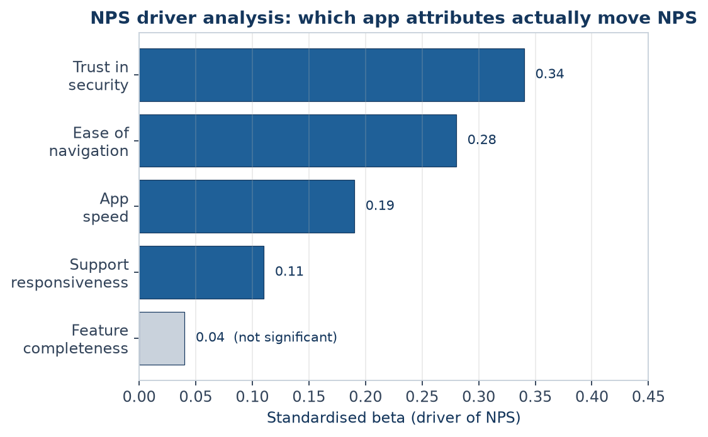
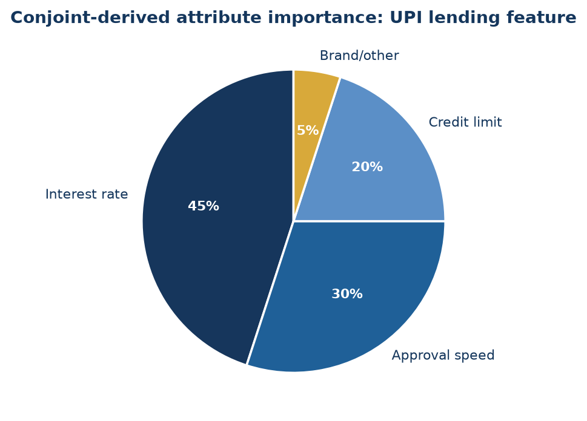
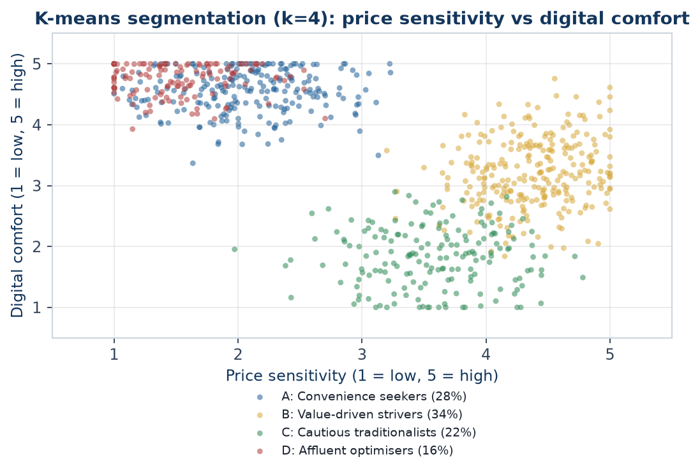
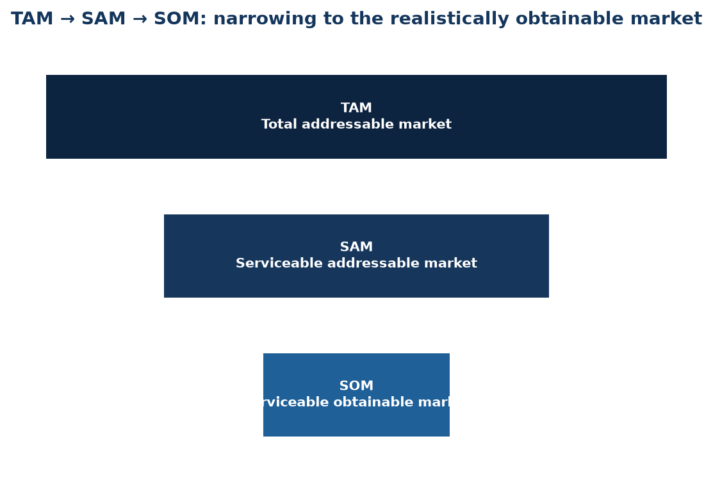
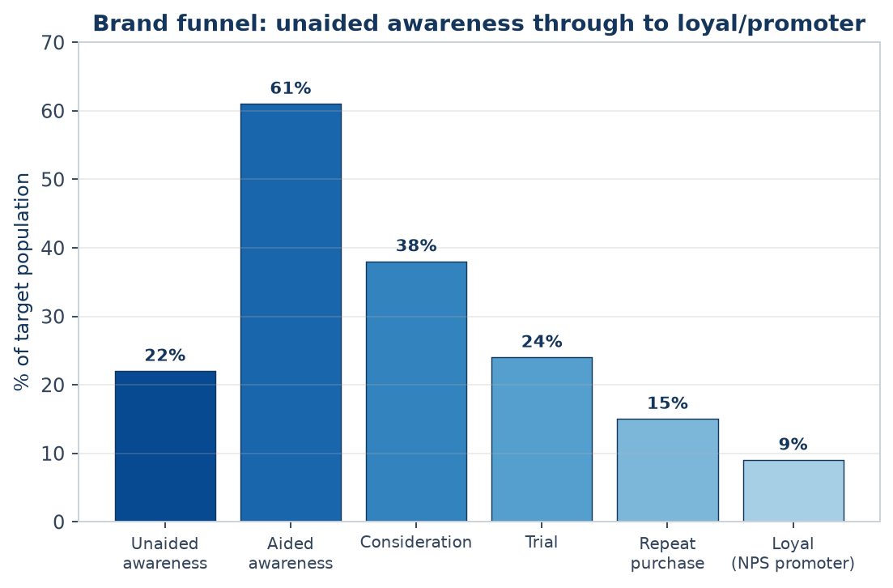
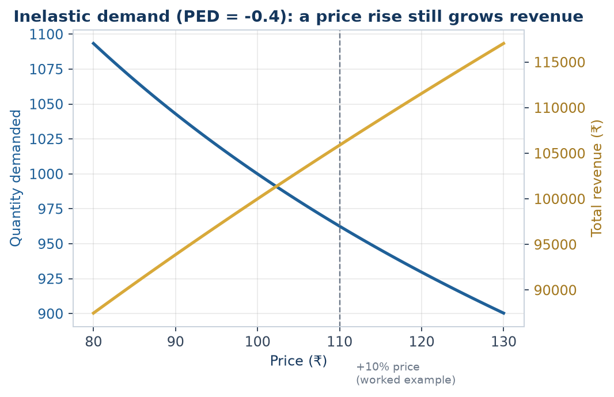
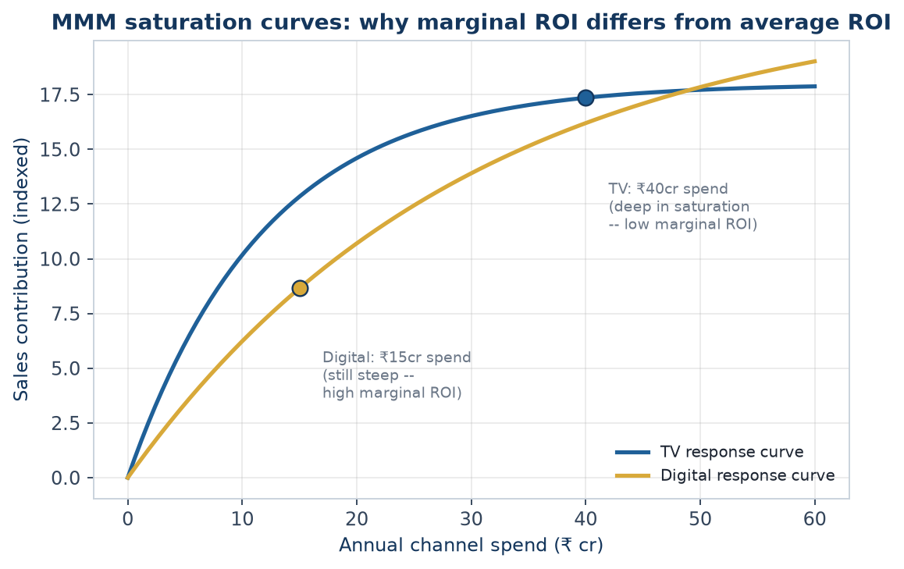
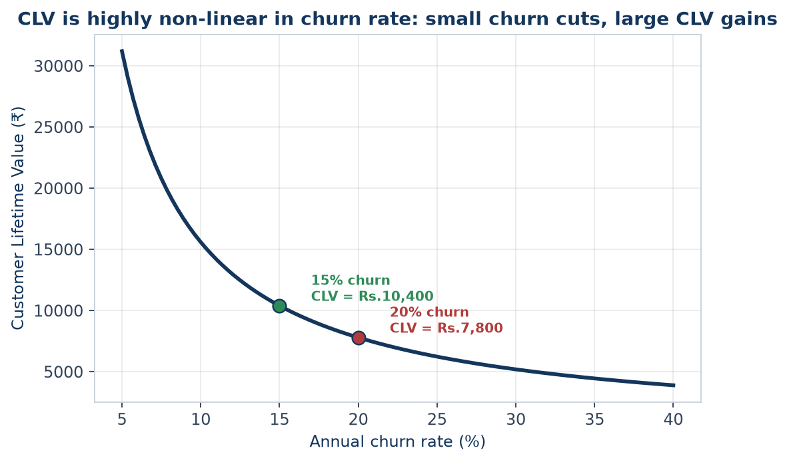

# The Market Research Analyst Handbook
### A complete, in-depth reference — every topic, explained from the ground up
*Prepared for Saikumar Kaleru. Read top to bottom; each part builds on the last. Bold terms are the vocabulary interviewers listen for. Indian-market context (CMIE, RBI, SEBI, NSS, industry bodies) is used throughout, matching the rest of this study library.*

---

# PART 1 — WHAT MARKET RESEARCH ACTUALLY IS

## 1.1 The core idea
**Market research** is the systematic collection, analysis, and interpretation of data about a market — its customers, competitors, and environment — to reduce uncertainty before a business decision. Where **equity research** answers "is this stock worth buying," market research answers "will this product sell, to whom, at what price, and against whom."

Every market research project ultimately answers one of four questions:
1. **Who** is the customer, and what do they need? (segmentation, needs)
2. **How big** is the opportunity? (market sizing)
3. **Who else** is competing for it? (competitive intelligence)
4. **What should we do** about price, product, or positioning? (decision support)

## 1.2 Market Research vs adjacent disciplines
- **Equity/Investment Research** studies a *company* to price its stock — outward-facing to public markets, ends in a buy/sell call.
- **Market Research** studies a *market or customer base* to guide product/business decisions — ends in a recommendation to a brand, product, or strategy team, not a trade.
- **Competitive Intelligence (CI)** is a specialised slice of market research focused specifically on competitors' moves, capabilities, and likely responses.
- **Business/Data Analytics** answers "what happened" from a company's own internal data; market research goes *outside* the company to answer "what's happening in the market."
- In practice these overlap heavily — a strong market research analyst reads company filings and does light equity-research-style work, and a strong equity analyst does light market-sizing work. The skill sets are transferable, which is the bridge worth using if coming from a finance/markets background.

## 1.3 Where market researchers sit
- **Agency side**: research/insights consultancies (Nielsen, Kantar, IMRB/Kantar IMRB, Ipsos, GfK, YouGov, Mintel) — client-facing, run studies for many brands.
- **Client/in-house side**: a consumer or B2B company's own insights/strategy team (FMCG, banking, telecom, e-commerce) — owns a category and runs research for internal stakeholders.
- **Consulting**: strategy/management consultancies run market-sizing and competitive-landscape workstreams as part of larger engagements.
- **Financial services angle** (the natural bridge from an equity/derivatives background): buy-side and consulting shops increasingly employ "market intelligence" analysts who combine public-market data with primary research to validate investment theses — this is the most direct crossover role.

## 1.4 The research process, end to end
1. **Define the business problem** — not the research question yet. ("Should we launch in Tier-2 cities?" is a business problem; "what is unaided brand awareness in Tier-2 cities?" is a research question.)
2. **Translate into research objectives** — specific, answerable questions.
3. **Choose a design** — exploratory, descriptive, or causal (Part 2).
4. **Choose methods** — secondary first (cheap, fast), then primary if gaps remain (Parts 3-4).
5. **Collect data** — fieldwork, surveys, interviews, desk research.
6. **Analyse** — statistical and qualitative analysis (Part 5).
7. **Report and recommend** — translate findings into a decision-ready recommendation (Part 8).

**Trap:** a research design that answers the *literal* question but not the *business* problem is a common interview failure point — always restate the business decision the research will inform before designing the study.

## 1.5 The research brief — the document that starts every project
A professional engagement begins with a **research brief**, written by the client/stakeholder (or, often in practice, drafted by the researcher *for* the stakeholder to sign off, since stakeholders rarely write a good brief unaided). A complete brief covers:
- **Background** — why this project, why now (a competitor launch, a declining metric, a new market entry decision).
- **Business objective** — the decision this research will inform, stated as a decision, not a topic ("decide whether to reformulate the product" not "understand consumer taste preferences").
- **Research objectives** — the specific, answerable questions that, once answered, let the business objective be decided.
- **Target audience/population** — who the research needs to represent.
- **Deliverables and timeline** — report format, presentation date, any interim readouts.
- **Budget and constraints** — this shapes method choice more than researchers like to admit; a ₹5 lakh budget cannot fund a 2,000-person national survey with 20 city-tier cells.
- **Stakeholder map** — who signs off, who consumes the findings, who might resist the conclusion (a market research analyst who ignores internal politics produces technically correct research that changes nothing).

**Common failure mode**: skipping straight to "let's run a survey" without a brief. A senior analyst's first move on any incoming request is to write or extract a one-page brief and get explicit sign-off on the business objective — this alone prevents the single most expensive mistake in the field: a technically well-executed study that answers a question nobody needed answered.

## 1.6 Research objectives vs research questions vs survey questions — the translation chain
Interviewers probe this distinction because junior analysts conflate the three:
- **Research objective** (business-facing): "Understand whether price or convenience is the bigger barrier to online grocery adoption among non-users."
- **Research question** (analysis-facing): "What proportion of non-users cite price vs convenience as the primary barrier, and does this differ by income band?"
- **Survey question(s)** (respondent-facing): "Which of the following best describes why you don't currently order groceries online? [price too high / delivery too slow / prefer to see product before buying / no reliable internet / other]" plus a follow-up ranking or Likert battery on each barrier.
A good analyst can walk backward from any survey question to the research question it serves to the business objective it ultimately informs — if a question can't be traced back, cut it.

---

# PART 2 — RESEARCH DESIGN

## 2.1 The three designs
- **Exploratory research** — used when the problem is vague. Goal: generate hypotheses, not test them. Methods: literature review, expert interviews, focus groups, case analysis. Small samples, qualitative, flexible.
- **Descriptive research** — used to describe a market "as it is": size, share, demographics, usage patterns, satisfaction levels. Methods: surveys, observational studies, secondary-data analysis. Larger samples, mostly quantitative, structured.
- **Causal research** — used to test whether X causes Y (e.g., does a price cut increase volume enough to grow revenue). Methods: experiments, A/B tests, controlled field trials. Requires a control group and random assignment to claim causality — correlation from a plain survey is *not* proof of causation, a point interviewers probe directly.

## 2.2 Choosing a design — the decision rule
If you don't know what you don't know → **exploratory**.
If you need to size or describe something known → **descriptive**.
If you need to prove a specific action will change an outcome → **causal**.
Most real projects are a funnel: exploratory (a few interviews) → descriptive (a large survey) → occasionally causal (a pilot/A-B test) before a big launch decision.

## 2.3 Primary vs secondary research
- **Secondary research** uses data that already exists (someone else collected it for another purpose). Cheaper, faster, but not tailored to your exact question and may be stale.
- **Primary research** is data collected specifically for this project (surveys, interviews, experiments). Expensive and slow, but exactly fits the question and is proprietary.
- **Rule of thumb**: always exhaust secondary sources first — most "we need a survey" requests are 60-80% answerable from existing reports, company filings, and government data. This is the single biggest cost-saving move a junior researcher can make, and interviewers listen for it.

## 2.4 Qualitative vs quantitative
- **Qualitative** — depth over breadth. Answers *why* and *how*. Small samples (6-30), non-statistical, rich narrative data (interview transcripts, discussion notes).
- **Quantitative** — breadth over depth. Answers *how many, how much, what %*. Large samples (100s-1000s), statistical, numeric data (survey responses, scanner data).
- **Mixed-methods** is standard practice: qualitative first to discover the right questions and language, quantitative second to measure how widespread the finding is across the population.

## 2.5 Research design worked through six Indian industries
Interviewers frequently present a one-line business problem and ask "how would you design this?" — the fastest way to build fluency is to have already worked through several. Each example below follows the same skeleton: business problem → design choice → method mix → key risk to flag.

**1. FMCG — should a snack brand reformulate to reduce sugar content?**
Business problem: will a reformulated (lower-sugar) SKU protect volume, or will core users reject the taste change?
Design: causal, via a **blind taste test** (respondents don't know which sample is reformulated) with a monadic or paired-comparison design, plus a quantitative purchase-intent survey on the winning formulation.
Method mix: central-location taste test (n≈200-300, quota-controlled by current-user vs non-user), followed by a home-use test (2-week in-home trial, n≈100) to capture repeat-usage reality beyond a single sip.
Key risk: a central-location "sip test" often overstates acceptance versus real repeated in-home consumption — always pair with a home-use test before a full reformulation, a classic FMCG research-design trap.

**2. Banking — will customers adopt a new UPI-based micro-lending feature?**
Business problem: build or don't build; if build, what credit limit and pricing.
Design: exploratory (IDIs with existing personal-loan customers and with non-borrowers) → descriptive quantitative (intent, preferred limit, acceptable interest rate via a **Gabor-Granger** or **Van Westendorp** pricing module) → light conjoint on feature bundle (limit size, interest rate, repayment tenure, processing speed).
Method mix: online survey on app users (n≈800, stratified by existing credit-bureau band if available internally), 15-20 qualitative interviews for language/objections.
Key risk: stated willingness-to-pay for credit products is notoriously unreliable (nobody wants to admit they'd pay high interest) — validate with a soft-launch/waitlist pilot measuring actual uptake at a real posted rate before committing to full-scale pricing.

**3. E-commerce — why is cart abandonment high on the checkout page specifically?**
Business problem: diagnose and fix a conversion leak.
Design: descriptive, mixed-methods — this is a case where **behavioural/analytics data should be pulled first** (internal secondary data: session recordings, funnel drop-off by step, device/payment-method cuts) before commissioning any primary research.
Method mix: quant funnel analysis (internal data, free) → usability testing (5-8 moderated sessions, think-aloud, on the actual checkout flow) → optionally an intercept exit-survey ("what stopped you from completing your order today?") triggered on abandonment.
Key risk: qualitative usability testing with 5-8 users finds ~80% of major usability issues (Nielsen's well-known finding) — resist the urge to commission an expensive large-n survey before this cheap, fast diagnostic step.

**4. Telecom — sizing demand for a new prepaid data-only plan for students**
Business problem: is the segment large enough and price-sensitive enough to justify a dedicated plan and marketing spend.
Design: descriptive, primarily secondary + light primary validation.
Method mix: top-down sizing from telecom-industry reports (TRAI data on subscriber base, student population from education-ministry data) cross-checked bottom-up via campus-intercept surveys at a sample of colleges (stratified by tier-1/tier-2 city) on current spend and switching intent.
Key risk: campus intercepts oversample students physically present and willing to stop — supplement with an online panel arm to correct for this convenience-sample bias before finalising the size estimate.

**5. Healthcare/pharma — understanding doctor prescribing behaviour for a new drug category**
Business problem: which messaging and which specialist segment to prioritise in field-force targeting.
Design: qualitative-led, given a small, hard-to-access, expert population.
Method mix: 25-30 IDIs with prescribing physicians (recruited via a medical panel/fieldwork agency, incentivised appropriately per medical-research ethics norms), segmented by specialty and prescribing volume tier; a short quantitative confirmatory survey (n≈150-200 physicians) on message resonance and stated prescribing intent.
Key risk: physicians are a scarce, expensive-to-recruit population — a poorly piloted discussion guide that wastes even 5 of 30 interviews on bad questions is a real, expensive mistake; pilot rigorously with 1-2 physicians before full fielding.

**6. Auto/EV — will consumers switch from ICE two-wheelers to electric in a specific state?**
Business problem: market-entry and product-spec decision (range, price, charging assumptions) for a new EV two-wheeler.
Design: descriptive + causal element (conjoint) — this is a multi-attribute trade-off decision (price vs range vs charging time vs brand), the textbook conjoint-analysis use case.
Method mix: quantitative survey (n≈600-1000, stratified by current vehicle type and state given large state-level policy/subsidy differences in India) with an embedded conjoint module on price/range/charging-time/brand; secondary desk research on state EV-subsidy policy and existing charging-infrastructure density.
Key risk: EV purchase intent is heavily distorted by subsidy policy that can change before launch — always model the sizing/pricing conclusion under at least two subsidy scenarios (current policy, and a "subsidy reduced/removed" downside case) rather than a single point estimate.

---

# PART 3 — SECONDARY RESEARCH (DESK RESEARCH)

## 3.1 Where to look, in order of cost
1. **Company's own data** — internal sales, CRM, support tickets, prior research archives (free, but easy to miss if not asked for).
2. **Government and regulatory sources** (India) — MOSPI/NSS surveys (consumer expenditure, employment), RBI (household finance, banking data), SEBI (mutual fund/market data), Census, Economic Survey, ministry reports (e.g. DPIIT for startups) — free and authoritative, but slow-moving and broad.
3. **Industry bodies and trade associations** — CII, FICCI, NASSCOM (IT), ASSOCHAM, and sector bodies (e.g. AMFI for mutual funds, IBA for banking) — free/cheap, sector-specific, often annual.
4. **Syndicated research firms** — Nielsen (retail audit, FMCG), Kantar, CMIE (Centre for Monitoring Indian Economy — the single most-used paid macro/company database in India), Euromonitor, Statista, Gartner/Forrester (tech), IDC. Paid, but standardised, comparable across companies, and update regularly.
5. **Public company filings** — annual reports, investor presentations, credit-rating rationale (CRISIL/ICRA/CARE), stock-exchange disclosures. Free, primary-sourced by the company itself, most useful for competitive benchmarking of listed players.
6. **News, trade press, and analyst notes** — free, current, but requires triangulation since a single source may be biased or wrong.

## 3.2 Desk research technique
- **Triangulate**: never trust one source for a market-size or growth number — cross-check at least two independent sources and reconcile the gap explicitly in the report (don't hide the disagreement).
- **Check the definition, not just the number**: two "market size" figures can differ 5x because one includes adjacent categories (e.g. "EV market" including two-wheelers vs only cars) — always confirm scope before comparing.
- **Track vintage**: a 2019 number quoted in 2026 without an update flag is a common analyst error and an easy interviewer trap ("how current is this number, and how do you know?").
- **Build a source log** as you go — every number in the final deck should be traceable to a named, dated source; this is what separates a credible market research deliverable from a guess.

---

# PART 4 — PRIMARY RESEARCH: QUALITATIVE METHODS

## 4.1 In-depth interviews (IDIs)
One-on-one, semi-structured conversations (45-60 min), used to explore a topic in depth without group dynamics influencing the answer. Best for sensitive topics (income, health, B2B purchasing decisions) or expert/stakeholder input (e.g. interviewing distributors, doctors, CFOs).

## 4.2 Focus group discussions (FGDs)
6-10 participants, a trained moderator, 60-90 minutes, used to observe group dynamics, generate ideas through discussion, and test reactions to concepts/ads/packaging live. **Risk**: groupthink and dominant-participant bias — a skilled moderator actively manages this (round-robin questions, private written responses before group discussion).

## 4.3 Ethnography / observational research
Researchers observe behaviour in its natural setting (a kirana store, a bank branch, a household) rather than asking about it — used because **stated preference and revealed behaviour often diverge** (people say they'd pay for organic food, then buy the cheaper option at the shelf). Slower and more expensive, but the gold standard for behavioural truth.

## 4.4 Other qualitative tools
- **Projective techniques** — indirect prompts (word association, sentence completion, "if this brand were a person...") used to surface associations people won't state directly.
- **Diary studies** — participants log behaviour/thoughts over days/weeks, useful for infrequent or habitual behaviours a single interview can't capture.
- **Usability/concept testing** — a moderator watches a participant use a product/prototype and think aloud, common in fintech/app research.

## 4.5 Qualitative analysis
- **Coding**: tagging transcript segments with recurring themes/categories (manually or in NVivo/Atlas.ti).
- **Thematic analysis**: grouping codes into higher-level themes and reporting prevalence ("6 of 12 respondents mentioned trust as the top barrier") — note this is *illustrative*, not statistically representative, and should never be reported as a percentage of "all customers."

---

# PART 5 — PRIMARY RESEARCH: QUANTITATIVE METHODS & SURVEY DESIGN

## 5.1 The survey design process
1. Define exactly what each question will be used to decide (no "nice to know" questions — every question earns its place).
2. Choose question types: **closed-ended** (multiple choice, Likert scale, ranking) for easy quantitative analysis; **open-ended** sparingly, for colour and to catch what closed options missed.
3. Order questions: general → specific, easy → sensitive, behavioural → attitudinal → demographic (demographics last, so people are already invested in finishing).
4. **Pilot test** on 10-20 people before full fielding — catches confusing wording, skip-logic errors, and length problems.

## 5.2 Common bias traps in question wording
- **Leading questions** — "Don't you agree our app is easy to use?" pushes agreement; ask neutrally: "How easy or difficult is our app to use?"
- **Double-barrelled questions** — "Is the app fast and reliable?" conflates two things; split into two questions.
- **Social desirability bias** — people over-report virtuous behaviour (saving, exercising) and under-report the opposite; mitigate with anonymity and neutral framing.
- **Order/anchoring effects** — the first option in a list gets chosen more often; randomise option order where the survey tool allows it.

## 5.3 Measurement scales
- **Nominal** — categories with no order (city, gender, brand used).
- **Ordinal** — ordered categories, unequal spacing (income brackets, satisfaction: poor/fair/good/excellent).
- **Interval** — ordered, equal spacing, no true zero (a 1-5 Likert scale is technically interval by convention).
- **Ratio** — ordered, equal spacing, true zero (age, spend in ₹, number of purchases) — allows the widest range of statistics (means, ratios).
- **Likert scale**: the standard 5- or 7-point agreement/satisfaction scale. Interviewers may ask why 5 vs 7 points — 7-point scales give slightly more discrimination but higher respondent fatigue; 5-point is the pragmatic default for most consumer surveys.
- **Net Promoter Score (NPS)**: "How likely are you to recommend X, 0-10?" — % Promoters (9-10) minus % Detractors (0-6), ignoring Passives (7-8). Widely used, widely criticised (a single number hides *why*), always pair with an open-ended follow-up ("what's the main reason for your score?").

## 5.4 Sampling
- **Population** — everyone the finding should generalise to (e.g. "urban Indian smartphone owners aged 18-35").
- **Sampling frame** — the actual list you can draw from (a customer database, a panel) — rarely a perfect match to the population, and the gap is a source of bias worth naming in any report.
- **Probability sampling** (every unit has a known chance of selection — allows statistically valid generalisation):
  - **Simple random sampling** — pure lottery from the full frame.
  - **Stratified sampling** — split the population into strata (e.g. by city tier), sample each proportionally — improves precision when subgroups matter.
  - **Cluster sampling** — randomly pick clusters (e.g. a few cities), then sample fully within them — cheaper for geographically spread populations, common in India given field-cost constraints.
  - **Systematic sampling** — pick every k-th unit from an ordered list.
- **Non-probability sampling** (convenience, quota, snowball, judgment) — faster/cheaper but cannot be generalised with a formal margin of error; acceptable for exploratory work, a red flag if used for a headline market-size claim.

## 5.5 Sample size — the formula interviewers actually ask for
For a proportion, at 95% confidence:

**n = (Z² × p × (1-p)) / e²**

Where Z = 1.96 (for 95% confidence), p = expected proportion (use 0.5 if unknown — it maximises required sample, the conservative choice), e = desired margin of error (e.g. 0.05 for ±5%).

**Worked example (India context):** A bank wants to estimate the % of urban customers who'd adopt a new UPI feature, ±5% margin of error, 95% confidence, p unknown (use 0.5):
n = (1.96² × 0.5 × 0.5) / 0.05² = (3.8416 × 0.25) / 0.0025 = 0.9604 / 0.0025 ≈ **384 respondents.**
This is the famous "~384" number that recurs across market research regardless of population size (above a few thousand) — population size barely matters once it's large, which surprises people new to the field and is a good interview talking point.

For a **finite population correction** (when the population itself is small, e.g. surveying a company's 2,000 enterprise clients): n_adj = n / (1 + (n-1)/N), where N is the population size.

## 5.6 Data collection modes
- **CAPI/CATI** (computer-assisted personal/telephonic interviewing) — interviewer-led, good response rates, higher cost, still common for rural/older India respondents.
- **Online panels (CAWI)** — cheapest and fastest, but skews toward internet-literate, younger, urban respondents — a real limitation to disclose, not hide, in any Indian consumer study.
- **Intercept surveys** — stopping people in a physical location (mall, branch, store) — good for in-the-moment behaviour, biased toward that location's footfall profile.

## 5.7 A full worked questionnaire (UPI micro-lending feature, from the Part 2.5 example)
Reproducing a complete, well-formed questionnaire is one of the most useful things to have memorised for a portfolio/interview exercise — note the ordering (screening → behavioural → attitudinal → conjoint-style trade-off → demographics last), the neutral wording, and the routing logic.

**Screener**
S1. Do you currently use a UPI app for payments? [Yes → continue / No → terminate]
S2. Have you ever taken a personal loan or used a "buy now pay later" product? [Yes/No — used for quota, not a terminate]

**Behavioural**
Q1. In the last 3 months, has there been an occasion where you needed short-term credit (₹2,000-₹50,000) but did not borrow? [Yes/No]
Q2. If yes, what did you do instead? [Borrowed from friends/family / Used a credit card / Delayed the purchase/expense / Used a different lending app / Other — specify]

**Attitudinal / intent**
Q3. How interested would you be in a feature that lets you borrow instantly through your UPI app, with the amount auto-debited from your next salary credit? [5-point: Not at all interested → Extremely interested]
Q4. What would concern you most about using such a feature? [Open-ended, single response]
Q5. Rate your agreement: "I trust my UPI app provider to offer fair interest rates." [5-point Likert: Strongly disagree → Strongly agree]

**Pricing (Van Westendorp Price Sensitivity Meter — four questions, same feature, asked in this order)**
Q6a. At what interest rate (% per annum) would you consider this credit line too *expensive* to use? [numeric entry]
Q6b. At what rate would you consider it *starting to get expensive*, but you'd still consider it? [numeric entry]
Q6c. At what rate would you consider it a *bargain* — great value? [numeric entry]
Q6d. At what rate would you consider it *so cheap* that you'd question the lender's legitimacy/safety? [numeric entry]

**Conjoint module** (choice-based, 6 tasks shown, each a choice among 3 hypothetical plans + "none")
Example task: "Which of these would you choose?"
- Plan A: ₹25,000 limit · 18% p.a. · 3-month repayment · instant approval
- Plan B: ₹50,000 limit · 24% p.a. · 6-month repayment · approval in 1 hour
- Plan C: ₹15,000 limit · 15% p.a. · 1-month repayment · instant approval
- None of these

**Demographics** (always last)
D1. Age band · D2. Gender · D3. City tier · D4. Monthly income band · D5. Occupation

**Notes an analyst should be able to explain about this instrument**: why the screener terminates non-UPI-users (population definition), why Van Westendorp uses four specific price points rather than one willingness-to-pay question (it triangulates an acceptable *range*, not a single number, and cross-checks internal consistency — a respondent whose "too cheap" answer exceeds their "too expensive" answer flags a bad/inattentive response), and why demographics sit last (reduces early-abandon risk on a survey that opens with sensitive financial behaviour).

## 5.8 Panel quality and data-cleaning for online surveys
Online panels (Section 5.6) introduce a data-quality problem beyond sampling bias: **inattentive or fraudulent respondents** rushing through for a panel incentive. Standard quality checks, expected knowledge for any quantitative role:
- **Speeding**: flag/remove respondents completing in under roughly a third of the median completion time.
- **Straight-lining**: selecting the same response option down an entire grid/matrix question regardless of content — a strong signal of non-engagement.
- **Attention-check items**: an instruction embedded mid-survey ("select 'Somewhat agree' for this item to show you are reading carefully") — failure is grounds for exclusion.
- **Open-end gibberish**: nonsensical or copy-pasted text in open-ended fields.
- **Logical consistency traps**: e.g. claiming to be a heavy user of a product category while also selecting "never heard of this brand" for a brand used earlier in the survey.
Reporting the **effective sample size after cleaning** (not just the raw completes) alongside the cleaning criteria applied is standard practice in a credible methodology appendix.

---

# PART 6 — DATA ANALYSIS FOR MARKET RESEARCH

## 6.1 Descriptive statistics (the first pass on any dataset)
Mean, median, mode, standard deviation, frequency distributions. Always report **median alongside mean** for skewed data (income, spend) — a few high spenders can make the mean misleading.

## 6.2 Cross-tabulation ("cross-tabs")
Breaking one variable by another (e.g. NPS score by age band) — the single most common output in a market research deck. Always check **base size** (n) in each cell; a finding on a base of 12 respondents is not reportable as a trend, only a footnote.

## 6.3 Segmentation
Grouping the market into distinct customer types who share needs/behaviour, so different strategies can be aimed at each.
- **A-priori segmentation** — segments defined in advance by known variables (age, income, geography) — simple, easy to action, sometimes not the variable that actually drives behaviour.
- **Post-hoc (cluster-based) segmentation** — statistical clustering (k-means, hierarchical clustering) on attitudinal/behavioural survey data to *discover* natural groupings — richer, but harder to explain to stakeholders and harder to identify a real customer against ("which cluster is this person?" requires a classifier built on top).
- A good segmentation is: **substantial** (big enough to matter), **distinct** (segments actually differ), **stable** (doesn't shift month to month), **actionable** (marketing/product can actually reach and target it).

## 6.4 Statistical significance testing
- **t-test** — compares means between two groups (e.g. does Segment A spend more than Segment B?).
- **Chi-square test** — tests whether two categorical variables are associated (e.g. is brand preference associated with city tier?).
- **ANOVA** — compares means across 3+ groups at once.
- **p-value**: the probability of seeing a difference this large (or larger) if there were truly no difference in the population. p < 0.05 is the conventional "statistically significant" threshold — but always pair with **effect size** (how big is the difference, practically) since a huge sample can make a trivial difference "significant."

## 6.5 Regression and conjoint analysis
- **Linear/logistic regression** — quantifies how much a set of variables (price, awareness, income) predicts an outcome (purchase, satisfaction) — used for driver analysis ("what actually moves NPS").
- **Conjoint analysis** — shows respondents product profiles that vary systematically on attributes (price, brand, features) and asks them to choose/rank; from choices, the model estimates how much each attribute (and each level, e.g. ₹999 vs ₹1499) contributes to preference. The standard technique for **pricing research** and feature prioritisation — a common interview topic for anyone claiming pricing-research experience.
- **MaxDiff (best-worst scaling)** — respondents repeatedly pick the "most" and "least" important item from small sets — a cleaner alternative to asking people to rate 20 things on a 1-5 scale (where everything ends up rated 4-5).

## 6.6 Tools of the trade
- **SPSS** — the long-standing standard for cross-tabs, significance testing, and basic multivariate stats in market research; still widely required in job postings.
- **Qualtrics / SurveyMonkey** — survey design, fielding, and light built-in analysis.
- **Excel** — pivot tables remain the day-to-day workhorse for cross-tabs and quick analysis.
- **Power BI / Tableau** — dashboarding for tracking studies (brand trackers, NPS trackers) that update on a cadence.
- **Python (pandas, statsmodels, scikit-learn)** — increasingly expected for segmentation, regression, and automating repetitive survey-data cleaning — a genuine differentiator for a candidate coming from a Python/SQL background, since most classically-trained market researchers don't code.
- **R** — still common in academic-leaning or advanced analytics teams for the same statistical work as Python.

## 6.7 Regression driver analysis — full worked example
A bank wants to know what drives NPS for its mobile app. Survey data on n=500 users includes NPS (0-10), and five predictor variables measured 1-5: app speed, ease of navigation, feature completeness, customer-support responsiveness, and trust in security.

A linear regression of NPS on the five predictors yields standardised coefficients (betas — comparable to each other since all variables are on the same 1-5 scale):
| Driver | Standardised beta | p-value |
|---|---|---|
| Trust in security | 0.34 | <0.001 |
| Ease of navigation | 0.28 | <0.001 |
| App speed | 0.19 | 0.002 |
| Customer-support responsiveness | 0.11 | 0.04 |
| Feature completeness | 0.04 | 0.31 |



**Reading this table (the part interviewers actually probe)**: trust in security is the single largest driver of NPS — larger than app speed or even feature completeness, which is *not* statistically significant (p=0.31, meaning we cannot conclude it drives NPS at all in this sample). The actionable insight is not "improve everything" but "prioritise security-trust communication and navigation simplicity over adding new features" — directly answering a resource-allocation question a findings-only report would not answer. Always check **R² (variance explained)** too — a driver model with R²=0.15 means the five variables jointly explain only 15% of NPS variation, a caveat that belongs in the same slide as the driver chart, not omitted.

## 6.8 Conjoint analysis — from raw choices to attribute importance
Continuing the Part 5.7 UPI lending conjoint: after n=600 respondents each complete 6 choice tasks (3,600 total choice observations), a multinomial logit model estimates a **part-worth utility** for each attribute level. Illustrative output:

| Attribute | Level | Part-worth utility |
|---|---|---|
| Interest rate | 15% p.a. | +0.82 |
| Interest rate | 18% p.a. | +0.21 |
| Interest rate | 24% p.a. | −1.03 |
| Credit limit | ₹15,000 | −0.44 |
| Credit limit | ₹25,000 | +0.08 |
| Credit limit | ₹50,000 | +0.36 |
| Approval speed | Instant | +0.61 |
| Approval speed | 1 hour | −0.61 |

**Attribute importance** is calculated from each attribute's *range* of utilities (max minus min), normalised to sum to 100% across attributes: interest rate's range (0.82 to −1.03 = 1.85) is the largest, making it the most important attribute (≈45% relative importance in this illustrative case), ahead of approval speed (range 1.22, ≈30%) and credit limit (range 0.80, ≈20% — with feature/brand making up the remainder). This is exactly how a pricing-research deliverable justifies a statement like "interest rate matters roughly 1.5x more to adoption than approval speed" to a pricing committee, and it is the calculation most likely to be asked to explain, step by step, in a technical interview for a role advertising conjoint/pricing-research experience.



**Market simulation**: once part-worths are estimated, they can simulate **share of preference** for any hypothetical product lineup (e.g. "if we launch Plan B against two named competitor plans, what share would we capture") by summing utilities per profile and converting to choice probabilities — this simulator output, not the raw utility table, is what gets presented to a business stakeholder.

## 6.10 A full worked segmentation case study, with cluster output
*A digital lending app runs a survey (n=800) with an attitudinal/behavioural battery, then applies k-means clustering (k=4, chosen via the elbow method on within-cluster variance) on standardised variables: price sensitivity (1-5), digital comfort (1-5), loan-purpose (categorical, recoded), and monthly income (₹).*

**Illustrative cluster output:**
| Segment | Size (%) | Price sensitivity | Digital comfort | Avg income | Primary loan purpose |
|---|---|---|---|---|---|
| A: "Convenience seekers" | 28% | 2.1 (low) | 4.6 (high) | ₹95,000 | Discretionary/lifestyle |
| B: "Value-driven strivers" | 34% | 4.4 (high) | 3.2 (mid) | ₹42,000 | Emergency/essential |
| C: "Cautious traditionalists" | 22% | 3.6 (mid-high) | 1.8 (low) | ₹58,000 | Rare, only when unavoidable |
| D: "Affluent optimisers" | 16% | 1.5 (low) | 4.8 (high) | ₹1,80,000 | Investment/opportunity |



**Reading the output (the part that gets tested in interviews)**: the four clusters are checked against the segmentation-quality criteria from Part 6.3 — **substantial** (all four segments are large enough to target, none is a tiny statistical artifact), **distinct** (the profiles genuinely differ across all four variables, not just one), **actionable** (Segment B, the largest at 34% and clearly price-sensitive with essential loan needs, is an obvious first product-and-messaging target; Segment D, though small, has high income and low price sensitivity — a candidate for a premium, fast-approval product tier rather than a discount play). The critical next step, per Part 6.3's caution about post-hoc clustering, is validating that these clusters actually predict a business-relevant outcome (e.g. repayment behaviour, cross-sell uptake) — a statistically clean cluster solution that doesn't differentiate on outcomes the business cares about is elegant but not useful.

**A common interview follow-up**: "how did you choose k=4 and not k=3 or k=5?" — the honest answer combines a quantitative heuristic (the elbow method: plotting within-cluster variance against k and picking the point where additional clusters stop meaningfully reducing variance) with a business-judgment check (does the resulting number of segments produce genuinely actionable, differentiable strategies, or does splitting further just fragment the target list without a corresponding difference in what the business would actually do for each group) — k-selection is not a purely mechanical decision.

## 6.9 Common statistical pitfalls specific to market research (interview favourites)
- **Confusing correlation in survey data with causation** — a survey showing heavy app users have higher NPS does not prove app usage *causes* satisfaction; satisfied customers may simply use the app more (reverse causality) — only a designed experiment (Part 2.1, causal research) can claim causation.
- **Small-base reporting** — presenting a sub-group finding (e.g. "Gen Z respondents in Tier-3 cities") without checking the cell has a sane base size (n≥30 as a rough floor for any percentage to be quoted, n≥100 to report with real confidence) is one of the most common junior-analyst errors flagged by senior reviewers.
- **Multiple comparisons** — running significance tests on dozens of cross-tab cells and only reporting the "significant" ones inflates the false-positive rate (with a 5% threshold, testing 20 unrelated things yields roughly one false "significant" result by chance alone) — pre-register the handful of hypotheses that matter rather than data-mining a whole cross-tab table for anything that clears p<0.05.
- **Treating a 5-point Likert mean as precise** — reporting "3.42 vs 3.38" as a meaningful difference on ordinal-by-convention data without a significance test attached is a common but unjustified precision claim.

---

# PART 7 — MARKET SIZING & COMPETITIVE INTELLIGENCE

## 7.1 TAM, SAM, SOM
- **TAM (Total Addressable Market)** — total revenue opportunity if you captured 100% of the relevant market, globally or in the defined geography.
- **SAM (Serviceable Addressable Market)** — the slice of TAM you could realistically serve given your business model/geography/channel constraints.
- **SOM (Serviceable Obtainable Market)** — the slice of SAM you can realistically capture given competition and go-to-market limits, usually over a defined time horizon (e.g. 3 years).



## 7.2 Two ways to size a market
- **Top-down**: start from a broad, authoritative number (e.g. total Indian retail spend from MOSPI/Census) and apply a chain of narrowing percentages (% online, % in category, % in target city tier) down to the target market. Fast, defensible on data sources, but errors compound multiplicatively across each percentage applied.
- **Bottom-up**: build from unit economics (number of potential customers × price × purchase frequency, or number of outlets × average sales per outlet) — more defensible and specific, but requires more granular data and assumptions to justify.
- **Best practice**: do both and **triangulate** — if top-down and bottom-up land within roughly 20-30% of each other, confidence is high; if they diverge sharply, the discrepancy itself is the most important finding to investigate before presenting either number.

**Worked example (India, illustrative):** Sizing the market for a premium D2C protein-supplement brand targeting urban gym-goers.
- *Top-down*: India population ~1.4bn → urban ~35% (~490m) → adults 18-40 ~30% of urban (~147m) → gym-goers/fitness-conscious ~8% (~11.8m) → willing to pay premium price ~15% (~1.8m potential customers) × assumed ₹6,000/year average spend ≈ **₹1,060 crore SAM**.
- *Bottom-up*: ~35,000 organised gyms in India × average 150 active members × 20% buy protein supplements × ₹6,000/year ≈ **₹630 crore.**
- The gap (₹1,060cr vs ₹630cr) would be flagged and investigated — likely the top-down "fitness-conscious %" assumption is too generous relative to the bottom-up gym-membership-based count, a classic and defensible finding to walk an interviewer through.

## 7.3 Competitive intelligence (CI)
- **Competitor mapping**: identify direct competitors (same product, same customer), indirect competitors (different product, same need), and potential entrants.
- **Porter's Five Forces** (also core to equity/strategy work — the crossover point with fundamental research): threat of new entrants, bargaining power of buyers, bargaining power of suppliers, threat of substitutes, competitive rivalry — used to assess how attractive/defensible a market structure is.
- **Win-loss analysis**: systematically interviewing recently won and lost deals/customers to understand *why* — one of the highest-value, most underused CI techniques in B2B contexts.
- **Benchmarking**: comparing pricing, features, service levels, and public financials (for listed competitors) side by side — this is where equity-research-style spreadsheet skills transfer directly into a market research/CI role.
- **Sources for CI in India**: competitor annual reports and investor decks, MCA filings (Ministry of Corporate Affairs — company financials for private Indian companies), app-store reviews and ratings, job postings (signal hiring direction/expansion plans), patent filings, News/PR, LinkedIn headcount trends by function.

## 7.4 Industry/sector analysis frameworks
- **PESTEL** — Political, Economic, Social, Technological, Environmental, Legal factors shaping an industry's outlook, used for the macro layer of an industry report.
- **Value chain analysis** — mapping who captures value at each stage (raw material → manufacturing → distribution → retail → customer) to identify where a new entrant or investment could capture margin.
- **Life-cycle stage** — is the industry in introduction, growth, maturity, or decline? Growth-stage industries reward market-share-gain strategies; mature industries reward cost/efficiency strategies — this framing should show up explicitly in any industry-analyst-style report or interview answer.

## 7.5 Four more worked market-sizing examples across sectors
**Health insurance — sizing the addressable market for a new digital-first health insurer, urban India, age 25-45.**
Top-down: urban population ~490m → age 25-45 ~28% (~137m) → currently uninsured or under-insured ~55% (~75m) → digitally reachable/comfortable buying insurance online ~40% (~30m) → realistic 5-year penetration for a new entrant ~2% (~600,000 policies) × average premium ₹8,000/year ≈ **₹480 crore five-year SOM run-rate.**
Bottom-up cross-check: existing digital insurance aggregators report roughly 2-2.5 crore health-insurance policy searches/year online in this age band; a realistic conversion-and-capture rate for a new entrant against established players (~3-5% share of searches converting to that insurer) gives a comparable order-of-magnitude figure — used here to sanity-check the top-down chain rather than as the primary method, since aggregator search volume is a proxy for intent, not guaranteed purchases.

**Quick-service restaurant (QSR) — sizing demand for a new regional (South Indian) QSR chain entering North India.**
Bottom-up (the more defensible method for a physical-location business): target 150 outlets in 5 years across 8 cities × average footfall 300 customers/day/outlet × average ticket size ₹250 × 350 operating days/year ≈ **₹394 crore annual revenue at full 150-outlet run-rate.** Each input (footfall, ticket size) benchmarked against disclosed same-store-sales metrics of listed QSR comparables (from their annual reports/investor decks) rather than invented — this is the direct equity-research-skill crossover point: reading a competitor's public disclosures to calibrate a private/hypothetical sizing model.

**B2B SaaS — sizing the Indian market for an HR-tech payroll-compliance product targeting mid-size companies (200-2,000 employees).**
Bottom-up: number of Indian companies in the 200-2,000 employee band (from MCA/industry-database counts) ≈ 45,000 → addressable (excludes those already on adequate in-house/competitor systems, estimated via a short win-loss/market-scan exercise) ~60% (~27,000) → realistic 3-year penetration for a challenger product ~8% (~2,160 customers) × average contract value ₹4.5 lakh/year ≈ **₹97 crore three-year ARR potential.** B2B sizing leans more heavily on a firmographic company count than a population-based top-down chain, since the buying unit is a company, not a consumer — an important distinction to state explicitly when asked to size any B2B market.

**Two-wheeler EV (extending the Part 2.5 conjoint example into full TAM/SAM/SOM) — a specific state, 3-year horizon.**
TAM: total two-wheeler unit sales in the state per year (from SIAM/industry-body data) × average price ≈ total two-wheeler market value.
SAM: the EV-eligible slice — filtered by realistic charging-infrastructure coverage (only cities/towns with adequate density) and by income bands that can afford the EV price premium even after subsidy.
SOM: SAM × assumed market share for a new entrant given 2-3 established EV players already present, informed by the conjoint-derived share-of-preference simulation (Part 6.8) rather than a flat guessed percentage — this is the cleanest example of primary research output (conjoint utilities) feeding directly into a market-sizing model rather than the two being separate exercises, a connection worth making explicitly in any portfolio writeup.

## 7.6 Competitive intelligence — a fuller worked example (win-loss analysis)
A B2B SaaS company is losing more competitive deals than expected against one named competitor. A win-loss research program:
1. **Sample**: the last 20-30 closed-lost deals against that competitor specifically, plus 10-15 closed-won for contrast, interviewed within 30-60 days of the decision (memory degrades fast beyond this window).
2. **Who to interview**: the actual economic buyer/decision-maker, not just the day-to-day product champion — different stakeholders weight different factors (a CFO cares about total cost of ownership, an IT admin cares about integration effort).
3. **Independent interviewer**: ideally not the salesperson who lost the deal, since prospects are more candid with a neutral researcher, and the salesperson's own account of "why we lost" is a biased secondary source, not primary evidence.
4. **Structured but open discussion guide**: what triggered the evaluation, who else was considered, what ultimately tipped the decision, what would have changed the outcome, unprompted then prompted on standard factors (price, features, support, brand trust, implementation timeline).
5. **Synthesis**: code responses into a small number of loss reasons and report **prevalence with the actual base** ("11 of 24 interviewed closed-lost deals cited implementation timeline as the primary factor" — not "44% of customers"), cross-tabbed against deal size and industry to check whether the loss pattern is universal or segment-specific.
6. **Output**: a ranked, evidence-backed list of the true competitive gaps (as opposed to the sales team's anecdotal, recency-biased narrative) — routinely the single most-cited-as-valuable market research deliverable in B2B software, because it replaces internal opinion with external evidence on exactly the question (why do we lose) that internal teams are least objective about.

---

# PART 8 — CONSUMER INSIGHTS & REPORTING

## 8.1 From data to insight
A **finding** is a fact from the data ("62% of respondents cited price as the top purchase barrier"). An **insight** explains *why it matters* and *what to do* ("price sensitivity is highest among first-time buyers, not repeat buyers — a starter SKU at a lower price point could convert this segment without discounting the core range"). Interviewers and hiring managers explicitly screen for candidates who default to insight, not just findings — this is the single most-repeated piece of feedback in market research interview prep material.

## 8.2 Customer journey mapping
Documenting the stages a customer goes through (awareness → consideration → purchase → onboarding → usage → advocacy/churn), the touchpoints at each stage, and the pain points/emotions at each — used to pinpoint exactly where research or product intervention should focus.

## 8.3 Personas
Composite, research-based archetypes representing a segment ("Priya, 28, first-jobber, price-sensitive, discovers brands via Instagram") — used to make segmentation memorable and actionable for product/marketing teams. Must be grounded in actual data (segmentation output, real quotes), not invented from assumption — a common quality failure point.

## 8.4 Reporting and storytelling
- **Structure**: Executive summary (the "so what" in one page) → methodology → key findings (3-5 headline insights, not 40 slides of data) → detailed appendix.
- **One slide, one message** — a chart should support a single stated takeaway in the slide title, not force the reader to interpret it themselves.
- **Show the uncertainty**: sample sizes, margins of error, and data vintage belong on every relevant slide, not buried in an appendix — this is what separates rigorous market research from marketing collateral dressed up as research.

---

# PART 9 — CAREERS, ROLE EXPECTATIONS & INTERVIEW PREP

## 9.1 Typical role ladder
Research Executive/Analyst (0-2 yrs, fieldwork + basic analysis) → Senior Research Analyst/Associate (2-5 yrs, owns a study end-to-end, client/stakeholder-facing) → Research Manager (5-8 yrs, owns a category/client relationship, manages analysts) → Insights Director/Head of Insights (8+ yrs, sits on the leadership team, sets the research agenda).

**"Senior Market Research Analyst" bar (typically 3-5 yrs)**: can independently scope a study, choose the right method without guidance, run analysis in SPSS/Excel/Python, and present findings directly to a business stakeholder with a clear recommendation — not just execute a brief handed down from a manager.

## 9.2 What interviewers actually probe for
1. **Methodology judgment** — given a vague business problem, can you design the right study (this handbook's Parts 2-5)?
2. **Numerical fluency** — sample size, significance, basic segmentation logic, market sizing math (Parts 5-7), often via a live case/whiteboard exercise.
3. **"So what" thinking** — can you turn a data table into a decision-ready recommendation (Part 8)?
4. **Domain/business acumen** — do you understand the category (FMCG, banking, fintech, retail) well enough for the insight to be credible, not generic?

## 9.3 Sample case-style interview question (worked)
*"A bank wants to know whether to launch a co-branded credit card with an e-commerce platform. How would you research this?"*
- Restate the business decision: launch or not, and if yes, target segment and card benefits.
- Design: exploratory (a few interviews with existing co-brand-card holders at competitor banks, desk research on comparable co-brand card economics) → descriptive quantitative survey (interest/intent, preferred benefits, willingness to pay annual fee) on a representative sample of the platform's existing customers, stratified by spend tier.
- Sizing: bottom-up from the platform's active user base × estimated card-eligible % (income/credit-score proxy) × estimated adoption rate from comparable launches.
- Competitive: benchmark 2-3 existing co-brand cards in market (cashback %, fee, partner) via desk research and MITC (Most Important Terms & Conditions) disclosures.
- Recommendation: a go/no-go with the target segment, expected uptake, and the single biggest risk flagged explicitly (e.g. cannibalisation of the bank's existing card base).
This structure — decision, design, sizing, competitive check, risk-flagged recommendation — is the reusable skeleton for almost any market-research case interview.

## 9.4 Bridging a finance/derivatives background into market research
The honest gap (see `senior_research_skills.md` in the job_apply_agent repo) is direct consumer/survey experience. The honest strength is quantitative rigour most classically-trained market researchers lack: comfort with statistics, sample-size logic, regression, and — critically — **Python for automating survey-data cleaning and analysis**, which is still a differentiator in most agency and in-house insights teams. Frame the F&O/derivatives background as: "trained to read what a large, noisy dataset is actually saying, under time pressure, and to be explicit about uncertainty" — which is the exact same instinct market research analysis requires, applied to a different kind of data.

---

# PART 10 — BRAND & ADVERTISING RESEARCH

## 10.1 Brand equity — what it is and how it's measured
**Brand equity** is the commercial value a brand name adds beyond the functional product itself (why people pay more for a branded product than an identical unbranded one). Two widely referenced frameworks:
- **Aaker's Brand Equity model** — five pillars: brand loyalty, brand awareness, perceived quality, brand associations, and other proprietary assets (patents, trademarks, channel relationships).
- **Keller's Customer-Based Brand Equity (CBBE) pyramid** — builds bottom-up: salience (awareness) → performance & imagery (what it does, how it makes you feel) → judgments & feelings (rational and emotional response) → resonance (deep loyalty/identification at the top) — used heavily in brand-tracking questionnaire design, since each pyramid layer maps to a specific survey battery.

## 10.2 Awareness metrics — the standard funnel
- **Unaided (spontaneous) awareness**: "What brands of [category] can you name?" — no list shown; the strongest, most defensible awareness metric since it isn't prompted.
- **Aided awareness**: "Have you heard of [Brand X]?" with the name shown — always higher than unaided, and easy to inflate by suggestion; report both, never aided alone.
- **Top-of-mind (TOM)**: the *first* brand named in an unaided-awareness question — the single strongest predictor of default/habitual purchase in low-involvement categories (FMCG especially).
- **Consideration**: "Which brands would you consider buying?" — the funnel stage between awareness and purchase; a brand can have high awareness but low consideration (a well-known but distrusted or "not for me" brand), an important diagnostic distinction.



An illustrative funnel across all the stages this Part covers: note aided awareness (61%) sits well above unaided (22%), exactly as Section 10.2 describes — always report both, never aided alone. The steep consideration-to-trial drop (38% to 24%) is a common, diagnostic pattern: it usually signals a distribution, price, or trust barrier rather than an awareness problem, since these people already know and would consider the brand but haven't yet bought it — precisely the kind of funnel-stage diagnosis that turns a topline number into an actionable insight (Part 8.1).

## 10.3 Ad/copy testing
- **Pre-testing** (before a campaign airs): concept boards or animatics shown to a sample, measured on message takeaway (did they understand the intended message, unprompted), likeability, brand linkage (do they correctly attribute the ad to the right brand, without prompting — a real and common failure, especially in cluttered categories), and purchase-intent shift pre/post exposure.
- **Post-testing / tracking**: measuring actual campaign recall and brand-metric movement after a campaign has run in-market, via periodic (monthly/quarterly) brand-tracker waves.
- **Key diagnostic**: **brand linkage failure** — an ad that tests well on likeability but where a meaningful share of viewers cannot correctly name the advertised brand is, commercially, closer to a wasted spend than a "successful" ad; this single point is one of the most repeated pieces of ad-testing feedback given to junior researchers.

## 10.4 Brand tracking studies
A **tracker** is a recurring (usually monthly or quarterly), methodologically-fixed survey run continuously to monitor a standard battery of brand-health metrics (awareness, consideration, usage, NPS, key brand-association ratings) over time, so that movement is comparable wave-on-wave. Design discipline required: sample size, quotas, and exact question wording must stay fixed across waves — even a small wording change breaks comparability and is a common, costly research-governance mistake when handing a tracker between agencies or research managers.

## 10.5 Positioning and perceptual mapping
A **perceptual map** plots brands (including one's own) on two commercially meaningful axes derived from consumer ratings (e.g. "premium ↔ value" and "traditional ↔ modern"), usually built via **factor analysis** or **multi-dimensional scaling (MDS)** on a larger battery of brand-attribute ratings, collapsed to the two dimensions that explain the most variance in how consumers actually differentiate brands (not the two dimensions a marketing team assumes matter). Used to identify **white space** — an attractive, currently unoccupied position on the map — as a basis for repositioning or new-product strategy.

---

# PART 11 — B2B MARKET RESEARCH

## 11.1 How B2B research differs from consumer (B2C) research
- **Buying unit**: B2B involves a **buying committee** (economic buyer, technical evaluator, end user, sometimes procurement/legal), not a single consumer decision-maker — research needs to sample and weight multiple stakeholder types per account, not just "the customer."
- **Sample size and access**: B2B populations are far smaller and harder to reach (a market may have only a few hundred relevant companies globally) — research leans qualitative-heavy (Part 4) far more than B2C, and quantitative samples of n=100-150 are often considered large and adequately powered in a B2B context, versus n=384+ as a consumer default (Part 5.5).
- **Sales cycle length**: B2B decisions can take months to years, meaning win-loss research (Part 7.6) and longitudinal account-based tracking matter more than single-point-in-time studies.
- **Firmographics replace demographics**: company size (employees/revenue), industry (NAICS/NIC code), and tech stack/existing vendor relationships are the segmentation variables, in place of age/income/city tier.

## 11.2 Firmographic and technographic segmentation
- **Firmographic**: company size, industry, geography, growth stage (startup/scale-up/enterprise), ownership structure (private/listed/PE-backed) — directly analogous to demographic segmentation but for companies.
- **Technographic**: what software/tools/vendors a company already uses — a strong predictor of both need and switching cost, increasingly available via third-party technographic data providers (e.g. BuiltWith-style tools for web stack) as a secondary-research input before primary fielding.

## 11.3 B2B research methods in practice
- **Expert/stakeholder IDIs** dominate over surveys for market-sizing and competitive-landscape work, given small populations.
- **Account-based research (ABR)**: deep-dive research on a small number of named target/strategic accounts rather than a representative sample — common for enterprise sales enablement.
- **Advisory panels / customer advisory boards**: an ongoing structured group of key customers consulted periodically — a hybrid between qualitative research and relationship management.
- **Trade-show and conference intercepts**: a practical, if biased-toward-attendees, way to reach a hard-to-access B2B population efficiently in one place.

## 11.4 B2B and the equity-research crossover
B2B market research overlaps most directly with the **industry/channel-check** work equity and credit analysts already do (calling suppliers, distributors, and customers of a company under coverage to validate a thesis) — a candidate coming from a markets background should lead with this parallel explicitly in interviews, since it is a genuinely transferable, not just adjacent, skill.

---

# PART 12 — RESEARCH OPERATIONS, VENDOR MANAGEMENT & ETHICS

## 12.1 Working with fieldwork agencies and vendors
Most in-house/client-side researchers don't run fieldwork themselves — they commission and manage agencies (for panels, moderators, translators, field interviewers). Core vendor-management skills:
- **Writing a clear RFP/scope**: sample size, quotas, incidence rate (what % of the general population qualifies — a low incidence rate, e.g. finding luxury-car owners, sharply raises fieldwork cost and time), timeline, and deliverable format.
- **Cost benchmarks to sanity-check quotes**: online quantitative surveys are priced roughly per completed interview (varies hugely by length, incidence, and country); qualitative IDIs are priced per interview including incentive and moderator/analyst time; always request a **per-unit cost breakdown**, not just a lump sum, to compare vendors fairly.
- **Quality control of vendor delivery**: spot-checking raw data against the Part 5.8 quality-check criteria before accepting a vendor's "completes," not just trusting the topline numbers handed over.

## 12.2 Fieldwork timelines — realistic planning benchmarks
- Quick online quant survey (n≈300-500, general population, standard incidence): **1-2 weeks** fielding.
- Complex/low-incidence quant (e.g. B2B decision-makers, niche category users): **3-6 weeks.**
- Qualitative IDIs/FGDs (recruitment + fieldwork + analysis): **3-5 weeks** for a standard 15-20 interview study.
- A full mixed-methods project (qual exploratory → quant descriptive → reporting): **8-12 weeks** end to end is a realistic default planning assumption, and stakeholders who ask for this in two weeks need to be told explicitly what has to be cut (sample size, geographic spread, or the qualitative phase) to hit that timeline — a senior analyst's job includes managing this expectation up front, not silently cutting corners.

## 12.3 Research ethics and data privacy (India-specific)
- **Informed consent**: respondents must be told the purpose of the research, how data will be used, and that participation is voluntary — standard practice codified by bodies like ESOMAR internationally.
- **Anonymity/confidentiality**: individual responses should not be traceable back to a named respondent in any client-facing deliverable; only aggregated/anonymised data is reported.
- **India's Digital Personal Data Protection (DPDP) Act, 2023** — the relevant compliance framework for any Indian market research operation collecting personal data (name, phone, email, and combined with other fields, even things like precise location or purchase history): requires a clear, specific purpose for data collection, real consent (not a buried checkbox), data-minimisation (collect only what's needed for the stated research purpose), and defined data-retention limits. A market research analyst does not need to be a lawyer, but should be able to state, for any project, what personal data is collected, why, how long it's retained, and how a respondent could request deletion — increasingly a standard interview question as data-privacy regulation tightens.
- **Research vs marketing/sugging**: **"sugging"** (selling under the guise of research) and **"frugging"** (fundraising under the guise of research) are explicitly unethical and, per most industry codes, grounds for professional sanction — a legitimate research contact must never pivot into a sales pitch.
- **Vulnerable populations**: additional care (parental consent, simplified language, extra anonymity protection) is required when researching minors, patients, or other vulnerable groups — relevant in healthcare/pharma and education-sector research specifically.

## 12.4 Building a research repository / insights management
Mature insights functions maintain a **searchable repository** of past studies (tagged by topic, category, date, and key findings) so that a new project starts with "what have we already learned" (Part 3's secondary-research-first principle applied to a company's *own* research history, not just external sources) rather than re-commissioning research that already exists somewhere in the organisation — a real, common inefficiency in large companies with fragmented insights functions, and a differentiator for a candidate who proactively asks "does a repository exist?" on joining a new team.

---

# PART 13 — DIGITAL & SOCIAL RESEARCH METHODS

## 13.1 Social listening
**Social listening** is the systematic monitoring and analysis of public social-media conversation (X/Twitter, Instagram, YouTube comments, Reddit, review sites, forums) about a brand, category, or competitor, using tools (Brandwatch, Sprinklr, Talkwalker, or lighter-weight tools for smaller budgets) that aggregate and code mentions at scale.
- **Sentiment analysis**: classifying mentions as positive/negative/neutral, usually via NLP models — useful for trend-spotting but notoriously imperfect on sarcasm, regional slang, and code-switching (mixing English and a regional language mid-sentence, common in Indian social media) — always spot-check a sample of the automated classification against human coding before trusting the topline sentiment number in a client deliverable.
- **Share of voice (SoV)**: a brand's mention volume as a % of total category mentions — a rough proxy for relative market visibility/buzz, not a direct measure of sales impact.
- **Strength over survey research**: captures *unprompted*, naturally-occurring reactions (nobody is being asked a leading question), and is fast/cheap relative to fielding a survey — a genuine complement to, not full replacement for, structured survey research (Part 5), since social-media populations skew younger, more urban, and more vocal/extreme than the general population.
- **Use case**: real-time crisis monitoring (a product-safety issue or PR crisis unfolding), competitive campaign tracking, and early signal detection for emerging trends before they show up in slower quarterly tracker waves (Part 10.4).

## 13.2 Web and app analytics as a research input
Behavioural digital-analytics data (page views, funnel drop-off, session recordings, heatmaps, app-event logs) is technically **secondary data** in the Part 3 sense (already being collected for operational purposes) but is one of the highest-value, most underused inputs to market research when a company has direct digital touchpoints.
- **Combining with primary research**: the equity-research-style "channel checks" analogy applies directly here — analytics tells you *what* happened (a specific checkout step has high drop-off), while a follow-up qualitative usability study or exit survey tells you *why* (the Part 5.6/2.5 e-commerce cart-abandonment example is the canonical case).
- **A/B testing (online experiments)**: the digital-native version of Part 2.1's causal research design — randomly assigning users to a control (existing) experience and a treatment (new) experience and measuring the difference in a defined metric (conversion rate, time-on-page, revenue-per-visitor). Requires a large enough sample and traffic volume to reach statistical power (the same significance-testing logic as Part 6.4, applied to a live product change rather than a survey question), and requires genuinely random assignment to support a causal claim — informal "before/after" comparisons without a concurrent control group are vulnerable to confounding from any other simultaneous change (seasonality, a marketing campaign, a competitor's move).
- **Common pitfall**: stopping an A/B test as soon as it *looks* significant ("peeking") inflates the false-positive rate exactly like the multiple-comparisons problem in Part 6.9 — a pre-registered sample size/duration, decided before launching the test, is the correct discipline.

## 13.3 Online research communities (MROCs)
A **Market Research Online Community (MROC)** is a private, recruited panel of engaged customers/prospects who participate in ongoing discussions, polls, diary exercises, and concept reactions over weeks or months, rather than a single one-off survey or focus group.
- **Advantage over a single FGD/survey**: builds longitudinal depth (the same people, tracked over time, reveal how attitudes evolve, e.g. across a product's actual usage lifecycle) and lets a research team pose follow-up questions iteratively as new findings emerge, closer to an ongoing conversation than a single snapshot.
- **Trade-off**: more expensive and operationally heavier to run than a one-off study, and the same self-selection concern as any recruited panel (Part 5.6's online-panel bias) applies — an MROC skews toward more engaged, opinionated customers, useful for depth but not for representative incidence estimates.

## 13.4 Mobile ethnography and passive metering
- **Mobile ethnography**: participants use a smartphone app to capture photos, videos, and short reflections of real moments (a grocery-store visit, a specific usage occasion) as they happen, closing the gap between the Part 4.3 ethnography ideal (observing real behaviour) and the practical cost/access constraints of sending a researcher to physically observe every participant.
- **Passive metering**: with consent, software passively logs actual behaviour (apps used, time spent, purchase receipts scanned) rather than relying on self-report — directly addresses the stated-vs-revealed-preference gap (Part 4.3) with less participant burden than a full diary study (Part 4.4), though it raises correspondingly higher data-privacy obligations (Part 12.3/DPDP Act) given the depth of personal behavioural data collected.

---

# PART 14 — RETAIL & SHOPPER RESEARCH

## 14.1 Shopper research vs consumer research — a distinction worth stating explicitly
**Consumer research** studies why people choose a *brand/product* (need states, brand perception, usage). **Shopper research** studies behaviour specifically *at the point of purchase* — the in-store or on-page decision moment, which can diverge meaningfully from stated brand preference (a shopper who says they prefer Brand A in a survey may still buy Brand B in-store due to shelf placement, a promotion, or simple habit/convenience). A complete go-to-market research plan typically needs both.

## 14.2 Path-to-purchase and the decision journey in a physical/digital store
Mapping the sequence from store/site entry to purchase: awareness of the category need → navigation to the relevant aisle/category page → comparison among visible/available options → selection → checkout. Each step is a potential drop-off point, and — mirroring the digital funnel-analysis logic in Part 13.2 — in-store traffic patterns (via footfall sensors or, more simply, structured in-store observation) can be analysed the same way as an online conversion funnel.

## 14.3 Share of shelf and planogram research
- **Share of shelf (SOS)**: a brand's proportion of shelf space (facings, linear feet, or eye-level positioning) within a category, benchmarked against the brand's actual market share — a brand that is meaningfully under-shelved relative to its market share has a quantifiable, addressable negotiating point for trade/retail relationship teams.
- **Planogram testing**: testing different shelf-layout configurations (by brand block vs by sub-category vs by price tier) via either a physical store test (a small set of "test" stores running the new planogram vs matched "control" stores on the old layout) or, increasingly, virtual-reality/3D-simulated store environments that let many layout variants be tested faster and cheaper than physical resets — a direct extension of the causal-research control-group logic from Part 2.1, applied to store layout rather than a survey question.

## 14.4 In-store audits and mystery shopping
- **Retail audits**: systematic, repeated store visits (by field staff or a syndicated provider like Nielsen's retail audit service) recording stock availability (out-of-stock rate — a chronically under-measured but high-revenue-impact metric, since a stocked-out product simply can't be bought regardless of brand preference), pricing, and promotional compliance (is the agreed promotional price/display actually live in-store).
- **Mystery shopping**: trained researchers pose as ordinary customers to evaluate service quality, staff product knowledge, and process adherence against a structured scorecard — used heavily in banking branch research, retail, and hospitality, and distinct from a standard customer-satisfaction survey because it captures *observed* service delivery rather than a customer's *recalled* impression of it.

## 14.5 E-commerce-specific shopper research
Digital-shelf equivalents of the above: **share of search** (a brand's visibility in on-platform search results for relevant category terms, the e-commerce analogue of physical share of shelf), **content/listing audits** (image quality, review count/rating, A+ content presence — all measurable drivers of on-platform conversion), and **competitive price-tracking** (automated monitoring of competitor pricing across marketplaces, feeding directly into the pricing-research toolkit from Part 5.7's Van Westendorp/Gabor-Granger methods).

---

# PART 15 — INTERNATIONAL & CROSS-CULTURAL RESEARCH

## 15.1 Why multi-country research isn't just "run the same survey in more places"
A survey instrument validated in one market cannot be assumed to work identically elsewhere — question wording, response-scale interpretation, and even the underlying construct being measured (what "quality" or "value" *means* to a respondent) can differ meaningfully across cultures. Treating a multi-country study as a simple translation exercise is one of the most common and costly mistakes in international research.

## 15.2 Translation and back-translation
The standard rigour check: a questionnaire is translated from the source language into the target language by one translator, then **independently translated back** into the source language by a second translator who has not seen the original — discrepancies between the original and the back-translated version flag wording that likely doesn't carry the same meaning, before the survey is ever fielded. Simple, literal translation without this check risks subtly changing what's actually being measured (e.g. an idiom or brand-attribute term that has no direct equivalent).

## 15.3 Cultural response-style bias
Documented, systematic differences in how different cultural groups use rating scales, independent of their actual underlying opinion:
- **Acquiescence bias**: a tendency to agree with statements regardless of content, more pronounced in some cultural contexts than others.
- **Extreme response style**: a tendency to favour the endpoints of a scale (strongly agree/strongly disagree) over the middle options, again with documented cross-cultural variation.
- **Practical implication**: comparing raw mean Likert scores (Part 5.3) across countries without adjusting for these response-style differences can produce misleading conclusions (e.g. "Country A loves this product more than Country B" when the gap is partly or wholly a scale-usage artifact, not a genuine preference difference) — techniques like within-respondent standardisation or focusing on rank-order/relative comparisons within each country, rather than raw cross-country score comparisons, help correct for this.

## 15.4 Sampling and fieldwork logistics across markets
Incidence rates, panel quality, and appropriate data-collection modes (Part 5.6) can vary hugely by country — a mode that works well in one market (online panels in a highly digitally-penetrated market) may badly under-represent the population in another (where CAPI/CATI or intercept methods remain necessary for a representative sample) — a multi-country study's methodology section should specify and justify the mode used *per market*, not assume one mode fits all.

## 15.5 Where this matters directly for an India-based analyst
Multinational companies operating in India (or Indian companies expanding into other emerging markets) routinely need India-specific adaptations even within a "global" study framework: language (a single "Hindi" version is often insufficient given India's genuine linguistic diversity — a truly national sample may need several regional-language instrument versions), rural/urban mode differences (CAPI still dominant in many rural fieldwork contexts, per Part 5.6), and category-specific cultural translation (e.g. "value for money" carries different weight and meaning across Indian income segments than in a Western market context) — an analyst who can speak specifically to these adaptation points, rather than treating India as a single homogeneous market, demonstrates real category depth in an interview.

---

# PART 16 — ADVANCED PRICING RESEARCH & REVENUE MANAGEMENT

## 16.1 Beyond Van Westendorp and Gabor-Granger: choice-based pricing research
Part 5.7 and Part 6.8 covered the Van Westendorp Price Sensitivity Meter and choice-based conjoint applied to pricing. A fuller pricing-research toolkit an analyst should know:
- **Gabor-Granger** (introduced briefly in Part 5's cross-references): respondents are shown a single price and asked a simple purchase-intent question ("would you buy at ₹X?"); if yes, the price is raised and asked again; if no, it's lowered — iterating to trace out a full demand curve at the individual level. Simpler to field than conjoint, but more vulnerable to anchoring on the *first* price shown, and doesn't capture trade-offs against competing products the way a full choice-based conjoint does.
- **Brand-Price Trade-Off (BPTO)**: respondents repeatedly choose among branded products at varying prices across several rounds, revealing brand-price substitution patterns (at what price does a respondent switch from their preferred brand to a cheaper alternative) — useful specifically for understanding brand equity's cash value in price terms, a natural bridge to the brand-equity frameworks in Part 10.

## 16.2 Price elasticity of demand — the concept every pricing researcher must connect findings to
**Price elasticity of demand (PED)** = % change in quantity demanded ÷ % change in price. A category/product with PED > 1 (in absolute value) is **elastic** — demand is highly sensitive to price, and a price cut can increase total revenue if the volume gain outweighs the per-unit price loss. PED < 1 is **inelastic** — demand barely moves with price, and a price increase generally raises revenue since volume loss is proportionally smaller than the price gain. **Worked example**: a 10% price increase leads to a 4% volume decline → PED = -4%/10% = -0.4 (inelastic, in absolute terms 0.4 < 1) → revenue impact ≈ (1.10 × 0.96 − 1) ≈ **+5.6%**, meaning the price increase is revenue-accretive despite losing some volume. Every pricing-research deliverable should ultimately translate a "willingness to pay" finding into this kind of revenue-impact framing, since that is what a pricing committee actually decides on.



## 16.3 Revenue management and dynamic pricing research
In categories with perishable inventory or capacity constraints (airlines, hotels, ride-hailing, event ticketing), pricing research extends into **revenue management** — understanding how willingness to pay varies by purchase timing, remaining inventory, and customer segment (business vs leisure traveller, for instance), so price can be dynamically adjusted to maximise total revenue rather than set once and left static. Market research supports this with segment-specific willingness-to-pay studies (e.g. a business traveller's WTP curve is typically far less price-elastic than a leisure traveller's for the same route) that feed the pricing algorithms revenue-management teams build — a genuine crossover point between market research and quantitative/pricing-analytics roles.

## 16.4 Common pricing-research pitfalls
- **Hypothetical bias**: stated willingness to pay in a survey setting is a well-documented overestimate of what respondents will actually pay with real money on the line — always discount stated-preference pricing findings, and validate with a real-money pilot (a limited-time actual price test) wherever feasible before a full pricing decision.
- **Ignoring competitive response**: a pricing study that estimates a company's own optimal price in isolation, without modelling how competitors might react (a price cut inviting a competitive price war, for instance), can recommend a price that looks optimal in the research but destroys value once competitive dynamics play out — game-theoretic thinking, not just a single-firm demand curve, belongs in any pricing recommendation for a competitive category.
- **Underweighting non-price value drivers**: a pricing study run in isolation from the broader value proposition (service quality, brand trust, convenience) risks over-indexing on price as the lone lever, when in reality willingness to pay is itself a function of these other factors — pricing research is most useful when integrated with the broader brand/product research (Part 10) rather than run as a standalone exercise.

---

# PART 17 — SYNDICATED DATA & PANEL-BASED RESEARCH

## 17.1 What syndicated research actually provides, beyond "a report you can buy"
Syndicated research firms (Nielsen, Kantar, IQVIA for pharma, GfK) run large, continuously-operating panels and retail-audit infrastructure and sell standardised access to the resulting data across many subscribing clients — the key economic idea being that the fixed cost of running a national retail audit or a household purchase panel is shared across many subscribers, making data available at a fraction of what any single company would pay to build the same infrastructure alone.

## 17.2 Retail audit panels vs household/consumer panels — a distinction worth stating precisely
- **Retail audit panels** (e.g. Nielsen's retail measurement service) track what moves *out of stores* — sales, distribution (% of stores stocking a product), pricing, and promotional activity, measured by regularly auditing a representative sample of stores' stock and sales records. This answers "how much of X sold, at what price, in what stores" — a supply-side, store-level view.
- **Household/consumer panels** (e.g. Kantar's Worldpanel) recruit a representative panel of households who scan or report every purchase they make, over time — this answers "who is buying X, how often, are they new or repeat buyers, what else do they buy" — a demand-side, individual/household-level view that retail audit data alone cannot provide (retail audit can't tell you if the same 100 units sold were bought by 100 different first-time buyers or 10 loyal repeat buyers making 10 purchases each).
- **Why an analyst needs both**: a brand can show flat retail-audit sales while its household panel data reveals it's actually losing repeat buyers but gaining an offsetting number of new triers — a materially different, more actionable diagnosis than the flat topline sales number alone would suggest, and exactly the kind of insight that separates syndicated-data fluency from just reading a topline sales report.

## 17.3 Key syndicated metrics an analyst should be able to define on the spot
- **Distribution (numeric and weighted)**: numeric distribution = % of stores stocking a product; weighted distribution = % of *category sales* happening in stores that stock it (weights by store importance, not just store count) — a product could have low numeric distribution (in few stores) but high weighted distribution if it's specifically in the highest-volume stores, a much healthier position than the reverse.
- **Penetration**: % of households that bought the brand/category at least once in a period — the household-panel-derived growth lever distinct from frequency (Part 17.2).
- **Buying rate / frequency**: among buying households, how often and how much they buy — penetration and frequency together decompose total volume growth into "more people buying" vs "existing buyers buying more," a standard first-cut diagnostic for any FMCG brand-health review.
- **Source of growth / source of business**: for a new product launch, syndicated panel data can decompose incremental category sales into cannibalisation of the company's own existing products vs genuine incremental category growth vs share taken from competitors — a critical, board-level question ("is this new product actually growing the pie, or just eating our own other products' sales") that syndicated panel data is uniquely positioned to answer.

## 17.4 Limitations to disclose when using syndicated data
Panel-based estimates carry sampling error like any survey (Part 5.5's logic applies), category/channel coverage can have gaps (e.g. historically weaker coverage of small kirana-store channels relative to organised retail in some syndicated services, though this has improved), and there's often a reporting lag (syndicated data for a period is typically available some weeks after that period closes, not in real time) — an analyst presenting syndicated-data-based findings should be able to state these limitations proactively rather than presenting the numbers as a perfectly precise, real-time picture of the market.

---

# PART 18 — NEW PRODUCT DEVELOPMENT & CONCEPT TESTING

## 18.1 Where research fits in the NPD funnel
New product development typically funnels from many raw ideas down to the few that actually launch: **idea generation** → **concept screening** (quick, cheap filtering of many concepts) → **concept testing** (deeper quantitative validation of a shortlist) → **product testing** (does the actual formulation/prototype deliver) → **market testing/simulated test market** (a small-scale or simulated launch before full rollout) → **launch**. Market research has a distinct, purpose-built method at nearly every stage — using the wrong stage's method too early (e.g. running a full concept test on 50 raw, unfiltered ideas) wastes budget that a cheaper screening method would have handled.

## 18.2 Concept screening vs concept testing
- **Concept screening**: fast, low-cost, often qualitative or a simple quantitative gate (e.g. a short online survey across many concepts, n=50-100 per concept, measuring basic appeal/uniqueness/purchase-intent) — designed to cheaply eliminate weak ideas before investing in deeper research on the stronger ones.
- **Concept testing**: a fuller quantitative study (larger n, richer diagnostic battery) on the shortlisted concepts that survive screening, measuring not just overall appeal but *why* — specific attribute ratings, competitive comparison, and often price sensitivity (linking directly to Part 16's pricing-research toolkit) — used to make the actual go/no-go and refinement decisions before committing to product development investment.

## 18.3 The standard concept-test measurement battery
- **Purchase intent**: typically a 5-point scale ("definitely would buy" to "definitely would not buy") — industry norms usually apply a discount to the top-box score (Part 18.5 covers why) rather than taking it at face value.
- **Uniqueness/differentiation**: does the concept offer something meaningfully different from what's already available — a concept that scores high on appeal but low on uniqueness may simply be appealing because it resembles an already-successful competitor, raising cannibalisation and differentiation concerns.
- **Believability**: do respondents actually believe the concept's claims are achievable/credible — a concept can be highly appealing *if true* but score poorly on believability, flagging a communication or proof-point problem to fix before launch.
- **Relevance**: does the concept address a need the respondent actually has — high appeal with low relevance often signals a novelty response that won't translate into a genuine, repeatable need-driven purchase.
- **Value perception**: initial price-value read, refined later with the dedicated pricing-research toolkit (Part 16) once the concept has cleared the appeal/differentiation/believability/relevance bar.

## 18.4 Monadic vs sequential-monadic vs comparative concept testing
- **Monadic design**: each respondent evaluates only *one* concept (different respondents see different concepts) — avoids order/comparison bias and gives a clean, standalone read on each concept, but requires a larger total sample (since each concept's score comes from a fully separate respondent group) and doesn't directly tell you which concept respondents would choose *between* the options.
- **Sequential monadic**: each respondent evaluates multiple concepts one at a time, rating each independently before moving to the next — more sample-efficient than pure monadic (each respondent contributes to multiple concepts' scores) but introduces order effects (the first concept seen can anchor subsequent ratings) that need to be controlled via rotation (randomising which concept each respondent sees first).
- **Comparative/proto-monadic**: respondents directly compare and rank/choose among concepts shown together — most efficient for a pure "which wins" question, but doesn't isolate each concept's standalone appeal the way monadic does, and doesn't reflect the real-world reality that consumers rarely see all competing concepts side by side at the actual moment of purchase.

## 18.5 Worked example — interpreting a concept test's purchase-intent score
*A concept test shows 42% of respondents rate "definitely would buy" (top-box) and a further 31% rate "probably would buy" (top-two-box = 73%).*

**Model answer.** Raw top-box/top-two-box scores from a concept test systematically overstate real-world trial rates — stated intent in a hypothetical, no-cost survey setting doesn't carry the friction of an actual purchase decision (the same hypothetical-bias principle from Part 16.4's pricing-research discussion applies directly to purchase-intent scores). Category-specific **norms databases** (maintained by research agencies from hundreds of prior concept tests in the same category) are the correct benchmark — a 42% top-box score should be compared against the norm for that specific category (e.g. "the FMCG snacking-category top-box norm is 35%") rather than interpreted as an absolute predictor of 42% of the market buying the product; a concept scoring meaningfully above its category norm is a genuine positive signal, even though the raw percentage overstates the actual likely trial rate.

## 18.6 Product testing and sensory research
Once a concept is validated, **product testing** evaluates whether the actual formulation/prototype delivers against the promise:
- **Blind vs branded testing**: a blind test (unbranded, unlabeled) isolates the product's own performance from brand-driven expectation bias; a branded test measures the *combined* effect of the product plus the brand halo — running both and comparing reveals how much of a product's appeal comes from the brand name itself versus the underlying product performance (a well-known, striking finding in many categories: a well-loved brand's product can lose a blind taste test to a competitor yet still win decisively when branded, revealing the brand equity's real, measurable value).
- **JAR (Just-About-Right) scales**: for sensory attributes (sweetness, spiciness, thickness), asking not just "how much do you like this" but "is the sweetness too little / just about right / too much" — directly actionable for reformulation, since a JAR scale pinpoints *which direction* to adjust a specific attribute, something a simple overall-liking score can't do alone.

---

# PART 19 — CATEGORY MANAGEMENT & TRADE MARKETING RESEARCH

## 19.1 What category management is, and where research fits
**Category management** is the retailer-and-supplier collaborative practice of managing a product category (e.g. "biscuits" or "haircare") as a strategic business unit — deciding assortment (which SKUs to stock), shelf layout, pricing, and promotion at the category level rather than brand-by-brand — with the stated goal of growing the *category's* total sales (a genuinely shared retailer-supplier interest), not just any single brand's share within it. Market research supports this with category-level (not just brand-level) demand, segmentation, and shopper-behaviour data that a retailer needs to make assortment and space-allocation decisions.

## 19.2 Assortment research — the SKU rationalisation question
A recurring, high-stakes category-management question: "should we add/drop this SKU?" Assortment research addresses this via:
- **Incrementality analysis**: does a candidate new SKU add genuinely incremental category sales, or does it primarily cannibalise the retailer's existing SKUs in the category (the same source-of-growth logic from Part 17.3, applied at the assortment-decision level rather than the new-product-launch level)?
- **Trade-off/MaxDiff-based assortment optimisation**: using MaxDiff (Part 6.5) or choice-based conjoint (Part 6.8) across a full candidate SKU list to estimate which specific combination of SKUs captures the most shopper preference for a given amount of shelf space — directly informing a data-driven "keep vs drop" assortment decision rather than relying on gut feel or which supplier has the strongest existing retailer relationship.

## 19.3 Trade promotion effectiveness research
Evaluating whether a promotional spend (a temporary price cut, an end-cap display, a "buy one get one") actually pays back:
- **Baseline vs incremental sales**: using syndicated panel/audit data (Part 17), decompose total sales during a promotion period into the **baseline** (what would have sold anyway, absent the promotion, estimated from non-promoted periods) and the **incremental lift** attributable to the promotion itself.
- **Pull-forward/pantry-loading effect**: a common finding — a meaningful share of a promotion's apparent "incremental" volume is often existing buyers simply stocking up early (pulling forward future purchases) rather than genuinely new demand, meaning the post-promotion period frequently shows a sales *dip* below baseline that must be netted against the promotion-period lift to get a true incremental read, not just looking at the promotion week in isolation.
- **ROI calculation**: (incremental revenue from the promotion − cost of the promotion, including the trade discount and any listing/display fees) ÷ cost of the promotion — trade marketing teams increasingly demand this explicit ROI framing from research rather than a simple "sales went up during the promotion" headline, which as the pull-forward point above shows, can be a misleadingly generous read of a promotion's true value.

## 19.4 The retailer relationship — research as a shared-value tool
Category-management research is somewhat unusual among market-research disciplines in that its findings are often presented jointly to, or co-developed with, the retail partner (rather than being purely internal to the manufacturer) — a supplier's category-management/insights team credible enough to bring genuinely retailer-beneficial, not just manufacturer-self-serving, analysis to a retailer relationship earns more shelf-space and assortment influence over time; research seen as one-sided advocacy for the supplier's own brands, without genuine category-growth framing, is a fast way to lose credibility and influence with a retail partner.

---

# PART 20 — MARKETING MIX MODELING & MEDIA EFFECTIVENESS RESEARCH

## 20.1 What Marketing Mix Modeling (MMM) is, and how it differs from everything else in this handbook
**Marketing Mix Modeling** is a statistical (typically regression-based) technique that decomposes sales or another business KPI into the contribution of each marketing input — TV spend, digital spend, price, promotions, distribution, seasonality, and a base/organic level — using historical time-series data, usually at a weekly or monthly level across markets. Unlike most methods in this handbook (surveys, qualitative research, conjoint), MMM doesn't ask anyone anything — it's built entirely from observational business and marketing-spend data, closer in spirit to the regression driver analysis in Part 6.7 but applied to aggregate sales rather than individual survey responses.

## 20.2 The core MMM equation and what "decomposition" means in practice
A simplified MMM takes the form: `Sales = Base + f(TV spend) + f(Digital spend) + f(Price) + f(Promotion) + f(Distribution) + f(Seasonality) + error`. Each `f()` function typically incorporates two well-established marketing-response phenomena:
- **Adstock (carryover)**: advertising's effect doesn't happen all in the week it airs — it decays over subsequent weeks (a geometric decay is common: this week's effective TV impact = this week's actual spend + a decay-rate-weighted carryover of recent weeks' spend), reflecting that consumers who saw an ad last week may still be influenced by it this week.
- **Diminishing returns (saturation)**: each additional rupee of spend on a channel typically produces a smaller incremental sales lift than the rupee before it (a concave response curve) — the first ₹10 lakh of TV spend in a market might move sales meaningfully, the next ₹10 lakh on top of already-heavy spend, much less so.
Once fitted, the model decomposes total historical sales into how much each input contributed — "TV drove 8% of sales, digital drove 5%, price/promotion drove 12%, and 62% was base/organic demand" — a business-critical output for budget-allocation decisions.

## 20.3 From decomposition to ROI: media-mix optimisation
The real business value of MMM isn't just decomposition — it's using the fitted response curves (Part 20.2) to calculate **marginal ROI per channel** (what does the *next* rupee of spend on each channel return, given where current spend already sits on that channel's diminishing-returns curve) and re-optimise the budget allocation across channels to maximise total sales/profit for a given total spend. A channel with high *average* ROI can still have low *marginal* ROI if it's already heavily saturated — the classic MMM insight that surprises marketing teams who look only at average ROI ("TV has always worked for us") without checking where they currently sit on that channel's saturation curve.

## 20.4 Worked example — reading an MMM output table and making a budget call
*An MMM decomposition shows: TV spend ₹40 cr/year contributing 6% of sales, with an estimated marginal ROI of 0.6 (i.e. the next rupee spent returns ₹0.60 of sales) — below breakeven after accounting for margin. Digital spend ₹15 cr/year contributing 5% of sales, with a marginal ROI of 2.1.*

**Model answer.** TV is at a marginal ROI below 1 (indeed, below what's needed to cover typical gross margin, meaning the *next* rupee spent on TV is unprofitable), strongly suggesting the channel is over-saturated at current spend levels even though it still contributes meaningfully to total sales (past spend on TV isn't "wasted" — sunk investment already delivered its 6% contribution; the finding is specifically about the next incremental rupee). Digital's marginal ROI of 2.1 is well above breakeven, suggesting room to shift incremental budget from TV toward digital until their marginal ROIs converge (the textbook optimal-allocation rule: keep shifting budget from lower-marginal-ROI to higher-marginal-ROI channels until the marginal returns equalise across channels) — this reallocation logic, not the raw contribution percentages, is what a media/marketing budget committee actually needs from an MMM deliverable.



The chart makes the marginal-vs-average-ROI distinction visually obvious: at ₹40cr, TV's curve has nearly flattened — the tangent slope (marginal ROI) there is shallow even though the curve's height (average/total contribution) is still substantial. At ₹15cr, Digital's curve is still climbing steeply — its tangent slope is much higher, which is exactly why shifting the next rupee from TV to Digital raises total sales even without spending a rupee more in total.

## 20.5 MMM's limitations and how it complements (not replaces) survey-based research
MMM is powerful for allocation decisions across already-used channels with enough historical spend variation to estimate response curves reliably, but it cannot easily answer "why" a channel works (no attitudinal or motivational data — that's what the brand-tracking and qualitative methods in Parts 4 and 10 provide), struggles with genuinely new channels that have no historical spend history to model, and requires enough weeks/markets of spend *variation* to statistically identify each channel's effect (a channel spent at a constant % of revenue every single week gives the model little to work with). A mature insights function typically runs MMM for macro budget-allocation decisions alongside brand tracking (Part 10.4) and ad-testing (Part 10.3) for the qualitative "why" and creative-execution questions MMM can't answer.

---

# PART 21 — CUSTOMER RETENTION, CHURN & LIFETIME VALUE RESEARCH

## 21.1 Why retention research is treated as a distinct discipline from acquisition-focused research
Most of this handbook's methods (concept testing, brand tracking, segmentation) are oriented toward acquiring new customers or understanding the broad market. Retention research asks a different question — *why do existing customers leave, and what predicts who will leave next* — and draws on a different primary data source: the company's own behavioural/transactional data on existing customers (usage frequency, support tickets, payment history), closer in spirit to Part 13.2's digital-analytics discussion than to a traditional survey-first approach, though survey-based exit/win-back research remains a key complementary tool.

## 21.2 Defining and measuring churn
**Churn rate** = the % of customers who stop being customers over a defined period. The definition itself requires a deliberate research choice: **contractual churn** (a subscription explicitly cancelled — unambiguous to measure) versus **non-contractual/behavioural churn** (no explicit cancellation event, so "churned" must be *defined* as, e.g., "no purchase/login in the last 90 days" — a threshold choice that materially affects the measured churn rate and must be justified, not picked arbitrarily). **Voluntary churn** (customer actively leaves) is distinguished from **involuntary churn** (e.g. a payment method fails and isn't updated) since the two require completely different interventions — a win-back campaign doesn't address a failed-payment problem, which needs a payment-retry/dunning-management fix instead.

## 21.3 Predictive churn modelling — what market research contributes beyond the data-science model
A data-science/analytics team typically builds the statistical churn-prediction model itself (logistic regression or a machine-learning classifier predicting churn probability from usage and account features). Market research's distinct contribution: **exit surveys and win-back interviews** that capture the *stated reason* for leaving (which the behavioural data alone often can't reveal — a customer's usage dropping before cancelling tells you churn was coming, not *why*), and **qualitative research with at-risk-but-not-yet-churned customers** (identified by the predictive model) to understand what intervention might actually retain them before they leave, closing the loop between "the model says this customer is likely to churn" and "here's what we should actually do about it."

## 21.4 Customer Lifetime Value (CLV) — the metric that reframes retention as a revenue question
**CLV** (Customer Lifetime Value) estimates the total profit a customer will generate over their entire relationship with the company, commonly approximated as: `CLV = (Average Revenue per Customer × Gross Margin %) / Churn Rate` (a simplified perpetuity-style formula, directly analogous to the Gordon Growth perpetuity formula in the Valuation chapters — both capitalise a recurring flow using a rate that captures how long the flow persists). **Worked example**: average revenue per customer ₹2,400/year, gross margin 65%, annual churn rate 20% → CLV = (2,400 × 0.65) / 0.20 = ₹7,800. This single number reframes retention research as a revenue question a finance-literate stakeholder immediately understands: reducing churn from 20% to 15% in this example raises CLV to (2,400×0.65)/0.15 = ₹10,400 — a 33% CLV increase from a 5-percentage-point churn reduction, exactly the kind of business-case framing that gets a retention initiative funded, and a calculation that plays directly to a candidate's finance background as a genuine crossover skill into market research.



The curve's shape is the real lesson: CLV doesn't fall linearly as churn rises — it's a **1/churn** relationship, so the CLV gain from cutting churn is much larger at *low* churn rates than the same percentage-point cut delivers at high churn rates. Going from 10% to 5% churn roughly doubles CLV, while going from 35% to 30% churn (the same 5-point cut) barely moves it — a genuinely important nuance when prioritising which customer segment's retention to invest in first.

## 21.5 CAC-to-CLV ratio — connecting retention research back to acquisition economics
**CAC** (Customer Acquisition Cost) compared against CLV (Part 21.4) gives the fundamental unit-economics check every subscription/recurring-revenue business must pass: a CLV:CAC ratio meaningfully above 1 (a commonly cited healthy benchmark is 3:1 or higher) indicates the business earns back its acquisition spend with room for profit over a customer's lifetime; a ratio near or below 1 signals the business is effectively losing money on each customer relationship despite what topline revenue growth might suggest. This is the single metric that most directly connects this Part's retention/CLV research back to the acquisition-focused research covered everywhere else in this handbook — a market researcher who can move fluently between "how do we get customers" and "what's a customer actually worth once we have them" operates at a genuinely senior, business-partner level rather than a narrow methodological specialist level.

---

# PART 22 — NEUROMARKETING & IMPLICIT MEASUREMENT TECHNIQUES

## 22.1 Why implicit methods exist — the gap between what people say and what actually drives behaviour
Every method in Parts 4-5 (interviews, focus groups, surveys) relies on respondents being willing and *able* to accurately report their own reactions and motivations. A large body of psychology and consumer-behaviour research shows people are often genuinely unaware of the true drivers of their own choices (much decision-making is fast, automatic, and emotionally-driven rather than the deliberate, rational process a direct survey question assumes) — implicit measurement techniques attempt to measure response *before* conscious rationalisation shapes the stated answer, directly addressing the stated-vs-revealed-preference gap flagged repeatedly elsewhere in this handbook (Part 4.3's ethnography rationale, Part 18.5's hypothetical-bias discussion).

## 22.2 The core implicit-measurement toolkit
- **Eye-tracking**: records exactly where and how long a respondent's gaze rests on a stimulus (a package design, an ad, a shelf layout) — used to answer concretely "did they even see the logo/price/key claim," a question self-report notoriously answers unreliably (people often can't accurately recall or report what they visually attended to).
- **Facial coding**: automated analysis of micro-expressions (via camera and computer-vision software) while a respondent views a stimulus, classifying moment-by-moment emotional response (surprise, positive affect, confusion) — used heavily in ad-testing to identify the *exact moment* in a video ad where engagement drops or a negative reaction spikes, a level of temporal precision a post-hoc survey question ("how did you feel about the ad") cannot provide.
- **Implicit Association Test (IAT)**: measures response-time differences when a respondent pairs a brand with positive versus negative concepts, on the premise that faster pairing reflects a stronger, more automatic (implicit) association — used to surface brand associations respondents may not consciously report or may not even be aware they hold.
- **Galvanic skin response (GSR) / biometric arousal measures**: measures physiological arousal (skin conductance, heart rate) as a proxy for emotional intensity (though not valence — GSR shows *how strongly* someone is reacting, not whether the reaction is positive or negative, so it's typically paired with facial coding or self-report to determine direction).

## 22.3 Where implicit methods add genuine value versus where they're overused
Implicit methods are most defensible when the research question is specifically about attention, emotional intensity, or automatic association (ad pre-testing, packaging/shelf-standout testing, brand-association mapping) — situations where the gap between stated and automatic response is itself the thing being measured. They are frequently over-applied or oversold when used as a wholesale replacement for standard survey/qualitative research on questions that don't actually hinge on implicit/automatic response (e.g. using eye-tracking to answer a straightforward feature-preference question a simple MaxDiff exercise, Part 6.5, would answer more directly and cheaply) — a mature researcher matches the *method* to the *specific gap* it addresses, not to what sounds most technologically sophisticated in a pitch to a client.

## 22.4 Practical and ethical constraints
Implicit/biometric methods typically require lab-based or specialised equipment (though eye-tracking and facial coding increasingly work via standard webcams in online studies), meaningfully raising cost and sample-size constraints versus a standard online survey — sample sizes for implicit studies are often in the dozens, not hundreds, making them better suited to diagnostic, exploratory-style questions (Part 2.1) than to precise, generalisable incidence estimates. Ethically, biometric/facial data is more sensitive personal data than a standard survey response, requiring explicit informed consent (Part 12.3) specifically covering biometric data collection, storage, and retention — a heightened version of the DPDP Act obligations already discussed for standard personal data.

---

# PART 23 — FINANCIAL SERVICES & INVESTMENT PRODUCT RESEARCH

## 23.1 Why this Part exists — the most direct bridge in this handbook to a stock-market-role background
Every method covered so far applies to any consumer or B2B category. This Part applies them specifically to researching **financial products and investor behaviour** — mutual funds, insurance, broking/trading platforms, lending products, wealth management — the category most directly adjacent to an equity/markets background, and the one where a candidate's finance domain knowledge is a genuine, direct advantage over a generalist market researcher.

## 23.2 What's structurally different about researching financial-product decisions
- **Trust and risk perception dominate the decision more than in most consumer categories**: a financial product is a promise about the future (returns, protection, liquidity) rather than an immediately-verifiable experience good — research must specifically probe trust in the institution/brand, not just product features, since a technically superior product from a low-trust provider frequently loses to an inferior product from a trusted one.
- **Financial literacy varies enormously across the same target population**, more so than most product categories — a survey instrument that assumes respondents understand terms like "expense ratio" or "sum assured" will get unreliable answers from a large share of even the *target* population; research design must include either careful screening on financial literacy or plain-language, scenario-based question framing rather than jargon-based questions.
- **Regulatory disclosure requirements shape what can be researched and how**: SEBI's advertising and disclosure code for mutual funds/broking products, and IRDAI's equivalent for insurance, constrain how concept tests and ad tests for financial products can be framed (e.g. mandatory risk disclosures), and a researcher testing financial-product concepts needs at least a working awareness of these constraints to design a realistic, compliant concept stimulus.

## 23.3 Investor segmentation — a financial-services-specific application of Part 6.3
Beyond generic demographic/attitudinal segmentation, investor research typically segments on:
- **Risk tolerance and investment horizon** (conservative/moderate/aggressive, short/medium/long horizon) — directly analogous to a fund's own risk-profiling questionnaire, and often validated against actual portfolio composition/behaviour data where available (revealed risk tolerance vs stated risk tolerance, echoing the stated-vs-revealed-preference theme from Part 22.1).
- **Financial sophistication/self-directed vs advised**: a self-directed, high-engagement trader (checking positions daily, comfortable with derivatives) has fundamentally different research needs and product-feature priorities than an advisor-dependent, low-engagement investor — conflating the two in a single undifferentiated survey is a common and costly research design error for a broking or wealth-management client.
- **Life-stage-driven need states**: a first-jobber building an initial portfolio, a mid-career investor balancing growth and children's-education goals, and a pre-retirement investor prioritising capital preservation have distinctly different product needs, messaging responsiveness, and channel preferences — segmentation frameworks in this category are frequently built around financial life stage rather than pure demographics.

## 23.4 Worked example — researching adoption barriers for a new investment product
*A brokerage wants to understand why adoption of its new options-trading feature has been slower than a comparable competitor's launch. Behavioural data shows most users view the feature's onboarding screen but don't complete activation.*

**Model answer.** This is a diagnostic research problem that should follow the same funnel-analysis-first discipline as the digital-research methods in Part 13.2: pull the drop-off data (where exactly in the activation flow do users abandon) before commissioning primary research. If most drop-off happens at a specific step (e.g. a risk-disclosure/suitability questionnaire required by regulation), a small set of moderated usability sessions (Part 4.3/13.2's usability-testing logic) watching real users attempt that specific step would likely reveal whether the barrier is comprehension (users don't understand what's being asked), friction (the step is too long/complex), or genuine hesitation (users realise at that step that options trading is riskier than they'd assumed and self-select out) — each diagnosis points to a completely different fix (simplify language, shorten the flow, or accept that this is appropriately filtering out unsuitable users and isn't actually a "problem" to solve). This mirrors the e-commerce cart-abandonment example from Part 2.5 almost exactly, applied to a financial-product activation funnel instead of a checkout funnel — the same diagnostic discipline transfers directly.

## 23.5 Tracking investor sentiment and confidence — a financial-services-specific tracker application
Beyond the standard brand-tracker metrics (Part 10.4), financial-services trackers commonly include an **investor confidence/sentiment index** — a recurring survey measure of investors' forward-looking market outlook and risk appetite, tracked over time. These indices (several syndicated versions exist in the Indian market from research/broking firms) serve a dual purpose: as a client-facing thought-leadership content asset for the firm that runs them, and as a genuine leading-indicator research signal — a sharp drop in self-reported risk appetite ahead of any actual market decline can be an early behavioural signal worth cross-referencing against the market-efficiency/behavioural-finance framework covered in the Equity & Capital Markets material, directly connecting this handbook's market-research toolkit back to the equity-research and technical-research content elsewhere in this compilation.

---

# PART 24 — AGILE & RAPID RESEARCH METHODS

## 24.1 Why traditional research timelines increasingly clash with business decision speed
The classic research timeline (Part 12.2: 8-12 weeks for a full mixed-methods project) was built for an era of slower product-development and marketing-decision cycles. Modern product and growth teams — especially in digital-first and startup environments — often need a directional answer in days, not months, to keep pace with sprint-based development cycles. Agile/rapid research is the discipline of deliberately trading some depth and rigour for speed, in a controlled, transparent way, rather than simply skipping research when time is short.

## 24.2 Unmoderated remote testing platforms
A major enabler of rapid research: platforms that let a researcher script a task (e.g. "find and add this product to your cart," "react to this concept") and recruit panelists who complete it independently on their own device, with the platform automatically capturing screen recordings, think-aloud audio, and survey responses — turning what used to require in-person moderated sessions and days of scheduling into a study that can field and return results within 24-48 hours. The trade-off versus moderated research (Part 4.1's IDIs): no ability to probe follow-up questions in real time based on what a participant says, so the initial task/question script must be unusually well-designed since there's no researcher present to rescue a poorly-worded task.

## 24.3 The rapid-research decision framework — when speed trade-offs are acceptable
Not every research question is a good candidate for a rapid/agile approach. A useful discipline: rapid methods are well-suited to **directional, lower-stakes, iterative** decisions (does concept A or B resonate better before a deeper dive; is this specific UI flow confusing) where being wrong is cheap and quickly correctable in the next sprint. They are poorly suited to **high-stakes, hard-to-reverse decisions** (a major market-entry decision, a pricing strategy that's expensive to unwind once launched) where the cost of an under-powered, rushed answer is much higher than the cost of waiting for a properly-scoped study — a senior researcher's real value-add is often exactly this triage judgment, not blanket enthusiasm for either "always rapid" or "always rigorous."

## 24.4 Continuous/always-on research vs the traditional project-based model
Some organisations move beyond one-off rapid studies toward a **continuous research** model — an always-available panel or ongoing lightweight survey/testing capability that product and marketing teams can tap into on demand throughout a sprint, rather than commissioning discrete projects. This requires different organisational infrastructure (a maintained, consented panel; templated, reusable study designs; a research team resourced for constant small studies rather than periodic large ones) but can dramatically shorten the time from "we have a question" to "we have an answer," at the cost of requiring more research-team bandwidth spread thinner across more, smaller studies.

## 24.5 Maintaining rigour discipline under speed pressure
The single biggest risk in rapid research is quietly abandoning the methodological discipline covered throughout this handbook (unbiased question wording, adequate base sizes even for a quick study, avoiding leading tasks) simply because the timeline is compressed — speed should change the *scope and depth* of a study (fewer questions, a smaller but still adequately powered sample, a narrower research objective), not the *rigour* applied to whatever is actually asked. A rapid study that cuts corners on wording or sampling to save an extra day produces a fast, confidently-wrong answer, which is worse than no answer at all if a team acts on it — this tension (speed vs rigour, and where genuinely to compromise) is one of the more sophisticated judgment calls a senior researcher is expected to navigate, and a strong differentiator in how a candidate discusses rapid research in an interview.

---

# PART 25 — QUALITATIVE DATA ANALYSIS: FROM TRANSCRIPTS TO THEMES

## 25.1 Why this deserves its own full Part, not just Part 4.5's two-line summary
Part 4.5 introduced coding and thematic analysis briefly. In practice, turning 20-30 hours of interview/FGD transcripts into a credible, defensible set of themes is one of the most methodologically substantial and most frequently under-explained parts of the entire research process — a candidate who can walk through this process step by step, not just name "thematic analysis" as a term, stands out sharply in an interview.

## 25.2 The coding process, step by step
1. **Familiarisation**: reading (or re-reading, and ideally re-listening to) all transcripts before any formal coding begins, to build a holistic sense of the data before fragmenting it into codes — skipping this step and coding "cold" risks anchoring too heavily on the first few transcripts read.
2. **Open/initial coding**: working through transcripts line by line, applying short descriptive labels ("codes") to meaningful segments of text — at this stage, codes are granular and numerous (often 50-100+ initial codes across a project), deliberately over-inclusive rather than prematurely narrow.
3. **Developing a codebook**: as initial coding proceeds, similar codes are consolidated and defined precisely in a shared **codebook** (a document listing each code, its definition, and an example quote) — essential both for consistency across a project's own analysis and, critically, for enabling a second coder to apply the same codes consistently (Part 25.4).
4. **Axial coding / grouping into themes**: related codes are grouped into broader **themes** — a theme is a higher-level pattern of meaning that recurs across multiple codes and, ideally, multiple respondents, not just a single vivid quote from one person.
5. **Reviewing and refining themes**: checking each candidate theme against the full dataset — does it genuinely capture a coherent pattern, or does it collapse two distinct ideas together, or is it really a sub-theme of a bigger pattern? This iterative refinement, not the initial grouping, is usually where the real analytical insight emerges.
6. **Naming, defining, and writing up themes**: each final theme gets a clear name, a one-paragraph definition, and is illustrated with a small number of well-chosen (not cherry-picked) verbatim quotes in the final deliverable.

## 25.3 Inductive vs deductive coding — a distinction worth stating explicitly
**Inductive coding** lets themes emerge from the data itself, with no predetermined framework — appropriate for genuinely exploratory research (Part 2.1) where the researcher doesn't want to constrain what might be found. **Deductive coding** applies a predetermined framework or set of codes derived from existing theory, a prior study, or specific research objectives the client has already specified — appropriate when the research has narrower, more specific objectives and comparability to a prior study or framework matters. Most real projects use a hybrid: starting with a small set of deductive codes tied directly to the research objectives, while remaining open to inductively adding new codes for genuinely unanticipated patterns that emerge.

## 25.4 Inter-coder reliability — how to defend that your themes aren't just one researcher's subjective read
When a project's credibility depends on the coding being more than one analyst's personal interpretation, a second, independent coder codes a subset of the same transcripts using the shared codebook (Part 25.2, step 3), and the two coders' results are compared for agreement — commonly quantified via **Cohen's Kappa** (a statistic that corrects raw percentage agreement for the agreement expected by chance alone; a Kappa above roughly 0.6-0.7 is generally considered acceptable agreement for qualitative coding). Where coders disagree, discussing and resolving the disagreement often improves the codebook itself, catching ambiguous code definitions the original single-coder process would never have surfaced. This is rarely done for every project (it adds real time and cost) but is a standard practice for higher-stakes qualitative research feeding a major business decision.

## 25.5 Qualitative analysis software — what it actually does (and doesn't do)
Software like **NVivo** and **Atlas.ti** doesn't perform the analytical thinking itself — it manages the *mechanics* of coding at scale: attaching codes to specific transcript segments, allowing codes to be renamed/merged/split across an entire project without manually re-editing every transcript, and generating outputs like code-frequency counts or code-co-occurrence matrices (which codes tend to appear in the same passages, often a genuine analytical lead worth investigating further). For smaller projects, some researchers code manually in a spreadsheet or even by hand on printed transcripts — perfectly legitimate for a small enough dataset, since the software's value is organisational efficiency at scale, not a shortcut to the analytical thinking the researcher must still do.

---

# PART 26 — SAMPLING WEIGHTING & POST-STRATIFICATION

## 26.1 Why even a well-designed sample usually still needs weighting
Part 5.4 covered probability sampling. In practice, even a carefully executed probability sample rarely lands with a respondent profile that exactly matches the true population on every dimension that matters — response rates differ by subgroup (younger respondents often under-respond to phone surveys, for instance), and a panel's composition drifts from the general population over time. **Weighting** corrects for this gap after data collection, adjusting each respondent's contribution to the final results so the weighted sample matches known population benchmarks (typically from census or other authoritative sources) on key variables.

## 26.2 The core weighting mechanics — a worked example
*A survey targets a population known to be 51% female / 49% male, but the achieved sample is 60% female / 40% male.*

**Model answer.** Each female respondent is downweighted and each male respondent upweighted so the weighted totals match the true 51/49 population split:
```
Female weight = 51% / 60% = 0.85  (each female respondent counts as 0.85 of a "person")
Male weight   = 49% / 40% = 1.225 (each male respondent counts as 1.225 of a "person")
```
A female respondent's individual answers are unchanged — weighting adjusts how much each response *counts* toward the topline, not the response itself. This single-variable example generalises to **multi-variable (raking/RIM) weighting** when several variables (age, gender, region, income) all need to be simultaneously balanced — an iterative algorithm that adjusts weights across all target variables together, since correcting for gender alone can throw age balance off and vice versa if done independently.

## 26.3 Post-stratification vs simple weighting — a related but distinct technique
**Post-stratification** divides the sample into strata (e.g. age × gender × region cells) and weights each cell to match its known population share — a more granular version of the single-variable weighting in Part 26.2, correcting for imbalance across *combinations* of variables, not just each variable's marginal distribution independently. It requires the population benchmark data to exist at the cell level (not just each variable's overall split), which isn't always available, particularly for less common demographic combinations in a smaller market.

## 26.4 The honest limits and risks of weighting
Weighting corrects for known, measurable imbalances (demographics the researcher can benchmark against authoritative population data) — it cannot correct for *unmeasured* bias (e.g. if people willing to complete a 20-minute survey are systematically more opinionated or engaged than the true population on the actual topic being studied, weighting by demographics alone won't fix that). **Design effect**: heavy weighting (some respondents weighted several times more than others) inflates the *effective* margin of error beyond what the raw sample size alone would suggest — a heavily-weighted n=1,000 survey can have the real statistical precision of a much smaller unweighted sample, a nuance often omitted from a topline methodology note but one a rigorous analyst should be able to explain when asked "how much do you trust this specific weighted subgroup finding."

---

# PART 27 — DATA STORYTELLING & EXECUTIVE PRESENTATION

## 27.1 Why this is a distinct skill from Part 8.4's reporting principles
Part 8.4 covered the structural discipline of a good research report (BLUF, one-slide-one-message, showing uncertainty). This Part goes further into the craft of actually **presenting** findings live to senior stakeholders — a genuinely different skill from writing a report someone reads alone, since a live presentation must hold attention, handle real-time pushback, and land a recommendation within a fixed, often short, meeting window.

## 27.2 Structuring a live findings presentation for a senior, time-constrained audience
A senior stakeholder (a CMO, a category head, an investment committee) rarely has more than 15-20 minutes of genuine attention for a research readout, regardless of how the deck is formatted. The discipline: lead with the recommendation and the single most important finding supporting it (mirroring the research-note BLUF principle from the Equity & Capital Markets material — the same "lead with the conclusion" logic applies identically here), hold the bulk of the supporting data and methodology in an appendix available if asked, and rehearse the ability to deliver the *entire* core story in under 5 minutes in case the meeting gets cut short — a genuinely common occurrence with senior stakeholders' calendars.

## 27.3 Anticipating and handling pushback live
A senior stakeholder pushing back on a finding in real time ("that doesn't match what I'm hearing from the sales team") is not a research failure — it's a completely normal, in fact healthy, part of a live presentation, and how it's handled matters more than avoiding it. Effective handling: acknowledge the specific tension without becoming defensive, distinguish between the *finding* (what the data shows) and the *interpretation* (what it means), and be prepared to state precisely what evidence exists and doesn't exist ("we didn't specifically test that segment, so I can't speak to it directly — that's worth a follow-up" is a stronger, more credible answer than overreaching beyond what the research actually supports). A presenter who becomes visibly defensive under a reasonable challenge damages the research's credibility far more than a well-handled "I don't know, here's how we'd find out" answer.

## 27.4 Data visualisation principles specific to a live-presentation context (not a written report)
- **Fewer data points per slide than a written report would use**: a chart that's perfectly readable in a document a reader can study at their own pace is often too dense for a live audience seeing it for 20 seconds — simplify further than Part 8.4's already-lean "one slide, one message" principle for anything presented live.
- **Progressive disclosure for complex charts**: building up a complex chart in stages (animating or clicking through layers) rather than showing the full complexity at once, so the live audience's attention is guided rather than overwhelmed on first view.
- **A single, consistent visual language across the whole deck** (consistent colour meaning — e.g. always using the same colour for "our brand" vs competitors across every chart) reduces the cognitive load of re-interpreting a new colour scheme on every slide, letting the audience focus on the finding rather than re-learning the chart each time.

## 27.5 Tools of the trade for presentation-stage work
Beyond the analysis tools already covered (Part 6.6's SPSS/Python/R for the analysis itself), presentation-stage work typically uses PowerPoint or Google Slides for the deck itself, with charts either built natively or exported from the analysis tool and restyled for visual consistency (Part 27.4) — and increasingly, lightweight interactive dashboards (Power BI, Tableau, or simpler tools) for stakeholders who want to explore a tracking study's data themselves between formal presentation readouts, extending the standard research deliverable beyond a single static presentation moment.

---

# APPENDIX A — GLOSSARY
**TAM/SAM/SOM** · **NPS** (Net Promoter Score) · **CATI/CAPI/CAWI** (interview modes) · **Conjoint analysis** · **MaxDiff** · **Cross-tab** · **Base size** · **Significance (p-value)** · **Segmentation (a-priori vs post-hoc)** · **Persona** · **Win-loss analysis** · **CI** (Competitive Intelligence) · **Syndicated research** · **Panel** · **Likert scale** · **Triangulation** · **Van Westendorp Price Sensitivity Meter** · **Gabor-Granger** (pricing method) · **Aaker's Brand Equity model** · **Keller's CBBE pyramid** · **Unaided/aided awareness** · **Top-of-mind (TOM)** · **Brand linkage** · **Perceptual mapping** · **Factor analysis / MDS** · **Firmographics** · **Technographics** · **Account-based research (ABR)** · **DPDP Act 2023** · **Sugging/frugging** · **Incidence rate** · **Straight-lining** · **Standardised beta (regression)** · **R² (variance explained)** · **Part-worth utility** · **Share of preference** · **Social listening** · **Share of voice (SoV)** · **A/B testing** · **MROC** (Market Research Online Community) · **Mobile ethnography** · **Passive metering** · **Shopper vs consumer research** · **Share of shelf (SOS)** · **Planogram testing** · **Retail audit** · **Mystery shopping** · **Share of search** · **Back-translation** · **Acquiescence bias** · **Extreme response style** · **K-means clustering** · **Elbow method** · **Brand-Price Trade-Off (BPTO)** · **Price elasticity of demand (PED)** · **Revenue management** · **Hypothetical bias** · **Retail audit panel vs household panel** · **Numeric vs weighted distribution** · **Penetration** · **Buying rate/frequency** · **Source of growth** · **Concept screening vs concept testing** · **Top-box/top-two-box** · **Norms database** · **Monadic / sequential-monadic / comparative testing** · **Blind vs branded testing** · **JAR (Just-About-Right) scale** · **Category management** · **Incrementality analysis** · **Baseline vs incremental sales** · **Pull-forward/pantry-loading effect** · **Promotion ROI** · **Marketing Mix Modeling (MMM)** · **Adstock/carryover** · **Diminishing returns (saturation)** · **Marginal ROI** · **Churn rate** · **Contractual vs non-contractual churn** · **Voluntary vs involuntary churn** · **Predictive churn modelling** · **Customer Lifetime Value (CLV)** · **CAC (Customer Acquisition Cost)** · **CLV:CAC ratio** · **Eye-tracking** · **Facial coding** · **Implicit Association Test (IAT)** · **Galvanic skin response (GSR)** · **Risk tolerance segmentation** · **Self-directed vs advised investor** · **Investor confidence/sentiment index** · **Unmoderated remote testing** · **Continuous/always-on research** · **Rapid-research decision framework** · **Codebook** · **Inductive vs deductive coding** · **Cohen's Kappa** · **Inter-coder reliability** · **Weighting (RIM/raking)** · **Post-stratification** · **Design effect** · **Progressive disclosure** · **BLUF** (Bottom Line Up Front)

# APPENDIX B — KEY FORMULAS
- Sample size (proportion, 95% CI): **n = 1.9604 × p(1-p) / e²**
- Finite population correction: **n_adj = n / (1 + (n-1)/N)**
- NPS = **%Promoters (9-10) − %Detractors (0-6)**
- Market size (bottom-up): **# potential customers × price × purchase frequency**
- Margin of error at 95% CI (given n, p): **e = 1.96 × √(p(1-p)/n)**

# APPENDIX C — PRACTICE / INTERVIEW Q&A
1. **Q: Why triangulate top-down and bottom-up sizing instead of picking one?**
   A: Each method has independent failure modes (top-down compounds percentage-assumption errors; bottom-up depends on complete unit-economics data) — agreement between the two is the actual evidence of a credible number, not either method alone.
2. **Q: A survey shows 70% of respondents "would definitely buy" a new product. Should the client trust this for a launch decision?**
   A: No — stated purchase intent systematically overstates actual purchase behaviour (a well-known market research finding); use intent as a directional signal, and where possible validate with a smaller real-world pilot/test market before a full launch.
3. **Q: When would you use qualitative research instead of a survey, even though surveys are more "statistical"?**
   A: When the goal is to discover *why* or generate hypotheses (exploratory stage), when the topic is sensitive/hard to pre-code into closed questions, or when sample access is limited (e.g. B2B decision-makers) — depth beats breadth in these cases.
4. **Q: What's wrong with reporting NPS alone as the health metric for a product?**
   A: It compresses a lot of information into one number and hides *why* scores are what they are; always pair with a verbatim follow-up and driver analysis (Part 6.5) so it's actionable, not just a scoreboard number.
5. **Q: How would you segment the customer base of a digital lending app?**
   A: Start a-priori (income band, loan purpose, city tier) for quick actionability, then validate/refine with post-hoc clustering on behavioural data (repayment behaviour, app usage frequency, cross-sell uptake) to check whether the a-priori segments actually predict the outcomes that matter (default risk, LTV) — if not, re-cut using the behavioural clusters instead.
6. **Q: A regression shows "feature completeness" is not a statistically significant driver of NPS (p=0.31). Does that mean features don't matter to customers?**
   A: No — it means this sample/model found no evidence features drive *NPS specifically*; features could still matter for acquisition, for a different outcome (e.g. willingness to pay), or the measure used may not have captured the right feature dimension. Absence of significance is not evidence of absence of any effect, only of this specific effect on this specific outcome.
7. **Q: Why use Van Westendorp's four-question price meter instead of just asking "how much would you pay for this"?**
   A: A single willingness-to-pay question is easily gamed (respondents anchor low to seem price-savvy) and gives one number with no sense of an acceptable range; the four Van Westendorp questions triangulate a defensible price *range* (between the "too cheap" and "too expensive" crossover points) and let you cross-check internal consistency of each respondent's answers.
8. **Q: What's the difference between unaided and aided brand awareness, and why report both?**
   A: Unaided asks respondents to name brands with no prompt (harder, more diagnostic of true salience); aided shows a brand name and asks if they've heard of it (easier, inflated by suggestion). Reporting aided alone overstates real-world brand salience; the gap between the two is itself informative about how much a brand relies on prompted recognition versus genuine top-of-mind presence.
9. **Q: A B2B client wants a market-size number for a niche enterprise-software category, but says they only have budget/time for 40 survey responses. Is that usable?**
   A: In a B2B context with a small, hard-to-reach buying-committee population, n=40 can be a legitimate primary-research sample for directional insight (especially when combined with qualitative depth and firmographic secondary data for the sizing itself), unlike in B2C where n=40 would rarely be presented as statistically representative — the right response is to be explicit about what the sample size can and can't support (directional patterns, not a precise percentage with a tight margin of error) rather than refusing the brief outright.
10. **Q: How is a brand tracker different from a one-off brand study?**
    A: A tracker is methodologically frozen (fixed questions, fixed quotas, fixed timing) and run repeatedly specifically so that wave-over-wave *change* is measurable and attributable to real market movement rather than a change in how the data was collected — a one-off study optimises for depth on a single point in time, a tracker optimises for comparability over time.
11. **Q: You find your top-down and bottom-up market-size estimates differ by 40%. What do you do?**
    A: Do not average them or quietly pick the more favourable one — investigate which specific assumption is driving the gap (usually the weakest-evidenced percentage in the top-down chain, or an incomplete unit-economics input in the bottom-up build), report the investigated range with the reconciled explanation, and flag which number has the stronger evidentiary basis rather than presenting false precision.
12. **Q: What is "sugging" and why does it matter to a market researcher specifically?**
    A: Selling under the guise of research — contacting someone under a research pretext and then pitching them a product. It matters because it erodes public trust in legitimate research (lower response rates, more suspicion of survey calls generally) and is treated as a serious ethical/professional violation by industry bodies — a market researcher must keep a hard line between research contact and any sales activity.
13. **Q: Why does B2B research typically use much smaller sample sizes than B2C research, and is that a methodological weakness?**
    A: It reflects the actual population size, not a shortcut — a market of 500 relevant companies globally cannot statistically support a sample of thousands. It is not a weakness as long as it's disclosed honestly (a smaller, well-recruited B2B sample of the *right* stakeholders is more valuable than a larger sample of the wrong ones), and B2B research leans more on qualitative depth for exactly this reason.
14. **Q: A vendor delivers survey data with an unusually short average completion time compared to your pilot. What's your first move before analysing the data?**
    A: Run the data-quality checks (Part 5.8) — speeding, straight-lining, attention-check failures, open-end gibberish — before doing any substantive analysis; accepting unvalidated vendor data at face value is a common, costly mistake that surfaces only after a flawed finding has already reached a stakeholder deck.
15. **Q: Social listening shows overwhelmingly positive sentiment about a new product launch. Should the client conclude the launch is a success?**
    A: Not on sentiment alone — social-media populations skew younger, more urban, and more vocal than the general customer base (Part 13.1), so positive buzz doesn't guarantee broad-based adoption or purchase intent among the full target market; social listening is a fast, cheap early-signal tool best triangulated with structured survey data or actual sales/usage metrics before declaring success.
16. **Q: Why is "peeking" at A/B test results before the pre-planned sample size is reached a statistical problem, not just an impatience issue?**
    A: Checking significance repeatedly as data accumulates and stopping as soon as it looks significant inflates the false-positive rate in exactly the same way as the multiple-comparisons problem (Part 6.9) — each additional peek is effectively another "test," and the probability that at least one of them shows a spurious significant result by chance alone rises well above the nominal 5% threshold; the fix is committing to a sample size or test duration in advance and not stopping early based on interim results.
17. **Q: A brand's market share is 18%, but its share of shelf in a retail audit is only 11%. What's the actionable implication?**
    A: The brand is meaningfully under-shelved relative to its actual market performance — this is a quantified, retailer-facing negotiating point (the brand is "earning" more sales per unit of shelf space than its competitors, an efficiency argument for more facings) rather than a vague complaint about shelf placement, and it's exactly the kind of concrete, numbers-backed finding that gives a shopper-research function real influence with trade/retail relationship teams.
18. **Q: Why can't a global survey instrument simply be translated once and fielded identically across all markets in a multi-country study?**
    A: Literal translation doesn't guarantee equivalent meaning (an idiom or attribute term may not map cleanly across languages), and cultural response-style differences (acquiescence bias, extreme response style — Part 15.3) mean raw cross-country score comparisons can be misleading even with a perfectly translated instrument; rigorous multi-country research requires back-translation validation and often statistical adjustment for response-style differences before comparing results across countries.
19. **Q: In the worked segmentation case study (Part 6.10), why is validating that clusters predict a real business outcome described as more important than the elegance of the clustering solution itself?**
    A: A statistically clean, distinct, well-separated cluster solution is not automatically useful — the entire point of segmentation is to enable differentiated business action (different products, messaging, or pricing per segment), so if the clusters don't actually differ on outcomes the business cares about (repayment behaviour, LTV, conversion), the exercise has produced an interesting but non-actionable typology rather than a genuine strategic tool.
20. **Q: What's the difference between shopper research and consumer research, and why might a company need both even for the same product?**
    A: Consumer research explains why people choose a brand generally (need states, brand perception); shopper research studies the specific in-store/on-page purchase moment, which can diverge from stated brand preference due to shelf placement, promotions, or convenience. A company might find via consumer research that shoppers prefer Brand A, yet shopper research reveals Brand B wins at the shelf due to superior positioning — pointing to a trade-marketing/execution gap rather than a brand-perception problem, a distinction that determines whether the fix is a marketing campaign or a retail-execution intervention.
21. **Q: A channel's average ROI from an MMM decomposition looks strong, but the finance team wants to cut its budget. Why might this be the right call?**
    A: Average ROI (total contribution ÷ total spend) can look healthy even when marginal ROI (the return on the *next* rupee) has fallen well below breakeven once a channel is deep into its diminishing-returns saturation curve (Part 20.3-20.4) — past spend already delivered its contribution, but that doesn't justify continuing to spend at the same level if the channel is saturated; the finance team's instinct may be correctly reading the marginal picture even if the average-ROI headline number looks fine.
22. **Q: Why is CLV described as "highly non-linear" in churn rate, and what does that imply for prioritising retention investment?**
    A: CLV = (ARPU × margin) / churn rate is an inverse relationship, so the CLV gain from a given percentage-point churn reduction is much larger at low churn rates than the same-sized cut delivers at high churn rates (Part 21.4's worked chart) — this implies retention investment aimed at an already-low-churn, high-value segment can generate disproportionately large CLV gains from even a small further improvement, sometimes a better-ROI investment than the same effort applied to a high-churn segment where the CLV curve has already flattened.
23. **Q: An eye-tracking study shows respondents look at a product's price for an unusually long time before deciding. What does this actually tell you, and what doesn't it tell you?**
    A: It tells you attention/dwell time is concentrated on price — a genuine, hard-to-self-report signal about what's driving deliberation (Part 22.2). It does *not* tell you whether that attention resulted in a positive or negative reaction (dwell time alone doesn't carry emotional valence) — that requires pairing with facial coding, GSR, or a follow-up self-report question, exactly the multi-method triangulation Part 22 emphasises rather than over-relying on any single implicit measure alone.
24. **Q: Why does researching a financial product's concept require more attention to regulatory disclosure constraints than researching, say, a snack food concept?**
    A: Financial-product advertising and concept communication in India is subject to SEBI (for mutual funds/broking) and IRDAI (for insurance) disclosure requirements — a concept-test stimulus that omits mandatory risk disclosures a real launched product would have to include produces an artificially rosier reaction than the actual, compliant product would get in market (Part 23.2), a realism gap a researcher must account for when interpreting concept-test scores for regulated financial products.
25. **Q: A stakeholder asks for a rapid, 3-day turnaround study on a decision that will be very expensive and hard to reverse if wrong. What should you tell them?**
    A: Apply the rapid-research decision framework (Part 24.3) explicitly: rapid/agile methods trade depth for speed and are well-suited to low-stakes, easily-reversible decisions, not high-stakes, hard-to-reverse ones — the right response is to flag this mismatch directly to the stakeholder, proposing either a properly-scoped timeline for a decision this consequential, or a narrower, lower-stakes sub-question that genuinely can be answered rapidly and reliably within 3 days, rather than silently delivering an under-powered rapid study that creates false confidence in a big decision.
26. **Q: Two coders independently coding the same set of interview transcripts produce noticeably different themes. Does this mean the research has failed?**
    A: Not necessarily — disagreement is exactly what inter-coder reliability checks (Part 25.4) are designed to surface, and resolving it through discussion often improves the codebook itself by catching ambiguous code definitions. It only signals a real problem if agreement (measured via Cohen's Kappa) stays low even after the codebook is refined and coders are properly briefed — a single round of initial disagreement, especially before the codebook is finalised, is a normal, expected part of the process, not a failure.
27. **Q: A survey achieves 60% female / 40% male respondents against a true population split of 51/49. Why not just discard the excess female responses to fix the balance instead of weighting?**
    A: Discarding valid responses wastes real, already-collected data and reduces the effective sample size, worsening precision — weighting (Part 26.2) achieves the same balance by adjusting how much each response *counts* toward the topline rather than deleting information, preserving the full sample's statistical power while still correcting the demographic imbalance; discarding data to fix a skew is rarely the right call when weighting is available.
28. **Q: A stakeholder pushes back live on a finding, saying it contradicts what their sales team is telling them. How should a presenter respond in the moment?**
    A: Per Part 27.3: acknowledge the tension without becoming defensive, distinguish the finding (what the data actually shows) from any interpretation layered on top of it, and be explicit about what the research did and didn't cover ("we didn't specifically test that account segment the sales team is describing — that's a legitimate gap worth a follow-up") rather than either dismissing the sales team's input or abandoning a well-supported finding under pressure. Handling the challenge credibly matters more to the research's standing than avoiding it ever coming up.
