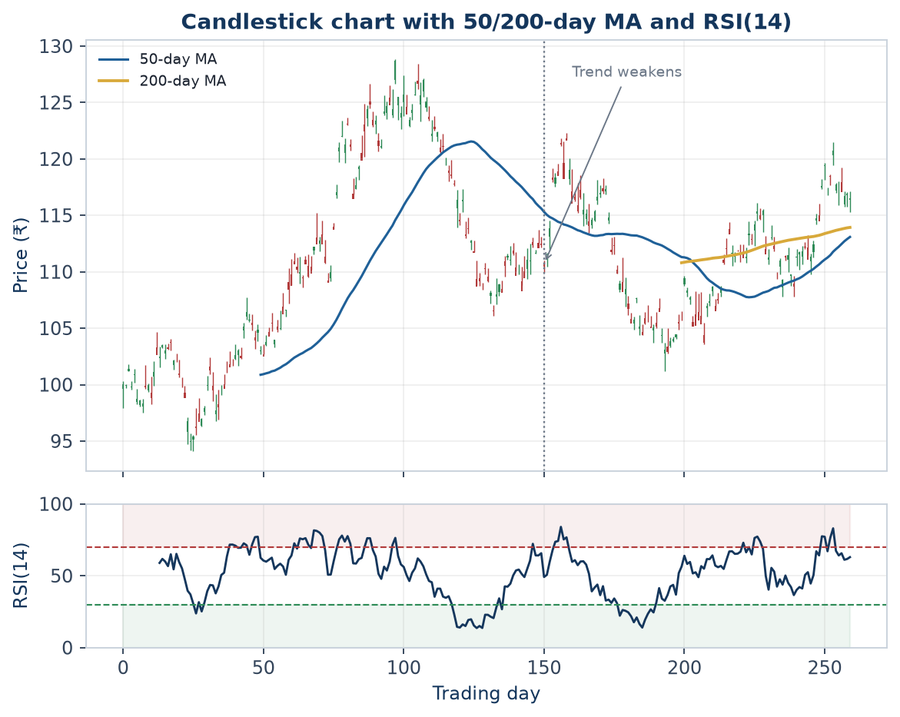
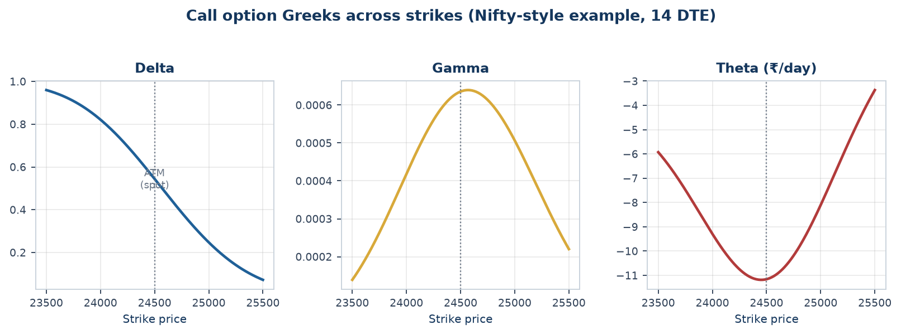
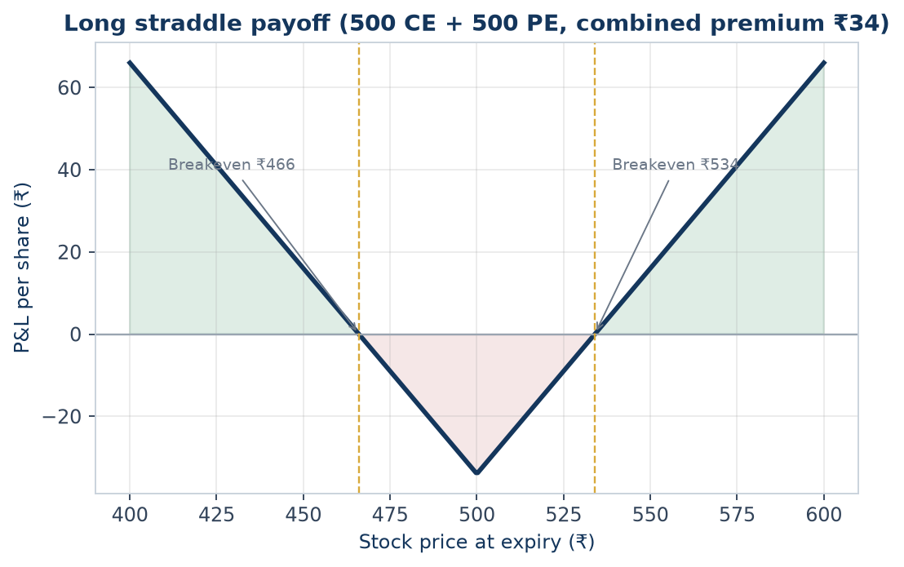
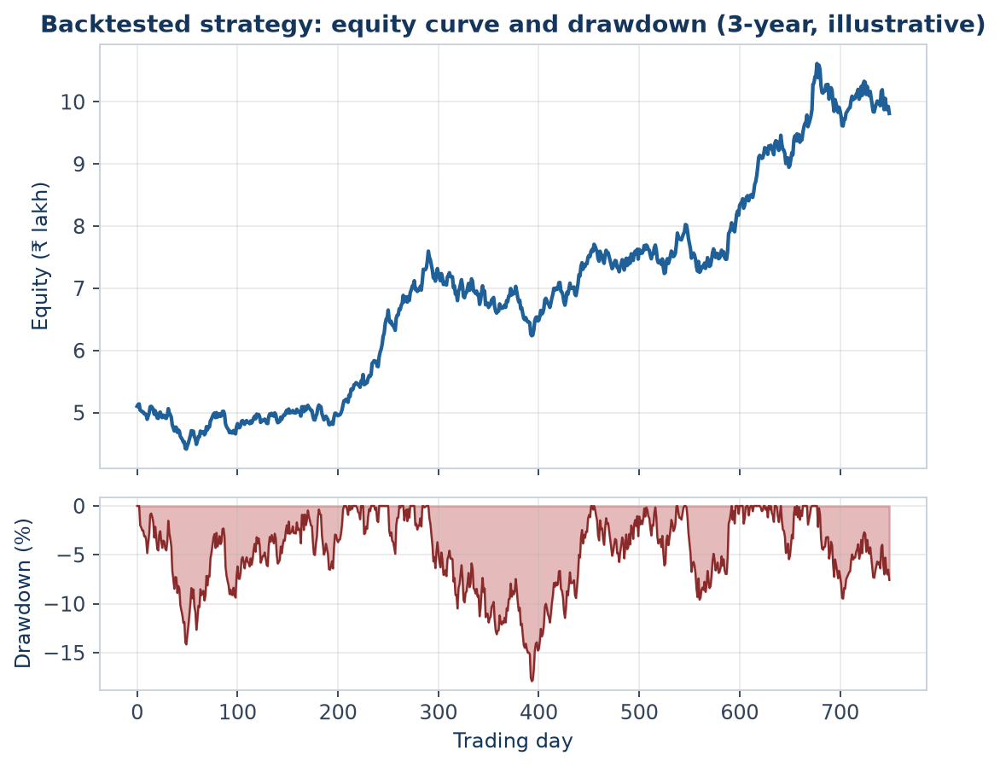
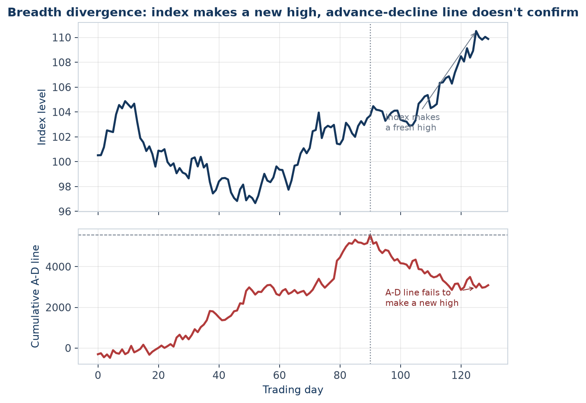
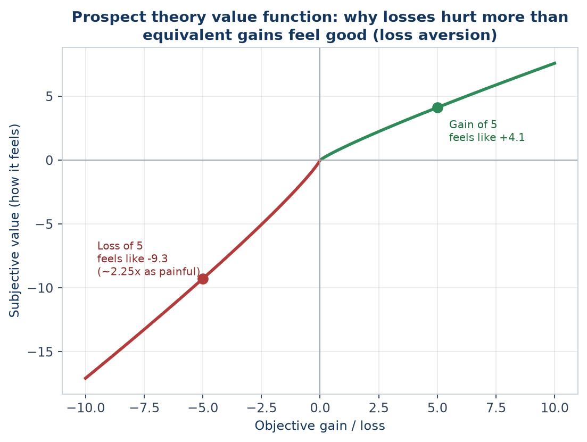

# The Technical Research Analyst Handbook
### A complete, in-depth reference — every topic, explained from the ground up
*Prepared for Saikumar Kaleru. Read top to bottom; each part builds on the last. Bold terms are the vocabulary interviewers listen for.*

---

# PART 1 — FOUNDATIONS OF TECHNICAL ANALYSIS

## 1.1 What technical analysis really is
**Technical analysis (TA)** is the study of **price and volume data** — usually on charts — to forecast the *future direction* of a market. It does not care *what* a company does or *whether* it is "cheap." It only studies **how the price has behaved** and what that implies next.

A technical analyst believes the chart already contains the collective decisions of every buyer and seller — institutions, retail, algos — and that those decisions leave **repeatable footprints** because human emotion (fear and greed) repeats.

## 1.2 The three core assumptions (the philosophy)
1. **The market discounts everything.** Every known fact — earnings, news, interest rates, sentiment — is already reflected in the price. So studying price *is* studying all of it at once.
2. **Prices move in trends.** Once a direction is established, it is more likely to continue than reverse. This is *the* reason TA works — it lets you ride trends.
3. **History repeats itself.** Chart patterns and reactions recur because mass psychology is constant across decades.

## 1.3 Technical vs Fundamental vs Quantitative
- **Fundamental analysis** answers **WHAT to buy** — it values a business (earnings, growth, debt, management, macro). Time horizon: months to years.
- **Technical analysis** answers **WHEN to buy or sell** — timing entries and exits from price behaviour. Time horizon: minutes to months.
- **Quantitative analysis** uses **statistics and code** to find and test edges systematically (your backtester sits here).
- A strong analyst blends them: *fundamentals pick the stock, technicals time the trade, quant validates the rule.*

## 1.4 Dow Theory — the foundation everything is built on
Charles Dow's six tenets are the bedrock of TA:
1. **The averages discount everything** (same as assumption 1).
2. **The market has three trends:** *Primary* (months–years, the tide), *Secondary* (weeks–months, corrective waves), *Minor* (days, ripples).
3. **Primary trends have three phases:** **Accumulation** (smart money quietly buys), **Public Participation** (trend-followers pile in, biggest move), **Distribution** (smart money sells to the late crowd).
4. **The averages must confirm each other** — e.g., an index and a related index should move together to confirm a trend.
5. **Volume must confirm the trend** — volume should expand in the direction of the primary trend.
6. **A trend stays in force until a clear reversal** — don't call a top/bottom prematurely.

## 1.5 Types of charts
- **Line chart** — connects closing prices. Clean, good for seeing the big trend.
- **Bar chart (OHLC)** — each bar shows Open, High, Low, Close.
- **Candlestick chart** — same OHLC data but visual and colour-coded; the global standard (covered in depth in Part 2).
- **Heikin-Ashi** — averaged candles that smooth noise and make trends visually obvious.
- **Renko / Point & Figure** — plot price *movement* (not time); filter out noise to highlight S/R and trends.

## 1.6 Timeframes and "multiple timeframe analysis"
The same chart looks different on different timeframes. A pro **always checks more than one**:
- **Higher timeframe (e.g., weekly/daily)** = the *context / dominant trend*.
- **Lower timeframe (e.g., hourly/15-min)** = the *entry timing*.
- **Rule:** trade in the direction of the higher timeframe trend, time the entry on the lower one. Conflicting timeframes = lower-conviction trade.

---

# PART 2 — PRICE ACTION & CHART READING

## 2.1 Candlesticks — full anatomy
Each candle covers one period and shows four prices:
- **Open** and **Close** form the **real body**.
- The thin lines above/below are **wicks / shadows**, marking the **High** and **Low**.
- **Bullish candle** (green/white): close > open. **Bearish candle** (red/black): close < open.
- **A long body** = strong conviction; **a small body** = indecision; **long wicks** = rejection of a price level.

### Single-candle patterns
- **Doji** — open ≈ close (tiny body). Indecision; potential reversal, especially after a long trend.
- **Hammer** — small body at the top, long lower wick (≥2× body). After a downtrend = **bullish reversal** (buyers rejected lower prices).
- **Hanging Man** — same shape as hammer but after an *uptrend* = bearish warning.
- **Shooting Star** — small body at bottom, long upper wick, after an uptrend = **bearish reversal**.
- **Marubozu** — full body, no wicks = extreme conviction in that direction.

### Two/three-candle patterns
- **Bullish Engulfing** — a big green candle completely engulfs the prior red body = strong bullish reversal.
- **Bearish Engulfing** — mirror image = bearish reversal.
- **Piercing Line / Dark Cloud Cover** — partial engulfing reversals.
- **Morning Star** (bullish) / **Evening Star** (bearish) — three-candle reversals: big trend candle, small indecision candle, big opposite candle.
- **Three White Soldiers / Three Black Crows** — three strong candles in a row confirming a reversal.

**Interpretation rule:** candlestick signals matter most **at a level** (support/resistance) and **with volume** — a hammer at support on high volume is far stronger than one in mid-air.

## 2.2 Support and Resistance — the most important concept in TA
- **Support** = a price zone where **demand** repeatedly overwhelms supply and stops a fall. A "floor."
- **Resistance** = a price zone where **supply** overwhelms demand and stops a rise. A "ceiling."
- **Why they exist:** memory. Traders remember prices where they bought/sold and act again there.
- **Role reversal (polarity):** once **broken**, old resistance becomes new support, and old support becomes new resistance. This is one of the most reliable behaviours in markets.
- **Types of S/R:** horizontal levels (swing highs/lows), trendlines, moving averages, Fibonacci levels, round numbers (e.g., Nifty 24,000), and pivot points.
- **Strength factors:** the more times a level is tested, the more significant it is — *but* every test drains it, and eventually it breaks.

## 2.3 Trendlines and channels
- **Uptrend line** — drawn under **higher lows**; acts as support.
- **Downtrend line** — drawn over **lower highs**; acts as resistance.
- **Channel** — two parallel trendlines containing price; buy near the lower rail, sell near the upper rail in a sideways/rising channel.
- A trendline needs **at least two touches** to draw and a **third** to confirm. A decisive break warns of a trend change.

## 2.4 Chart patterns
Chart patterns are recognisable shapes that tend to resolve in a predictable direction. They fall into **reversal** and **continuation** groups.

### Reversal patterns (trend likely to flip)
- **Head & Shoulders** — three peaks, the middle (head) highest, with a "neckline." Break below the neckline = bearish target ≈ head-to-neckline distance projected down. **Inverse H&S** = bullish bottom.
- **Double Top (M) / Double Bottom (W)** — two failed attempts at a level = reversal.
- **Triple Top / Bottom** — stronger version.
- **Rounding Top / Bottom (saucer)** — slow, gradual reversal.

### Continuation patterns (trend likely to resume)
- **Triangles:** *Ascending* (flat top, rising lows — bullish bias), *Descending* (flat bottom, falling highs — bearish bias), *Symmetrical* (converging — breakout in trend direction).
- **Flags & Pennants** — short pause after a sharp move ("flagpole"), then continuation. Target ≈ flagpole height.
- **Wedges** — rising wedge = bearish, falling wedge = bullish (counter-intuitive — learn this).
- **Rectangles** — sideways consolidation between S/R, then breakout.
- **Cup & Handle** — a rounded base then a small pullback (handle), then breakout = bullish.

### Gaps
- A **gap** is empty space where price jumps between sessions. Types: **breakaway** (starts a move), **runaway/continuation** (mid-trend), **exhaustion** (end of move), **common** (noise). Gaps often "fill" later.

---

# PART 3 — TECHNICAL INDICATORS (IN DEPTH)
Indicators are math applied to price/volume to make a signal clearer. They fall into four families: **trend, momentum, volatility, volume.** *Use them to confirm price action, never blindly.*

## 3.1 Trend indicators
- **Moving Average (MA):** average of the last N closes; smooths noise.
  - **SMA** weights all days equally; **EMA** weights recent days more (faster, less lag).
  - Use: price above MA = uptrend; MA slope = trend direction; MAs act as dynamic S/R.
  - **Crossovers:** short MA crossing above long MA = bullish. **Golden Cross** = 50-DMA above 200-DMA (major bullish). **Death Cross** = opposite.
- **MACD (Moving Average Convergence Divergence):** (12-EMA − 26-EMA) = MACD line; its 9-EMA = signal line; the gap = histogram.
  - Bullish when MACD crosses above signal; histogram shows momentum strength; **MACD divergence** warns of reversals.
- **ADX / DMI (Average Directional Index):** measures **trend strength** (0–100), not direction. **ADX > 25 = strong trend; < 20 = weak/range.** +DI and −DI lines show direction. *Crucial because indicators like RSI work differently in trends vs ranges.*
- **Parabolic SAR:** dots that flip above/below price; trailing-stop and trend-direction tool.
- **Supertrend:** ATR-based trend line, very popular in Indian markets for intraday F&O.



Reading this chart top to bottom: the 50-day MA (blue) tracks the shorter-term trend and reacts faster to price than the flatter 200-day MA (gold) once it appears after enough history accumulates — a golden/death cross is exactly the 50-day line crossing the 200-day line. Around the marked point the uptrend loses momentum: price stops making clean higher highs, the 50-day MA flattens and rolls over. The RSI panel below shows the same story from a momentum angle — RSI oscillates into the overbought zone (>70, red shading) during the strongest leg of the uptrend and into oversold (<30, green shading) during the subsequent pullback, exactly the confluence (trend + moving average + momentum) Part 3.7's "golden rule of indicators" asks for.
- **Ichimoku Cloud:** an all-in-one system (trend, S/R, momentum) using a "cloud" (Kumo); price above the cloud = bullish.

## 3.2 Momentum indicators (oscillators)
Oscillators move within a range and flag **overbought/oversold** and **divergence**. Best in **sideways** markets.
- **RSI (Relative Strength Index):** 0–100 (default 14). >70 overbought, <30 oversold. In strong uptrends RSI can *stay* overbought — don't short blindly. **Divergence** (price up, RSI down) is its most powerful signal. The 50 line = trend bias.
- **Stochastic Oscillator:** compares close to the high-low range (%K and %D lines), 0–100, >80/<20 zones. Good for ranges and divergence.
- **CCI (Commodity Channel Index):** measures deviation from average price; ±100 thresholds.
- **Williams %R:** like stochastic, inverted scale (0 to −100).
- **ROC / Momentum:** raw rate of price change.
- **MFI (Money Flow Index):** "volume-weighted RSI" — momentum that includes volume.

## 3.3 Volatility indicators
- **Bollinger Bands:** 20-SMA ± 2 standard deviations. Bands **widen** in volatility, **narrow** ("squeeze") before big moves. Price riding the upper band = strength; tags of the lower band in a range = bounce candidates. **Bollinger squeeze** is a classic breakout setup.
- **ATR (Average True Range):** the average daily range (true range accounts for gaps). Pure **volatility gauge** — does not give direction. Used to **size stop-losses** (e.g., 1.5–2× ATR) and position sizing so each trade risks a similar amount.
- **Keltner Channels:** like Bollinger but ATR-based; squeeze strategies combine both.
- **Donchian Channels:** highest high / lowest low over N periods — the basis of classic breakout systems.

## 3.4 Volume indicators
*Volume is the fuel; price is the car.* Moves on rising volume are trustworthy.
- **OBV (On-Balance Volume):** cumulative volume (added on up days, subtracted on down days); confirms trends and shows accumulation/distribution via divergence.
- **VWAP (Volume-Weighted Average Price):** the average price weighted by volume during the day — institutions benchmark fills against it; a key **intraday** S/R level.
- **Volume Profile:** shows volume **by price level** (not time), revealing high-volume nodes (strong S/R) and the **Point of Control (POC)**.
- **A/D Line (Accumulation/Distribution)** and **Chaikin Money Flow (CMF):** measure buying vs selling pressure.

## 3.5 Fibonacci tools
Based on the ratios 0.236, 0.382, 0.5, 0.618 (golden ratio), 0.786.
- **Fibonacci Retracement:** after a move, pullbacks often reverse at these % levels. **38.2%–61.8%** is the key zone; 61.8% is the most watched.
- **Fibonacci Extension:** projects targets beyond the prior move (1.272, 1.618) — used to set profit targets.
- **Confluence:** Fib levels lining up with S/R or a moving average = high-probability zone.

## 3.6 Pivot points
Calculated from the prior day's High, Low, Close: a central **Pivot (P)** plus support (S1, S2, S3) and resistance (R1, R2, R3) levels. Hugely popular **intraday** for indices and F&O; price above P = bullish bias for the day.

## 3.7 The golden rule of indicators
**Indicators lag — price leads.** Use 2–3 *non-redundant* indicators (e.g., one trend + one momentum + volume), look for **confluence**, and let **price action at key levels** make the final call. Stacking five momentum indicators that all say the same thing is false confidence.

---

# PART 4 — MARKET THEORIES & FRAMEWORKS

## 4.1 Divergence (master this)
**Divergence** = price and an oscillator (RSI/MACD) disagree.
- **Regular bearish divergence:** price makes a **higher high**, indicator makes a **lower high** → uptrend weakening, possible top.
- **Regular bullish divergence:** price makes a **lower low**, indicator makes a **higher low** → downtrend weakening, possible bottom.
- **Hidden divergence:** signals trend *continuation* (e.g., price higher low, indicator lower low in an uptrend = trend resumes).

## 4.2 Elliott Wave Theory
Markets move in repetitive **wave cycles** driven by crowd psychology:
- A trend unfolds in **5 waves** (1-2-3-4-5, "impulse") followed by a **3-wave correction** (A-B-C).
- Waves are **fractal** (the same pattern appears on every timeframe).
- Powerful but subjective; used to anticipate where a move is in its life-cycle.

## 4.3 The Wyckoff Method
Explains how "smart money" operates through cycles: **Accumulation → Markup → Distribution → Markdown.** Teaches you to read **accumulation/distribution ranges**, springs (false breakdowns), and the relationship between price and volume to follow institutional footprints.

## 4.4 Market cycles & sector rotation
- Markets cycle with the economy: early-cycle, mid, late, recession. Different **sectors** lead at each stage (e.g., financials early, energy/materials late, defensives in downturns).
- **Relative strength analysis** (comparing a stock/sector to the index) tells you what's leading — analysts rotate coverage toward leaders.

## 4.5 Sentiment & breadth
- **India VIX** — the "fear gauge"; high VIX = fear/volatility, often near bottoms.
- **Put-Call Ratio (PCR)** — options sentiment (covered in Part 5).
- **Market breadth** — **Advance/Decline line**, % of stocks above their 200-DMA, new highs vs new lows. Breadth confirms or warns against an index move (a rally on narrow breadth is fragile).

---

# PART 5 — DERIVATIVES: FUTURES & OPTIONS (F&O)
*Your D.E. Shaw desk was F&O — expect deep questions here.*

## 5.1 What derivatives are
A **derivative** derives its value from an **underlying** (stock, index, commodity). Used for **hedging, speculation, and leverage**. Traded in **lots** (fixed quantity), with monthly/weekly **expiries**.

## 5.2 Futures
- A **futures contract** is a binding agreement to buy/sell the underlying at a set price on a future date.
- **Long futures** = bullish; **short futures** = bearish. Leverage via **margin** (you post a fraction of contract value).
- **Basis** = futures price − spot price. **Contango** = futures > spot (normal); **Backwardation** = futures < spot (often tight supply, common in commodities).
- **Cost of carry** = interest + storage − dividends; explains the futures-spot gap.
- **Rollover** — moving a position to the next expiry; high rollover % signals trend conviction.

## 5.3 Options — the core
An **option** is the **right, not the obligation**, to buy/sell the underlying at a **strike price** before/at **expiry**, for a **premium**.
- **Call option** = right to **buy** → bought when **bullish**.
- **Put option** = right to **sell** → bought when **bearish**.
- **Buyer** pays premium, has limited risk (premium) and unlimited upside. **Seller (writer)** receives premium, has limited profit but large risk.

### Moneyness
- **ITM (In-the-Money):** has intrinsic value (call strike < spot; put strike > spot).
- **ATM (At-the-Money):** strike ≈ spot.
- **OTM (Out-of-the-Money):** no intrinsic value, only time value.
- **Premium = Intrinsic value + Time value.** Time value decays to zero by expiry.

## 5.4 The Option Greeks (know all five)
- **Delta** — change in option price per ₹1 move in the underlying (also ≈ probability of expiring ITM). Calls 0→1, puts 0→−1.
- **Gamma** — the rate of change of delta; highest for ATM options near expiry (the "acceleration").
- **Theta** — **time decay**: how much value the option loses each day. Negative for buyers, positive for sellers.
- **Vega** — sensitivity to a 1% change in **implied volatility**. Long options are long vega.
- **Rho** — sensitivity to interest rates (least important intraday).



Read left to right: **Delta** falls smoothly from near 1 (deep ITM, behaves like the underlying) to near 0 (deep OTM, unlikely to ever pay off) as strike rises past spot. **Gamma** peaks exactly at-the-money — the point where a small underlying move can flip the option between likely-worthless and likely-valuable, so Delta itself is most sensitive there. **Theta** is most negative at-the-money too — the option with the most uncertainty (closest to a coin-flip outcome) has the most time value to lose each day, which is exactly why ATM options decay fastest as expiry approaches.

## 5.5 Implied Volatility (IV) — you worked on IV surfaces
- **IV** is the market's **expectation of future volatility**, backed out of option prices (via Black-Scholes). High IV → expensive options.
- **IV vs HV:** implied (forward-looking) vs historical/realised (backward-looking).
- **IV Rank / IV Percentile** — where current IV sits versus its own past range; tells you if options are "cheap" or "expensive."
- **Volatility Skew / Smile** — IV differs across strikes; equity index puts usually have higher IV (crash protection demand). Plotting IV across strikes **and** expiries gives the **volatility surface** (your project).
- **Trading logic:** buy options when IV is low, sell premium when IV is high.

## 5.6 Open Interest (OI) & option-chain analysis
- **Open Interest** = total outstanding contracts. **Rising OI + rising price** = fresh longs (strong); **rising OI + falling price** = fresh shorts; **falling OI** = unwinding.
- **Option chain** = the full grid of calls/puts by strike with price, OI, IV, volume.
- **Put-Call Ratio (PCR)** = put OI ÷ call OI. **PCR > 1** = bearish positioning (often contrarian bullish); **< 0.7** = bullish/greedy.
- **Support/Resistance from OI:** the strike with the **highest call OI** acts as resistance; **highest put OI** acts as support.
- **Max Pain** = the strike where option buyers lose the most / writers gain the most; price often gravitates there near expiry.

## 5.7 Core option strategies
- **Covered Call** — hold stock + sell a call: income, caps upside.
- **Protective Put** — hold stock + buy a put: insurance.
- **Long Straddle** — buy call + put at the **same strike**: profit from a **big move either way** (event/earnings plays); needs a move bigger than the combined premium.
- **Long Strangle** — same idea with **different OTM strikes**: cheaper, needs a bigger move.
- **Bull Call Spread / Bear Put Spread** — buy one option, sell another to **reduce cost** and cap risk/reward.
- **Iron Condor** — sell an OTM call spread + put spread: profit when price stays **range-bound** (income in low volatility).
- **Butterfly** — bet on price pinning a specific strike.

## 5.8 Worked example — reading the Greeks on a real position
*Nifty spot at 24,500. You buy 1 lot (75 units) of a 24,600 Call, premium ₹180, with Delta 0.42, Gamma 0.003, Theta −8.5, Vega 12.**

**Interpreting each Greek on this position:**
- **Delta 0.42** — if Nifty rises 100 points, this option gains ≈ 0.42 × 100 = ₹42 per unit, or ₹42 × 75 = **₹3,150** on the lot (before Gamma's second-order effect). Delta also approximates a 42% probability of expiring ITM.
- **Gamma 0.003** — as Nifty moves, Delta itself changes by ≈0.003 per point. After a 100-point rise, new Delta ≈ 0.42 + (0.003 × 100) = 0.72 — the position gains sensitivity *faster* as it moves further ITM, which is why Gamma is called the "acceleration" of the option's price move.
- **Theta −8.5** — this position loses ≈₹8.5 per unit *per day* purely from time decay if nothing else changes, i.e. ₹8.5 × 75 = **₹637.50/day** — a buyer is fighting this decay every single day the trade is held, which is why option buying requires the underlying to move meaningfully and soon, not just eventually.
- **Vega 12** — a 1-percentage-point rise in implied volatility adds ≈₹12 per unit (₹900 on the lot); a fall in IV costs the position the same amount even if the underlying doesn't move at all — this is why buying options right before a scheduled event (results, a central-bank decision) is risky even if the *direction* call is correct: IV often collapses ("IV crush") right after the event, working against a long-option holder even on a correct directional move.

**The synthesis a TRA must be able to state out loud:** "This is a long-delta, long-gamma, negative-theta, positive-vega position — it wants the underlying to move up, fast, with rising or at least stable implied volatility; every day that passes without a move, and any drop in IV, works against it."

## 5.9 Worked example — a long straddle P&L around an earnings event
*Stock at ₹500 ahead of results. Buy the 500 Call for ₹18 and the 500 Put for ₹16 — total premium paid ₹34. Breakevens: 500 + 34 = ₹534 (upside) and 500 − 34 = ₹466 (downside).*

**Model answer.** The position profits if the stock moves *outside* the ₹466-₹534 range by expiry (or sooner, from an IV spike), regardless of direction — this is the textbook "big move either way" trade for a binary event like earnings. If the stock closes at ₹560 post-results: the call is worth 560 − 500 = ₹60, the put expires worthless, net P&L = 60 − 34 = **+₹26 per share**. If the stock closes at ₹495 (a modest, unremarkable move): the call expires worthless, the put is worth 500 − 495 = ₹5, net P&L = 5 − 34 = **−₹29 per share** — a straddle loses money on a move that's "real" in direction but not big enough to clear the combined premium cost, which is precisely why sizing the expected move (often estimated from the option chain's implied volatility itself) against the premium paid is the core skill in event-driven options trading, not just having a directional view.



---

# PART 6 — COMMODITIES
*The JD's first line is "Analyze Commodity, Futures & Options."*

## 6.1 The Indian commodity market
- Traded mainly on the **MCX (Multi Commodity Exchange)**; agri commodities on **NCDEX**.
- Categories: **Bullion** (gold, silver), **Energy** (crude oil, natural gas), **Base metals** (copper, zinc, aluminium, lead), **Agri** (cotton, soybean, etc.).
- Indian prices **track global benchmarks** and adjust for the **USD/INR** rate.

## 6.2 Gold
- **Drivers:** the **US dollar** (inverse — strong USD weakens gold), **real interest rates** (rising real yields hurt gold, which pays no income), **inflation** (hedge), **safe-haven demand** in crises, and central-bank buying.
- Benchmark: **COMEX** (USD/oz); Indian MCX gold also moves with **USD/INR** and import duty.

## 6.3 Silver
- Part precious metal, part **industrial** (solar, electronics) → more volatile than gold. The **gold-silver ratio** is watched for relative value.

## 6.4 Crude Oil
- Benchmarks: **WTI** (US) and **Brent** (global). **Drivers:** **OPEC+** supply decisions, geopolitics (Middle East), global demand/growth, US inventory data (EIA), and the USD.
- **Contango/backwardation** in the futures curve signals supply tightness.

## 6.5 Natural gas & base metals
- **Natural gas** — extremely volatile, weather-driven (heating/cooling demand).
- **Copper ("Dr. Copper")** — a barometer of global economic health due to its industrial use.

## 6.6 Cross-asset & seasonality
- Commodities have **seasonal** tendencies (e.g., gold demand around Indian festivals/weddings; gas in winter).
- Same TA toolkit (trend, S/R, RSI, MACD, MAs, Fibonacci) applies directly to commodity charts.

---

# PART 7 — INDICES & THE BROADER MARKET

## 7.1 Indian indices
- **Nifty 50** — 50 largest, most liquid NSE stocks; the national benchmark.
- **Sensex** — BSE's 30-stock benchmark.
- **Bank Nifty** — 12 major banks; **more volatile**, the most traded F&O index in India.
- **Fin Nifty, Nifty Midcap, Nifty Next 50,** and **sectoral indices** (IT, Pharma, Auto, FMCG, Metal) — used for sector rotation and relative strength.

## 7.2 Global cues
- **GIFT Nifty (formerly SGX Nifty)** — signals the likely opening of Nifty based on overnight global moves.
- **US indices** — **Dow, S&P 500, Nasdaq**; **Asian** (Nikkei, Hang Seng) and **European** opens set the tone.
- **Dollar Index (DXY), US 10-year yield, crude, and FII/DII flows** all drive Indian markets.

## 7.3 Volatility & breadth
- **India VIX** — expected 30-day volatility; spikes in fear.
- **Advance/Decline, % above 200-DMA, new highs/lows** — breadth gauges that confirm index health.

---

# PART 8 — RISK & TRADE MANAGEMENT
*This is what separates a professional from a gambler. Interviewers test it hard.*

## 8.1 The stop-loss
A **stop-loss** is a pre-decided exit price that caps your loss if you're wrong. **Non-negotiable.** Types:
- **Fixed % stop**, **level-based stop** (below support), **ATR/volatility stop**, **moving-average stop**, **time stop**.
- **Trailing stop** — moves with price to lock in profit while letting winners run.

## 8.2 Risk:Reward and R-multiples
- **Risk:Reward (R:R)** = potential reward ÷ potential risk. Demand **≥ 1:2** so you can be right less than half the time and still profit.
- **R-multiple** — express every result in units of initial risk (R). A trade that makes 3× your risk = +3R. Thinking in R keeps you objective.

## 8.3 Position sizing
- **Risk a fixed small % of capital per trade** (commonly 1–2%). Position size = (capital × risk%) ÷ (entry − stop). This ensures no single trade can hurt you and that volatile instruments get smaller size (via wider stops).

## 8.4 Portfolio-level risk
- **Diversification & correlation** — don't hold five positions that are really the same bet (e.g., all bank stocks + Bank Nifty).
- **Max drawdown discipline, exposure limits, and avoiding over-leverage** in F&O (leverage cuts both ways).

## 8.5 The money-management rules pros live by
Cut losses quickly, let winners run, never add to a loser hoping it recovers, size to volatility, and **survive first — returns come second.**

## 8.6 Worked example — position sizing and a full R-multiple trade
*Capital: ₹10,00,000. Risk per trade rule: 1.5% of capital. Stock trades at ₹842; support/stop level at ₹810; target at ₹930.*

**Position sizing:**
```
Risk amount = 10,00,000 × 1.5% = ₹15,000
Risk per share = Entry − Stop = 842 − 810 = ₹32
Position size = Risk amount / Risk per share = 15,000 / 32 ≈ 468 shares
```
Round to 468 shares (or down to 460 for a round lot, whichever the broker/market convention requires) — this is the *maximum* size that keeps the pre-defined loss at exactly ₹15,000 (1.5% of capital) if the stop is hit, regardless of how "confident" the analyst feels about the trade; conviction should show up in written rationale, never in oversizing beyond the risk rule.

**Risk:Reward and R-multiple:**
```
Reward per share = Target − Entry = 930 − 842 = ₹88
R:R = Reward / Risk = 88 / 32 = 2.75  (i.e. "1:2.75")
```
This clears the ≥1:2 minimum bar comfortably — meaning the trade can be *wrong* more than a third of the time (specifically, a bit above a 26.7% win rate, from the breakeven formula in 10.4's expectancy calculation) and still be profitable over a large enough sample, which is the entire point of thinking in R-multiples rather than any single trade's outcome.

**If the trade hits target:** P&L = 468 × 88 = ₹41,184, or **+2.75R** relative to the ₹15,000 initial risk.
**If the trade hits the stop instead:** P&L = −468 × 32 = −₹14,976 ≈ **−1R**, exactly as sized — the loss was known and bounded *before* the trade was placed, which is the entire discipline this section is testing.

---

# PART 9 — RESEARCH REPORT WRITING & RECOMMENDATIONS
*Your actual daily output as a TRA.*

## 9.1 Report cadence
- **Daily** — pre-market note: overnight global cues, key levels for Nifty/Bank Nifty/commodities, top trade ideas.
- **Weekly** — trend review, sector view, positional calls.
- **Monthly** — bigger-picture market outlook and themes.

## 9.2 Anatomy of a good call
Every recommendation must state: **Instrument · View (Buy/Sell/Hold) · Entry · Target(s) · Stop-loss · Time horizon · Rationale.**
- The **rationale** ties together trend, levels, indicators, and (for F&O) OI/IV.
- Always give a **stop** and an honest **risk:reward** — a call without a stop is unprofessional.

## 9.3 Communicating to clients & RMs
- Be **clear and concise** — RMs relay to clients who aren't technical. Lead with the call, then the reason.
- Talk in **probabilities, not certainties** ("favourable risk-reward to go long above X," not "this will go up").
- **Track and own your calls** — record hit/miss; credibility is built on a transparent track record.

---

# PART 10 — BACKTESTING & QUANTITATIVE BASICS
*Your differentiator — but you must understand it, not just run it.*

## 10.1 What backtesting is
Applying a **rules-based strategy to historical data** to estimate how it would have performed — to validate an edge **before** risking capital.

## 10.2 Methodology & pitfalls
- **No look-ahead bias** — only use data available at decision time (act on *yesterday's* signal).
- **Survivorship bias** — include delisted names, or results are too rosy.
- **Overfitting (curve-fitting)** — tuning a strategy so perfectly to the past that it fails live. Guard with **out-of-sample testing** and **walk-forward analysis**.
- **Costs** — include brokerage, slippage, and taxes, or live results disappoint.

## 10.3 Performance metrics (define each)
- **CAGR** — smoothed annual growth rate.
- **Sharpe ratio** — excess return ÷ total volatility; risk-adjusted return. >1 good, >2 excellent.
- **Sortino ratio** — like Sharpe but only penalises **downside** volatility (fairer).
- **Maximum Drawdown** — worst peak-to-trough loss; measures pain/risk of ruin.
- **Win rate** — % of profitable trades (high win rate ≠ profitable if losses are huge).
- **Profit factor** — gross profit ÷ gross loss; >1 = profitable.
- **Exposure** — % of time invested.
- **Calmar ratio** — CAGR ÷ max drawdown.

## 10.4 Statistics you should know
- **Mean, median, standard deviation** (volatility = std of returns), **normal distribution & fat tails** (markets have more extreme moves than "normal" predicts), **correlation** (−1 to +1), **mean reversion vs momentum**, and **probability/expectancy** = (win% × avg win) − (loss% × avg loss).

## 10.5 Worked example — evaluating a backtested strategy's full metric set
*A backtested strategy over 3 years: 240 trades, 96 winners (avg win ₹4,200), 144 losers (avg loss ₹1,800). Starting capital ₹5,00,000, ending capital ₹8,90,000. Worst peak-to-trough equity decline during the period: ₹1,10,000 from a peak of ₹7,20,000. Strategy's daily returns have a standard deviation implying an annualised volatility of 18%; risk-free rate assumed 6%.*



**Win rate and expectancy:**
```
Win rate = 96/240 = 40%
Expectancy = (0.40 × 4,200) − (0.60 × 1,800) = 1,680 − 1,080 = +₹600/trade (positive → profitable edge)
```
Note the strategy is profitable *despite* a 40% win rate — well below 50% — because winners are more than double the average loser in size, directly illustrating why win rate alone is a misleading metric without pairing it with average win/loss size (10.3's explicit warning).

**Profit factor:**
```
Gross profit = 96 × 4,200 = ₹4,03,200
Gross loss = 144 × 1,800 = ₹2,59,200
Profit factor = 4,03,200 / 2,59,200 ≈ 1.56  (>1 = profitable; a common quality bar is >1.5)
```

**CAGR:**
```
Total return = 8,90,000/5,00,000 = 1.78x over 3 years
CAGR = 1.78^(1/3) − 1 ≈ 21.1%
```

**Maximum drawdown:**
```
Max DD = 1,10,000 / 7,20,000 ≈ 15.3%
```
A ~21% CAGR against a ~15% max drawdown is a reasonable, though not exceptional, risk-adjusted profile — the next step is checking the **Calmar ratio** (CAGR ÷ Max DD = 21.1/15.3 ≈ 1.38) to see how the return compares directly to the worst pain endured, which is often more intuitive to a risk-averse allocator than the Sharpe ratio alone.

**Sharpe ratio** (using the 21.1% CAGR as the return proxy and 18% annualised volatility):
```
Sharpe ≈ (21.1% − 6%) / 18% ≈ 0.84
```
Below the ">1 good, >2 excellent" bar from 10.3 — a red flag that, despite a healthy-looking CAGR, this strategy's return isn't especially well-compensated for the volatility it experiences along the way, and an interviewer would expect the candidate to flag this tension (good CAGR, mediocre Sharpe) explicitly rather than only citing the flattering CAGR number.

---

# PART 11 — REGULATION, COMPLIANCE & ETHICS

## 11.1 NISM Series-XV: Research Analyst
The **SEBI-mandated certification** required to legally publish research/recommendations in India. It covers TA, fundamentals, valuation, and — importantly — **regulations and ethics**.

## 11.2 SEBI (Research Analysts) Regulations — key duties
- **Disclosure of conflicts** — reveal any holding or interest in a recommended security.
- **No front-running** — never trade ahead of your own published research.
- **Separation** of research from trading/dealing and investment-banking functions.
- **Rational basis & records** — recommendations must be justified and documented; maintain research records.
- **Fair dealing** — no misleading claims, no guaranteed returns, suitability in mind.

## 11.3 Why it matters in interviews
Showing you understand **disclosures, conflict management, and that research must be compliant** signals maturity beyond just chart-reading.

---

# PART 12 — BEHAVIOURAL FINANCE & MARKET PSYCHOLOGY
Markets are driven by **fear and greed**; TA is, at heart, the study of crowd psychology.
- **The emotional cycle:** optimism → euphoria (tops) → anxiety → panic/capitulation (bottoms) → hope → optimism.
- **Common biases to know:** **herd mentality**, **FOMO**, **loss aversion** (holding losers, cutting winners early), **confirmation bias** (seeing only what supports your view), **anchoring**, **recency bias**, and **overconfidence**.
- **The professional edge** is *discipline* — a written plan, predefined stops, and the emotional control to follow them when the crowd panics.

---

# PART 13 — TOOLS OF THE TRADE
- **Charting:** **TradingView** (industry standard), broker terminals, MetaTrader, and pro terminals like **Bloomberg / Refinitiv (Reuters)**.
- **Data & screening:** NSE/MCX option chains, **Chartink / screeners**, Excel for tracking and models.
- **Coding (your edge):** **Python** (pandas, yfinance, matplotlib) for backtesting, screening, and automating reports — exactly what your projects demonstrate.
- **Knowing the workflow:** pre-market prep → global cues + levels → intraday monitoring → end-of-day report → calls tracking.

---

# PART 14 — COMMON TRADING SETUPS (putting it together)
- **Trend-following / pullback:** in an uptrend, buy a dip to a moving average or support with the trend.
- **Breakout:** enter when price clears a key level/range on rising volume; stop just inside the range.
- **Reversal:** trade a confirmed reversal pattern + divergence at a major level (higher risk).
- **Mean-reversion:** in a range, fade extremes (buy oversold support, sell overbought resistance).
- **Momentum:** buy strength/relative-strength leaders; ride until momentum fades.
- **Event/volatility (F&O):** straddles/strangles around results or events when a big move is expected.
- **Every setup needs:** a trigger, an entry, a **stop**, a target, and a reason. No exceptions.

---

# QUICK REVISION — THE ANALYST'S MENTAL CHECKLIST
1. What's the **trend** on the higher timeframe?
2. Where are the key **support/resistance** levels?
3. What do **price action / candles** say at those levels?
4. Do **indicators** (one trend + one momentum + volume) confirm? Any **divergence**?
5. For F&O: what do **OI, PCR and IV** say?
6. Define the trade: **entry, target, stop, risk:reward, horizon.**
7. **Size** the position to risk a small fixed % .
8. Write the call **clearly with a rationale** — and **track** it.

---

# PART 15 — INTERMARKET ANALYSIS

## 15.1 What intermarket analysis is and why a TRA needs it
**Intermarket analysis** studies the relationships *between* asset classes (equities, bonds, commodities, currencies) rather than analysing any single market in isolation — the premise being that these markets are economically linked, and a move in one often leads or confirms a move in another. A technical research analyst who only watches the equity index in isolation misses these cross-asset signals that professional macro/multi-asset desks watch constantly.

## 15.2 The four core intermarket relationships
- **Bonds and equities**: typically inversely related over the medium term — rising bond yields (falling bond prices) raise the discount rate applied to equity cash flows (the same WACC/CAPM logic from the Valuation chapters) and raise the relative appeal of "safe" fixed income versus equities, pressuring equity valuations, especially high-growth/high-multiple names most sensitive to discount-rate changes.
- **Commodities and currencies**: commodity-exporting economies' currencies (e.g. resource-heavy emerging markets) tend to strengthen when commodity prices rise (higher export revenues) and weaken when they fall — the USD/INR-and-crude-oil relationship is a directly relevant Indian-market example, since India is a large net oil importer: a rising crude price typically pressures the rupee (higher import bill), while a falling crude price tends to support it.
- **US Dollar and commodities**: most globally-traded commodities are priced in USD, so a broadly strengthening dollar mechanically makes commodities more expensive in other currencies, dampening demand and typically pressuring USD-denominated commodity prices lower — an inverse relationship a technical analyst watching gold or crude should track via the Dollar Index (DXY) as a standard cross-check.
- **Bonds and commodities**: rising commodity prices (an inflation signal) often precede or coincide with rising bond yields, as markets price in expected central-bank tightening to control inflation — watching commodity trends can offer an early read on the bond-market direction likely to follow.

## 15.3 Worked example — using intermarket signals to add conviction to an equity call
*A TRA is considering a bullish call on a rate-sensitive Indian real-estate/NBFC stock. Context: US 10-year Treasury yields have been falling for three weeks (bond prices rising), India's 10-year G-Sec yield has followed the same direction, crude oil has fallen 8% over the same period (supportive for the rupee and for India's import-heavy inflation outlook), and the Dollar Index has weakened.*

**Model answer.** All four intermarket signals point the same direction and reinforce the equity thesis: falling global and domestic bond yields directly benefit rate-sensitive sectors (lower discount rates, cheaper financing costs for NBFCs and real-estate developers specifically); falling crude oil supports the rupee and reduces one of the RBI's key inflation-watch inputs, raising the probability of a dovish domestic rate stance that further supports the same rate-sensitive trade; a weaker Dollar Index generally coincides with more supportive conditions for emerging-market risk assets, including Indian equities broadly. **The discipline this example teaches**: a TRA presenting this call to a client or in an interview should explicitly walk through this intermarket confluence, not just point to the stock's own chart — "the equity setup, the falling-yield backdrop, and the currency/commodity picture are all telling the same story" is a materially stronger, more professional case than a chart-pattern observation alone.

## 15.4 Limits of intermarket analysis
These relationships are historical tendencies, not fixed laws — they can and do break down or reverse for extended periods (a well-known example: the traditional inverse bond-equity relationship has weakened or even reversed during some high-inflation regimes, since both bonds and equities can sell off together when inflation itself is the dominant driver of both markets). A disciplined analyst treats intermarket signals as one input among several (alongside the stock's own technicals and the fundamental backdrop), not a mechanical, always-true rule.

---

# PART 16 — BUILDING A SYSTEMATIC TRADING SYSTEM

## 16.1 From discretionary rules to a systematic strategy
Everything in Parts 1-14 can be traded **discretionarily** (a human analyst applies judgment to each setup) or **systematically** (a fully coded, rules-based strategy that generates signals without daily human judgment). A systematic approach forces every rule — the trend filter, the entry trigger, the stop, the position size — to be stated with enough precision that a computer can execute it unambiguously, which is itself a valuable discipline even for an analyst who ultimately trades discretionarily, since it exposes vague or inconsistent reasoning that "feels" rigorous in prose but can't actually be coded.

## 16.2 The core components of a systematic strategy
1. **Universe**: which instruments the strategy trades (e.g. Nifty 50 constituents, or a specific index/commodity).
2. **Signal generation**: the precise, unambiguous rule that triggers a trade (e.g. "50-day EMA crosses above 200-day EMA AND RSI(14) > 50" — note the explicit, codeable thresholds, unlike a discretionary "the trend looks strong").
3. **Entry logic**: exactly when and at what price the trade is taken once a signal fires (next bar's open, at the close of the signal bar, etc. — a detail that matters enormously for backtest realism, per Part 10.2's look-ahead-bias warning).
4. **Exit logic**: both the profit-target and stop-loss rules, and any time-based exit (e.g. close the position if the signal hasn't resolved within N days).
5. **Position sizing rule**: coded exactly as in Part 8.6's worked example, applied systematically rather than judged trade-by-trade.
6. **Portfolio-level rules**: maximum concurrent positions, maximum sector/correlation exposure, and any portfolio-level drawdown circuit-breaker (e.g. "stop taking new signals if the strategy's running drawdown exceeds 15%").

## 16.3 Worked example — fully specifying a systematic trend-following strategy
*Turning the "trend-following / pullback" discretionary setup from Part 14 into codeable rules.*

- **Universe**: Nifty 50 constituents, daily bars.
- **Signal**: price above its rising 50-day EMA (defining the uptrend, per Part 3.1) AND RSI(14) between 40-55 (a "healthy pullback, not oversold-breakdown" band, avoiding both an already-extended entry and a genuinely broken trend).
- **Entry**: at the next day's open, following the signal day's close meeting the above condition.
- **Stop**: 1.5× the 14-day Average True Range (ATR — a volatility-adjusted stop distance, avoiding a fixed % stop that's too tight for a volatile stock and too loose for a calm one) below the entry price.
- **Target**: exit at 3× the initial ATR-based risk (enforcing a fixed ≥1:3 R:R, per Part 8.2's discipline, systematically rather than judged per-trade).
- **Time exit**: close the position if neither the stop nor target is hit within 20 trading days (preventing capital from sitting indefinitely in a stagnant, directionless trade).
- **Position sizing**: fixed 1% account risk per trade (Part 8.3's formula), capped at a maximum of 8 concurrent open positions to bound total portfolio risk even if many signals fire simultaneously (a realistic risk during a broad market-wide trend, when many stocks can trigger the same signal at once — an important portfolio-level check a purely per-trade risk rule alone doesn't catch).

## 16.4 Why explicit specification matters even for a discretionary analyst
Writing out a strategy this precisely (Section 16.3) exposes exactly the kind of vague reasoning that sounds plausible in a research note but wouldn't survive being coded — e.g. "buy on a pullback in an uptrend" leaves the ATR-based stop distance, the exact RSI band, and the position-sizing rule all unstated. A TRA who can move fluidly between the discretionary narrative (Parts 1-9) and the fully-specified systematic version (this Part) demonstrates the quantitative rigor increasingly expected of technical research roles — directly the kind of Python/backtesting differentiator flagged in Part 13's "Tools of the Trade" section.

---

# APPENDIX A — TWO FULLY WORKED TRADE SETUPS, START TO FINISH

## A.1 A trend-following pullback setup (cash equity)
*Stock XYZ, daily chart: higher highs and higher lows for 4 months (confirmed uptrend). Price pulls back to the rising 50-day EMA at ₹455, which has held as support on the last two pullbacks. RSI on the pullback reads 44 (not oversold, healthy pullback in an uptrend rather than a breakdown). Volume on the pullback is below average (no aggressive selling); a bullish hammer candle forms exactly at the EMA.*

**Full call, in the "Anatomy of a good call" format from 9.2:**
- **Instrument**: XYZ equity (cash).
- **View**: Buy.
- **Rationale**: Established uptrend (Dow Theory higher-highs/higher-lows) intact; pullback to a proven dynamic support (50-day EMA, held twice before) on low, non-aggressive volume; RSI healthy (not overbought going in, not showing bearish divergence); a bullish reversal candle (hammer) confirms buyers stepping in exactly at the level — trend + level + price action + momentum all align (the "confluence" principle from Part 3.7).
- **Entry**: ₹458 (on confirmation above the hammer's high).
- **Stop**: ₹446 (just below the hammer's low and the EMA — invalidates the setup if hit).
- **Target**: ₹512 (prior swing high — the next logical resistance).
- **Risk:Reward**: Risk = 458−446 = ₹12; Reward = 512−458 = ₹54; R:R ≈ 1:4.5 — well above the ≥1:2 bar.
- **Horizon**: 3-6 weeks (swing trade, matches the daily-chart timeframe used for analysis).

## A.2 An event-driven F&O setup (results-day straddle, sized correctly)
*A large-cap stock reports quarterly results tomorrow after market close. Current price ₹1,240. The at-the-money straddle (1240 Call + 1240 Put) costs a combined ₹58. Implied volatility has risen sharply into the event (IV Rank in the 85th percentile of its own 1-year range) — a signal options are relatively expensive heading into the event.*

**Full call:**
- **Instrument**: 1240 CE + 1240 PE (long straddle), 1-lot.
- **View**: Volatility/event play, direction-agnostic.
- **Rationale**: A quarterly result is a known, scheduled binary event likely to produce a move larger than the market's average daily range; a long straddle profits from the *size* of the move in either direction. **Caution flagged explicitly**: IV Rank at the 85th percentile means the straddle is pricing in a large expected move already — the position needs the *actual* move to exceed what's already priced (roughly, the combined premium as a % of spot: 58/1240 ≈ 4.7%), and is additionally exposed to an IV-crush loss (Part 5.9) if the actual move disappoints even directionally.
- **Breakevens**: 1240 + 58 = ₹1,298 (up) and 1240 − 58 = ₹1,182 (down).
- **Risk**: capped at the ₹58/share premium paid (known, bounded loss) if the stock closes between the breakevens.
- **Position size**: sized so the *maximum* loss (full premium paid, a realistic outcome for a straddle on a quiet result) still respects the account's 1-2% per-trade risk rule from Part 8.3 — treating the entire premium as "at risk" capital, not assuming a partial, softer loss the way a stop-managed directional trade might.
- **Exit plan**: exit immediately post-results on the opening move rather than holding into further time decay — once the event that justified the trade has occurred, theta (Part 5.4) becomes a pure headwind with no further edge-justifying catalyst ahead.

---

# PART 17 — SEASONALITY, CALENDAR EFFECTS & MARKET CYCLES

## 17.1 Why seasonality is treated as a legitimate (if secondary) input, not superstition
Seasonality refers to statistically-recurring patterns in returns tied to the calendar — a specific month, day of week, or time-of-month — that persist across many years with enough consistency to be more than random noise, though generally with a smaller, less reliable edge than a clear trend or momentum signal. A disciplined TRA treats seasonality as one input among several (confluence, per Part 3.7's golden rule), never a standalone trading trigger.

## 17.2 Documented seasonal patterns relevant to Indian markets
- **The "Santa Claus rally" / calendar-year-end effect**: many markets, including Indian indices, show a modest tendency toward positive returns in the last days of December and first days of January, commonly attributed to institutional portfolio positioning, year-end fund flows, and reduced selling pressure during low-liquidity holiday periods.
- **Muhurat trading**: a symbolic one-hour trading session on Diwali evening, considered auspicious for initiating new positions in Indian markets — more a cultural/sentiment phenomenon than a statistically robust edge, but one every India-focused TRA should know by name given how frequently it comes up in year-end market commentary.
- **Result-season clustering**: Indian quarterly-earnings seasons (roughly the weeks following each quarter-end) see systematically elevated volatility and volume as the majority of large-cap results cluster into a compressed few weeks — a TRA should expect materially different average daily ranges and gap risk during result season versus a quiet mid-quarter month, and size intraday positions accordingly.
- **Monthly F&O expiry effects**: the days immediately around monthly (and, for major indices, weekly) derivatives expiry often show distinct volatility and pinning behaviour (Part 5.6's Max Pain discussion) as large option positions are unwound or rolled — a well-documented, tradeable microstructure pattern distinct from broader calendar seasonality.

## 17.3 Market cycles and sector rotation, extended
Building on Part 4.4's brief mention: different sectors historically lead and lag at different stages of the broader economic/market cycle — early-cycle recovery phases often favour rate-sensitive and cyclical sectors (banking, real estate, autos) as growth expectations improve from a low base; late-cycle phases often favour defensives (FMCG, pharma, utilities) as growth expectations peak and investors rotate toward earnings stability. A TRA tracking **relative strength** of sector indices against the broader market (Nifty Bank vs Nifty 50, for instance) over rolling periods can identify rotation *as it happens* in the price data, ahead of it being widely discussed in fundamental commentary — a genuinely technical-analysis-native way to read the macro cycle.

## 17.4 The honest limits of seasonality as an edge
Seasonal patterns are statistical tendencies estimated from a finite (and shrinking, as market structure evolves) historical sample, and — like the anomalies discussed in the fundamental-analysis literature — can weaken or disappear once widely known and traded on (the same "arbitraged away" logic from market-efficiency theory applies here too). A TRA should present seasonality as a mild, confirming input to a thesis already supported by trend/level/momentum confluence, never as the primary justification for a trade — an interviewer asking "how much do you rely on seasonality" is testing exactly this calibration.

---

# PART 18 — ALGORITHMIC EXECUTION & MARKET MICROSTRUCTURE

## 18.1 Why execution mechanics matter to a technical research analyst, not just a trader
A TRA's chart-based signal is only as good as the price actually achieved when acting on it — a signal correctly identified but poorly executed (large market impact, adverse slippage) can turn a good call into a losing trade even when the underlying analysis was right. Understanding how large orders are actually worked in the market is directly relevant to translating a research call into a real, executable recommendation, especially for less liquid names.

## 18.2 VWAP and TWAP — the two standard execution benchmarks
- **VWAP (Volume-Weighted Average Price)**: the average price of a security over a period, weighted by volume traded at each price level — the standard benchmark institutional desks are measured against ("did we execute better or worse than VWAP"), since it reflects where the *bulk* of trading actually happened, not just a simple time-average.
- **TWAP (Time-Weighted Average Price)**: the simple average price over evenly-spaced time intervals, regardless of volume — used when a desk wants to spread execution evenly across a time window irrespective of volume patterns, typically for less liquid names where volume-weighting could concentrate too much of the order into a short, thin window.
- **Algo execution strategies** built around these benchmarks (a "VWAP algo," a "TWAP algo") automatically slice a large order into smaller pieces released over time to minimise market impact and tracking error against the chosen benchmark — a TRA recommending a large position in a mid/small-cap name should flag the expected execution approach and realistic achievable price, not just the current quoted price, since a large order in a thin name can move the market meaningfully against the trader while filling.

## 18.3 Iceberg orders and hidden liquidity
An **iceberg order** displays only a small portion of a much larger total order size to the public order book, automatically replenishing the visible portion as it fills — used specifically to avoid signalling a large order's true size to the rest of the market, which could otherwise cause other participants to front-run or adjust their own pricing against the visible large order. A TRA analysing order-book depth (Part 2.2's support/resistance-from-order-flow discussion) should be aware that visible depth can meaningfully understate real institutional interest at a level, since iceberg orders deliberately hide the bulk of their size.

## 18.4 Market impact and why "the chart says buy" isn't the whole execution story
Continuing the market-impact concept from the broader capital-markets literature: a large order in a thin, illiquid name "walks the book," achieving a materially worse average price than the quoted best bid/ask suggests. A TRA's recommendation for a large or institutional-sized position in a less liquid name should explicitly account for this — either by recommending a longer execution window (accepting price-timing risk in exchange for lower market impact) or by sizing the recommended position down to what the name's actual liquidity can absorb without excessive impact, a genuinely practical skill that separates research recommendations useful to an actual trading desk from a purely theoretical chart call.

---

# PART 19 — GLOBAL MARKET CUES & GAP TRADING

## 19.1 Why Indian markets open with a built-in overnight information gap
NSE/BSE cash-market trading hours (9:15am-3:30pm IST) sit in a window where major US markets have already closed for the day (US markets close around 1:30-2:30am IST depending on daylight saving) and European markets are only just opening — meaning every Indian trading session opens carrying a full overnight's worth of global information (US market close levels, overnight commodity/currency moves, any major news) that couldn't be traded on domestically until the next session opens. This structural gap is why "global cues" is a fixed, non-optional line item in every professional pre-market note (Part 9.1).

## 19.2 The standard pre-market global-cues checklist
- **US market close** (S&P 500, Nasdaq, Dow) — the single most-watched overnight reference, since US market direction has historically shown meaningful correlation with next-day Indian market sentiment, particularly for globally-linked sectors (IT services, given US client exposure).
- **Asian markets during Indian pre-market hours** (Nikkei, Hang Seng, and other Asian indices trading concurrently with or just before the Indian pre-open) — the most contemporaneous read available, since these markets are live and reacting in real time as the Indian session approaches.
- **SGX Nifty / GIFT Nifty**: a Nifty-linked contract trading on an international exchange during hours the Indian market itself is closed, historically used as the single best real-time proxy for where the Indian market will likely open — a TRA's pre-market note leans heavily on this specific data point.
- **Crude oil overnight move**: material for India specifically given its large net-oil-import position (Part 15.2's intermarket discussion) — an overnight crude spike is a standard, direct input to the pre-market view on rate-sensitive and inflation-exposed sectors.
- **US 10-year Treasury yield and Dollar Index (DXY) overnight moves**: feed directly into the intermarket framework from Part 15 — rising US yields or a strengthening dollar are typically read as headwinds for emerging-market equities including India, all else equal.
- **Any overnight company-specific news**: US-listed ADRs of Indian companies (where they exist) trading overnight can itself be an early, if imperfect, signal for that specific stock's likely opening move.

## 19.3 Gap trading — reading and trading the opening gap itself
A **gap** is the difference between the previous close and the current session's open, driven by the overnight information (Part 19.1-19.2) being priced in all at once at the open rather than continuously through the prior session.
- **Gap types**: a **common gap** (small, within recent average range, often fills quickly and carries little signal) versus a **breakaway gap** (a large gap on a fresh trend-initiating catalyst, often *not* filled quickly and can mark the start of a sustained move) versus an **exhaustion gap** (a large gap late in an extended trend, often marking a climactic, unsustainable final move before a reversal) — distinguishing these three types by context (where the gap occurs relative to the existing trend and recent range) is a core, frequently-tested TRA skill.
- **"Gap and go" vs "gap fill" as two distinct trading approaches**: a gap-and-go trader treats a strong breakaway gap as a signal to trade in the gap's direction, expecting continuation; a gap-fill trader treats a common or exhaustion gap as likely to partially or fully retrace back toward the prior close before the underlying trend (if any) reasserts — the two approaches are not contradictory, they apply to different gap *types*, and correctly classifying the gap (Part 19.3's three types) is what determines which approach actually applies to a given morning's gap.

## 19.4 Worked example — synthesising a full pre-market view
*Overnight: S&P 500 closed +0.8%, crude oil fell 2.5%, US 10-year yield fell 8bps, GIFT Nifty is indicating a flat-to-slightly-positive open. A specific IT-services stock under coverage has no company-specific overnight news.*

**Model answer.** Positive US close and falling yields are mildly supportive for Indian equities broadly (Part 15.2/15.3's intermarket logic); falling crude is supportive for the rupee and inflation-sensitive sectors specifically, though less directly relevant to an IT-services name; GIFT Nifty's flat-to-slightly-positive indication suggests the broad market itself isn't expected to gap meaningfully. For the specific IT-services stock with no company-specific news, the reasonable pre-market view is that it should open roughly in line with the broader index's expected flat-to-slightly-positive move, with the stock's own technical levels (Part 1-3) — not the overnight cues, which are broadly neutral-to-mildly-positive here — doing most of the work in determining the actual intraday trade plan. This is the disciplined synthesis a professional pre-market note performs every single morning: named inputs, explicit read on each, and a clear statement of how much (or how little) the overnight picture actually changes the existing technical view.

---

# PART 20 — SECTOR & THEMATIC INDEX TRADING

## 20.1 Why sector indices deserve their own dedicated technical approach
Bank Nifty, Nifty IT, Nifty Auto, Nifty Pharma and other sectoral indices each have their own distinct volatility signature, dominant-stock concentration, and macro sensitivity — treating them as smaller versions of the broad Nifty 50 misses tradeable structural differences a specialised TRA should know cold, especially given how heavily traded Bank Nifty derivatives specifically are in the Indian market.

## 20.2 Bank Nifty — concentration, rate-sensitivity, and its own volatility character
Bank Nifty is dominated by a small number of large private and PSU banks, meaning single-stock news on the top 2-3 constituents can move the entire index disproportionately compared to the broader, more diversified Nifty 50 — a TRA trading Bank Nifty options must track index-heavyweight-specific news (a top private bank's results, an RBI policy surprise affecting the banking sector specifically) with the same diligence as broad-market cues. Bank Nifty also typically carries higher implied volatility than Nifty 50 (reflecting both its higher realised volatility and its concentration), meaning options strategies calibrated for Nifty's typical IV level often need adjustment — a straddle sized using Nifty's usual expected-move assumptions will be miscalibrated if applied unchanged to Bank Nifty.

## 20.3 Nifty IT — a genuinely different macro driver set than the domestic-facing sectors
Nifty IT's constituents derive the majority of their revenue from US/European clients, making the sector unusually sensitive to **USD/INR** (a weaker rupee is a direct earnings tailwind for dollar-revenue, rupee-cost businesses) and to **US technology-sector demand cycles and corporate IT-spending trends** — arguably more sensitive to US-specific intermarket cues (Part 15, Part 19.2) than to purely domestic Indian macro data, a genuinely distinct driver profile from Bank Nifty's domestic-rate-and-credit-cycle sensitivity. A TRA covering Nifty IT should weight US technology-sector earnings season and Fed policy commentary alongside the standard domestic pre-market checklist.

## 20.4 Thematic and strategy indices — momentum, quality, low-volatility factor indices
Beyond sector indices, India has increasingly liquid factor/thematic indices (Nifty200 Momentum, Nifty Quality, Nifty Low Volatility, and similar) that are constructed using explicit rules (e.g. selecting and weighting constituents by trailing price momentum) rather than simple market-cap weighting — these give a TRA a direct, tradeable way to express a factor view (e.g. "momentum is working in this market regime") without having to build a custom stock-picking screen, and their own historical performance patterns (which factors have led in which macro regimes) are a legitimate extension of the sector-rotation framework from Part 17.3.

## 20.5 Worked example — a relative-strength-based sector rotation call
*Nifty Bank has outperformed Nifty IT by 8% over the trailing 3 months, with Nifty Bank making new relative highs against Nifty IT on the ratio chart (Nifty Bank ÷ Nifty IT), while Nifty IT's absolute chart shows a weakening trend below its 50-day MA.*

**Model answer.** Plotting the ratio of two sector indices against each other (a "relative strength" or "ratio" chart) isolates which sector is outperforming independent of the broader market's overall direction — a rising Nifty Bank/Nifty IT ratio making new highs indicates money is rotating toward banking and away from IT specifically, consistent with Part 17.3's cycle-rotation logic if the macro backdrop (e.g. domestic credit growth accelerating, global tech-spending cooling per Part 20.3's driver set) supports that read. The combined signal — relative strength confirming the rotation, plus Nifty IT's own absolute technical weakness (below its 50-day MA) — is a stronger basis for a pairs-style rotation trade (long Bank Nifty, short or underweight Nifty IT) than either signal alone, exactly the cross-index confluence approach a sector-focused TRA is expected to apply.

---

# PART 21 — VOLATILITY TRADING & INDIA VIX-BASED STRATEGIES

## 21.1 Volatility as a tradeable asset in its own right, not just an options-pricing input
Part 5.5 introduced implied volatility as an input to option pricing. This Part treats **volatility itself** as something a TRA can form a directional view on and trade — a genuinely distinct skill from having a view on price direction, since a trader can be right about volatility (it will rise or fall) while being agnostic or even wrong about which direction the underlying moves.

## 21.2 India VIX mechanics — what it actually measures
**India VIX** is calculated from the order book of Nifty index options (specifically, a weighted average of implied volatilities across a range of out-of-the-money Nifty options near-term and next-term expiries), expressing the market's expectation of Nifty's annualised volatility over the next 30 days. A VIX reading of 15 implies the market expects roughly a 15% annualised standard deviation of Nifty returns — converting to a rough expected 30-day move via `15% × √(30/365) ≈ 4.3%`, a quick mental-math conversion worth having memorised for a live interview question.

## 21.3 The VIX-Nifty inverse relationship and what breaks it
India VIX and Nifty typically move inversely — Nifty selloffs are usually accompanied by VIX spikes (fear/hedging demand pushes option premiums and thus implied volatility up as the index falls), while calm, grinding uptrends see VIX drift lower. This relationship is strong but not perfect: VIX can rise even during a rally if the *market structure* itself becomes more uncertain (heavy event risk ahead — an election, a major central-bank decision — can keep VIX elevated even while price grinds higher), and recognising this decoupling as a signal in itself (elevated VIX despite a rising market = the market is pricing meaningful event risk ahead, not complacency) is a more sophisticated read than assuming the inverse relationship always holds mechanically.

## 21.4 Trading the volatility view directly — long and short vega strategies
- **Long volatility** (buying straddles/strangles, Part 5.7): profits if realised volatility ends up higher than what was implied when the position was opened, regardless of direction — the standard pre-event (results, policy announcement) volatility trade already covered in Part 5.9's straddle example.
- **Short volatility** (selling straddles/strangles/iron condors): profits if realised volatility ends up lower than what was implied — collecting the premium as compensation for underwriting the risk that the market moves less than the option prices suggested. Short-volatility strategies have a favourable win rate in typical, calm market regimes but carry the asymmetric tail risk flagged in Part 5.7 and the worked example in Part 16.4 of the interview appendix — a single large, unexpected move can erase many periods' worth of collected premium.
- **Volatility mean-reversion**: VIX itself has a strong historical tendency to mean-revert — extreme spikes (a crisis-level VIX reading) have historically been followed by a decline back toward more typical levels, and extended periods of unusually low VIX have historically preceded a return to higher volatility. A TRA monitoring VIX Rank/Percentile (the same concept from Part 5.5, applied to VIX's own historical range) uses this to time long-vs-short-volatility positioning, not just individual option trades.

## 21.5 Worked example — reading a volatility surface/term-structure signal
*India VIX (spot, ~30-day expectation) is at 22, while a VIX futures-style implied reading for 3 months out sits at 17 — a downward-sloping ("backwardated") volatility term structure.*

**Model answer.** A backwardated volatility term structure — near-term implied volatility higher than longer-dated — typically signals the market is pricing a specific, near-term risk event or already-elevated stress that's expected to *subside* over the following months, rather than a persistent, structurally higher volatility regime (which would instead show a flatter or upward-sloping term structure). This is analogous to the futures contango/backwardation concept (Part 5.2) applied to volatility instead of price — and practically, it suggests a short-near-term/long-further-dated volatility calendar structure could be considered by a sophisticated volatility trader expecting the elevated near-term reading to normalise, though the specific near-term catalyst driving the elevated 22 reading should always be identified explicitly (an election, a major results date, a global risk event) rather than trading the term-structure shape in isolation without understanding what's actually driving it.

---

# PART 22 — READING DAILY FII/DII AND EXCHANGE DATA PUBLICATIONS

## 22.1 Why this is a distinct, dedicated skill from the theory in earlier Parts
Parts 4 and 20 introduced FPI/DII flows and OI/PCR conceptually. This Part covers the practical skill of actually reading the specific daily data publications a working TRA checks every single morning — the difference between knowing *what* FII/DII flow data means and being able to *find, read, and correctly interpret* the actual published numbers within minutes as part of a pre-market routine.

## 22.2 FII/DII provisional data — what's published and its known limitations
Indian exchanges/depositories publish **provisional** FII (Foreign Institutional Investor) and DII (Domestic Institutional Investor) net buy/sell figures for the cash market shortly after each session closes, with a **final, reconciled figure** released the following day (provisional and final figures can differ, sometimes meaningfully, since the provisional number is an early estimate before all custodian reporting is complete). A disciplined TRA treats the previous day's provisional figure as directional, cross-checks it against the final figure once available, and never over-reacts to a single day's provisional number in isolation — checking the trailing 5-10 day cumulative trend is far more informative than any single day's figure, which can be noisy.

## 22.3 F&O data — the daily derivatives statistics beyond a single option chain
Beyond the live option-chain OI/PCR read (Part 4.6), exchanges publish end-of-day derivatives statistics including **FII derivatives positioning** (net long/short in index futures, index options, and stock futures/options, broken out by category), which many TRAs track as a distinct sentiment gauge from the cash-market FII flow — a scenario where FII cash flows are mildly negative but FII index-futures positioning is building net-long can indicate hedging/rebalancing activity rather than genuine bearishness, a nuance a single-data-point read would miss entirely.

## 22.4 NSE Bhavcopy and end-of-day market statistics
The **Bhavcopy** is NSE's official end-of-day data file, containing OHLC, volume, and delivery-percentage data for every listed security — the authoritative source underlying most third-party charting/screening tools. The **delivery percentage** (what fraction of the day's traded volume resulted in actual shares changing hands into demat accounts, versus intraday round-trips that never settle into delivery) is a specific, underused signal: a price move on unusually high delivery percentage suggests genuine investment-driven buying/selling rather than purely speculative intraday churn, a distinction that can meaningfully change how much conviction a TRA places in a given day's price action.

## 22.5 Worked example — synthesising a multi-source daily data read
*Provisional data shows FII cash-market net selling of ₹800 cr, but FII index-futures data shows net long positioning increasing by a notional ₹1,200 cr. Nifty closed up 0.4% on the day with delivery percentage in the top constituents notably above their 20-day average.*

**Model answer.** Taken in isolation, FII cash selling might suggest bearish positioning, but the simultaneous build in FII index-futures long positioning points the other way — a plausible synthesis is that FIIs are rotating exposure from the cash market into futures (a leverage-efficient way to maintain or increase market exposure without the cash outlay), rather than genuinely reducing their overall India exposure; this is exactly the kind of read that requires combining the cash-flow data (Part 22.2) with the derivatives-positioning data (Part 22.3) rather than reading either alone. The above-average delivery percentage on a day the index actually closed higher reinforces that the day's move had genuine investment-driven participation behind it, not just intraday speculative churn — three separate data sources (cash FII flow, F&O positioning, delivery %) triangulating toward the same underlying conclusion (net constructive positioning despite a headline-negative cash-flow number) is precisely the kind of multi-source synthesis that separates a TRA who reads one data point superficially from one who builds a genuinely well-supported daily market view.

---

# PART 23 — OPTIONS STRATEGY SELECTION BY MARKET REGIME

## 23.1 Why "which options strategy should I use" always needs a regime answer, not a single fixed answer
Parts 5.7 and 21 introduced individual option strategies and volatility trading separately. A working TRA is regularly asked, in effect, "given current conditions, what's the right strategy" — the correct answer is never a single universally-best strategy, but a mapping from the **current regime** (trend direction, volatility level, and volatility trajectory) to the strategy family suited to that regime. This Part builds that mapping explicitly.

## 23.2 The two regime dimensions that matter most
- **Directional regime**: trending (up or down, per Part 1.2's Dow Theory framing) vs range-bound/sideways.
- **Volatility regime**: current IV level relative to its own historical range (IV Rank/Percentile, Part 5.5) — is IV currently high (options expensive) or low (options cheap) relative to where it's typically been — and separately, whether volatility itself is expected to rise or fall from here (Part 21's volatility-trading lens).
Crossing these two dimensions gives a simple but genuinely useful 2x2-plus-volatility-trajectory framework for strategy selection.

## 23.3 The strategy-selection framework, worked through each regime
- **Trending + low IV**: directional strategies that benefit from cheap options — buying calls (uptrend) or puts (downtrend) outright, or bull/bear debit spreads (Part 5.7) to still reduce cost further while retaining defined, capped risk.
- **Trending + high IV**: directional exposure is still the right call, but buying outright options is expensive — favour spreads that partially offset the high-IV cost (e.g. a bull call spread, buying the near strike and selling a further OTM call to fund part of the premium) over an outright long option purchase.
- **Range-bound + high IV**: the textbook premium-selling regime — iron condors, short strangles (Part 5.7) — collecting rich premium in a market expected to stay within a range, with high IV meaning the premium collected is unusually generous relative to typical levels.
- **Range-bound + low IV**: the hardest regime for options sellers (premium is cheap, so the reward for range-bound risk is thin) — and also unattractive for options buyers (no directional conviction to justify the purchase); many experienced options traders simply reduce position sizing or sit out this regime rather than forcing a trade, and it's often the regime where a low-cost long-volatility position (anticipating IV expanding from unusually low levels, Part 21.4's mean-reversion logic) is considered instead, betting on the *regime itself* changing rather than on the current range-bound conditions persisting.

## 23.4 Worked example — selecting a strategy from a stated regime read
*A TRA's current read: Nifty has been range-bound for six weeks (no clear trend), and India VIX is at its lowest level in 8 months (IV Rank near the 5th percentile).*

**Model answer.** This is the range-bound + low-IV regime from Part 23.3 — the hardest regime to harvest premium from (options are already cheap, so short-volatility strategies offer thin reward for the range-bound risk taken) and simultaneously a regime where volatility's strong historical mean-reversion tendency (Part 21.4) makes a *long* volatility position, entered cheaply given the unusually low IV Rank, a reasonable contrarian consideration — not because a breakout is guaranteed imminently, but because being long cheap optionality ahead of a plausible regime change offers an asymmetric payoff (limited, known cost if the range persists further; meaningful payoff if either a directional breakout or a volatility spike occurs). This is exactly the kind of regime-aware reasoning — not a fixed "always sell premium" or "always buy options" rule — the framework in this Part is designed to produce.

---

# PART 24 — TIMEFRAME-SPECIFIC TRADING PLAYBOOKS

## 24.1 Why intraday, swing, and positional trading are genuinely different disciplines, not just "the same TA at different speeds"
Every technical concept in this handbook applies across timeframes, but the *practical playbook* — which tools dominate, what risk parameters make sense, what a realistic daily/weekly routine looks like — differs enough between intraday, swing, and positional trading that treating them as interchangeable is a common mistake that shows up quickly in an interview when a candidate can't articulate the practical differences.

## 24.2 Intraday trading — the compressed-timeframe playbook
- **Dominant tools**: 1-minute to 15-minute charts, VWAP (Part 18.2) as a primary intraday reference level, opening-range breakout setups, and real-time order-flow/OI-chain monitoring (Part 4/22) rather than end-of-day data.
- **Risk parameters**: tighter stops in absolute terms but often similar or larger stops in *volatility-adjusted* terms (ATR-based, Part 16.3), since intraday price action is inherently noisier per unit of time than daily bars; position sizing must account for the higher trade frequency (many more trades per week than swing/positional), meaning even a small per-trade risk-% compounds differently over a trading month.
- **Realistic routine**: a pre-market checklist (Part 19.2) every single morning without exception, since intraday trading is uniquely exposed to overnight gap risk on every single position held past a session's close (or avoided entirely via a strict no-overnight-positions rule, common among purely intraday traders specifically to eliminate this risk).
- **Psychological demand** (Part 12): intraday trading requires sustained real-time attention and rapid decision-making under time pressure for the full session, a meaningfully different cognitive demand than swing/positional trading's more occasional decision points.

## 24.3 Swing trading — the multi-day-to-multi-week playbook
- **Dominant tools**: daily charts as the primary timeframe, with weekly charts for broader trend context (Part 1.6's multiple-timeframe-analysis principle applied at this horizon specifically) — most of this handbook's worked examples (Parts 1-3, 13) default implicitly to this swing-trading timeframe.
- **Risk parameters**: stops placed at meaningful technical levels (below a support, below a moving average) rather than tight intraday-style stops, since swing positions need room to breathe through normal daily noise without being stopped out prematurely — but this means position sizing (Part 8.3) must account for correspondingly wider stop distances.
- **Realistic routine**: an end-of-day review (not constant real-time monitoring) checking open positions against their technical levels, scanning for new setups, and updating the research-report cadence from Part 9.1 — a fundamentally different, less time-intensive daily commitment than intraday trading.

## 24.4 Positional/trend-following trading — the multi-month playbook
- **Dominant tools**: weekly and monthly charts, the 200-day MA as a primary trend filter (Part 3.1), and much heavier weighting toward the intermarket (Part 15) and sector-rotation (Part 17.3, 20.5) frameworks, since a multi-month holding period is far more exposed to macro-cycle shifts than to any single day's price action.
- **Risk parameters**: the widest stops of the three timeframes in absolute terms (a positional trade needs room for multi-week corrections within an intact longer-term trend without being stopped out), correspondingly requiring the smallest position sizes for a given account-risk-% target (Part 8.3's formula directly ties wider stops to smaller position sizes at a fixed risk percentage).
- **Realistic routine**: weekly, not daily, review cadence for open positions; far less sensitive to any single day's global cues (Part 19) than intraday or even swing trading, since a genuinely well-established multi-month trend is not meaningfully altered by one day's overnight gap.

## 24.5 Worked example — the same technical setup, sized and managed differently across three timeframes
*A stock breaks above a well-established resistance level on strong volume. An intraday trader, a swing trader, and a positional trader all decide to act on this breakout.*

**Model answer.** The intraday trader enters on the breakout bar itself using a tight, ATR-based intraday stop (perhaps a few rupees below the breakout level), targets a same-session move, and is flat by end of day regardless of outcome — the setup is used as a single-session trade. The swing trader enters similarly but places a wider stop below the broken resistance level (now expected to act as support, per the level-flip logic from Part 13's Example 2) or below a nearby moving average, holding for a multi-day-to-multi-week target based on the next higher resistance level. The positional trader treats the same breakout as confirmation of a much larger thesis (perhaps this breakout clears a multi-month base, Part 2.4's chart-pattern content) and sizes a smaller position with a stop set at a much wider, weekly-chart-based level, planning to hold for months if the broader trend and intermarket backdrop remain supportive. **Same technical signal, three completely different position sizes, stop distances, and holding-period expectations** — precisely the timeframe-specific translation this Part is designed to make explicit, and a strong way to demonstrate range across timeframes in an interview rather than only being able to discuss one.

---

# PART 25 — BUILDING AND MAINTAINING A PERSONAL WATCHLIST & DAILY WORKFLOW

## 25.1 Why a disciplined watchlist process is itself a distinct, testable skill
Everything in this handbook eventually gets applied against a specific, finite set of names a TRA actually tracks daily — how that watchlist is built, maintained, and pruned is a genuinely distinct operational skill from any single analytical technique, and "how do you build and manage your watchlist" is a common, practical interview question precisely because it reveals whether a candidate has actually operated as a working analyst versus only studied the theory.

## 25.2 Structuring a watchlist by tier and purpose
A well-organised watchlist typically separates names into tiers rather than one flat list: a **core coverage tier** (the primary names a TRA tracks in depth daily, consistent with their assigned sector/mandate), a **setup-watch tier** (names showing an emerging but not-yet-triggered technical setup, checked daily for a trigger), and a **broader universe/screening tier** (a wider list scanned periodically, not daily, for new candidates entering the setup-watch tier). This tiered structure prevents the common failure mode of either tracking too few names (missing opportunities) or too many (diluting attention below the level needed for genuine conviction on any single name).

## 25.3 A realistic daily workflow, stitched together from earlier Parts
1. **Pre-market** (Part 19.2's checklist): global cues, GIFT Nifty, overnight news for core-coverage and setup-watch names specifically.
2. **Market open**: checking core-coverage names against their key levels established the prior evening, noting any gap (Part 19.3) and its likely type.
3. **Intraday monitoring**: for setup-watch names, checking whether a technical trigger has fired (Part 3.7's confluence check) — most of the day's actual watchlist activity is confirming triggers or the absence of them, not constant re-analysis of already-understood setups.
4. **End-of-day review**: updating levels for the next session based on the day's actual price action, logging any trades taken (Part 25.4), and screening the broader universe tier for new candidates if time allows.
5. **Report writing** (Part 9.1's cadence): drafting the next pre-market note or weekly review as scheduled.

## 25.4 The trading/research journal — logging calls for accountability and improvement
A disciplined TRA (or trader) maintains a log of every call/trade made — instrument, view, entry, stop, target, rationale, and eventual outcome — mirroring the "Anatomy of a good call" structure from Part 9.2 but as a *retrospective* record, not just a forward-looking recommendation. This serves two purposes: **accountability** (Part 9.3's point about tracking and owning calls — credibility with clients/RMs is built on a transparent, checkable track record, not selectively-remembered wins) and **genuine skill improvement** (periodically reviewing the journal to identify systematic patterns — e.g. consistently exiting winners too early, or a specific setup type that underperforms the others — is how a working analyst's process actually improves over time, distinct from any single trade's outcome).

## 25.5 Pruning — removing names from active coverage
A watchlist that only grows becomes unmanageable — a disciplined process for *removing* names is as important as adding them: a setup-watch name that fails to trigger within a reasonable window (per its own expected timeframe, Part 24) should be removed rather than left lingering indefinitely, and a core-coverage name whose fundamental/structural story has changed enough to fall outside the TRA's actual mandate or genuine interest should be formally rotated out rather than tracked out of habit. This pruning discipline keeps the tiered structure (Part 25.2) meaningful rather than degrading into one large, undifferentiated list over time.

---

# PART 26 — MARKET BREADTH INDICATORS IN DEPTH

## 26.1 Why breadth matters beyond a single index level
An index level alone can mask what's actually happening underneath it — a Nifty 50 index that's flat or even up can be driven by a handful of heavyweight constituents while the majority of stocks in the broader market are actually declining, a genuinely different (and often more informative) market condition than the headline index number alone suggests. **Market breadth** indicators measure this underlying participation directly, and a TRA who only watches the index level misses a whole dimension of market health.

## 26.2 The advance-decline line — cumulative participation over time
The **advance-decline (A-D) line** is a running cumulative total of (number of advancing stocks − number of declining stocks) each session, plotted over time. Its real diagnostic value comes from **divergence** against the index (the same divergence concept from Part 4.1, applied to breadth instead of a momentum oscillator): if the index makes a new high but the A-D line fails to make a corresponding new high, it signals the rally is being driven by a narrowing number of stocks — fewer stocks are actually participating in the new high even as the headline index looks strong, a well-documented early warning sign that has preceded a number of significant market tops.

## 26.3 New highs / new lows — a complementary breadth measure
Tracking the daily count of stocks making fresh 52-week highs versus fresh 52-week lows gives a different, complementary breadth read from the A-D line: a healthy, broad-based uptrend typically shows a large and growing number of new highs relative to new lows; a market where the new-highs count is shrinking even as the index grinds higher (again, a divergence) suggests the same narrowing-participation warning as a stalling A-D line, cross-confirming the signal from an independent data source rather than relying on the A-D line alone.

## 26.4 The McClellan Oscillator and Summation Index — smoothed breadth momentum
The **McClellan Oscillator** applies the same EMA-crossover logic from Part 3.1 (a fast EMA minus a slow EMA, but of the daily advance-decline *difference* rather than price) to smooth out day-to-day breadth noise into a cleaner momentum-of-breadth signal, oscillating around zero — sustained positive readings indicate broadening participation, sustained negative readings indicate narrowing participation, and the oscillator itself can show the same overbought/oversold and divergence signals as any other momentum indicator (Part 3.2), just applied to breadth data instead of price. The **McClellan Summation Index** is a running cumulative total of the Oscillator, used for longer-term breadth-trend context the way the A-D line itself is used, but with the extra smoothing the Oscillator's EMA-based construction provides.

## 26.5 Worked example — using breadth divergence to flag a weakening rally
*Nifty 50 makes a new 6-month high. The advance-decline line, however, is well below its own high from three weeks earlier, and new 52-week lows on the day (47) actually exceed new 52-week highs (31) despite the index's fresh high.*



**Model answer.** This is a textbook, multiply-confirmed breadth divergence (Part 26.2's A-D line divergence, reinforced independently by Part 26.3's new-highs/new-lows count actually inverting — more stocks hitting fresh lows than fresh highs on a day the *index itself* hits a high) — a strong signal that the index-level new high is being driven by a narrow set of heavyweight constituents while the broader market is, in aggregate, actually deteriorating underneath it. A disciplined TRA would flag this explicitly as a caution signal on the rally's health, worth weighing against any purely price-based bullish read of the index's fresh high, and would specifically watch whether breadth starts confirming (A-D line and new-highs count turning back up alongside the index) or continues diverging (a stronger warning) over the following sessions — exactly the kind of "don't just look at the headline number" discipline breadth analysis is meant to enforce.

---

# PART 27 — COMMODITY-SPECIFIC TECHNICAL PATTERNS

## 27.1 Why commodities need their own technical treatment beyond Part 6's fundamental drivers
Part 6 covered gold, silver, crude, and base metals from a fundamental-driver perspective (what moves each commodity's price). This Part covers how the *technical* toolkit from Parts 1-4 applies distinctively to each — commodities have their own well-documented pattern tendencies and technical quirks a TRA covering this asset class specifically should know, beyond generically applying equity-index technical methods unchanged.

## 27.2 Gold — trending character and the role of round numbers
Gold has historically shown a strong tendency toward sustained, multi-month trending behaviour once a directional move is established (consistent with its role as a macro-driven, slow-moving store-of-value asset rather than a name reacting to frequent company-specific news) — favouring trend-following technical approaches (Part 3.1's moving-average and Part 14's positional-timeframe playbook) over mean-reversion approaches more often than a typical equity name might. Gold also shows a well-documented tendency for **round-number psychological levels** (e.g. $2,000/oz, $2,500/oz) to act as meaningful support/resistance zones beyond what pure technical structure alone would predict — a genuine market-psychology effect (large round numbers attract disproportionate attention and order clustering) worth factoring into level identification specifically for this asset.

## 27.3 Crude oil — higher volatility, sharper reversals, and geopolitical gap risk
Crude oil technical patterns tend to feature sharper, faster reversals than gold's more sustained trending character, reflecting crude's higher sensitivity to sudden supply-side news (an OPEC+ decision, a geopolitical supply disruption) that can invalidate a technical setup abruptly and without the kind of technical warning (divergence, a topping pattern) that might precede a more gradual equity reversal. This elevated **event-gap risk** (Part 19.3's gap-type framework applies here with unusually high frequency for a commodity) means position sizing and stop placement for crude oil technical trades should account for a higher likelihood of a stop being skipped entirely by an overnight gap, versus gold's comparatively more gradual, less gap-prone character.

## 27.4 Silver — dual character and higher volatility amplification
Silver, per Part 6.3's fundamental framing, is part precious-metal and part industrial-metal — technically, this shows up as silver frequently amplifying gold's directional moves (moving further in the same direction, both up and down) rather than tracking a genuinely independent technical path, making the **gold-silver ratio** (Part 6.3) itself a useful technical tool: a ratio at a historical extreme (very high, silver cheap relative to gold, or very low, silver expensive relative to gold) is sometimes used as a mean-reversion signal for a relative (not outright directional) trade between the two metals, distinct from taking an outright directional view on either alone.

## 27.5 Worked example — combining commodity-specific and general technical frameworks
*Crude oil has been range-bound between $75-85/barrel for two months. Price approaches $85 for the third time, with each prior approach to this level being followed by a sharp reversal on OPEC+-related headlines.*

**Model answer.** This combines Part 2.2's general support/resistance logic (a level tested multiple times without a clean break is a genuine, strengthening resistance) with Part 27.3's crude-specific event-gap-risk awareness — the *reason* prior tests of $85 failed (OPEC+ headlines, not a purely technical rejection) is itself informative: it suggests the level's significance may be partly coincidental with a recurring news catalyst (OPEC+ meeting timing) rather than purely a technical memory effect, meaning a TRA should specifically check the OPEC+ calendar (Part 15's intermarket/fundamental-calendar awareness) around any future approach to $85 rather than assuming the level will hold or break on technical grounds alone — a genuinely commodity-specific analytical step an equity-only technical approach wouldn't include.

---

# PART 28 — PAIRS TRADING & CORRELATION-BASED TECHNICAL SETUPS

## 28.1 Pairs trading as a distinct, market-neutral technical discipline
Everything covered so far analyses instruments largely in isolation (or, in Part 15/20, against a broader index/sector). **Pairs trading** takes a fundamentally different approach: simultaneously going long one instrument and short a second, historically-correlated instrument, betting on the *relationship* between the two converging or diverging — a genuinely market-neutral technique (broad market direction matters far less than the relative performance of the pair) that extends the relative-strength/ratio-chart tool from Part 20.5 into a full standalone trading strategy.

## 28.2 Selecting a pair — what makes two instruments a legitimate pairs-trading candidate
A credible pair needs an economically sensible reason to be correlated (same sector, similar business model, shared input costs or demand drivers — e.g. two large private-sector banks, or two cement companies with overlapping geographic markets), not just a coincidentally high historical correlation coefficient with no underlying economic logic (a well-known trap: purely statistical correlation-mining without an economic rationale produces "pairs" that can decorrelate suddenly and permanently once the coincidental relationship breaks, unlike a fundamentally-linked pair that's more likely to mean-revert). **Cointegration** (a statistical property distinct from simple correlation, indicating two price series move together over the long run even if they diverge temporarily) is the more rigorous quantitative test serious pairs traders apply, beyond a simple correlation coefficient.

## 28.3 The mean-reversion trade mechanics
1. Compute the **spread** or **ratio** between the two instruments (Part 20.5's ratio-chart technique, generalised beyond sector indices to individual stocks).
2. Establish the spread's normal historical range, often expressed in **standard deviations** from its own moving average (a z-score) — the entry trigger is the spread reaching an extreme z-score (e.g. 2 standard deviations from its mean), on the premise that an economically-linked pair's spread should mean-revert from statistical extremes.
3. **Enter**: long the relatively underperforming instrument, short the relatively outperforming one, betting the spread narrows back toward its historical mean.
4. **Exit**: when the spread reverts to its mean (target) or continues diverging past a further extreme (stop) — the same entry/exit/stop discipline from Part 8, applied to the spread itself rather than either instrument's outright price.

## 28.4 Why pairs trading is technically "market-neutral," and what risk remains despite that
Because the position is simultaneously long one instrument and short a correlated one, a broad market-wide move (the whole sector or market rallying or selling off together) largely cancels out across the two legs, leaving the trade's P&L driven mainly by the *relative* performance between them — this is the core appeal, isolating a specific relative-value view from broader market direction risk. The risk that remains: **pair-relationship breakdown** — company-specific news on just one leg (an earnings surprise, a management change, a regulatory action affecting only one of the two companies) can permanently alter the pair's relationship rather than the spread mean-reverting as expected, the single biggest risk in pairs trading and the reason position sizing and a hard spread-based stop (Part 28.3, step 4) remain essential even in a "market-neutral" strategy.

## 28.5 Worked example — a full pairs trade setup
*Two large private-sector banks, historically trading with a stable ratio (Bank A price ÷ Bank B price averaging 1.15 over the past year, with a standard deviation of 0.04), currently show a ratio of 1.24 — roughly 2.25 standard deviations above its mean, following Bank A outperforming on no bank-A-specific news, purely on broad sector strength Bank B participated in less.*

**Model answer.** The ratio is at a statistically extreme level (>2 standard deviations) with no identified company-specific news explaining a *permanent* re-rating of the relationship (Part 28.4's key risk check) — supporting a mean-reversion pairs trade: short Bank A, long Bank B, sized so the rupee exposure on each leg is roughly equal (true market-neutrality requires balancing exposure, not just share count), targeting the ratio reverting toward its 1.15 mean, with a stop if the ratio extends further (e.g. past 1.30, indicating the divergence is continuing rather than reverting, possibly signalling a genuine relationship change the initial screen missed). This worked example demonstrates the full pairs-trading process end to end: pair selection with economic rationale (same sector, comparable business model), a statistical entry trigger (z-score extreme), a specific risk check (ruling out a fundamental reason for permanent re-rating), and a defined exit/stop — exactly the structure Part 28.2-28.4 built up to.

---

# PART 29 — READING BROKER/ANALYST CONSENSUS AS TECHNICAL CONTEXT

## 29.1 Why a TRA needs to read sell-side consensus without duplicating fundamental work
A Technical Research Analyst isn't a fundamental/equity analyst (that discipline is covered in full in the Equity & Capital Markets material elsewhere in this compilation), but ignoring sell-side consensus data entirely would mean missing a real, market-moving input — target-price revisions, rating changes, and earnings-estimate revisions move prices and create technical setups worth understanding, even though building the fundamental model behind them isn't the TRA's own job. This Part covers reading consensus data *as a technical input*, not replicating the fundamental analysis behind it.

## 29.2 Consensus target price and rating distribution — what the aggregate view tells you
Financial data platforms aggregate individual sell-side analysts' ratings (Buy/Hold/Sell) and target prices into a **consensus** — the average or median target price, and the distribution of ratings across covering analysts. A stock trading well below its consensus target price isn't automatically a buy signal (the consensus itself can be wrong, or slow to update, exactly the kind of "market inefficiency" the Equity & Capital Markets material's market-efficiency chapter discusses) — but a large and widening gap between price and consensus target, especially alongside supportive technical structure (a basing pattern, a and the price holding above key support), is a data point worth incorporating into a TRA's broader confluence read (Part 3.7), not a standalone signal to act on.

## 29.3 Estimate revisions and rating changes — a genuine event-driven technical catalyst
A cluster of sell-side analysts raising earnings estimates or upgrading ratings within a short window (an **estimate-revision momentum** signal, distinct from the stock's own price momentum) has historically shown some tendency to precede continued price strength — the logic being that estimate revisions reflect analysts digesting genuinely new information (a results beat, improved guidance) that the market may still be gradually incorporating, similar in spirit to the post-earnings-announcement-drift anomaly discussed in the Equity & Capital Markets market-efficiency material. A TRA tracking a name experiencing a cluster of upgrades alongside a technical breakout has two independent, mutually-reinforcing signals rather than relying on price action alone.

## 29.4 The trap — don't let consensus data substitute for the TRA's own technical discipline
The single biggest risk in using consensus data is letting it override, rather than supplement, the TRA's own technical framework — a stock with an overwhelmingly bullish consensus (all Buy ratings, high target prices) can still be technically extended and due for a pullback (an important, commonly-tested distinction: consensus sentiment and technical setup quality are different dimensions, and "everyone agrees it's a good company" is not the same question as "is this the right technical entry point right now"). A disciplined TRA treats consensus data as one input alongside — never a replacement for — the price/volume/indicator confluence framework (Part 3.7) that is this handbook's actual core discipline.

## 29.5 Worked example — combining a rating upgrade with technical confirmation
*Three sell-side analysts upgrade a stock from Hold to Buy within the same week, raising target prices by an average of 12%, following a strong quarterly result. The stock, which had been range-bound for two months, breaks above the top of that range on the day of the results, on volume roughly 3x its 20-day average.*

**Model answer.** This is a strong confluence case combining Part 29.3's estimate-revision-momentum signal with a textbook price/volume breakout (Part 2, Part 3.7) — the fundamental catalyst (the results beat driving the upgrades) and the technical signal (a volume-confirmed range breakout) are independently pointing the same direction, each reinforcing the other's reliability rather than either standing alone. A TRA's call here would cite both explicitly — the technical breakout as the actionable trigger and entry/stop framework (Part 8), and the consensus upgrade cluster as independent, fundamentally-driven confirmation that the breakout has a genuine catalyst behind it rather than being an unexplained technical move — exactly the kind of multi-source synthesis (echoing Part 22.5's FII/DII data-triangulation discipline) that distinguishes a well-supported call from a purely chart-based one.

---

# PART 30 — MULTI-LEG OPTIONS ADJUSTMENTS & ROLLING STRATEGIES

## 30.1 Why "set and forget" is rarely the right approach for a multi-leg options position
Parts 5.7 and 23 covered selecting an options strategy for a given setup and regime, but a real position often needs active management before expiry — price moves against part of a spread, a short strike gets tested, or time decay shifts the risk profile faster on one leg than another. This Part covers the standard **adjustment and rolling** toolkit for managing an existing multi-leg position rather than only entering and passively holding to expiry.

## 30.2 Rolling — extending a position's duration or adjusting its strikes
**Rolling** means closing an existing option position and simultaneously opening a new one, typically to a later expiry (rolling "out" in time) and/or a different strike (rolling "up" or "down"). A **covered call roll**: if a stock rallies toward or through the short call's strike, the holder can roll the call up (to a higher strike, usually also out in time to collect a net credit) to avoid having shares called away while still capturing more of the stock's upside — a common, routine adjustment for anyone running a systematic covered-call income strategy (Part 5.7). Rolling isn't free — it typically involves a net debit or credit depending on the specific strikes/expiries chosen, and repeated rolling to avoid ever closing a losing position ("rolling for credit forever") can quietly turn a small, manageable loss into a much larger one if the underlying thesis has genuinely changed — the same discipline from Part 8's stop-loss principle applies to rolling: it should extend a still-valid thesis, not avoid admitting a broken one.

## 30.3 Adjusting a tested iron condor or short strangle
When price approaches or breaches one side of an iron condor/short strangle (Part 5.7, Part 23.3's premium-selling regime), standard adjustments include: **rolling the untested side closer** to the current price (collecting additional premium from the side that's now less likely to be tested, partially offsetting the loss building on the tested side); **rolling the tested side further out** (further from the current price, reducing the probability of that side finishing in-the-money, usually for a net debit); or **converting to a different structure entirely** (e.g. rolling a tested short put spread into a more defensive position) if the move is severe enough that the original range-bound thesis (Part 23.3-23.4) is clearly broken. Which adjustment is appropriate depends on whether the trader still believes in the original range-bound thesis (favouring a same-structure adjustment) or believes the regime has genuinely shifted (favouring closing the position rather than continuing to adjust it).

## 30.4 Delta-neutral adjustment — a more systematic approach for active options traders
Beyond ad hoc adjustments, some options traders manage a position's **net delta** (the position's aggregate directional exposure, summing each leg's individual delta from Part 5.4) actively — periodically trading the underlying or additional options to bring net delta back toward zero as the position's delta drifts with price movement (since gamma, Part 5.4, means delta itself changes as price moves). This is a more systematic, quantitative version of the same underlying idea as Part 30.2-30.3's adjustments — rather than reacting to a specific strike being tested, a delta-neutral approach continuously monitors and rebalances the position's overall directional exposure, a technique more common among professional/prop options desks than retail traders given the monitoring and transaction-cost overhead involved.

## 30.5 Worked example — adjusting a tested short strangle
*A trader sold a Nifty strangle (short 24000 PE, short 25200 CE) three weeks ago for a combined ₹140 premium, betting on a range-bound market (per Part 23.3's regime framework). Nifty has since fallen to 24150, approaching the put strike, while the original range-bound thesis (no major catalyst, low realised volatility) remains intact based on current information.*

**Model answer.** Since the underlying range-bound thesis still holds (Part 30.3's key branching decision) and only the put side is being tested, the standard adjustment is to roll the put down and/or out — closing the 24000 PE and opening a lower strike (e.g. 23700 PE), further out in time if needed to collect a net credit, reducing the probability of that leg finishing in-the-money while the call side (25200 CE, now further from being tested given the move down) can potentially be left as is or even rolled closer to collect additional premium, per Part 30.3's untested-side-adjustment option. The critical judgment call, stated explicitly per Part 30.2's discipline: this adjustment is justified specifically because the thesis (range-bound, low realised volatility) hasn't actually broken — if instead this move down were accompanied by a clear volatility regime shift (VIX spiking, a genuine directional catalyst emerging, Part 21.3), the correct response would be closing the position rather than rolling it further, since rolling a broken thesis rather than exiting it is exactly the "quietly turning a small loss into a large one" trap Part 30.2 warns against.

---

# PART 31 — TRADING PSYCHOLOGY: MANAGING YOUR OWN BIASES LIVE

## 31.1 A distinct angle from Part 12's market-wide behavioural finance
Part 12 covered behavioural finance as a lens for reading the *crowd's* psychology (herding, overreaction) to inform a trading view. This Part turns the lens inward — the specific cognitive biases that affect a trader's or analyst's *own* real-time decisions, and concrete practices for managing them, since being technically expert at reading charts doesn't automatically make someone immune to the same biases documented in the broader market.

## 31.2 The most costly biases in live trading decisions specifically



The chart above is the classic Kahneman-Tversky value function underlying loss aversion: the curve is steeper on the loss side than the gain side, meaning a loss of a given size feels roughly 2-2.5x more painful than an equivalent-sized gain feels good — the actual psychological mechanism behind every bias listed below, not just an abstract label.

- **Loss aversion / the disposition effect** (Part 12's definition, applied to one's own open positions): the documented tendency to hold losing positions too long (hoping for a recovery that avoids realising the loss) while cutting winning positions too early (locking in the psychologically satisfying gain) — precisely backwards from the "cut losses quickly, let winners run" discipline Part 8.5 states as a rule, which exists specifically *because* the natural human tendency runs the opposite way.
- **Revenge trading**: taking an oversized, poorly-planned position immediately after a loss, driven by an urge to "win it back" rather than a genuine, independently-evaluated setup — a well-documented pattern that compounds an initial loss into a much larger one, and a primary reason disciplined traders enforce a mandatory pause (even just stepping away for a defined period) after a losing trade before entering a new position.
- **Confirmation bias in position management**: once in a position, selectively noticing information that supports keeping it and discounting information that suggests it should be closed — the same bias flagged in the research-note context (Equity & Capital Markets material) applies directly to a trader's ongoing management of their own open positions, not just to initial analysis.
- **Overconfidence after a winning streak**: a string of successful trades can lead to progressively larger position sizes and reduced diligence on entry criteria, right before a reversion to normal (or below-normal) performance — position sizing discipline (Part 8.3's fixed-risk-% rule) exists specifically to prevent a winning streak from silently overriding the sizing rules that produced it.

## 31.3 Concrete practices for managing these biases, not just naming them
- **Pre-committing to exit criteria in writing before entering a trade** (the "Anatomy of a good call" structure from Part 9.2, applied even to a trader's own personal positions, not just published research) removes the in-the-moment decision from a psychologically compromised state (already in a losing or winning position) and anchors the exit to the earlier, clearer-headed plan.
- **The trading journal's psychological-review function** (extending Part 25.4's accountability/improvement purpose): periodically reviewing not just *what* trades were taken but *why* — was a stop moved further away mid-trade (a loss-aversion red flag), was a position size unusually large right after a win (an overconfidence red flag) — turns the journal into a genuine bias-detection tool, not just a performance log.
- **A mandatory cooling-off rule after a loss** (directly countering revenge trading, Part 31.2) — a fixed minimum pause, or a rule requiring the next trade to independently clear the full setup checklist (Part 25.3) rather than being entered reactively.
- **Position-size caps that don't scale up during a winning streak** without a deliberate, separate review of whether the increased size is still consistent with the account's actual risk tolerance, specifically to counter Part 31.2's overconfidence pattern.

## 31.4 Why this belongs in a technical-research-analyst's skill set, not just a personal-trading topic
A TRA's job includes not just generating calls but maintaining the credibility and consistency of a published track record (Part 9.3's "track and own your calls") — a TRA whose calls are influenced by these same biases (holding a losing published call too long, chasing a revenge call after a bad week) damages both their own track record and the credibility of the research desk they represent, making bias-awareness a professional skill for anyone publishing research recommendations, not merely a personal-trading nice-to-have.

---

# APPENDIX B — INTERVIEW Q&A (THEORY + WORKED)

1. **Q: What's the difference between technical, fundamental, and quantitative analysis, in one line each?**
   A: Fundamental answers *what* to buy (business value); technical answers *when* (price/volume timing); quantitative uses statistics/code to systematically find and validate an edge (often combining elements of both).

2. **Q: Why does Dow Theory require volume to confirm a trend?**
   A: Price movement on weak volume reflects a thin, low-conviction market that can reverse easily; volume expanding in the trend's direction shows broad participant conviction behind the move, making the trend more likely to persist — this is why a breakout on light volume (Part 2 chart-pattern content) is treated with suspicion.

3. **Q: A stock's RSI shows bearish divergence (price makes a new high, RSI makes a lower high) at a known resistance level. How would you construct the trade?**
   A: This is a confluence setup (trend/level + momentum divergence) suggesting weakening momentum right at a level where sellers have historically emerged — a short/reduce-exposure candidate with an entry on confirmation (e.g. a bearish reversal candle), a stop just above the resistance/recent high, and a target at the next support — always sized per the fixed-risk-% rule (Part 8.3), never on conviction alone.

4. **Q: Explain Max Pain and its practical use, including its limits.**
   A: Max Pain is the strike price at which the largest number of options (by value) would expire worthless, theoretically the point option writers "prefer" and price sometimes gravitates toward near expiry due to hedging flows from large option writers. Its limit: it's a probabilistic tendency observed empirically, not a guarantee, and can be overridden by strong fundamental/news-driven moves — it should inform, not solely determine, an expiry-week view.

5. **Q: Worked — what does a rising Put-Call Ratio (PCR) from 0.6 to 1.3 over a week suggest, and what's the contrarian read?**
   A: A PCR rising from 0.6 (call-heavy, bullish positioning) to 1.3 (put-heavy, bearish positioning) suggests growing bearish sentiment/hedging in the options market. The contrarian read many technical analysts apply: an extremely high PCR can signal excessive bearishness/hedging that's already priced in, sometimes preceding a relief rally, particularly if it coincides with price holding above a known support level rather than breaking it — PCR is best read alongside price action, not in isolation.

6. **Q: Why is "no look-ahead bias" one of the most common backtesting errors, and give a concrete example of how it creeps in accidentally.**
   A: Look-ahead bias means a backtest accidentally uses information not actually available at the moment a real trading decision would have been made — e.g. a strategy using a day's closing price to generate a signal that's then assumed to be actionable at that same day's open, when in reality the closing price isn't known until after the market closes; the fix is lagging every signal by at least one full period so the backtest only ever "sees" what would genuinely have been known at decision time.

7. **Q: Why might a strategy with a higher CAGR have a worse Sharpe ratio than a strategy with a lower CAGR (as in the Part 10.5 worked example)?**
   A: Sharpe measures return *per unit of volatility taken*, not raw return — a higher-CAGR strategy that achieves its return via a bumpier, more volatile equity curve can have a worse (lower) Sharpe than a steadier, lower-CAGR strategy, because the denominator (volatility) grew faster than the numerator (excess return). A professional evaluates both, since a smoother, lower-CAGR strategy may be preferable for capital that can't tolerate large drawdowns.

8. **Q: What specifically must a SEBI-registered Research Analyst disclose, and why does this matter beyond just "following the rules"?**
   A: Any personal holding or financial interest in a security they're recommending, and any conflict of interest (e.g. the analyst's firm has an investment-banking relationship with the company). This matters because undisclosed conflicts undermine the very reason clients pay attention to research in the first place — credibility — and disclosure is what lets a client correctly weight the analyst's view knowing the incentives behind it.

9. **Q: Worked — an options seller has collected ₹40,000 in premium across a month writing weekly iron condors, but one adverse week produces a ₹65,000 loss. Was the strategy "wrong"?**
   A: Not necessarily — premium-selling/income strategies (like iron condors) typically have a high win rate but an asymmetric payoff (many small wins, occasional larger losses when price moves outside the range), which is the mirror image of a long-option buyer's payoff (many small losses, occasional large win). A single adverse week doesn't invalidate the strategy; what matters is whether the *sized* risk on each individual position respected account risk rules (Part 8) and whether the cumulative expectancy (Part 10.4) across a large enough sample is positive — the same discipline of judging a strategy by process and expectancy, not any single outcome, that Part 8's "survive first" principle emphasises.

10. **Q: What's the difference between IV Rank and IV Percentile, and why might a trader care about the distinction?**
    A: IV Rank measures where current IV sits between the highest and lowest IV over a lookback period (a simple range-based measure); IV Percentile measures the percentage of days in that lookback period where IV was *lower* than the current level (a distribution-based measure) — the two can genuinely differ (e.g. IV could be near the top of its range by Rank, but only in, say, the 60th Percentile if IV spent a lot of time clustered near that high level) — Percentile is generally considered the more robust measure since it isn't distorted by a single historical outlier high or low the way Rank can be.

11. **Q: How would you structure an answer to "walk me through your process for a single trade idea," combining multiple parts of this handbook?**
    A: State the structure explicitly: (1) higher-timeframe trend context (Part 1.6, 1.4), (2) key levels — support/resistance from price structure and, for F&O names, from OI (Part 5.6), (3) price-action confirmation at that level (candlestick/pattern, Part 2), (4) indicator confluence — one trend + one momentum + volume, checking for divergence (Part 3.7, 4.1), (5) for derivatives specifically, a check of IV/OI/PCR context (Part 5.5-5.6), (6) a fully defined trade — entry, stop, target, R:R, horizon, and (7) correctly sized per the fixed-risk-% rule (Part 8.3). Walking through this structure explicitly, rather than describing an ad hoc impression of a chart, is exactly what the "Anatomy of a good call" section (9.2) and this appendix's worked examples (A.1-A.2) are modelling.

12. **Q: Why does the handbook insist a call is unprofessional without a stated stop-loss, even for a high-conviction idea?**
    A: A stop-loss is the mechanism that bounds risk to a known, pre-decided amount *before* the trade is placed — without one, a losing trade has no defined exit discipline and can compound into a much larger loss than any reasonable position-sizing calculation assumed, silently invalidating the entire risk-management framework (Part 8) the position size itself was built on. High conviction is not a substitute for a defined worst-case exit; it should, if anything, only affect position size within the fixed-risk-% rule, never remove the stop entirely.

13. **Q: A strategy backtested seasonality showing "Nifty is up 70% of Decembers over the last 15 years." Should you trade purely on this?**
    A: No — 15 years is a small sample for a once-a-year event (effectively only 15 independent observations), and seasonal patterns are known to weaken or disappear once widely traded on (Part 17.4). Treat it as one mild, confirming input alongside trend/level/momentum confluence, never as a standalone trading trigger.

14. **Q: Why does a TRA need to understand VWAP even if they never personally execute institutional-sized orders?**
    A: A TRA's recommendations are often acted on by desks that do execute institutional size, and a call that's technically correct but impractical to execute without heavy market impact (Part 18.4) is less useful to that audience — understanding VWAP/TWAP and market-impact mechanics lets a TRA give realistic guidance on achievable entry/exit prices and position sizing for less liquid names, not just a theoretical chart level.

15. **Q: GIFT Nifty is indicating a sharp gap-down open, but there's no identifiable overnight news. What's your process?**
    A: Work through the standard pre-market checklist (Part 19.2) systematically rather than assuming the indicator is wrong — check US close, Asian markets, crude, yields, and DXY for anything missed; if genuinely nothing explains it, treat the indication cautiously (GIFT Nifty can occasionally reflect thin-liquidity noise in its own trading hours) but don't dismiss it outright, since it remains the best available real-time proxy for the likely Indian open (Part 19.2).

16. **Q: Why is Bank Nifty's typically higher implied volatility relevant to sizing an options position, not just a curiosity?**
    A: A straddle or strangle sized using assumptions calibrated to Nifty's typical IV level will be miscalibrated if applied unchanged to Bank Nifty (Part 20.2) — both the premium cost and the expected-move-vs-premium-paid math (Part 5.9's straddle logic) differ meaningfully, so position sizing and breakeven expectations must be recalculated specifically for Bank Nifty's own volatility character, not assumed to transfer from Nifty.

17. **Q: What's the practical difference between trading FII cash-flow data alone versus combining it with FII derivatives-positioning data?**
    A: Cash-flow data alone can give a misleading read when FIIs are rotating exposure between cash and futures rather than genuinely changing their overall position (Part 22.5's worked example) — combining both data sources lets a TRA distinguish "FIIs are reducing India exposure" from "FIIs are restructuring how they hold the same exposure," two very different signals that look identical if only cash-flow data is checked.

18. **Q: Why would a disciplined options trader deliberately reduce position sizing or sit out a range-bound, low-IV regime rather than force a trade?**
    A: In this regime (Part 23.3), premium-selling offers thin reward (options are already cheap) and directional buying lacks conviction (no trend to justify it) — forcing a trade in a regime poorly suited to either core strategy family typically produces a worse risk-adjusted outcome than waiting for the regime to shift, or taking a smaller, cheaply-priced long-volatility position specifically betting on that shift (Part 23.4) rather than fighting the regime with a full-sized directional or premium-selling position.

19. **Q: An intraday trader and a positional trader both act on the same breakout. Why does the positional trader use a much wider stop for the "same" trade?**
    A: The two aren't actually taking the "same" trade in any meaningful risk sense (Part 24.5) — the positional trader's holding period spans months, during which normal multi-week corrections within an intact trend are expected and must be tolerated without being stopped out, requiring a stop set on a weekly-chart basis; the intraday trader's stop only needs to survive minutes to hours of price action. Using an intraday-appropriate tight stop on a positional-timeframe thesis would result in being stopped out repeatedly by completely normal noise relative to that longer holding period.

*End of handbook. Read it twice; the second pass is where it clicks. Pair this with the one-night crash course (`INTERVIEW_PREP_STUDY_GUIDE.pdf`) for the rapid revision version.*
